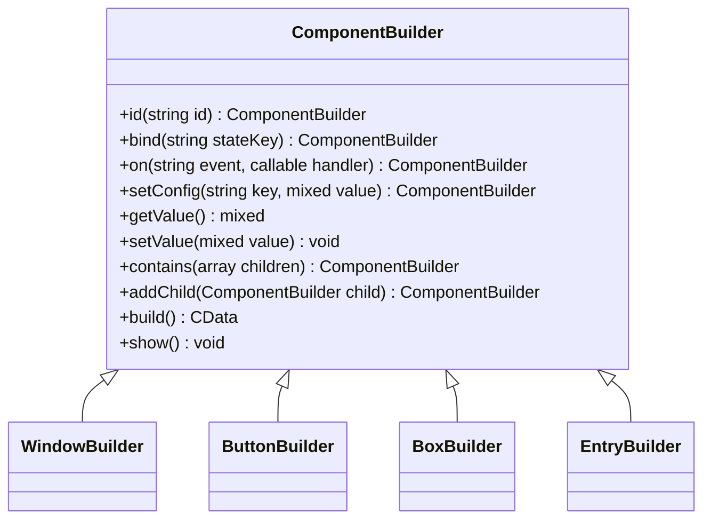
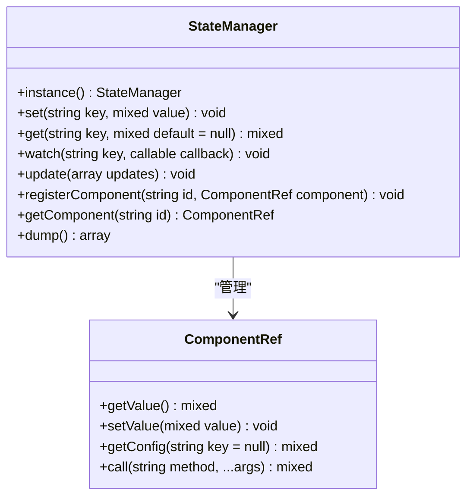
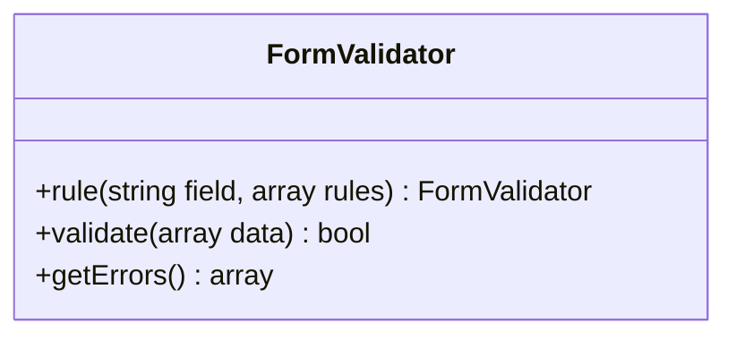

# API 参考

<cite>
**本文档中引用的文件**  
- [Builder.php](file://src/Builder.php)
- [ComponentBuilder.php](file://src/ComponentBuilder.php)
- [StateManager.php](file://src/State/StateManager.php)
- [FormValidator.php](file://src/Validation/FormValidator.php)
- [WindowBuilder.php](file://src/Components/WindowBuilder.php)
- [ButtonBuilder.php](file://src/Components/ButtonBuilder.php)
- [BoxBuilder.php](file://src/Components/BoxBuilder.php)
- [GridBuilder.php](file://src/Components/GridBuilder.php)
- [EntryBuilder.php](file://src/Components/EntryBuilder.php)
- [LabelBuilder.php](file://src/Components/LabelBuilder.php)
- [TableBuilder.php](file://src/Components/TableBuilder.php)
- [ComponentRef.php](file://src/State/ComponentRef.php)
- [FormTemplate.php](file://src/Templates/FormTemplate.php)
- [helper.php](file://src/helper.php)
</cite>

## 目录
1. [简介](#简介)
2. [静态工厂方法](#静态工厂方法)
3. [ComponentBuilder 基类方法](#componentbuilder-基类方法)
4. [StateManager API](#statemanager-api)
5. [FormValidator 验证规则](#formvalidator-验证规则)
6. [组件构建器链式调用方法](#组件构建器链式调用方法)
7. [模板与辅助功能](#模板与辅助功能)

## 简介
本API参考文档全面覆盖了libuiBuilder库的所有公共接口，为开发者提供精确的技术参考。文档详细描述了Builder类的静态工厂方法、ComponentBuilder基类的核心方法、StateManager状态管理机制、FormValidator验证系统以及各组件的链式配置能力。

**Section sources**
- [Builder.php](file://src/Builder.php#L1-L153)
- [ComponentBuilder.php](file://src/ComponentBuilder.php#L1-L234)

## 静态工厂方法
Builder类提供了创建各种UI组件的静态工厂方法，作为所有组件构建的入口点。

### 窗口组件
| 方法 | 参数 | 返回类型 | 说明 |
|------|------|----------|------|
| `window()` | `array $config = []` | `WindowBuilder` | 创建窗口组件，支持标题、尺寸等配置 |
| `vbox()` | `array $config = []` | `BoxBuilder` | 创建垂直布局容器 |
| `hbox()` | `array $config = []` | `BoxBuilder` | 创建水平布局容器 |
| `grid()` | `array $config = []` | `GridBuilder` | 创建网格布局容器 |
| `tab()` | `array $config = []` | `TabBuilder` | 创建标签页容器 |

### 控件组件
| 方法 | 参数 | 返回类型 | 说明 |
|------|------|----------|------|
| `button()` | `array $config = []` | `ButtonBuilder` | 创建按钮组件 |
| `label()` | `array $config = []` | `LabelBuilder` | 创建标签组件 |
| `entry()` | `array $config = []` | `EntryBuilder` | 创建单行输入框 |
| `checkbox()` | `array $config = []` | `CheckboxBuilder` | 创建复选框 |
| `combobox()` | `array $config = []` | `ComboboxBuilder` | 创建下拉选择框 |
| `table()` | `array $config = []` | `TableBuilder` | 创建表格组件 |
| `menu()` | 无参数 | `MenuBuilder` | 创建菜单组件 |
| `canvas()` | `array $config = []` | `CanvasBuilder` | 创建画布组件 |
| `separator()` | 无参数 | `SeparatorBuilder` | 创建分隔线 |

### 便捷方法
| 方法 | 参数 | 返回类型 | 说明 |
|------|------|----------|------|
| `passwordEntry()` | `array $config = []` | `EntryBuilder` | 创建密码输入框（自动设置password=true） |
| `editableCombobox()` | `array $config = []` | `ComboboxBuilder` | 创建可编辑的下拉框 |
| `textarea()` | `array $config = []` | `MultilineEntryBuilder` | 创建多行文本输入框（textarea别名） |
| `hSeparator()` | `array $config = []` | `SeparatorBuilder` | 创建水平分隔线 |
| `vSeparator()` | `array $config = []` | `SeparatorBuilder` | 创建垂直分隔线 |

**Section sources**
- [Builder.php](file://src/Builder.php#L1-L153)

## ComponentBuilder 基类方法
ComponentBuilder是所有组件构建器的抽象基类，提供了统一的API接口。

### 核心配置方法


**Diagram sources**
- [ComponentBuilder.php](file://src/ComponentBuilder.php#L1-L234)

### 方法详细说明
| 方法 | 参数 | 返回类型 | 行为描述 |
|------|------|----------|----------|
| `id()` | `string $id` | `static` | 设置组件唯一标识符，用于后续引用和状态绑定 |
| `bind()` | `string $stateKey` | `static` | 将组件值绑定到状态管理器的指定键，实现双向数据绑定 |
| `on()` | `string $event, callable $handler` | `static` | 注册事件处理器，支持click、change等事件 |
| `setConfig()` | `string $key, mixed $value` | `static` | 设置组件配置项，支持链式调用 |
| `__call()` | `string $name, array $args` | `static` | 魔术方法，允许通过方法名直接设置配置（如`text('标题')`） |
| `getValue()` | 无参数 | `mixed` | 获取组件当前值，子类可重写此方法 |
| `setValue()` | `mixed $value` | `void` | 设置组件值，子类可重写此方法 |
| `contains()` | `array $children` | `static` | 为容器组件添加多个子组件 |
| `addChild()` | `ComponentBuilder $child` | `static` | 为容器组件添加单个子组件 |
| `build()` | 无参数 | `CData` | 构建并返回原生控件句柄，延迟初始化 |
| `show()` | 无参数 | `void` | 显示组件（仅WindowBuilder实现） |

**Section sources**
- [ComponentBuilder.php](file://src/ComponentBuilder.php#L1-L234)

## StateManager API
StateManager提供全局状态管理功能，实现组件间的数据共享和响应式更新。



**Diagram sources**
- [StateManager.php](file://src/State/StateManager.php#L1-L91)
- [ComponentRef.php](file://src/State/ComponentRef.php#L1-L74)

### 方法签名与说明
| 方法 | 参数 | 返回类型 | 说明 |
|------|------|----------|------|
| `instance()` | 无参数 | `StateManager` | 获取StateManager单例实例 |
| `set()` | `string $key, mixed $value` | `void` | 设置状态值，触发所有监听器 |
| `get()` | `string $key, mixed $default = null` | `mixed` | 获取状态值，支持默认值 |
| `watch()` | `string $key, callable $callback` | `void` | 监听状态变化，回调函数接收新值、旧值和键名 |
| `update()` | `array $updates` | `void` | 批量更新多个状态值 |
| `registerComponent()` | `string $id, ComponentRef $component` | `void` | 注册组件引用，供跨组件访问 |
| `getComponent()` | `string $id` | `ComponentRef` | 获取指定ID的组件引用 |
| `dump()` | 无参数 | `array` | 导出所有状态（调试用途） |

**Section sources**
- [StateManager.php](file://src/State/StateManager.php#L1-L91)
- [ComponentRef.php](file://src/State/ComponentRef.php#L1-L74)

## FormValidator 验证规则
FormValidator提供表单验证功能，支持多种验证规则和错误处理。



**Diagram sources**
- [FormValidator.php](file://src/Validation/FormValidator.php#L1-L78)

### 支持的验证规则
| 规则 | 参数 | 错误消息 | 说明 |
|------|------|----------|------|
| `required` | `true` | "{field}不能为空" | 检查字段是否为空 |
| `min_length` | `int $length` | "{field}长度不能少于{length}位" | 检查字符串最小长度 |
| `email` | `true` | "{field}格式不正确" | 验证邮箱格式 |

### 错误处理机制
| 方法 | 参数 | 返回类型 | 说明 |
|------|------|----------|------|
| `rule()` | `string $field, array $rules` | `self` | 定义字段验证规则 |
| `validate()` | `array $data` | `bool` | 执行验证，返回结果 |
| `getErrors()` | 无参数 | `array` | 获取验证错误信息数组 |

验证流程：
1. 调用`rule()`方法定义各字段的验证规则
2. 在表单提交时调用`validate()`方法传入数据
3. 验证失败时通过`getErrors()`获取详细的错误信息
4. 验证成功后可安全处理表单数据

**Section sources**
- [FormValidator.php](file://src/Validation/FormValidator.php#L1-L78)

## 组件构建器链式调用方法
各组件构建器提供特定的链式调用方法，用于配置组件属性。

### WindowBuilder 方法
| 方法 | 参数 | 返回类型 | 说明 |
|------|------|----------|------|
| `title()` | `string $title` | `static` | 设置窗口标题 |
| `size()` | `int $width, int $height` | `static` | 设置窗口尺寸 |
| `onClosing()` | `callable $callback` | `static` | 设置窗口关闭事件处理器 |

### ButtonBuilder 方法
| 方法 | 参数 | 返回类型 | 说明 |
|------|------|----------|------|
| `text()` | `string $text` | `static` | 设置按钮文本 |
| `onClick()` | `callable $callback` | `static` | 设置点击事件处理器 |

### BoxBuilder 方法
| 方法 | 参数 | 返回类型 | 说明 |
|------|------|----------|------|
| `padded()` | `bool $padded = true` | `static` | 设置是否带内边距 |
| `stretchy()` | `bool $stretchy = true` | `static` | 设置子元素是否可拉伸 |

### EntryBuilder 方法
| 方法 | 参数 | 返回类型 | 说明 |
|------|------|----------|------|
| `text()` | `string $text` | `static` | 设置输入框文本 |
| `placeholder()` | `string $placeholder` | `static` | 设置占位符文本 |
| `onChange()` | `callable $callback` | `static` | 设置内容变化事件处理器 |

### GridBuilder 方法
| 方法 | 参数 | 返回类型 | 说明 |
|------|------|----------|------|
| `place()` | `ComponentBuilder $component, int $row, int $col, int $rowSpan = 1, int $colSpan = 1` | `GridItemBuilder` | 在指定位置放置组件 |
| `row()` | `array $components` | `static` | 在下一行添加组件（自动布局） |
| `form()` | `array $fields` | `static` | 快速创建表单布局 |
| `append()` | `array $components` | `static` | 在表单下方追加组件 |

**Section sources**
- [WindowBuilder.php](file://src/Components/WindowBuilder.php#L1-L96)
- [ButtonBuilder.php](file://src/Components/ButtonBuilder.php#L1-L48)
- [BoxBuilder.php](file://src/Components/BoxBuilder.php#L1-L64)
- [GridBuilder.php](file://src/Components/GridBuilder.php#L1-L120)
- [EntryBuilder.php](file://src/Components/EntryBuilder.php#L1-L80)

## 模板与辅助功能
提供预定义模板和辅助函数，简化常见UI模式的创建。

### FormTemplate
```php
// 创建表单模板
$userForm = FormTemplate::create([
    ['label' => '用户名', 'type' => 'text', 'placeholder' => '请输入用户名'],
    ['label' => '密码', 'type' => 'password', 'placeholder' => '请输入密码'],
    ['label' => '记住我', 'type' => 'checkbox', 'text' => '下次自动登录'],
]);
```

支持的字段类型：`text`、`password`、`checkbox`、`combobox`

### 辅助函数
- `calculateStrength($password)`：计算密码强度，返回"弱"、"中"、"强"

**Section sources**
- [FormTemplate.php](file://src/Templates/FormTemplate.php#L1-L46)
- [helper.php](file://src/helper.php#L1-L59)