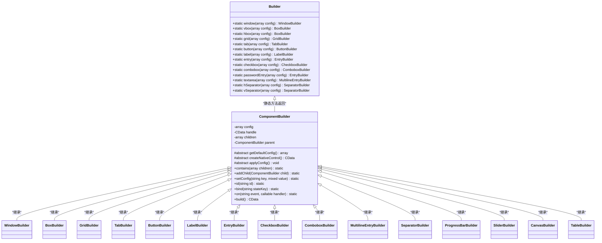
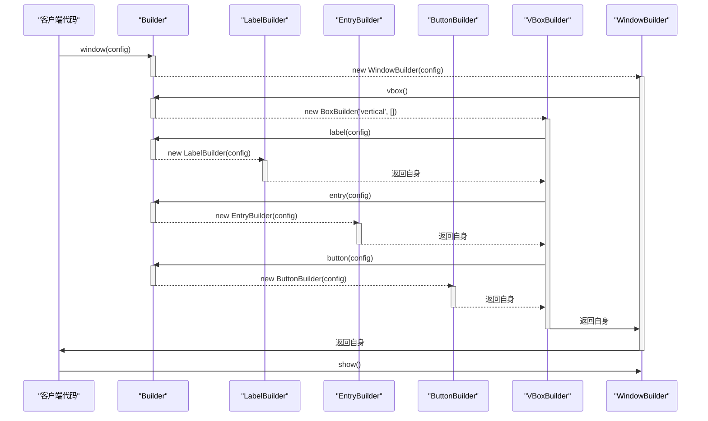

# Builder API

<cite>
**本文档引用的文件**
- [Builder.php](file://src/Builder.php)
- [ComponentBuilder.php](file://src/ComponentBuilder.php)
- [WindowBuilder.php](file://src/Components/WindowBuilder.php)
- [BoxBuilder.php](file://src/Components/BoxBuilder.php)
- [GridBuilder.php](file://src/Components/GridBuilder.php)
- [TabBuilder.php](file://src/Builder/TabBuilder.php)
- [ButtonBuilder.php](file://src/Components/ButtonBuilder.php)
- [LabelBuilder.php](file://src/Components/LabelBuilder.php)
- [EntryBuilder.php](file://src/Components/EntryBuilder.php)
- [CheckboxBuilder.php](file://src/Components/CheckboxBuilder.php)
- [ComboboxBuilder.php](file://src/Components/ComboboxBuilder.php)
- [RadioBuilder.php](file://src/Components/RadioBuilder.php)
- [MultilineEntryBuilder.php](file://src/Components/MultilineEntryBuilder.php)
- [SeparatorBuilder.php](file://src/Components/SeparatorBuilder.php)
- [ProgressBarBuilder.php](file://src/Components/ProgressBarBuilder.php)
- [SliderBuilder.php](file://src/Components/SliderBuilder.php)
- [CanvasBuilder.php](file://src/Components/CanvasBuilder.php)
- [TableBuilder.php](file://src/Components/TableBuilder.php)
</cite>

## 目录
1. [简介](#简介)
2. [核心设计原理](#核心设计原理)
3. [容器组件创建方法](#容器组件创建方法)
4. [基础控件创建方法](#基础控件创建方法)
5. [便捷方法](#便捷方法)
6. [方法调用关系图](#方法调用关系图)
7. [典型使用场景](#典型使用场景)

## 简介

`Builder` 类是 libuiBuilder 库的核心入口点，提供了一组静态工厂方法来创建各种 UI 组件。它采用流畅的链式调用设计模式，允许开发者以声明式的方式构建复杂的用户界面。每个静态方法返回相应的 `Builder` 子类实例，这些实例继承了 `ComponentBuilder` 的通用功能，如配置设置、事件处理、状态绑定和子组件管理。

**Section sources**
- [Builder.php](file://src/Builder.php#L27-L153)
- [ComponentBuilder.php](file://src/ComponentBuilder.php#L11-L234)

## 核心设计原理

`Builder` 类作为组件工厂的统一入口，其核心设计基于以下原则：

1. **静态工厂模式**：通过静态方法创建并返回具体的 `Builder` 实例，隐藏了对象创建的复杂性。
2. **链式调用**：所有配置方法（如 `text()`, `size()`）都返回 `this`，允许方法链式调用，使代码更简洁易读。
3. **抽象基类**：`ComponentBuilder` 定义了所有组件的通用行为，如配置管理、事件处理和构建逻辑。
4. **延迟构建**：组件的原生句柄（handle）在 `build()` 方法被调用时才创建，允许在构建前进行任意配置。



**Diagram sources**
- [Builder.php](file://src/Builder.php#L27-L153)
- [ComponentBuilder.php](file://src/ComponentBuilder.php#L11-L234)

## 容器组件创建方法

容器组件用于组织和布局其他 UI 元素。`Builder` 类提供了创建各种容器的方法。

### window

创建一个窗口容器。

- **参数**：`config` (array) - 配置数组，可包含 `title`, `width`, `height`, `margined`, `onClosing` 等选项。
- **返回类型**：`WindowBuilder`
- **使用示例**：
  ```php
  $window = Builder::window(['title' => '我的应用', 'width' => 800, 'height' => 600]);
  ```

**Section sources**
- [Builder.php](file://src/Builder.php#L30-L33)
- [WindowBuilder.php](file://src/Components/WindowBuilder.php#L13-L96)

### vbox

创建一个垂直盒子容器。

- **参数**：`config` (array) - 配置数组，可包含 `padded` 选项。
- **返回类型**：`BoxBuilder`
- **使用示例**：
  ```php
  $vbox = Builder::vbox(['padded' => true]);
  ```

**Section sources**
- [Builder.php](file://src/Builder.php#L36-L39)
- [BoxBuilder.php](file://src/Components/BoxBuilder.php#L13-L64)

### hbox

创建一个水平盒子容器。

- **参数**：`config` (array) - 配置数组，可包含 `padded` 选项。
- **返回类型**：`BoxBuilder`
- **使用示例**：
  ```php
  $hbox = Builder::hbox(['padded' => false]);
  ```

**Section sources**
- [Builder.php](file://src/Builder.php#L41-L44)
- [BoxBuilder.php](file://src/Components/BoxBuilder.php#L13-L64)

### grid

创建一个网格容器。

- **参数**：`config` (array) - 配置数组，可包含 `padded` 选项。
- **返回类型**：`GridBuilder`
- **使用示例**：
  ```php
  $grid = Builder::grid(['padded' => true]);
  ```

**Section sources**
- [Builder.php](file://src/Builder.php#L46-L49)
- [GridBuilder.php](file://src/Components/GridBuilder.php#L13-L120)

### tab

创建一个标签页容器。

- **参数**：`config` (array) - 配置数组，可包含 `selectedIndex`, `onTabSelected` 选项。
- **返回类型**：`TabBuilder`
- **使用示例**：
  ```php
  $tab = Builder::tab(['selectedIndex' => 0]);
  ```

**Section sources**
- [Builder.php](file://src/Builder.php#L51-L54)
- [TabBuilder.php](file://src/Builder/TabBuilder.php#L14-L106)

## 基础控件创建方法

基础控件是用户界面中的交互元素。

### button

创建一个按钮控件。

- **参数**：`config` (array) - 配置数组，可包含 `text`, `onClick` 选项。
- **返回类型**：`ButtonBuilder`
- **使用示例**：
  ```php
  $button = Builder::button(['text' => '点击我', 'onClick' => function($btn, $state) { /* 处理点击 */ }]);
  ```

**Section sources**
- [Builder.php](file://src/Builder.php#L57-L60)
- [ButtonBuilder.php](file://src/Components/ButtonBuilder.php#L11-L48)

### label

创建一个标签控件。

- **参数**：`config` (array) - 配置数组，可包含 `text`, `align`, `color` 选项。
- **返回类型**：`LabelBuilder`
- **使用示例**：
  ```php
  $label = Builder::label(['text' => '用户名:', 'align' => 'right']);
  ```

**Section sources**
- [Builder.php](file://src/Builder.php#L62-L65)
- [LabelBuilder.php](file://src/Components/LabelBuilder.php#L11-L62)

### entry

创建一个单行文本输入框。

- **参数**：`config` (array) - 配置数组，可包含 `text`, `placeholder`, `readOnly`, `onChange` 选项。
- **返回类型**：`EntryBuilder`
- **使用示例**：
  ```php
  $entry = Builder::entry(['placeholder' => '请输入用户名']);
  ```

**Section sources**
- [Builder.php](file://src/Builder.php#L67-L70)
- [EntryBuilder.php](file://src/Components/EntryBuilder.php#L11-L80)

### checkbox

创建一个复选框控件。

- **参数**：`config` (array) - 配置数组，可包含 `text`, `checked`, `onToggle`, `onChange` 选项。
- **返回类型**：`CheckboxBuilder`
- **使用示例**：
  ```php
  $checkbox = Builder::checkbox(['text' => '记住我', 'checked' => true]);
  ```

**Section sources**
- [Builder.php](file://src/Builder.php#L72-L75)
- [CheckboxBuilder.php](file://src/Components/CheckboxBuilder.php#L11-L97)

### combobox

创建一个下拉组合框。

- **参数**：`config` (array) - 配置数组，可包含 `items`, `selected`, `editable`, `onSelected`, `onChange` 选项。
- **返回类型**：`ComboboxBuilder`
- **使用示例**：
  ```php
  $combobox = Builder::combobox(['items' => ['选项1', '选项2', '选项3'], 'selected' => 0]);
  ```

**Section sources**
- [Builder.php](file://src/Builder.php#L77-L80)
- [ComboboxBuilder.php](file://src/Components/ComboboxBuilder.php#L12-L258)

### radio

创建一个单选按钮组。

- **参数**：`config` (array) - 配置数组，可包含 `items`, `selected`, `onSelected` 选项。
- **返回类型**：`RadioBuilder`
- **使用示例**：
  ```php
  $radio = Builder::radio(['items' => ['男', '女'], 'selected' => 0]);
  ```

**Section sources**
- [Builder.php](file://src/Builder.php#L149-L152)
- [RadioBuilder.php](file://src/Components/RadioBuilder.php#L11-L80)

## 便捷方法

`Builder` 类提供了一系列便捷方法，用于快速创建常用控件。

### passwordEntry

创建一个密码输入框（单行文本框，输入内容隐藏）。

- **参数**：`config` (array) - 配置数组。
- **返回类型**：`EntryBuilder`
- **使用示例**：
  ```php
  $password = Builder::passwordEntry(['placeholder' => '请输入密码']);
  ```

**Section sources**
- [Builder.php](file://src/Builder.php#L83-L86)

### textarea

创建一个多行文本区域。

- **参数**：`config` (array) - 配置数组，可包含 `text`, `wordWrap`, `readOnly`, `placeholder`, `onChange` 选项。
- **返回类型**：`MultilineEntryBuilder`
- **使用示例**：
  ```php
  $textarea = Builder::textarea(['placeholder' => '请输入描述...']);
  ```

**Section sources**
- [Builder.php](file://src/Builder.php#L129-L132)
- [MultilineEntryBuilder.php](file://src/Components/MultilineEntryBuilder.php#L11-L86)

### hSeparator

创建一个水平分隔线。

- **参数**：`config` (array) - 配置数组。
- **返回类型**：`SeparatorBuilder`
- **使用示例**：
  ```php
  $hSep = Builder::hSeparator();
  ```

**Section sources**
- [Builder.php](file://src/Builder.php#L114-L117)
- [SeparatorBuilder.php](file://src/Components/SeparatorBuilder.php#L14-L65)

### vSeparator

创建一个垂直分隔线。

- **参数**：`config` (array) - 配置数组。
- **返回类型**：`SeparatorBuilder`
- **使用示例**：
  ```php
  $vSep = Builder::vSeparator();
  ```

**Section sources**
- [Builder.php](file://src/Builder.php#L119-L122)
- [SeparatorBuilder.php](file://src/Components/SeparatorBuilder.php#L14-L65)

## 方法调用关系图

以下序列图展示了通过 `Builder` API 构建一个包含标签、输入框和按钮的简单表单的典型流程。



**Diagram sources**
- [Builder.php](file://src/Builder.php#L30-L153)
- [WindowBuilder.php](file://src/Components/WindowBuilder.php#L73-L78)
- [BoxBuilder.php](file://src/Components/BoxBuilder.php#L36-L45)

## 典型使用场景

### 构建响应式网格布局

利用 `grid()` 方法和 `form()` 模板方法可以快速创建表单布局。

```php
$grid = Builder::grid()
    ->form([
        ['label' => Builder::label(['text' => '姓名:']), 'control' => Builder::entry()],
        ['label' => Builder::label(['text' => '邮箱:']), 'control' => Builder::entry()],
        ['label' => Builder::label(['text' => '密码:']), 'control' => Builder::passwordEntry()]
    ])
    ->append([
        Builder::hbox()
            ->contains([
                Builder::button(['text' => '提交'])->on('click', $submitHandler),
                Builder::button(['text' => '取消'])->on('click', $cancelHandler)
            ])
    ]);
```

### 创建多标签页界面

使用 `tab()` 方法可以轻松创建包含多个页面的界面。

```php
$tab = Builder::tab()
    ->tab('用户管理', Builder::vbox()->contains([...]))
    ->tab('系统设置', Builder::vbox()->contains([...]))
    ->selected(0)
    ->onTabSelected(function($index, $tab) {
        echo "切换到标签页: $index\n";
    });
```

### 构建数据可视化界面

结合 `canvas()` 和 `table()` 可以创建数据展示和交互界面。

```php
$window = Builder::window(['title' => '数据仪表盘'])
    ->contains(
        Builder::hbox()
            ->contains([
                Builder::canvas(['width' => 400, 'height' => 300])
                    ->rect(50, 50, 100, 80, [1, 0, 0, 1])
                    ->text('图表', 60, 40),
                Builder::vbox()
                    ->contains([
                        Builder::label(['text' => '数据列表']),
                        Builder::table(['columns' => ['ID', '名称'], 'data' => $data])
                    ])
            ])
    );
```

**Section sources**
- [GridBuilder.php](file://src/Components/GridBuilder.php#L80-L89)
- [TabBuilder.php](file://src/Builder/TabBuilder.php#L65-L81)
- [CanvasBuilder.php](file://src/Components/CanvasBuilder.php#L108-L147)
- [TableBuilder.php](file://src/Components/TableBuilder.php#L135-L143)