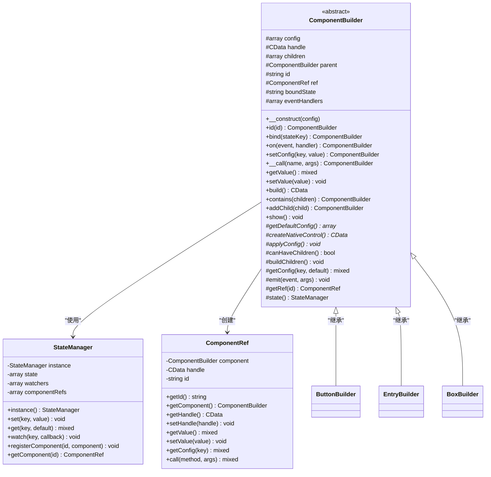
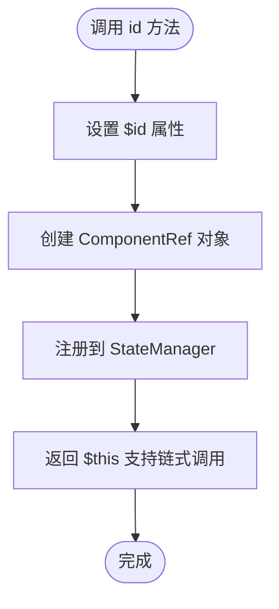
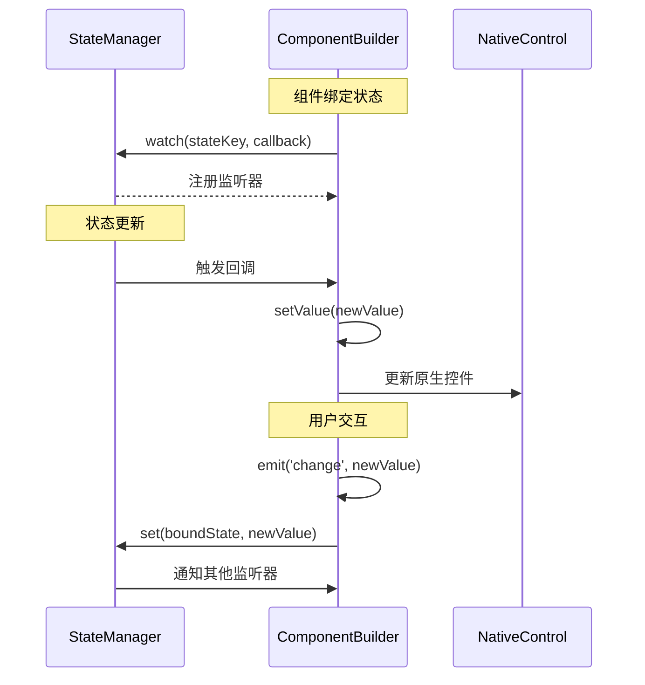
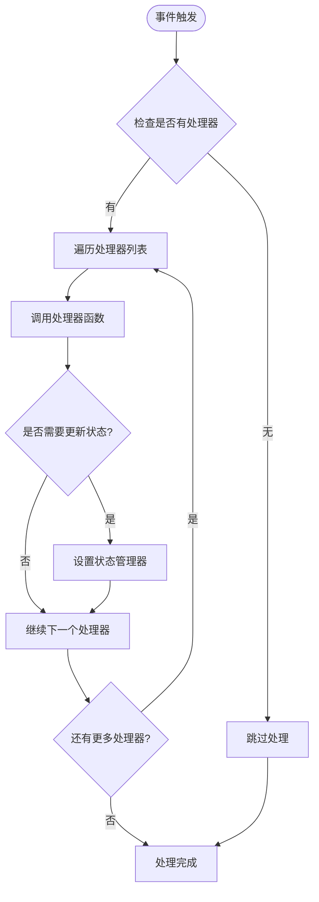
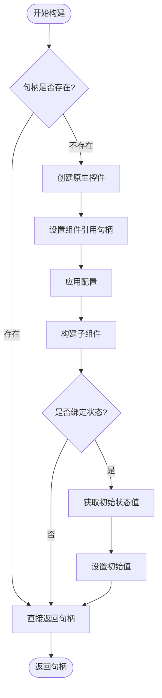

# ComponentBuilder 基类 API 文档

<cite>
**本文档中引用的文件**
- [ComponentBuilder.php](file://src/ComponentBuilder.php)
- [Builder.php](file://src/Builder.php)
- [StateManager.php](file://src/State/StateManager.php)
- [ComponentRef.php](file://src/State/ComponentRef.php)
- [ButtonBuilder.php](file://src/Components/ButtonBuilder.php)
- [EntryBuilder.php](file://src/Components/EntryBuilder.php)
- [BoxBuilder.php](file://src/Components/BoxBuilder.php)
- [simple.php](file://example/simple.php)
- [full.php](file://example/full.php)
</cite>

## 目录
1. [简介](#简介)
2. [类结构概览](#类结构概览)
3. [核心属性](#核心属性)
4. [构造函数](#构造函数)
5. [抽象方法](#抽象方法)
6. [组件标识与引用](#组件标识与引用)
7. [数据绑定机制](#数据绑定机制)
8. [事件系统](#事件系统)
9. [配置管理](#配置管理)
10. [组件树管理](#组件树管理)
11. [状态管理集成](#状态管理集成)
12. [实际使用示例](#实际使用示例)
13. [最佳实践](#最佳实践)

## 简介

ComponentBuilder 是 libuiBuilder 框架的核心抽象基类，为所有 UI 组件提供了统一的构建接口。它实现了组件生命周期管理、数据绑定、事件处理和状态同步等核心功能，是整个框架架构的基础。

该基类采用链式调用设计模式，支持流畅的组件配置语法，并通过抽象方法强制子类实现特定的原生控件创建和配置逻辑。

## 类结构概览



**图表来源**
- [ComponentBuilder.php](file://src/ComponentBuilder.php#L11-L234)
- [StateManager.php](file://src/State/StateManager.php#L8-L91)
- [ComponentRef.php](file://src/State/ComponentRef.php#L11-L74)

## 核心属性

ComponentBuilder 基类维护以下核心属性来管理组件状态：

| 属性 | 类型 | 描述 | 默认值 |
|------|------|------|--------|
| `$config` | `array` | 组件配置项集合 | `[]` |
| `$handle` | `CData \| null` | 原生控件句柄 | `null` |
| `$children` | `array` | 子组件数组 | `[]` |
| `$parent` | `ComponentBuilder \| null` | 父组件引用 | `null` |
| `$id` | `string \| null` | 组件唯一标识符 | `null` |
| `$ref` | `ComponentRef \| null` | 组件引用对象 | `null` |
| `$boundState` | `string \| null` | 绑定的状态键名 | `null` |
| `$eventHandlers` | `array` | 事件处理器映射表 | `[]` |

**节来源**
- [ComponentBuilder.php](file://src/ComponentBuilder.php#L13-L22)

## 构造函数

### 方法签名
```php
public function __construct(array $config = [])
```

### 参数说明
- `array $config`：初始化配置数组，将与默认配置合并

### 功能描述
构造函数负责初始化组件的基本配置，通过合并默认配置和传入的配置参数来设置组件的初始状态。

### 实现细节
1. 调用 `getDefaultConfig()` 获取子类定义的默认配置
2. 使用 `array_merge()` 合并默认配置和传入配置
3. 将合并后的配置赋值给 `$config` 属性

**节来源**
- [ComponentBuilder.php](file://src/ComponentBuilder.php#L25-L28)

## 抽象方法

ComponentBuilder 强制子类实现三个核心抽象方法，确保每个组件都能正确创建和配置原生控件：

### getDefaultConfig()

#### 方法签名
```php
abstract protected function getDefaultConfig(): array
```

#### 返回值
- `array`：包含组件默认配置项的关联数组

#### 功能描述
定义组件的默认配置，包括初始值、样式设置、行为参数等。每个子类必须实现此方法来提供其特有的默认配置。

#### 实现示例
- [ButtonBuilder 默认配置](file://src/Components/ButtonBuilder.php#L11-L17)
- [EntryBuilder 默认配置](file://src/Components/EntryBuilder.php#L11-L18)
- [BoxBuilder 默认配置](file://src/Components/BoxBuilder.php#L21-L26)

### createNativeControl()

#### 方法签名
```php
abstract protected function createNativeControl(): CData
```

#### 返回值
- `CData`：指向原生控件的 FFI 句柄

#### 功能描述
创建并返回组件对应的原生控件实例。子类必须实现此方法来创建具体的 UI 控件。

#### 实现示例
- [ButtonBuilder 原生控件创建](file://src/Components/ButtonBuilder.php#L20-L23)
- [EntryBuilder 原生控件创建](file://src/Components/EntryBuilder.php#L20-L23)
- [BoxBuilder 原生控件创建](file://src/Components/BoxBuilder.php#L29-L34)

### applyConfig()

#### 方法签名
```php
abstract protected function applyConfig(): void
```

#### 参数
无

#### 返回值
- `void`

#### 功能描述
将配置应用到已创建的原生控件上，设置控件的各种属性和行为。子类必须实现此方法来配置具体的控件特性。

#### 实现示例
- [ButtonBuilder 配置应用](file://src/Components/ButtonBuilder.php#L25-L36)
- [EntryBuilder 配置应用](file://src/Components/EntryBuilder.php#L25-L50)
- [BoxBuilder 配置应用](file://src/Components/BoxBuilder.php#L36-L40)

## 组件标识与引用

### id() 方法

#### 方法签名
```php
public function id(string $id): static
```

#### 参数说明
- `string $id`：组件的唯一标识符

#### 返回值
- `static`：返回当前组件实例以支持链式调用

#### 功能描述
为组件设置唯一标识符，使其能够在状态管理系统中被引用。同时创建组件引用对象并注册到全局状态管理器。

#### 实现流程



**图表来源**
- [ComponentBuilder.php](file://src/ComponentBuilder.php#L125-L130)

#### 异常处理
- 不抛出异常：ID 设置失败不会中断程序执行
- 覆盖机制：相同 ID 的组件会覆盖之前的引用

#### 使用示例
```php
// 在简单示例中的使用
Builder::entry()
    ->id('nameEntry')
    ->placeholder('请输入您的姓名');

// 在完整示例中的使用
Builder::button()
    ->id('submitBtn')
    ->onClick(function ($button) {
        // 通过 ID 获取其他组件
        $name = StateManager::instance()->getComponent('nameEntry')->getValue();
    });
```

**节来源**
- [ComponentBuilder.php](file://src/ComponentBuilder.php#L125-L130)
- [simple.php](file://example/simple.php#L18-L28)
- [full.php](file://example/full.php#L34-L38)

## 数据绑定机制

### bind() 方法

#### 方法签名
```php
public function bind(string $stateKey): static
```

#### 参数说明
- `string $stateKey`：要绑定的状态键名

#### 返回值
- `static`：返回当前组件实例以支持链式调用

#### 功能描述
建立组件与状态管理系统的双向数据绑定关系。当状态发生变化时，组件自动更新；当组件值改变时，状态也相应更新。

#### 绑定机制流程



**图表来源**
- [ComponentBuilder.php](file://src/ComponentBuilder.php#L136-L146)
- [StateManager.php](file://src/State/StateManager.php#L49-L56)

#### 实现细节
1. **状态监听**：注册状态变化监听器，自动响应状态更新
2. **初始值设置**：从状态管理器获取初始值并应用到组件
3. **双向同步**：事件触发时自动更新状态管理器

#### 异常处理
- 状态键不存在：不会抛出异常，使用默认值或空值
- 循环依赖：框架层面防止无限循环更新

#### 使用示例
```php
// 在简单示例中的使用
Builder::entry()
    ->id('nameEntry')
    ->bind('userName'); // 绑定到状态管理器

// 状态管理器使用
StateManager::instance()->set('userName', '张三');
// 组件自动更新为"张三"

// 修改组件值会自动更新状态
// StateManager::instance()->get('userName') 现在为"新值"
```

**节来源**
- [ComponentBuilder.php](file://src/ComponentBuilder.php#L136-L146)
- [simple.php](file://example/simple.php#L26-L36)

## 事件系统

### on() 方法

#### 方法签名
```php
public function on(string $event, callable $handler): static
```

#### 参数说明
- `string $event`：事件类型名称
- `callable $handler`：事件处理器函数

#### 返回值
- `static`：返回当前组件实例以支持链式调用

#### 功能描述
注册事件处理器，支持多种内置事件类型的监听。

#### 支持的事件类型

| 事件类型 | 触发时机 | 参数 | 描述 |
|----------|----------|------|------|
| `'click'` | 用户点击 | `$component, $stateManager` | 按钮点击事件 |
| `'change'` | 值改变 | `$newValue, $component` | 输入框值变化 |
| `'selected'` | 项目选择 | `$index, $item, $component` | 下拉框选择事件 |
| `'toggle'` | 状态切换 | `$checked, $component` | 复选框状态变化 |

#### 事件处理流程



**图表来源**
- [ComponentBuilder.php](file://src/ComponentBuilder.php#L151-L158)
- [ComponentBuilder.php](file://src/ComponentBuilder.php#L160-L175)

#### emit() 方法

#### 方法签名
```php
protected function emit(string $event, ...$args): void
```

#### 参数说明
- `string $event`：事件类型
- `...$args`：传递给处理器的参数

#### 返回值
- `void`

#### 功能描述
触发指定事件，调用所有注册的事件处理器，并根据事件类型决定是否更新状态管理器。

#### 自动状态更新机制
对于 `'change'` 事件，组件会自动将当前值更新到绑定的状态键中。

#### 使用示例
```php
// 按钮点击事件
Builder::button()
    ->onClick(function ($button, $stateManager) {
        // 处理点击逻辑
        echo "按钮被点击了！";
    });

// 输入框变化事件  
Builder::entry()
    ->onChange(function ($value, $component) {
        // 处理值变化
        echo "输入值变为: {$value}";
    });

// 复选框状态事件
Builder::checkbox()
    ->onToggle(function ($checked, $component) {
        if ($checked) {
            echo "已选中";
        } else {
            echo "未选中";
        }
    });
```

**节来源**
- [ComponentBuilder.php](file://src/ComponentBuilder.php#L151-L175)
- [ButtonBuilder.php](file://src/Components/ButtonBuilder.php#L44-L47)
- [EntryBuilder.php](file://src/Components/EntryBuilder.php#L76-L79)

## 配置管理

### setConfig() 方法

#### 方法签名
```php
public function setConfig(string $key, $value): static
```

#### 参数说明
- `string $key`：配置项键名
- `$value`：配置项值

#### 返回值
- `static`：返回当前组件实例以支持链式调用

#### 功能描述
设置单个配置项，支持链式调用的流畅配置语法。

#### 使用示例
```php
Builder::button()
    ->setConfig('text', '确认')
    ->setConfig('disabled', false)
    ->setConfig('stretchy', true);
```

### __call() 方法（链式调用）

#### 方法签名
```php
public function __call(string $name, array $args): static
```

#### 参数说明
- `string $name`：方法名（对应配置项键名）
- `array $args`：参数数组（通常只有一个元素）

#### 返回值
- `static`：返回当前组件实例以支持链式调用

#### 功能描述
魔术方法实现链式调用配置，允许直接通过方法名设置配置项，提供更简洁的 API。

#### 实现逻辑
```php
if (count($args) === 1) {
    $this->setConfig($name, $args[0]);
}
return $this;
```

#### 使用示例
```php
// 链式调用配置
Builder::entry()
    ->text('默认文本')
    ->placeholder('占位符文本')
    ->maxLength(50)
    ->readOnly(false);

// 等价于
Builder::entry()
    ->setConfig('text', '默认文本')
    ->setConfig('placeholder', '占位符文本')
    ->setConfig('maxLength', 50)
    ->setConfig('readOnly', false);
```

### getValue() 和 setValue()

#### getValue() 方法
##### 方法签名
```php
public function getValue()
```

##### 返回值
- `mixed`：组件的当前值

##### 功能描述
获取组件的当前值，具体实现由子类根据控件类型定义。

#### setValue() 方法
##### 方法签名
```php
public function setValue($value): void
```

##### 参数说明
- `$value`：要设置的新值

##### 返回值
- `void`

##### 功能描述
设置组件的值，通常会触发配置更新和可能的重新渲染。

#### 使用示例
```php
// 获取组件值
$name = StateManager::instance()->getComponent('nameEntry')->getValue();

// 设置组件值
StateManager::instance()->getComponent('nameEntry')->setValue('李四');

// 在事件处理中使用
Builder::entry()
    ->onChange(function ($value, $component) {
        // 更新其他组件
        $welcomeLabel = StateManager::instance()->getComponent('welcomeLabel');
        $welcomeLabel->setValue("欢迎, {$value}!");
    });
```

**节来源**
- [ComponentBuilder.php](file://src/ComponentBuilder.php#L105-L119)
- [ComponentBuilder.php](file://src/ComponentBuilder.php#L180-L191)
- [EntryBuilder.php](file://src/Components/EntryBuilder.php#L53-L64)

## 组件树管理

### contains() 方法

#### 方法签名
```php
public function contains(array $children): static
```

#### 参数说明
- `array $children`：子组件数组

#### 返回值
- `static`：返回当前组件实例以支持链式调用

#### 功能描述
批量添加子组件到容器组件中。

#### 实现细节
- 遍历子组件数组
- 调用 `addChild()` 方法添加每个子组件
- 支持嵌套组件结构

### addChild() 方法

#### 方法签名
```php
public function addChild(ComponentBuilder $child): static
```

#### 参数说明
- `ComponentBuilder $child`：要添加的子组件

#### 返回值
- `static`：返回当前组件实例以支持链式调用

#### 功能描述
添加单个子组件到当前组件中。

#### 异常处理
- `InvalidArgumentException`：如果当前组件不支持子组件（默认情况下大多数组件都不支持）

#### canHaveChildren() 方法

#### 方法签名
```php
protected function canHaveChildren(): bool
```

#### 返回值
- `bool`：是否可以包含子组件

#### 功能描述
判断当前组件是否支持子组件，默认返回 `false`，容器组件重写此方法返回 `true`。

### buildChildren() 方法

#### 方法签名
```php
protected function buildChildren(): void
```

#### 参数
无

#### 返回值
- `void`

#### 功能描述
构建所有子组件，容器组件重写此方法实现子组件的创建和布局。

#### 使用示例
```php
// 容器组件示例
class BoxBuilder extends ComponentBuilder {
    protected function canHaveChildren(): bool {
        return true;
    }
    
    protected function buildChildren(): void {
        foreach ($this->children as $child) {
            $childHandle = $child->build();
            Box::append($this->handle, $childHandle, $child->getConfig('stretchy'));
        }
    }
}
```

**节来源**
- [ComponentBuilder.php](file://src/ComponentBuilder.php#L48-L68)
- [ComponentBuilder.php](file://src/ComponentBuilder.php#L73-L84)
- [BoxBuilder.php](file://src/Components/BoxBuilder.php#L41-L53)

## 状态管理集成

### 状态管理器访问

#### state() 方法

#### 方法签名
```php
protected function state(): StateManager
```

#### 返回值
- `StateManager`：状态管理器实例

#### 功能描述
获取状态管理器实例，用于访问全局状态和组件引用。

### 组件引用系统

#### getRef() 方法

#### 方法签名
```php
protected function getRef(string $id): ?ComponentRef
```

#### 参数说明
- `string $id`：目标组件的 ID

#### 返回值
- `ComponentRef \| null`：组件引用对象或 null（如果不存在）

#### 功能描述
获取指定 ID 的组件引用，支持跨组件通信和数据访问。

#### 组件引用功能

| 方法 | 功能 | 使用场景 |
|------|------|----------|
| `getValue()` | 获取组件值 | 数据读取 |
| `setValue(value)` | 设置组件值 | 数据写入 |
| `getConfig(key)` | 获取配置 | 配置查询 |
| `call(method, args)` | 调用组件方法 | 功能调用 |
| `getHandle()` | 获取原生句柄 | 原生操作 |

#### 使用示例
```php
// 在事件处理器中访问其他组件
Builder::button()
    ->onClick(function ($button, $stateManager) {
        // 获取其他组件的引用
        $nameEntry = $stateManager->getComponent('nameEntry');
        $passwordEntry = $stateManager->getComponent('passwordEntry');
        
        // 访问组件值
        $name = $nameEntry->getValue();
        $password = $passwordEntry->getValue();
        
        // 设置组件值
        $stateManager->getComponent('resultLabel')->setValue("验证结果: 成功");
    });

// 直接修改其他组件状态
Builder::checkbox()
    ->onToggle(function ($checked, $component) {
        $submitButton = StateManager::instance()->getComponent('submitBtn');
        if ($submitButton) {
            $submitButton->getComponent()->setConfig('disabled', !$checked);
        }
    });
```

**节来源**
- [ComponentBuilder.php](file://src/ComponentBuilder.php#L204-L207)
- [ComponentBuilder.php](file://src/ComponentBuilder.php#L196-L199)
- [ComponentRef.php](file://src/State/ComponentRef.php#L46-L73)
- [simple.php](file://example/simple.php#L76-L82)

## 构建过程

### build() 方法

#### 方法签名
```php
public function build(): CData
```

#### 返回值
- `CData`：原生控件句柄

#### 功能描述
构建组件的完整生命周期，包括原生控件创建、配置应用、子组件构建和状态初始化。

#### 构建流程



**图表来源**
- [ComponentBuilder.php](file://src/ComponentBuilder.php#L209-L231)

#### 实现细节
1. **句柄缓存**：避免重复创建原生控件
2. **引用设置**：为组件引用设置正确的原生句柄
3. **配置应用**：调用子类的 `applyConfig()` 方法
4. **状态初始化**：绑定状态下设置初始值
5. **子组件构建**：递归构建所有子组件

#### 使用示例
```php
// 构建完整的组件树
$app = Builder::window()
    ->title('我的应用')
    ->size(800, 600)
    ->contains([
        Builder::vbox()
            ->contains([
                Builder::label()->text('标题'),
                Builder::entry()->id('input'),
                Builder::button()->text('提交')
            ])
    ]);

// 调用 build() 开始构建过程
$nativeHandle = $app->build();
```

**节来源**
- [ComponentBuilder.php](file://src/ComponentBuilder.php#L209-L231)

## 实际使用示例

### 基础组件使用

以下展示了 ComponentBuilder 在实际项目中的典型使用模式：

#### 简单表单示例
```php
// 创建带绑定的输入框
$nameEntry = Builder::entry()
    ->id('nameEntry')
    ->placeholder('请输入姓名')
    ->bind('userName')
    ->onChange(function ($value, $component) {
        // 实时验证和反馈
        $welcomeLabel = StateManager::instance()->getComponent('welcomeLabel');
        if ($welcomeLabel) {
            $text = empty($value) ? '请输入姓名' : "您好, {$value}!";
            $welcomeLabel->setValue($text);
        }
    });

// 创建带事件处理的按钮
$submitButton = Builder::button()
    ->id('submitBtn')
    ->text('提交')
    ->onClick(function ($button) {
        // 收集表单数据
        $name = StateManager::instance()->getComponent('nameEntry')->getValue();
        // 处理提交逻辑
    });
```

#### 复杂组件树示例
```php
// 创建嵌套的组件结构
$container = Builder::vbox()
    ->padded(true)
    ->contains([
        Builder::label()->text('用户信息'),
        Builder::grid()->form([
            [
                'label' => Builder::label()->text('姓名:'),
                'control' => Builder::entry()
                    ->id('name')
                    ->bind('userInfo.name')
                    ->onChange(function ($value, $component) {
                        // 更新相关组件
                        $statusLabel = StateManager::instance()->getComponent('status');
                        $statusLabel->setValue("姓名已更新");
                    })
            ],
            [
                'label' => Builder::label()->text('年龄:'),
                'control' => Builder::spinbox()
                    ->id('age')
                    ->range(0, 150)
                    ->bind('userInfo.age')
            ]
        ]),
        Builder::hbox()->contains([
            Builder::button()
                ->text('保存')
                ->onClick(function ($button) {
                    // 保存数据
                    $name = StateManager::instance()->getComponent('name')->getValue();
                    $age = StateManager::instance()->getComponent('age')->getValue();
                    // 调用保存逻辑
                }),
            Builder::button()
                ->text('重置')
                ->onClick(function ($button) {
                    // 重置表单
                    StateManager::instance()->getComponent('name')->setValue('');
                    StateManager::instance()->getComponent('age')->setValue(0);
                })
        ])
    ]);
```

**节来源**
- [simple.php](file://example/simple.php#L17-L141)
- [full.php](file://example/full.php#L14-L179)

## 最佳实践

### 1. 组件标识命名规范
```php
// 推荐：使用有意义的 ID
Builder::entry()->id('userNameInput');
Builder::button()->id('submitButton');
Builder::checkbox()->id('termsAgreement');

// 避免：使用无意义的 ID
Builder::entry()->id('input1');
Builder::button()->id('btn');
```

### 2. 数据绑定策略
```php
// 推荐：使用语义化的状态键
Builder::entry()->bind('userProfile.name');
Builder::checkbox()->bind('preferences.notifications');
Builder::slider()->bind('settings.volume');

// 避免：使用过于宽泛的状态键
Builder::entry()->bind('data');
```

### 3. 事件处理模式
```php
// 推荐：清晰的事件处理逻辑
Builder::button()
    ->onClick(function ($button, $stateManager) {
        try {
            // 验证输入
            $value = StateManager::instance()->getComponent('input')->getValue();
            if (empty($value)) {
                throw new Exception('输入不能为空');
            }
            
            // 处理业务逻辑
            processFormData($value);
            
            // 更新界面
            $stateManager->getComponent('status')->setValue('提交成功');
        } catch (Exception $e) {
            $stateManager->getComponent('error')->setValue($e->getMessage());
        }
    });
```

### 4. 组件树组织
```php
// 推荐：合理的组件层次结构
Builder::window()
    ->contains([
        Builder::vbox()
            ->padded(true)
            ->contains([
                // 标题区域
                Builder::label()->text('表单标题'),
                
                // 表单区域
                Builder::grid()->form($formFields),
                
                // 操作按钮区域
                Builder::hbox()->contains([
                    Builder::button()->text('提交'),
                    Builder::button()->text('重置')
                ])
            ])
    ]);
```

### 5. 性能优化建议
```php
// 推荐：避免频繁的状态更新
Builder::entry()
    ->onChange(function ($value, $component) {
        // 使用防抖机制
        static $timer;
        if ($timer) {
            clearTimeout($timer);
        }
        $timer = setTimeout(function () use ($value, $component) {
            // 执行实际的处理逻辑
            processInputDebounced($value);
        }, 300);
    });

// 推荐：合理使用组件引用
Builder::button()
    ->onClick(function ($button, $stateManager) {
        // 缓存常用的组件引用
        static $cachedComponents;
        if (!$cachedComponents) {
            $cachedComponents = [
                'input' => $stateManager->getComponent('input'),
                'output' => $stateManager->getComponent('output'),
                'status' => $stateManager->getComponent('status')
            ];
        }
        
        // 使用缓存的引用
        $inputValue = $cachedComponents['input']->getValue();
        // ...
    });
```

### 6. 错误处理和调试
```php
// 推荐：添加错误边界
Builder::entry()
    ->onChange(function ($value, $component) {
        try {
            // 可能失败的操作
            validateInput($value);
            updateRelatedComponents($value);
        } catch (Exception $e) {
            // 记录错误
            error_log("输入验证失败: " . $e->getMessage());
            
            // 显示错误信息
            $stateManager->getComponent('error')->setValue($e->getMessage());
            
            // 恢复组件状态
            $component->setValue($previousValue);
        }
    });

// 调试支持
Builder::button()
    ->onClick(function ($button, $stateManager) {
        // 输出调试信息
        echo "组件状态:\n";
        echo "输入值: " . StateManager::instance()->get('inputValue') . "\n";
        echo "组件数量: " . count(StateManager::instance()->dump()) . "\n";
    });
```

通过遵循这些最佳实践，可以构建出更加健壮、可维护和高性能的 UI 应用程序。