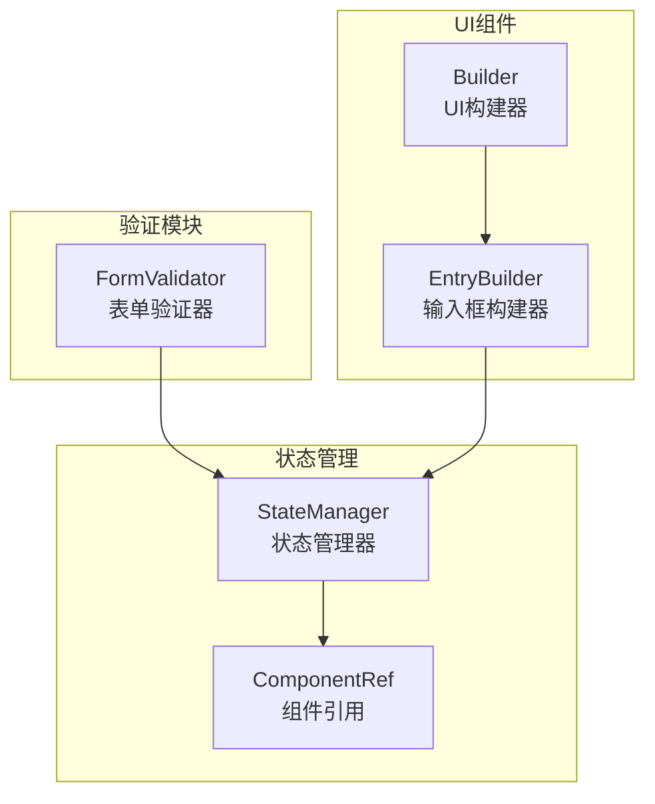
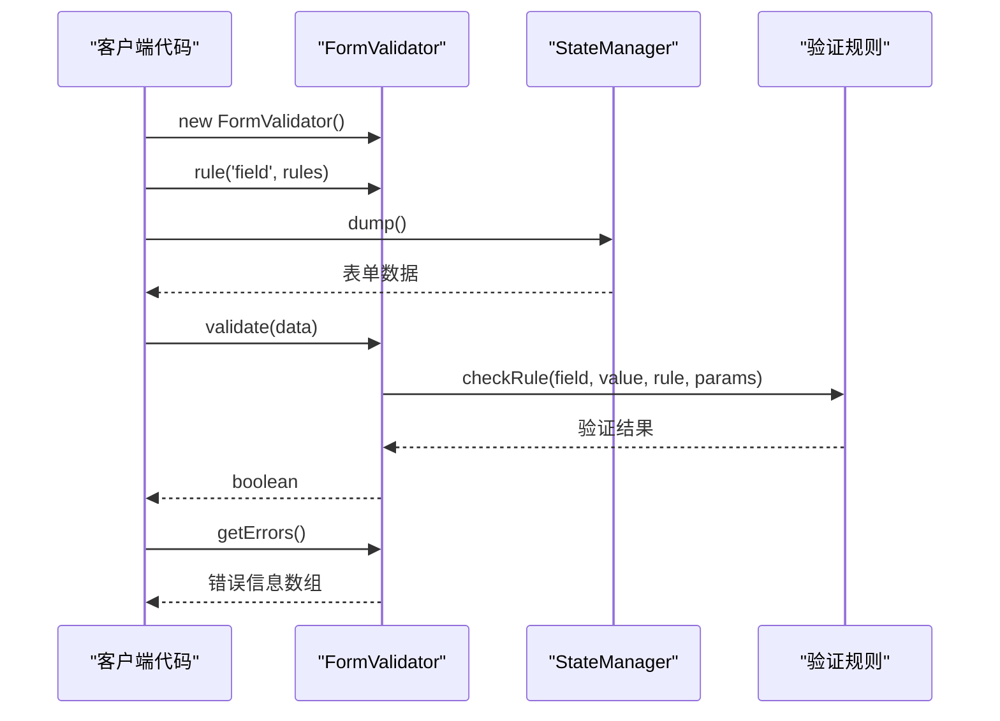
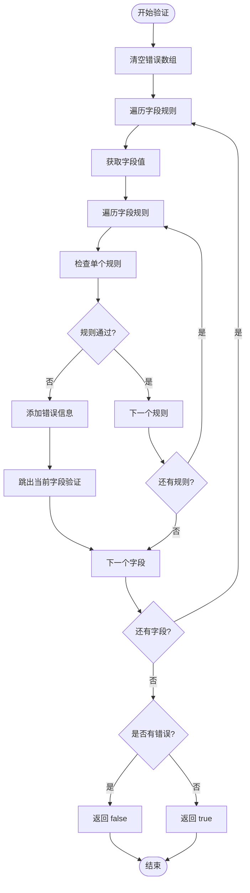
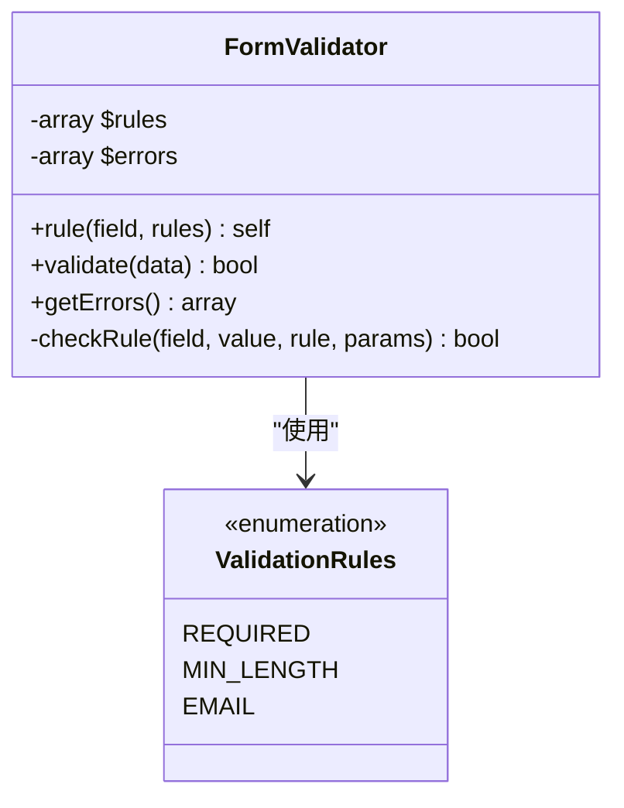
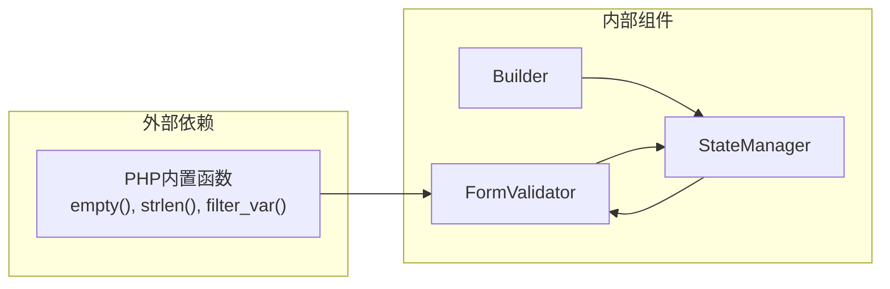

# FormValidator API 文档

<cite>
**本文档中引用的文件**
- [FormValidator.php](file://src/Validation/FormValidator.php)
- [StateManager.php](file://src/State/StateManager.php)
- [simple.php](file://example/simple.php)
- [full.php](file://example/full.php)
</cite>

## 目录
1. [简介](#简介)
2. [项目结构](#项目结构)
3. [核心组件](#核心组件)
4. [架构概览](#架构概览)
5. [详细组件分析](#详细组件分析)
6. [依赖关系分析](#依赖关系分析)
7. [性能考虑](#性能考虑)
8. [故障排除指南](#故障排除指南)
9. [结论](#结论)

## 简介

FormValidator是一个轻量级的表单验证类，专为LibUI构建系统设计。它提供了简单而强大的表单验证功能，支持多种内置验证规则，并与状态管理系统无缝集成。该验证器采用链式调用模式，使验证规则的定义和执行变得直观且易于维护。

## 项目结构

FormValidator类位于验证模块中，与其他核心组件协同工作：



**图表来源**
- [FormValidator.php](file://src/Validation/FormValidator.php#L1-L78)
- [StateManager.php](file://src/State/StateManager.php#L1-L91)

**章节来源**
- [FormValidator.php](file://src/Validation/FormValidator.php#L1-L78)
- [StateManager.php](file://src/State/StateManager.php#L1-L91)

## 核心组件

FormValidator类的核心功能围绕三个主要方法构建：

### 私有属性
- `$rules`: 存储字段验证规则的数组
- `$errors`: 存储验证错误信息的数组

### 公共接口
- `rule()`: 定义字段验证规则
- `validate()`: 执行验证并返回结果
- `getErrors()`: 获取验证错误信息

**章节来源**
- [FormValidator.php](file://src/Validation/FormValidator.php#L5-L6)

## 架构概览

FormValidator采用简洁的验证架构，支持链式调用和灵活的规则配置：



**图表来源**
- [FormValidator.php](file://src/Validation/FormValidator.php#L8-L34)
- [StateManager.php](file://src/State/StateManager.php#L87-L90)

## 详细组件分析

### rule() 方法 - 验证规则定义

`rule()`方法是FormValidator的核心配置方法，用于为特定字段定义验证规则。

#### 方法签名
```php
public function rule(string $field, array $rules): self
```

#### 参数说明
- `$field`: string - 要验证的字段名称
- `$rules`: array - 验证规则数组，键为规则名称，值为规则参数

#### 返回值
- `self`: 支持链式调用

#### 内置验证规则

FormValidator支持以下内置验证规则：

| 规则名称 | 参数类型 | 描述 | 示例 |
|---------|---------|------|------|
| `required` | boolean | 字段是否必填 | `'required' => true` |
| `min_length` | integer | 最小字符长度 | `'min_length' => 3` |
| `email` | boolean | 是否为有效邮箱格式 | `'email' => true` |

#### 使用示例

```php
// 基本规则定义
$validator = new FormValidator();
$validator->rule('username', ['required' => true, 'min_length' => 3])
          ->rule('password', ['required' => true, 'min_length' => 6])
          ->rule('email', ['required' => true, 'email' => true]);
```

**章节来源**
- [FormValidator.php](file://src/Validation/FormValidator.php#L8-L12)

### validate() 方法 - 验证执行流程

`validate()`方法执行实际的验证逻辑，处理数据并返回验证结果。

#### 方法签名
```php
public function validate(array $data): bool
```

#### 参数说明
- `$data`: array - 包含要验证的数据的关联数组

#### 返回值
- `bool`: 验证成功返回true，失败返回false

#### 验证流程



**图表来源**
- [FormValidator.php](file://src/Validation/FormValidator.php#L14-L29)

#### 验证特性
- **短路验证**: 一旦某个字段验证失败，立即停止对该字段的进一步验证
- **错误累积**: 所有验证失败的信息都会被收集到错误数组中
- **空值处理**: 自动处理不存在的字段值

**章节来源**
- [FormValidator.php](file://src/Validation/FormValidator.php#L14-L29)

### getErrors() 方法 - 错误信息获取

`getErrors()`方法返回所有验证失败的错误信息。

#### 方法签名
```php
public function getErrors(): array
```

#### 返回值
- `array`: 错误信息数组，格式为：`['字段名' => '错误消息']`

#### 错误信息格式
- **字段名**: 验证失败的字段名称
- **错误消息**: 人类可读的错误描述，如"用户名不能为空"或"邮箱格式不正确"

#### 使用示例
```php
if (!$validator->validate($formData)) {
    $errors = $validator->getErrors();
    foreach ($errors as $field => $message) {
        echo "字段 {$field}: {$message}\n";
    }
}
```

**章节来源**
- [FormValidator.php](file://src/Validation/FormValidator.php#L31-L34)

### checkRule() 方法 - 内部规则验证

`checkRule()`方法是FormValidator的内部核心方法，负责具体验证规则的执行。

#### 方法签名
```php
private function checkRule(string $field, $value, string $rule, $params): bool
```

#### 验证规则实现



**图表来源**
- [FormValidator.php](file://src/Validation/FormValidator.php#L36-L62)

#### 规则验证逻辑

每个内置规则都有特定的验证逻辑：

1. **required规则**: 使用`empty()`函数检查字段是否为空
2. **min_length规则**: 使用`strlen()`函数检查字符串长度
3. **email规则**: 使用PHP内置的`filter_var()`函数验证邮箱格式

#### 错误信息国际化
- 所有错误信息都使用中文，便于中文用户理解
- 错误信息包含字段名称，提供明确的上下文

**章节来源**
- [FormValidator.php](file://src/Validation/FormValidator.php#L36-L62)

## 依赖关系分析

FormValidator与系统其他组件的依赖关系：



**图表来源**
- [FormValidator.php](file://src/Validation/FormValidator.php#L1-L78)
- [StateManager.php](file://src/State/StateManager.php#L1-L91)

### 与状态管理器的集成

FormValidator与StateManager紧密集成，通过以下方式协作：

1. **数据获取**: 使用`StateManager::instance()->dump()`获取表单数据
2. **验证触发**: 在表单提交时调用验证器
3. **错误反馈**: 将验证错误信息传递给UI组件进行显示

**章节来源**
- [StateManager.php](file://src/State/StateManager.php#L87-L90)

## 性能考虑

### 验证性能优化
- **短路验证**: 避免不必要的验证计算
- **内存效率**: 使用引用传递减少内存占用
- **快速失败**: 早期检测并报告错误

### 最佳实践建议
- 合理设置验证规则顺序，将最常用的规则放在前面
- 避免在验证器中使用复杂的业务逻辑
- 及时清理验证器实例以释放内存

## 故障排除指南

### 常见问题及解决方案

#### 1. 验证总是失败
**原因**: 数据格式不匹配或字段名称错误
**解决**: 检查字段名称是否与验证规则一致，确认数据格式正确

#### 2. 错误信息不显示
**原因**: 未正确调用`getErrors()`方法
**解决**: 确保在验证失败后调用`getErrors()`获取错误信息

#### 3. 链式调用无效
**原因**: 忘记返回`self`或方法调用语法错误
**解决**: 确保每个`rule()`方法都正确返回`$this`

### 调试技巧
- 使用`var_dump($validator->getErrors())`查看详细的错误信息
- 在验证前打印原始数据以确认数据完整性
- 分步验证，先测试单个规则再组合多个规则

**章节来源**
- [FormValidator.php](file://src/Validation/FormValidator.php#L65-L78)

## 结论

FormValidator是一个设计精良的表单验证工具，具有以下特点：

### 主要优势
- **简洁易用**: 链式调用模式使API直观易懂
- **功能完备**: 支持常用验证需求
- **集成良好**: 与状态管理系统无缝协作
- **扩展性强**: 易于添加自定义验证规则

### 应用场景
- Web表单验证
- 用户输入校验
- 数据完整性检查
- 系统输入过滤

### 发展方向
- 支持更多内置验证规则
- 添加自定义验证规则支持
- 提供更丰富的错误信息格式
- 增强性能优化

FormValidator为LibUI构建系统提供了可靠的表单验证基础设施，是构建健壮用户界面的重要组件。