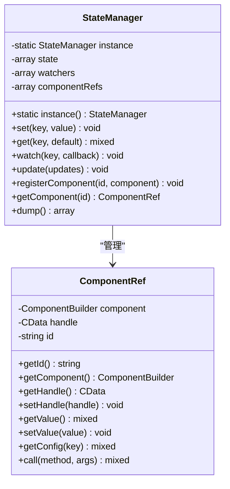
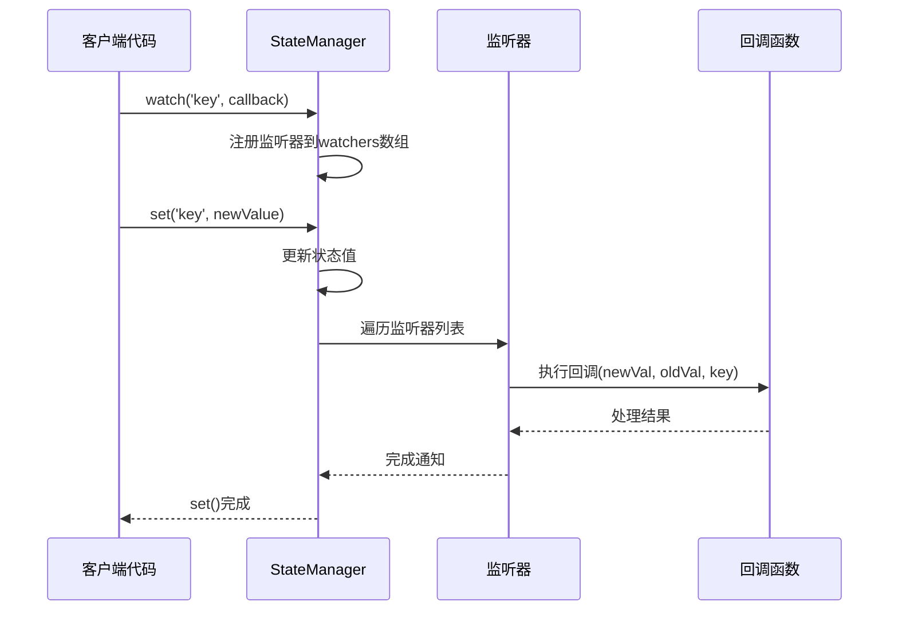
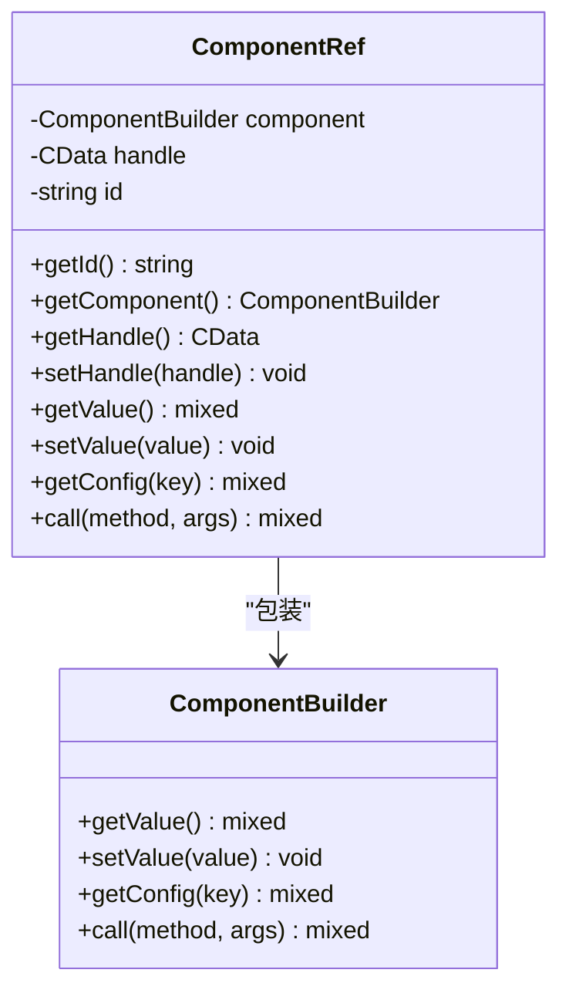
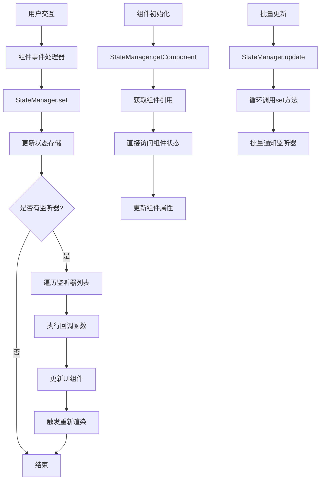

# StateManager API 参考文档

<cite>
**本文档中引用的文件**
- [StateManager.php](file://src/State/StateManager.php)
- [ComponentRef.php](file://src/State/ComponentRef.php)
- [StateHelperTest.php](file://tests/StateHelperTest.php)
- [helper.php](file://src/helper.php)
- [simple.php](file://example/simple.php)
- [full.php](file://example/full.php)
- [ComponentBuilder.php](file://src/ComponentBuilder.php)
</cite>

## 目录
1. [简介](#简介)
2. [单例模式实现](#单例模式实现)
3. [核心API方法](#核心api方法)
4. [观察者模式实现](#观察者模式实现)
5. [组件引用管理](#组件引用管理)
6. [批量更新与调试](#批量更新与调试)
7. [数据流架构](#数据流架构)
8. [使用示例](#使用示例)
9. [错误处理与性能考虑](#错误处理与性能考虑)
10. [最佳实践](#最佳实践)

## 简介

StateManager是libuiBuilder框架中的核心状态管理器，采用单例模式设计，为整个应用程序提供全局状态共享和组件间通信能力。它实现了观察者模式，支持响应式编程，并提供了完整的组件引用管理系统。

### 主要特性

- **单例模式**：确保全局唯一的状态管理实例
- **响应式状态管理**：支持状态变更监听和自动更新
- **组件引用系统**：提供跨组件的数据访问能力
- **批量操作**：支持高效的状态批量更新
- **调试友好**：内置状态导出和调试功能

## 单例模式实现

StateManager采用经典的单例模式实现，确保在整个应用程序生命周期内只有一个状态管理实例存在。



**图表来源**
- [StateManager.php](file://src/State/StateManager.php#L10-L21)
- [ComponentRef.php](file://src/State/ComponentRef.php#L11-L74)

### instance() 方法详解

`instance()`方法实现了StateManager的单例模式：

**方法签名**：
```php
public static function instance(): self
```

**实现特点**：
- 使用静态私有属性 `$instance` 存储实例
- 采用懒加载模式，在首次调用时创建实例
- 返回类型为 `self`，支持链式调用
- 确保线程安全（PHP环境下天然线程安全）

**节来源**
- [StateManager.php](file://src/State/StateManager.php#L15-L21)

## 核心API方法

### set() 方法 - 状态设置

`set()`方法用于设置指定键的状态值，并触发相应的监听器。

**方法签名**：
```php
public function set(string $key, $value): void
```

**参数说明**：
- `$key`：状态键名，字符串类型
- `$value`：要设置的状态值，支持任意类型

**内部机制**：
1. 获取旧值（如果存在）
2. 更新状态存储
3. 查找并执行所有监听该键的回调函数
4. 向每个监听器传递 `(新值, 旧值, 键名)` 参数

**节来源**
- [StateManager.php](file://src/State/StateManager.php#L26-L36)

### get() 方法 - 状态获取

`get()`方法用于获取指定键的状态值，支持提供默认值。

**方法签名**：
```php
public function get(string $key, $default = null)
```

**参数说明**：
- `$key`：状态键名
- `$default`：当键不存在时返回的默认值，默认为null

**返回值**：
- 如果键存在，返回对应的值
- 如果键不存在，返回提供的默认值

**节来源**
- [StateManager.php](file://src/State/StateManager.php#L42-L45)

## 观察者模式实现

StateManager通过watch()方法实现了完整的观察者模式，支持状态变更的实时监听和响应。



**图表来源**
- [StateManager.php](file://src/StateManager.php#L50-L56)
- [StateManager.php](file://src/StateManager.php#L26-L36)

### watch() 方法详解

**方法签名**：
```php
public function watch(string $key, callable $callback): void
```

**回调函数签名**：
```php
function($newValue, $oldValue, $key): void
```

**参数说明**：
- `$newValue`：状态变更后的新值
- `$oldValue`：状态变更前的旧值
- `$key`：被监听的状态键名

**使用特点**：
- 支持为同一键注册多个监听器
- 监听器按注册顺序执行
- 回调函数可以访问完整的变更上下文

**节来源**
- [StateManager.php](file://src/State/StateManager.php#L50-L56)

## 组件引用管理

StateManager提供了完整的组件引用管理系统，允许组件之间直接访问和操作其他组件的状态和方法。

### registerComponent() 方法

**方法签名**：
```php
public function registerComponent(string $id, ComponentRef $component): void
```

**功能**：
- 将组件引用存储在内部组件映射中
- 通过唯一ID标识组件
- 支持组件间的直接通信

### getComponent() 方法

**方法签名**：
```php
public function getComponent(string $id): ?ComponentRef
```

**返回值**：
- 如果找到对应ID的组件，返回ComponentRef对象
- 如果找不到，返回null

**节来源**
- [StateManager.php](file://src/State/StateManager.php#L71-L82)

### ComponentRef 类功能

ComponentRef类提供了访问其他组件能力的封装：



**图表来源**
- [ComponentRef.php](file://src/State/ComponentRef.php#L11-L74)

**核心方法**：
- `getValue()`：获取组件当前值
- `setValue()`：设置组件值
- `getConfig()`：获取组件配置
- `call()`：调用组件方法

**节来源**
- [ComponentRef.php](file://src/State/ComponentRef.php#L46-L73)

## 批量更新与调试

### update() 方法 - 批量更新

**方法签名**：
```php
public function update(array $updates): void
```

**功能**：
- 接收键值对数组作为批量更新数据
- 内部循环调用set()方法逐个更新
- 提供更高效的批量状态更新方式

**使用场景**：
- 初始化多个状态变量
- 批量同步状态
- 原子性状态更新

**节来源**
- [StateManager.php](file://src/StateManager.php#L61-L66)

### dump() 方法 - 调试输出

**方法签名**：
```php
public function dump(): array
```

**功能**：
- 返回当前所有状态的完整快照
- 用于调试和开发阶段的状态检查
- 不影响正常的状态管理流程

**节来源**
- [StateManager.php](file://src/State/StateManager.php#L87-L90)

## 数据流架构

StateManager的整体数据流展示了从状态变更到UI自动更新的完整过程：



**图表来源**
- [StateManager.php](file://src/State/StateManager.php#L26-L36)
- [StateManager.php](file://src/State/StateManager.php#L61-L66)
- [ComponentBuilder.php](file://src/ComponentBuilder.php#L196-L198)

## 使用示例

### 基础状态管理

```php
// 获取StateManager实例
$stateManager = StateManager::instance();

// 设置状态
$stateManager->set('username', 'JohnDoe');

// 获取状态
$username = $stateManager->get('username', 'Guest');

// 监听状态变化
$stateManager->watch('username', function($new, $old, $key) {
    echo "用户名从 {$old} 变更为 {$new}";
});

// 批量更新
$stateManager->update([
    'name' => 'John',
    'email' => 'john@example.com',
    'age' => 30
]);
```

### 组件间通信

```php
// 注册组件引用
$stateManager->registerComponent('inputField', $componentRef);

// 在其他组件中访问
$inputRef = $stateManager->getComponent('inputField');
if ($inputRef) {
    $currentValue = $inputRef->getValue();
    $inputRef->setValue('New Value');
}
```

### 响应式UI更新

```php
// 监听表单状态变化
$stateManager->watch('formData', function($newData, $oldData) {
    // 更新UI显示
    $summaryLabel = $stateManager->getComponent('summaryLabel');
    if ($summaryLabel) {
        $summary = "总金额: $" . $newData['amount'];
        $summaryLabel->setValue($summary);
    }
});
```

**节来源**
- [StateHelperTest.php](file://tests/StateHelperTest.php#L18-L77)
- [simple.php](file://example/simple.php#L30-L50)

## 错误处理与性能考虑

### 错误处理策略

1. **空值检查**
   - `get()`方法的安全默认值处理
   - `getComponent()`的null返回值检查
   - 监听器回调中的参数验证

2. **异常情况处理**
   - 无效键名的优雅处理
   - 组件引用丢失的容错机制
   - 监听器异常的隔离处理

### 性能优化建议

1. **状态设计原则**
   - 避免过深的嵌套状态结构
   - 使用扁平化的状态树
   - 合理的状态键命名规范

2. **监听器优化**
   - 避免在监听器中执行耗时操作
   - 使用防抖(debounce)技术处理高频变更
   - 及时清理不需要的监听器

3. **内存管理**
   - 定期清理不再需要的组件引用
   - 避免监听器闭包导致的内存泄漏
   - 合理控制状态存储的大小

### 调试技巧

1. **状态监控**
   ```php
   // 使用dump()查看完整状态
   $currentState = $stateManager->dump();
   print_r($currentState);
   ```

2. **变更追踪**
   ```php
   // 监听所有状态变更
   $stateManager->watch('*', function($new, $old, $key) {
       error_log("状态 {$key} 变更: {$old} -> {$new}");
   });
   ```

## 最佳实践

### 状态设计原则

1. **单一数据源**
   - 每个业务概念只在一个地方定义
   - 避免重复状态和冲突

2. **不可变性优先**
   - 尽可能使用不可变数据结构
   - 通过set()方法进行状态更新

3. **模块化组织**
   - 按功能模块划分状态空间
   - 使用命名空间避免键名冲突

### 组件通信模式

1. **事件驱动架构**
   - 使用watch()实现松耦合通信
   - 避直接依赖组件实例

2. **状态提升**
   - 将共享状态提升到StateManager
   - 让组件通过StateManager访问状态

3. **双向绑定**
   - 结合onChange事件和状态更新
   - 实现UI与状态的自动同步

### 开发工作流

1. **渐进式重构**
   - 从局部状态开始，逐步迁移到StateManager
   - 保持向后兼容性

2. **测试策略**
   - 为状态变更编写单元测试
   - 使用模拟对象测试组件间通信

3. **文档维护**
   - 记录状态键的用途和格式
   - 维护组件引用关系图

StateManager作为libuiBuilder的核心组件，为构建响应式、可维护的GUI应用程序提供了强大的基础设施。通过合理使用其提供的API，开发者可以构建出既高效又易于扩展的用户界面系统。