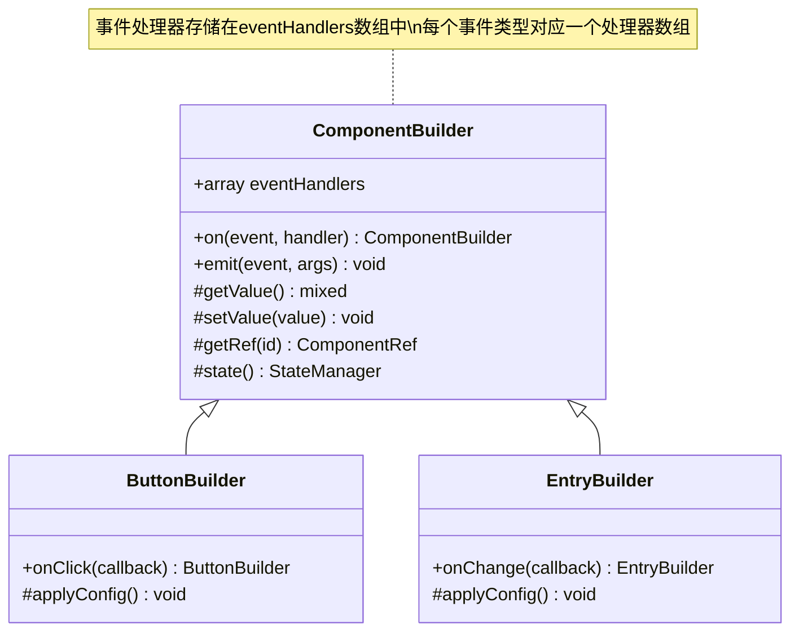
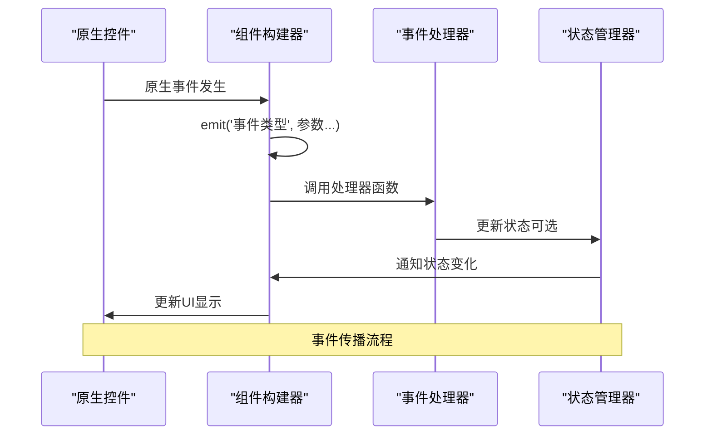
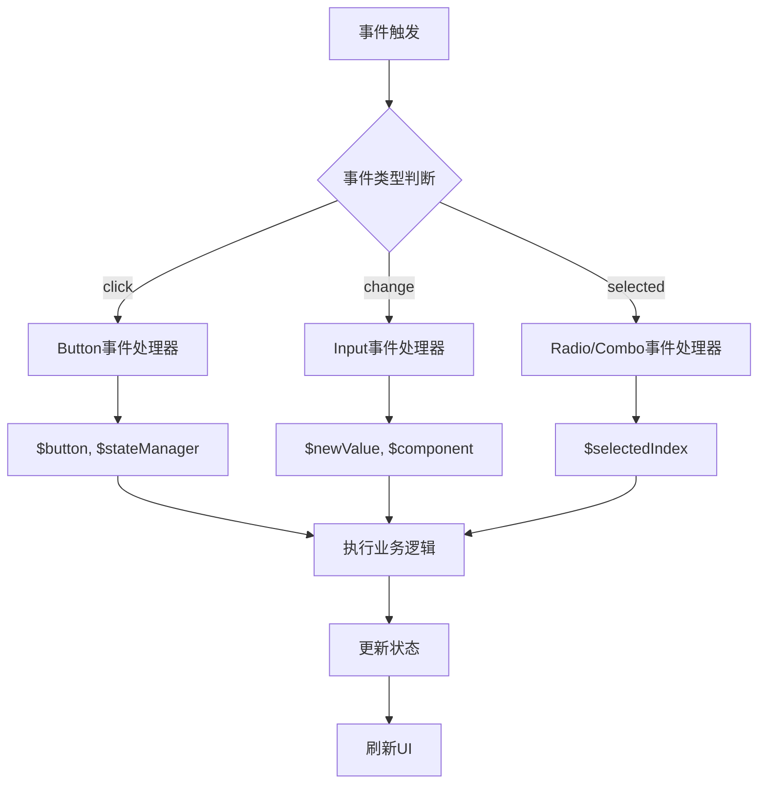
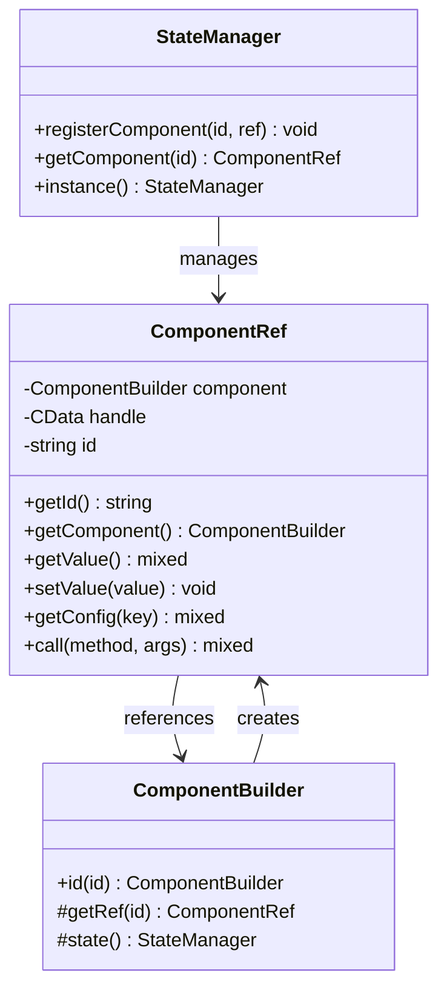
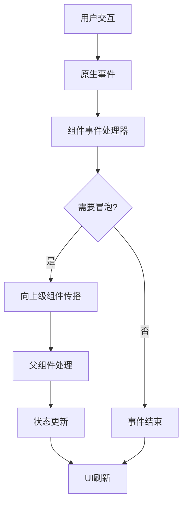
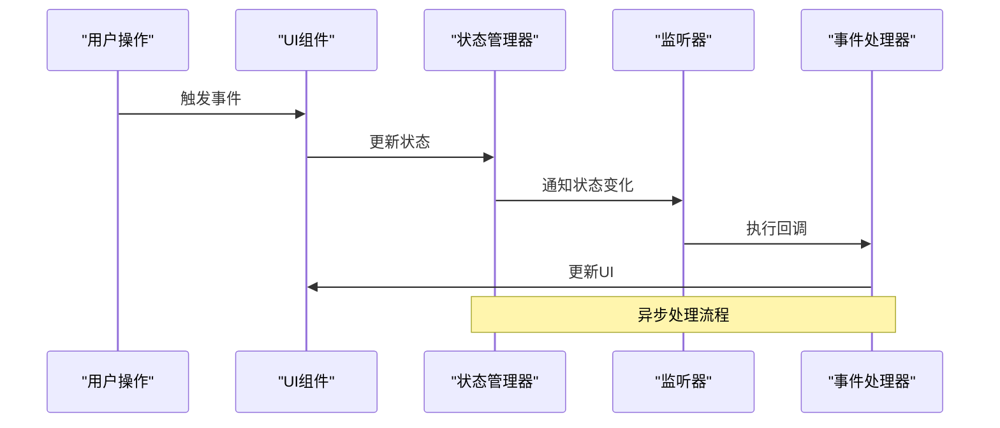
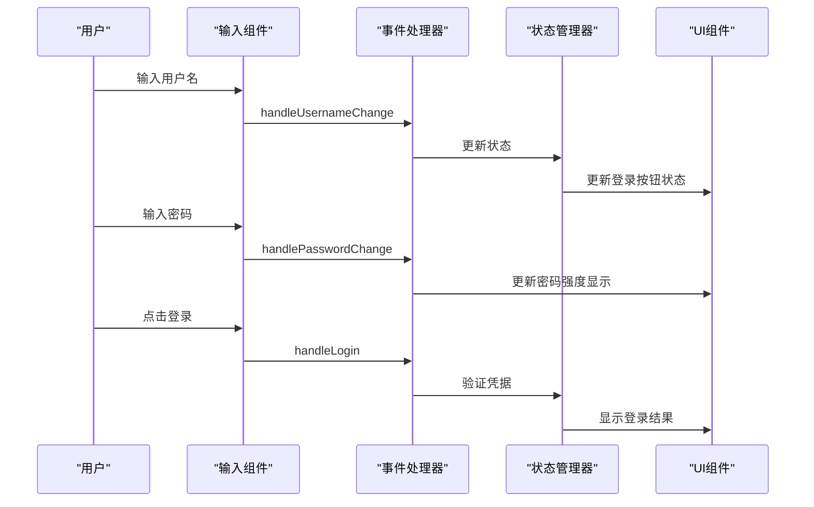

# 事件系统

<cite>
**本文档中引用的文件**
- [ComponentBuilder.php](file://src/ComponentBuilder.php)
- [HtmlRenderer.php](file://src/HtmlRenderer.php)
- [ButtonBuilder.php](file://src/Components/ButtonBuilder.php)
- [EntryBuilder.php](file://src/Components/EntryBuilder.php)
- [ComponentRef.php](file://src/State/ComponentRef.php)
- [StateManager.php](file://src/State/StateManager.php)
- [helper.php](file://src/helper.php)
- [login.ui.html](file://example/views/login.ui.html)
- [htmlLogin.php](file://example/htmlLogin.php)
- [calculator_html.php](file://example/calculator_html.php)
- [debug_renderer.php](file://example/debug_renderer.php)
</cite>

## 目录
1. [简介](#简介)
2. [事件系统架构](#事件系统架构)
3. [ComponentBuilder中的事件处理](#componentbuilder中的事件处理)
4. [HTML模板中的事件绑定](#html模板中的事件绑定)
5. [事件处理器的回调函数签名](#事件处理器的回调函数签名)
6. [状态管理和组件引用](#状态管理和组件引用)
7. [事件传播机制](#事件传播机制)
8. [异步事件处理](#异步事件处理)
9. [实际应用示例](#实际应用示例)
10. [最佳实践](#最佳实践)

## 简介

这个UI构建器项目实现了一个完整的事件系统，支持在HTML模板中定义事件处理器，并在PHP代码中提供相应的处理函数。该系统采用观察者模式，允许组件注册事件监听器并在事件触发时执行相应的回调函数。

事件系统的核心特性包括：
- **声明式事件绑定**：在HTML模板中通过属性（如`onclick`、`onchange`）定义事件
- **分离的关注点**：HTML负责UI结构和事件声明，PHP负责业务逻辑处理
- **组件间通信**：通过状态管理器实现组件间的解耦通信
- **响应式编程**：支持状态变化的自动响应

## 事件系统架构

```mermaid
graph TB
subgraph "HTML模板层"
A[HTML标签] --> B[事件属性<br/>onclick/onchange]
B --> C[处理器名称]
end
subgraph "渲染引擎层"
D[HtmlRenderer] --> E[DOM解析]
E --> F[组件映射]
F --> G[事件处理器注册]
end
subgraph "组件层"
H[ComponentBuilder] --> I[事件处理器存储]
I --> J[emit()方法]
J --> K[回调函数执行]
end
subgraph "状态管理层"
L[StateManager] --> M[组件引用管理]
M --> N[全局状态存储]
end
subgraph "PHP业务层"
O[事件处理器函数] --> P[业务逻辑处理]
P --> Q[状态更新]
Q --> R[组件刷新]
end
C --> D
G --> H
K --> L
N --> O
```

**图表来源**
- [HtmlRenderer.php](file://src/HtmlRenderer.php#L220-L238)
- [ComponentBuilder.php](file://src/ComponentBuilder.php#L149-L175)
- [StateManager.php](file://src/State/StateManager.php#L68-L91)

## ComponentBuilder中的事件处理

### on()方法：事件处理器注册

`ComponentBuilder`类提供了`on()`方法来注册事件处理器：



**图表来源**
- [ComponentBuilder.php](file://src/ComponentBuilder.php#L149-L157)
- [ButtonBuilder.php](file://src/Components/ButtonBuilder.php#L44-L47)
- [EntryBuilder.php](file://src/Components/EntryBuilder.php#L76-L79)

**节来源**
- [ComponentBuilder.php](file://src/ComponentBuilder.php#L149-L175)

### emit()方法：事件触发机制

`emit()`方法负责触发事件并执行所有注册的处理器：



**图表来源**
- [ComponentBuilder.php](file://src/ComponentBuilder.php#L161-L175)
- [ButtonBuilder.php](file://src/Components/ButtonBuilder.php#L28-L35)
- [EntryBuilder.php](file://src/Components/EntryBuilder.php#L38-L50)

**节来源**
- [ComponentBuilder.php](file://src/ComponentBuilder.php#L161-L175)

## HTML模板中的事件绑定

### 事件属性映射

HTML模板支持多种事件属性，这些属性会被`HtmlRenderer`转换为对应的组件方法调用：

| HTML属性 | 对应组件方法 | 触发时机 | 传递参数 |
|---------|-------------|----------|----------|
| `onclick` | `onClick()` | 鼠标点击 | `$component, $stateManager` |
| `onchange` | `onChange()` | 值改变 | `$newValue, $component` |
| `onselected` | `onSelected()` | 选项选择 | `$selectedIndex` |
| `ontoggled` | `onToggled()` | 复选框切换 | `$isChecked, $component` |

**节来源**
- [HtmlRenderer.php](file://src/HtmlRenderer.php#L224-L238)

### 模板语法示例

```html
<!-- 按钮点击事件 -->
<button onclick="handleButtonClick">点击我</button>

<!-- 输入框变更事件 -->
<input onchange="handleInputChange" />

<!-- 单选框选择事件 -->
<radio onselected="handleSelection">
  <option>选项1</option>
  <option>选项2</option>
</radio>
```

**节来源**
- [login.ui.html](file://example/views/login.ui.html#L15-L35)

## 事件处理器的回调函数签名

### 标准回调函数签名

事件处理器函数遵循统一的回调函数签名：



**图表来源**
- [htmlLogin.php](file://example/htmlLogin.php#L17-L91)
- [calculator_html.php](file://example/calculator_html_simple.php#L36-L180)

### 不同上下文下的参数传递

#### 按钮点击事件
```php
function handleButtonClick($button, $stateManager) {
    // $button: 按钮组件实例
    // $stateManager: 状态管理器实例
    echo "按钮被点击\n";
}
```

#### 输入变更事件
```php
function handleInputChange($newValue, $component) {
    // $newValue: 新的输入值
    // $component: 输入组件实例
    echo "新值: {$newValue}\n";
}
```

#### 选择事件
```php
function handleSelection($selectedIndex) {
    // $selectedIndex: 选中的索引
    echo "选择了索引: {$selectedIndex}\n";
}
```

**节来源**
- [htmlLogin.php](file://example/htmlLogin.php#L18-L91)
- [calculator_html.php](file://example/calculator_html_simple.php#L36-L180)

## 状态管理和组件引用

### ComponentRef：组件引用机制

`ComponentRef`类提供了访问其他组件的能力：



**图表来源**
- [ComponentRef.php](file://src/State/ComponentRef.php#L11-L74)
- [StateManager.php](file://src/State/StateManager.php#L68-L91)
- [ComponentBuilder.php](file://src/ComponentBuilder.php#L122-L207)

**节来源**
- [ComponentRef.php](file://src/State/ComponentRef.php#L11-L74)
- [StateManager.php](file://src/State/StateManager.php#L68-L91)

### 在事件处理器中访问组件实例

```php
function handleLogin($button, $stateManager) {
    // 获取其他组件的引用
    $usernameInput = $stateManager->getComponent('usernameInput');
    $passwordInput = $stateManager->getComponent('passwordInput');
    
    // 访问组件状态
    $username = $usernameInput->getValue();
    $password = $passwordInput->getValue();
    
    // 直接操作组件
    $statusLabel = $stateManager->getComponent('statusLabel');
    $statusLabel->setValue("登录中...");
}
```

**节来源**
- [htmlLogin.php](file://example/htmlLogin.php#L46-L91)

## 事件传播机制

### 事件冒泡流程

虽然当前实现没有明确的事件冒泡机制，但可以通过以下方式模拟：



### 状态绑定的自动传播

当组件绑定到状态时，状态变化会自动触发相关组件的更新：

```php
// 组件绑定到状态
$entry->bind('username');

// 状态变化自动更新组件
state('username', 'new value');
// 组件的getValue()会返回新值
```

**节来源**
- [ComponentBuilder.php](file://src/ComponentBuilder.php#L133-L146)
- [ComponentBuilder.php](file://src/ComponentBuilder.php#L171-L175)

## 异步事件处理

### 状态监听器的异步特性

状态管理器支持异步的状态变化监听：



**图表来源**
- [helper.php](file://src/helper.php#L107-L110)
- [StateManager.php](file://src/State/StateManager.php#L68-L91)

### 异步事件处理示例

```php
// 注册异步监听器
watch('userData', function($newData, $oldData) {
    // 异步处理用户数据更新
    asyncProcessUserData($newData);
});

// 状态更新触发异步处理
state('userData', $newUserData);
```

**节来源**
- [helper.php](file://src/helper.php#L107-L110)

## 实际应用示例

### 登录表单事件处理

以下是一个完整的登录表单事件处理示例：



**图表来源**
- [htmlLogin.php](file://example/htmlLogin.php#L17-L91)
- [login.ui.html](file://example/views/login.ui.html#L15-L35)

### 计算器事件处理

计算器应用展示了复杂的事件处理逻辑：

```php
// 数字按键事件处理器
'handleNumber' => function() use ($stateManager) {
    $display = $stateManager->get('display');
    $waitingForNewValue = $stateManager->get('waitingForNewValue');
    
    // 根据当前状态处理数字输入
    if ($waitingForNewValue || $display === '0') {
        $stateManager->set('display', $number);
        $stateManager->set('waitingForNewValue', false);
    } else {
        $stateManager->set('display', $display . $number);
    }
},
```

**节来源**
- [calculator_html.php](file://example/calculator_html.php#L62-L142)

## 最佳实践

### 1. 事件处理器命名规范

```php
// 推荐的命名格式
'handle{Component}{Action}'
// 示例：handleLoginButtonClicked
//      handleChangePassword
//      handleOptionSelected
```

### 2. 状态管理最佳实践

```php
// 使用状态管理器进行组件间通信
$stateManager->watch('sharedState', function($newValue, $oldValue) {
    // 响应状态变化
    updateRelatedComponents($newValue);
});

// 批量更新状态
$stateManager->update([
    'field1' => 'value1',
    'field2' => 'value2',
]);
```

### 3. 错误处理和边界情况

```php
function handleLogin($button, $stateManager) {
    try {
        $username = $stateManager->get('username');
        $password = $stateManager->get('password');
        
        if (empty($username) || empty($password)) {
            throw new InvalidArgumentException("用户名和密码不能为空");
        }
        
        // 执行登录逻辑
        $result = authenticate($username, $password);
        
    } catch (Exception $e) {
        // 显示错误信息
        $statusLabel = $stateManager->getComponent('statusLabel');
        $statusLabel->setValue("错误: " . $e->getMessage());
    }
}
```

### 4. 性能优化建议

- 避免在高频事件（如输入框变更）中执行耗时操作
- 使用防抖（debounce）或节流（throttle）技术处理频繁事件
- 合理使用状态监听器，避免不必要的状态更新

**节来源**
- [htmlLogin.php](file://example/htmlLogin.php#L46-L91)
- [helper.php](file://src/helper.php#L63-L110)