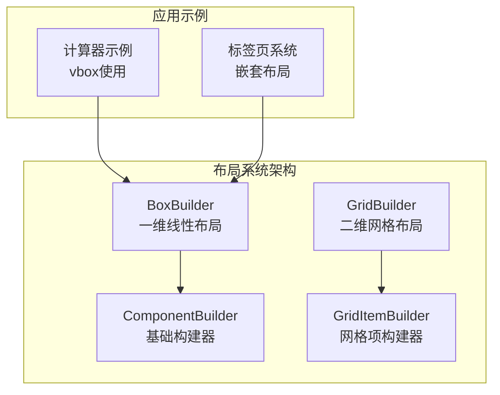
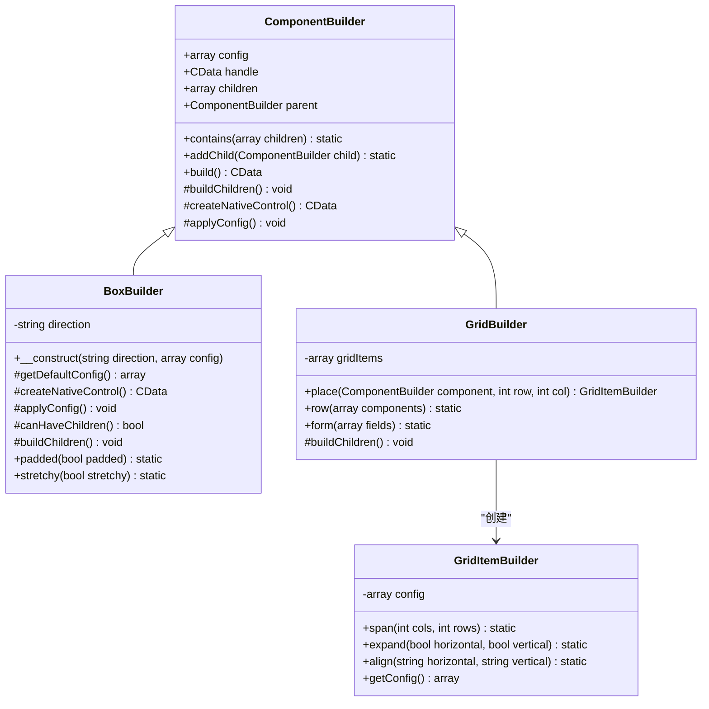
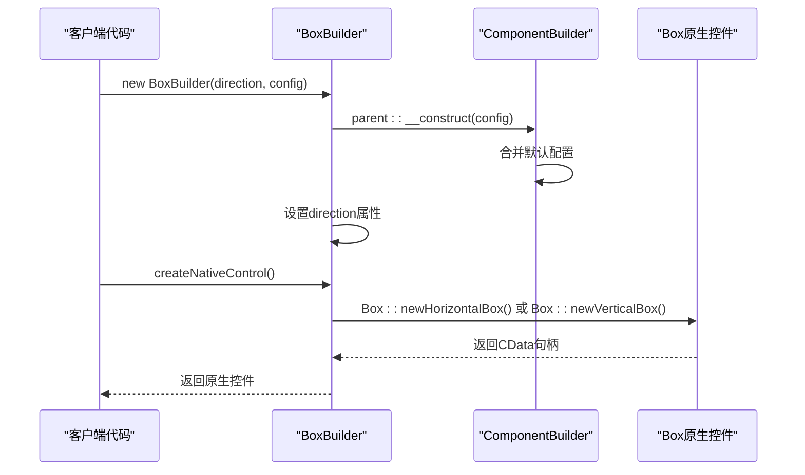
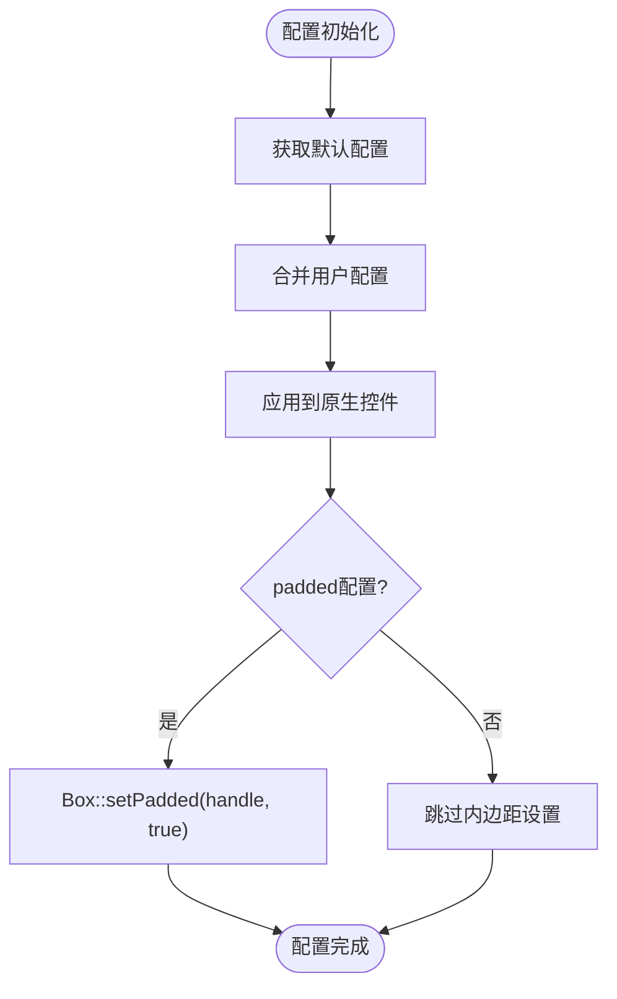
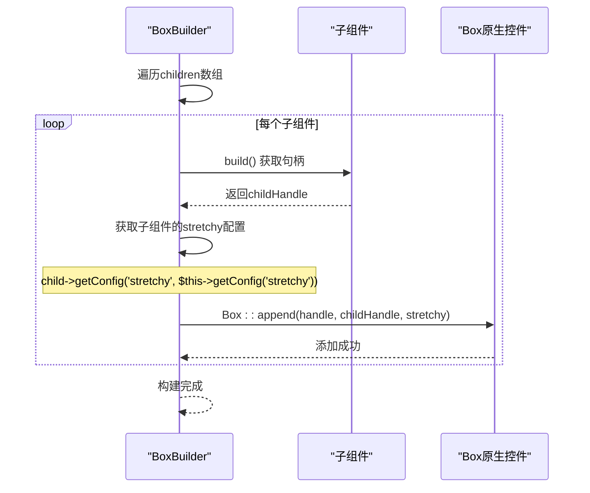
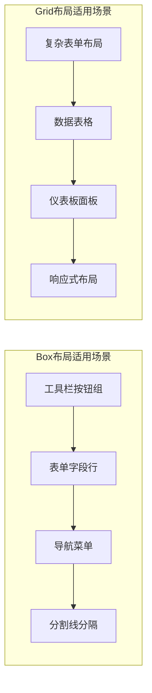
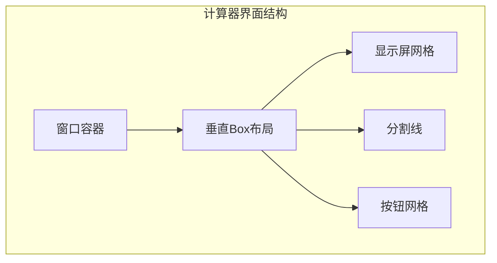
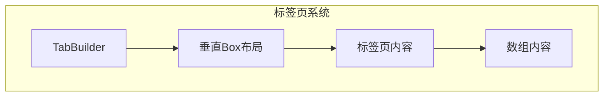
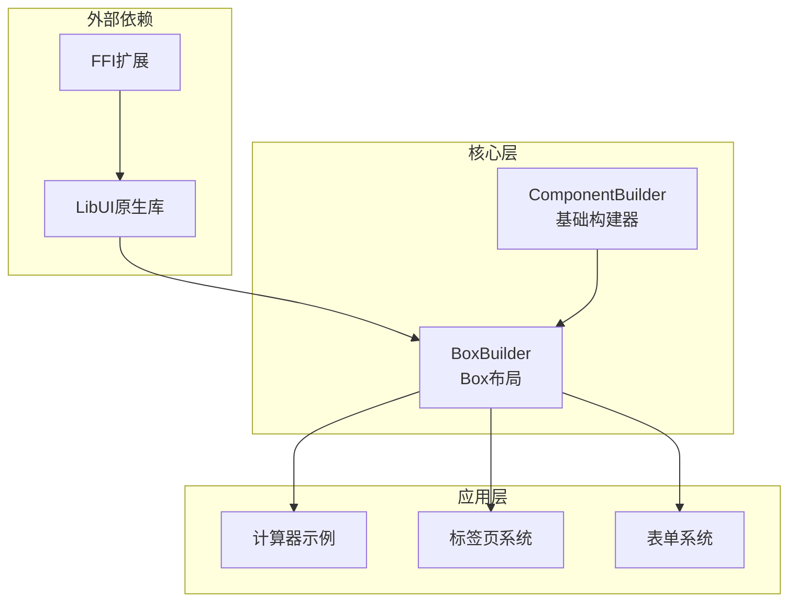

# Box布局

<cite>
**本文档中引用的文件**
- [BoxBuilder.php](file://src/Components/BoxBuilder.php)
- [ComponentBuilder.php](file://src/ComponentBuilder.php)
- [GridBuilder.php](file://src/Components/GridBuilder.php)
- [GridItemBuilder.php](file://src/Components/GridItemBuilder.php)
- [calculator.php](file://example/calculator.php)
- [TabBuilder.php](file://src/Builder/TabBuilder.php)
</cite>

## 目录
1. [简介](#简介)
2. [项目结构](#项目结构)
3. [核心组件](#核心组件)
4. [架构概览](#架构概览)
5. [详细组件分析](#详细组件分析)
6. [依赖关系分析](#依赖关系分析)
7. [性能考虑](#性能考虑)
8. [故障排除指南](#故障排除指南)
9. [结论](#结论)

## 简介

Box布局是一维线性布局容器，专门用于在水平或垂直方向上排列子组件。它提供了简单而有效的布局解决方案，特别适用于需要线性排列的界面元素。BoxBuilder通过direction参数控制布局方向，支持padded和stretchy配置项来调整间距和子元素的拉伸行为。

## 项目结构

Box布局系统采用分层架构设计，主要包含以下核心文件：

**图表来源**
- [BoxBuilder.php](file://src/Components/BoxBuilder.php#L11-L64)
- [ComponentBuilder.php](file://src/ComponentBuilder.php#L11-L234)
- [GridBuilder.php](file://src/Components/GridBuilder.php#L9-L150)

**章节来源**
- [BoxBuilder.php](file://src/Components/BoxBuilder.php#L1-L64)
- [ComponentBuilder.php](file://src/ComponentBuilder.php#L1-L234)

## 核心组件

BoxBuilder作为一维布局容器的核心组件，具有以下关键特性：

### 方向控制机制
BoxBuilder通过构造函数的direction参数区分水平和垂直布局：
- `'horizontal'`：创建水平排列的布局容器
- `'vertical'`：创建垂直排列的布局容器

### 配置系统
BoxBuilder提供两个核心配置项：
- **padded**：布尔值，默认为true，控制容器内边距
- **stretchy**：布尔值，默认为false，控制子元素是否可拉伸

### 子组件管理
通过继承自ComponentBuilder的addChild机制，BoxBuilder能够管理其子组件的生命周期和布局。

**章节来源**
- [BoxBuilder.php](file://src/Components/BoxBuilder.php#L13-L26)
- [ComponentBuilder.php](file://src/ComponentBuilder.php#L48-L68)

## 架构概览

Box布局系统采用面向对象的设计模式，通过继承和组合实现灵活的布局功能：

**图表来源**
- [BoxBuilder.php](file://src/Components/BoxBuilder.php#L11-L64)
- [ComponentBuilder.php](file://src/ComponentBuilder.php#L11-L234)
- [GridBuilder.php](file://src/Components/GridBuilder.php#L9-L150)
- [GridItemBuilder.php](file://src/Components/GridItemBuilder.php#L8-L60)

## 详细组件分析

### BoxBuilder核心实现

BoxBuilder的实现体现了简洁而高效的设计原则：

#### 构造函数和方向控制
BoxBuilder通过direction参数确定布局方向，通过父类构造函数初始化配置：

**图表来源**
- [BoxBuilder.php](file://src/Components/BoxBuilder.php#L15-L34)
- [ComponentBuilder.php](file://src/ComponentBuilder.php#L25-L28)

#### 配置系统实现
BoxBuilder的配置系统基于ComponentBuilder的基础配置机制：

**图表来源**
- [BoxBuilder.php](file://src/Components/BoxBuilder.php#L21-L39)

#### 子元素拉伸处理逻辑
buildChildren方法展示了BoxBuilder对stretchy属性的处理逻辑：

**图表来源**
- [BoxBuilder.php](file://src/Components/BoxBuilder.php#L46-L52)

**章节来源**
- [BoxBuilder.php](file://src/Components/BoxBuilder.php#L11-L64)

### 与Grid布局的对比分析

Box布局与Grid布局在功能和适用场景上存在显著差异：

#### 功能对比表

| 特性 | Box布局 | Grid布局 |
|------|---------|----------|
| 布局方向 | 一维线性（水平/垂直） | 二维网格 |
| 子元素定位 | 自动顺序排列 | 基于行列坐标 |
| 跨列跨行 | 不支持 | 支持span属性 |
| 对齐方式 | 有限（padded） | 丰富（halign/valign） |
| 拉伸控制 | 通过stretchy属性 | 通过expand属性 |
| 性能开销 | 较低 | 中等 |

#### 使用场景对比

**章节来源**
- [GridBuilder.php](file://src/Components/GridBuilder.php#L1-L150)
- [GridItemBuilder.php](file://src/Components/GridItemBuilder.php#L1-L60)

### 实际应用示例

#### 简单线性布局示例
在计算器应用中，Box布局被用于组织显示屏和按钮区域：

**图表来源**
- [calculator.php](file://example/calculator.php#L214-L229)

#### 嵌套使用场景
在TabBuilder中，Box布局被用于组织标签页内容：

**图表来源**
- [TabBuilder.php](file://src/Builder/TabBuilder.php#L48-L61)

**章节来源**
- [calculator.php](file://example/calculator.php#L214-L229)
- [TabBuilder.php](file://src/Builder/TabBuilder.php#L48-L61)

## 依赖关系分析

Box布局系统的依赖关系体现了清晰的分层架构：

**图表来源**
- [BoxBuilder.php](file://src/Components/BoxBuilder.php#L7-L9)
- [ComponentBuilder.php](file://src/ComponentBuilder.php#L1-L10)

**章节来源**
- [BoxBuilder.php](file://src/Components/BoxBuilder.php#L7-L9)
- [ComponentBuilder.php](file://src/ComponentBuilder.php#L1-L10)

## 性能考虑

### 嵌套使用时的性能影响

Box布局在嵌套使用时需要注意以下性能因素：

#### 内存使用优化
- 每个BoxBuilder实例维护独立的配置和子组件数组
- 子组件的build()方法会被递归调用，注意避免过深的嵌套层次

#### 渲染性能
- Box布局的渲染性能相对较高，适合简单的线性排列
- 对于复杂的嵌套结构，建议控制BoxBuilder的深度不超过3-4层

#### 最佳实践建议
1. **避免过度嵌套**：尽量减少BoxBuilder的嵌套层数
2. **合理使用stretchy**：仅在必要时启用子元素拉伸
3. **配置复用**：对于相似的配置，考虑创建配置模板

## 故障排除指南

### 常见问题及解决方案

#### 问题1：子元素不按预期排列
**症状**：子组件没有按照水平或垂直方向排列
**原因**：direction参数设置错误或原生控件创建失败
**解决方案**：检查BoxBuilder构造函数的方向参数，确认LibUI库正常加载

#### 问题2：子元素无法拉伸
**症状**：设置了stretchy=true但子元素仍保持固定大小
**原因**：子组件本身不支持拉伸或父容器限制了拉伸行为
**解决方案**：检查子组件的类型和父容器的配置

#### 问题3：内边距设置无效
**症状**：设置了padded=false但仍有内边距
**原因**：原生控件的setPadded方法调用失败
**解决方案**：确认handle属性已正确初始化，检查FFI扩展状态

**章节来源**
- [BoxBuilder.php](file://src/Components/BoxBuilder.php#L29-L39)
- [ComponentBuilder.php](file://src/ComponentBuilder.php#L210-L231)

## 结论

Box布局作为一维线性布局容器，为开发者提供了简单而强大的布局解决方案。其通过direction参数控制布局方向，配合padded和stretchy配置项，能够满足大多数线性排列的需求。与Grid布局相比，Box布局更适合简单的线性场景，但在复杂布局需求面前则显得力不从心。

在实际应用中，Box布局的最佳使用场景包括工具栏、表单字段行、导航菜单等需要线性排列的界面元素。通过合理的配置和适当的嵌套使用，Box布局能够在保证性能的同时提供良好的用户体验。

对于需要更复杂布局功能的应用，建议结合Grid布局使用，或者根据具体需求选择其他专用的布局容器。在开发过程中，应根据具体的布局需求选择合适的布局方式，并遵循相应的最佳实践以获得最佳的性能和用户体验。