# Grid布局

<cite>
**本文档中引用的文件**
- [GridBuilder.php](file://src/Components/GridBuilder.php)
- [GridItemBuilder.php](file://src/Components/GridItemBuilder.php)
- [ResponsiveGridBuilder.php](file://src/ResponsiveGridBuilder.php)
- [ResponsiveGrid.php](file://src/Templates/ResponsiveGrid.php)
- [full.php](file://example/full.php)
- [responseGrid.php](file://example/responseGrid.php)
- [BuilderComponentsTest.php](file://tests/BuilderComponentsTest.php)
- [BUGFIX_GRID_ITEM.md](file://BUGFIX_GRID_ITEM.md)
- [BUGFIX_ROWSPAN.md](file://BUGFIX_ROWSPAN.md)
</cite>

## 目录
1. [简介](#简介)
2. [项目结构](#项目结构)
3. [核心组件](#核心组件)
4. [架构概览](#架构概览)
5. [详细组件分析](#详细组件分析)
6. [布局机制详解](#布局机制详解)
7. [高级功能](#高级功能)
8. [实际应用案例](#实际应用案例)
9. [常见问题与解决方案](#常见问题与解决方案)
10. [性能优化建议](#性能优化建议)
11. [总结](#总结)

## 简介

Grid布局是libuiBuilder框架中的核心二维布局系统，提供了强大而灵活的网格布局能力。通过GridBuilder和GridItemBuilder两个主要组件，开发者可以精确控制界面元素的位置、大小和对齐方式，实现复杂的用户界面设计。

Grid布局系统支持：
- 精确的行列定位
- 跨行跨列的组件合并
- 灵活的对齐方式控制
- 动态的间距调整
- 响应式布局支持

## 项目结构

Grid布局相关的文件组织结构如下：

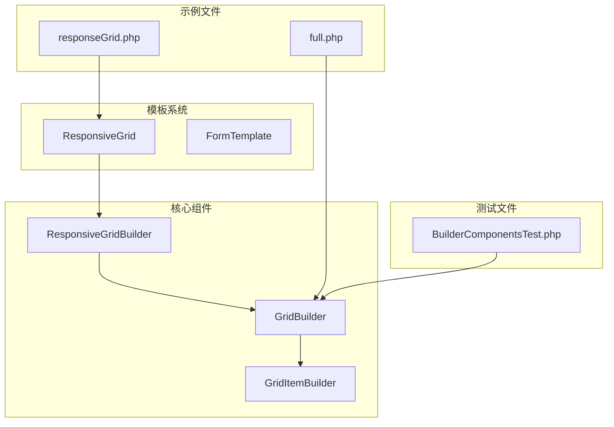

**图表来源**
- [GridBuilder.php](file://src/Components/GridBuilder.php#L1-L150)
- [GridItemBuilder.php](file://src/Components/GridItemBuilder.php#L1-L60)
- [ResponsiveGridBuilder.php](file://src/ResponsiveGridBuilder.php#L1-L82)

**章节来源**
- [GridBuilder.php](file://src/Components/GridBuilder.php#L1-L150)
- [GridItemBuilder.php](file://src/Components/GridItemBuilder.php#L1-L60)
- [ResponsiveGridBuilder.php](file://src/ResponsiveGridBuilder.php#L1-L82)

## 核心组件

Grid布局系统由三个核心组件构成：

### GridBuilder
GridBuilder是主布局容器，负责管理整个网格的布局配置和子组件的添加。

### GridItemBuilder  
GridItemBuilder是网格项的配置器，提供链式调用的方式来设置组件的布局属性。

### ResponsiveGridBuilder
ResponsiveGridBuilder提供了响应式网格布局功能，支持自动换行和列跨度计算。

**章节来源**
- [GridBuilder.php](file://src/Components/GridBuilder.php#L9-L150)
- [GridItemBuilder.php](file://src/Components/GridItemBuilder.php#L8-L60)
- [ResponsiveGridBuilder.php](file://src/ResponsiveGridBuilder.php#L7-L82)

## 架构概览

Grid布局系统采用分层架构设计，确保了灵活性和可扩展性：

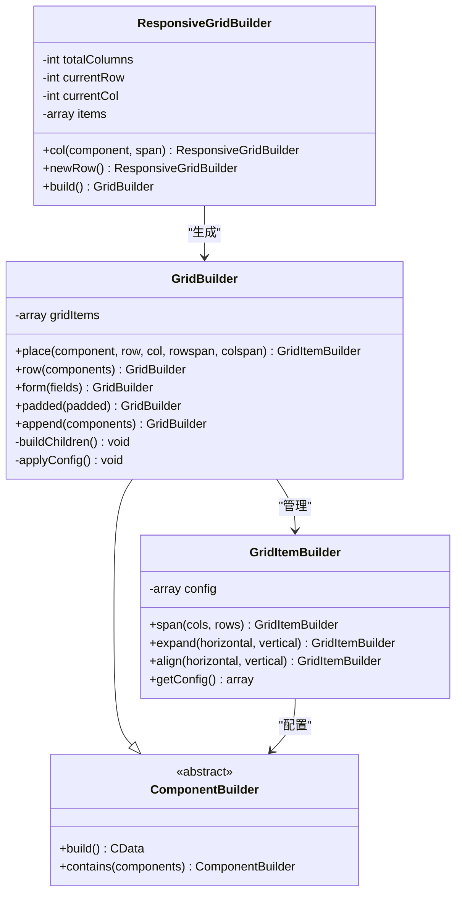

**图表来源**
- [GridBuilder.php](file://src/Components/GridBuilder.php#L9-L150)
- [GridItemBuilder.php](file://src/Components/GridItemBuilder.php#L8-L60)
- [ResponsiveGridBuilder.php](file://src/ResponsiveGridBuilder.php#L7-L82)

## 详细组件分析

### GridBuilder详细分析

GridBuilder继承自ComponentBuilder，提供了完整的网格布局功能：

#### 核心属性配置
GridBuilder提供了三个主要的配置选项：

| 配置项 | 类型 | 默认值 | 描述 |
|--------|------|--------|------|
| padded | boolean | true | 是否启用内边距 |
| columnSpacing | integer | 1 | 列间距 |
| rowSpacing | integer | 1 | 行间距 |

#### 核心方法详解

##### place方法
place方法是GridBuilder的核心方法，用于将组件添加到网格中：

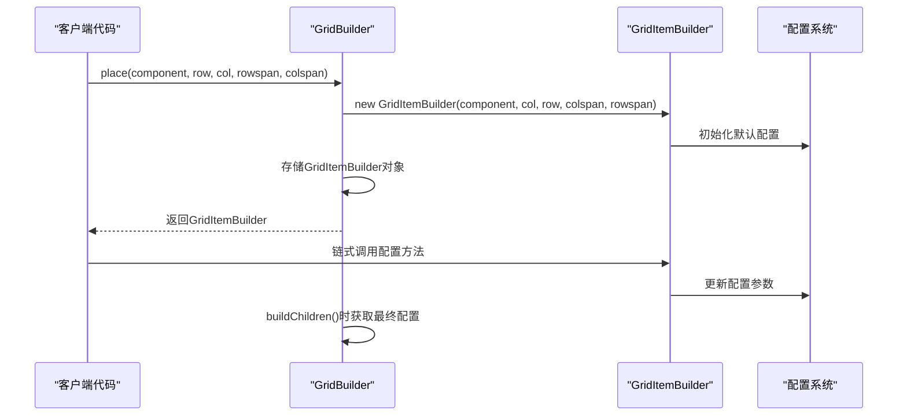

**图表来源**
- [GridBuilder.php](file://src/Components/GridBuilder.php#L60-L66)
- [GridItemBuilder.php](file://src/Components/GridItemBuilder.php#L12-L25)

##### form方法
form方法提供了快速创建表单布局的功能：

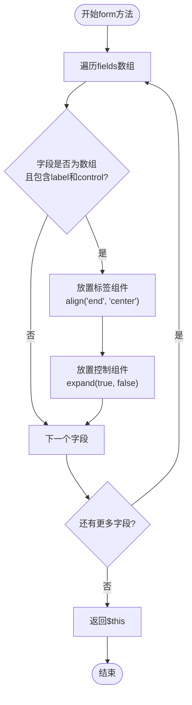

**图表来源**
- [GridBuilder.php](file://src/Components/GridBuilder.php#L81-L90)

##### row方法
row方法简化了在同一行添加多个组件的过程：

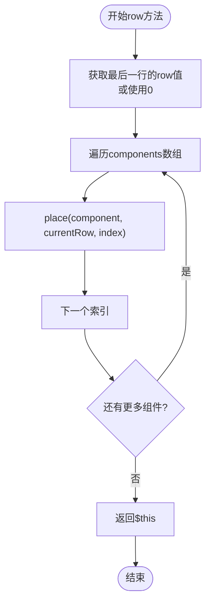

**图表来源**
- [GridBuilder.php](file://src/Components/GridBuilder.php#L69-L78)

**章节来源**
- [GridBuilder.php](file://src/Components/GridBuilder.php#L9-L150)

### GridItemBuilder详细分析

GridItemBuilder提供了链式调用来配置网格项的各种属性：

#### 配置参数详解

| 参数名 | 类型 | 默认值 | 描述 |
|--------|------|--------|------|
| left | integer | - | 组件左边界位置 |
| top | integer | - | 组件上边界位置 |
| xspan | integer | 1 | 水平跨越的列数 |
| yspan | integer | 1 | 垂直跨越的行数 |
| hexpand | boolean | false | 是否水平扩展 |
| vexpand | boolean | false | 是否垂直扩展 |
| halign | Align | Fill | 水平对齐方式 |
| valign | Align | Fill | 垂直对齐方式 |

#### 链式配置方法

##### span方法
span方法用于设置组件的跨行跨列跨度：

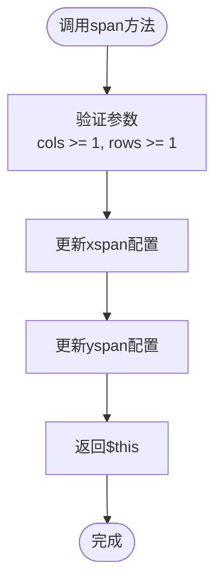

**图表来源**
- [GridItemBuilder.php](file://src/Components/GridItemBuilder.php#L28-L33)

##### expand方法
expand方法控制组件的扩展行为：

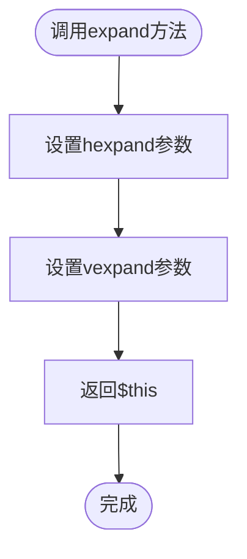

**图表来源**
- [GridItemBuilder.php](file://src/Components/GridItemBuilder.php#L35-L40)

##### align方法
align方法设置组件的对齐方式：

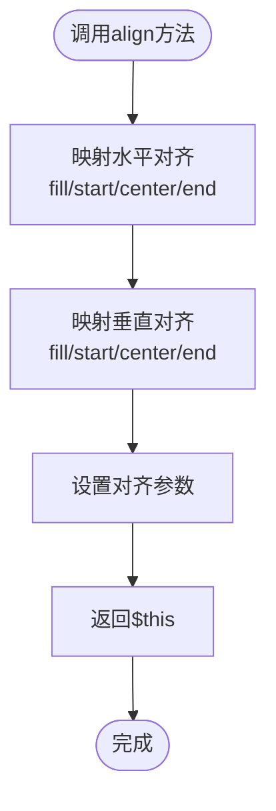

**图表来源**
- [GridItemBuilder.php](file://src/Components/GridItemBuilder.php#L42-L54)

**章节来源**
- [GridItemBuilder.php](file://src/Components/GridItemBuilder.php#L8-L60)

### ResponsiveGridBuilder分析

ResponsiveGridBuilder提供了响应式网格布局功能，支持自动换行和智能列跨度计算：

#### 核心特性
- **自动换行**：当当前行空间不足时自动换行
- **列跨度计算**：根据总列数和组件跨度自动计算位置
- **智能布局**：为不同类型的组件设置合适的对齐方式

#### 布局算法

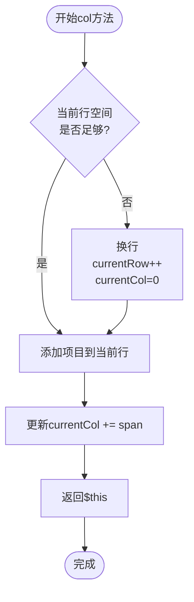

**图表来源**
- [ResponsiveGridBuilder.php](file://src/ResponsiveGridBuilder.php#L19-L35)

**章节来源**
- [ResponsiveGridBuilder.php](file://src/ResponsiveGridBuilder.php#L7-L82)

## 布局机制详解

### padded属性的影响

padded属性控制网格的内边距设置，直接影响组件之间的视觉间距：

#### 内边距的工作原理
- **padded = true**：启用网格内边距，组件之间有适当的间距
- **padded = false**：禁用内边距，组件紧密排列

#### 实际效果对比
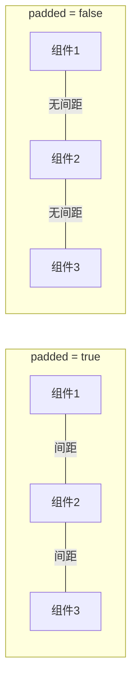

**章节来源**
- [GridBuilder.php](file://src/Components/GridBuilder.php#L15-L19)
- [GridBuilder.php](file://src/Components/GridBuilder.php#L29-L30)

### place方法的精确控制

place方法通过row、col、rowspan、colspan四个参数实现精确的组件位置和跨域控制：

#### 参数详解
- **row**：目标行位置（从0开始计数）
- **col**：目标列位置（从0开始计数）
- **rowspan**：垂直跨越的行数（默认1）
- **colspan**：水平跨越的列数（默认1）

#### 布局算法流程

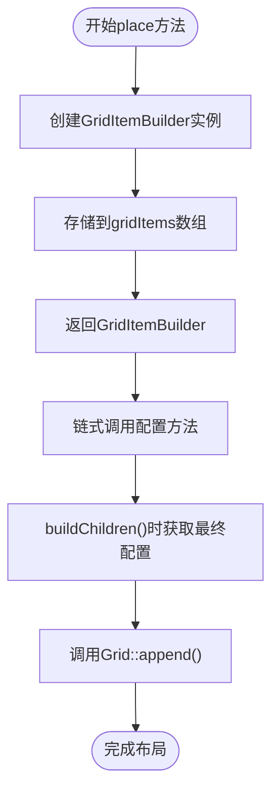

**图表来源**
- [GridBuilder.php](file://src/Components/GridBuilder.php#L60-L66)
- [GridBuilder.php](file://src/Components/GridBuilder.php#L37-L56)

**章节来源**
- [GridBuilder.php](file://src/Components/GridBuilder.php#L60-L66)
- [GridBuilder.php](file://src/Components/GridBuilder.php#L37-L56)

## 高级功能

### form方法的表单布局技巧

form方法提供了一种快速创建标准表单布局的方式：

#### 表单布局模式
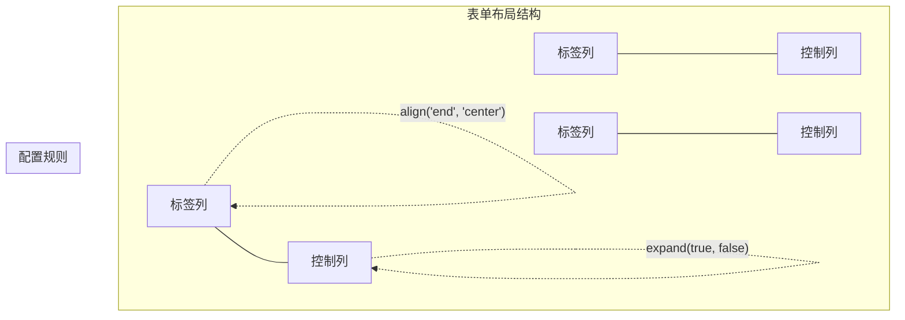

**图表来源**
- [GridBuilder.php](file://src/Components/GridBuilder.php#L86-L87)

#### 使用示例
form方法接受一个字段数组，每个字段包含label和control两个部分，自动应用以下配置：
- 标签右对齐（align('end', 'center')）
- 控件水平扩展（expand(true, false)）

**章节来源**
- [GridBuilder.php](file://src/Components/GridBuilder.php#L81-L90)

### row方法的行布局技巧

row方法简化了在同一行添加多个组件的过程：

#### 自动位置计算
row方法会自动计算当前行号，确保新添加的组件位于正确的行：

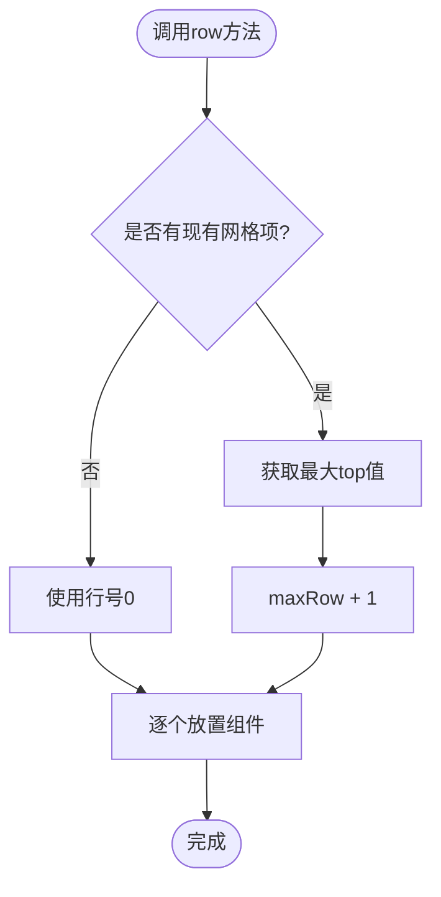

**图表来源**
- [GridBuilder.php](file://src/Components/GridBuilder.php#L71-L78)

**章节来源**
- [GridBuilder.php](file://src/Components/GridBuilder.php#L69-L78)

### append方法的追加功能

append方法提供了在表单下方追加额外组件的功能：

#### 追加逻辑
- 计算下一行的起始位置
- 为每个组件占据两列（整行宽度）
- 设置水平扩展和居中对齐

**章节来源**
- [GridBuilder.php](file://src/Components/GridBuilder.php#L113-L148)

## 实际应用案例

### 完整仪表盘构建案例

基于full.php中的实际案例，展示了复杂界面的构建过程：

#### 案例分析
该案例展示了如何使用Grid布局构建一个完整的仪表盘界面：

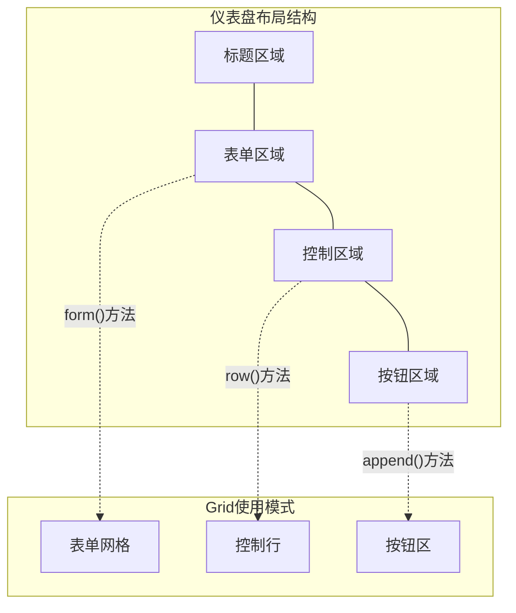

**图表来源**
- [full.php](file://example/full.php#L26-L112)

#### 关键布局策略
1. **表单区域**：使用form方法创建标签-控制对布局
2. **控制区域**：使用row方法创建水平排列的控件
3. **按钮区域**：使用append方法添加操作按钮

**章节来源**
- [full.php](file://example/full.php#L1-L180)

### 响应式网格案例

基于responseGrid.php中的案例，展示了响应式布局的实现：

#### 响应式布局特点
- 支持12列网格系统
- 自动换行机制
- 智能列跨度分配

#### 使用模式
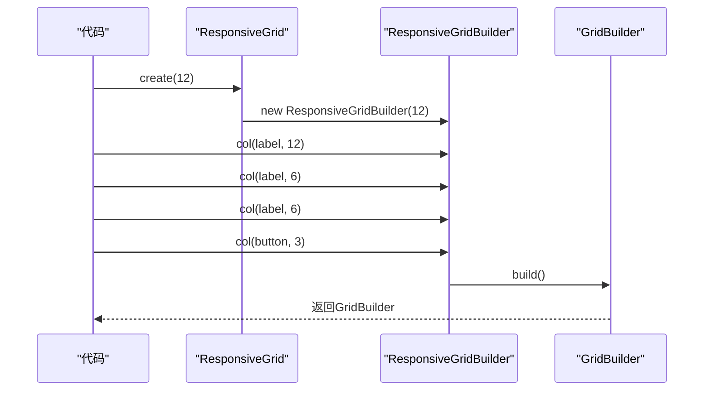

**图表来源**
- [responseGrid.php](file://example/responseGrid.php#L10-L17)
- [ResponsiveGrid.php](file://src/Templates/ResponsiveGrid.php#L10-L12)

**章节来源**
- [responseGrid.php](file://example/responseGrid.php#L1-L25)
- [ResponsiveGrid.php](file://src/Templates/ResponsiveGrid.php#L1-L14)

## 常见问题与解决方案

### 组件重叠问题

#### 问题描述
多个组件在同一网格位置上重叠显示

#### 根本原因
- GridItemBuilder对象被过早复制配置
- 链式调用的配置修改未反映到最终布局

#### 解决方案
基于BUGFIX_GRID_ITEM.md中的修复：

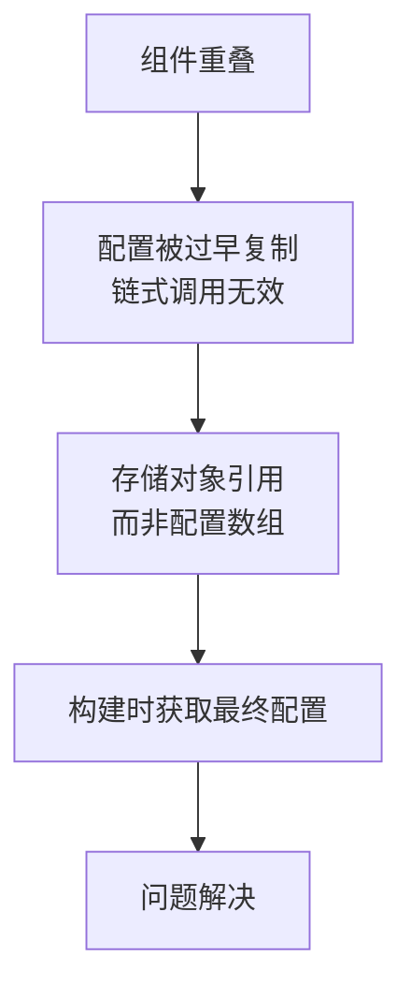

**图表来源**
- [BUGFIX_GRID_ITEM.md](file://BUGFIX_GRID_ITEM.md#L1-L99)

#### 修复要点
1. **存储对象引用**：在place方法中存储GridItemBuilder对象
2. **延迟配置获取**：在buildChildren()时获取最终配置
3. **兼容性处理**：修改使用array_column的地方

**章节来源**
- [BUGFIX_GRID_ITEM.md](file://BUGFIX_GRID_ITEM.md#L1-L99)
- [GridBuilder.php](file://src/Components/GridBuilder.php#L62-L66)
- [GridBuilder.php](file://src/Components/GridBuilder.php#L39-L56)

### 跨行错位问题

#### 问题描述
使用rowspan或colspan时组件位置不正确

#### 根本原因
HTML渲染器中rowspan/colspan默认值错误

#### 解决方案
基于BUGFIX_ROWSPAN.md中的修复：

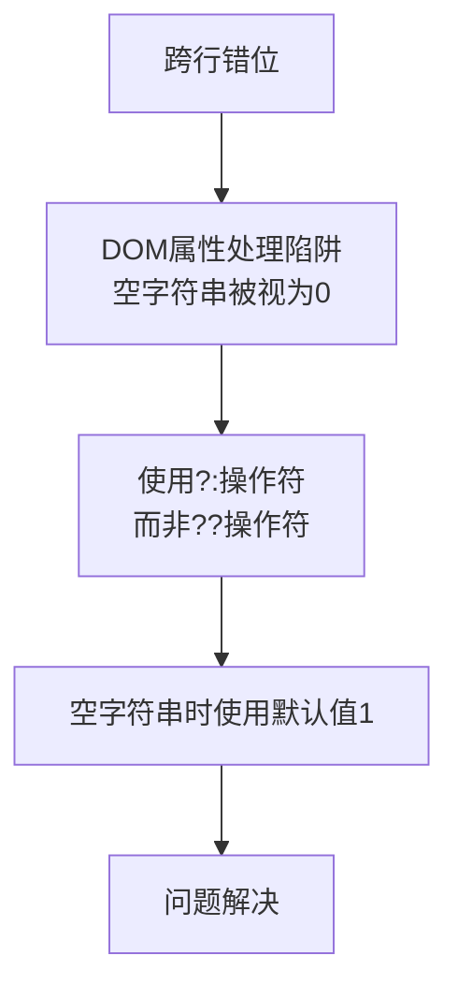

**图表来源**
- [BUGFIX_ROWSPAN.md](file://BUGFIX_ROWSPAN.md#L1-L78)

#### 修复要点
1. **DOM属性处理**：使用`?:`替代`??`操作符
2. **默认值设置**：确保缺失属性使用默认值1
3. **类型转换**：正确处理空字符串到整数的转换

**章节来源**
- [BUGFIX_ROWSPAN.md](file://BUGFIX_ROWSPAN.md#L1-L78)

### 布局冲突问题

#### 问题描述
多个组件试图占据同一网格空间

#### 解决策略
1. **明确布局规划**：预先设计好网格布局结构
2. **使用span方法**：合理设置组件的跨行跨列跨度
3. **检查重叠**：确保组件位置不重叠

## 性能优化建议

### 避免频繁重建网格

#### 优化原则
- **缓存布局结果**：避免重复计算相同的布局
- **延迟构建**：只在需要时才执行布局构建
- **增量更新**：只更新变化的部分

#### 实现策略
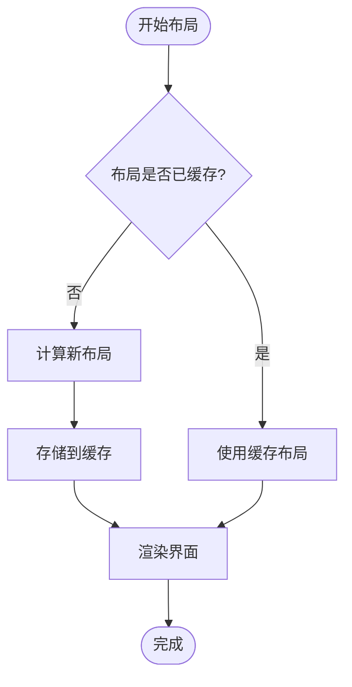

### 减少配置复制开销

#### 优化方案
1. **对象引用存储**：避免过早复制配置数组
2. **延迟配置获取**：在构建时才获取最终配置
3. **批量操作**：减少频繁的小规模配置修改

#### 性能对比
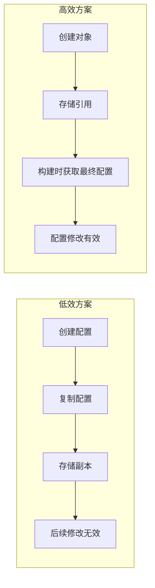

**章节来源**
- [GridBuilder.php](file://src/Components/GridBuilder.php#L62-L66)
- [GridBuilder.php](file://src/Components/GridBuilder.php#L39-L56)

### 合理使用响应式布局

#### 优势
- **自动适应**：根据可用空间自动调整布局
- **减少维护**：无需手动计算每个组件的位置
- **提升体验**：更好的用户体验和适配性

#### 使用建议
1. **预定义列数**：根据设计需求确定合适的列数
2. **智能换行**：利用自动换行功能简化布局逻辑
3. **组件适配**：为不同类型组件设置合适的对齐方式

**章节来源**
- [ResponsiveGridBuilder.php](file://src/ResponsiveGridBuilder.php#L19-L35)

## 总结

Grid布局系统是libuiBuilder框架中功能最强大的布局工具，通过GridBuilder和GridItemBuilder的协同工作，提供了精确而灵活的二维布局能力。

### 核心优势
1. **精确控制**：通过row、col、rowspan、colspan实现精确定位
2. **链式配置**：GridItemBuilder提供直观的链式调用接口
3. **响应式支持**：ResponsiveGridBuilder支持自适应布局
4. **表单友好**：内置form方法简化表单布局创建
5. **性能优化**：合理的对象管理和配置获取机制

### 最佳实践
1. **合理规划布局**：预先设计好网格结构
2. **充分利用辅助方法**：使用form、row、append等便捷方法
3. **注意配置时机**：确保链式调用在build之前完成
4. **处理边界情况**：考虑组件重叠和跨行错位问题
5. **性能意识**：避免频繁重建和不必要的配置复制

Grid布局系统为开发者提供了构建复杂用户界面的强大工具，掌握其核心概念和使用技巧，能够显著提升开发效率和界面质量。