# 响应式支持

<cite>
**本文档中引用的文件**
- [ResponsiveGridBuilder.php](file://src/ResponsiveGridBuilder.php)
- [GridBuilder.php](file://src/Components/GridBuilder.php)
- [GridItemBuilder.php](file://src/Components/GridItemBuilder.php)
- [ComponentBuilder.php](file://src/ComponentBuilder.php)
- [ResponsiveGrid.php](file://src/Templates/ResponsiveGrid.php)
- [responseGrid.php](file://example/responseGrid.php)
</cite>

## 目录
1. [简介](#简介)
2. [项目结构](#项目结构)
3. [核心组件](#核心组件)
4. [架构概览](#架构概览)
5. [详细组件分析](#详细组件分析)
6. [响应式布局原理](#响应式布局原理)
7. [智能对齐策略](#智能对齐策略)
8. [使用示例](#使用示例)
9. [与标准GridBuilder的关系](#与标准gridbuilder的关系)
10. [适用场景](#适用场景)
11. [总结](#总结)

## 简介

ResponsiveGridBuilder是一个专门设计用于创建响应式网格布局的PHP类，它基于12列栅格系统，提供了智能的自动换行机制和灵活的布局控制能力。该类通过简化的方法链接口，使开发者能够轻松构建适应不同屏幕尺寸的弹性用户界面。

ResponsiveGridBuilder的核心优势在于其自动化程度高，能够根据可用空间智能地决定何时换行，同时为不同类型组件提供最优的对齐策略，确保界面既美观又实用。

## 项目结构

ResponsiveGridBuilder位于项目的视图层，与其他UI构建组件协同工作：

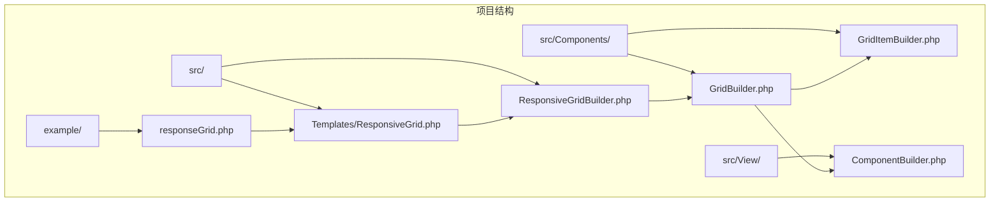

**图表来源**
- [ResponsiveGridBuilder.php](file://src/ResponsiveGridBuilder.php#L1-L82)
- [ResponsiveGrid.php](file://src/Templates/ResponsiveGrid.php#L1-L14)
- [GridBuilder.php](file://src/Components/GridBuilder.php#L1-L150)

**章节来源**
- [ResponsiveGridBuilder.php](file://src/ResponsiveGridBuilder.php#L1-L82)
- [ResponsiveGrid.php](file://src/Templates/ResponsiveGrid.php#L1-L14)

## 核心组件

ResponsiveGridBuilder包含以下核心组件：

### 主要类层次结构

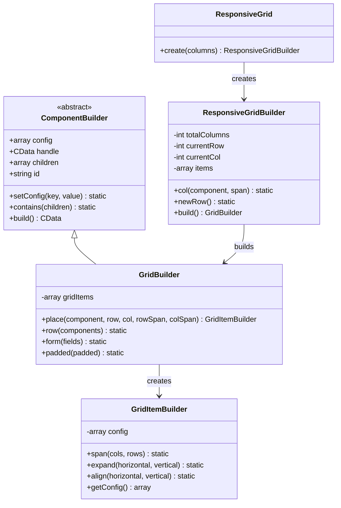

**图表来源**
- [ComponentBuilder.php](file://src/ComponentBuilder.php#L11-L234)
- [GridItemBuilder.php](file://src/Components/GridItemBuilder.php#L8-L60)
- [GridBuilder.php](file://src/Components/GridBuilder.php#L9-L150)
- [ResponsiveGridBuilder.php](file://src/ResponsiveGridBuilder.php#L7-L71)
- [ResponsiveGrid.php](file://src/Templates/ResponsiveGrid.php#L8-L14)

**章节来源**
- [ComponentBuilder.php](file://src/ComponentBuilder.php#L11-L234)
- [GridItemBuilder.php](file://src/Components/GridItemBuilder.php#L8-L60)
- [GridBuilder.php](file://src/Components/GridBuilder.php#L9-L150)
- [ResponsiveGridBuilder.php](file://src/ResponsiveGridBuilder.php#L7-L71)
- [ResponsiveGrid.php](file://src/Templates/ResponsiveGrid.php#L8-L14)

## 架构概览

ResponsiveGridBuilder采用模板方法模式和建造者模式相结合的设计，提供了流畅的链式调用接口：

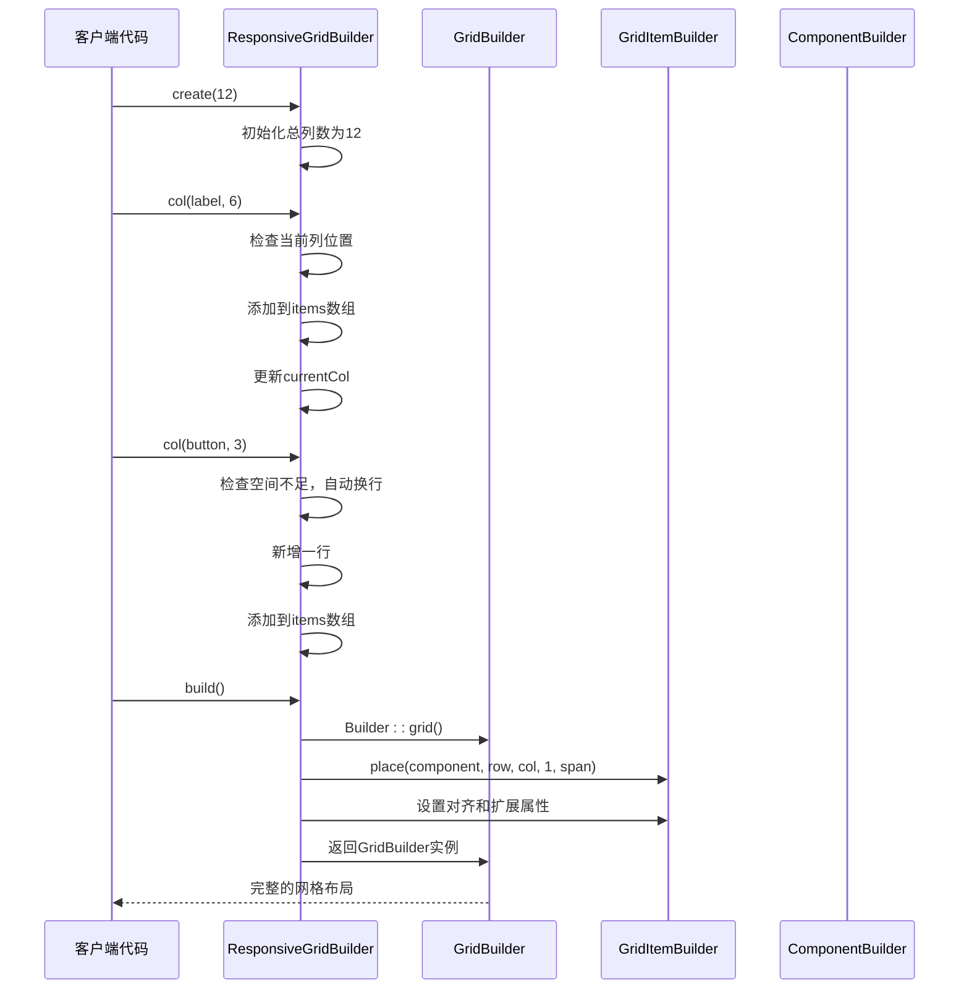

**图表来源**
- [ResponsiveGridBuilder.php](file://src/ResponsiveGridBuilder.php#L19-L70)
- [GridBuilder.php](file://src/Components/GridBuilder.php#L59-L66)

## 详细组件分析

### ResponsiveGridBuilder类分析

ResponsiveGridBuilder类是响应式网格布局的核心实现，具有以下关键特性：

#### 私有属性分析

| 属性 | 类型 | 描述 | 默认值 |
|------|------|------|--------|
| `$totalColumns` | int | 总列数（默认12列） | 构造函数参数 |
| `$currentRow` | int | 当前行号 | 0 |
| `$currentCol` | int | 当前列位置 | 0 |
| `$items` | array | 存储所有网格项的数组 | [] |

#### col方法实现逻辑

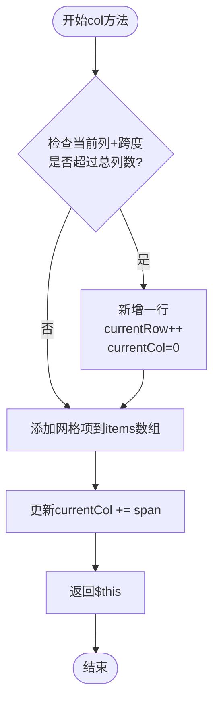

**图表来源**
- [ResponsiveGridBuilder.php](file://src/ResponsiveGridBuilder.php#L19-L35)

#### newRow方法功能

newRow方法提供手动换行功能，重置当前列位置到0，同时增加行号：


**图表来源**
- [ResponsiveGridBuilder.php](file://src/ResponsiveGridBuilder.php#L38-L43)

#### build方法转换流程

build方法将内部布局数据转换为标准GridBuilder实例：

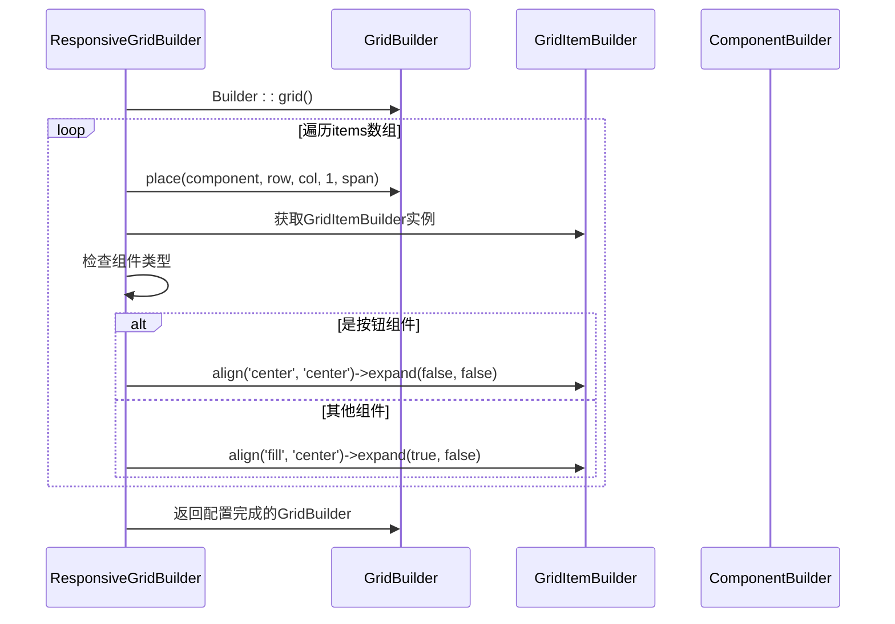

**图表来源**
- [ResponsiveGridBuilder.php](file://src/ResponsiveGridBuilder.php#L45-L69)

**章节来源**
- [ResponsiveGridBuilder.php](file://src/ResponsiveGridBuilder.php#L7-L71)

### GridBuilder类分析

GridBuilder类负责实际的网格布局管理和渲染：

#### 核心方法功能

| 方法名 | 参数 | 返回值 | 功能描述 |
|--------|------|--------|----------|
| `place()` | ComponentBuilder, int, int, int, int | GridItemBuilder | 在指定位置放置组件 |
| `row()` | array<ComponentBuilder> | static | 在新行放置多个组件 |
| `form()` | array | static | 快速创建表单布局 |
| `padded()` | bool | static | 设置内边距 |

#### GridItemBuilder类分析

GridItemBuilder类提供网格项的配置能力：

| 方法名 | 参数 | 返回值 | 功能描述 |
|--------|------|--------|----------|
| `span()` | int, int | static | 设置跨行列数 |
| `expand()` | bool, bool | static | 设置水平/垂直扩展 |
| `align()` | string, string | static | 设置水平/垂直对齐 |

**章节来源**
- [GridBuilder.php](file://src/Components/GridBuilder.php#L59-L150)
- [GridItemBuilder.php](file://src/Components/GridItemBuilder.php#L8-L60)

## 响应式布局原理

### 12列栅格系统

ResponsiveGridBuilder基于12列栅格系统设计，这是现代Web设计中最常用的布局基础：

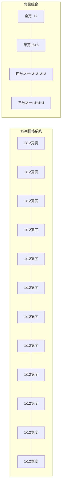

### 自动换行机制

自动换行是ResponsiveGridBuilder的核心特性，其实现原理如下：

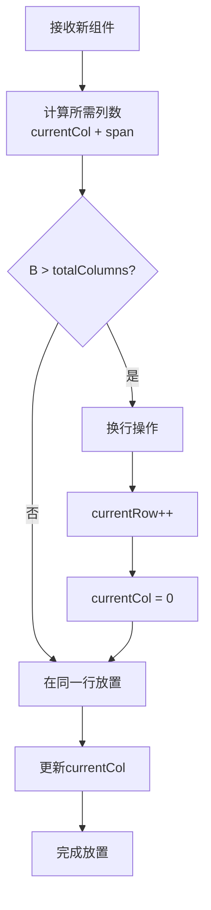

**图表来源**
- [ResponsiveGridBuilder.php](file://src/ResponsiveGridBuilder.php#L21-L25)

### 列跨度计算

每种组件类型的列跨度计算遵循以下原则：

| 组件类型 | 推荐跨度 | 说明 |
|----------|----------|------|
| 标题/大文本 | 12 | 占满整行 |
| 标签/说明文字 | 3-4 | 适合短文本 |
| 输入框 | 6-8 | 提供足够编辑空间 |
| 按钮组 | 3-4 | 便于用户操作 |
| 图片/媒体 | 4-6 | 保持视觉平衡 |

**章节来源**
- [ResponsiveGridBuilder.php](file://src/ResponsiveGridBuilder.php#L19-L35)

## 智能对齐策略

ResponsiveGridBuilder实现了智能的对齐策略，针对不同类型的组件提供最优的显示效果：

### 对齐策略分类

```mermaid
graph TB
subgraph "组件类型识别"
A[获取组件类名] --> B{是否包含'Button'?}
B --> |是| C[按钮类组件]
B --> |否| D[其他控件]
end
subgraph "按钮类组件对齐"
C --> E[align('center', 'center')]
E --> F[expand(false, false)]
F --> G[不拉伸，居中显示]
end
subgraph "其他控件对齐"
D --> H[align('fill', 'center')]
H --> I[expand(true, false)]
I --> J[水平填充，垂直居中]
end
```

**图表来源**
- [ResponsiveGridBuilder.php](file://src/ResponsiveGridBuilder.php#L59-L66)

### 对齐策略详解

#### 按钮类组件（Button）

对于按钮类组件，采用居中对齐且不扩展的策略：

- **水平对齐**: `'center'` - 按钮在网格单元格中水平居中
- **垂直对齐**: `'center'` - 按钮在网格单元格中垂直居中  
- **水平扩展**: `false` - 不拉伸填满整个单元格宽度
- **垂直扩展**: `false` - 不拉伸填满整个单元格高度

这种策略避免了按钮被过度压缩或拉伸，保持了良好的视觉效果和交互体验。

#### 其他控件（Label, Entry等）

对于其他类型的控件，采用水平填充的策略：

- **水平对齐**: `'fill'` - 控件水平方向填满网格单元格
- **垂直对齐**: `'center'` - 垂直方向居中对齐
- **水平扩展**: `true` - 允许水平方向扩展以充分利用空间
- **垂直扩展**: `false` - 保持垂直方向的原始大小

这种策略确保了输入控件等需要一定空间的组件能够获得足够的显示区域。

### 对齐策略的优势

1. **视觉一致性**: 不同类型的组件采用最适合的对齐方式
2. **用户体验**: 按钮保持适当的大小和间距，便于点击
3. **空间利用**: 其他控件充分利用可用空间，提高布局效率
4. **自适应性**: 无论组件内容如何变化，都能保持良好的显示效果

**章节来源**
- [ResponsiveGridBuilder.php](file://src/ResponsiveGridBuilder.php#L59-L66)

## 使用示例

### 基础使用示例

以下展示了ResponsiveGridBuilder的基本使用方法：

#### 标准布局示例

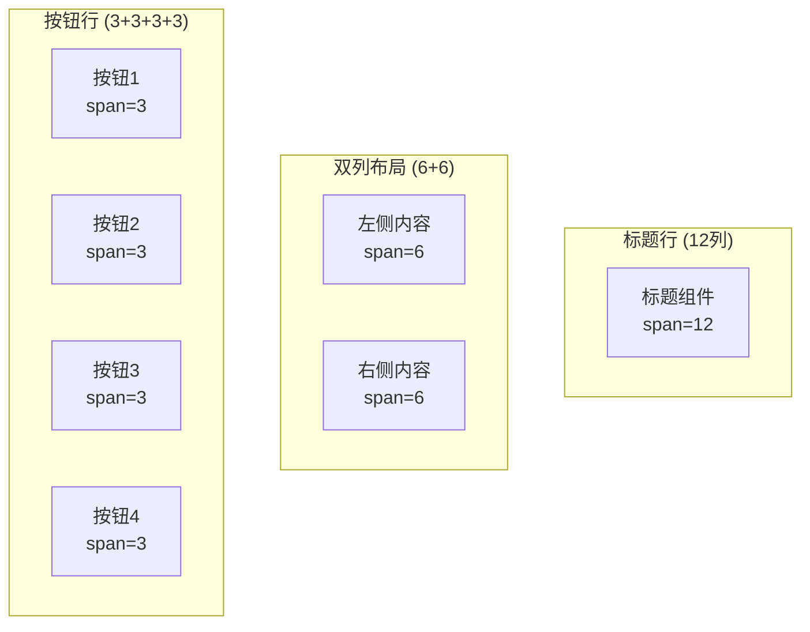

**图表来源**
- [responseGrid.php](file://example/responseGrid.php#L10-L17)

#### 复杂布局示例

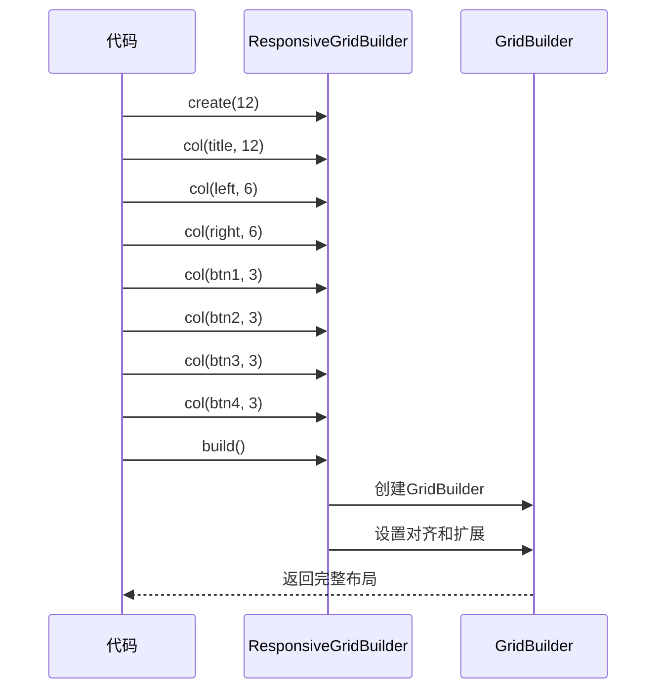

**图表来源**
- [responseGrid.php](file://example/responseGrid.php#L10-L18)

### 高级使用技巧

#### 手动换行控制

使用`newRow()`方法可以在特定位置强制换行：

```mermaid
flowchart LR
A[col(component1, 6)] --> B[col(component2, 6)]
B --> C[newRow()]
C --> D[col(component3, 12)]
D --> E[自动换行]
```

#### 动态布局调整

可以根据屏幕尺寸动态调整列跨度：

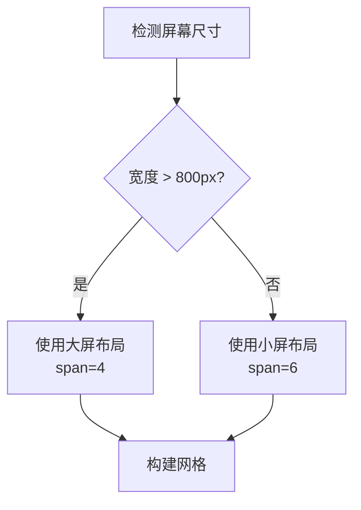

**章节来源**
- [responseGrid.php](file://example/responseGrid.php#L1-L25)

## 与标准GridBuilder的关系

### 关系映射

ResponsiveGridBuilder与标准GridBuilder之间存在明确的继承和组合关系：

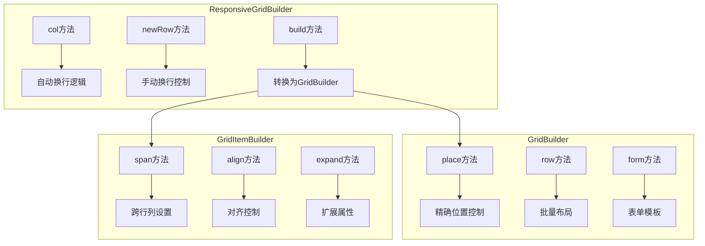

**图表来源**
- [ResponsiveGridBuilder.php](file://src/ResponsiveGridBuilder.php#L45-L69)
- [GridBuilder.php](file://src/Components/GridBuilder.php#L59-L150)
- [GridItemBuilder.php](file://src/Components/GridItemBuilder.php#L28-L60)

### 互补关系

#### ResponsiveGridBuilder的优势

1. **自动化程度高**: 自动处理换行逻辑，减少开发工作量
2. **智能对齐**: 根据组件类型自动选择最优对齐方式
3. **简洁接口**: 提供直观的链式调用语法
4. **响应式友好**: 基于12列系统，适合响应式设计

#### GridBuilder的优势

1. **精确控制**: 支持精确的行列定位和跨度设置
2. **高级功能**: 提供表单模板、批量布局等高级功能
3. **灵活性**: 支持复杂的嵌套布局结构
4. **性能优化**: 直接操作网格，性能开销较小

### 使用建议

| 场景 | 推荐方案 | 原因 |
|------|----------|------|
| 快速原型开发 | ResponsiveGridBuilder | 开发效率高，自动处理细节 |
| 复杂布局需求 | GridBuilder | 精确控制，功能丰富 |
| 响应式设计 | ResponsiveGridBuilder + Media Queries | 结合两者优势 |
| 表单界面 | GridBuilder.form() | 内置表单布局模板 |

**章节来源**
- [ResponsiveGridBuilder.php](file://src/ResponsiveGridBuilder.php#L45-L69)
- [GridBuilder.php](file://src/Components/GridBuilder.php#L59-L150)

## 适用场景

### 最佳适用场景

#### 1. 表单界面布局

ResponsiveGridBuilder特别适合表单界面的快速构建：

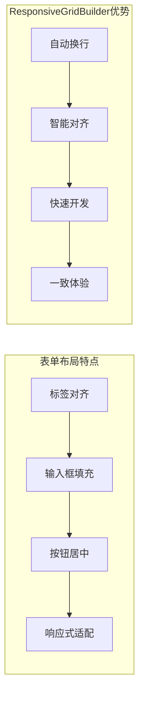

#### 2. 工具栏和按钮组

对于工具栏和按钮组的布局，ResponsiveGridBuilder提供了理想的解决方案：

- **按钮间距**: 通过合理的跨度设置保持适当的间距
- **对齐方式**: 按钮自动居中，视觉效果更佳
- **响应式**: 在不同尺寸下保持良好的排列

#### 3. 内容卡片布局

适用于内容卡片的网格布局：

- **统一尺寸**: 可以轻松创建等宽的卡片布局
- **自动换行**: 内容过多时自动换行，避免布局混乱
- **灵活调整**: 可以根据内容动态调整卡片大小

### 限制和注意事项

#### 1. 精度要求高的场景

对于需要精确控制位置的场景，可能需要结合GridBuilder使用：

- **固定布局**: 需要严格控制组件位置时
- **复杂重叠**: 组件需要相互重叠显示时
- **动画效果**: 需要精确控制动画路径时

#### 2. 性能考虑

在大量组件的场景下，需要注意性能：

- **组件数量**: 过多的小组件可能影响渲染性能
- **频繁更新**: 频繁的布局更新可能导致性能问题
- **内存使用**: 大量网格项可能增加内存消耗

#### 3. 响应式设计限制

虽然支持基本的响应式，但在极端尺寸下可能需要额外处理：

- **超小屏幕**: 可能需要额外的断点处理
- **超大屏幕**: 可能需要限制最大宽度
- **横竖屏切换**: 需要考虑方向变化的影响

### 性能优化建议

#### 1. 合理的列跨度设计

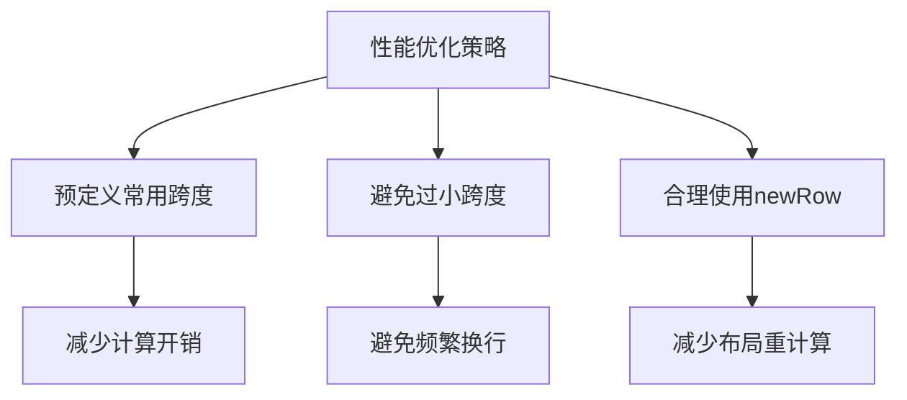

#### 2. 组件复用策略

- **模板化**: 创建可复用的组件模板
- **配置化**: 通过配置而非硬编码创建布局
- **缓存机制**: 对于静态布局考虑缓存结果

**章节来源**
- [ResponsiveGridBuilder.php](file://src/ResponsiveGridBuilder.php#L1-L82)

## 总结

ResponsiveGridBuilder是一个精心设计的响应式网格布局解决方案，它成功地将复杂的布局逻辑封装在简洁易用的API背后。通过基于12列栅格系统的自动换行机制和智能对齐策略，它为开发者提供了一个高效、可靠的布局工具。

### 核心价值

1. **开发效率**: 通过自动化换行和智能对齐，大幅减少开发时间
2. **用户体验**: 为不同类型的组件提供最优的显示效果
3. **维护性**: 清晰的代码结构和直观的API设计
4. **扩展性**: 与标准GridBuilder的良好兼容性和互补关系

### 技术特色

- **智能算法**: 基于组件类型的自动对齐决策
- **流畅接口**: 支持链式调用的优雅语法
- **响应式友好**: 专为现代响应式设计而生
- **类型安全**: 通过类型检查确保正确的使用方式

### 应用前景

随着Web应用向更加响应式和移动友好的方向发展，ResponsiveGridBuilder这样的工具将变得越来越重要。它不仅简化了开发过程，更重要的是为用户创造了更好的界面体验。在未来的项目中，合理运用这类工具，将有助于构建更加现代化和用户友好的应用程序。