# GridBuilder二维网格布局机制深度解析

<cite>
**本文档引用的文件**
- [GridBuilder.php](file://src/Components/GridBuilder.php)
- [GridItemBuilder.php](file://src/Components/GridItemBuilder.php)
- [ResponsiveGridBuilder.php](file://src/ResponsiveGridBuilder.php)
- [BUGFIX_GRID_ITEM.md](file://BUGFIX_GRID_ITEM.md)
- [BUGFIX_ROWSPAN.md](file://BUGFIX_ROWSPAN.md)
- [builder_helpers_demo.php](file://example/builder_helpers_demo.php)
- [BuilderComponentsTest.php](file://tests/BuilderComponentsTest.php)
</cite>

## 目录
1. [简介](#简介)
2. [核心架构概览](#核心架构概览)
3. [GridBuilder基础功能](#gridbuilder基础功能)
4. [GridItemBuilder链式配置](#griditembuilder链式配置)
5. [place方法精确定位机制](#place方法精确定位机制)
6. [内部存储结构与渲染流程](#内部存储结构与渲染流程)
7. [实际应用示例](#实际应用示例)
8. [常见问题与解决方案](#常见问题与解决方案)
9. [性能优化建议](#性能优化建议)
10. [总结](#总结)

## 简介

GridBuilder是libuiBuilder框架中的核心二维网格布局组件，提供了强大而灵活的界面布局能力。它通过精确的行列定位和跨域控制，能够构建复杂的用户界面布局，支持组件的精确定位、大小调整和对齐方式设置。

GridBuilder的设计理念基于传统的表格布局思想，但提供了更加现代化和灵活的配置方式。通过GridItemBuilder的链式配置方法，开发者可以轻松实现复杂的布局需求，包括组件的跨行列扩展、对齐方式控制等高级功能。

## 核心架构概览

GridBuilder采用分层架构设计，主要包含以下核心组件：

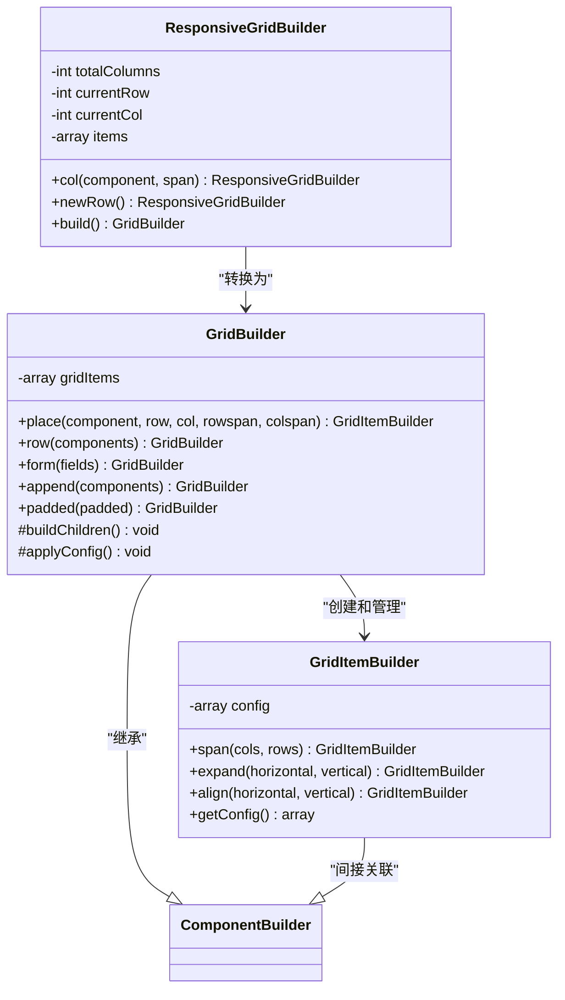

**图表来源**
- [GridBuilder.php](file://src/Components/GridBuilder.php#L9-L150)
- [GridItemBuilder.php](file://src/Components/GridItemBuilder.php#L8-L60)
- [ResponsiveGridBuilder.php](file://src/ResponsiveGridBuilder.php#L7-L82)

## GridBuilder基础功能

### 初始化与配置

GridBuilder提供了灵活的初始化方式，支持多种配置选项：

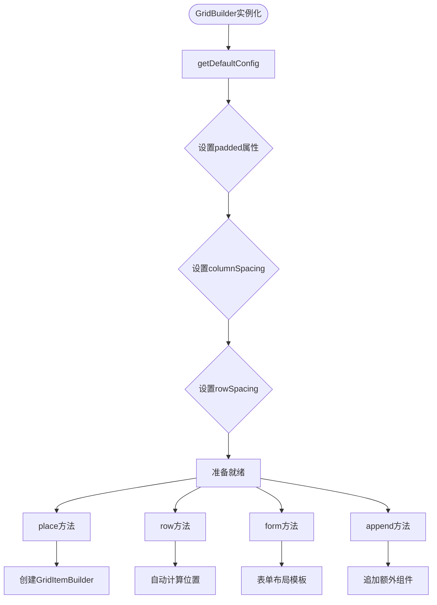

**图表来源**
- [GridBuilder.php](file://src/Components/GridBuilder.php#L13-L25)

### 核心配置参数

GridBuilder支持以下核心配置参数：

| 参数名称 | 类型 | 默认值 | 描述 |
|---------|------|--------|------|
| padded | bool | true | 是否启用内边距 |
| columnSpacing | int | 1 | 列间距（像素） |
| rowSpacing | int | 1 | 行间距（像素） |

**节来源**
- [GridBuilder.php](file://src/Components/GridBuilder.php#L13-L25)

## GridItemBuilder链式配置

GridItemBuilder是GridBuilder中负责单个网格项配置的核心类，提供了三个主要的链式配置方法：

### span方法 - 动态调整跨行列数

span方法允许动态调整组件在网格中的跨行列数，实现组件的合并和扩展：

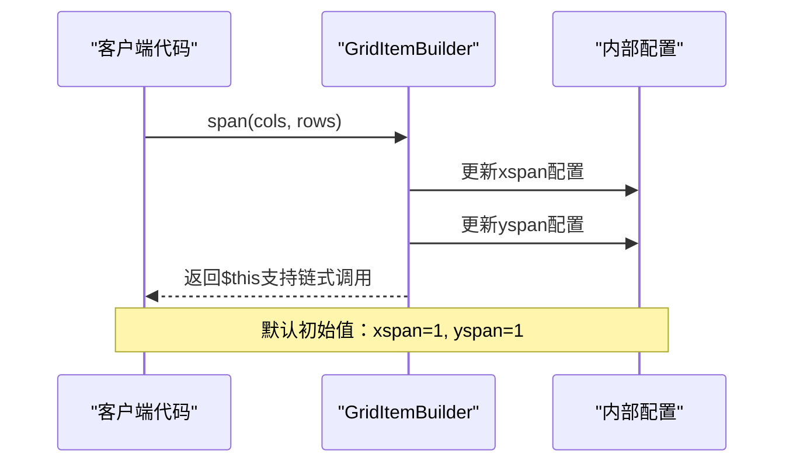

**图表来源**
- [GridItemBuilder.php](file://src/Components/GridItemBuilder.php#L28-L33)

### expand方法 - 组件扩展控制

expand方法控制组件是否扩展以填充可用空间：

| 参数 | 类型 | 默认值 | 描述 |
|------|------|--------|------|
| horizontal | bool | true | 是否水平扩展 |
| vertical | bool | false | 是否垂直扩展 |

### align方法 - 对齐方式设置

align方法设置组件的水平和垂直对齐方式，支持四种对齐模式：

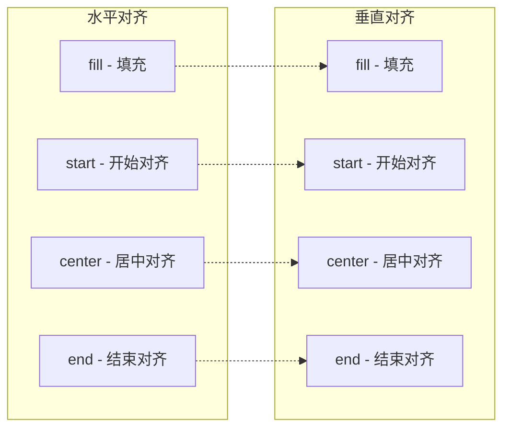

**图表来源**
- [GridItemBuilder.php](file://src/Components/GridItemBuilder.php#L42-L54)

**节来源**
- [GridItemBuilder.php](file://src/Components/GridItemBuilder.php#L28-L54)

## place方法精确定位机制

place方法是GridBuilder的核心方法，负责将组件精确放置到网格的指定位置：

### 方法签名与参数

```php
public function place(ComponentBuilder $component, int $row, int $col, 
                     int $rowSpan = 1, int $colSpan = 1): GridItemBuilder
```

### 定位算法详解

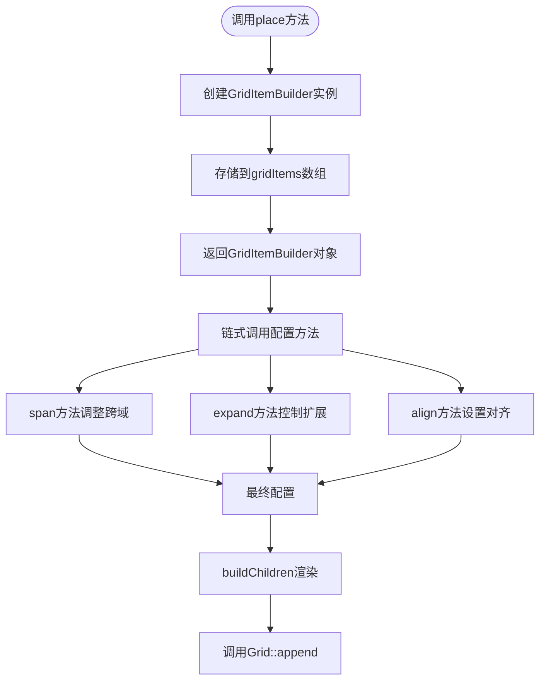

**图表来源**
- [GridBuilder.php](file://src/Components/GridBuilder.php#L60-L66)

### 内部坐标系统

GridBuilder使用基于零的行列坐标系统：

- **行坐标（row）**: 从上到下的行索引
- **列坐标（col）**: 从左到右的列索引
- **跨行跨度（rowSpan）**: 组件跨越的行数
- **跨列跨度（colSpan）**: 组件跨越的列数

**节来源**
- [GridBuilder.php](file://src/Components/GridBuilder.php#L60-L66)

## 内部存储结构与渲染流程

### 存储结构演进

GridBuilder经历了重要的架构改进，从早期的配置数组存储演进到现在的对象引用存储：

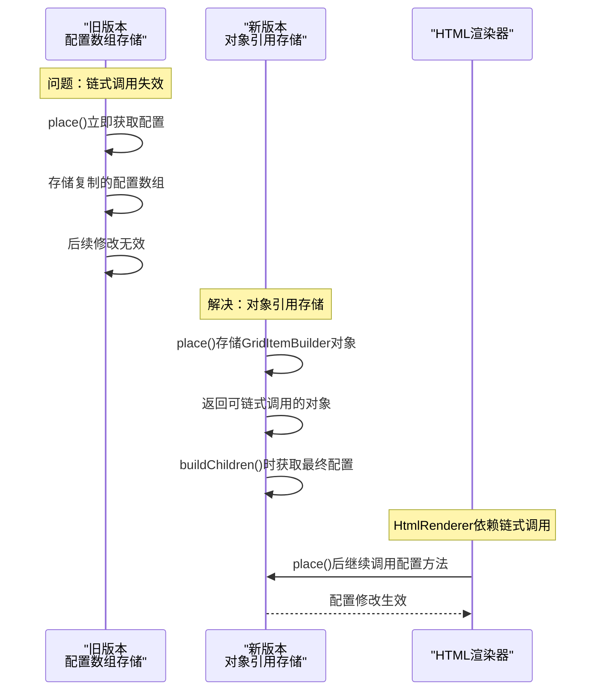

**图表来源**
- [BUGFIX_GRID_ITEM.md](file://BUGFIX_GRID_ITEM.md#L11-L40)

### buildChildren渲染流程

buildChildren方法负责将所有网格项渲染到原生UI组件：

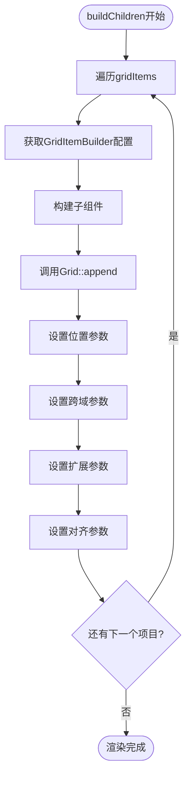

**图表来源**
- [GridBuilder.php](file://src/Components/GridBuilder.php#L37-L56)

### 配置映射关系

| GridItemBuilder配置 | 原生API参数 | 类型 | 描述 |
|-------------------|-------------|------|------|
| left | $left | int | 左侧起始列索引 |
| top | $top | int | 上方起始行索引 |
| xspan | $xspan | int | 水平跨列数 |
| yspan | $yspan | int | 垂直跨行数 |
| hexpand | $hexpand | bool | 水平扩展标志 |
| vexpand | $vexpand | bool | 垂直扩展标志 |
| halign | $halign->value | int | 水平对齐枚举值 |
| valign | $valign | Align | 垂直对齐枚举对象 |

**节来源**
- [GridBuilder.php](file://src/Components/GridBuilder.php#L37-L56)

## 实际应用示例

### 基础网格布局

以下展示了如何使用GridBuilder创建基础的表单布局：

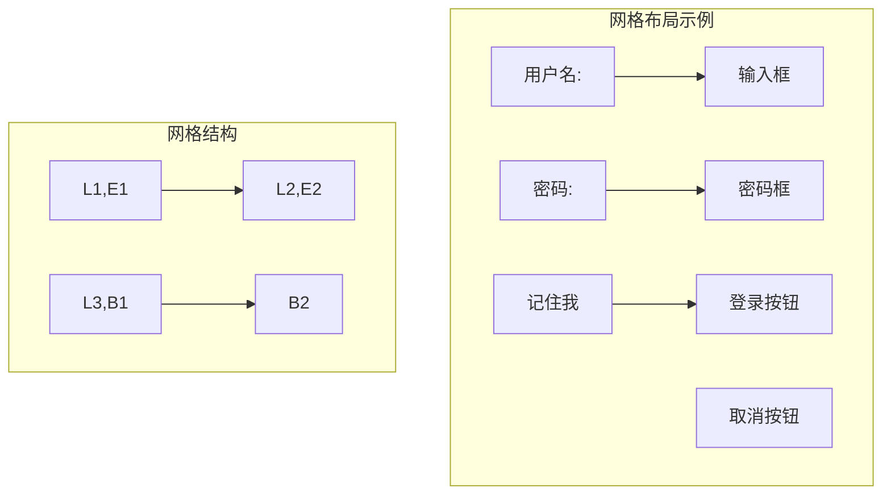

**图表来源**
- [builder_helpers_demo.php](file://example/builder_helpers_demo.php#L95-L122)

### 响应式网格布局

ResponsiveGridBuilder提供了基于列数的响应式布局能力：

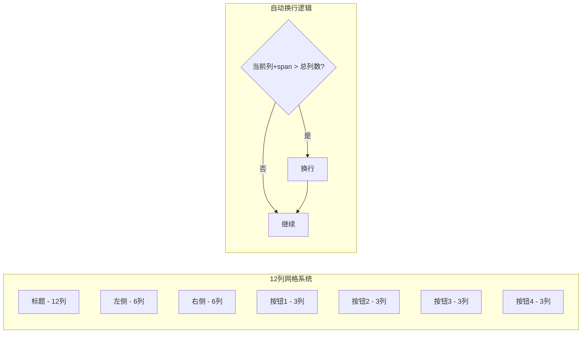

**图表来源**
- [ResponsiveGridBuilder.php](file://src/ResponsiveGridBuilder.php#L19-L35)

### 复杂布局场景

GridBuilder支持多种复杂布局场景：

| 布局类型 | 实现方式 | 应用场景 |
|---------|----------|----------|
| 表单布局 | form()方法 | 用户注册、登录表单 |
| 网格布局 | place()方法 | 数据表格、图片画廊 |
| 响应式布局 | ResponsiveGridBuilder | 移动端适配 |
| 分组布局 | row()方法 | 按功能分组的界面 |

**节来源**
- [GridBuilder.php](file://src/Components/GridBuilder.php#L69-L91)
- [ResponsiveGridBuilder.php](file://src/ResponsiveGridBuilder.php#L45-L70)

## 常见问题与解决方案

### 组件重叠问题

**问题描述**: 多个组件在同一网格单元格中重叠显示

**根本原因**: 
- 未正确设置跨行或跨列跨度
- 对齐方式设置不当
- 组件尺寸超出网格单元格

**解决方案**:
1. 使用span()方法正确设置组件的跨行列数
2. 调整align()方法的对齐参数
3. 确保组件的最小尺寸不超过网格单元格

### 跨行错位问题

**问题描述**: 组件在跨行时出现位置偏移

**根本原因**:
- GridItemBuilder配置被过早复制
- HtmlRenderer无法正确应用链式调用

**解决方案**:
根据BUGFIX_GRID_ITEM.md的修复方案，确保GridBuilder存储GridItemBuilder对象引用而非配置数组：

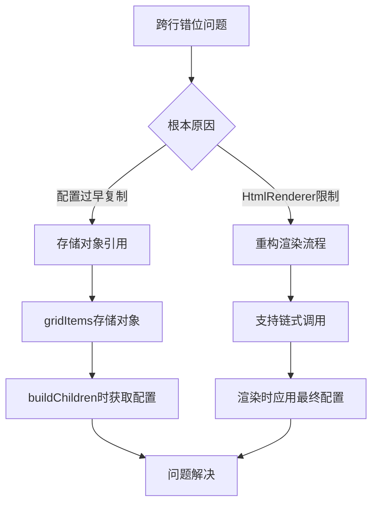

**图表来源**
- [BUGFIX_GRID_ITEM.md](file://BUGFIX_GRID_ITEM.md#L42-L99)

### DOM属性默认值错误

**问题描述**: HtmlRenderer中rowspan和colspan属性默认值为0

**根本原因**: PHP DOMElement::getAttribute()返回空字符串而非null

**解决方案**: 使用`?:`操作符替代`??`操作符：

```php
// 错误代码
$rowspan = (int)($child->getAttribute('rowspan') ?? 1);

// 正确代码  
$rowspan = (int)($child->getAttribute('rowspan') ?: 1);
```

**节来源**
- [BUGFIX_ROWSPAN.md](file://BUGFIX_ROWSPAN.md#L40-L44)

## 性能优化建议

### 避免频繁重建网格

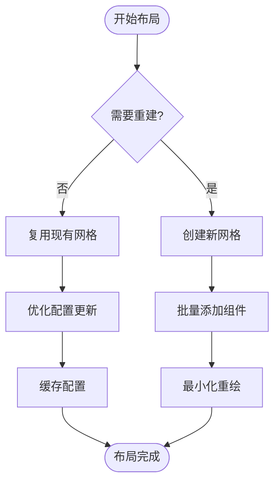

### 最佳实践建议

| 优化策略 | 实现方法 | 性能收益 |
|---------|----------|----------|
| 批量添加 | 使用row()或append()方法 | 减少多次调用开销 |
| 配置复用 | 预先设置通用配置 | 避免重复配置 |
| 延迟渲染 | onShow事件中创建 | 提升启动速度 |
| 内存管理 | 及时释放不需要的组件 | 控制内存使用 |

### 嵌套优化

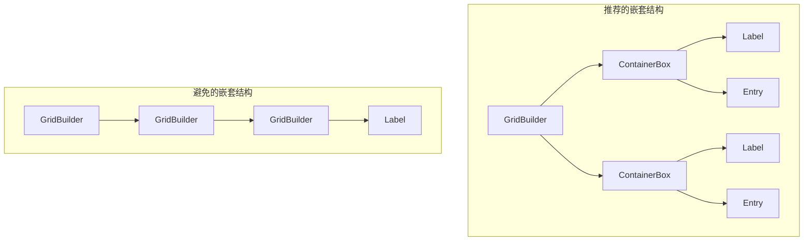

**节来源**
- [GridBuilder.php](file://src/Components/GridBuilder.php#L69-L149)

## 总结

GridBuilder作为libuiBuilder框架的核心布局组件，提供了强大而灵活的二维网格布局能力。通过GridItemBuilder的链式配置方法，开发者可以精确控制组件的位置、大小和对齐方式。

### 关键特性总结

1. **精确控制**: 通过row、col、rowspan、colspan参数实现精确定位
2. **灵活配置**: GridItemBuilder提供span、expand、align链式方法
3. **智能布局**: 支持自动换行、响应式布局等多种布局模式
4. **高性能**: 优化的渲染流程和内存管理机制

### 开发建议

- 合理使用span方法进行组件合并
- 根据实际需求选择合适的对齐方式
- 避免过度嵌套和频繁重建网格
- 充分利用预定义的布局方法如form()和append()

GridBuilder的设计充分体现了现代UI框架的最佳实践，为开发者提供了构建复杂用户界面的强大工具。通过深入理解其工作机制和优化策略，可以充分发挥其潜力，创建出既美观又高效的用户界面。