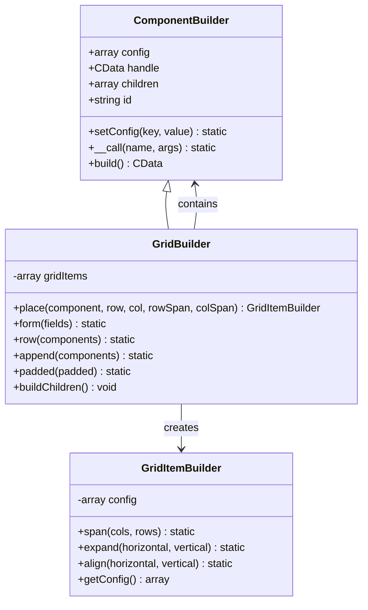
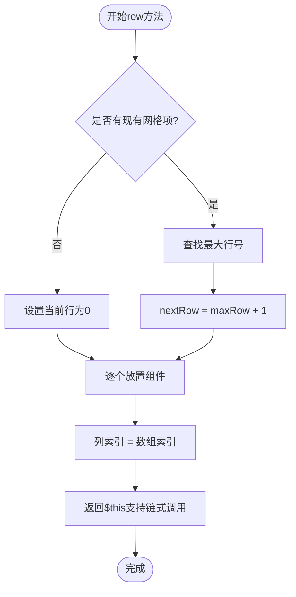
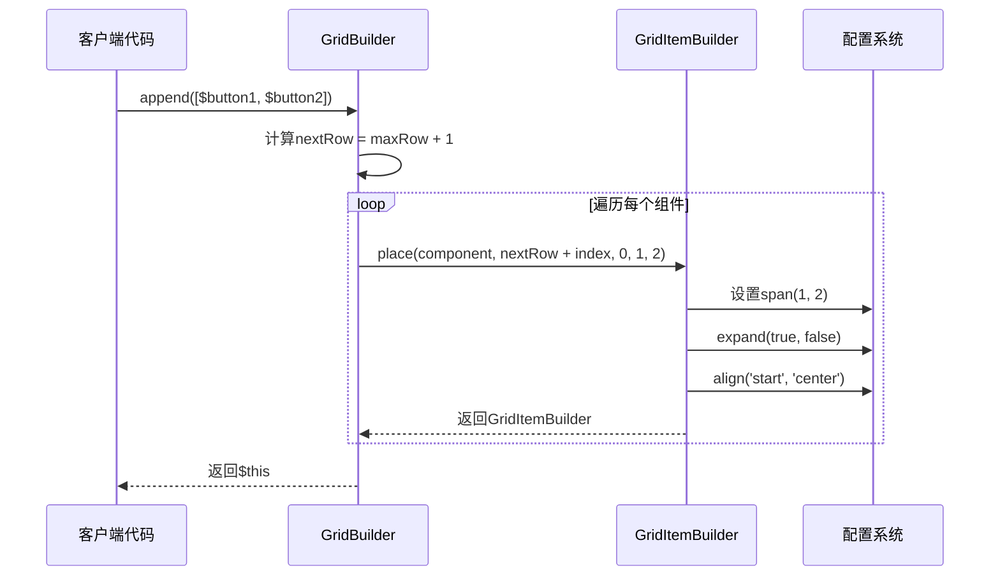

# GridBuilder模板方法详细文档

<cite>
**本文档中引用的文件**
- [GridBuilder.php](file://src/Components/GridBuilder.php)
- [GridItemBuilder.php](file://src/Components/GridItemBuilder.php)
- [full.php](file://example/full.php)
- [FormTemplate.php](file://src/Templates/FormTemplate.php)
- [TabBuilder.php](file://src/Builder/TabBuilder.php)
- [ComponentBuilder.php](file://src/ComponentBuilder.php)
</cite>

## 目录
1. [简介](#简介)
2. [GridBuilder核心架构](#gridbuilder核心架构)
3. [form方法详解](#form方法详解)
4. [row方法详解](#row方法详解)
5. [append方法详解](#append方法详解)
6. [实际应用案例](#实际应用案例)
7. [高级使用技巧](#高级使用技巧)
8. [自定义扩展建议](#自定义扩展建议)
9. [最佳实践](#最佳实践)
10. [总结](#总结)

## 简介

GridBuilder是libuiBuilder框架中的核心布局组件，提供了强大的二维网格布局能力。它不仅支持传统的网格定位方式，还提供了三个高级模板方法：`form`、`row`和`append`，这些方法专门针对常见的UI布局场景进行了优化，能够显著提升开发效率和代码可读性。

GridBuilder的设计理念是"约定优于配置"，通过预设的布局模式和智能的自动计算机制，让开发者能够专注于业务逻辑而非布局细节。

## GridBuilder核心架构

GridBuilder继承自ComponentBuilder，提供了完整的网格布局功能。其核心架构包括以下几个关键组件：



**图表来源**
- [GridBuilder.php](file://src/Components/GridBuilder.php#L9-L150)
- [GridItemBuilder.php](file://src/Components/GridItemBuilder.php#L8-L60)
- [ComponentBuilder.php](file://src/ComponentBuilder.php#L11-L234)

**章节来源**
- [GridBuilder.php](file://src/Components/GridBuilder.php#L9-L150)
- [GridItemBuilder.php](file://src/Components/GridItemBuilder.php#L8-L60)

## form方法详解

`form`方法是GridBuilder最强大的模板方法之一，专门用于快速构建表单布局。它采用"标签-控件"的配对模式，自动实现左对齐标签和水平扩展控件的效果。

### 方法签名与参数

```php
public function form(array $fields): static
```

### 工作原理

form方法接受一个字段数组，每个字段必须包含`label`和`control`两个键：

```php
[
    'label' => Builder::label()->text('用户名:'),
    'control' => Builder::entry()->placeholder('请输入用户名')
]
```

### 自动布局策略

1. **标签对齐**：标签组件自动设置为右对齐（`align('end', 'center')`）
2. **控件扩展**：控件组件自动设置为水平扩展（`expand(true, false)`）
3. **位置计算**：自动根据字段索引确定行号，列号固定为0（标签）和1（控件）

### 使用示例

基于full.php中的实际应用：

```php
Builder::grid()->form([
    [
        'label' => Builder::label()->text('单行输入:'),
        'control' => Builder::entry()
            ->id('singleLineInput')
            ->placeholder('输入文本')
    ],
    [
        'label' => Builder::label()->text('多行输入:'),
        'control' => Builder::multilineEntry()
            ->id('multiLineInput')
            ->placeholder('输入多行文本...')
            ->wordWrap(true)
    ],
])
```

### 优势特点

- **一致性**：所有表单字段采用统一的布局风格
- **可读性**：清晰的标签-控件对应关系
- **可维护性**：字段配置集中管理，便于修改和扩展
- **响应式**：自动适应容器大小变化

**章节来源**
- [GridBuilder.php](file://src/Components/GridBuilder.php#L81-L91)
- [full.php](file://example/full.php#L26-L54)

## row方法详解

`row`方法提供了在下一行水平排列组件的能力，是GridBuilder中最简单但最实用的布局方法之一。

### 方法签名与参数

```php
public function row(array $components): static
```

### 智能位置计算

row方法的核心优势在于其智能的位置计算机制：



**图表来源**
- [GridBuilder.php](file://src/Components/GridBuilder.php#L69-L78)

### 使用场景

1. **按钮行布局**：在表单下方添加操作按钮
2. **工具栏**：水平排列的工具按钮
3. **导航栏**：水平的导航菜单
4. **状态显示**：水平排列的状态指示器

### 实际应用

```php
// 在表单下方添加按钮行
Builder::grid()->form($formFields)->row([
    Builder::button()->text('提交'),
    Builder::button()->text('重置'),
    Builder::button()->text('取消')
]);
```

### 注意事项

- **组件类型**：可以放置任何ComponentBuilder子类的实例
- **对齐方式**：所有组件在同一行内，垂直方向对齐由Grid底层控制
- **扩展属性**：需要手动设置组件的扩展属性以实现期望的布局效果

**章节来源**
- [GridBuilder.php](file://src/Components/GridBuilder.php#L69-L78)

## append方法详解

`append`方法是最具创造性的模板方法，专门用于在现有内容下方追加整行组件，特别适合添加按钮行、状态标签等辅助控件。

### 方法签名与参数

```php
public function append(array $components): static
```

### 高级布局策略

append方法采用独特的布局策略：



**图表来源**
- [GridBuilder.php](file://src/Components/GridBuilder.php#L113-L149)

### 关键特性

1. **整行占据**：每个组件占据两列宽度（`span(1, 2)`）
2. **水平扩展**：自动设置水平扩展属性（`expand(true, false)`）
3. **左对齐**：水平从开始位置对齐（`align('start', 'center')`）
4. **垂直居中**：垂直方向居中对齐

### 使用场景

1. **操作按钮行**：提交、重置、取消等操作按钮
2. **状态信息**：显示系统状态或操作结果
3. **分隔线**：视觉上的内容分隔
4. **辅助控件**：搜索框、过滤器等

### 实际应用示例

```php
// 在表单下方添加按钮行
Builder::grid()->form($formFields)->append([
    Builder::button()
        ->text('获取所有值')
        ->onClick(function($button, $state) {
            // 处理表单数据获取
        }),
    Builder::button()
        ->text('重置表单')
        ->onClick(function($button, $state) {
            // 处理表单重置
        })
]);
```

### 与其他方法的区别

| 方法 | 位置策略 | 扩展属性 | 对齐方式 | 使用场景 |
|------|----------|----------|----------|----------|
| `form` | 固定行列 | 标签右对齐，控件扩展 | 标签右对齐，控件水平扩展 | 表单布局 |
| `row` | 当前行下一行为起始 | 需要手动设置 | 由Grid控制 | 水平工具栏 |
| `append` | 现有内容下方 | 自动水平扩展 | 左对齐垂直居中 | 操作按钮行 |

**章节来源**
- [GridBuilder.php](file://src/Components/GridBuilder.php#L113-L149)

## 实际应用案例

基于full.php中的完整示例，我们可以看到GridBuilder模板方法的实际应用场景：

### 完整表单布局

```php
// 基础控件演示
Builder::grid()->form([
    [
        'label' => Builder::label()->text('单行输入:'),
        'control' => Builder::entry()
            ->id('singleLineInput')
            ->placeholder('输入文本')
    ],
    [
        'label' => Builder::label()->text('多行输入:'),
        'control' => Builder::multilineEntry()
            ->id('multiLineInput')
            ->placeholder('输入多行文本...')
            ->wordWrap(true)
    ],
])

// 添加操作按钮行
->append([
    Builder::button()
        ->text('获取所有值')
        ->onClick(function($button, $state) {
            // 获取表单数据
        }),
    Builder::button()
        ->text('重置表单')
        ->onClick(function($button, $state) {
            // 重置表单
        })
])
```

### 复合布局应用

```php
// 选择类控件布局
Builder::hbox()->contains([
    Builder::vbox()->contains([
        Builder::label()->text('复选框:'),
        Builder::checkbox()
            ->id('checkbox1')
            ->text('选项1')
            ->checked(true),
        Builder::checkbox()
            ->id('checkbox2')
            ->text('选项2'),
        Builder::checkbox()
            ->id('checkbox3')
            ->text('选项3'),
    ]),
    
    Builder::vSeparator(), // 垂直分隔符
    
    Builder::vbox()->contains([
        Builder::label()->text('单选框:'),
        Builder::radio()
            ->id('radioGroup')
            ->items(['选项A', '选项B', '选项C'])
            ->selected(0)
            ->onSelected(function($index) { 
                echo "选择了: $index\n"; 
            }),
    ]),
])
```

**章节来源**
- [full.php](file://example/full.php#L26-L176)

## 高级使用技巧

### 链式调用组合

GridBuilder模板方法支持完美的链式调用组合：

```php
Builder::grid()
    ->padded(true)
    ->form($formFields)
    ->row([$button1, $button2])
    ->append([$statusLabel, $progressBar]);
```

### 条件布局

根据不同的条件动态选择布局方法：

```php
$grid = Builder::grid();

if ($hasAdvancedOptions) {
    $grid->form($basicFields);
} else {
    $grid->row($simpleControls);
}

$grid->append([$submitButton]);
```

### 嵌套布局

结合其他布局容器实现复杂布局：

```php
Builder::vbox()->contains([
    Builder::label()->text('标题'),
    Builder::grid()->form($fields),
    Builder::hbox()->contains([$button1, $button2]),
    Builder::separator(),
    Builder::grid()->append([$footerContent])
]);
```

### 状态驱动布局

结合状态管理器实现动态布局：

```php
$grid = Builder::grid();

// 根据状态动态添加内容
if ($state->get('showAdvanced')) {
    $grid->form($advancedFields);
}

$grid->append([$state->get('buttons')]);
```

## 自定义扩展建议

### 创建专用表单模板

基于form方法创建更高级的表单模板：

```php
class AdvancedFormTemplate {
    public static function createWithValidation(array $fields): GridBuilder {
        $grid = Builder::grid();
        
        foreach ($fields as $field) {
            $grid->form([
                [
                    'label' => Builder::label()->text($field['label']),
                    'control' => self::createFieldWithValidation($field)
                ]
            ]);
        }
        
        return $grid;
    }
    
    private static function createFieldWithValidation(array $field): ComponentBuilder {
        // 实现验证逻辑
        return Builder::entry()
            ->validation(fn($value) => self::validate($value))
            ->placeholder($field['placeholder'] ?? '');
    }
}
```

### 扩展append方法

创建专门的工具栏模板：

```php
class ToolbarTemplate {
    public static function create(array $actions): GridBuilder {
        $buttons = array_map(function($action) {
            return Builder::button()
                ->text($action['label'])
                ->icon($action['icon'] ?? '')
                ->onClick($action['handler']);
        }, $actions);
        
        return Builder::grid()->row($buttons);
    }
}
```

### 响应式布局适配

根据屏幕尺寸调整布局策略：

```php
class ResponsiveGrid {
    public static function create(array $components, int $screenWidth): GridBuilder {
        $grid = Builder::grid();
        
        if ($screenWidth < 800) {
            // 移动端布局：垂直排列
            foreach ($components as $component) {
                $grid->append([$component]);
            }
        } else {
            // 桌面端布局：水平排列
            $grid->row($components);
        }
        
        return $grid;
    }
}
```

## 最佳实践

### 布局设计原则

1. **一致性**：在整个应用中保持统一的布局风格
2. **层次感**：合理使用不同的布局方法区分内容层次
3. **响应式**：考虑不同屏幕尺寸下的布局效果
4. **可访问性**：确保布局对所有用户友好

### 性能优化建议

1. **避免过度嵌套**：合理使用布局容器，避免过深的嵌套结构
2. **批量操作**：尽可能使用批量方法（如row和append）而非逐个添加
3. **延迟加载**：对于大型表单，考虑使用懒加载技术

### 代码组织建议

1. **分离关注点**：将布局逻辑与业务逻辑分离
2. **模块化设计**：创建可复用的布局组件
3. **文档化**：为复杂的布局提供清晰的注释和文档

### 调试和测试

1. **可视化调试**：使用GridBuilder的内置调试功能
2. **单元测试**：为布局逻辑编写单元测试
3. **集成测试**：测试不同布局组合的效果

## 总结

GridBuilder的三个模板方法——`form`、`row`和`append`——构成了一个完整的布局解决方案，它们各自针对不同的使用场景进行了优化：

- **form方法**：专为表单布局设计，提供标签-控件的标准化布局
- **row方法**：提供简单的水平排列能力，适合工具栏和导航
- **append方法**：专门用于在现有内容下方添加辅助组件

这些方法不仅简化了开发流程，提高了代码可读性，更重要的是它们体现了"约定优于配置"的设计理念，让开发者能够专注于业务逻辑而非布局细节。通过合理的组合使用和适当的扩展，GridBuilder模板方法能够满足从简单表单到复杂仪表板的各种布局需求。

掌握这些模板方法的使用技巧，配合良好的代码组织和设计模式，将使你能够高效地构建出既美观又实用的桌面应用程序界面。