# 布局系统

<cite>
**本文档中引用的文件**
- [GridBuilder.php](file://src/Components/GridBuilder.php)
- [BoxBuilder.php](file://src/Components/BoxBuilder.php)
- [GridItemBuilder.php](file://src/Components/GridItemBuilder.php)
- [ResponsiveGridBuilder.php](file://src/ResponsiveGridBuilder.php)
- [builder_helpers_demo.php](file://example/builder_helpers_demo.php)
- [responseGrid.php](file://example/responseGrid.php)
- [FormTemplate.php](file://src/Templates/FormTemplate.php)
- [ResponsiveGrid.php](file://src/Templates/ResponsiveGrid.php)
- [helper.php](file://src/helper.php)
- [full.php](file://example/full.php)
</cite>

## 目录
1. [概述](#概述)
2. [Grid布局系统](#grid布局系统)
3. [Box布局系统](#box布局系统)
4. [布局系统对比](#布局系统对比)
5. [最佳实践](#最佳实践)
6. [复杂布局示例](#复杂布局示例)
7. [嵌套布局实现](#嵌套布局实现)
8. [总结](#总结)

## 概述

libuiBuilder提供了两种主要的布局系统：Grid（网格）布局和Box（盒子）布局。这两种布局系统各有特点，适用于不同的场景。Grid布局擅长处理二维布局，能够精确控制组件的位置和跨度；而Box布局则是一维布局容器，适合简单的线性排列。

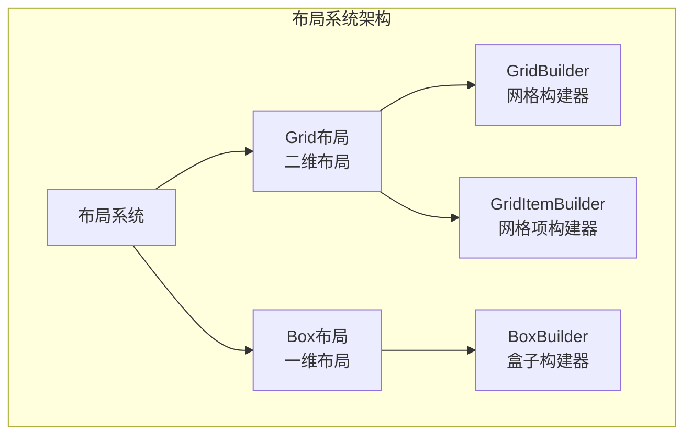

**图表来源**
- [GridBuilder.php](file://src/Components/GridBuilder.php#L1-L150)
- [BoxBuilder.php](file://src/Components/BoxBuilder.php#L1-L64)
- [GridItemBuilder.php](file://src/Components/GridItemBuilder.php#L1-L60)

## Grid布局系统

Grid布局是libuiBuilder中最强大的布局系统，专门设计用于处理复杂的二维布局需求。它允许开发者精确控制组件在网格中的位置和大小。

### GridBuilder核心特性

GridBuilder提供了丰富的配置选项和方法，支持复杂的网格布局：

#### 核心配置属性

| 属性名 | 类型 | 默认值 | 描述 |
|--------|------|--------|------|
| padded | bool | true | 是否启用内边距 |
| columnSpacing | int | 1 | 列间距 |
| rowSpacing | int | 1 | 行间距 |

#### 主要方法

##### 1. 基础定位方法

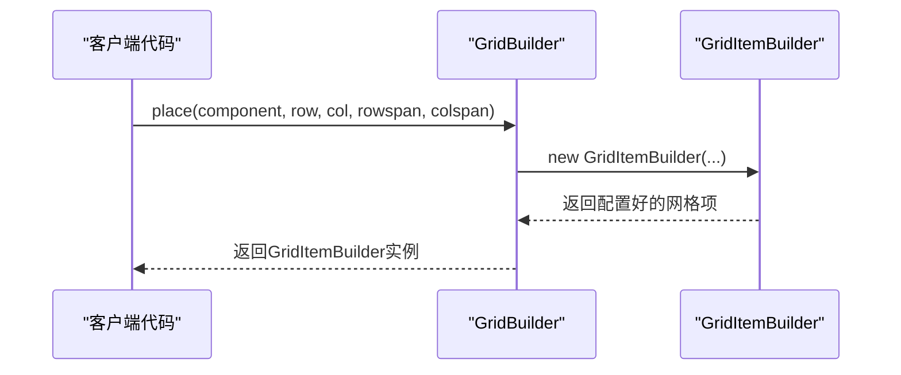

**图表来源**
- [GridBuilder.php](file://src/Components/GridBuilder.php#L59-L66)

##### 2. 行级布局方法

GridBuilder提供了`row()`方法，可以快速创建一行组件：

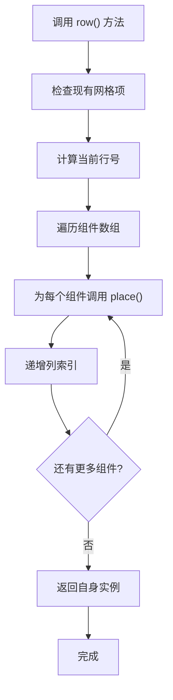

**图表来源**
- [GridBuilder.php](file://src/Components/GridBuilder.php#L68-L79)

##### 3. 表单布局方法

GridBuilder内置了`form()`方法，专门用于创建表单布局：

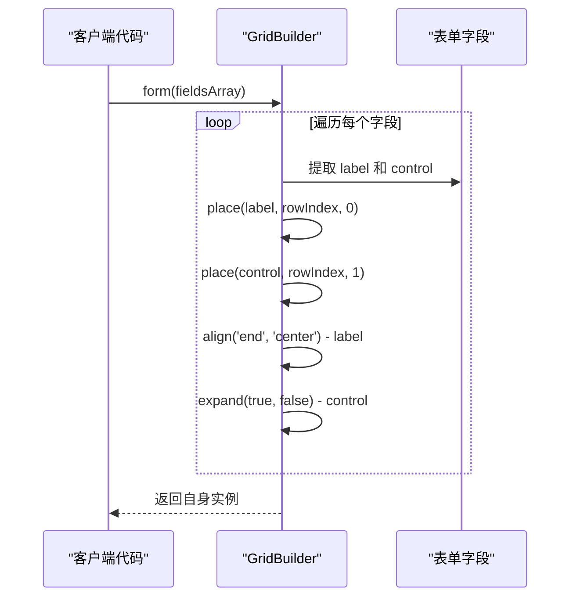

**图表来源**
- [GridBuilder.php](file://src/Components/GridBuilder.php#L81-L91)

### GridItemBuilder配置系统

GridItemBuilder负责管理单个网格项的详细配置：

#### 核心配置属性

| 属性名 | 类型 | 默认值 | 描述 |
|--------|------|--------|------|
| left | int | - | 左侧起始列索引 |
| top | int | - | 上方起始行索引 |
| xspan | int | 1 | 水平跨度（列数） |
| yspan | int | 1 | 垂直跨度（行数） |
| hexpand | bool | false | 水平方向是否扩展 |
| vexpand | bool | false | 垂直方向是否扩展 |
| halign | Align | Fill | 水平对齐方式 |
| valign | Align | Fill | 垂直对齐方式 |

#### 对齐方式映射

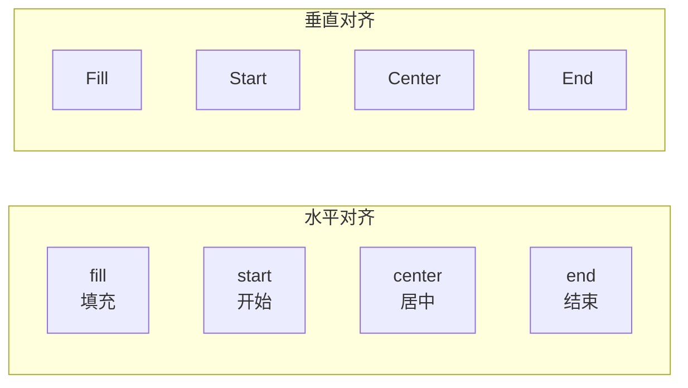

**图表来源**
- [GridItemBuilder.php](file://src/Components/GridItemBuilder.php#L44-L49)

### padded属性详解

GridBuilder的`padded`属性是一个重要的配置选项：

#### 功能说明
- **默认值**: true（启用内边距）
- **作用**: 控制网格容器是否添加额外的空白边距
- **影响范围**: 影响整个网格容器的视觉边界

#### 使用场景
- **启用padded**: 适用于需要清晰视觉分离的布局
- **禁用padded**: 适用于紧密排列的紧凑布局

**章节来源**
- [GridBuilder.php](file://src/Components/GridBuilder.php#L13-L20)
- [GridBuilder.php](file://src/Components/GridBuilder.php#L93-L99)

## Box布局系统

Box布局是一维布局系统，提供水平和垂直两种排列方式，适合简单的线性布局需求。

### BoxBuilder核心特性

BoxBuilder继承自ComponentBuilder，专注于一维布局：

#### 方向配置

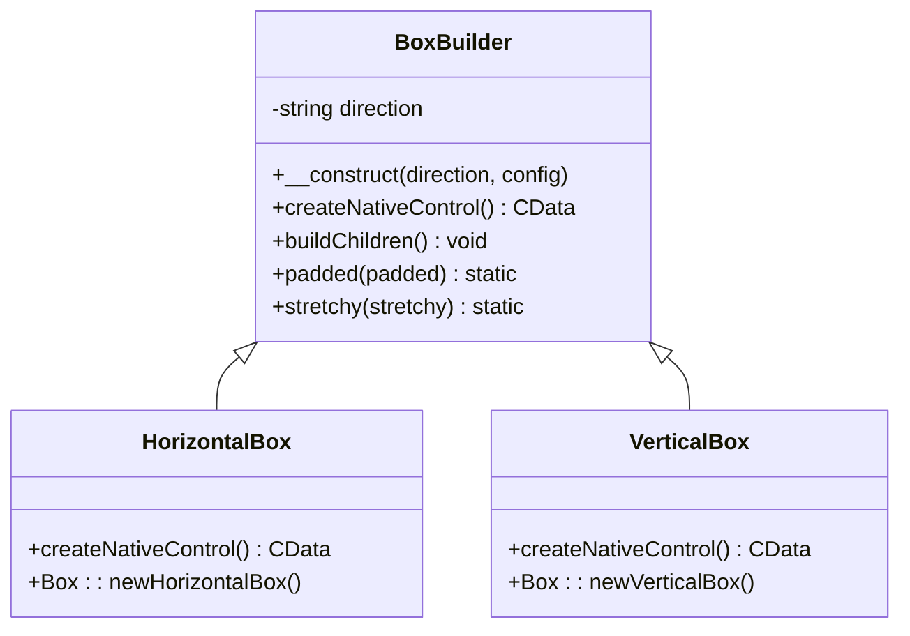

**图表来源**
- [BoxBuilder.php](file://src/Components/BoxBuilder.php#L11-L34)

#### 配置属性

| 属性名 | 类型 | 默认值 | 描述 |
|--------|------|--------|------|
| padded | bool | true | 是否启用内边距 |
| stretchy | bool | false | 子元素是否可拉伸 |

### Box布局的应用场景

#### 1. 水平布局（HBox）
- **适用场景**: 按钮组、工具栏、标签页
- **特点**: 子元素沿水平方向排列

#### 2. 垂直布局（VBox）
- **适用场景**: 表单、列表、面板
- **特点**: 子元素沿垂直方向排列

**章节来源**
- [BoxBuilder.php](file://src/Components/BoxBuilder.php#L13-L27)
- [BoxBuilder.php](file://src/Components/BoxBuilder.php#L29-L34)

## 布局系统对比

### Grid布局 vs Box布局

| 特性 | Grid布局 | Box布局 |
|------|----------|---------|
| 布局维度 | 二维（行列） | 一维（水平/垂直） |
| 精确控制 | ✅ 完全支持 | ✅ 基本支持 |
| 跨越能力 | ✅ 支持跨行列 | ❌ 不支持 |
| 表单友好度 | ✅ 优秀 | ✅ 良好 |
| 性能开销 | ⚠️ 较高 | ✅ 较低 |
| 学习曲线 | ⚠️ 中等 | ✅ 简单 |

### 选择指南

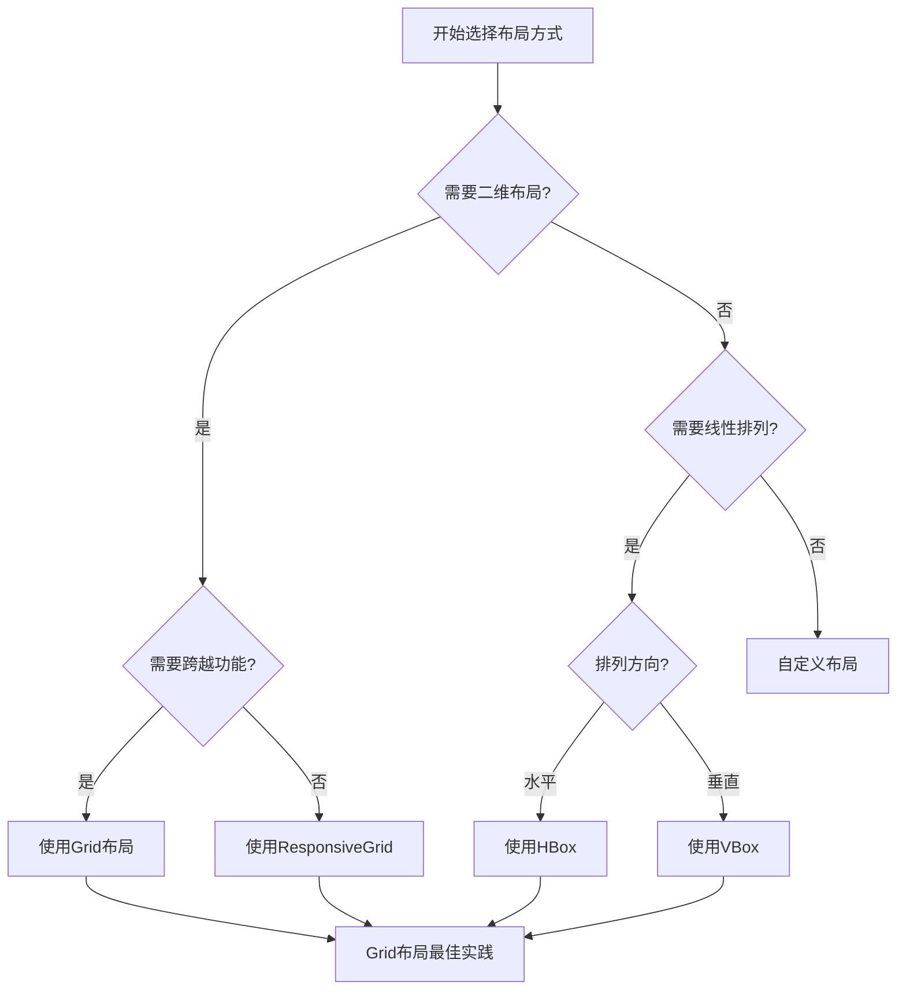

## 最佳实践

### 优先使用Grid布局的原则

libuiBuilder的设计理念建议优先使用Grid布局，原因如下：

#### 1. 功能完整性
- **二维定位**: 支持精确的行列定位
- **跨越能力**: 可以让组件跨越多行或多列
- **对齐控制**: 提供丰富的对齐选项

#### 2. 表单友好性
Grid布局特别适合表单设计，可以轻松实现标签-控件对齐：

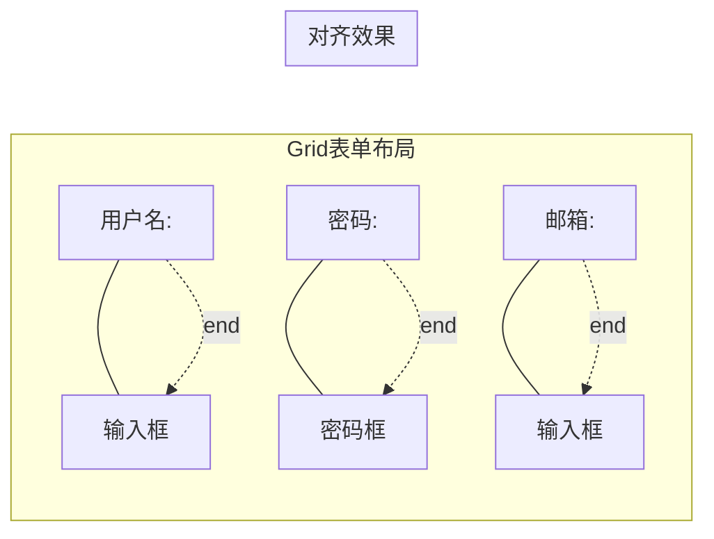

**图表来源**
- [GridBuilder.php](file://src/Components/GridBuilder.php#L85-L87)

#### 3. 维护性和可读性
- **结构清晰**: 二维布局直观易懂
- **配置集中**: 所有属性都在GridItemBuilder中管理
- **扩展性强**: 易于添加新的网格项

### 辅助函数的使用

libuiBuilder提供了丰富的辅助函数来简化布局创建：

#### 布局辅助函数

| 函数名 | 返回类型 | 用途 |
|--------|----------|------|
| window() | WindowBuilder | 创建窗口 |
| vbox() | BoxBuilder | 创建垂直布局 |
| hbox() | BoxBuilder | 创建水平布局 |
| grid() | GridBuilder | 创建网格布局 |
| tab() | TabBuilder | 创建标签页 |

#### 表单辅助函数

| 函数名 | 参数 | 返回值 | 用途 |
|--------|------|--------|------|
| input() | label, id, type, placeholder, extra | array | 创建输入字段 |
| select() | label, id, items, type, extra | array | 创建选择字段 |

**章节来源**
- [helper.php](file://src/helper.php#L116-L142)
- [helper.php](file://src/helper.php#L159-L186)

## 复杂布局示例

### 登录表单布局

以下是一个完整的登录表单布局示例：

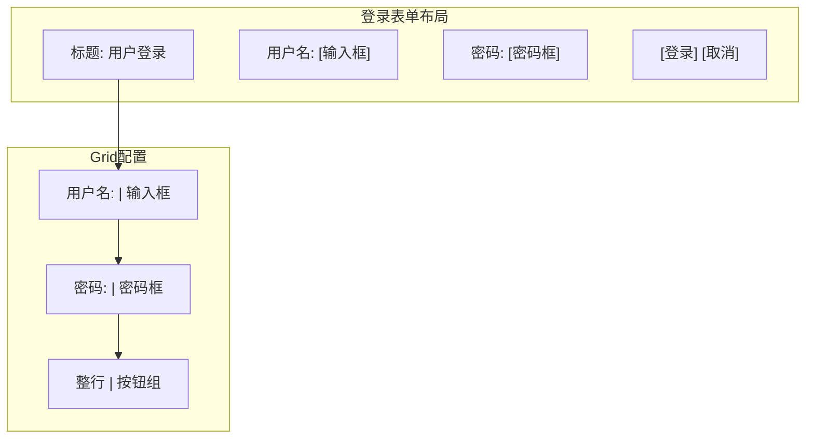

**图表来源**
- [builder_helpers_demo.php](file://example/builder_helpers_demo.php#L88-L123)

### 响应式网格布局

ResponsiveGridBuilder提供了灵活的响应式布局能力：

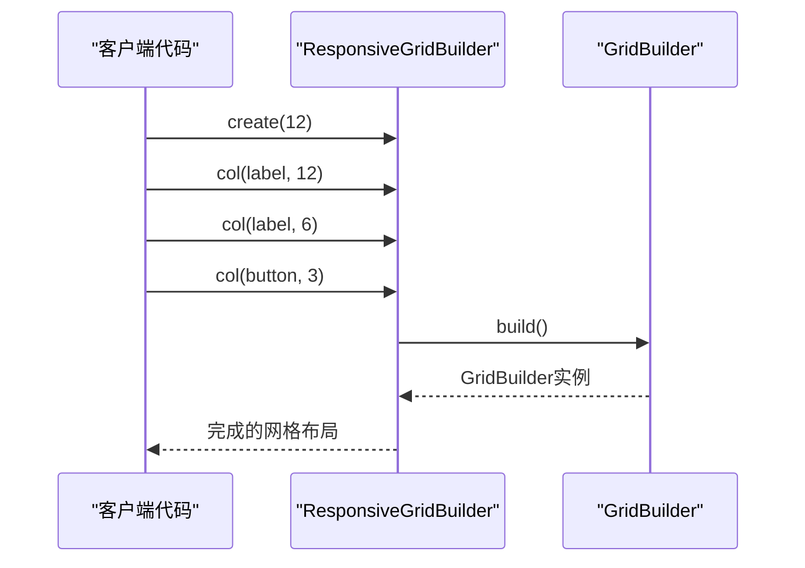

**图表来源**
- [ResponsiveGridBuilder.php](file://src/ResponsiveGridBuilder.php#L45-L70)

### 仪表盘布局

复杂的仪表盘布局展示了Grid布局的强大功能：

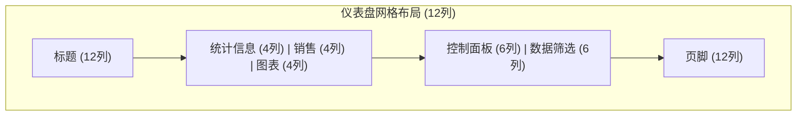

**章节来源**
- [responseGrid.php](file://example/responseGrid.php#L10-L18)

## 嵌套布局实现

### 复合布局模式

libuiBuilder支持多层次的嵌套布局，可以创建复杂的界面结构：

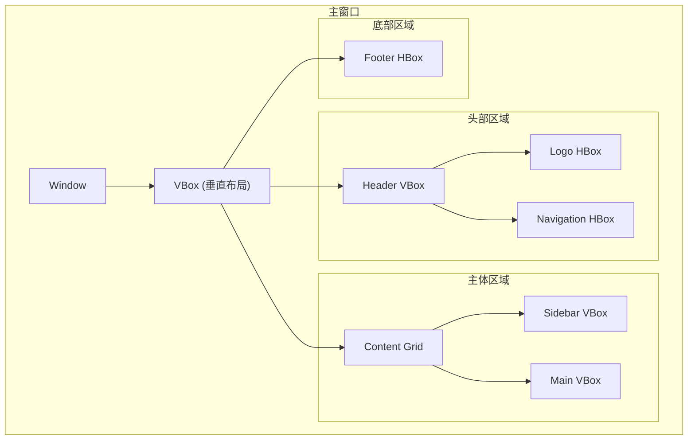

### 布局组合策略

#### 1. 分层布局
- **外层**: 使用VBox或HBox进行整体分区
- **内层**: 使用Grid进行细节布局
- **最内层**: 使用Box进行简单排列

#### 2. 模块化布局
- **独立模块**: 每个功能区域使用独立的布局容器
- **统一风格**: 通过配置保持视觉一致性
- **灵活组合**: 可以根据需要重新组合模块

**章节来源**
- [builder_helpers_demo.php](file://example/builder_helpers_demo.php#L71-L81)

## 总结

libuiBuilder的布局系统提供了强大而灵活的界面构建能力：

### 核心优势

1. **Grid布局**: 二维精确定位，适合复杂界面
2. **Box布局**: 简单高效，适合线性排列
3. **响应式设计**: 支持灵活的网格系统
4. **辅助函数**: 提供便捷的开发工具

### 使用建议

- **优先选择Grid布局**: 特别是在处理表单和复杂界面时
- **合理使用Box布局**: 适合简单的线性排列需求
- **善用辅助函数**: 提高开发效率和代码可读性
- **注重布局层次**: 合理组织嵌套结构

### 发展方向

随着项目的发展，libuiBuilder将继续优化布局系统的性能和易用性，为开发者提供更好的界面构建体验。理解Grid和Box布局的特点和适用场景，是掌握libuiBuilder布局系统的关键。