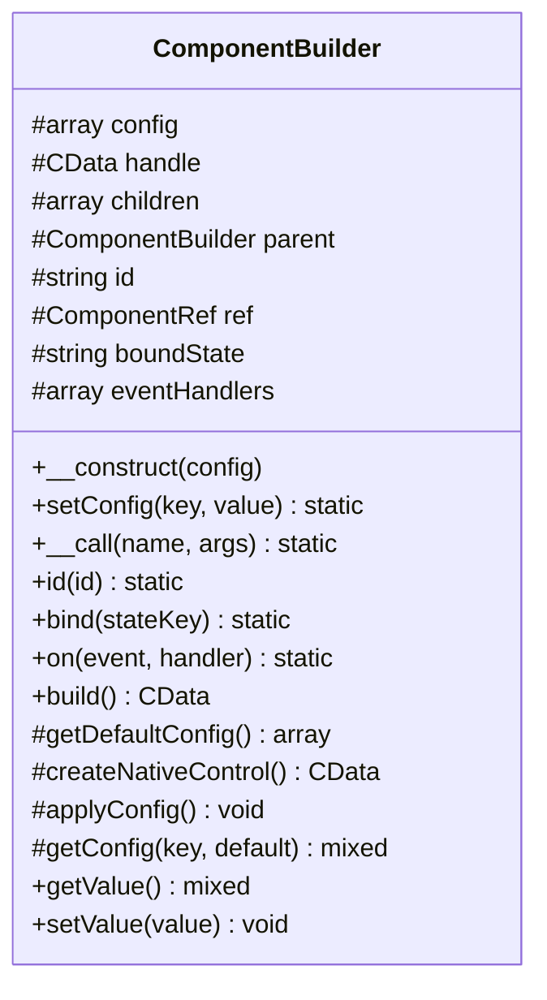
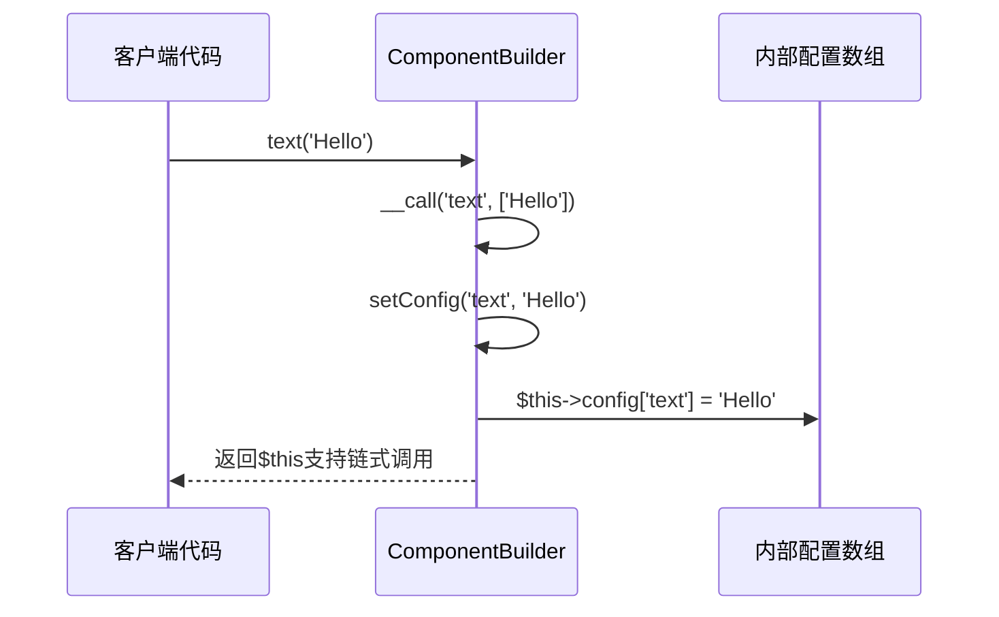
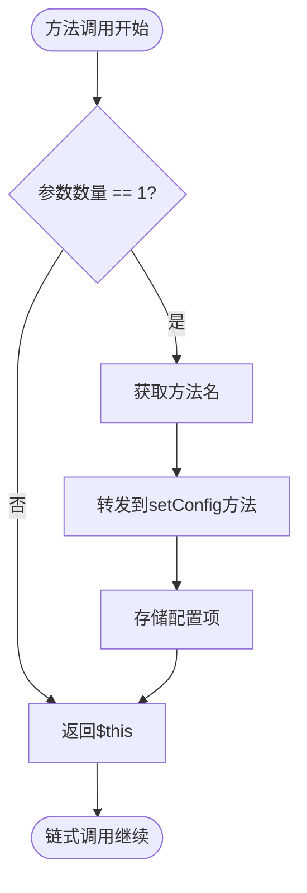
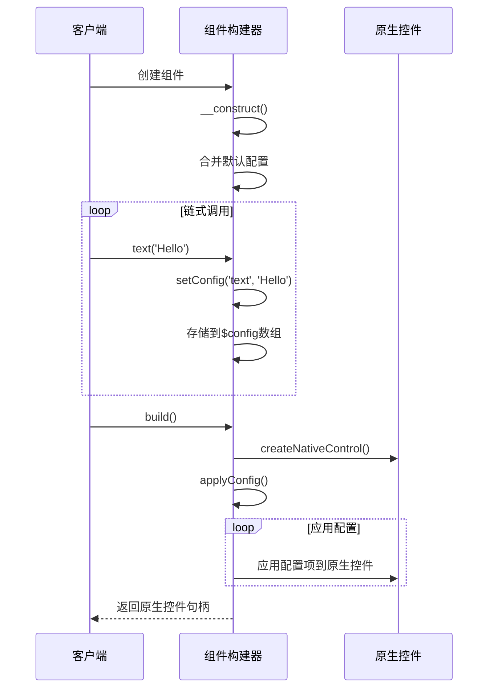
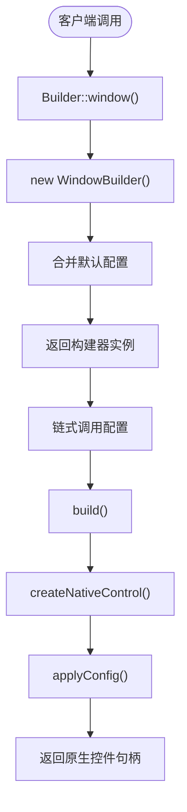
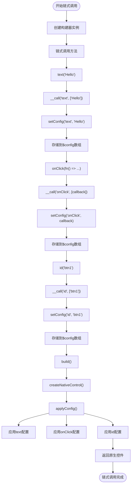
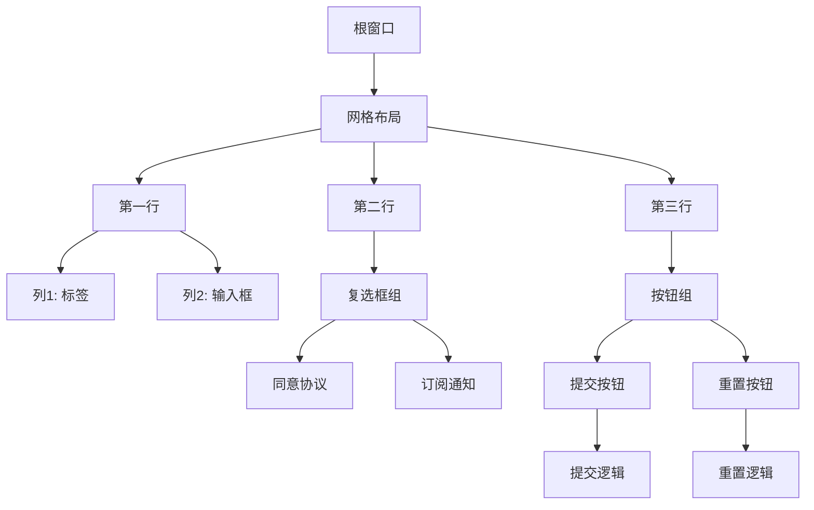
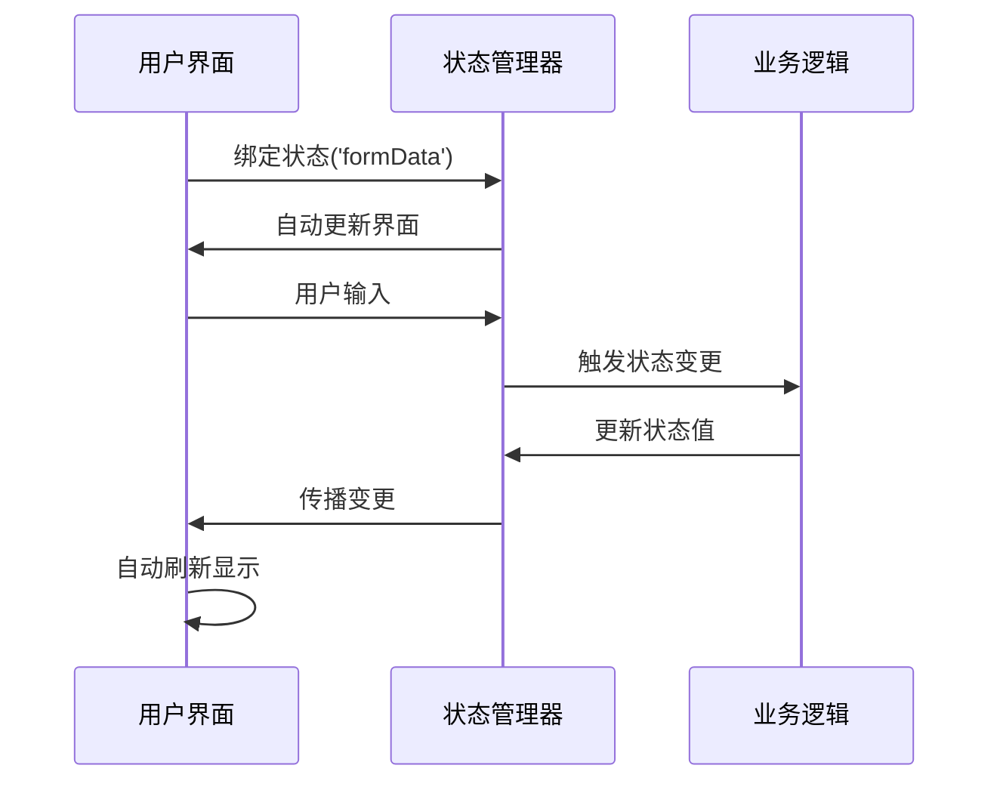
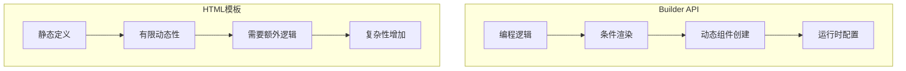

# Builder API

<cite>
**本文档中引用的文件**
- [ComponentBuilder.php](file://src/ComponentBuilder.php)
- [Builder.php](file://src/Builder.php)
- [ButtonBuilder.php](file://src/Components/ButtonBuilder.php)
- [LabelBuilder.php](file://src/Components/LabelBuilder.php)
- [GridBuilder.php](file://src/Components/GridBuilder.php)
- [GridItemBuilder.php](file://src/Components/GridItemBuilder.php)
- [WindowBuilder.php](file://src/Components/WindowBuilder.php)
- [BoxBuilder.php](file://src/Components/BoxBuilder.php)
- [TabBuilder.php](file://src/Builder/TabBuilder.php)
- [helper.php](file://src/helper.php)
- [simple.php](file://example/simple.php)
- [full.php](file://example/full.php)
- [builder_helpers_demo.php](file://example/builder_helpers_demo.php)
</cite>

## 目录
1. [引言](#引言)
2. [Builder API编程范式](#builder-api编程范式)
3. [ComponentBuilder基类设计](#componentbuilder基类设计)
4. [静态工厂方法实现](#静态工厂方法实现)
5. [链式调用机制](#链式调用机制)
6. [复杂UI组件构建示例](#复杂ui组件构建示例)
7. [Builder API与HTML模板对比](#builder-api与html模板对比)
8. [总结](#总结)

## 引言

libuiBuilder是一个基于PHP的GUI应用程序构建框架，提供了两种主要的开发方式：Builder API和HTML模板。本文档将详细说明Builder API的开发模式，重点介绍其基于链式调用的编程范式、静态工厂方法的实现机制以及ComponentBuilder基类的设计原理。

Builder API通过流畅的链式调用提供了直观的编程体验，允许开发者以编程方式动态构建用户界面。这种模式特别适合需要条件渲染、动态界面构建和复杂编程逻辑集成的场景。

**章节来源**
- [README.md](file://README.md#L2-L406)

## Builder API编程范式

Builder API采用了一种基于链式调用的编程范式，通过返回`$this`来实现方法的连续调用。这种设计模式使得UI构建代码更加流畅和可读。

### 链式调用基础

Builder API的核心是链式调用模式，每个方法调用后返回当前对象实例，允许连续调用多个方法：

```php
$button = Builder::button()
    ->text('提交')
    ->id('submitBtn')
    ->onClick(function() {
        echo "按钮被点击\n";
    });
```

这种模式的优势在于：
- **代码简洁性**：减少了重复的对象引用
- **可读性**：方法调用顺序清晰地表达了配置流程
- **流畅性**：提供了类似自然语言的API体验

### 编程范式特点

Builder API的编程范式具有以下特点：

1. **流式接口**：通过返回`$this`实现方法链
2. **延迟构建**：组件在调用`build()`方法时才真正创建
3. **配置驱动**：所有属性通过配置项进行设置
4. **组合优先**：通过`contains()`方法组合组件

**章节来源**
- [ComponentBuilder.php](file://src/ComponentBuilder.php#L114-L119)
- [builder_helpers_demo.php](file://example/builder_helpers_demo.php#L1-L140)

## ComponentBuilder基类设计

ComponentBuilder是所有组件构建器的抽象基类，定义了Builder API的核心机制和公共接口。

### 核心属性

ComponentBuilder类维护了组件构建所需的各种状态：



**图表来源**
- [ComponentBuilder.php](file://src/ComponentBuilder.php#L13-L22)

### 核心方法实现

#### setConfig方法

`setConfig`方法是配置管理的核心，负责将配置项存储到内部的`$config`数组中：



**图表来源**
- [ComponentBuilder.php](file://src/ComponentBuilder.php#L105-L109)

#### __call魔术方法

`__call`魔术方法是链式调用的核心实现，它将任意setter方法调用转发到`setConfig`方法：



**图表来源**
- [ComponentBuilder.php](file://src/ComponentBuilder.php#L114-L119)

#### build方法

`build`方法负责组件的最终构建和配置应用：



**图表来源**
- [ComponentBuilder.php](file://src/ComponentBuilder.php#L209-L231)

## 静态工厂方法实现

Builder类提供了静态工厂方法，作为创建各种组件的入口点。

### 工厂方法设计

Builder类通过静态方法提供组件创建的统一入口：

```php
class Builder
{
    public static function window(array $config = []): WindowBuilder
    {
        return new WindowBuilder($config);
    }
    
    public static function button(array $config = []): ButtonBuilder
    {
        return new ButtonBuilder($config);
    }
    
    public static function grid(array $config = []): GridBuilder
    {
        return new GridBuilder($config);
    }
    
    // 其他组件...
}
```

### 组件创建流程

从静态工厂方法到组件实例的创建流程：



**章节来源**
- [Builder.php](file://src/Builder.php#L27-L153)
- [ComponentBuilder.php](file://src/ComponentBuilder.php#L25-L28)

## 链式调用机制

Builder API的链式调用机制通过`__call`魔术方法和`setConfig`方法的协同工作实现。

### 完整工作流程

从客户端调用到最终配置应用的完整流程：



**图表来源**
- [ComponentBuilder.php](file://src/ComponentBuilder.php#L114-L119)
- [ComponentBuilder.php](file://src/ComponentBuilder.php#L105-L109)

### 特殊方法处理

某些组件提供了专门的方法来增强特定功能，这些方法直接调用`setConfig`而不依赖`__call`：

```php
class ButtonBuilder extends ComponentBuilder
{
    public function text(string $text): static
    {
        return $this->setConfig('text', $text);
    }
    
    public function onClick(callable $callback): static
    {
        return $this->setConfig('onClick', $callback);
    }
}
```

**章节来源**
- [ButtonBuilder.php](file://src/Components/ButtonBuilder.php#L39-L47)

## 复杂UI组件构建示例

### 包含Grid布局的窗口

使用Builder API创建包含Grid布局的复杂窗口：



**图表来源**
- [simple.php](file://example/simple.php#L11-L142)
- [full.php](file://example/full.php#L50-L180)

### 状态绑定和事件处理

链式调用与状态管理系统结合的完整示例：



**图表来源**
- [ComponentBuilder.php](file://src/ComponentBuilder.php#L136-L146)
- [ComponentBuilder.php](file://src/ComponentBuilder.php#L171-L174)

### 实际应用示例

完整的登录表单构建示例：

```php
$loginWindow = Builder::create()
    ->newWindow(['title' => '登录'])
    ->config('size', [350, 200])
    ->config('centered', true)
    ->children([
        Builder::vbox(['padded' => true])->contains([
            Builder::label()->text('用户登录'),
            Builder::grid()->form([
                [
                    'label' => Builder::label()->text('账号:'),
                    'control' => Builder::entry()
                        ->id('loginUsername')
                        ->placeholder('请输入账号'),
                ],
                [
                    'label' => Builder::label()->text('密码:'),
                    'control' => Builder::passwordEntry()
                        ->id('loginPassword')
                        ->placeholder('请输入密码'),
                ],
            ]),
            Builder::hbox()->contains([
                Builder::button()
                    ->text('登录')
                    ->id('loginBtn')
                    ->onClick(function() {
                        echo "执行登录逻辑...\n";
                    }),
                Builder::button()
                    ->text('取消')
                    ->onClick(function() {
                        echo "取消登录\n";
                    }),
            ]),
        ])
    ])
    ->get();
```

**章节来源**
- [builder_helpers_demo.php](file://example/builder_helpers_demo.php#L88-L124)

## Builder API与HTML模板对比

### 优势对比

#### 动态界面构建

Builder API在动态界面构建方面具有明显优势：



**图表来源**
- [README.md](file://README.md#L402-L405)

#### 条件渲染

Builder API天然支持条件渲染：

```php
$components = [];
if ($user->isAdmin()) {
    $components[] = Builder::button()->text('管理面板');
}
if ($user->hasPermission('edit')) {
    $components[] = Builder::button()->text('编辑');
}
$layout->contains($components);
```

而HTML模板需要通过条件指令或预处理实现：

```html
<if condition="user.isAdmin()">
  <button onclick="showAdminPanel">管理面板</button>
</if>
```

#### 编程逻辑集成

Builder API与编程逻辑无缝集成：

```php
$grid = Builder::grid();
foreach ($data as $item) {
    $grid->row([
        Builder::label()->text($item['name']),
        Builder::button()
            ->text('操作')
            ->onClick(function() use ($item) {
                processItem($item);
            })
    ]);
}
```

### 局限性

#### 界面结构可读性

HTML模板在界面结构可读性方面优于Builder API：

```html
<!-- HTML模板 - 结构清晰 -->
<window title="用户管理">
  <grid padded="true">
    <label row="0" col="0">姓名:</label>
    <input row="0" col="1" bind="name"/>
    <button row="1" col="0" colspan="2">提交</button>
  </grid>
</window>
```

```php
// Builder API - 结构嵌套较深
$window = Builder::window()
    ->title('用户管理')
    ->contains([
        Builder::grid()->padded(true)->form([
            [
                'label' => Builder::label()->text('姓名:'),
                'control' => Builder::entry()->bind('name')
            ]
        ])->append([
            Builder::button()->text('提交')
        ])
    ]);
```

#### 团队协作

HTML模板更适合团队协作，特别是设计师和开发者之间的协作：

- **HTML模板**：设计师可以使用熟悉的工具编辑界面
- **Builder API**：需要开发者直接编写PHP代码

**章节来源**
- [README.md](file://README.md#L300-L321)

## 总结

libuiBuilder的Builder API通过`__call`魔术方法巧妙地将任意setter方法调用转发到统一的`setConfig`方法，实现了灵活而一致的API设计。这种设计模式具有以下核心优势：

### 技术优势

1. **统一的配置管理**：所有配置项通过单一接口进行管理，保持了API的一致性
2. **高度的灵活性**：支持任意配置项的动态设置，无需为每个配置项创建专门方法
3. **流畅的开发体验**：提供了类似JavaScript的流畅API，提升了开发效率
4. **良好的可读性**：链式调用使得UI构建代码更加直观和易于理解

### 应用场景

Builder API特别适用于以下场景：
- **动态界面构建**：需要根据运行时条件创建不同界面
- **条件渲染**：界面元素的显示需要复杂的条件判断
- **编程逻辑集成**：界面构建与业务逻辑紧密耦合
- **快速原型开发**：需要快速迭代和修改界面

### 设计哲学

Builder API体现了现代软件设计中的几个重要原则：
- **单一职责原则**：ComponentBuilder专注于构建器的核心功能
- **开闭原则**：通过继承和多态支持新组件类型的扩展
- **接口隔离原则**：通过专门方法和通用方法的结合满足不同需求
- **依赖倒置原则**：高层模块不依赖低层模块的具体实现

通过深入理解libuiBuilder的Builder API实现原理，开发者可以更好地利用这一设计模式来构建高质量的GUI应用程序，同时也能从中学习到优秀的面向对象设计思想和API设计原则。

**章节来源**
- [ComponentBuilder.php](file://src/ComponentBuilder.php#L11-L234)
- [README.md](file://README.md#L2-L406)
- [builder_helpers_demo.php](file://example/builder_helpers_demo.php#L1-L140)