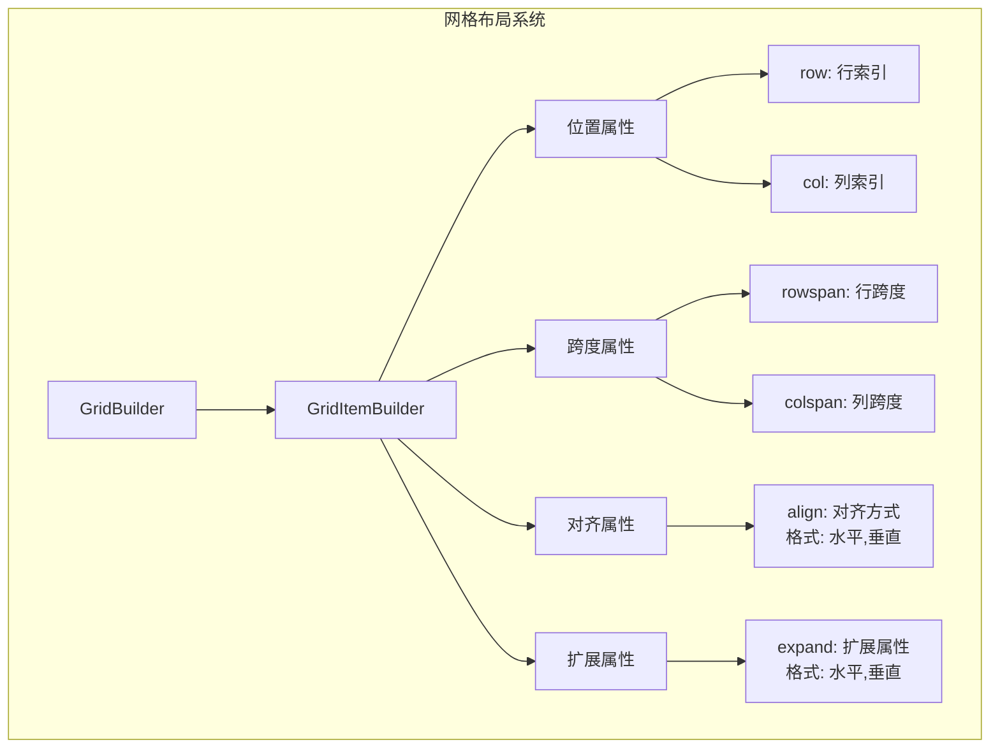
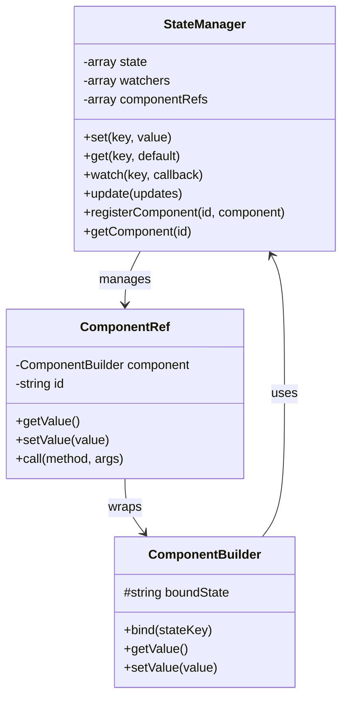
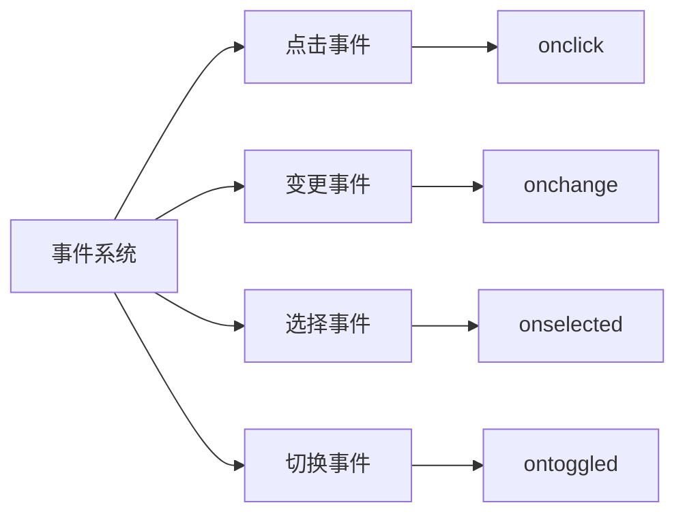
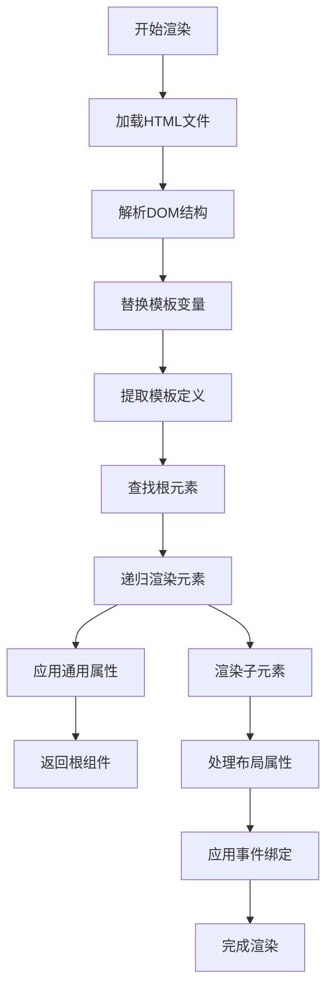
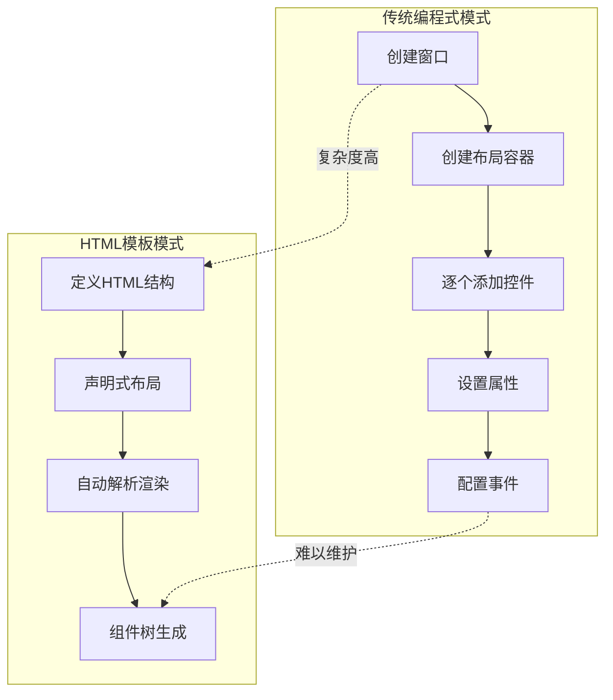

# HTML模板渲染开发模式

<cite>
**本文档中引用的文件**
- [HtmlRenderer.php](file://src/HtmlRenderer.php)
- [ComponentBuilder.php](file://src/ComponentBuilder.php)
- [WindowBuilder.php](file://src/Components/WindowBuilder.php)
- [GridBuilder.php](file://src/Components/GridBuilder.php)
- [StateManager.php](file://src/State/StateManager.php)
- [ComponentRef.php](file://src/State/ComponentRef.php)
- [login.ui.html](file://example/views/login.ui.html)
- [htmlLogin.php](file://example/htmlLogin.php)
- [calculator.ui.html](file://example/views/calculator.ui.html)
- [calculator_html.php](file://example/calculator_html.php)
- [full.ui.html](file://example/views/full.ui.html)
- [htmlFull.php](file://example/htmlFull.php)
- [calculator_simple.ui.html](file://example/views/calculator_simple.ui.html)
</cite>

## 目录
1. [概述](#概述)
2. [HTML模板语法规范](#html模板语法规范)
3. [核心UI组件](#核心ui组件)
4. [布局属性系统](#布局属性系统)
5. [数据绑定机制](#数据绑定机制)
6. [事件绑定系统](#事件绑定系统)
7. [HtmlRenderer::render()方法详解](#htmlrendererrender方法详解)
8. [完整登录表单示例](#完整登录表单示例)
9. [架构优势分析](#架构优势分析)
10. [使用场景与最佳实践](#使用场景与最佳实践)

## 概述

libuiBuilder的HTML模板渲染开发模式是一种创新的GUI应用程序构建方法，它将传统的编程式界面构建转变为声明式的HTML模板驱动方式。这种模式借鉴了Web开发中的模板技术，为桌面GUI应用带来了前所未有的开发效率和可维护性。

### 核心特性

- **声明式界面定义**：使用HTML语法直观地描述界面结构
- **数据绑定支持**：双向数据绑定实现界面与业务逻辑的无缝连接
- **事件驱动架构**：基于回调函数的事件处理机制
- **模板复用能力**：支持组件模板的定义和复用
- **跨平台兼容**：统一的HTML语法在不同平台上保持一致的行为

## HTML模板语法规范

### 基本结构

HTML模板必须遵循特定的结构规范，以确保HtmlRenderer能够正确解析和渲染：

```html
<!DOCTYPE html>
<ui version="1.0">
  <!-- 界面定义 -->
</ui>
```

### 模板变量语法

支持双大括号语法进行模板变量替换：

```html
<window title="{{windowTitle}}" size="400,300">
  <label>Welcome, {{username}}!</label>
</window>
```

### 事件处理器绑定

通过HTML属性绑定事件处理器：

```html
<button onclick="handleClick">点击我</button>
<input onchange="handleChange"/>
<radio onselected="handleSelect">
```

**节来源**
- [HtmlRenderer.php](file://src/HtmlRenderer.php#L110-L118)
- [HtmlRenderer.php](file://src/HtmlRenderer.php#L220-L236)

## 核心UI组件

### 窗口组件 (<window>)

窗口是所有GUI应用的根容器，支持丰富的配置选项：

```html
<window title="应用标题" size="800,600" centered="true" margined="true">
  <!-- 内容区域 -->
</window>
```

**支持的属性：**
- `title`：窗口标题
- `size`：窗口尺寸（宽度,高度）
- `centered`：是否居中显示
- `margined`：是否添加边距
- `resizable`：是否可调整大小

### 布局容器组件

#### 网格布局 (<grid>)

网格布局是最强大的布局组件，支持复杂的二维布局：

```html
<grid padded="true">
  <label row="0" col="0" align="end,center">用户名:</label>
  <input row="0" col="1" bind="username" expand="horizontal"/>
  <button row="1" col="0" colspan="2" onclick="handleLogin">登录</button>
</grid>
```

**网格属性：**
- `padded`：是否添加内边距
- `rowspan`：跨越的行数
- `colspan`：跨越的列数
- `align`：对齐方式（水平,垂直）

#### 水平盒子 (<hbox>) 和垂直盒子 (<vbox>)

用于线性布局的简单容器：

```html
<hbox padded="true">
  <button onclick="handleSave">保存</button>
  <button onclick="handleCancel">取消</button>
</hbox>
```

### 输入控件

#### 文本输入 (<input>)

支持多种输入类型：

```html
<!-- 单行文本 -->
<input id="username" placeholder="请输入用户名" bind="username"/>

<!-- 密码输入 -->
<input type="password" placeholder="请输入密码" bind="password"/>

<!-- 多行文本 -->
<input type="multiline" placeholder="请输入多行文本..." wordwrap="true"/>
```

#### 选择控件

```html
<!-- 复选框 -->
<checkbox id="rememberMe" checked="true">记住我</checkbox>

<!-- 单选框组 -->
<radio id="gender" selected="0" onselected="handleGenderChange">
  <option>男</option>
  <option>女</option>
</radio>

<!-- 下拉选择框 -->
<combobox id="country" selected="0" expand="horizontal">
  <option>中国</option>
  <option>美国</option>
  <option>日本</option>
</combobox>
```

### 数值控件

#### 数字输入框 (<spinbox>)

```html
<spinbox id="age" min="0" max="150" value="25" expand="horizontal"/>
```

#### 滑动条 (<slider>)

```html
<slider id="volume" min="0" max="100" value="50" onchange="handleVolumeChange"/>
```

### 其他控件

#### 标签页 (<tab>)

```html
<tab>
  <tabpage title="基本信息">
    <!-- 内容 -->
  </tabpage>
  <tabpage title="高级设置">
    <!-- 内容 -->
  </tabpage>
</tab>
```

#### 进度条 (<progressbar>)

```html
<progressbar value="75"/>
```

**节来源**
- [HtmlRenderer.php](file://src/HtmlRenderer.php#L171-L189)
- [HtmlRenderer.php](file://src/HtmlRenderer.php#L240-L273)
- [HtmlRenderer.php](file://src/HtmlRenderer.php#L277-L337)

## 布局属性系统

### 网格布局属性

网格布局提供了最灵活的布局控制：



**图表来源**
- [GridBuilder.php](file://src/Components/GridBuilder.php#L59-L66)
- [HtmlRenderer.php](file://src/HtmlRenderer.php#L299-L335)

### 对齐方式

支持多种对齐组合：

```html
<!-- 居中对齐 -->
<label align="center,center">居中内容</label>

<!-- 左上角对齐 -->
<label align="start,top">左上角</label>

<!-- 右下角对齐 -->
<label align="end,bottom">右下角</label>

<!-- 填充对齐（默认） -->
<label align="fill,fill">填充内容</label>
```

### 扩展属性

控制组件在可用空间中的扩展行为：

```html
<!-- 水平扩展 -->
<input expand="horizontal"/>

<!-- 垂直扩展 -->
<input expand="vertical"/>

<!-- 双向扩展 -->
<input expand="true"/>

<!-- 指定扩展方向 -->
<input expand="horizontal,vertical"/>
```

**节来源**
- [HtmlRenderer.php](file://src/HtmlRenderer.php#L301-L335)

## 数据绑定机制

### 绑定语法

数据绑定通过`bind`属性实现双向数据同步：

```html
<input id="username" bind="username" placeholder="请输入用户名"/>
<label>当前用户名: {{username}}</label>
```

### 状态管理系统

libuiBuilder采用集中式状态管理模式：



**图表来源**
- [StateManager.php](file://src/State/StateManager.php#L8-L91)
- [ComponentRef.php](file://src/State/ComponentRef.php#L11-L74)
- [ComponentBuilder.php](file://src/ComponentBuilder.php#L135-L146)

### 绑定工作流程

1. **初始化绑定**：组件注册到状态管理器
2. **状态更新**：状态变化自动更新绑定组件
3. **用户交互**：组件变化自动更新状态
4. **双向同步**：确保界面和数据的一致性

### 模板变量替换

HTML模板支持编译时的变量替换：

```php
$variables = [
    'windowTitle' => '我的应用',
    'username' => '张三'
];

$app = HtmlRenderer::render('template.html', [], $variables);
```

**节来源**
- [StateManager.php](file://src/State/StateManager.php#L26-L36)
- [ComponentBuilder.php](file://src/ComponentBuilder.php#L140-L143)
- [HtmlRenderer.php](file://src/HtmlRenderer.php#L110-L118)

## 事件绑定系统

### 事件类型

libuiBuilder支持多种事件类型：



**图表来源**
- [HtmlRenderer.php](file://src/HtmlRenderer.php#L223-L236)

### 事件处理器定义

在PHP中定义事件处理器：

```php
$handlers = [
    'handleLogin' => function($button, $stateManager) {
        $username = $stateManager->get('username');
        $password = $stateManager->get('password');
        
        if ($username === 'admin' && $password === 'admin') {
            echo "登录成功！\n";
        } else {
            echo "用户名或密码错误\n";
        }
    },
    
    'handleInputChange' => function($value, $component) {
        echo "输入值变化: {$value}\n";
        
        // 访问其他组件
        $loginBtn = StateManager::instance()->getComponent('loginBtn');
        $canLogin = !empty($value) && !empty($passwordInput?->getValue());
        echo "可以登录: " . ($canLogin ? '是' : '否') . "\n";
    }
];
```

### 事件参数传递

不同类型的事件接收不同的参数：

| 事件类型 | 参数列表 | 说明 |
|---------|---------|------|
| onclick | `$component, $stateManager` | 按钮点击事件 |
| onchange | `$value, $component` | 输入值变化事件 |
| onselected | `$index` | 选择项变化事件 |
| ontoggled | `$checked` | 复选框状态变化事件 |

### 事件处理最佳实践

1. **单一职责**：每个事件处理器专注于特定功能
2. **状态管理**：利用状态管理器统一处理数据
3. **组件引用**：通过组件ID访问其他组件
4. **错误处理**：在事件处理器中添加适当的错误处理

**节来源**
- [htmlLogin.php](file://example/htmlLogin.php#L17-L95)
- [HtmlRenderer.php](file://src/HtmlRenderer.php#L220-L236)

## HtmlRenderer::render()方法详解

### 方法签名

```php
public static function render(
    string $htmlFile, 
    array $handlers = [], 
    array $variables = []
): ComponentBuilder
```

### 渲染流程



**图表来源**
- [HtmlRenderer.php](file://src/HtmlRenderer.php#L56-L75)

### 核心处理步骤

#### 1. HTML文件加载与解析

```php
private function loadHtml(string $htmlFile): void
{
    if (!file_exists($htmlFile)) {
        throw new Exception("HTML template file not found: {$htmlFile}");
    }
    
    $this->dom = new DOMDocument();
    $this->dom->preserveWhiteSpace = false;
    
    // 读取并替换模板变量
    $content = file_get_contents($htmlFile);
    $content = $this->replaceTemplateVariables($content);
    
    // 添加UTF-8编码声明
    $content = '<?xml encoding="UTF-8">' . $content;
    
    // 加载HTML（忽略HTML5标签警告）
    libxml_use_internal_errors(true);
    $this->dom->loadHTML($content, LIBXML_HTML_NOIMPLIED | LIBXML_HTML_NODEFDTD);
    libxml_clear_errors();
}
```

#### 2. 元素渲染映射

HtmlRenderer使用匹配表达式将HTML标签映射到对应的组件构建器：

```php
$builder = match($tagName) {
    'window' => $this->renderWindow($element),
    'grid' => $this->renderGrid($element),
    'hbox' => $this->renderHBox($element),
    'vbox' => $this->renderVBox($element),
    'tab' => $this->renderTab($element),
    'label' => $this->renderLabel($element),
    'input' => $this->renderInput($element),
    'button' => $this->renderButton($element),
    // ... 更多组件类型
};
```

#### 3. 通用属性应用

```php
private function applyCommonAttributes(DOMElement $element, ComponentBuilder $builder): void
{
    // ID属性
    if ($id = $element->getAttribute('id')) {
        $builder->id($id);
    }
    
    // 数据绑定
    if ($bind = $element->getAttribute('bind')) {
        $builder->bind($bind);
    }
    
    // 事件绑定
    $this->applyEventHandlers($element, $builder);
}
```

### 错误处理机制

HtmlRenderer实现了完善的错误处理：

```php
try {
    $app = HtmlRenderer::render($templateFile, $handlers);
    $app->show();
} catch (Exception $e) {
    echo "渲染错误: " . $e->getMessage() . "\n";
    echo "错误位置: " . $e->getFile() . ":" . $e->getLine() . "\n";
}
```

**节来源**
- [HtmlRenderer.php](file://src/HtmlRenderer.php#L56-L75)
- [HtmlRenderer.php](file://src/HtmlRenderer.php#L161-L195)
- [HtmlRenderer.php](file://src/HtmlRenderer.php#L80-L107)

## 完整登录表单示例

以下是一个完整的登录表单示例，展示了HTML模板渲染模式的实际应用：

### HTML模板 (login.ui.html)

```html
<!DOCTYPE html>
<ui version="1.0">
  <window title="用户登录" size="400,300" centered="true" margined="true">
    <vbox padded="true">
      <!-- 标题 -->
      <label style="font-size: 18px; font-weight: bold;">欢迎登录</label>
      
      <!-- 表单区域 -->
      <grid padded="true">
        <!-- 用户名字段 -->
        <label row="0" col="0" align="end,center">用户名:</label>
        <input 
          id="usernameInput"
          row="0" 
          col="1" 
          placeholder="请输入用户名"
          bind="username"
          onchange="handleUsernameChange"
          expand="horizontal"
        />
        
        <!-- 密码字段 -->
        <label row="1" col="0" align="end,center">密码:</label>
        <input 
          id="passwordInput"
          row="1" 
          col="1" 
          type="password"
          placeholder="请输入密码"
          bind="password"
          onchange="handlePasswordChange"
          expand="horizontal"
        />
        
        <!-- 记住我复选框 -->
        <checkbox 
          id="rememberMe"
          row="2" 
          col="0" 
          colspan="2"
          checked="true"
          bind="rememberMe"
        >
          记住我
        </checkbox>
        
        <!-- 状态标签 -->
        <label 
          id="statusLabel"
          row="3" 
          col="0" 
          colspan="2"
          style="color: #666;"
        >
          请输入登录信息
        </label>
      </grid>
      
      <!-- 按钮区域 -->
      <hbox>
        <button 
          id="loginBtn"
          onclick="handleLogin"
          expand="horizontal"
        >
          登录
        </button>
        <button 
          id="resetBtn"
          onclick="handleReset"
          expand="horizontal"
        >
          重置
        </button>
      </hbox>
    </vbox>
  </window>
</ui>
```

### PHP处理逻辑 (htmlLogin.php)

```php
<?php
require_once __DIR__ . '/../vendor/autoload.php';

use Kingbes\Libui\App;
use Kingbes\Libui\View\HtmlRenderer;
use Kingbes\Libui\View\State\StateManager;

App::init();

// 初始化状态
$state = StateManager::instance();
$state->set('username', '');
$state->set('password', '');
$state->set('rememberMe', true);

// 定义事件处理器
$handlers = [
    'handleUsernameChange' => function($value, $component) {
        echo "用户名输入: {$value}\n";
        
        // 访问其他组件
        $loginBtn = StateManager::instance()->getComponent('loginBtn');
        $passwordInput = StateManager::instance()->getComponent('passwordInput');
        
        // 根据输入启用/禁用登录按钮
        $canLogin = !empty($value) && !empty($passwordInput?->getValue());
        echo "可以登录: " . ($canLogin ? '是' : '否') . "\n";
    },
    
    'handlePasswordChange' => function($value, $component) {
        // 计算密码强度
        $strength = '弱';
        if (strlen($value) > 8) {
            $strength = '中';
        }
        if (strlen($value) > 12 && preg_match('/[A-Z]/', $value) && preg_match('/[0-9]/', $value)) {
            $strength = '强';
        }
        
        $statusLabel = StateManager::instance()->getComponent('statusLabel');
        if ($statusLabel) {
            $statusLabel->setValue("密码强度: {$strength}");
        }
    },
    
    'handleLogin' => function($button, $stateManager) {
        $username = $stateManager->get('username');
        $password = $stateManager->get('password');
        
        if (empty($username) || empty($password)) {
            echo "用户名和密码不能为空\n";
            return;
        }
        
        // 模拟登录验证
        if ($username === 'admin' && $password === 'admin') {
            echo "登录成功！\n";
            
            $statusLabel = StateManager::instance()->getComponent('statusLabel');
            if ($statusLabel) {
                $statusLabel->setValue("登录成功！");
            }
        } else {
            echo "用户名或密码错误\n";
            
            $statusLabel = StateManager::instance()->getComponent('statusLabel');
            if ($statusLabel) {
                $statusLabel->setValue("登录失败：用户名或密码错误");
            }
        }
    },
    
    'handleReset' => function($button, $stateManager) {
        // 清空所有输入
        $stateManager->update([
            'username' => '',
            'password' => '',
            'rememberMe' => false
        ]);
        
        // 直接操作组件
        StateManager::instance()->getComponent('usernameInput')?->setValue('');
        StateManager::instance()->getComponent('passwordInput')?->setValue('');
        StateManager::instance()->getComponent('rememberMe')?->setValue(false);
        
        $statusLabel = StateManager::instance()->getComponent('statusLabel');
        if ($statusLabel) {
            $statusLabel->setValue("请输入登录信息");
        }
        
        echo "表单已清空\n";
    }
];

// 从HTML渲染
$app = HtmlRenderer::render(__DIR__ . '/views/login.ui.html', $handlers);
$app->show();
```

### 示例效果分析

1. **界面结构清晰**：HTML模板直观地描述了登录表单的布局
2. **数据绑定高效**：用户名和密码字段自动与状态管理器同步
3. **事件处理灵活**：每个用户交互都有对应的处理逻辑
4. **状态管理统一**：所有表单状态集中管理，便于维护
5. **组件间通信**：通过状态管理器实现组件间的协作

**节来源**
- [login.ui.html](file://example/views/login.ui.html)
- [htmlLogin.php](file://example/htmlLogin.php#L1-L96)

## 架构优势分析

### 界面结构清晰性

HTML模板渲染模式提供了前所未有的界面结构清晰性：



**优势对比：**

| 特性 | 传统模式 | HTML模板模式 |
|------|---------|-------------|
| 结构清晰度 | 低，嵌套层次深 | 高，树状结构直观 |
| 可读性 | 中等，代码冗长 | 高，类似HTML结构 |
| 维护成本 | 高，修改困难 | 低，模板易于编辑 |
| 团队协作 | 困难，前后端分离 | 简单，前端开发者友好 |

### 可维护性

HTML模板渲染模式显著提升了代码的可维护性：

1. **关注点分离**：界面定义与业务逻辑完全分离
2. **模板复用**：相同布局的组件可以复用模板
3. **版本控制友好**：HTML文件更适合版本控制工具
4. **可视化预览**：HTML模板可以在浏览器中预览

### 可视化预览能力

HTML模板支持可视化预览和调试：

```php
// 调试模式下的模板预览
$debugInfo = [
    'template' => $htmlContent,
    'parsed' => $parsedStructure,
    'components' => $componentTree,
    'bindings' => $dataBindings
];

echo json_encode($debugInfo, JSON_PRETTY_PRINT | JSON_UNESCAPED_UNICODE);
```

### 前端开发者友好性

对于熟悉Web开发的前端开发者来说，HTML模板渲染模式具有天然的亲和力：

1. **熟悉的语法**：HTML语法无需学习成本
2. **开发工具支持**：IDE智能提示、语法高亮
3. **调试便利**：浏览器开发者工具可用
4. **社区资源**：丰富的Web开发经验可迁移

**节来源**
- [HtmlRenderer.php](file://src/HtmlRenderer.php#L40-L75)

## 使用场景与最佳实践

### 适用场景

#### 1. 快速原型开发

HTML模板渲染模式特别适合快速原型开发：

```php
// 快速原型示例
$html = <<<HTML
<!DOCTYPE html>
<ui version="1.0">
  <window title="快速原型" size="300,200">
    <grid padded="true">
      <label row="0" col="0">姓名:</label>
      <input row="0" col="1" bind="name"/>
      <button row="1" col="0" colspan="2" onclick="handleSubmit">提交</button>
    </grid>
  </window>
</ui>
HTML;

$handlers = [
    'handleSubmit' => function() use ($stateManager) {
        $name = $stateManager->get('name');
        echo "收到输入: {$name}\n";
    }
];

$app = HtmlRenderer::renderString($html, $handlers);
```

#### 2. 复杂表单应用

对于包含多个输入字段和复杂验证的表单应用：

```html
<!-- 复杂表单模板 -->
<form-template>
  <grid padded="true">
    <label row="0" col="0" align="end,center">{{label}}</label>
    <input 
      id="{{id}}"
      row="0" 
      col="1" 
      type="{{type}}"
      placeholder="{{placeholder}}"
      bind="{{bind}}"
      expand="horizontal"
    />
  </grid>
</form-template>
```

#### 3. 数据展示应用

适用于需要大量数据展示的应用：

```html
<grid padded="true">
  <label row="0" col="0">搜索:</label>
  <input row="0" col="1" bind="searchQuery" onchange="handleSearch"/>
  
  <table row="1" col="0" colspan="2" bind="dataTable" expand="both"/>
  
  <progressbar row="2" col="0" colspan="2" value="{{progress}}" expand="horizontal"/>
</grid>
```

### 最佳实践建议

#### 1. 模板组织策略

```php
// 推荐的模板组织结构
/templates/
  ├── layouts/
  │     ├── main.html      // 主布局模板
  │     └── dialog.html    // 对话框模板
  ├── forms/
  │     ├── login.html     // 登录表单
  │     └── profile.html   // 个人资料表单
  └── components/
        ├── header.html    // 页头组件
        └── footer.html    // 页脚组件
```

#### 2. 状态管理原则

```php
// 状态命名规范
$stateKeys = [
    'user.username',           // 用户相关
    'form.login.password',     // 表单数据
    'settings.theme',         // 应用设置
    'data.table.selectedId',  // 数据选择
    'ui.dialog.visible'       // 界面状态
];
```

#### 3. 事件处理规范

```php
// 事件处理器命名规范
$handlers = [
    'handle{Component}{Action}',  // handleLoginSubmit
    'on{Component}{Event}',       // onUserInputChange
    'process{Action}',            // processFormData
    'validate{Field}'             // validateEmail
];
```

#### 4. 性能优化建议

```php
// 性能优化策略
class OptimizedHtmlRenderer {
    // 缓存解析结果
    private static $templateCache = [];
    
    public static function render($template, $handlers = []) {
        $cacheKey = md5($template);
        
        if (!isset(self::$templateCache[$cacheKey])) {
            self::$templateCache[$cacheKey] = parent::render($template, $handlers);
        }
        
        return self::$templateCache[$cacheKey];
    }
}
```

### 复杂动态逻辑处理

对于需要处理复杂动态逻辑的场景，HTML模板渲染模式可以与Builder API结合使用：

```php
// 混合使用模式
class HybridRenderer {
    public function renderComplexForm() {
        // 使用HTML模板定义静态结构
        $app = HtmlRenderer::render('complex_form.html', $this->getHandlers());
        
        // 使用Builder API处理动态逻辑
        $dynamicGrid = new GridBuilder();
        $dynamicGrid->form($this->generateDynamicFields());
        
        // 将动态组件添加到静态模板中
        $container = $app->getComponent('dynamicContainer');
        $container->addChild($dynamicGrid);
        
        return $app;
    }
}
```

### 错误处理与调试

```php
// 完善的错误处理
try {
    $app = HtmlRenderer::render($templateFile, $handlers);
    $app->show();
} catch (FileNotFoundException $e) {
    error_log("模板文件未找到: " . $e->getMessage());
    die("系统错误，请联系管理员");
} catch (ParseException $e) {
    error_log("模板解析错误: " . $e->getMessage());
    die("界面定义错误，请检查HTML语法");
} catch (Exception $e) {
    error_log("渲染错误: " . $e->getMessage());
    die("渲染过程中发生错误");
}
```

**节来源**
- [HtmlRenderer.php](file://src/HtmlRenderer.php#L80-L107)
- [htmlLogin.php](file://example/htmlLogin.php#L1-L96)

## 总结

libuiBuilder的HTML模板渲染开发模式代表了桌面GUI应用开发的新范式。它不仅继承了Web开发的诸多优势，还为桌面应用开发带来了前所未有的开发效率和用户体验。

### 核心价值

1. **开发效率提升**：声明式语法大幅减少样板代码
2. **团队协作改善**：前后端开发者可以并行工作
3. **维护成本降低**：清晰的模板结构便于长期维护
4. **学习曲线平缓**：熟悉Web开发的开发者可以快速上手

### 技术创新

- **DOM解析技术**：利用标准DOM解析器处理HTML模板
- **组件映射机制**：将HTML标签映射到原生GUI组件
- **状态绑定系统**：实现界面与数据的自动同步
- **事件驱动架构**：提供灵活的事件处理机制

### 应用前景

随着桌面应用开发需求的不断增长，HTML模板渲染模式将在以下领域发挥重要作用：

- **企业级应用开发**：复杂表单和数据展示需求
- **跨平台应用**：一套模板适配多个平台
- **快速原型开发**：敏捷开发过程中的快速迭代
- **教育和培训**：降低GUI开发的学习门槛

通过深入理解和掌握HTML模板渲染开发模式，开发者可以构建出更加高效、可维护和用户友好的桌面应用程序。