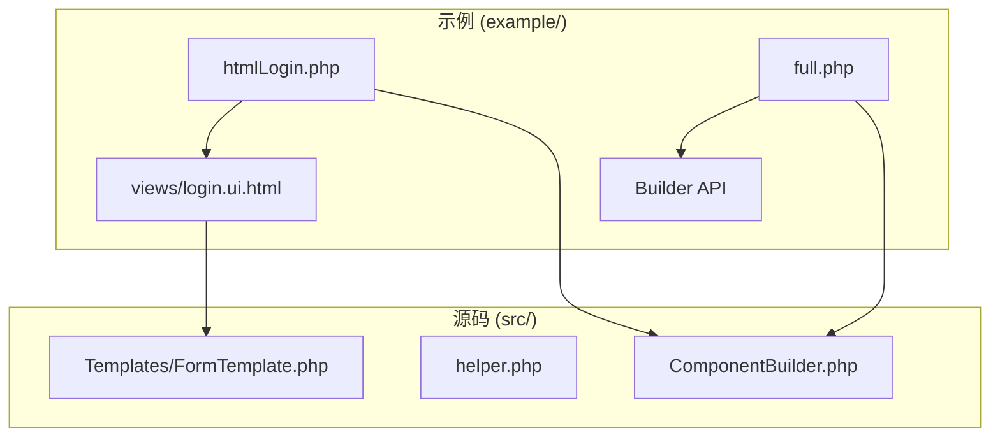
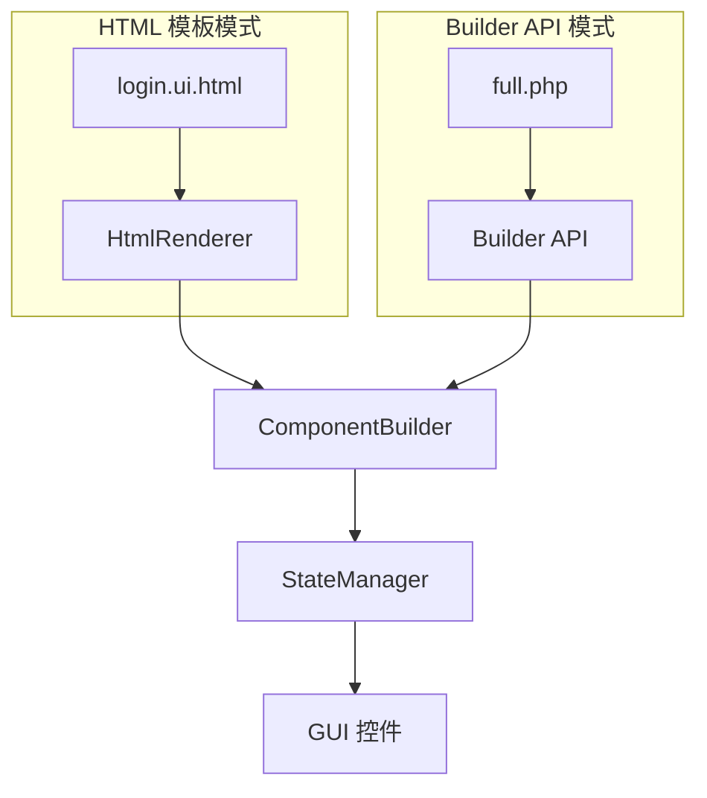
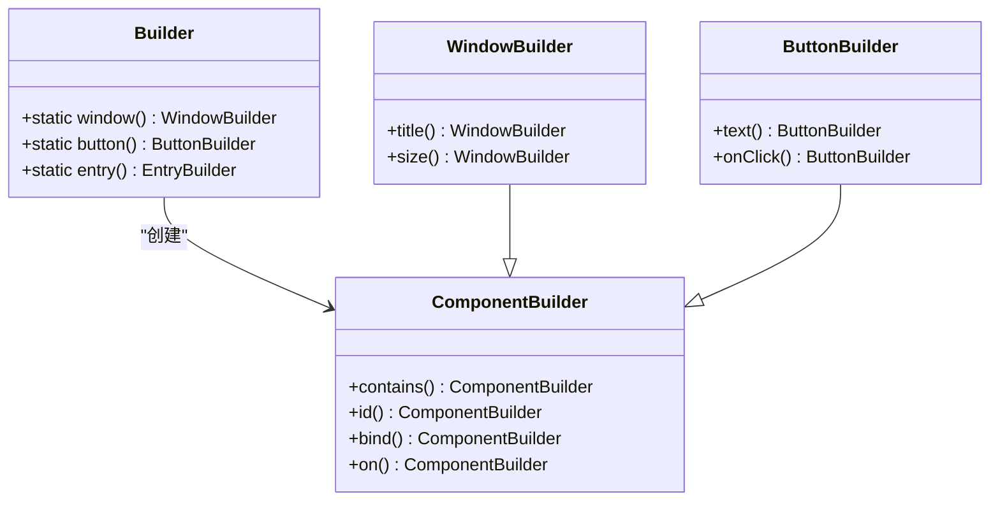
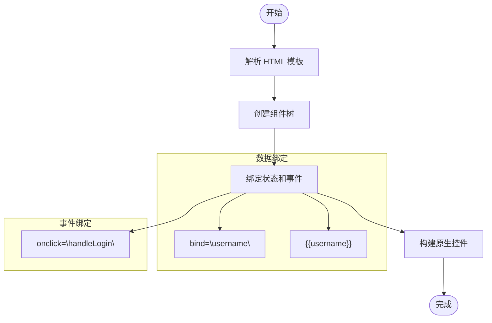
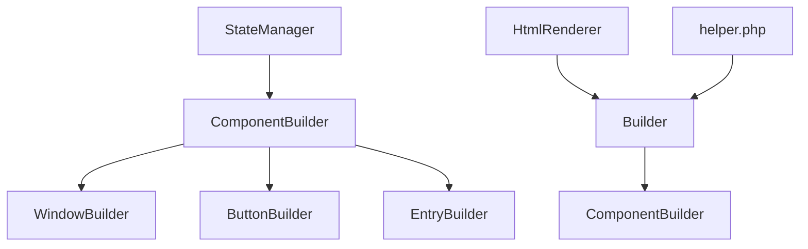

# 开发模式

<cite>
**本文档中引用的文件**  
- [README.md](file://README.md)
- [example/htmlLogin.php](file://example/htmlLogin.php)
- [example/full.php](file://example/full.php)
- [example/views/login.ui.html](file://example/views/login.ui.html)
- [src/ComponentBuilder.php](file://src/ComponentBuilder.php)
- [src/helper.php](file://src/helper.php)
- [src/Templates/FormTemplate.php](file://src/Templates/FormTemplate.php)
</cite>

## 目录
1. [简介](#简介)
2. [项目结构](#项目结构)
3. [核心组件](#核心组件)
4. [架构概述](#架构概述)
5. [详细组件分析](#详细组件分析)
6. [依赖分析](#依赖分析)
7. [性能考虑](#性能考虑)
8. [故障排除指南](#故障排除指南)
9. [结论](#结论)
10. [附录](#附录)（如有必要）

## 简介
libuiBuilder 提供了两种主要的开发模式：Builder API 模式和 HTML 模板模式。这两种模式为 PHP 桌面应用开发提供了不同的工作流选择，开发者可以根据项目需求和个人偏好进行选择。Builder API 模式通过流畅的链式调用提供编程灵活性，而 HTML 模板模式则利用熟悉的 HTML 语法实现界面的清晰定义和可视化预览。本文档将详细对比和说明这两种开发模式，分析它们的编程范式、语法规范、优势特点，并通过实现相同功能的代码对比来展示它们的实际应用。

## 项目结构
libuiBuilder 项目的结构清晰地反映了其两种开发模式的并存。`example/` 目录下的示例文件明确地分为两类：以 `html` 开头的文件（如 `htmlLogin.php` 和 `views/login.ui.html`）代表 HTML 模板模式，而其他文件（如 `full.php`）则代表 Builder API 模式。`src/` 目录包含了两种模式共享的核心组件，如 `ComponentBuilder.php` 和状态管理器，以及特定于 HTML 模板的辅助功能，如 `FormTemplate.php`。这种结构使得两种模式可以无缝集成，甚至在同一个项目中混合使用。

**图示来源**
- [example/htmlLogin.php](file://example/htmlLogin.php#L1-L96)
- [example/full.php](file://example/full.php#L1-L180)
- [example/views/login.ui.html](file://example/views/login.ui.html#L1-L49)

**本节来源**
- [README.md](file://README.md#L1-L407)
- [example/](file://example/)

## 核心组件
libuiBuilder 的核心组件是 `ComponentBuilder` 类，它为所有 UI 组件提供了统一的基类。该类定义了链式调用的配置方法（通过 `__call` 魔术方法实现）、组件 ID 的注册、状态绑定（`bind` 方法）以及事件处理（`on` 方法）。`helper.php` 文件提供了大量便捷的函数，如 `window()`、`button()` 等，这些函数本质上是 `Builder` 类静态方法的别名，极大地简化了 Builder API 模式的代码编写。`FormTemplate.php` 则展示了如何通过模板系统复用界面逻辑，这是 HTML 模式优势的延伸。

**本节来源**
- [src/ComponentBuilder.php](file://src/ComponentBuilder.php#L1-L234)
- [src/helper.php](file://src/helper.php#L1-L222)
- [src/Templates/FormTemplate.php](file://src/Templates/FormTemplate.php#L1-L46)

## 架构概述
libuiBuilder 的架构围绕着两种开发模式构建。在 Builder API 模式下，开发者直接在 PHP 代码中通过 `Builder` 类的静态工厂方法创建组件，并利用链式调用进行配置。在 HTML 模板模式下，开发者在 `.ui.html` 文件中使用自定义的 HTML 标签定义界面，然后通过 `HtmlRenderer::render()` 方法将其解析并构建为相应的组件树。两种模式最终都依赖于 `ComponentBuilder` 及其子类来创建和管理原生的 GUI 控件，并通过 `StateManager` 实现数据和界面的双向绑定。

**图示来源**
- [example/htmlLogin.php](file://example/htmlLogin.php#L94)
- [example/full.php](file://example/full.php#L14)
- [src/ComponentBuilder.php](file://src/ComponentBuilder.php#L1-L234)

## 详细组件分析

### Builder API 模式分析
Builder API 模式采用流畅的接口（Fluent Interface）设计模式，其核心是静态工厂方法和链式调用。开发者通过 `Builder::window()`、`Builder::button()` 等静态方法创建组件实例，这些方法返回一个 `ComponentBuilder` 子类的对象。随后，可以连续调用该对象的配置方法（如 `title()`、`size()`、`id()`），这些方法在内部调用 `setConfig()` 并返回 `this`，从而实现链式调用。这种模式在动态构建复杂界面时具有显著优势，因为它允许在运行时根据条件逻辑创建和配置组件。

**图示来源**
- [src/ComponentBuilder.php](file://src/ComponentBuilder.php#L114-L120)
- [src/helper.php](file://src/helper.php#L117-L124)

**本节来源**
- [example/full.php](file://example/full.php#L14-L179)
- [src/ComponentBuilder.php](file://src/ComponentBuilder.php#L1-L234)

### HTML 模板模式分析
HTML 模板模式使用一种自定义的 HTML 语法来定义用户界面。其核心是 `<ui>` 根标签和一系列映射到 GUI 组件的标签，如 `<window>`、`<button>`、`<input>` 等。该模式支持强大的 Grid 布局系统，通过 `row`、`col`、`rowspan` 和 `colspan` 属性实现精确的二维定位。数据绑定通过 `bind` 属性和 `{{}}` 表达式实现，而事件绑定则通过 `onclick`、`onchange` 等属性实现。这种模式的优势在于界面结构的清晰性和可维护性，使得前端设计和后端逻辑可以更好地分离。

**图示来源**
- [example/views/login.ui.html](file://example/views/login.ui.html#L1-L49)
- [README.md](file://README.md#L60-L85)

**本节来源**
- [example/htmlLogin.php](file://example/htmlLogin.php#L94)
- [example/views/login.ui.html](file://example/views/login.ui.html#L1-L49)

### 两种模式对比：登录表单实现
以下对比展示了使用两种模式实现相同登录表单功能的代码结构。Builder API 模式将所有逻辑集中在一个 PHP 文件中，代码是命令式的，执行顺序明确。HTML 模板模式则将界面定义与逻辑处理分离，`.ui.html` 文件专注于结构和布局，而 PHP 文件则负责状态初始化和事件处理。这种分离使得 HTML 模板更易于阅读、设计和维护，尤其是在团队协作中，设计师可以独立编辑界面文件。

**本节来源**
- [example/full.php](file://example/full.php#L14-L179)
- [example/htmlLogin.php](file://example/htmlLogin.php#L1-L96)
- [example/views/login.ui.html](file://example/views/login.ui.html#L1-L49)

## 依赖分析
libuiBuilder 的依赖关系清晰。`ComponentBuilder` 是所有组件的基类，被 `WindowBuilder`、`ButtonBuilder` 等具体组件类继承。`StateManager` 被 `ComponentBuilder` 用于实现状态绑定和监听。`HtmlRenderer` 依赖于 PHP 的 DOM 解析功能来处理 HTML 模板，并最终调用 `Builder` 类的方法来创建组件。`helper.php` 中的函数依赖于 `Builder` 类，为开发者提供更简洁的 API。

**图示来源**
- [src/ComponentBuilder.php](file://src/ComponentBuilder.php#L7)
- [src/helper.php](file://src/helper.php#L114)
- [example/htmlLogin.php](file://example/htmlLogin.php#L6)

**本节来源**
- [src/ComponentBuilder.php](file://src/ComponentBuilder.php#L1-L234)
- [src/helper.php](file://src/helper.php#L1-L222)

## 性能考虑
从性能角度看，两种模式在运行时的差异很小，因为它们最终都构建相同的组件树并调用相同的底层库。然而，HTML 模板模式在开发阶段具有优势。模板文件可以被缓存，避免了每次请求都进行解析。此外，由于界面与逻辑分离，开发者可以更专注于优化各自的领域。Builder API 模式在构建极其动态的界面时可能更高效，因为它避免了模板解析的开销，但这种优势通常微不足道。

## 故障排除指南
在使用 libuiBuilder 时，常见的问题包括 HTML 模板文件路径错误、事件处理器名称不匹配以及状态键名拼写错误。对于 HTML 模板模式，应确保 `HtmlRenderer::render()` 能够找到模板文件。对于事件处理，PHP 中定义的处理器名称必须与 HTML 中的 `onclick` 等属性值完全一致。在使用 `bind` 进行数据绑定时，应确保状态管理器中已初始化相应的键。

**本节来源**
- [example/htmlLogin.php](file://example/htmlLogin.php#L17-L91)
- [README.md](file://README.md#L104)

## 结论
libuiBuilder 的两种开发模式各有千秋。Builder API 模式提供了最大的编程灵活性和动态构建能力，适合需要在运行时根据复杂逻辑生成界面的场景。HTML 模板模式则以其清晰的结构、良好的可维护性和对团队协作的支持而胜出，特别适合界面相对固定、需要清晰分离关注点的项目。根据 `README.md` 中的建议，推荐将 HTML 模板作为主要开发方式，仅在需要动态构建时使用 Builder API 模式，或在两者之间混合使用以发挥各自的优势。