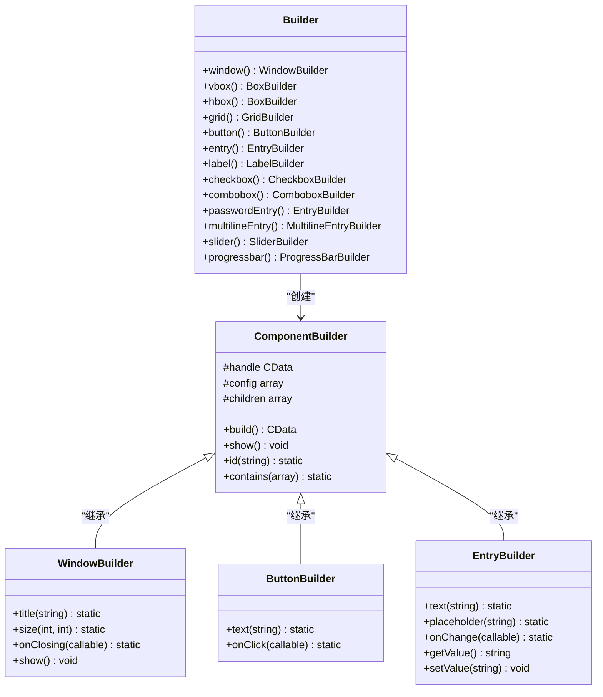
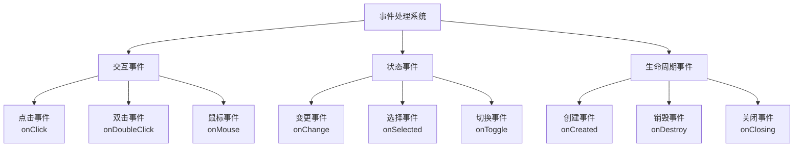

# 快速入门

<cite>
**本文档中引用的文件**
- [composer.json](file://composer.json)
- [example/simple.php](file://example/simple.php)
- [src/Builder.php](file://src/Builder.php)
- [src/helper.php](file://src/helper.php)
- [src/Components/WindowBuilder.php](file://src/Components/WindowBuilder.php)
- [src/Components/ButtonBuilder.php](file://src/Components/ButtonBuilder.php)
- [src/Components/EntryBuilder.php](file://src/Components/EntryBuilder.php)
- [vendor/kingbes/libui/README.md](file://vendor/kingbes/libui/README.md)
</cite>

## 目录
1. [简介](#简介)
2. [环境准备](#环境准备)
3. [项目安装](#项目安装)
4. [核心概念](#核心概念)
5. [第一个应用](#第一个应用)
6. [组件详解](#组件详解)
7. [事件处理](#事件处理)
8. [数据绑定](#数据绑定)
9. [最佳实践](#最佳实践)
10. [常见问题](#常见问题)

## 简介

libuiBuilder是一个基于PHP FFI的GUI应用程序构建库，它提供了简洁优雅的Builder模式接口，让开发者能够轻松创建跨平台的桌面应用程序。本指南将带领您从零开始，快速掌握如何使用libuiBuilder构建第一个应用程序。

## 环境准备

在开始之前，请确保您的开发环境满足以下要求：

### PHP环境要求
- **PHP版本**: PHP 8.2或更高版本
- **必需扩展**: PHP FFI扩展（默认已启用）
- **操作系统支持**: Windows Vista SP2+、macOS 10.8+、Linux GTK+ 3.10+

### 检查PHP FFI扩展

在终端中运行以下命令检查FFI扩展是否已启用：

```bash
php -m | grep ffi
```

如果输出包含`ffi`，则表示FFI扩展已启用。如果没有，请参考PHP官方文档启用FFI扩展。

### 平台特定要求

- **Windows**: 确保系统已安装Visual C++运行时库
- **macOS**: 确保已安装Xcode命令行工具
- **Linux**: 确保已安装GTK+开发包（如`libgtk-3-dev`）

**节来源**
- [vendor/kingbes/libui/README.md](file://vendor/kingbes/libui/README.md#L12-L21)

## 项目安装

### 使用Composer安装

libuiBuilder通过Composer进行管理，您可以使用以下命令安装：

```bash
composer require yangweijie/libui-builder
```

这将自动安装：
- libuiBuilder核心库
- kingbes/libui依赖库
- 所有必要的PHP依赖项

### Composer配置验证

安装完成后，检查`composer.json`文件确认依赖已正确添加：

```json
{
    "require": {
        "ext/ffi": "*",
        "kingbes/libui": "*",
        "yangweijie/libui-builder": "*"
    }
}
```

**节来源**
- [composer.json](file://composer.json#L5-L8)

## 核心概念

### Builder模式架构

libuiBuilder采用Builder模式设计，所有组件都通过`Builder`类创建。这种设计提供了流畅的链式调用接口，使代码更加直观易读。



**图表来源**
- [src/Builder.php](file://src/Builder.php#L27-L153)
- [src/Components/WindowBuilder.php](file://src/Components/WindowBuilder.php#L11-L96)

### 组件层次结构

libuiBuilder的组件按功能分为几个主要类别：

| 组件类型 | 主要组件 | 功能描述 |
|---------|---------|---------|
| **容器组件** | vbox, hbox, grid, tab | 用于组织和布局其他组件 |
| **基础控件** | button, label, entry, checkbox | 基础的用户交互组件 |
| **高级控件** | combobox, slider, progressbar, table | 更复杂的交互组件 |
| **特殊组件** | canvas, separator, menu | 特殊用途的组件 |

**节来源**
- [src/Builder.php](file://src/Builder.php#L29-L153)

## 第一个应用

让我们从一个最简单的Hello World应用开始，逐步解释每个步骤。

### 基础Hello World示例

```php
<?php
require_once __DIR__ . '/vendor/autoload.php';
require_once __DIR__ . '/src/helper.php';

use Kingbes\Libui\App;
use Kingbes\Libui\View\Builder;

// 初始化应用
App::init();

// 创建主窗口
$app = Builder::window()
    ->title('我的第一个应用')
    ->size(400, 300)
    ->contains([
        Builder::vbox()->contains([
            Builder::label()
                ->text('你好，世界！')
                ->id('greetingLabel'),
            
            Builder::button()
                ->text('点击我')
                ->onClick(function ($button) {
                    echo "按钮被点击了！\n";
                })
        ])
    ]);

// 显示窗口并启动应用
$app->show();
```

### 代码逐行解析

#### 1. 引入必要的文件

```php
require_once __DIR__ . '/vendor/autoload.php';
require_once __DIR__ . '/src/helper.php';
```

这两行代码完成了以下工作：
- **自动加载**: 加载Composer自动生成的自动加载文件
- **辅助函数**: 加载libuiBuilder提供的辅助函数

#### 2. 命名空间导入

```php
use Kingbes\Libui\App;
use Kingbes\Libui\View\Builder;
```

这里导入了两个核心类：
- **App**: 应用程序生命周期管理
- **Builder**: 组件创建的统一入口点

#### 3. 应用初始化

```php
App::init();
```

这行代码非常重要，它初始化了底层的libui库，为后续的GUI操作做好准备。

#### 4. 创建主窗口

```php
$app = Builder::window()
    ->title('我的第一个应用')
    ->size(400, 300)
    ->contains([...]);
```

这里展示了Builder模式的核心特性：
- **链式调用**: 每个方法都返回当前对象，支持连续调用
- **流畅接口**: 代码自然流畅，易于阅读
- **配置分离**: 将配置和逻辑清晰分离

#### 5. 添加布局容器

```php
Builder::vbox()->contains([...])
```

垂直盒子容器（vbox）将内部组件垂直排列，这是最常见的布局方式之一。

#### 6. 注册组件ID

```php
Builder::label()
    ->text('你好，世界！')
    ->id('greetingLabel')
```

使用`id()`方法为组件注册唯一标识符，这对于后续的事件处理和数据绑定至关重要。

#### 7. 绑定事件处理

```php
Builder::button()
    ->text('点击我')
    ->onClick(function ($button) {
        echo "按钮被点击了！\n";
    })
```

事件处理是GUI应用的核心功能，这里展示了如何为按钮点击事件绑定处理函数。

#### 8. 显示应用

```php
$app->show();
```

这行代码完成以下操作：
- 构建整个组件树
- 显示主窗口
- 启动事件循环

**节来源**
- [example/simple.php](file://example/simple.php#L1-L142)

## 组件详解

### 窗口组件（Window）

窗口是所有GUI应用的根容器，Builder提供了丰富的配置选项：

```php
// 基本窗口创建
$window = Builder::window()
    ->title('应用标题')
    ->size(800, 600)
    ->margined(true)
    ->resizable(true);

// 自定义关闭行为
$window->onClosing(function () {
    // 自定义关闭逻辑
    return true; // 返回true表示允许关闭
});

// 显示窗口
$window->show();
```

### 布局容器

#### 垂直盒子（vbox）
```php
Builder::vbox()
    ->contains([
        Builder::label()->text('第一行'),
        Builder::label()->text('第二行'),
        Builder::label()->text('第三行')
    ]);
```

#### 水平盒子（hbox）
```php
Builder::hbox()
    ->contains([
        Builder::button()->text('左按钮'),
        Builder::button()->text('中按钮'),
        Builder::button()->text('右按钮')
    ]);
```

#### 网格布局（grid）
```php
Builder::grid()
    ->form([
        [
            'label' => Builder::label()->text('用户名:'),
            'control' => Builder::entry()->id('username')
        ],
        [
            'label' => Builder::label()->text('密码:'),
            'control' => Builder::passwordEntry()->id('password')
        ]
    ]);
```

### 基础控件

#### 按钮（Button）
```php
Builder::button()
    ->text('提交')
    ->onClick(function ($button) {
        // 处理点击事件
        echo "提交按钮被点击\n";
    });
```

#### 文本输入框（Entry）
```php
Builder::entry()
    ->placeholder('请输入内容')
    ->maxLength(50)
    ->onChange(function ($value, $component) {
        // 输入变化时触发
        echo "输入值变为: {$value}\n";
    });
```

#### 标签（Label）
```php
Builder::label()
    ->text('这是一个静态文本')
    ->id('staticLabel');
```

#### 复选框（Checkbox）
```php
Builder::checkbox()
    ->text('同意条款')
    ->onToggle(function ($checked, $component) {
        echo "复选框状态: " . ($checked ? '选中' : '未选中') . "\n";
    });
```

#### 下拉框（Combobox）
```php
Builder::combobox()
    ->items(['苹果', '香蕉', '橙子'])
    ->onSelected(function ($index, $item, $component) {
        echo "选择了: {$item} (索引: {$index})\n";
    });
```

**节来源**
- [src/Builder.php](file://src/Builder.php#L29-L153)
- [src/Components/WindowBuilder.php](file://src/Components/WindowBuilder.php#L11-L96)
- [src/Components/ButtonBuilder.php](file://src/Components/ButtonBuilder.php#L9-L48)
- [src/Components/EntryBuilder.php](file://src/Components/EntryBuilder.php#L9-L80)

## 事件处理

libuiBuilder提供了强大的事件处理机制，支持多种类型的事件：

### 事件类型分类



### 常见事件处理模式

#### 按钮点击事件
```php
Builder::button()
    ->text('提交')
    ->onClick(function ($button, $state) {
        // 获取表单数据
        $name = $state->getComponent('nameEntry')->getValue();
        $age = $state->getComponent('ageEntry')->getValue();
        
        // 执行业务逻辑
        if (empty($name)) {
            echo "姓名不能为空！\n";
            return;
        }
        
        echo "提交成功: 姓名={$name}, 年龄={$age}\n";
    });
```

#### 输入框变更事件
```php
Builder::entry()
    ->placeholder('请输入邮箱')
    ->onChange(function ($value, $component) {
        // 实时验证
        if (!filter_var($value, FILTER_VALIDATE_EMAIL)) {
            echo "邮箱格式不正确\n";
            return;
        }
        
        // 更新相关组件状态
        $submitButton = $component->state()->getComponent('submitBtn');
        if ($submitButton) {
            $submitButton->getComponent()->setConfig('disabled', false);
        }
    });
```

#### 窗口关闭事件
```php
Builder::window()
    ->title('应用')
    ->onClosing(function () {
        // 显示确认对话框
        $result = confirm('确定要退出吗？');
        return $result; // 返回true允许关闭，false阻止关闭
    });
```

### 事件处理最佳实践

1. **错误处理**: 在事件处理函数中始终包含错误检查
2. **状态管理**: 利用StateManager进行组件间通信
3. **性能优化**: 避免在高频事件（如输入框变更）中执行耗时操作
4. **用户体验**: 提供适当的反馈信息

## 数据绑定

libuiBuilder内置了简单而强大的数据绑定机制，通过组件ID实现双向数据同步。

### 基本数据绑定

```php
// 创建带ID的输入框
$nameEntry = Builder::entry()
    ->id('nameEntry')
    ->placeholder('请输入姓名');

// 创建标签显示绑定的数据
$ nameLabel = Builder::label()
    ->id('nameLabel')
    ->text('当前姓名: ');

// 在事件中更新绑定数据
$nameEntry->onChange(function ($value, $component) {
    // 更新标签内容
    $label = StateManager::instance()->getComponent('nameLabel');
    if ($label) {
        $label->setValue("当前姓名: {$value}");
    }
});
```

### 表单数据收集

```php
// 表单提交处理
Builder::button()
    ->text('提交')
    ->onClick(function ($button) {
        // 收集所有表单数据
        $formData = [
            'name' => StateManager::instance()->getComponent('nameEntry')?->getValue(),
            'email' => StateManager::instance()->getComponent('emailEntry')?->getValue(),
            'age' => StateManager::instance()->getComponent('ageEntry')?->getValue(),
            'gender' => StateManager::instance()->getComponent('genderCombo')?->getValue()['item'],
            'agree' => StateManager::instance()->getComponent('agreeCheckbox')?->getValue()
        ];
        
        // 验证数据
        if (empty($formData['name'])) {
            echo "姓名不能为空！\n";
            return;
        }
        
        // 处理数据
        echo "表单提交成功:\n";
        print_r($formData);
    });
```

### 动态数据更新

```php
// 创建一个动态更新的标签
$dynamicLabel = Builder::label()
    ->id('dynamicLabel')
    ->text('初始值');

// 通过定时器更新数据
Timer::setInterval(function () use ($dynamicLabel) {
    $currentTime = date('H:i:s');
    $dynamicLabel->setValue("当前时间: {$currentTime}");
}, 1000);
```

**节来源**
- [example/simple.php](file://example/simple.php#L30-L50)
- [example/simple.php](file://example/simple.php#L103-L124)

## 最佳实践

### 项目结构建议

```
my-app/
├── composer.json
├── index.php          # 入口文件
├── assets/           # 静态资源
│   ├── images/
│   └── styles/
├── src/              # 应用源码
│   ├── Components/   # 组件类
│   ├── Views/       # 视图层
│   └── Services/    # 业务逻辑
└── vendor/          # 依赖库
```

### 代码组织原则

1. **单一职责**: 每个组件只负责一个特定的功能
2. **链式调用**: 充分利用Builder的链式调用特性
3. **命名规范**: 使用有意义的组件ID和变量名
4. **错误处理**: 在关键位置添加错误检查
5. **资源清理**: 在应用关闭时清理资源

### 性能优化建议

```php
// 避免在高频事件中执行复杂操作
$entry->onChange(function ($value, $component) {
    // 简单验证
    if (strlen($value) > 100) {
        echo "输入过长！\n";
        return;
    }
    
    // 复杂处理放在单独的函数中
    processInputAsync($value, $component);
});

function processInputAsync($value, $component) {
    // 使用异步处理避免阻塞UI
    async(function () use ($value, $component) {
        // 执行耗时操作
        sleep(1);
        // 更新UI
        $component->state()->getComponent('resultLabel')->setValue("处理结果: {$value}");
    });
}
```

### 用户体验优化

```php
// 添加加载状态
$submitButton = Builder::button()
    ->text('提交')
    ->onClick(function ($button) {
        // 显示加载状态
        $button->getComponent()->setConfig('text', '正在提交...');
        $button->getComponent()->setConfig('disabled', true);
        
        // 模拟异步操作
        async(function () use ($button) {
            sleep(2);
            
            // 恢复按钮状态
            $button->getComponent()->setConfig('text', '提交');
            $button->getComponent()->setConfig('disabled', false);
            
            echo "提交完成！\n";
        });
    });
```

## 常见问题

### 问题1: FFI扩展未启用

**症状**: 运行时出现"FFI extension is not enabled"错误

**解决方案**:
1. 检查PHP配置: `php --ini`
2. 启用FFI扩展: 在php.ini中添加`extension=ffi`
3. 重启Web服务器或CLI

### 问题2: libui库加载失败

**症状**: 出现"Failed to load libui library"错误

**解决方案**:
1. 确认系统架构匹配（x86_64）
2. 检查系统依赖库是否完整
3. 重新安装kingbes/libui包

### 问题3: 组件无法显示

**症状**: 窗口创建但看不到任何内容

**解决方案**:
1. 确保调用了`show()`方法
2. 检查组件是否正确添加到容器中
3. 验证窗口尺寸是否合理

### 问题4: 事件处理不生效

**症状**: 绑定的事件处理函数没有被调用

**解决方案**:
1. 确认组件ID正确注册
2. 检查事件回调函数签名
3. 验证StateManager实例是否正常工作

### 调试技巧

```php
// 启用调试模式
define('DEBUG_MODE', true);

// 添加调试信息
Builder::button()
    ->text('测试')
    ->onClick(function ($button) {
        if (defined('DEBUG_MODE') && DEBUG_MODE) {
            error_log('按钮点击事件触发');
        }
        
        // 事件处理逻辑
    });

// 组件状态检查
function debugComponentState($componentId) {
    $component = StateManager::instance()->getComponent($componentId);
    if ($component) {
        echo "组件{$componentId}状态: " . json_encode([
            'value' => $component->getValue(),
            'config' => $component->getConfig()
        ]) . "\n";
    } else {
        echo "组件{$componentId}不存在\n";
    }
}
```

通过遵循本指南的步骤和最佳实践，您应该能够快速上手libuiBuilder，创建出功能丰富、用户友好的桌面应用程序。记住，GUI开发需要不断迭代和优化，保持耐心和细心是成功的关键。