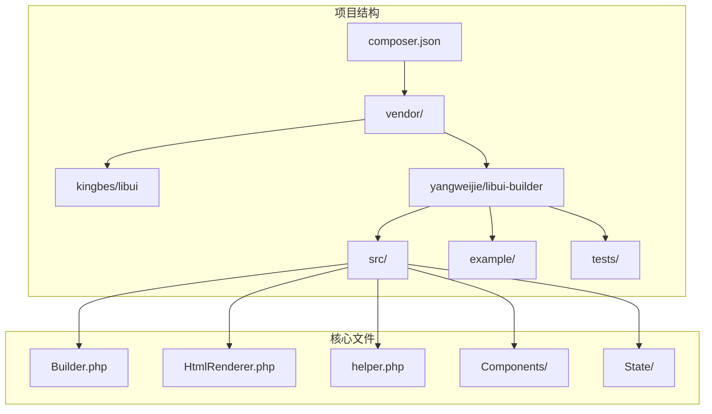
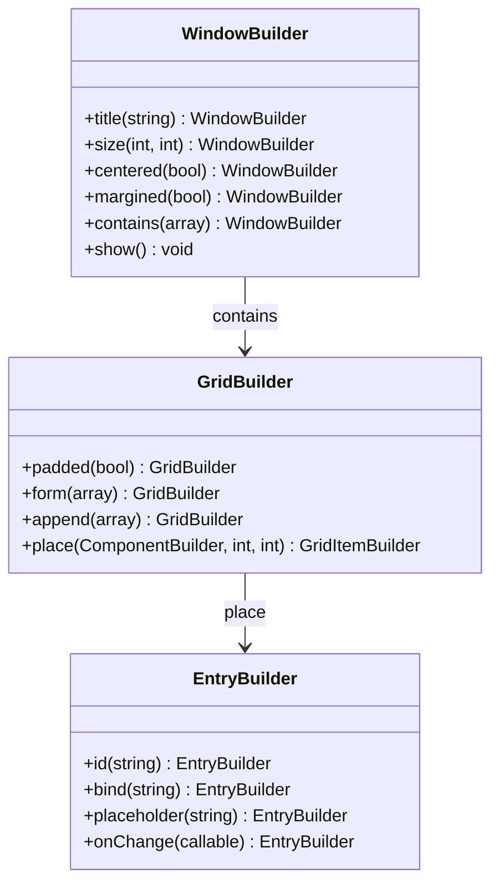
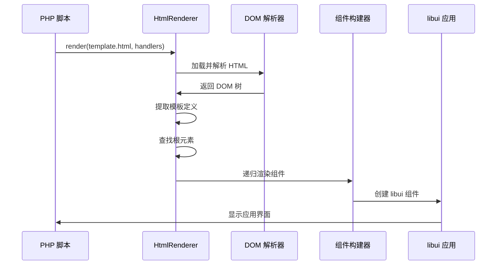

# 快速开始

<cite>
**本文档中引用的文件**
- [composer.json](file://composer.json)
- [README.md](file://README.md)
- [simple.php](file://example/simple.php)
- [calculator.php](file://example/calculator.php)
- [calculator_html.php](file://example/calculator_html.php)
- [calculator.ui.html](file://example/views/calculator.ui.html)
- [login.ui.html](file://example/views/login.ui.html)
- [htmlLogin.php](file://example/htmlLogin.php)
- [HtmlRenderer.php](file://src/HtmlRenderer.php)
- [Builder.php](file://src/Builder.php)
- [helper.php](file://src/helper.php)
</cite>

## 目录
1. [简介](#简介)
2. [环境准备](#环境准备)
3. [安装依赖](#安装依赖)
4. [开发模式概览](#开发模式概览)
5. [Builder API 开发模式](#builder-api-开发模式)
6. [HTML 模板开发模式](#html-模板开发模式)
7. [常见问题排查](#常见问题排查)
8. [最佳实践建议](#最佳实践建议)

## 简介

libuiBuilder 是一个基于 PHP 的桌面应用程序开发框架，提供了两种主要的开发方式：**Builder API** 和 **HTML 模板渲染**。它建立在 kingbes/libui 库之上，为开发者提供了直观、灵活的 GUI 应用程序开发体验。

### 核心特性

- 🎨 **Builder 模式** - 流畅的链式调用 API
- 🌐 **HTML 模板渲染** - 使用熟悉的 HTML 语法定义界面
- 📊 **强大的 Grid 布局** - 精确的二维布局控制
- 🔄 **状态管理** - 响应式数据绑定
- 🎯 **事件系统** - 简洁的事件处理
- 📦 **组件复用** - 模板系统支持
- 🧪 **完整测试** - Pest 测试覆盖

## 环境准备

在开始之前，请确保您的开发环境满足以下要求：

### PHP 版本要求
- **最低 PHP 版本**: 8.0+
- **推荐版本**: 8.1+（获得更好的性能和特性支持）

### 扩展要求
- **FFI 扩展**: libuiBuilder 依赖 PHP FFI 扩展来与原生 libui 库通信
- **libui 库**: 自动通过 composer 安装

### 检查环境

```bash
# 检查 PHP 版本
php --version

# 检查 FFI 扩展是否启用
php -m | grep ffi

# 如果 FFI 未启用，可以在 php.ini 中添加：
# extension=ffi
```

## 安装依赖

### 通过 Composer 安装

libuiBuilder 可以通过 Composer 轻松安装到您的项目中：

```bash
# 在项目目录中执行
composer require yangweijie/libui-builder
```

### 安装过程说明

安装完成后，您将获得以下核心组件：



**图表来源**
- [composer.json](file://composer.json#L1-L37)
- [Builder.php](file://src/Builder.php#L1-L50)
- [HtmlRenderer.php](file://src/HtmlRenderer.php#L1-L100)

**章节来源**
- [composer.json](file://composer.json#L1-L37)
- [README.md](file://README.md#L17-L22)

## 开发模式概览

libuiBuilder 提供两种主要的开发模式，您可以根据项目需求和个人偏好选择适合的方式：

### 开发模式对比

| 特性 | Builder API | HTML 模板 |
|------|-------------|-----------|
| **语法熟悉度** | PHP 语法，需要学习 API | HTML 语法，熟悉 Web 开发 |
| **可视化程度** | 代码编写，无实时预览 | HTML 文件，支持可视化编辑器 |
| **动态性** | 更适合动态构建场景 | 更适合静态界面设计 |
| **学习曲线** | 中等，需要理解 API 设计 | 较低，HTML 语法简单易懂 |
| **维护性** | 代码集中，便于版本控制 | 结构分离，易于团队协作 |

### 选择建议

- **推荐使用 HTML 模板模式**：对于大多数桌面应用开发场景
- **使用 Builder API**：当需要动态生成界面或复杂逻辑处理时
- **混合使用**：根据具体需求灵活组合两种方式

## Builder API 开发模式

Builder API 提供了流畅的链式调用接口，允许您通过 PHP 代码直接构建 GUI 界面。

### 基础窗口应用示例

让我们从一个简单的登录窗口开始：

```php
<?php
use Kingbes\Libui\App;
use Kingbes\Libui\View\Builder;
use Kingbes\Libui\View\State\StateManager;

// 初始化 libui 应用
App::init();

// 创建状态管理器
$state = StateManager::instance();
$state->set('username', '');

// 使用 Builder API 构建界面
$app = Builder::window()
    ->title('登录窗口')
    ->size(400, 300)
    ->contains([
        Builder::grid()->padded(true)->form([
            [
                'label' => Builder::label()->text('用户名:'),
                'control' => Builder::entry()
                    ->id('usernameInput')
                    ->bind('username')
                    ->placeholder('请输入用户名')
            ]
        ])->append([
            Builder::button()
                ->text('登录')
                ->onClick(function($button, $state) {
                    echo "登录: " . $state->get('username') . "\n";
                })
        ])
    ]);

$app->show();
```

### 方法调用详解

#### 窗口配置方法



**图表来源**
- [Builder.php](file://src/Builder.php#L56-L80)
- [simple.php](file://example/simple.php#L11-L50)

#### 关键方法说明

1. **title()** - 设置窗口标题
   ```php
   $window->title('我的应用')
   ```

2. **size()** - 设置窗口尺寸（宽度, 高度）
   ```php
   $window->size(800, 600)
   ```

3. **contains()** - 设置窗口内容（子组件数组）
   ```php
   $window->contains([$grid, $toolbar])
   ```

4. **bind()** - 绑定状态变量
   ```php
   $entry->bind('username')
   ```

5. **onClick()** - 设置点击事件处理器
   ```php
   $button->onClick(function($button, $state) {
       // 处理点击事件
   })
   ```

### 完整的计算器示例

以下是一个更复杂的计算器应用示例：

```php
<?php
use Kingbes\Libui\App;
use Kingbes\Libui\View\Builder;
use Kingbes\Libui\View\State\StateManager;

App::init();

// 初始化状态
$stateManager = StateManager::instance();
$stateManager->set('display', '0');
$stateManager->set('previousValue', null);
$stateManager->set('operation', null);

// 创建按钮网格
$buttonGrid = Builder::grid()->padded(true);
$buttons = [
    ['C', 0, 0, 'clear'],
    ['CE', 0, 1, 'clearEntry'],
    ['⌫', 0, 2, 'backspace'],
    ['÷', 0, 3, 'divide'],
    // ... 更多按钮
];

// 添加按钮到网格
foreach ($buttons as $buttonInfo) {
    $text = $buttonInfo[0];
    $row = $buttonInfo[1];
    $col = $buttonInfo[2];
    $id = $buttonInfo[3];
    
    $button = Builder::button()
        ->id($id)
        ->text($text);
    
    // 添加事件处理器
    switch ($id) {
        case 'clear':
            $button->onClick(function($button) use ($stateManager) {
                $stateManager->update([
                    'display' => '0',
                    'previousValue' => null,
                    'operation' => null
                ]);
            });
            break;
        // ... 其他事件处理
    }
    
    $buttonGrid->place($button, $row, $col);
}

// 创建主窗口
$app = Builder::window()
    ->title('计算器')
    ->size(300, 400)
    ->contains([
        Builder::vbox()->padded(true)->contains([
            // 显示屏
            $displayGrid,
            Builder::separator(),
            // 按钮区域
            $buttonGrid
        ])
    ]);

$app->show();
```

**章节来源**
- [simple.php](file://example/simple.php#L1-L142)
- [calculator.php](file://example/calculator.php#L1-L238)

## HTML 模板开发模式

HTML 模板模式是 libuiBuilder 推荐的主要开发方式，它使用熟悉的 HTML 语法来定义界面，提供了更好的可视化和维护性。

### 基础 HTML 模板结构

HTML 模板必须使用特殊的 `ui` 标签结构：

```html
<!DOCTYPE html>
<ui version="1.0">
  <window title="我的应用" size="800,600" centered="true">
    <grid padded="true">
      <!-- 界面元素 -->
    </grid>
  </window>
</ui>
```

### 登录表单模板示例

让我们创建一个完整的登录表单 HTML 模板：

```html
<!DOCTYPE html>
<ui version="1.0">
  <window title="登录窗口" size="400,300" centered="true" margined="true">
    <grid padded="true">
      
      <!-- 用户名行 -->
      <label row="0" col="0" align="end,center">用户名:</label>
      <input 
        id="usernameInput"
        row="0" 
        col="1" 
        bind="username"
        placeholder="请输入用户名"
        expand="horizontal"
        onchange="handleUsernameChange"
      />
      
      <!-- 密码行 -->
      <label row="1" col="0" align="end,center">密码:</label>
      <input 
        id="passwordInput"
        row="1" 
        col="1" 
        type="password"
        bind="password"
        placeholder="请输入密码"
        expand="horizontal"
        onchange="handlePasswordChange"
      />
      
      <!-- 按钮行 -->
      <hbox row="2" col="0" colspan="2" align="center">
        <button id="loginBtn" onclick="handleLogin">登录</button>
        <button onclick="handleReset">清空</button>
      </hbox>
      
      <!-- 状态标签 -->
      <label 
        id="statusLabel" 
        row="3" 
        col="0" 
        colspan="2" 
        align="center"
      >请输入登录信息</label>
      
    </grid>
  </window>
</ui>
```

### 模板语法详解

#### 布局属性

| 属性 | 描述 | 示例 |
|------|------|------|
| `row` | 行位置 | `row="0"` |
| `col` | 列位置 | `col="1"` |
| `rowspan` | 跨越行数 | `rowspan="2"` |
| `colspan` | 跨越列数 | `colspan="3"` |
| `align` | 对齐方式 | `align="center"` |
| `expand` | 扩展属性 | `expand="horizontal"` |

#### 数据绑定

```html
<!-- 绑定状态变量 -->
<input bind="username" />

<!-- 双向数据绑定 -->
<label>{{username}}</label>
```

#### 事件处理

```html
<!-- 点击事件 -->
<button onclick="handleClick">点击</button>

<!-- 输入变化事件 -->
<input onchange="handleChange" />

<!-- 选择变化事件 -->
<select onselected="handleSelect">
  <option>选项1</option>
  <option>选项2</option>
</select>
```

### PHP 事件处理器

创建对应的 PHP 处理器文件：

```php
<?php
use Kingbes\Libui\App;
use Kingbes\Libui\View\HtmlRenderer;
use Kingbes\Libui\View\State\StateManager;

App::init();

// 初始化状态
$state = StateManager::instance();
$state->set('username', '');
$state->set('password', '');

// 定义事件处理器
$handlers = [
    'handleUsernameChange' => function($value, $component) {
        echo "用户名输入: {$value}\n";
        
        // 访问其他组件
        $loginBtn = StateManager::instance()->getComponent('loginBtn');
        $passwordInput = StateManager::instance()->getComponent('passwordInput');
        
        // 根据输入启用/禁用登录按钮
        $canLogin = !empty($value) && !empty($passwordInput?->getValue());
        echo "可以登录: " . ($canLogin ? '是' : '否') . "\n";
    },
    
    'handlePasswordChange' => function($value, $component) {
        // 计算密码强度
        $strength = strlen($value) > 8 ? '强' : '弱';
        
        $statusLabel = StateManager::instance()->getComponent('statusLabel');
        if ($statusLabel) {
            $statusLabel->setValue("密码强度: {$strength}");
        }
    },
    
    'handleLogin' => function($button, $stateManager) {
        $username = $stateManager->get('username');
        $password = $stateManager->get('password');
        
        if (empty($username) || empty($password)) {
            echo "用户名和密码不能为空\n";
            return;
        }
        
        // 模拟登录验证
        if ($username === 'admin' && $password === 'admin') {
            echo "登录成功！\n";
            
            $statusLabel = StateManager::instance()->getComponent('statusLabel');
            if ($statusLabel) {
                $statusLabel->setValue("登录成功！");
            }
        } else {
            echo "用户名或密码错误\n";
            
            $statusLabel = StateManager::instance()->getComponent('statusLabel');
            if ($statusLabel) {
                $statusLabel->setValue("登录失败：用户名或密码错误");
            }
        }
    },
    
    'handleReset' => function($button, $stateManager) {
        // 清空所有输入
        $stateManager->update([
            'username' => '',
            'password' => ''
        ]);
        
        echo "表单已清空\n";
    }
];

// 从 HTML 渲染
$app = HtmlRenderer::render(__DIR__ . '/views/login.ui.html', $handlers);
$app->show();
```

### HTML 渲染流程



**图表来源**
- [HtmlRenderer.php](file://src/HtmlRenderer.php#L57-L77)
- [htmlLogin.php](file://example/htmlLogin.php#L93-L96)

**章节来源**
- [login.ui.html](file://example/views/login.ui.html#L1-L49)
- [htmlLogin.php](file://example/htmlLogin.php#L1-L96)
- [calculator.ui.html](file://example/views/calculator.ui.html#L1-L54)

## 常见问题排查

在使用 libuiBuilder 过程中，可能会遇到一些常见的初始化和运行时问题。以下是详细的排查指南：

### 初始化错误

#### 1. FFI 扩展未启用

**错误症状**：
```
Fatal error: Uncaught Error: Call to undefined function FFI\cdef()
```

**解决方案**：
```bash
# 检查 FFI 是否启用
php -m | grep ffi

# 启用 FFI 扩展（Linux/MacOS）
echo "extension=ffi" >> ~/.phprc

# Windows 用户修改 php.ini
# 在 php.ini 中添加: extension=ffi
```

#### 2. libui 库加载失败

**错误症状**：
```
Error: Failed to load libui library
```

**解决方案**：
```bash
# 确保 composer 已正确安装依赖
composer install

# 检查 vendor 目录是否存在
ls vendor/kingbes/libui
```

### HTML 模板相关问题

#### 1. 模板文件找不到

**错误症状**：
```
Exception: HTML template file not found: views/template.ui.html
```

**解决方案**：
```php
// 确保文件路径正确
$app = HtmlRenderer::render(__DIR__ . '/views/template.ui.html', $handlers);

// 或使用绝对路径
$app = HtmlRenderer::render('/full/path/to/views/template.ui.html', $handlers);
```

#### 2. 根元素缺失

**错误症状**：
```
Exception: HTML template must contain a root element (window, vbox, hbox, grid, or tab)
```

**解决方案**：确保 HTML 模板包含根元素：
```html
<ui version="1.0">
  <window title="应用" size="800,600">
    <!-- 内容 -->
  </window>
</ui>
```

### 状态管理和数据绑定问题

#### 1. 绑定状态未初始化

**错误症状**：
```
Warning: Undefined index: username in StateManager
```

**解决方案**：
```php
// 在使用前初始化状态
$state = StateManager::instance();
$state->set('username', '');
$state->set('password', '');
```

#### 2. 组件 ID 不存在

**错误症状**：
```
Warning: Attempt to get component that does not exist: usernameInput
```

**解决方案**：
```php
// 确保 HTML 中定义了正确的 ID
<input id="usernameInput" bind="username" />

// 或在 PHP 中检查组件是否存在
$usernameInput = StateManager::instance()->getComponent('usernameInput');
if ($usernameInput) {
    // 安全使用组件
}
```

### 事件处理问题

#### 1. 事件处理器未找到

**错误症状**：
```
Exception: Handler not found: handleClick
```

**解决方案**：
```php
// 确保事件处理器已正确定义
$handlers = [
    'handleClick' => function($button, $state) {
        // 处理逻辑
    }
];

// 确保 HTML 中使用了正确的事件名称
<button onclick="handleClick">点击</button>
```

#### 2. 事件参数类型错误

**解决方案**：
```php
// 检查事件处理器签名
'handleClick' => function($button, $state) {
    // $button 是组件对象
    // $state 是状态管理器
}

'handleChange' => function($value, $component) {
    // $value 是新值
    // $component 是触发事件的组件
}
```

### 调试技巧

#### 1. 启用详细错误报告

```php
// 在开发环境中启用错误报告
error_reporting(E_ALL);
ini_set('display_errors', 1);

// 在生产环境中记录错误
ini_set('log_errors', 1);
ini_set('error_log', __DIR__ . '/error.log');
```

#### 2. 使用状态监控

```php
// 监听状态变化
$state = StateManager::instance();
$state->watch('username', function($newValue, $oldValue) {
    echo "用户名从 '{$oldValue}' 变更为 '{$newValue}'\n";
});

// 打印当前状态
print_r($state->getAll());
```

#### 3. 组件调试

```php
// 获取所有组件
$components = StateManager::instance()->getAllComponents();
foreach ($components as $id => $component) {
    echo "组件 ID: {$id}, 类型: " . get_class($component) . "\n";
}
```

**章节来源**
- [HtmlRenderer.php](file://src/HtmlRenderer.php#L80-L108)
- [htmlLogin.php](file://example/htmlLogin.php#L11-L15)

## 最佳实践建议

### 项目结构组织

推荐的项目结构：

```
project/
├── views/              # HTML 模板文件
│   ├── login.ui.html
│   ├── dashboard.ui.html
│   └── components/
│       ├── header.ui.html
│       └── footer.ui.html
├── handlers/           # 事件处理器
│   ├── LoginHandlers.php
│   ├── DashboardHandlers.php
│   └── BaseHandlers.php
├── state/              # 状态管理
│   ├── AppState.php
│   └── UserState.php
├── assets/             # 静态资源
│   ├── styles/
│   └── images/
└── app.php             # 主入口文件
```

### 代码组织建议

#### 1. 分离关注点

```php
// app.php - 主入口
<?php
require_once __DIR__ . '/vendor/autoload.php';

use Kingbes\Libui\App;
use Kingbes\Libui\View\HtmlRenderer;
use Handlers\LoginHandlers;

App::init();

$handlers = LoginHandlers::getHandlers();
$app = HtmlRenderer::render(__DIR__ . '/views/login.ui.html', $handlers);
$app->show();
```

#### 2. 使用命名空间

```php
// handlers/LoginHandlers.php
<?php
namespace Handlers;

class LoginHandlers {
    public static function getHandlers(): array {
        return [
            'handleLogin' => [self::class, 'login'],
            'handleReset' => [self::class, 'reset'],
        ];
    }
    
    public static function login($button, $state) {
        // 登录逻辑
    }
    
    public static function reset($button, $state) {
        // 重置逻辑
    }
}
```

#### 3. 状态管理封装

```php
// state/AppState.php
<?php
namespace State;

use Kingbes\Libui\View\State\StateManager;

class AppState {
    private static $instance;
    
    private function __construct() {}
    
    public static function getInstance(): StateManager {
        if (!self::$instance) {
            self::$instance = StateManager::instance();
            self::initializeDefaults();
        }
        return self::$instance;
    }
    
    private static function initializeDefaults() {
        $state = self::$instance;
        $state->set('theme', 'light');
        $state->set('language', 'zh-CN');
    }
}
```

### 性能优化建议

#### 1. 延迟加载

```php
// 对于大型应用，考虑延迟加载非关键组件
$largeGrid = Builder::grid()->padded(true);
// 只在需要时添加大量子组件
```

#### 2. 状态更新优化

```php
// 使用批量更新减少不必要的重新渲染
$state->update([
    'field1' => 'value1',
    'field2' => 'value2',
    'field3' => 'value3',
]);
```

#### 3. 事件处理优化

```php
// 避免在高频事件中进行复杂计算
'onchange' => function($value, $component) {
    // 简单的状态更新
    StateManager::instance()->set('searchQuery', $value);
},
```

### 安全性考虑

#### 1. 输入验证

```php
// 在事件处理器中验证输入
'handleLogin' => function($button, $state) {
    $username = trim($state->get('username'));
    $password = trim($state->get('password'));
    
    if (strlen($username) < 3 || strlen($username) > 50) {
        echo "用户名长度应在3-50字符之间\n";
        return;
    }
    
    // 进一步验证...
}
```

#### 2. 敏感数据处理

```php
// 不要在日志中记录敏感信息
'handleLogin' => function($button, $state) {
    $username = $state->get('username');
    // 避免记录密码
    // echo "用户尝试登录: {$username}"; // OK
    // echo "用户登录: {$username}, 密码: {$password}"; // 错误
}
```

### 测试策略

#### 1. 单元测试

```php
// 使用 Pest 进行单元测试
test('login handler validates credentials', function () {
    $state = StateManager::instance();
    $state->set('username', 'admin');
    $state->set('password', 'correct-password');
    
    $result = LoginHandlers::login(null, $state);
    
    expect($result)->toBeTrue();
});
```

#### 2. 集成测试

```php
// 测试完整的 HTML 渲染流程
test('html renderer creates valid ui tree', function () {
    $handlers = LoginHandlers::getHandlers();
    $app = HtmlRenderer::render(__DIR__ . '/views/login.ui.html', $handlers);
    
    expect($app)->not->toBeNull();
    expect($app->getComponent())->toBeInstanceOf(WindowBuilder::class);
});
```

通过遵循这些最佳实践，您可以构建出高质量、可维护的 libuiBuilder 应用程序。记住，良好的项目结构和清晰的代码组织是长期成功的关键。