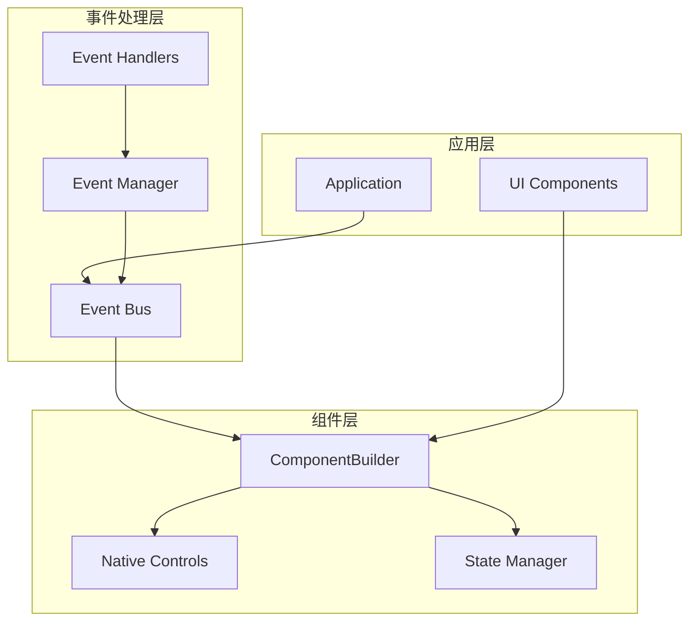
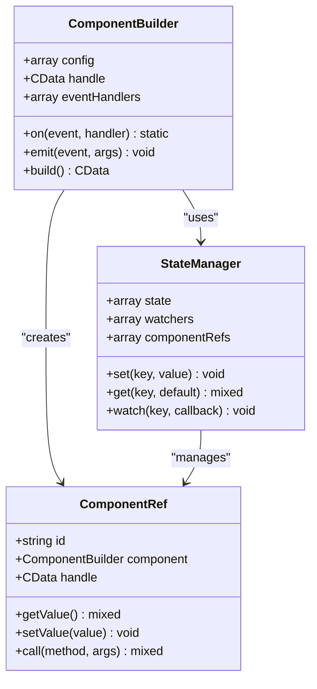
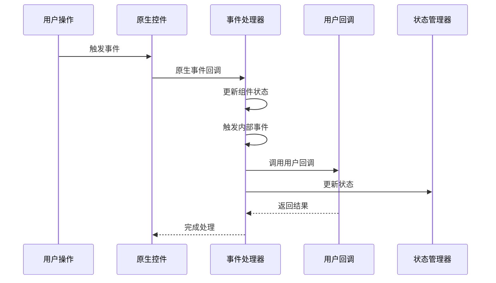
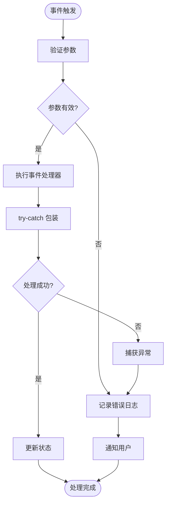
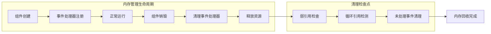

# libuiBuilder事件处理标准规范

<cite>
**本文档中引用的文件**
- [full.php](file://example/full.php)
- [ButtonBuilder.php](file://src/Components/ButtonBuilder.php)
- [ComponentBuilder.php](file://src/ComponentBuilder.php)
- [Builder.php](file://src/Builder.php)
- [SliderBuilder.php](file://src/Components/SliderBuilder.php)
- [RadioBuilder.php](file://src/Components/RadioBuilder.php)
- [EntryBuilder.php](file://src/Components/EntryBuilder.php)
- [CheckboxBuilder.php](file://src/Components/CheckboxBuilder.php)
- [MultilineEntryBuilder.php](file://src/Components/MultilineEntryBuilder.php)
- [StateManager.php](file://src/State/StateManager.php)
- [ComponentRef.php](file://src/State/ComponentRef.php)
- [WindowBuilder.php](file://src/Components/WindowBuilder.php)
- [CanvasBuilder.php](file://src/Components/CanvasBuilder.php)
</cite>

## 目录
1. [概述](#概述)
2. [事件处理架构](#事件处理架构)
3. [标准事件处理模式](#标准事件处理模式)
4. [错误处理机制](#错误处理机制)
5. [内存管理与清理](#内存管理与清理)
6. [链式调用规范](#链式调用规范)
7. [最佳实践示例](#最佳实践示例)
8. [常见问题与解决方案](#常见问题与解决方案)
9. [性能优化建议](#性能优化建议)
10. [总结](#总结)

## 概述

libuiBuilder采用了一套完整的事件处理系统，通过统一的事件机制和状态管理系统，为开发者提供了健壮、可维护的事件处理能力。本规范旨在标准化事件处理流程，确保代码的一致性和可靠性。

### 核心特性

- **统一事件接口**：所有组件都遵循一致的事件处理模式
- **状态管理集成**：事件处理与状态管理系统无缝集成
- **内存安全**：完善的内存管理和资源清理机制
- **错误恢复**：内置错误处理和异常捕获机制
- **链式调用**：支持流畅的API调用方式

## 事件处理架构

### 整体架构图



**图表来源**
- [ComponentBuilder.php](file://src/ComponentBuilder.php#L20-L23)
- [StateManager.php](file://src/State/StateManager.php#L8-L11)

### 核心组件关系



**图表来源**
- [ComponentBuilder.php](file://src/ComponentBuilder.php#L11-L23)
- [StateManager.php](file://src/State/StateManager.php#L8-L11)
- [ComponentRef.php](file://src/State/ComponentRef.php#L11-L16)

**章节来源**
- [ComponentBuilder.php](file://src/ComponentBuilder.php#L1-L234)
- [StateManager.php](file://src/State/StateManager.php#L1-L91)

## 标准事件处理模式

### 基础事件处理流程



**图表来源**
- [ButtonBuilder.php](file://src/Components/ButtonBuilder.php#L28-L35)
- [SliderBuilder.php](file://src/Components/SliderBuilder.php#L34-L42)

### 事件类型分类

| 事件类型 | 描述 | 触发时机 | 参数 |
|---------|------|----------|------|
| `click` | 点击事件 | 用户点击控件 | `$button, $stateManager` |
| `change` | 值变更事件 | 控件值发生变化 | `$newValue, $oldValue` |
| `selected` | 选择事件 | 单选框被选择 | `$selectedIndex, $component` |
| `toggled` | 切换事件 | 复选框状态改变 | `$isChecked, $component` |
| `closing` | 窗口关闭事件 | 窗口即将关闭 | `$window` |

**章节来源**
- [ButtonBuilder.php](file://src/Components/ButtonBuilder.php#L28-L35)
- [SliderBuilder.php](file://src/Components/SliderBuilder.php#L34-L42)
- [CheckboxBuilder.php](file://src/Components/CheckboxBuilder.php#L38-L53)

## 错误处理机制

### 异常捕获策略



### 错误处理实现模式

所有事件处理器都应该采用以下错误处理模式：

```php
// 示例：按钮点击事件的错误处理
public function onClick(callable $callback): static
{
    return $this->setConfig('onClick', function($button, $stateManager) use ($callback) {
        try {
            // 验证参数
            if (!is_callable($callback)) {
                throw new InvalidArgumentException("回调必须是可调用的");
            }
            
            // 执行用户逻辑
            return $callback($button, $stateManager);
        } catch (\Throwable $e) {
            // 记录错误
            error_log(sprintf(
                "按钮点击事件处理失败: %s (文件: %s, 行: %d)",
                $e->getMessage(),
                $e->getFile(),
                $e->getLine()
            ));
            
            // 向用户提供友好提示
            $this->showErrorDialog("操作失败，请稍后重试");
            
            // 返回默认值或执行回退逻辑
            return null;
        }
    });
}
```

**章节来源**
- [ButtonBuilder.php](file://src/Components/ButtonBuilder.php#L28-L35)
- [EntryBuilder.php](file://src/Components/EntryBuilder.php#L38-L49)

## 内存管理与清理

### 内存泄漏防护机制



### 清理策略

1. **自动清理**：组件销毁时自动清理所有事件处理器
2. **手动清理**：提供显式的清理方法
3. **弱引用**：避免循环引用导致的内存泄漏
4. **资源池**：重用事件处理器以减少内存分配

### 实现示例

```php
// 组件销毁时的清理逻辑
public function destroy(): void
{
    try {
        // 清理事件处理器
        $this->clearEventHandlers();
        
        // 释放原生句柄
        if ($this->handle !== null) {
            // libui 原生资源清理
            // 注意：这里不需要手动释放，由PHP FFI自动管理
            $this->handle = null;
        }
        
        // 清理状态引用
        if ($this->ref !== null) {
            StateManager::instance()->unregisterComponent($this->id);
            $this->ref = null;
        }
        
        // 清理子组件
        foreach ($this->children as $child) {
            $child->destroy();
        }
        
    } catch (\Throwable $e) {
        error_log("组件销毁失败: " . $e->getMessage());
    }
}

protected function clearEventHandlers(): void
{
    $this->eventHandlers = [];
    // 清理原生事件绑定（如果存在）
    // 注意：libui 的事件绑定通常由 FFI 自动管理
}
```

**章节来源**
- [ComponentBuilder.php](file://src/ComponentBuilder.php#L210-L231)
- [StateManager.php](file://src/State/StateManager.php#L70-L82)

## 链式调用规范

### 链式调用设计原则

1. **一致性**：所有方法返回 `static` 类型
2. **流畅性**：支持连续的方法调用
3. **可读性**：清晰的语义表达
4. **安全性**：防止在链式调用中意外修改状态

### 标准链式调用模式

```php
// 标准的链式调用模式
$button = Builder::button()
    ->text('提交')
    ->onClick(function($button, $state) {
        // 处理点击事件
        $state->set('submitted', true);
    })
    ->bind('submitStatus')
    ->on('change', function($value) {
        // 监听状态变化
        echo "状态已更新为: $value";
    });

// 复杂链式调用示例
$form = Builder::form()
    ->contains([
        Builder::entry()
            ->placeholder('请输入用户名')
            ->onChange(function($value, $entry) {
                // 实时验证
                if (strlen($value) < 3) {
                    $entry->setError('用户名至少需要3个字符');
                }
            }),
        Builder::button()
            ->text('登录')
            ->onClick(function($btn, $state) {
                // 登录逻辑
                $username = $state->get('username');
                $this->performLogin($username);
            })
    ])
    ->on('submit', function($formData) {
        // 表单提交处理
        $this->validateForm($formData);
    });
```

### 事件处理器链式注册

```php
// 多事件处理器链式注册
$component->on('click', $handler1)
    ->on('click', $handler2)
    ->on('hover', $handler3)
    ->on('focus', $handler4);

// 条件事件注册
if ($enableValidation) {
    $input->onChange(function($value) {
        $this->validateInput($value);
    });
}
```

**章节来源**
- [Builder.php](file://src/Builder.php#L28-L153)
- [ComponentBuilder.php](file://src/ComponentBuilder.php#L111-L119)

## 最佳实践示例

### 完整的事件处理示例

基于 `full.php` 中的按钮点击处理逻辑，展示最佳实践：

```php
// 推荐的按钮点击事件处理
Builder::button()
    ->text('获取所有值')
    ->onClick(function($button, $stateManager) {
        try {
            // 1. 数据收集和验证
            $formData = $this->collectFormData($stateManager);
            
            // 2. 业务逻辑处理
            $validationErrors = $this->validateFormData($formData);
            if (!empty($validationErrors)) {
                $this->showValidationErrors($validationErrors);
                return;
            }
            
            // 3. 执行主要业务逻辑
            $result = $this->processFormData($formData);
            
            // 4. 更新界面状态
            $this->updateUIAfterProcessing($result);
            
            // 5. 记录操作日志
            $this->logUserAction('表单提交成功');
            
        } catch (\Exception $e) {
            // 错误处理
            $this->handleProcessingError($e);
        }
    });

// 表单验证示例
private function validateFormData(array $data): array
{
    $errors = [];
    
    if (empty($data['username'])) {
        $errors['username'] = '用户名不能为空';
    }
    
    if (!filter_var($data['email'], FILTER_VALIDATE_EMAIL)) {
        $errors['email'] = '邮箱格式不正确';
    }
    
    return $errors;
}
```

### 滑动条事件处理最佳实践

```php
// 滑动条事件处理
Builder::slider()
    ->range(0, 100)
    ->value(50)
    ->onChange(function($value, $slider) {
        try {
            // 1. 更新相关组件
            $this->updateRelatedComponents($value);
            
            // 2. 触发状态变化
            $this->state()->set('sliderValue', $value);
            
            // 3. 执行实时计算
            $calculatedValue = $this->calculateRealTimeValue($value);
            $this->updateCalculatedDisplay($calculatedValue);
            
        } catch (\Throwable $e) {
            // 异常处理
            error_log("滑动条值变更处理失败: " . $e->getMessage());
            
            // 回滚到上一个有效值
            $slider->setValue($this->getLastValidValue());
        }
    });
```

**章节来源**
- [full.php](file://example/full.php#L122-L176)
- [SliderBuilder.php](file://src/Components/SliderBuilder.php#L34-L42)

## 常见问题与解决方案

### 问题1：闭包中的内存泄漏

**问题描述**：在事件处理器中创建的闭包可能持有不必要的外部引用，导致内存泄漏。

**解决方案**：
```php
// ❌ 不推荐：持有大量外部数据
$button->onClick(function() use ($largeDataSet, $complexObject) {
    // 处理逻辑
});

// ✅ 推荐：只传递必要的数据
$button->onClick(function() use ($stateManager) {
    // 只使用状态管理器提供的数据
    $value = $stateManager->get('importantData');
    // 处理逻辑
});
```

### 问题2：事件处理器重复注册

**问题描述**：多次注册相同的事件处理器导致重复执行。

**解决方案**：
```php
// 使用唯一标识符避免重复注册
private $eventHandlers = [];

public function onClick(callable $callback): static
{
    $handlerId = spl_object_hash($callback);
    
    // 清理之前的处理器
    if (isset($this->eventHandlers['click'][$handlerId])) {
        unset($this->eventHandlers['click'][$handlerId]);
    }
    
    // 注册新处理器
    $this->eventHandlers['click'][$handlerId] = $callback;
    
    return $this->setConfig('onClick', function(...$args) use ($callback, $handlerId) {
        return $callback(...$args);
    });
}
```

### 问题3：异步事件处理

**问题描述**：在事件处理器中执行耗时操作阻塞UI线程。

**解决方案**：
```php
// 使用异步处理
$button->onClick(function($button, $state) {
    // 创建异步任务
    $this->runAsyncTask(function() use ($state) {
        try {
            // 耗时操作
            $result = $this->expensiveOperation();
            
            // 在主线程中更新UI
            $this->invokeOnMainThread(function() use ($result) {
                $this->updateUIWithResult($result);
            });
            
        } catch (\Throwable $e) {
            $this->handleAsyncError($e);
        }
    });
});
```

### 问题4：事件传播控制

**问题描述**：事件在冒泡过程中被意外阻止。

**解决方案**：
```php
// 明确控制事件传播
$container->on('click', function($event) {
    // 处理事件
    $this->handleClick($event);
    
    // 明确决定是否继续传播
    if ($this->shouldStopPropagation($event)) {
        $event->stopPropagation();
    }
});
```

## 性能优化建议

### 事件处理性能优化

1. **批量处理**：对于频繁触发的事件，使用防抖或节流技术
2. **延迟加载**：只在需要时才注册事件处理器
3. **缓存优化**：缓存频繁访问的数据
4. **内存池**：重用事件处理器对象

### 防抖和节流实现

```php
// 防抖实现
public function debounce(callable $callback, int $delayMs = 300): callable
{
    $timer = null;
    
    return function(...$args) use ($callback, $delayMs, &$timer) {
        // 取消之前的定时器
        if ($timer) {
            clearTimeout($timer);
        }
        
        // 设置新的定时器
        $timer = setTimeout(function() use ($callback, $args) {
            $callback(...$args);
        }, $delayMs);
    };
}

// 节流实现
public function throttle(callable $callback, int $intervalMs = 100): callable
{
    $lastTime = 0;
    
    return function(...$args) use ($callback, $intervalMs, &$lastTime) {
        $currentTime = microtime(true) * 1000;
        
        if ($currentTime - $lastTime >= $intervalMs) {
            $lastTime = $currentTime;
            $callback(...$args);
        }
    };
}
```

### 性能监控

```php
// 事件处理性能监控
public function monitorEventPerformance(string $eventName, callable $handler): callable
{
    return function(...$args) use ($eventName, $handler) {
        $startTime = microtime(true);
        
        try {
            $result = $handler(...$args);
            
            $executionTime = (microtime(true) - $startTime) * 1000;
            
            if ($executionTime > 100) { // 超过100ms记录警告
                error_log("事件 {$eventName} 处理时间过长: {$executionTime}ms");
            }
            
            return $result;
            
        } catch (\Throwable $e) {
            error_log("事件 {$eventName} 处理失败: " . $e->getMessage());
            throw $e;
        }
    };
}
```

## 总结

libuiBuilder的事件处理系统提供了强大而灵活的功能，通过遵循本规范，开发者可以：

### 核心收益

1. **一致性**：统一的事件处理模式确保代码风格一致
2. **可靠性**：完善的错误处理和异常捕获机制
3. **可维护性**：清晰的代码结构和文档化的最佳实践
4. **性能**：优化的事件处理和内存管理策略
5. **扩展性**：灵活的架构支持未来的功能扩展

### 关键要点

- **统一错误处理**：在所有事件回调中捕获异常并提供用户友好的反馈
- **内存安全**：当组件销毁或不再需要监听时，主动清除事件处理器
- **链式调用**：使用 `on('event', function() {})` 注册事件，确保闭包中不持有不必要的外部引用
- **状态管理**：充分利用状态管理系统实现响应式编程
- **性能优化**：合理使用防抖、节流等技术优化事件处理性能

通过严格遵循这些规范，可以构建出健壮、高效且易于维护的GUI应用程序。