# libuiBuilder代码组织最佳实践

<cite>
**本文档中引用的文件**
- [simple.php](file://example/simple.php)
- [full.php](file://example/full.php)
- [Builder.php](file://src/Builder.php)
- [ComponentBuilder.php](file://src/ComponentBuilder.php)
- [WindowBuilder.php](file://src/Components/WindowBuilder.php)
- [BoxBuilder.php](file://src/Components/BoxBuilder.php)
- [GridBuilder.php](file://src/Components/GridBuilder.php)
- [ButtonBuilder.php](file://src/Components/ButtonBuilder.php)
- [LabelBuilder.php](file://src/Components/LabelBuilder.php)
- [StateManager.php](file://src/State/StateManager.php)
- [ComponentRef.php](file://src/State/ComponentRef.php)
- [FormTemplate.php](file://src/Templates/FormTemplate.php)
- [ResponsiveGridBuilder.php](file://src/ResponsiveGridBuilder.php)
- [FormValidator.php](file://src/Validation/FormValidator.php)
</cite>

## 目录
1. [概述](#概述)
2. [项目架构分析](#项目架构分析)
3. [功能模块化构建](#功能模块化构建)
4. [ID命名规范](#id命名规范)
5. [UI树构建最佳实践](#ui树构建最佳实践)
6. [视图与逻辑分离](#视图与逻辑分离)
7. [组件封装策略](#组件封装策略)
8. [状态管理最佳实践](#状态管理最佳实践)
9. [模板与复用机制](#模板与复用机制)
10. [性能优化考虑](#性能优化考虑)
11. [总结](#总结)

## 概述

libuiBuilder是一个基于PHP的GUI应用程序构建框架，采用声明式的UI构建方式。其核心设计理念是通过Builder模式实现高度模块化的代码组织，支持清晰的视图与逻辑分离，以及灵活的组件复用机制。

## 项目架构分析

libuiBuilder采用了分层架构设计，主要包含以下核心层次：

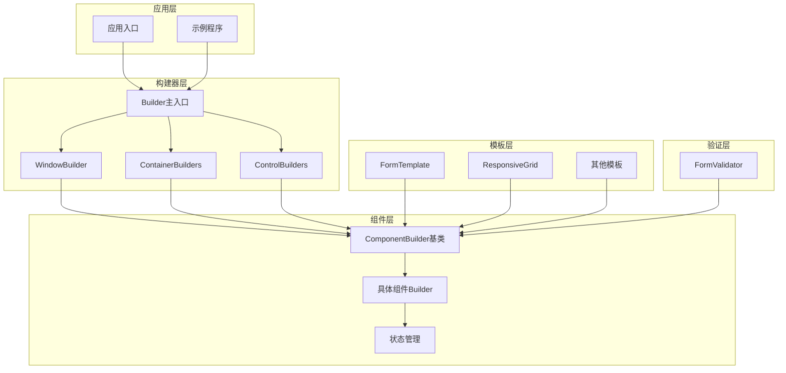

**图表来源**
- [Builder.php](file://src/Builder.php#L1-L153)
- [ComponentBuilder.php](file://src/ComponentBuilder.php#L1-L234)

**章节来源**
- [Builder.php](file://src/Builder.php#L1-L153)
- [ComponentBuilder.php](file://src/ComponentBuilder.php#L1-L234)

## 功能模块化构建

### 容器组件模块化

libuiBuilder提供了多种容器组件来支持不同的布局需求：

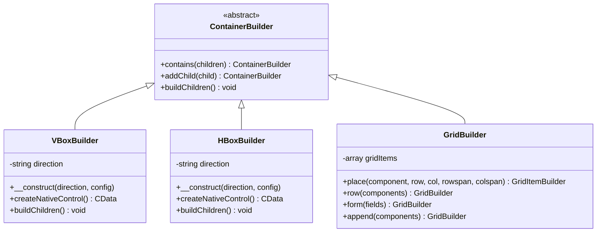

**图表来源**
- [BoxBuilder.php](file://src/Components/BoxBuilder.php#L1-L64)
- [GridBuilder.php](file://src/Components/GridBuilder.php#L1-L120)

### 表单模块化构建

通过GridBuilder的form方法，可以轻松构建标准化的表单布局：

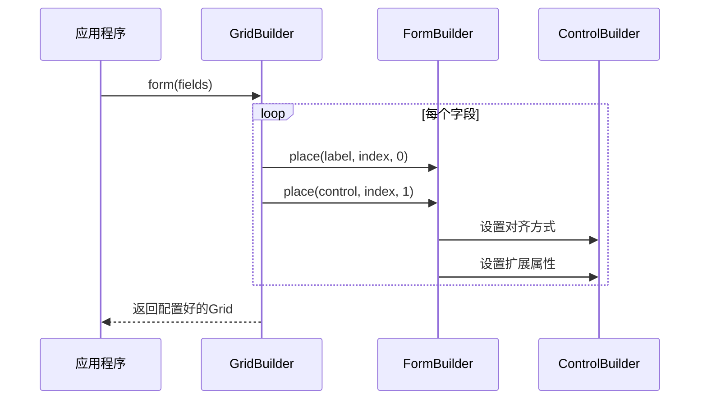

**图表来源**
- [GridBuilder.php](file://src/Components/GridBuilder.php#L80-L89)

**章节来源**
- [BoxBuilder.php](file://src/Components/BoxBuilder.php#L1-L64)
- [GridBuilder.php](file://src/Components/GridBuilder.php#L1-L120)

## ID命名规范

### 命名约定原则

libuiBuilder强烈推荐使用清晰、描述性的ID命名规范，以提高代码的可维护性和调试便利性：

| 组件类型 | 命名模式 | 示例 | 用途 |
|---------|---------|------|------|
| 表单控件 | `{fieldName}{ControlType}` | `nameEntry`, `passwordEntry` | 标识特定的输入字段 |
| 按钮 | `{action}{Target}` | `submitButton`, `cancelButton` | 表示触发的操作 |
| 标签 | `{context}Label` | `welcomeLabel`, `statusLabel` | 显示上下文信息 |
| 容器 | `{purpose}Container` | `formContainer`, `toolbarContainer` | 包装相关组件 |
| 状态标识 | `{stateName}` | `isLoggedIn`, `themeMode` | 状态管理键名 |

### 实践示例

在simple.php示例中展示了良好的命名实践：

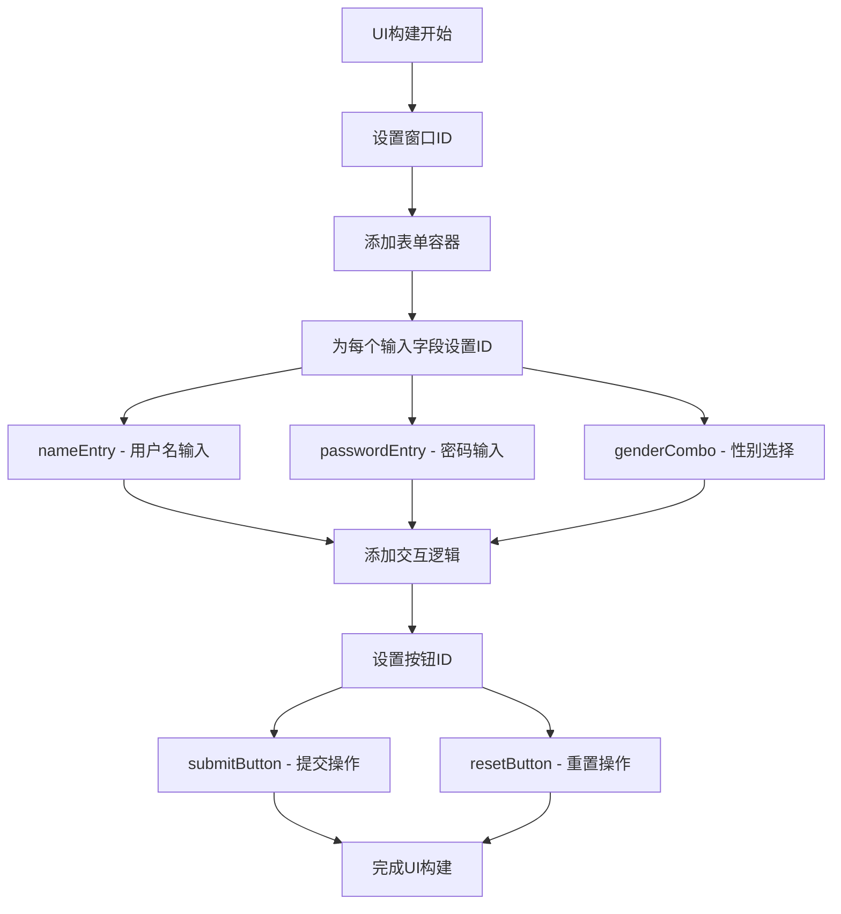

**图表来源**
- [simple.php](file://example/simple.php#L11-L141)

**章节来源**
- [simple.php](file://example/simple.php#L11-L141)

## UI树构建最佳实践

### 层次化结构设计

推荐使用Builder::window()->contains()构建层次分明的界面结构：

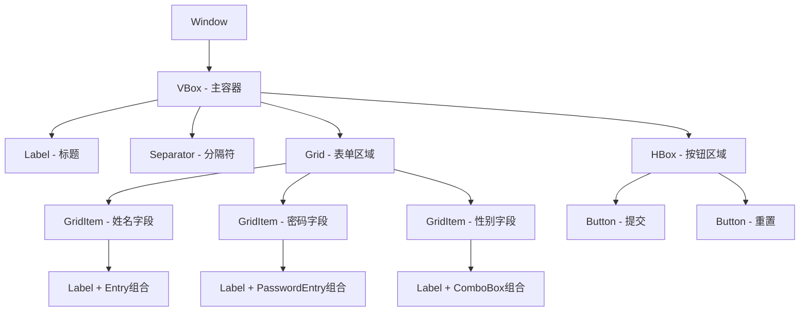

**图表来源**
- [simple.php](file://example/simple.php#L11-L141)

### 响应式布局策略

使用ResponsiveGridBuilder实现自适应布局：

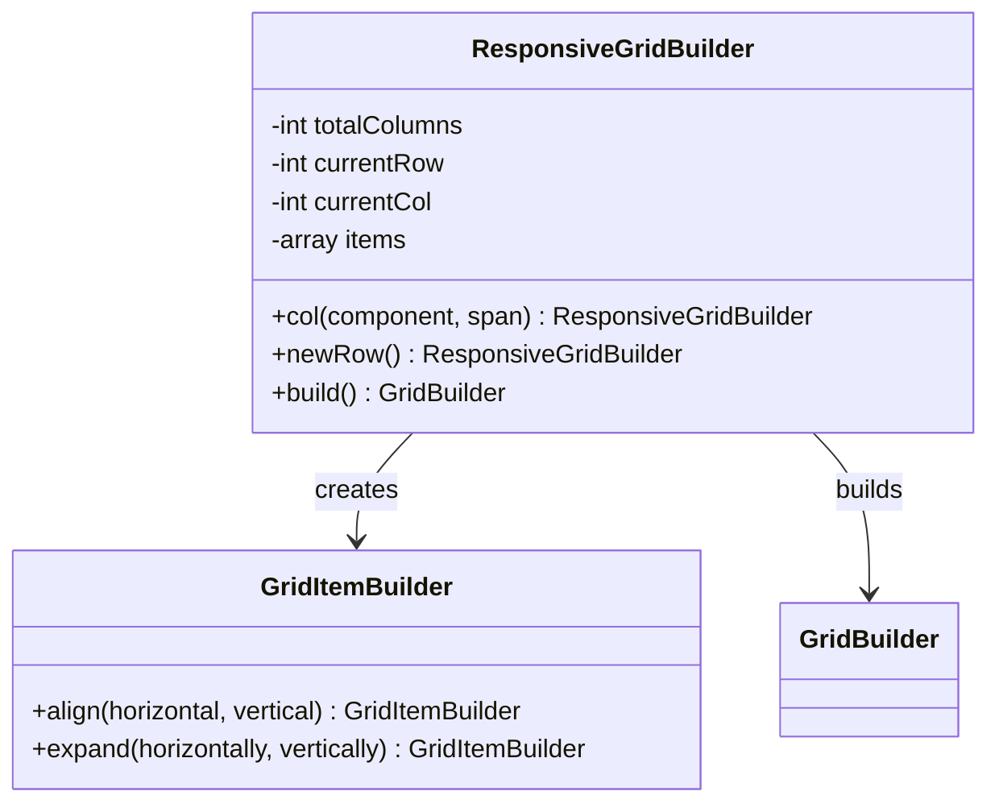

**图表来源**
- [ResponsiveGridBuilder.php](file://src/ResponsiveGridBuilder.php#L1-L82)

**章节来源**
- [simple.php](file://example/simple.php#L11-L141)
- [ResponsiveGridBuilder.php](file://src/ResponsiveGridBuilder.php#L1-L82)

## 视图与逻辑分离

### 状态管理分离

libuiBuilder通过StateManager实现视图与业务逻辑的完全分离：

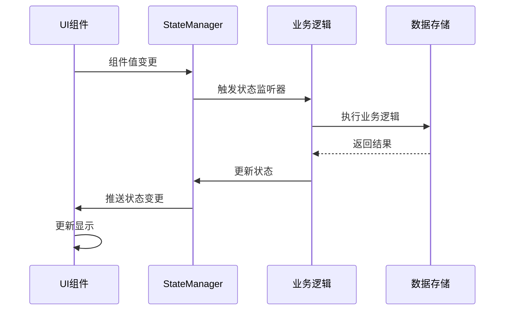

**图表来源**
- [StateManager.php](file://src/State/StateManager.php#L1-L91)
- [ComponentBuilder.php](file://src/ComponentBuilder.php#L140-L175)

### 事件处理分离

通过事件驱动的方式实现逻辑分离：

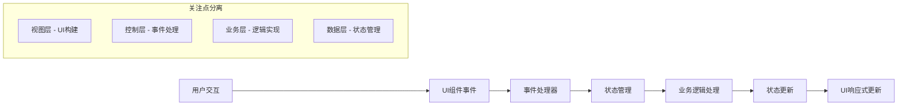

**图表来源**
- [ComponentBuilder.php](file://src/ComponentBuilder.php#L114-L175)

**章节来源**
- [StateManager.php](file://src/State/StateManager.php#L1-L91)
- [ComponentBuilder.php](file://src/ComponentBuilder.php#L114-L175)

## 组件封装策略

### 组件继承体系

libuiBuilder采用统一的ComponentBuilder基类作为所有组件的抽象：

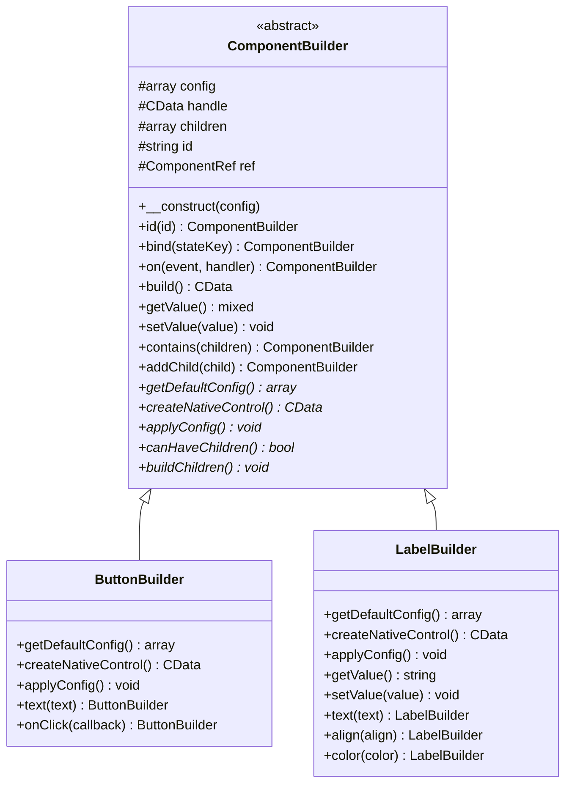

**图表来源**
- [ComponentBuilder.php](file://src/ComponentBuilder.php#L1-L234)
- [ButtonBuilder.php](file://src/Components/ButtonBuilder.php#L1-L48)
- [LabelBuilder.php](file://src/Components/LabelBuilder.php#L1-L62)

### 组件复用机制

通过模板系统实现组件复用：

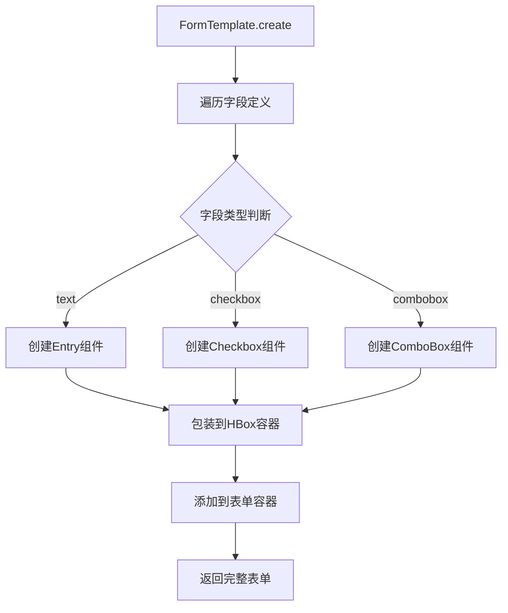

**图表来源**
- [FormTemplate.php](file://src/Templates/FormTemplate.php#L1-L46)

**章节来源**
- [ComponentBuilder.php](file://src/ComponentBuilder.php#L1-L234)
- [ButtonBuilder.php](file://src/Components/ButtonBuilder.php#L1-L48)
- [LabelBuilder.php](file://src/Components/LabelBuilder.php#L1-L62)
- [FormTemplate.php](file://src/Templates/FormTemplate.php#L1-L46)

## 状态管理最佳实践

### 状态管理模式

libuiBuilder提供两种状态管理模式：

| 模式 | 适用场景 | 实现方式 | 优势 |
|------|---------|---------|------|
| 绑定模式 | 表单控件同步 | `bind('stateKey')` | 自动双向同步 |
| 手动模式 | 复杂业务逻辑 | `StateManager::instance()` | 完全控制权 |
| 事件模式 | 交互响应 | `on('change', callback)` | 响应式更新 |

### 状态监听机制

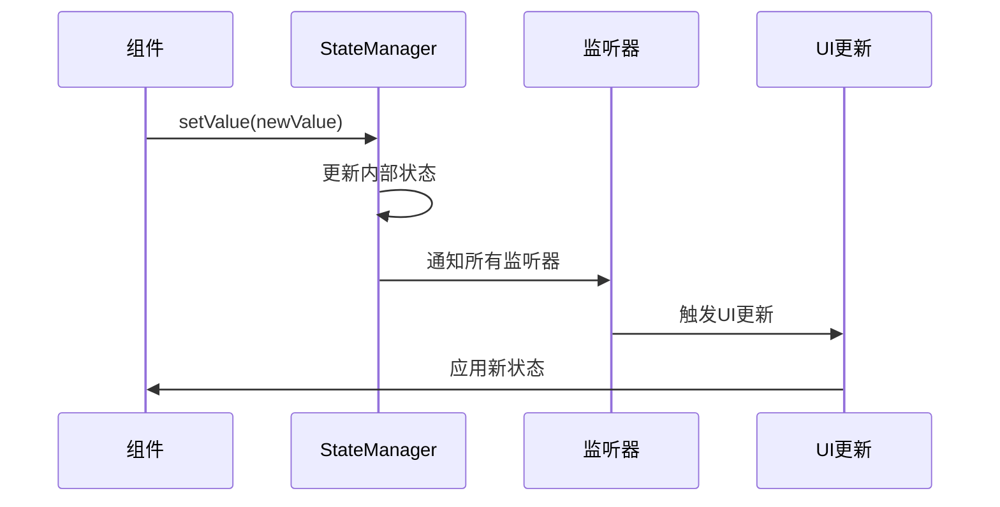

**图表来源**
- [StateManager.php](file://src/State/StateManager.php#L26-L36)

**章节来源**
- [StateManager.php](file://src/State/StateManager.php#L1-L91)
- [ComponentRef.php](file://src/State/ComponentRef.php#L1-L74)

## 模板与复用机制

### 表单模板系统

FormTemplate提供了标准化的表单构建能力：

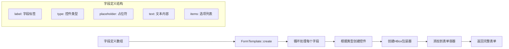

**图表来源**
- [FormTemplate.php](file://src/Templates/FormTemplate.php#L11-L46)

### 响应式网格模板

ResponsiveGridBuilder实现了灵活的网格布局：

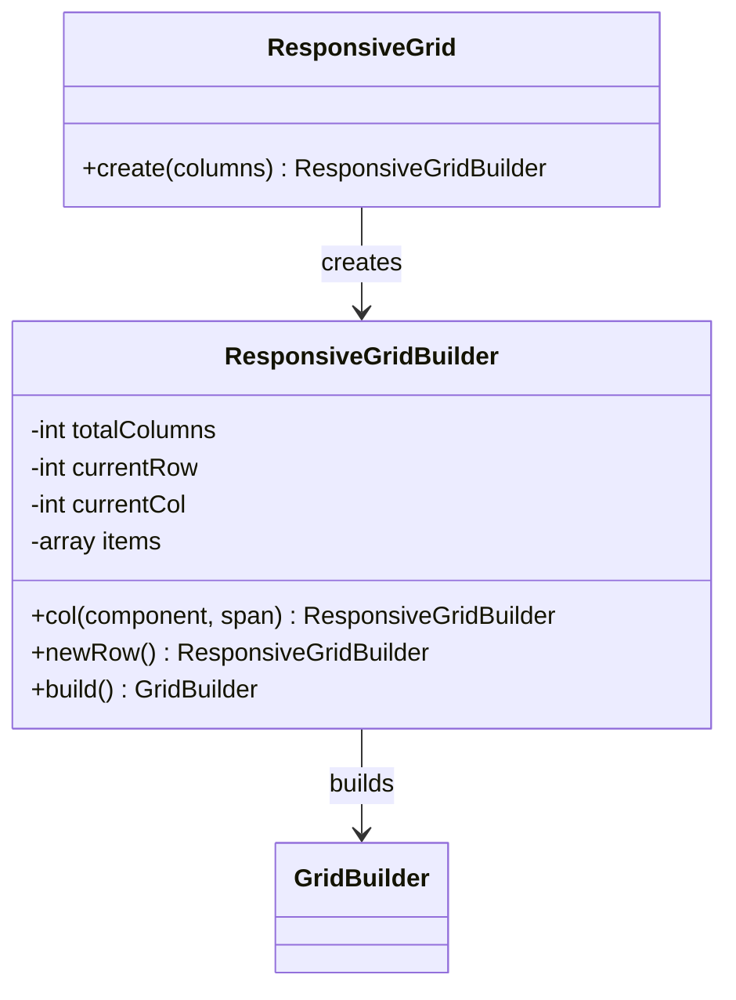

**图表来源**
- [ResponsiveGrid.php](file://src/Templates/ResponsiveGrid.php#L1-L14)
- [ResponsiveGridBuilder.php](file://src/ResponsiveGridBuilder.php#L1-L82)

**章节来源**
- [FormTemplate.php](file://src/Templates/FormTemplate.php#L1-L46)
- [ResponsiveGrid.php](file://src/Templates/ResponsiveGrid.php#L1-L14)
- [ResponsiveGridBuilder.php](file://src/ResponsiveGridBuilder.php#L1-L82)

## 性能优化考虑

### 延迟加载策略

libuiBuilder采用延迟构建模式，只有在需要时才创建原生控件：

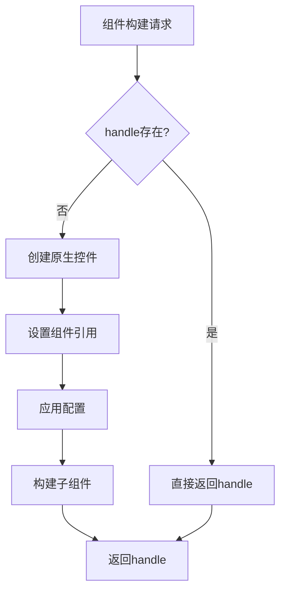

**图表来源**
- [ComponentBuilder.php](file://src/ComponentBuilder.php#L209-L231)

### 内存管理

通过ComponentRef提供组件引用管理，避免内存泄漏：

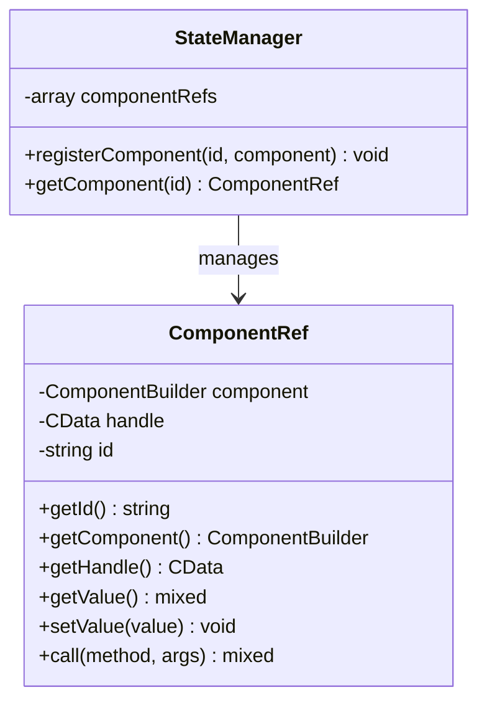

**图表来源**
- [ComponentRef.php](file://src/State/ComponentRef.php#L1-L74)

**章节来源**
- [ComponentBuilder.php](file://src/ComponentBuilder.php#L209-L231)
- [ComponentRef.php](file://src/State/ComponentRef.php#L1-L74)

## 总结

libuiBuilder的代码组织最佳实践体现了现代软件开发的设计原则：

### 核心原则

1. **模块化设计**：通过Builder模式实现功能模块的清晰分离
2. **关注点分离**：严格区分视图、状态管理和业务逻辑
3. **可复用性**：提供丰富的模板和组件复用机制
4. **可维护性**：采用清晰的命名规范和层次化结构
5. **性能优化**：延迟加载和智能内存管理

### 实践建议

- **合理使用容器组件**：根据布局需求选择VBox、HBox或Grid
- **遵循命名规范**：使用描述性的ID便于维护和调试
- **分离视图与逻辑**：通过状态管理实现响应式更新
- **充分利用模板**：使用FormTemplate等内置模板提高开发效率
- **注意性能考虑**：合理使用延迟加载和组件缓存

通过遵循这些最佳实践，开发者可以构建出结构清晰、易于维护且性能优良的GUI应用程序。