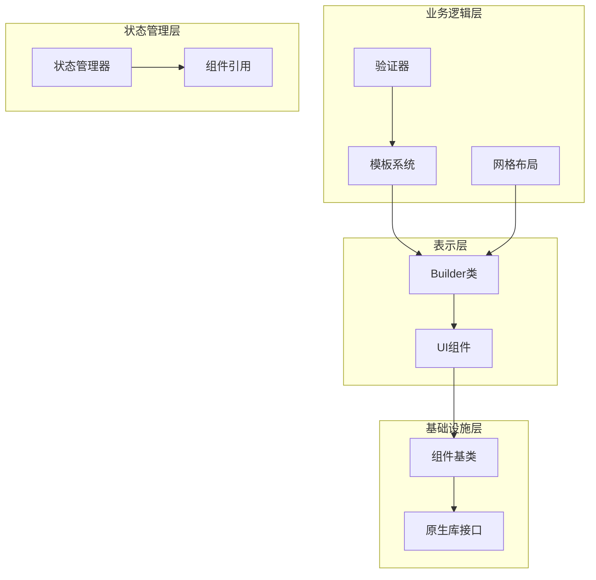
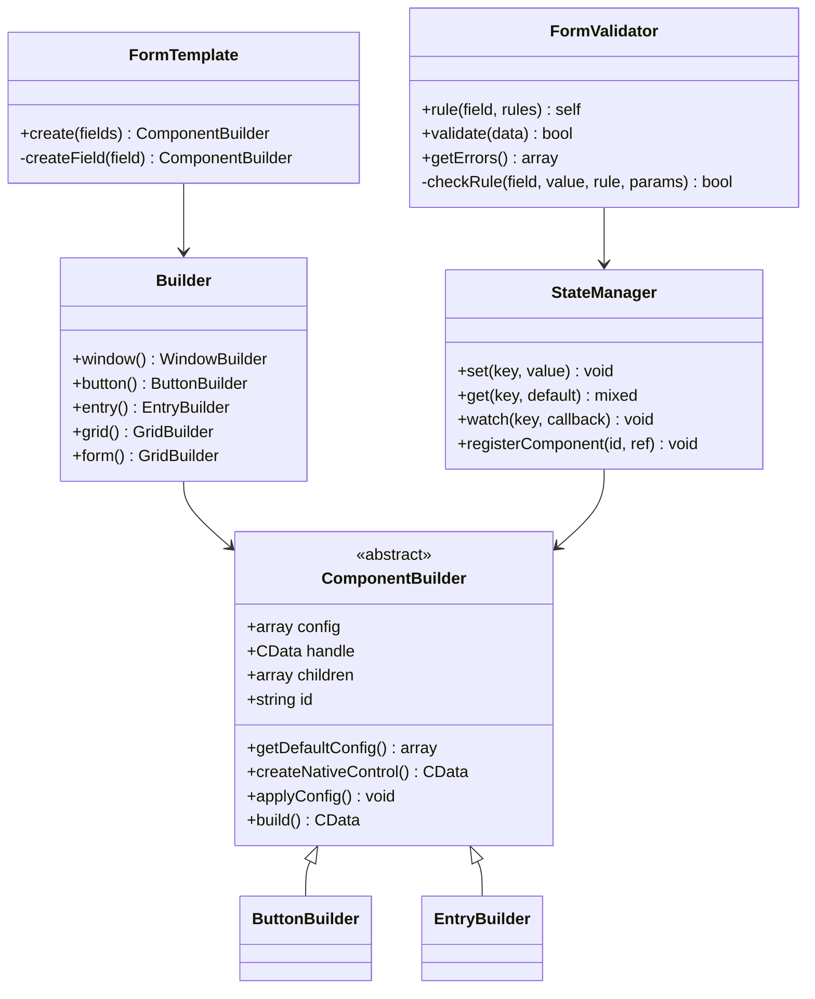
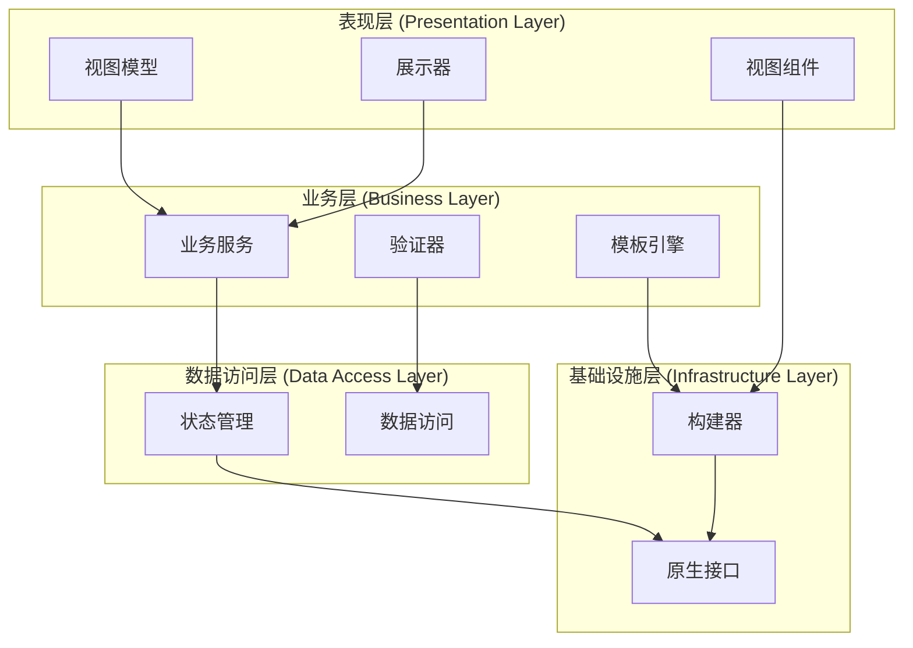
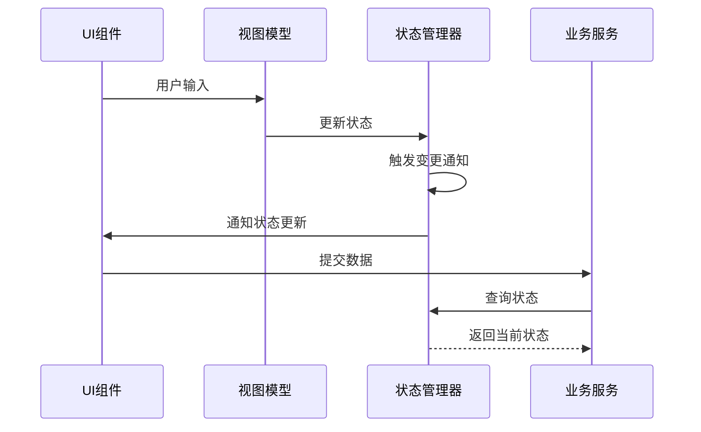
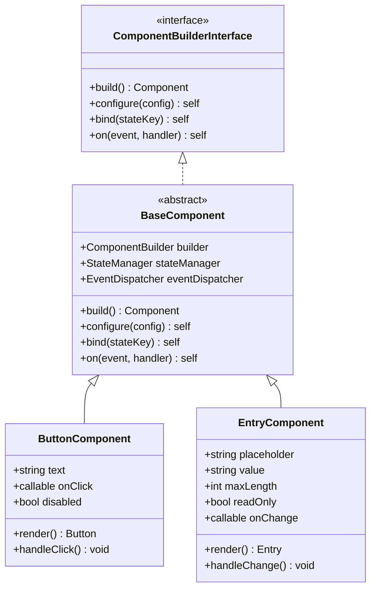
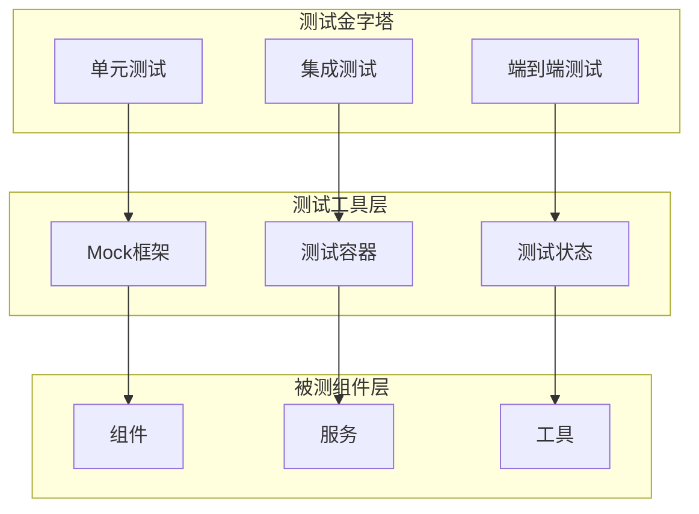

# libuiBuilder项目可维护性改进建议

<cite>
**本文档引用的文件**
- [simple.php](file://example/simple.php)
- [full.php](file://example/full.php)
- [FormTemplate.php](file://src/Templates/FormTemplate.php)
- [FormValidator.php](file://src/Validation/FormValidator.php)
- [ButtonBuilder.php](file://src/Components/ButtonBuilder.php)
- [EntryBuilder.php](file://src/Components/EntryBuilder.php)
- [Builder.php](file://src/Builder.php)
- [ComponentBuilder.php](file://src/ComponentBuilder.php)
- [StateManager.php](file://src/State/StateManager.php)
- [ResponsiveGrid.php](file://src/Templates/ResponsiveGrid.php)
- [ResponsiveGridBuilder.php](file://src/ResponsiveGridBuilder.php)
- [GridBuilder.php](file://src/Components/GridBuilder.php)
- [composer.json](file://composer.json)
</cite>

## 目录
1. [项目概述](#项目概述)
2. [当前架构分析](#当前架构分析)
3. [可维护性问题识别](#可维护性问题识别)
4. [分层架构改进建议](#分层架构改进建议)
5. [模板化设计优化](#模板化设计优化)
6. [状态管理重构](#状态管理重构)
7. [组件构建器改进](#组件构建器改进)
8. [测试友好性提升](#测试友好性提升)
9. [最佳实践总结](#最佳实践总结)

## 项目概述

libuiBuilder是一个基于PHP的GUI应用程序构建框架，提供了声明式的界面构建方式。项目采用Builder模式，通过链式调用创建复杂的用户界面，支持多种控件类型和布局管理。

**章节来源**
- [composer.json](file://composer.json#L1-L35)
- [Builder.php](file://src/Builder.php#L1-L153)

## 当前架构分析

### 整体架构概览



**图表来源**
- [Builder.php](file://src/Builder.php#L27-L153)
- [ComponentBuilder.php](file://src/ComponentBuilder.php#L11-L234)
- [StateManager.php](file://src/State/StateManager.php#L8-L91)

### 核心组件关系



**图表来源**
- [ComponentBuilder.php](file://src/ComponentBuilder.php#L11-L234)
- [Builder.php](file://src/Builder.php#L27-L153)
- [StateManager.php](file://src/State/StateManager.php#L8-L91)
- [FormTemplate.php](file://src/Templates/FormTemplate.php#L9-L46)
- [FormValidator.php](file://src/Validation/FormValidator.php#L3-L78)

**章节来源**
- [ComponentBuilder.php](file://src/ComponentBuilder.php#L1-L234)
- [Builder.php](file://src/Builder.php#L1-L153)
- [StateManager.php](file://src/State/StateManager.php#L1-L91)

## 可维护性问题识别

### 主要问题分类

1. **代码耦合度过高**
   - UI构建逻辑与业务逻辑混合
   - 组件间依赖关系复杂
   - 缺乏清晰的职责分离

2. **重复代码严重**
   - 表单字段创建模式重复
   - 验证规则定义分散
   - 布局配置重复

3. **缺乏统一的模板机制**
   - 不同类型的表单需要手动重复构建
   - 缺少可复用的布局模板

4. **测试困难**
   - 复杂的链式调用难以测试
   - 状态管理器全局单例模式
   - 缺少单元测试友好的接口

**章节来源**
- [simple.php](file://example/simple.php#L1-L142)
- [full.php](file://example/full.php#L1-L180)

## 分层架构改进建议

### 推荐的分层架构



### 实现建议

#### 1. 视图模型层分离

```php
// 建议的视图模型结构
class UserFormViewModel {
    private array $formData;
    private array $validationRules;
    
    public function getFieldDefinitions(): array {
        return [
            'name' => [
                'type' => 'text',
                'label' => '姓名',
                'placeholder' => '请输入姓名',
                'rules' => ['required', 'min_length:2']
            ],
            'email' => [
                'type' => 'text',
                'label' => '邮箱',
                'placeholder' => '请输入邮箱',
                'rules' => ['required', 'email']
            ]
        ];
    }
}
```

#### 2. 业务服务层封装

```php
// 业务服务示例
class UserService {
    private FormValidator $validator;
    
    public function createUser(array $userData): bool {
        if (!$this->validateUserData($userData)) {
            return false;
        }
        
        // 业务逻辑处理
        return $this->userRepository->create($userData);
    }
    
    private function validateUserData(array $data): bool {
        return $this->validator->rule('name', ['required' => true])
            ->rule('email', ['required' => true, 'email' => true])
            ->validate($data);
    }
}
```

**章节来源**
- [FormValidator.php](file://src/Validation/FormValidator.php#L1-L78)
- [StateManager.php](file://src/State/StateManager.php#L1-L91)

## 模板化设计优化

### FormTemplate改进方案

当前的FormTemplate虽然提供了基本的模板功能，但存在以下局限：

1. **类型支持有限**：仅支持text、checkbox、combobox三种类型
2. **配置灵活性不足**：无法动态调整字段属性
3. **验证规则缺失**：没有内置验证支持

#### 改进后的FormTemplate设计

```php
class EnhancedFormTemplate {
    public static function create(array $fields, array $options = []): ComponentBuilder {
        $formItems = [];
        $validationRules = [];
        
        foreach ($fields as $fieldName => $fieldConfig) {
            // 创建字段
            $field = self::createField($fieldName, $fieldConfig);
            
            // 添加验证规则
            if (isset($fieldConfig['rules'])) {
                $validationRules[$fieldName] = $fieldConfig['rules'];
            }
            
            // 创建表单项
            $formItems[] = self::createFormRow($fieldConfig, $field);
        }
        
        // 返回带验证功能的表单
        return self::createValidatedForm($formItems, $validationRules);
    }
    
    private static function createValidatedForm(array $formItems, array $rules): ComponentBuilder {
        $form = Builder::vbox()->contains($formItems);
        
        // 添加验证状态显示
        $form->on('validation', function($isValid, $errors) {
            // 更新UI状态
        });
        
        return $form;
    }
}
```

### 响应式网格模板

```php
class ResponsiveGridLayout {
    public static function create(array $layoutConfig): ResponsiveGridBuilder {
        $grid = ResponsiveGrid::create($layoutConfig['columns'] ?? 12);
        
        foreach ($layoutConfig['rows'] as $rowIndex => $rowConfig) {
            foreach ($rowConfig['columns'] as $colIndex => $colConfig) {
                $component = self::createComponent($colConfig);
                $grid->col($component, $colConfig['span'] ?? 1);
                
                // 添加响应式断点支持
                if (isset($colConfig['breakpoints'])) {
                    $grid->addBreakpoint($rowIndex, $colIndex, $colConfig['breakpoints']);
                }
            }
            
            // 添加行间距
            if (isset($rowConfig['spacing'])) {
                $grid->newRow()->spacing($rowConfig['spacing']);
            }
        }
        
        return $grid;
    }
}
```

**章节来源**
- [FormTemplate.php](file://src/Templates/FormTemplate.php#L1-L46)
- [ResponsiveGrid.php](file://src/Templates/ResponsiveGrid.php#L1-L14)
- [ResponsiveGridBuilder.php](file://src/ResponsiveGridBuilder.php#L1-L82)

## 状态管理重构

### 当前状态管理模式的问题

1. **全局单例模式**：难以测试和模拟
2. **紧耦合设计**：组件直接依赖全局状态
3. **缺乏类型安全**：状态键值对容易出错

### 改进的状态管理模式



**图表来源**
- [StateManager.php](file://src/State/StateManager.php#L8-L91)
- [ComponentBuilder.php](file://src/ComponentBuilder.php#L11-L234)

#### 状态管理器重构

```php
interface StateManagerInterface {
    public function setState(string $key, mixed $value): void;
    public function getState(string $key, mixed $defaultValue = null): mixed;
    public function watch(string $key, callable $callback): void;
    public function batchUpdate(array $updates): void;
    public function reset(): void;
}

class StateManager implements StateManagerInterface {
    private array $state = [];
    private array $watchers = [];
    
    public function setState(string $key, mixed $value): void {
        $oldValue = $this->state[$key] ?? null;
        $this->state[$key] = $value;
        
        // 通知所有监听器
        if (isset($this->watchers[$key])) {
            foreach ($this->watchers[$key] as $callback) {
                $callback($value, $oldValue, $key);
            }
        }
    }
    
    public function watch(string $key, callable $callback): void {
        $this->watchers[$key][] = $callback;
    }
    
    public function batchUpdate(array $updates): void {
        foreach ($updates as $key => $value) {
            $this->setState($key, $value);
        }
    }
}
```

#### 组件状态绑定改进

```php
abstract class ComponentBuilder {
    protected ?string $boundState = null;
    protected ?StateManagerInterface $stateManager = null;
    
    public function bindToState(string $stateKey, StateManagerInterface $manager = null): static {
        $this->boundState = $stateKey;
        $this->stateManager = $manager ?? StateManager::getInstance();
        
        // 初始化状态值
        $initialValue = $this->stateManager->getState($stateKey);
        if ($initialValue !== null) {
            $this->setValue($initialValue);
        }
        
        // 监听状态变化
        $this->stateManager->watch($stateKey, function($newValue) {
            $this->setValue($newValue);
        });
        
        return $this;
    }
    
    protected function notifyStateChange(): void {
        if ($this->boundState && $this->stateManager) {
            $this->stateManager->setState($this->boundState, $this->getValue());
        }
    }
}
```

**章节来源**
- [StateManager.php](file://src/State/StateManager.php#L1-L91)
- [ComponentBuilder.php](file://src/ComponentBuilder.php#L1-L234)

## 组件构建器改进

### 当前组件构建器的问题

1. **继承层次复杂**：大量重复的配置和事件处理逻辑
2. **扩展性差**：添加新功能需要修改基类
3. **测试困难**：依赖原生库和全局状态

### 改进的组件架构



**图表来源**
- [ComponentBuilder.php](file://src/ComponentBuilder.php#L11-L234)
- [ButtonBuilder.php](file://src/Components/ButtonBuilder.php#L1-L48)
- [EntryBuilder.php](file://src/Components/EntryBuilder.php#L1-L80)

#### 抽象工厂模式实现

```php
interface ComponentFactoryInterface {
    public function createButton(array $config = []): ButtonComponent;
    public function createEntry(array $config = []): EntryComponent;
    public function createGrid(array $config = []): GridComponent;
    public function createForm(array $config = []): FormComponent;
}

class ComponentFactory implements ComponentFactoryInterface {
    private StateManagerInterface $stateManager;
    
    public function __construct(StateManagerInterface $stateManager) {
        $this->stateManager = $stateManager;
    }
    
    public function createButton(array $config = []): ButtonComponent {
        return new ButtonComponent(
            $config['text'] ?? 'Button',
            $config['onClick'] ?? null,
            $this->stateManager
        );
    }
    
    public function createEntry(array $config = []): EntryComponent {
        return new EntryComponent(
            $config['placeholder'] ?? '',
            $config['maxLength'] ?? null,
            $config['readOnly'] ?? false,
            $config['onChange'] ?? null,
            $this->stateManager
        );
    }
}
```

#### 组件生命周期管理

```php
interface LifecycleAwareComponent {
    public function initialize(): void;
    public function render(): Component;
    public function destroy(): void;
    public function getState(): array;
    public function restoreState(array $state): void;
}

abstract class BaseLifecycleComponent implements LifecycleAwareComponent {
    protected bool $initialized = false;
    protected ?Component $nativeComponent = null;
    
    public function initialize(): void {
        if (!$this->initialized) {
            $this->setupComponent();
            $this->attachEventListeners();
            $this->initialized = true;
        }
    }
    
    public function destroy(): void {
        if ($this->initialized) {
            $this->detachEventListeners();
            $this->cleanupResources();
            $this->initialized = false;
        }
    }
    
    protected function setupComponent(): void {
        // 子类实现具体组件创建逻辑
    }
    
    protected function attachEventListeners(): void {
        // 子类实现事件监听器注册
    }
    
    protected function detachEventListeners(): void {
        // 子类实现事件监听器移除
    }
    
    protected function cleanupResources(): void {
        // 子类实现资源清理
    }
}
```

**章节来源**
- [ComponentBuilder.php](file://src/ComponentBuilder.php#L1-L234)
- [ButtonBuilder.php](file://src/Components/ButtonBuilder.php#L1-L48)
- [EntryBuilder.php](file://src/Components/EntryBuilder.php#L1-L80)

## 测试友好性提升

### 单元测试架构设计



### 组件测试策略

#### 1. 组件行为测试

```php
class ButtonComponentTest extends TestCase {
    private ButtonComponent $button;
    private MockInterface $mockStateManager;
    
    protected function setUp(): void {
        parent::setUp();
        $this->mockStateManager = $this->createMock(StateManagerInterface::class);
        $this->button = new ButtonComponent('Test Button', null, $this->mockStateManager);
    }
    
    public function testButtonClickEvent(): void {
        $clickHandlerCalled = false;
        $expectedValue = 'test-value';
        
        $this->button->on('click', function($value) use (&$clickHandlerCalled, $expectedValue) {
            $clickHandlerCalled = true;
            $this->assertEquals($expectedValue, $value);
        });
        
        // 模拟点击事件
        $this->button->simulateClick($expectedValue);
        
        $this->assertTrue($clickHandlerCalled);
    }
    
    public function testStateBinding(): void {
        $stateKey = 'buttonState';
        $initialValue = 'enabled';
        
        $this->mockStateManager->expects($this->once())
            ->method('getState')
            ->with($stateKey)
            ->willReturn($initialValue);
            
        $this->button->bindToState($stateKey, $this->mockStateManager);
        
        $this->assertEquals($initialValue, $this->button->getValue());
    }
}
```

#### 2. 状态管理器测试

```php
class StateManagerTest extends TestCase {
    private StateManager $stateManager;
    
    protected function setUp(): void {
        parent::setUp();
        $this->stateManager = new StateManager();
    }
    
    public function testStateSetAndGet(): void {
        $key = 'testKey';
        $value = 'testValue';
        
        $this->stateManager->setState($key, $value);
        $result = $this->stateManager->getState($key);
        
        $this->assertEquals($value, $result);
    }
    
    public function testStateWatch(): void {
        $key = 'testKey';
        $value = 'testValue';
        $callbackCalled = false;
        
        $this->stateManager->watch($key, function($newValue, $oldValue, $key) use (&$callbackCalled) {
            $callbackCalled = true;
            $this->assertEquals($value, $newValue);
            $this->assertNull($oldValue);
        });
        
        $this->stateManager->setState($key, $value);
        $this->assertTrue($callbackCalled);
    }
}
```

#### 3. 组件工厂测试

```php
class ComponentFactoryTest extends TestCase {
    private ComponentFactory $factory;
    private MockInterface $mockStateManager;
    
    protected function setUp(): void {
        parent::setUp();
        $this->mockStateManager = $this->createMock(StateManagerInterface::class);
        $this->factory = new ComponentFactory($this->mockStateManager);
    }
    
    public function testCreateButton(): void {
        $config = [
            'text' => 'Submit',
            'onClick' => function() { return true; }
        ];
        
        $button = $this->factory->createButton($config);
        
        $this->assertInstanceOf(ButtonComponent::class, $button);
        $this->assertEquals('Submit', $button->getText());
    }
    
    public function testCreateEntry(): void {
        $config = [
            'placeholder' => 'Enter text',
            'maxLength' => 100,
            'readOnly' => false
        ];
        
        $entry = $this->factory->createEntry($config);
        
        $this->assertInstanceOf(EntryComponent::class, $entry);
        $this->assertEquals('Enter text', $entry->getPlaceholder());
        $this->assertEquals(100, $entry->getMaxLength());
        $this->assertFalse($entry->isReadOnly());
    }
}
```

### 集成测试策略

```php
class FormIntegrationTest extends TestCase {
    private Application $app;
    private StateManager $stateManager;
    
    protected function setUp(): void {
        parent::setUp();
        $this->stateManager = StateManager::getInstance();
        $this->app = new Application();
    }
    
    public function testFullFormWorkflow(): void {
        // 创建表单
        $form = $this->createTestForm();
        
        // 显示表单
        $form->show();
        
        // 模拟用户输入
        $this->simulateUserInput();
        
        // 验证表单提交
        $this->assertFormDataIsValid();
        
        // 清理资源
        $form->destroy();
    }
    
    private function createTestForm(): FormComponent {
        return $this->factory->createForm([
            'fields' => [
                'name' => [
                    'type' => 'text',
                    'label' => 'Name',
                    'rules' => ['required', 'min_length:2']
                ],
                'email' => [
                    'type' => 'text',
                    'label' => 'Email',
                    'rules' => ['required', 'email']
                ]
            ]
        ]);
    }
    
    private function simulateUserInput(): void {
        // 模拟用户输入各种数据
        $this->stateManager->setState('name', 'John Doe');
        $this->stateManager->setState('email', 'john@example.com');
    }
    
    private function assertFormDataIsValid(): void {
        // 验证表单数据是否符合预期
        $this->assertEquals('John Doe', $this->stateManager->getState('name'));
        $this->assertEquals('john@example.com', $this->stateManager->getState('email'));
    }
}
```

**章节来源**
- [StateManager.php](file://src/State/StateManager.php#L1-L91)
- [ComponentBuilder.php](file://src/ComponentBuilder.php#L1-L234)

## 最佳实践总结

### 1. 代码组织原则

#### 文件结构优化
```
src/
├── Components/           # 组件实现
│   ├── Base/            # 基础组件
│   ├── Controls/        # 控件组件
│   └── Layout/          # 布局组件
├── Builders/            # 构建器
├── Templates/           # 模板系统
├── Validation/          # 验证系统
├── State/              # 状态管理
├── Services/           # 业务服务
└── Interfaces/         # 接口定义
```

#### 命名规范
- **组件类**：使用名词+Builder后缀，如`ButtonBuilder`
- **模板类**：使用名词，如`FormTemplate`
- **服务类**：使用名词+Service后缀，如`UserService`
- **验证器**：使用名词+Validator后缀，如`FormValidator`

### 2. 设计模式应用

#### Builder模式优化
```php
// 改进后的Builder模式实现
class FormBuilder {
    private array $fields = [];
    private array $validators = [];
    private array $layout = [];
    
    public function addTextField(string $name, array $config = []): self {
        $this->fields[$name] = array_merge([
            'type' => 'text',
            'label' => ucfirst($name),
            'placeholder' => "Enter {$name}"
        ], $config);
        
        return $this;
    }
    
    public function addValidator(string $field, string $rule, $params = null): self {
        $this->validators[$field][] = compact('rule', 'params');
        return $this;
    }
    
    public function setLayout(array $layout): self {
        $this->layout = $layout;
        return $this;
    }
    
    public function build(): FormComponent {
        return new FormComponent($this->fields, $this->validators, $this->layout);
    }
}
```

#### 观察者模式实现
```php
class EventDispatcher {
    private array $listeners = [];
    
    public function on(string $event, callable $listener): void {
        if (!isset($this->listeners[$event])) {
            $this->listeners[$event] = [];
        }
        $this->listeners[$event][] = $listener;
    }
    
    public function dispatch(string $event, ...$args): void {
        if (isset($this->listeners[$event])) {
            foreach ($this->listeners[$event] as $listener) {
                $listener(...$args);
            }
        }
    }
}
```

### 3. 性能优化建议

#### 组件缓存策略
```php
class ComponentCache {
    private static array $cache = [];
    
    public static function get(string $key, callable $creator): Component {
        if (!isset(self::$cache[$key])) {
            self::$cache[$key] = $creator();
        }
        return self::$cache[$key];
    }
    
    public static function clear(): void {
        self::$cache = [];
    }
}
```

#### 延迟加载机制
```php
class LazyComponentLoader {
    private array $components = [];
    
    public function register(string $name, callable $loader): void {
        $this->components[$name] = $loader;
    }
    
    public function load(string $name): Component {
        if (isset($this->components[$name])) {
            $loader = $this->components[$name];
            unset($this->components[$name]); // 防止重复加载
            return $loader();
        }
        throw new Exception("Component {$name} not registered");
    }
}
```

### 4. 错误处理和日志记录

#### 统一错误处理
```php
class ErrorHandler {
    public static function handleException(\Throwable $exception): void {
        // 记录错误日志
        self::logError($exception);
        
        // 显示用户友好的错误信息
        self::showUserMessage($exception);
        
        // 发送错误报告（可选）
        self::sendReport($exception);
    }
    
    private static function logError(\Throwable $exception): void {
        error_log(sprintf(
            "[%s] %s in %s:%d\n%s",
            get_class($exception),
            $exception->getMessage(),
            $exception->getFile(),
            $exception->getLine(),
            $exception->getTraceAsString()
        ));
    }
    
    private static function showUserMessage(\Throwable $exception): void {
        // 显示给用户的错误消息
        echo "An unexpected error occurred. Please try again later.";
    }
}
```

#### 日志记录系统
```php
class Logger {
    private string $logFile;
    private int $logLevel;
    
    public function __construct(string $logFile, int $logLevel = LogLevel::INFO) {
        $this->logFile = $logFile;
        $this->logLevel = $logLevel;
    }
    
    public function log(string $level, string $message, array $context = []): void {
        if ($this->shouldLog($level)) {
            $timestamp = date('Y-m-d H:i:s');
            $formattedMessage = sprintf(
                "[%s] %s: %s %s\n",
                $timestamp,
                strtoupper($level),
                $message,
                json_encode($context)
            );
            
            file_put_contents($this->logFile, $formattedMessage, FILE_APPEND);
        }
    }
    
    private function shouldLog(string $level): bool {
        return $this->logLevel >= constant("LogLevel::{$level}");
    }
}
```

### 5. 文档和注释标准

#### PHPDoc注释规范
```php
/**
 * 表单验证器类
 *
 * 该类提供表单字段的验证功能，支持多种验证规则。
 *
 * @package Kingbes\Libui\View\Validation
 * @author yangweijie <917647288@qq.com>
 * @version 1.0.0
 */
class FormValidator {
    /**
     * 添加验证规则
     *
     * @param string $field 字段名称
     * @param array $rules 验证规则数组
     * @return self
     *
     * @throws InvalidArgumentException 如果规则无效
     */
    public function rule(string $field, array $rules): self {
        // 实现细节...
    }
    
    /**
     * 验证数据
     *
     * @param array $data 要验证的数据
     * @return bool 验证是否通过
     */
    public function validate(array $data): bool {
        // 实现细节...
    }
}
```

通过实施这些改进建议，libuiBuilder项目将实现更高的可维护性、更好的测试覆盖率和更强的扩展能力。这些改进不仅提升了代码质量，也为未来的功能扩展奠定了坚实的基础。