# libuiBuilder 最佳实践指南

<cite>
**本文档中引用的文件**
- [simple.php](file://example/simple.php)
- [FormTemplate.php](file://src/Templates/FormTemplate.php)
- [ButtonBuilder.php](file://src/Components/ButtonBuilder.php)
- [EntryBuilder.php](file://src/Components/EntryBuilder.php)
- [StateManager.php](file://src/State/StateManager.php)
- [Builder.php](file://src/Builder.php)
- [ComponentBuilder.php](file://src/ComponentBuilder.php)
- [FormValidator.php](file://src/Validation/FormValidator.php)
- [ResponsiveGrid.php](file://src/Templates/ResponsiveGrid.php)
- [ComponentRef.php](file://src/State/ComponentRef.php)
- [CanvasBuilder.php](file://src/Components/CanvasBuilder.php)
- [composer.json](file://composer.json)
</cite>

## 目录
1. [简介](#简介)
2. [项目架构概览](#项目架构概览)
3. [组件组织最佳实践](#组件组织最佳实践)
4. [状态管理策略](#状态管理策略)
5. [事件处理规范](#事件处理规范)
6. [可维护性设计原则](#可维护性设计原则)
7. [代码示例分析](#代码示例分析)
8. [性能优化建议](#性能优化建议)
9. [故障排除指南](#故障排除指南)
10. [总结](#总结)

## 简介

libuiBuilder是一个基于PHP的GUI应用程序构建库，提供了声明式的UI构建方式。本指南总结了使用该库的最佳实践，帮助开发者构建高质量、可维护的桌面应用程序。

## 项目架构概览

libuiBuilder采用模块化架构设计，主要包含以下核心组件：

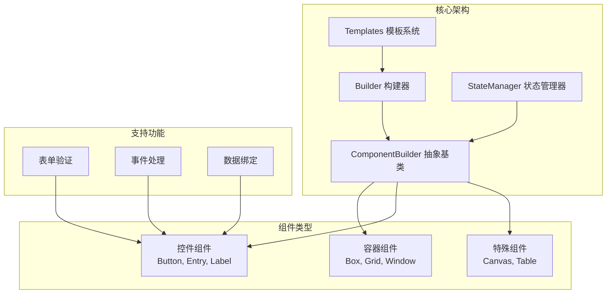

**图表来源**
- [Builder.php](file://src/Builder.php#L24-L153)
- [ComponentBuilder.php](file://src/ComponentBuilder.php#L11-L234)
- [StateManager.php](file://src/State/StateManager.php#L8-L91)

**章节来源**
- [Builder.php](file://src/Builder.php#L1-L153)
- [ComponentBuilder.php](file://src/ComponentBuilder.php#L1-L234)

## 组件组织最佳实践

### 功能模块化构建UI树

推荐按照功能模块来组织UI组件，每个模块负责特定的功能领域：

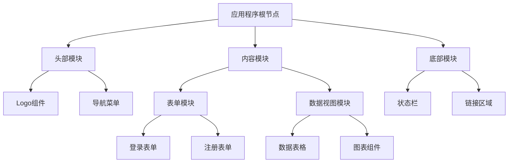

**图表来源**
- [simple.php](file://example/simple.php#L11-L140)

### 合理使用ID命名规范

建立清晰的ID命名约定，便于组件间通信和状态管理：

| 组件类型 | 命名模式 | 示例 |
|---------|---------|------|
| 表单控件 | `{功能}_{控件类型}` | `login_username`, `registration_email` |
| 按钮 | `{操作}_{目标}` | `submit_form`, `cancel_dialog` |
| 标签 | `{显示内容}_{用途}` | `welcome_message`, `status_indicator` |
| 容器 | `{布局类型}_{功能}` | `vbox_main_content`, `grid_form_layout` |
| 特殊组件 | `{功能}_{组件类型}` | `canvas_chart`, `table_data_grid` |

### 组件层次结构设计

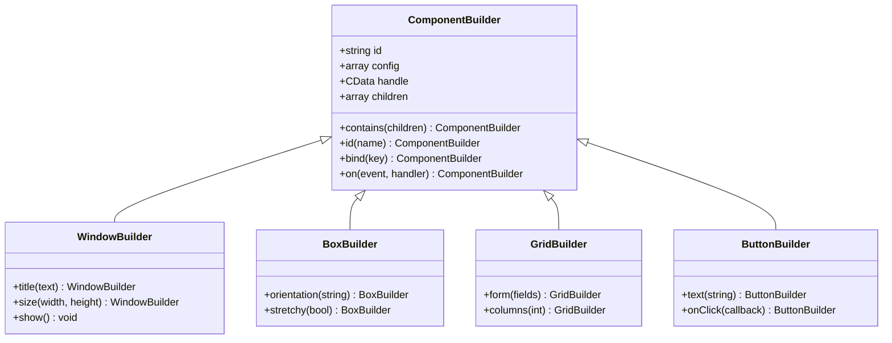

**图表来源**
- [ComponentBuilder.php](file://src/ComponentBuilder.php#L11-L234)
- [Builder.php](file://src/Builder.php#L27-L153)

**章节来源**
- [ComponentBuilder.php](file://src/ComponentBuilder.php#L1-L234)
- [Builder.php](file://src/Builder.php#L1-L153)

## 状态管理策略

### 集中管理共享状态

使用StateManager进行全局状态管理，避免过度使用全局变量：

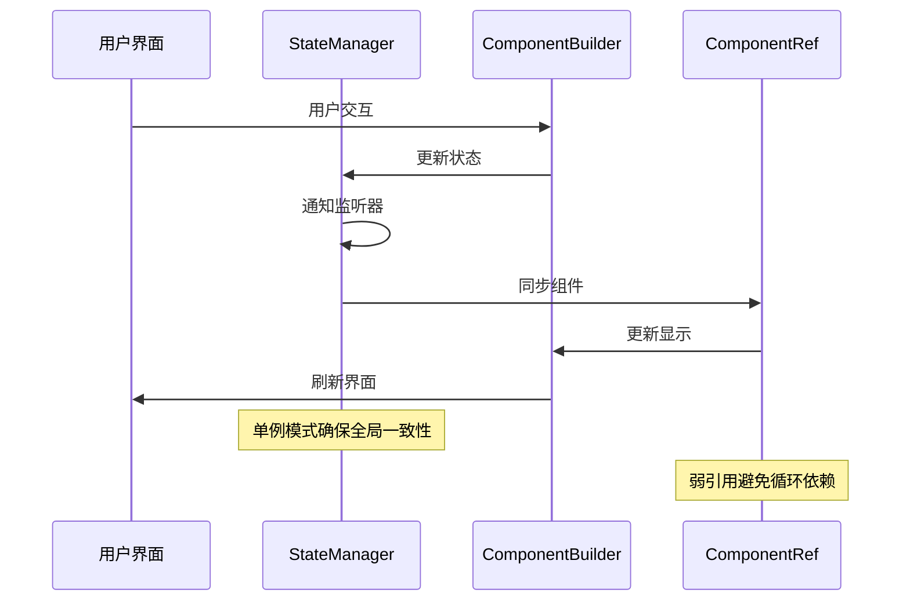

**图表来源**
- [StateManager.php](file://src/State/StateManager.php#L10-L91)
- [ComponentRef.php](file://src/State/ComponentRef.php#L11-L74)

### 状态管理模式

| 模式 | 适用场景 | 实现方式 | 优势 |
|------|---------|---------|------|
| 单一状态源 | 小型应用 | 全局StateManager | 简单易懂，状态一致 |
| 分层状态管理 | 中型应用 | 模块化StateManager | 权限控制，模块隔离 |
| 响应式状态 | 复杂应用 | watch机制 | 自动更新，解耦设计 |
| 本地状态优先 | 性能优化 | 组件内部状态 | 减少全局通信开销 |

### 状态同步策略

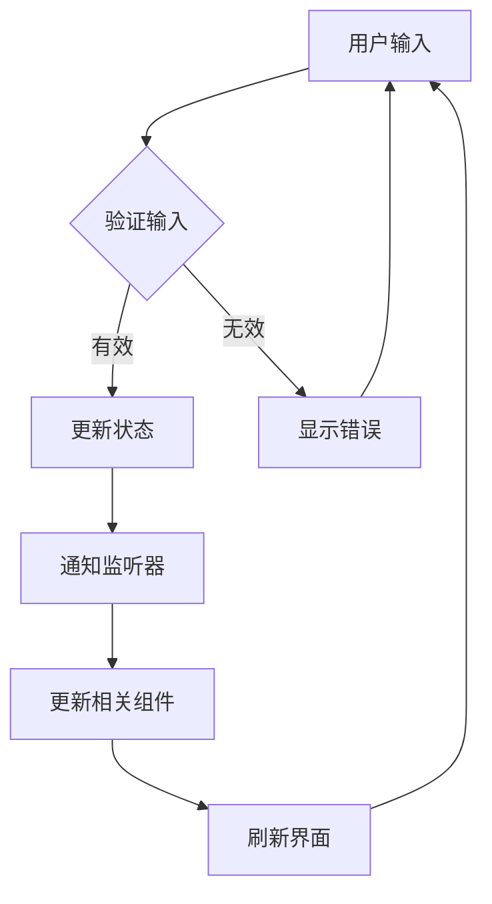

**图表来源**
- [StateManager.php](file://src/State/StateManager.php#L26-L56)
- [ComponentBuilder.php](file://src/ComponentBuilder.php#L140-L146)

**章节来源**
- [StateManager.php](file://src/State/StateManager.php#L1-L91)
- [ComponentRef.php](file://src/State/ComponentRef.php#L1-L74)

## 事件处理规范

### 统一错误处理机制

建立统一的错误处理流程，确保用户体验的一致性：

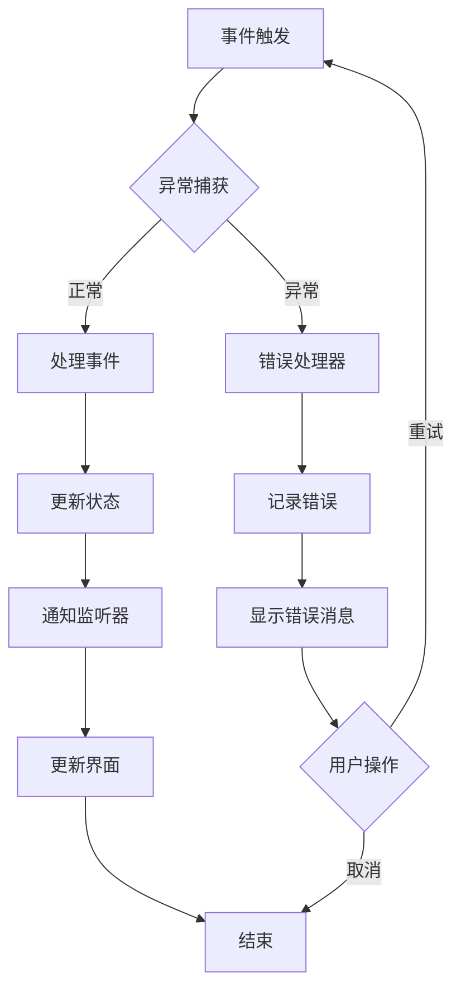

### 避免内存泄漏的最佳实践

| 问题类型 | 风险描述 | 解决方案 | 实现方式 |
|---------|---------|---------|---------|
| 事件监听器泄漏 | 未及时解绑导致内存累积 | 使用弱引用或手动清理 | StateManager.registerComponent() |
| 循环引用 | 组件间相互持有引用 | 使用ComponentRef间接访问 | ComponentRef.getHandle() |
| 全局状态污染 | 状态管理混乱 | 模块化状态管理 | 命名空间隔离 |
| 闭包引用 | 闭包持有大量对象 | 显式释放闭包引用 | 及时null赋值 |

### 事件生命周期管理

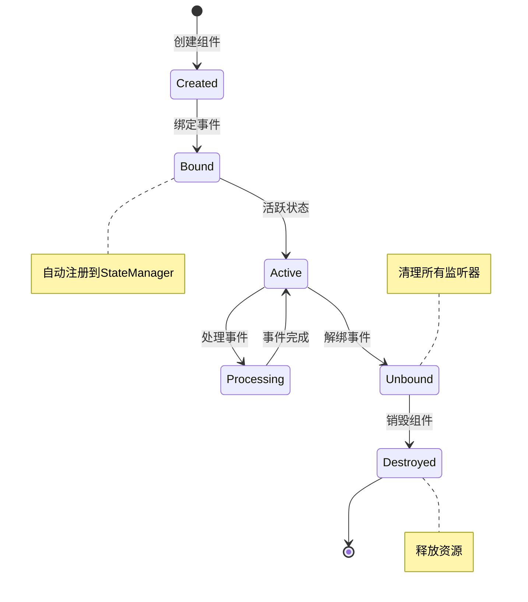

**图表来源**
- [ComponentBuilder.php](file://src/ComponentBuilder.php#L122-L175)
- [StateManager.php](file://src/State/StateManager.php#L71-L82)

**章节来源**
- [ComponentBuilder.php](file://src/ComponentBuilder.php#L122-L175)
- [StateManager.php](file://src/State/StateManager.php#L71-L82)

## 可维护性设计原则

### 代码分层架构

采用清晰的分层架构，实现关注点分离：

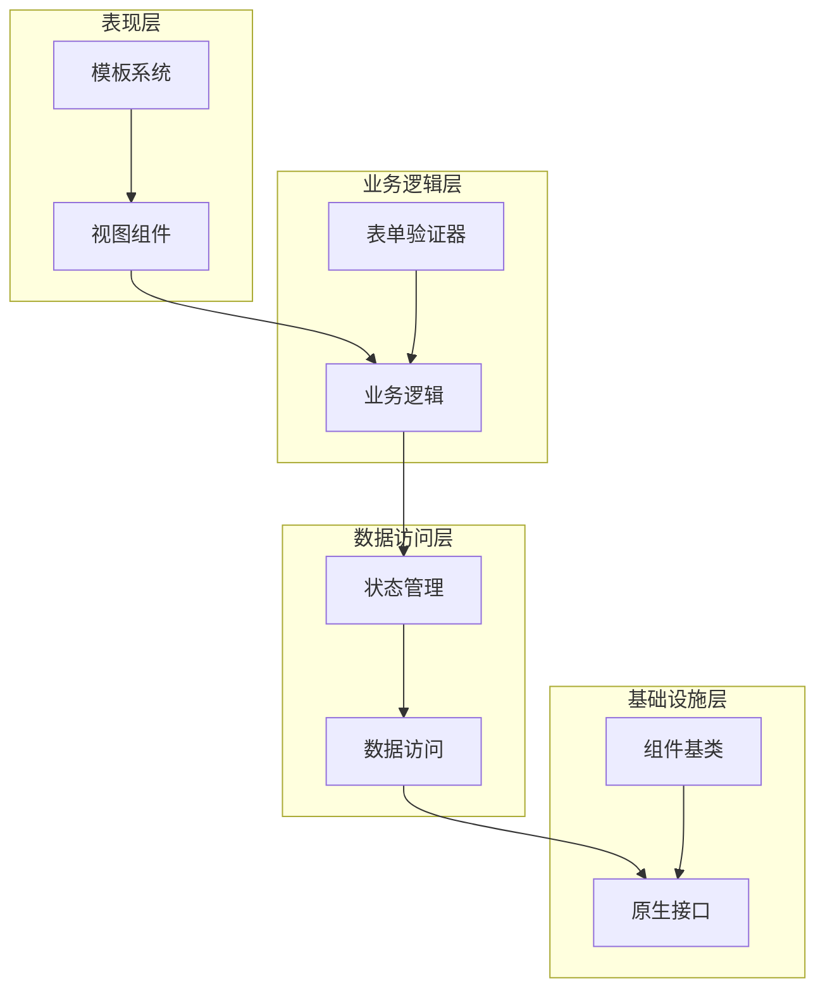

**图表来源**
- [ComponentBuilder.php](file://src/ComponentBuilder.php#L11-L234)
- [FormValidator.php](file://src/Validation/FormValidator.php#L3-L78)

### 使用模板减少重复

通过模板系统减少代码重复，提高开发效率：

| 模板类型 | 用途 | 优势 | 示例 |
|---------|------|------|------|
| 表单模板 | 标准表单布局 | 快速构建表单 | FormTemplate |
| 响应式网格 | 灵活布局 | 自适应设计 | ResponsiveGrid |
| 对话框模板 | 标准对话框 | 一致性体验 | DialogTemplate |
| 导航模板 | 页面导航 | 统一导航 | NavigationTemplate |

### 编写可测试的组件

确保组件具有良好的可测试性：

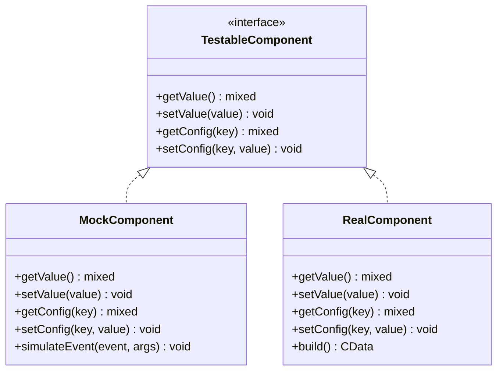

**图表来源**
- [ComponentBuilder.php](file://src/ComponentBuilder.php#L180-L191)
- [FormTemplate.php](file://src/Templates/FormTemplate.php#L10-L46)

**章节来源**
- [ComponentBuilder.php](file://src/ComponentBuilder.php#L1-L234)
- [FormTemplate.php](file://src/Templates/FormTemplate.php#L1-L46)

## 代码示例分析

### simple.php中的最佳实践

基于simple.php示例，展示如何实现高内聚低耦合的GUI应用结构：

#### 1. 模块化表单设计

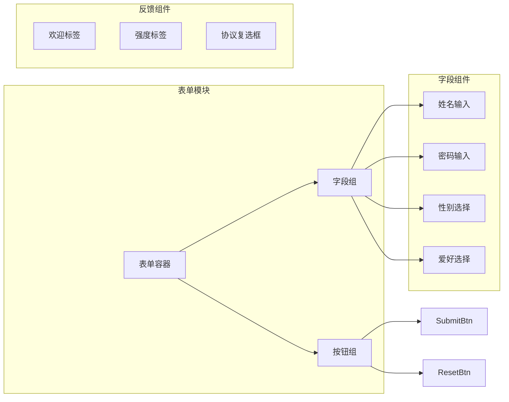

**图表来源**
- [simple.php](file://example/simple.php#L11-L140)

#### 2. 状态管理实现

表单中的状态管理遵循以下模式：

| 组件 | 状态键 | 监听器 | 功能 |
|------|--------|--------|------|
| nameEntry | name | onChange | 实时更新欢迎信息 |
| passwordEntry | password | onChange | 实时计算密码强度 |
| agreeCheckbox | agreement | onToggle | 控制提交按钮状态 |
| genderCombo | gender | onSelected | 记录用户选择 |

#### 3. 事件处理流程

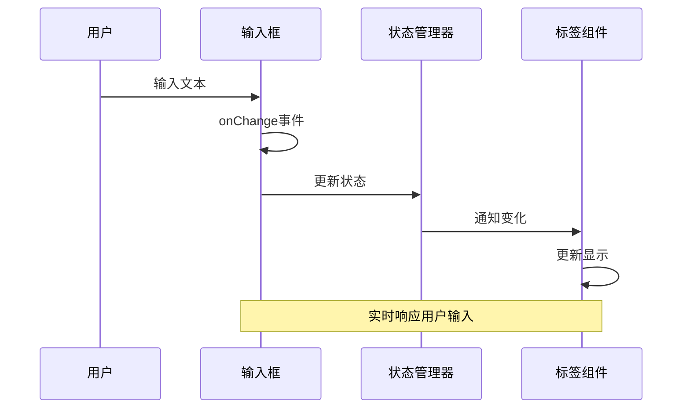

**图表来源**
- [simple.php](file://example/simple.php#L29-L36)
- [simple.php](file://example/simple.php#L44-L50)

#### 4. 表单验证实现

基于FormValidator的验证模式：

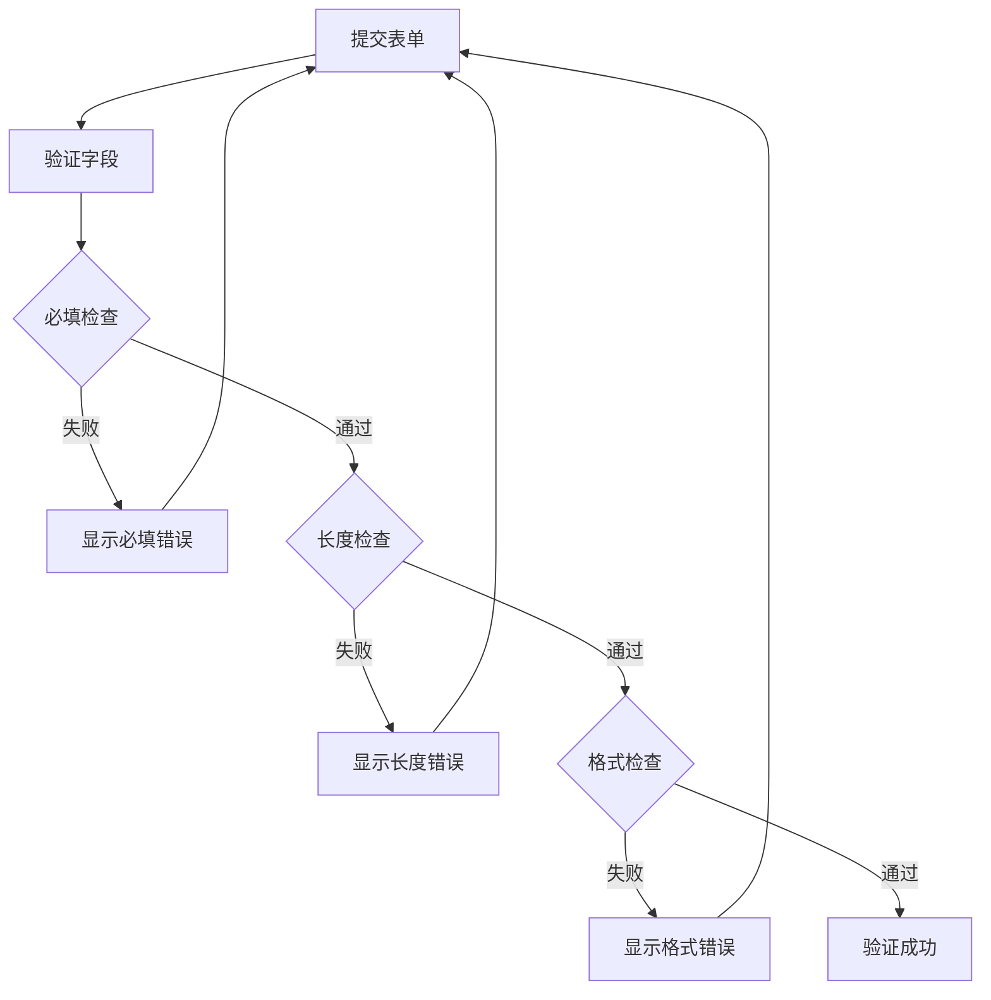

**图表来源**
- [FormValidator.php](file://src/Validation/FormValidator.php#L14-L78)

**章节来源**
- [simple.php](file://example/simple.php#L1-L142)
- [FormValidator.php](file://src/Validation/FormValidator.php#L1-L78)

## 性能优化建议

### 渲染性能优化

| 优化策略 | 实现方式 | 性能提升 | 适用场景 |
|---------|---------|---------|---------|
| 延迟渲染 | 按需创建组件 | 减少初始化时间 | 大型应用 |
| 虚拟滚动 | 只渲染可见项 | 内存使用减少90% | 大列表 |
| 事件防抖 | 合并频繁事件 | 减少CPU使用 | 实时输入 |
| 状态缓存 | 缓存计算结果 | 避免重复计算 | 复杂计算 |

### 内存管理优化

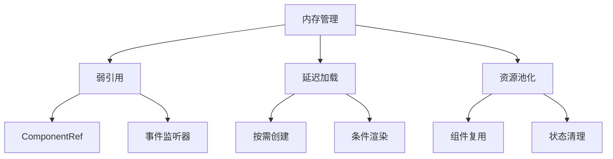

**图表来源**
- [ComponentRef.php](file://src/State/ComponentRef.php#L11-L74)

## 故障排除指南

### 常见问题及解决方案

| 问题类型 | 症状 | 可能原因 | 解决方案 |
|---------|------|---------|---------|
| 内存泄漏 | 应用运行缓慢 | 事件监听器未清理 | 检查StateManager注册 |
| 界面卡顿 | 响应延迟 | 频繁状态更新 | 使用防抖机制 |
| 状态不同步 | 界面显示错误 | 绑定失效 | 重新绑定状态 |
| 组件无法定位 | getComponent返回null | ID未正确设置 | 检查id方法调用 |

### 调试技巧

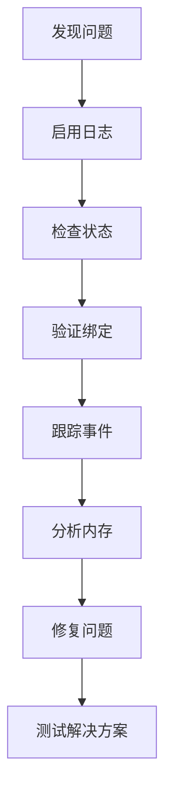

**章节来源**
- [StateManager.php](file://src/State/StateManager.php#L87-L91)

## 总结

libuiBuilder的最佳实践总结如下：

### 核心原则

1. **模块化设计**：按功能划分组件，保持高内聚低耦合
2. **状态集中管理**：使用StateManager避免全局状态污染
3. **事件安全处理**：统一错误处理，避免内存泄漏
4. **代码可维护性**：分层架构，模板复用，可测试设计

### 推荐工具链

- **构建工具**：Composer管理依赖
- **测试框架**：Pest或PHPUnit进行单元测试
- **代码质量**：静态分析工具检查代码质量
- **文档生成**：自动生成API文档

### 发展方向

随着项目的发展，建议关注以下方面：
- 增强TypeScript支持
- 提供更多预设模板
- 优化移动端适配
- 加强国际化支持

通过遵循这些最佳实践，开发者可以构建出高质量、可维护的libuiBuilder应用程序，充分发挥该库在桌面应用开发中的优势。