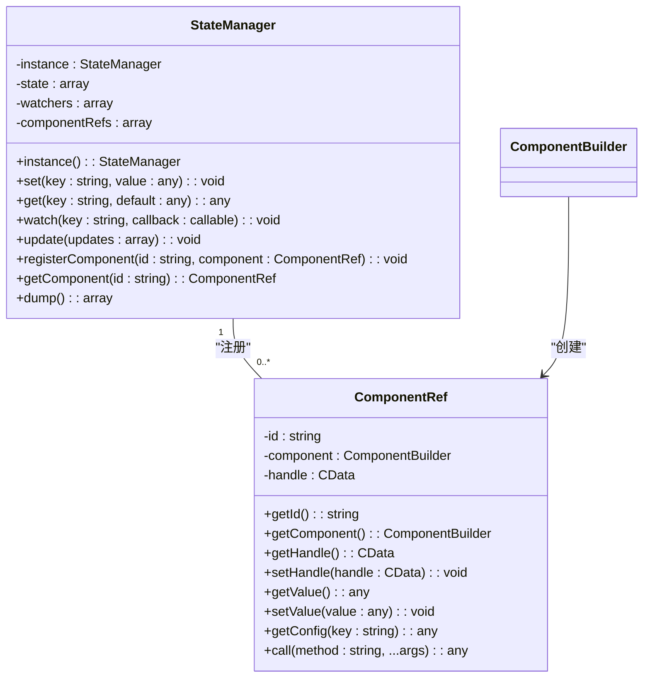
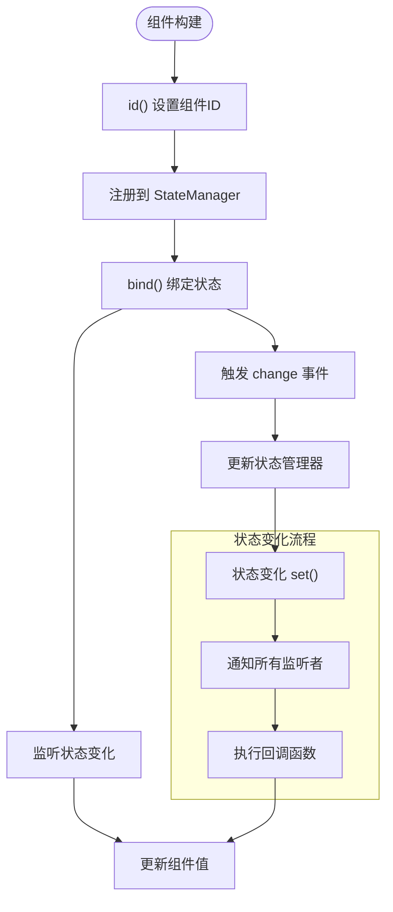
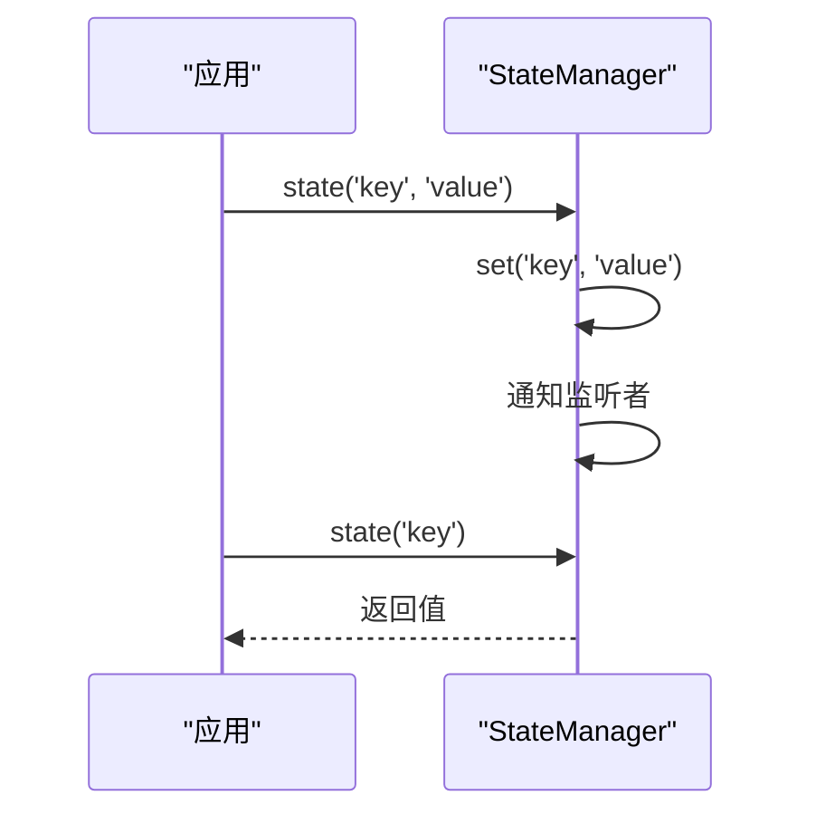
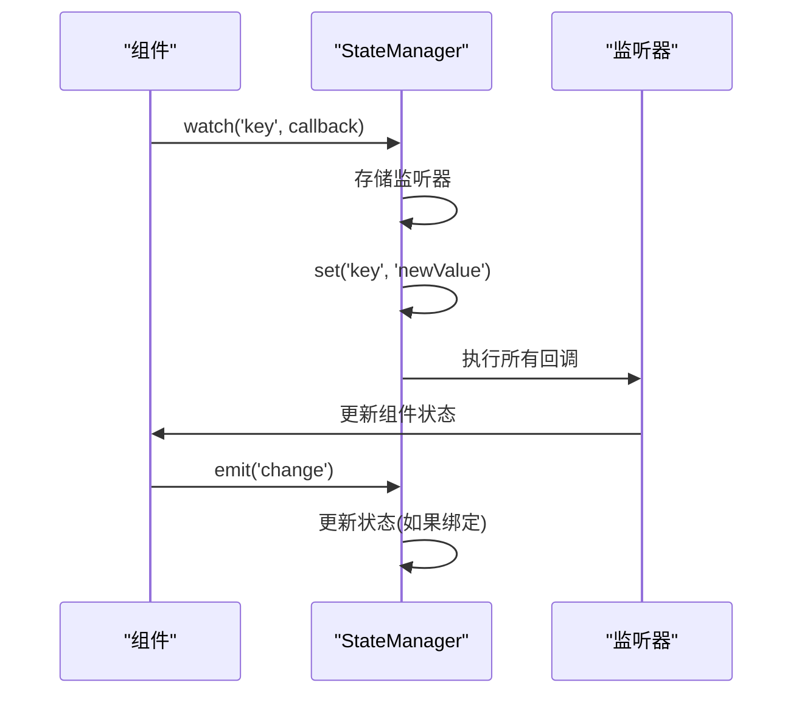
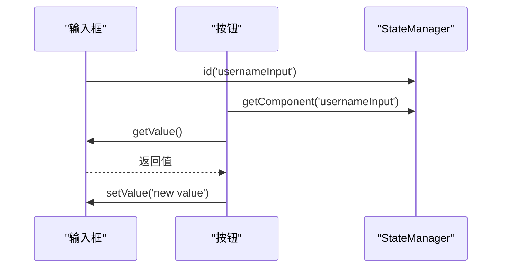
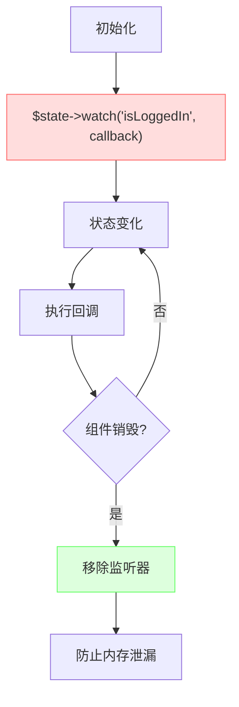
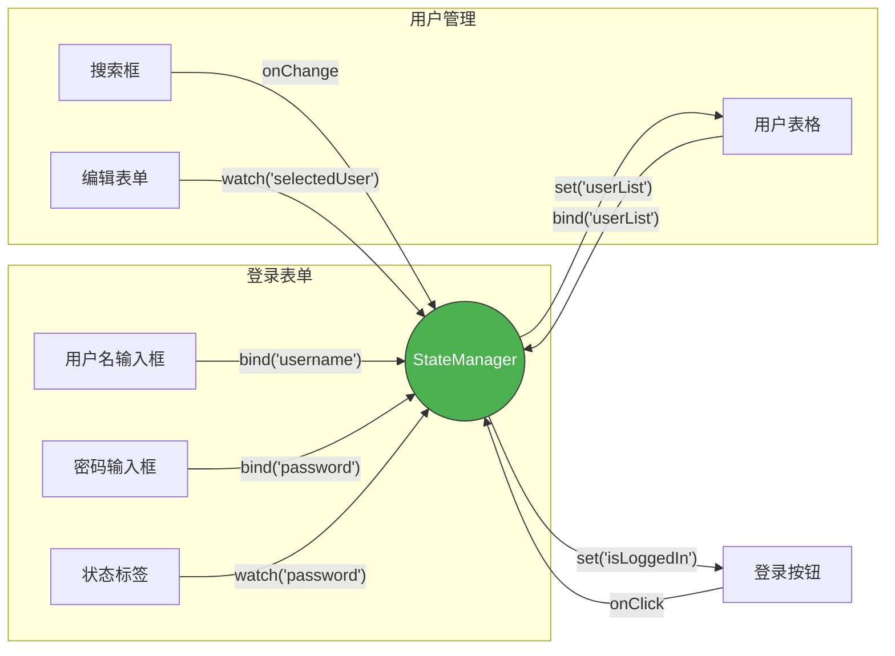

# 状态管理策略

<cite>
**本文档中引用的文件**  
- [StateManager.php](file://src/State/StateManager.php)
- [ComponentRef.php](file://src/State/ComponentRef.php)
- [ComponentBuilder.php](file://src/ComponentBuilder.php)
- [Builder.php](file://src/Builder.php)
- [eventAndState.php](file://example/eventAndState.php)
- [StateHelperTest.php](file://tests/StateHelperTest.php)
- [helper.php](file://src/helper.php)
</cite>

## 目录
1. [简介](#简介)
2. [状态管理架构](#状态管理架构)
3. [核心组件分析](#核心组件分析)
4. [状态管理实践](#状态管理实践)
5. [组件间通信机制](#组件间通信机制)
6. [事件与状态监听](#事件与状态监听)
7. [最佳实践总结](#最佳实践总结)

## 简介
libuiBuilder 提供了一套完整的状态管理解决方案，通过集中式状态管理器实现组件间的数据共享与同步。本文档详细说明状态管理的最佳实践，包括状态的设置与获取、变化监听、数据绑定以及内存泄漏防护等关键机制。

## 状态管理架构

```mermaid
graph TD
subgraph "状态管理层"
StateManager[StateManager<br/>状态管理器]
ComponentRef[ComponentRef<br/>组件引用]
end
subgraph "构建器层"
ComponentBuilder[ComponentBuilder<br/>组件构建基类]
Builder[Builder<br/>构建器入口]
end
subgraph "应用层"
EventAndState[eventAndState.php<br/>示例应用]
end
StateManager --> ComponentRef : "管理"
ComponentBuilder --> StateManager : "调用"
ComponentBuilder --> ComponentRef : "创建"
Builder --> ComponentBuilder : "继承"
EventAndState --> StateManager : "使用"
EventAndState --> ComponentBuilder : "配置"
```

**图示来源**  
- [StateManager.php](file://src/State/StateManager.php#L1-L91)
- [ComponentRef.php](file://src/State/ComponentRef.php#L1-L74)
- [ComponentBuilder.php](file://src/ComponentBuilder.php#L1-L234)

**本节来源**  
- [StateManager.php](file://src/State/StateManager.php#L1-L91)
- [ComponentBuilder.php](file://src/ComponentBuilder.php#L1-L234)

## 核心组件分析

### StateManager 分析



**图示来源**  
- [StateManager.php](file://src/State/StateManager.php#L1-L91)
- [ComponentRef.php](file://src/State/ComponentRef.php#L1-L74)

**本节来源**  
- [StateManager.php](file://src/State/StateManager.php#L1-L91)
- [ComponentRef.php](file://src/State/ComponentRef.php#L1-L74)

### ComponentBuilder 状态管理机制



**图示来源**  
- [ComponentBuilder.php](file://src/ComponentBuilder.php#L122-L175)
- [StateManager.php](file://src/State/StateManager.php#L26-L37)

**本节来源**  
- [ComponentBuilder.php](file://src/ComponentBuilder.php#L122-L175)
- [StateManager.php](file://src/State/StateManager.php#L26-L37)

## 状态管理实践

### 状态设置与获取

状态管理器提供了统一的接口来管理应用状态，避免了全局变量的滥用。通过 `state()` 辅助函数可以方便地进行状态操作：



**图示来源**  
- [StateHelperTest.php](file://tests/StateHelperTest.php#L15-L78)
- [StateManager.php](file://src/State/StateManager.php#L26-L45)

**本节来源**  
- [StateHelperTest.php](file://tests/StateHelperTest.php#L15-L78)
- [StateManager.php](file://src/State/StateManager.php#L26-L45)

### 状态监听实现

状态监听机制允许组件在状态变化时自动更新，实现了响应式编程模式：



**图示来源**  
- [ComponentBuilder.php](file://src/ComponentBuilder.php#L136-L146)
- [StateManager.php](file://src/State/StateManager.php#L50-L56)

**本节来源**  
- [ComponentBuilder.php](file://src/ComponentBuilder.php#L136-L146)
- [StateManager.php](file://src/State/StateManager.php#L50-L56)

## 组件间通信机制

### 数据绑定最佳实践

推荐使用 `bind()` 方法进行数据绑定，而不是直接引用全局状态：

```mermaid
flowchart LR
A[输入组件] -- bind('username') --> B[StateManager]
C[标签组件] -- bind('username') --> B
D[按钮组件] -- watch('username') --> B
B --> A : 状态变化
B --> C : 自动更新
B --> D : 响应变化
style A fill:#f9f,stroke:#333
style B fill:#bbf,stroke:#333,color:#fff
style C fill:#f9f,stroke:#333
style D fill:#f9f,stroke:#333
```

**图示来源**  
- [eventAndState.php](file://example/eventAndState.php#L33-L34)
- [ComponentBuilder.php](file://src/ComponentBuilder.php#L136-L146)

**本节来源**  
- [eventAndState.php](file://example/eventAndState.php#L33-L34)
- [ComponentBuilder.php](file://src/ComponentBuilder.php#L136-L146)

### 组件引用通信

当需要直接操作其他组件时，应通过组件引用来实现：



**图示来源**  
- [eventAndState.php](file://example/eventAndState.php#L39-L43)
- [ComponentRef.php](file://src/State/ComponentRef.php#L46-L57)

**本节来源**  
- [eventAndState.php](file://example/eventAndState.php#L39-L43)
- [ComponentRef.php](file://src/State/ComponentRef.php#L46-L57)

## 事件与状态监听

### 监听器注册与解绑

正确管理监听器生命周期，防止内存泄漏：



**图示来源**  
- [eventAndState.php](file://example/eventAndState.php#L226-L232)
- [StateManager.php](file://src/State/StateManager.php#L50-L56)

**本节来源**  
- [eventAndState.php](file://example/eventAndState.php#L226-L232)
- [StateManager.php](file://src/State/StateManager.php#L50-L56)

### 实际应用示例分析

基于 eventAndState.php 示例的完整状态流：



**图示来源**  
- [eventAndState.php](file://example/eventAndState.php#L13-L234)
- [StateManager.php](file://src/State/StateManager.php#L1-L91)

**本节来源**  
- [eventAndState.php](file://example/eventAndState.php#L13-L234)

## 最佳实践总结

1. **集中管理状态**：所有共享状态应通过 StateManager 进行管理，避免使用全局变量
2. **优先使用绑定**：组件间通信优先使用 `bind()` 方法进行数据绑定
3. **合理监听状态**：使用 `watch()` 监听状态变化，实现响应式更新
4. **及时清理资源**：在组件销毁时应考虑清理相关监听器，防止内存泄漏
5. **使用组件引用**：需要直接操作其他组件时，通过 `id()` 和 `getComponent()` 获取引用
6. **批量更新状态**：使用 `update()` 方法进行批量状态更新，提高性能

**本节来源**  
- [StateManager.php](file://src/State/StateManager.php#L1-L91)
- [ComponentBuilder.php](file://src/ComponentBuilder.php#L1-L234)
- [eventAndState.php](file://example/eventAndState.php#L1-L234)