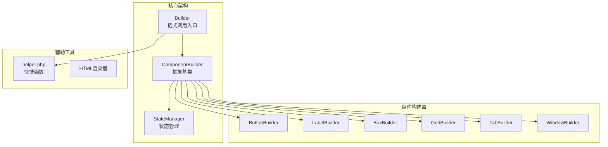
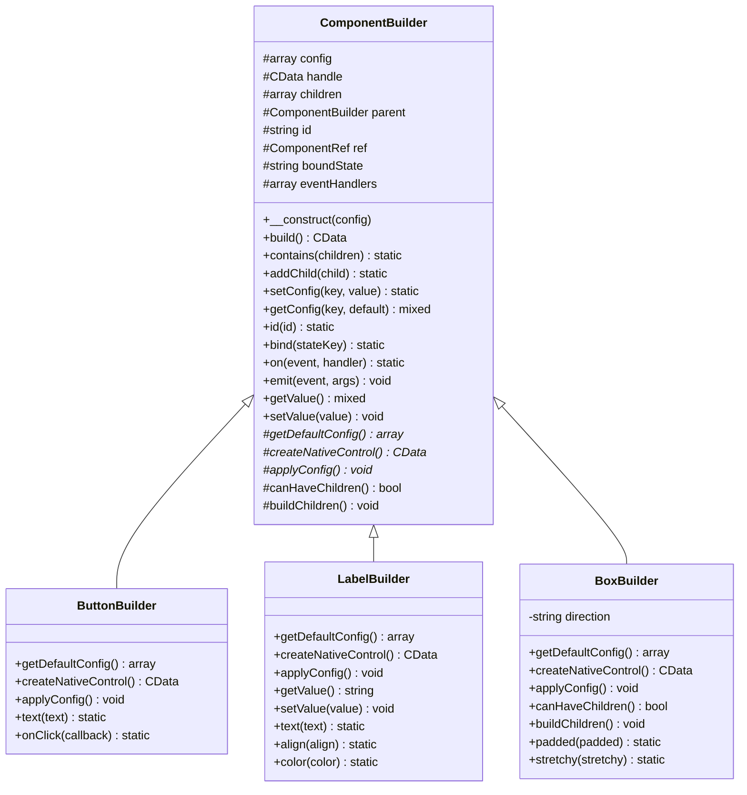
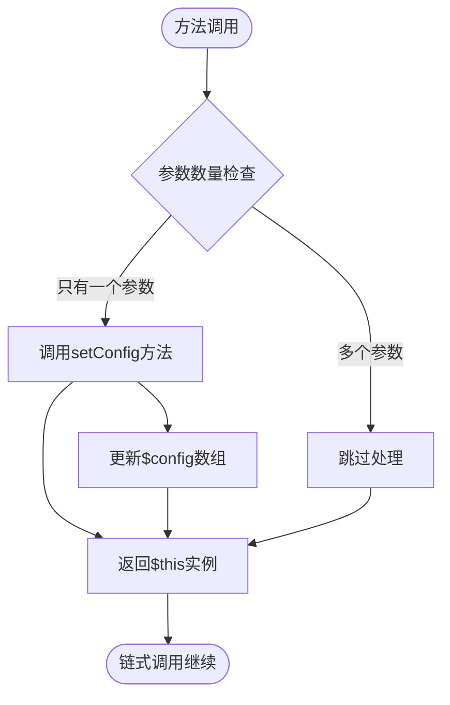
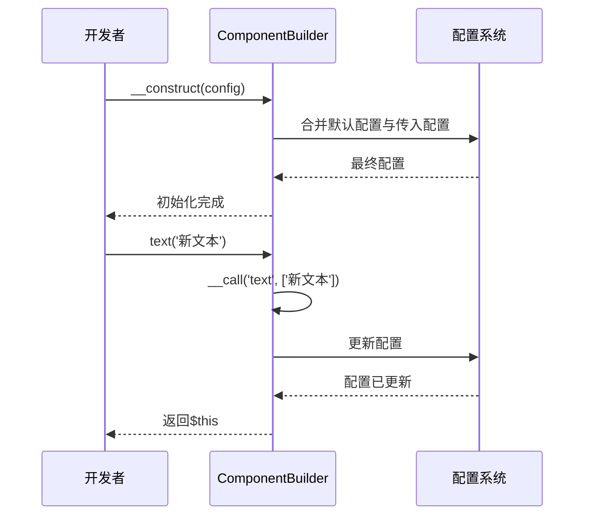
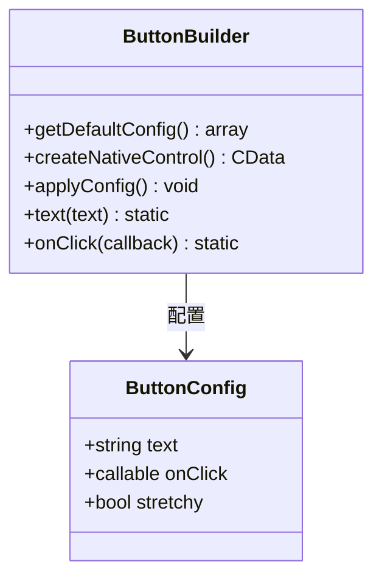
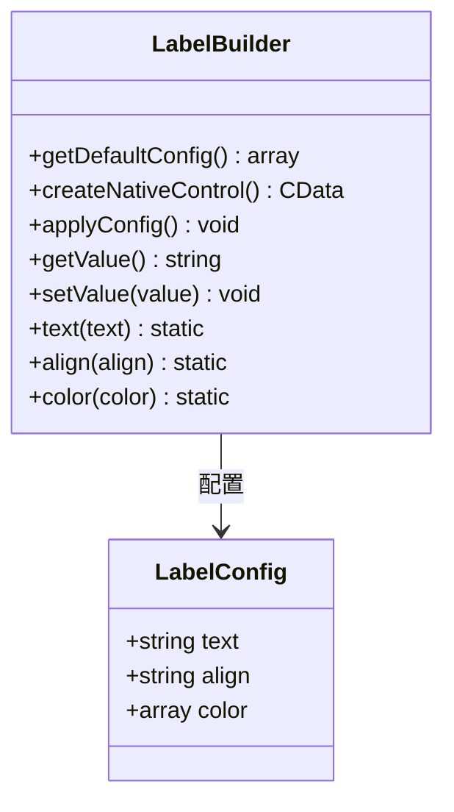
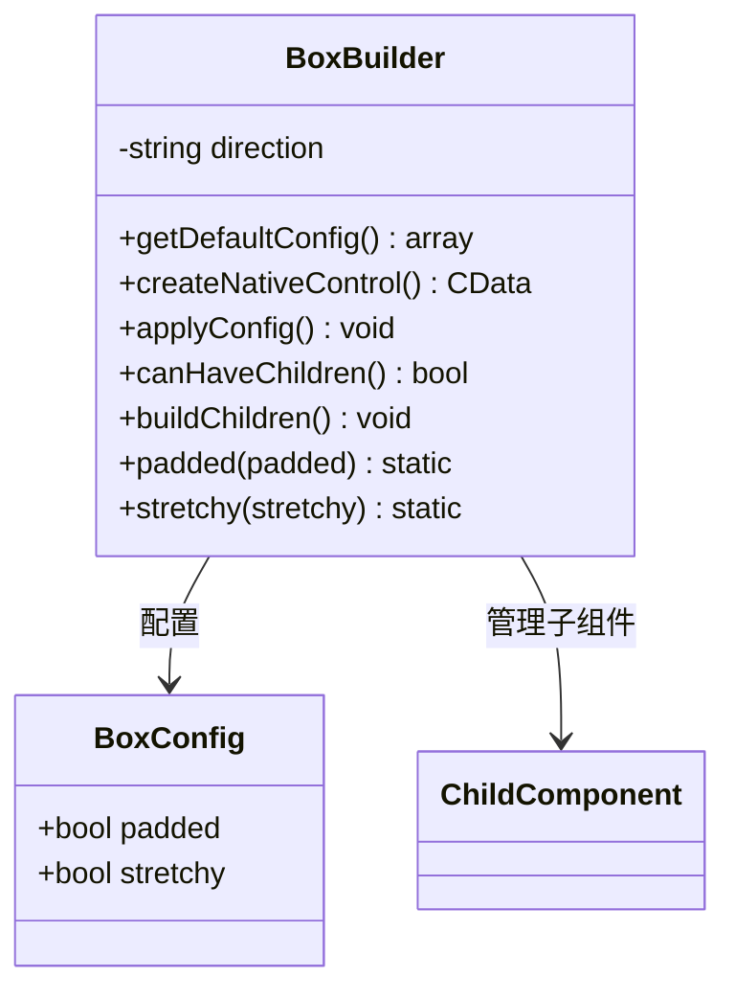
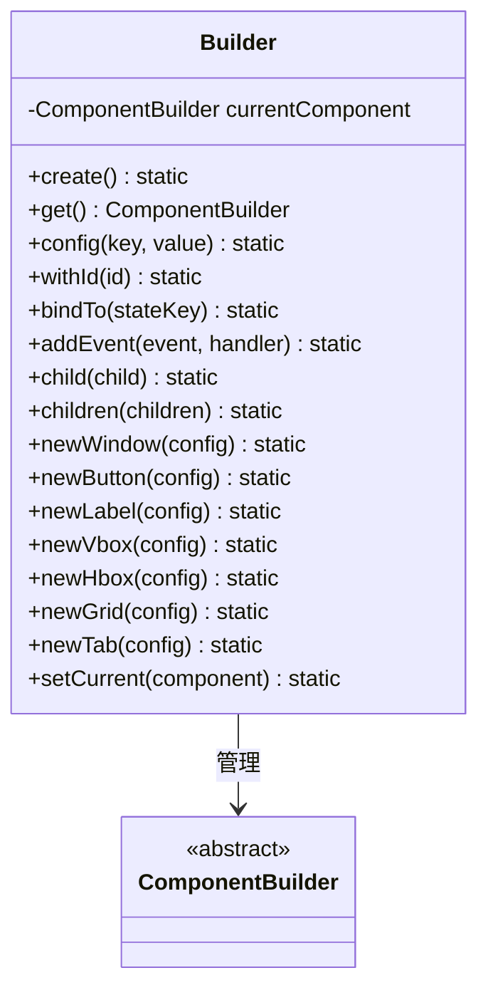
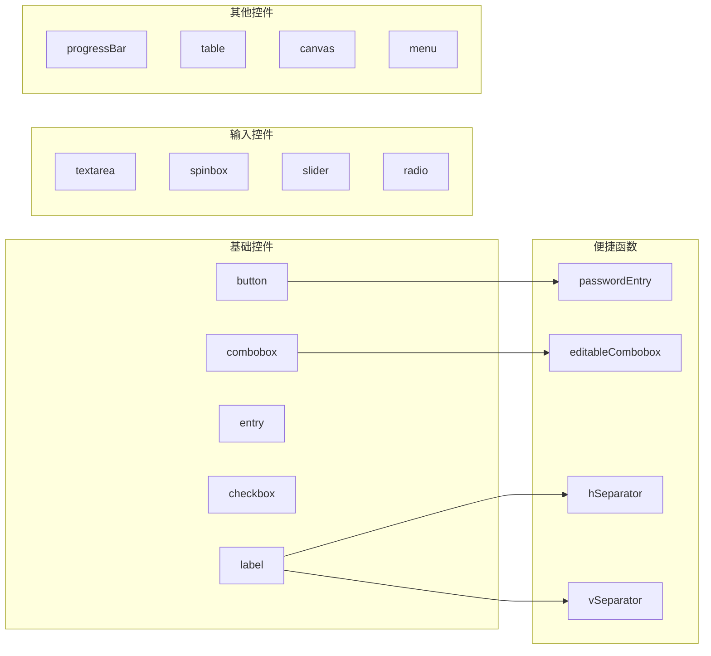
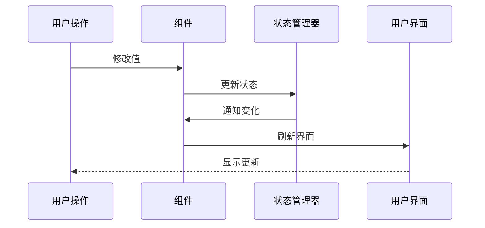

# Builder模式与链式调用

<cite>
**本文档中引用的文件**
- [ComponentBuilder.php](file://src/ComponentBuilder.php)
- [Builder.php](file://src/Builder.php)
- [ButtonBuilder.php](file://src/Components/ButtonBuilder.php)
- [LabelBuilder.php](file://src/Components/LabelBuilder.php)
- [BoxBuilder.php](file://src/Components/BoxBuilder.php)
- [TabBuilder.php](file://src/Builder/TabBuilder.php)
- [GridBuilder.php](file://src/Components/GridBuilder.php)
- [helper.php](file://src/helper.php)
- [builder_helpers_demo.php](file://example/builder_helpers_demo.php)
- [full.php](file://example/full.php)
- [BuilderComponentsTest.php](file://tests/BuilderComponentsTest.php)
</cite>

## 目录
1. [简介](#简介)
2. [项目结构概览](#项目结构概览)
3. [ComponentBuilder抽象基类设计](#componentbuilder抽象基类设计)
4. [__call魔术方法实现链式调用](#call魔术方法实现链式调用)
5. [具体组件构建器实现](#具体组件构建器实现)
6. [Builder类链式调用机制](#builder类链式调用机制)
7. [完整代码示例](#完整代码示例)
8. [性能考虑与最佳实践](#性能考虑与最佳实践)
9. [总结](#总结)

## 简介

libuiBuilder是一个基于PHP的GUI应用程序构建框架，采用了经典的Builder设计模式来简化复杂的用户界面构建过程。该框架通过抽象基类ComponentBuilder定义了统一的组件构建接口，并利用PHP的魔术方法`__call`实现了优雅的链式调用语法，使得开发者能够以声明式的方式构建复杂的用户界面。

本文档将深入分析Builder模式在libuiBuilder中的实现机制，重点探讨ComponentBuilder抽象基类的设计原理、__call魔术方法如何实现链式调用的技术细节，以及各种具体组件构建器的继承实现。

## 项目结构概览

libuiBuilder采用模块化的架构设计，主要包含以下核心组件：



**图表来源**
- [ComponentBuilder.php](file://src/ComponentBuilder.php#L11-L234)
- [Builder.php](file://src/Builder.php#L27-L425)

**章节来源**
- [ComponentBuilder.php](file://src/ComponentBuilder.php#L1-L234)
- [Builder.php](file://src/Builder.php#L1-L425)

## ComponentBuilder抽象基类设计

ComponentBuilder作为所有组件构建器的抽象基类，定义了统一的构建接口和核心功能。其设计遵循Builder模式的核心原则，提供了灵活且可扩展的组件构建能力。

### 核心属性与状态管理

ComponentBuilder维护了多个关键属性来管理组件的状态和生命周期：



**图表来源**
- [ComponentBuilder.php](file://src/ComponentBuilder.php#L11-L234)
- [ButtonBuilder.php](file://src/Components/ButtonBuilder.php#L9-L48)
- [LabelBuilder.php](file://src/Components/LabelBuilder.php#L9-L62)
- [BoxBuilder.php](file://src/Components/BoxBuilder.php#L11-L64)

### 抽象方法设计

ComponentBuilder定义了三个关键的抽象方法，要求所有子类必须实现：

1. **getDefaultConfig()**: 返回组件的默认配置数组
2. **createNativeControl()**: 创建对应的原生控件实例
3. **applyConfig()**: 将配置应用到已创建的原生控件

这些抽象方法确保了每个组件构建器都能正确地初始化、配置和渲染对应的GUI控件。

**章节来源**
- [ComponentBuilder.php](file://src/ComponentBuilder.php#L30-L44)

## __call魔术方法实现链式调用

PHP的`__call`魔术方法是实现链式调用的核心技术。ComponentBuilder中的`__call`方法提供了一种灵活的方式来处理动态方法调用，使得开发者可以通过链式调用设置各种配置项。

### 魔术方法实现机制



**图表来源**
- [ComponentBuilder.php](file://src/ComponentBuilder.php#L114-L119)

### 动态配置设置技术细节

当开发者调用类似`$button->text('提交')`这样的方法时，`__call`魔术方法会捕获这个调用并将其转换为配置设置操作：

1. **参数验证**: 检查传入的参数数量是否为1
2. **配置更新**: 调用`setConfig()`方法更新内部配置数组
3. **链式返回**: 返回当前对象实例，支持连续调用

这种设计允许开发者使用自然语言式的API来配置组件，例如：
```php
$button = Builder::button()
    ->text('提交')
    ->onClick(function() { /* 处理点击 */ })
    ->id('submit-btn')
    ->bind('submit-state');
```

### 配置优先级机制

ComponentBuilder实现了智能的配置优先级机制：



**图表来源**
- [ComponentBuilder.php](file://src/ComponentBuilder.php#L25-L28)
- [ComponentBuilder.php](file://src/ComponentBuilder.php#L114-L119)

**章节来源**
- [ComponentBuilder.php](file://src/ComponentBuilder.php#L114-L119)

## 具体组件构建器实现

libuiBuilder提供了丰富的具体组件构建器，每个都针对特定的GUI控件进行了优化设计。

### ButtonBuilder - 按钮组件

ButtonBuilder展示了如何实现具有特定功能的组件构建器：



**图表来源**
- [ButtonBuilder.php](file://src/Components/ButtonBuilder.php#L9-L48)

ButtonBuilder的实现特点：
- **默认配置**: 提供按钮的默认文本、点击事件处理器和拉伸属性
- **原生控件创建**: 使用`Button::create()`创建libui按钮
- **事件绑定**: 通过`Button::onClicked()`绑定点击事件
- **专用方法**: 提供`text()`和`onClick()`等专门的配置方法

### LabelBuilder - 标签组件

LabelBuilder展示了如何处理只读或需要特殊处理的组件：



**图表来源**
- [LabelBuilder.php](file://src/Components/LabelBuilder.php#L9-L62)

### BoxBuilder - 容器组件

BoxBuilder是最复杂的组件之一，因为它需要管理子组件：



**图表来源**
- [BoxBuilder.php](file://src/Components/BoxBuilder.php#L11-L64)

BoxBuilder的关键特性：
- **方向控制**: 支持垂直和水平布局
- **子组件管理**: 实现`canHaveChildren()`和`buildChildren()`方法
- **拉伸属性**: 支持子组件的拉伸配置

**章节来源**
- [ButtonBuilder.php](file://src/Components/ButtonBuilder.php#L1-L48)
- [LabelBuilder.php](file://src/Components/LabelBuilder.php#L1-L62)
- [BoxBuilder.php](file://src/Components/BoxBuilder.php#L1-L64)

## Builder类链式调用机制

Builder类作为整个框架的入口点，提供了统一的链式调用接口。它不仅支持传统的静态工厂方法，还提供了全新的链式调用方式。

### Builder类架构



**图表来源**
- [Builder.php](file://src/Builder.php#L27-L425)

### 链式调用方法分类

Builder类提供了两类链式调用方法：

1. **配置方法**: 如`config()`、`withId()`、`addEvent()`等
2. **创建方法**: 如`newWindow()`、`newButton()`、`newVbox()`等

### 辅助函数系统

helper.php文件提供了丰富的辅助函数，简化了常见组件的创建：



**图表来源**
- [helper.php](file://src/helper.php#L123-L147)

**章节来源**
- [Builder.php](file://src/Builder.php#L1-L425)
- [helper.php](file://src/helper.php#L123-L147)

## 完整代码示例

以下展示了从简单按钮创建到复杂组件树构建的完整示例，演示了链式调用如何提升代码可读性和开发效率。

### 简单按钮创建示例

```php
// 传统方式
$button = Builder::button(['text' => '提交']);
$button->onClick(function() {
    echo "按钮被点击!";
});

// 链式调用方式
$button = Builder::create()
    ->newButton()
    ->config('text', '提交')
    ->addEvent('click', function() {
        echo "按钮被点击!";
    })
    ->get();
```

### 复杂登录表单示例

```php
$loginForm = Builder::create()
    ->newWindow(['title' => '用户登录'])
    ->config('size', [350, 200])
    ->config('centered', true)
    ->children([
        Builder::vbox(['padded' => true])->contains([
            Builder::label()->text('用户登录'),
            Builder::grid()->form([
                [
                    'label' => Builder::label()->text('账号:'),
                    'control' => Builder::entry()
                        ->id('username')
                        ->placeholder('请输入账号'),
                ],
                [
                    'label' => Builder::label()->text('密码:'),
                    'control' => Builder::passwordEntry()
                        ->id('password')
                        ->placeholder('请输入密码'),
                ],
            ]),
            Builder::hbox()->contains([
                Builder::button()
                    ->text('登录')
                    ->id('loginBtn')
                    ->onClick(function() {
                        echo "执行登录逻辑...\n";
                    }),
                Builder::button()
                    ->text('取消')
                    ->onClick(function() {
                        echo "取消登录\n";
                    }),
            ]),
        ])
    ])
    ->get();
```

### 标签页组件示例

```php
$tabbedInterface = Builder::create()
    ->newTab()
    ->tab('基本信息', [
        Builder::label()->text('姓名:'),
        Builder::entry()->id('name'),
        Builder::label()->text('年龄:'),
        Builder::spinbox()->id('age'),
    ])
    ->tab('联系方式', [
        Builder::label()->text('邮箱:'),
        Builder::entry()->id('email'),
        Builder::label()->text('电话:'),
        Builder::entry()->id('phone'),
    ])
    ->tab('地址信息', [
        Builder::label()->text('城市:'),
        Builder::combobox()->id('city')
            ->items(['北京', '上海', '广州', '深圳']),
        Builder::label()->text('详细地址:'),
        Builder::textarea()->id('address'),
    ])
    ->get();
```

### 网格布局示例

```php
$formLayout = Builder::create()
    ->newGrid(['padded' => true])
    ->children([
        Builder::label()->text('用户名:'),
        Builder::entry()->placeholder('请输入用户名'),
        Builder::label()->text('密码:'),
        Builder::passwordEntry()->placeholder('请输入密码'),
        Builder::label()->text('确认密码:'),
        Builder::passwordEntry()->placeholder('请再次输入密码'),
    ])
    ->get();
```

**章节来源**
- [builder_helpers_demo.php](file://example/builder_helpers_demo.php#L1-L140)
- [full.php](file://example/full.php#L1-L180)

## 性能考虑与最佳实践

### 链式调用的性能影响

虽然链式调用提供了优秀的开发体验，但在某些场景下需要注意性能影响：

1. **内存使用**: 链式调用会创建多个中间对象
2. **方法调用开销**: 每次方法调用都有一定的性能开销
3. **配置合并**: 大量配置合并操作可能影响性能

### 最佳实践建议

1. **合理使用链式调用**: 对于简单的配置，直接传递数组更高效
2. **避免过度嵌套**: 复杂的组件树应适当拆分
3. **及时释放资源**: 对于大型应用，注意及时清理不需要的组件引用
4. **批量操作**: 对于大量相似组件，使用循环和批量方法

### 状态管理优化

ComponentBuilder集成了状态管理系统，提供了高效的响应式编程能力：



**图表来源**
- [ComponentBuilder.php](file://src/ComponentBuilder.php#L140-L146)
- [ComponentBuilder.php](file://src/ComponentBuilder.php#L171-L174)

**章节来源**
- [ComponentBuilder.php](file://src/ComponentBuilder.php#L140-L174)

## 总结

libuiBuilder通过精心设计的Builder模式和链式调用机制，为PHP开发者提供了一个强大而优雅的GUI应用程序构建框架。ComponentBuilder抽象基类的设计体现了面向对象设计的最佳实践，而`__call`魔术方法的巧妙运用则展现了PHP语言的灵活性。

### 关键优势

1. **代码可读性**: 链式调用使代码更加直观和易读
2. **开发效率**: 丰富的辅助函数和快捷方法大幅提升了开发速度
3. **扩展性**: 抽象基类设计使得添加新组件变得简单
4. **一致性**: 统一的API设计降低了学习成本

### 技术创新

- **魔术方法的应用**: `__call`方法的巧妙使用实现了动态配置
- **状态绑定**: 内置的状态管理系统支持响应式编程
- **组合模式**: 通过`contains()`和`addChild()`方法实现组件组合

libuiBuilder的Builder模式实现不仅解决了GUI构建的复杂性问题，更为PHP生态系统提供了一个优秀的框架设计范例。通过深入理解其实现机制，开发者可以更好地利用这一框架构建高质量的桌面应用程序。