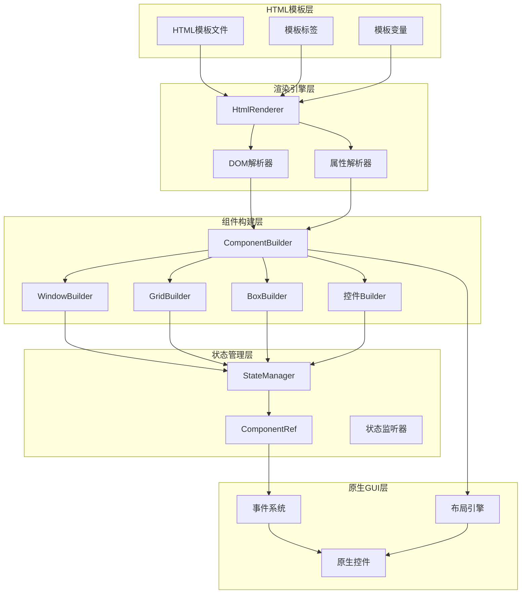
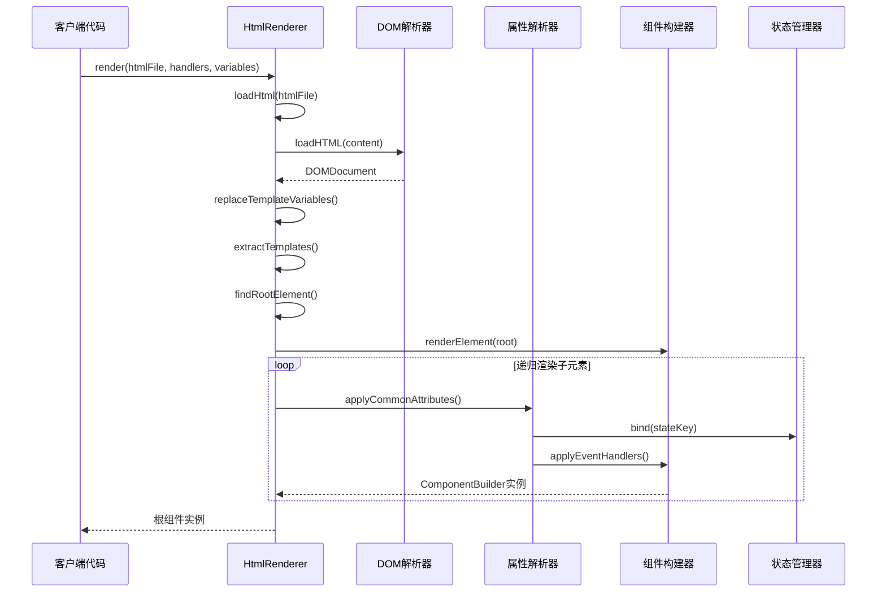
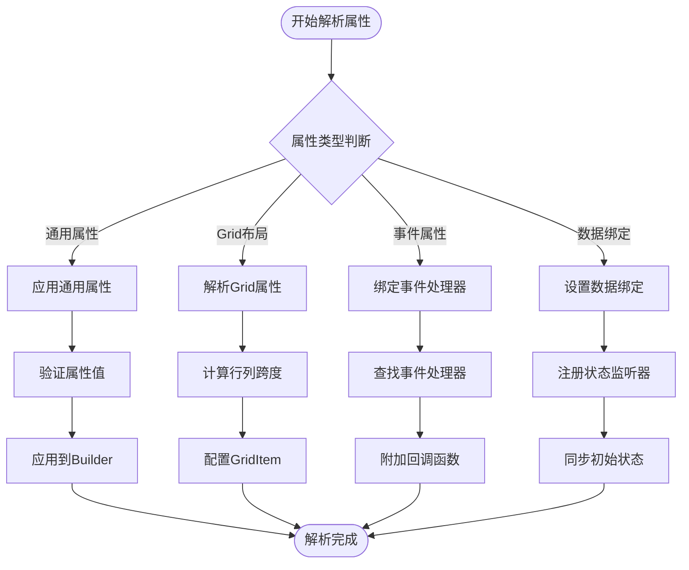
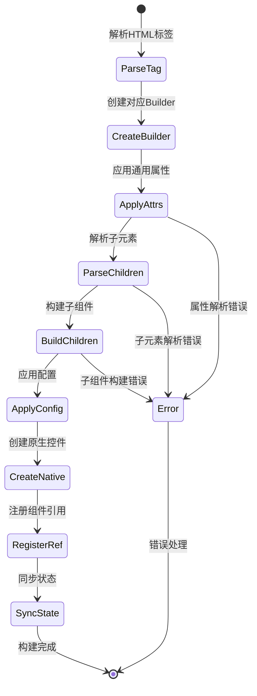
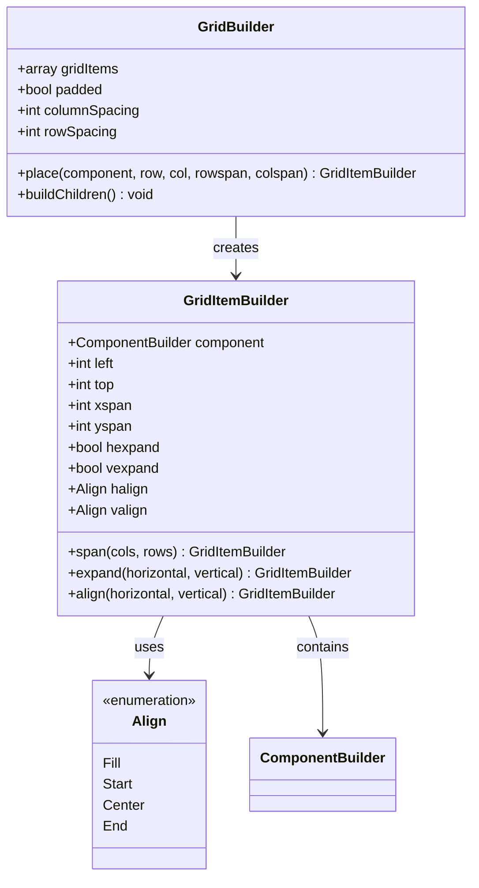
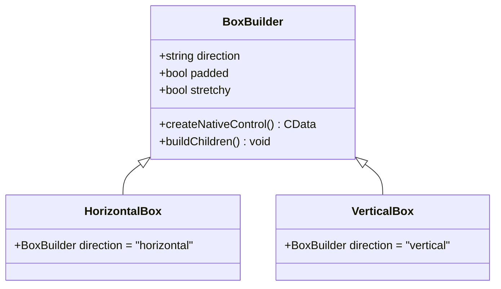
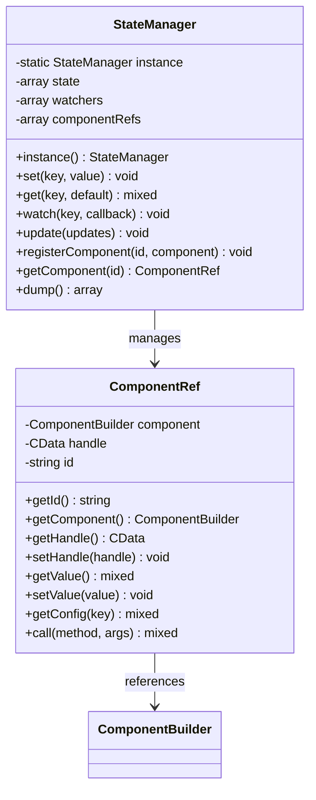
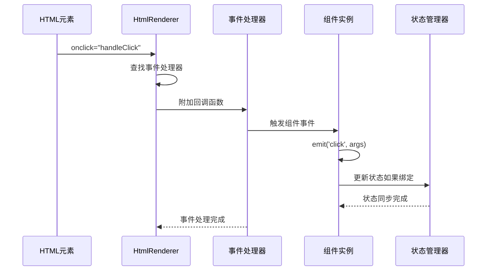
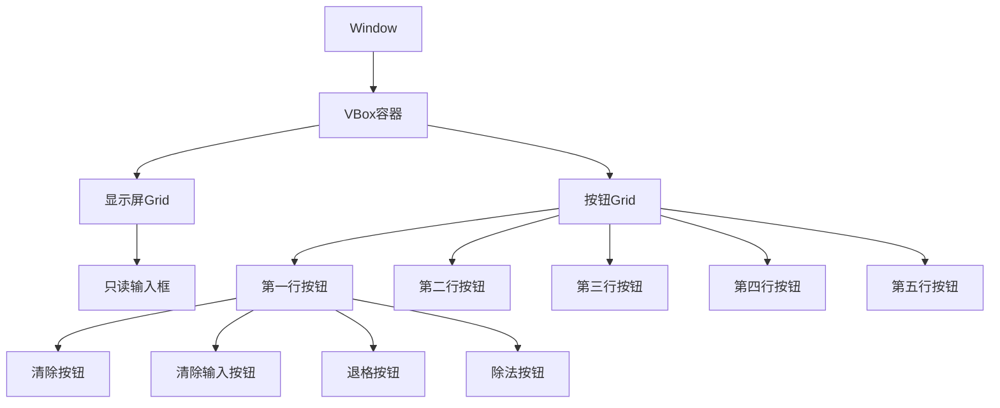

# HTML模板系统

<cite>
**本文档中引用的文件**
- [HtmlRenderer.php](file://src/HtmlRenderer.php)
- [ComponentBuilder.php](file://src/ComponentBuilder.php)
- [StateManager.php](file://src/State/StateManager.php)
- [ComponentRef.php](file://src/State/ComponentRef.php)
- [GridBuilder.php](file://src/Components/GridBuilder.php)
- [GridItemBuilder.php](file://src/Components/GridItemBuilder.php)
- [ButtonBuilder.php](file://src/Components/ButtonBuilder.php)
- [EntryBuilder.php](file://src/Components/EntryBuilder.php)
- [BoxBuilder.php](file://src/Components/BoxBuilder.php)
- [helper.php](file://src/helper.php)
- [login.ui.html](file://example/views/login.ui.html)
- [calculator.ui.html](file://example/views/calculator.ui.html)
- [full.ui.html](file://example/views/full.ui.html)
- [debug_renderer.php](file://example/debug_renderer.php)
</cite>

## 目录
1. [简介](#简介)
2. [系统架构概览](#系统架构概览)
3. [HtmlRenderer核心机制](#htmlrenderer核心机制)
4. [模板属性解析规则](#模板属性解析规则)
5. [模板变量插值系统](#模板变量插值系统)
6. [组件映射与构建流程](#组件映射与构建流程)
7. [布局系统详解](#布局系统详解)
8. [状态管理系统](#状态管理系统)
9. [事件处理机制](#事件处理机制)
10. [模板实例分析](#模板实例分析)
11. [扩展开发指南](#扩展开发指南)
12. [常见错误与解决方案](#常见错误与解决方案)
13. [总结](#总结)

## 简介

libuiBuilder的HTML模板系统是一个强大的界面构建框架，它将标准HTML语法转换为原生GUI组件。该系统通过HtmlRenderer类实现了从HTML模板到Builder组件树的完整转换过程，支持复杂的布局、数据绑定、事件处理和状态管理功能。

### 核心特性

- **HTML语法兼容性**：使用标准HTML标签和属性
- **双向数据绑定**：通过`bind`属性实现数据同步
- **事件驱动架构**：支持`onclick`、`onchange`等事件处理
- **灵活布局系统**：Grid、Box容器布局支持
- **模板复用机制**：`<template>`和`<use>`标签支持
- **状态管理集成**：全局状态共享和监听

## 系统架构概览



**图表来源**
- [HtmlRenderer.php](file://src/HtmlRenderer.php#L28-L684)
- [ComponentBuilder.php](file://src/ComponentBuilder.php#L11-L234)
- [StateManager.php](file://src/State/StateManager.php#L8-L91)

## HtmlRenderer核心机制

### 渲染流程架构



**图表来源**
- [HtmlRenderer.php](file://src/HtmlRenderer.php#L57-L77)
- [HtmlRenderer.php](file://src/HtmlRenderer.php#L82-L108)
- [HtmlRenderer.php](file://src/HtmlRenderer.php#L162-L197)

### 核心渲染方法

HtmlRenderer的`render`方法是整个系统的核心入口点，它协调了HTML解析、DOM处理、组件构建和状态管理的完整流程。

**章节来源**
- [HtmlRenderer.php](file://src/HtmlRenderer.php#L57-L77)

## 模板属性解析规则

### 特殊属性映射表

| HTML属性 | 功能描述 | 对应Builder方法 | 支持值类型 | 默认行为 |
|---------|---------|----------------|-----------|----------|
| `id` | 组件唯一标识 | `id()` | 字符串 | 无 |
| `bind` | 数据绑定 | `bind()` | 状态键名 | 无绑定 |
| `onclick` | 点击事件 | `onClick()` | 事件处理器名称 | 无事件 |
| `onchange` | 值变化事件 | `onChange()` | 事件处理器名称 | 无事件 |
| `row` | Grid行位置 | 内部处理 | 整数 | 0 |
| `col` | Grid列位置 | 内部处理 | 整数 | 0 |
| `rowspan` | Grid行跨度 | 内部处理 | 整数 | 1 |
| `colspan` | Grid列跨度 | 内部处理 | 整数 | 1 |
| `expand` | 扩展属性 | `expand()` | 布尔/方向 | false |
| `align` | 对齐方式 | `align()` | 方向组合 | fill |

### 属性解析流程



**图表来源**
- [HtmlRenderer.php](file://src/HtmlRenderer.php#L202-L238)
- [HtmlRenderer.php](file://src/HtmlRenderer.php#L299-L336)

**章节来源**
- [HtmlRenderer.php](file://src/HtmlRenderer.php#L202-L238)
- [HtmlRenderer.php](file://src/HtmlRenderer.php#L302-L336)

## 模板变量插值系统

### 变量替换机制

模板变量插值系统使用正则表达式匹配`{{variableName}}`格式的占位符，并将其替换为对应的上下文值。

### 插值实现原理

```mermaid
flowchart LR
Input[HTML原始内容] --> Regex[正则匹配]
Regex --> Match[{{variable}}]
Match --> Extract[提取变量名]
Extract --> Lookup[查找变量值]
Lookup --> Replace[替换内容]
Replace --> Output[处理后HTML]
subgraph "变量查找策略"
Default[默认值]
Context[上下文变量]
State[状态管理器]
end
Lookup --> Default
Lookup --> Context
Lookup --> State
```

**图表来源**
- [HtmlRenderer.php](file://src/HtmlRenderer.php#L113-L119)

### 上下文数据注入方式

模板变量系统支持三种数据源的优先级处理：

1. **直接变量传递**：通过`render()`方法的`$variables`参数
2. **状态管理器**：通过StateManager获取全局状态
3. **默认值回退**：变量不存在时使用空字符串

**章节来源**
- [HtmlRenderer.php](file://src/HtmlRenderer.php#L113-L119)

## 组件映射与构建流程

### 标签到组件映射表

| HTML标签 | 对应Builder类 | 主要用途 | 特殊属性 |
|---------|---------------|---------|----------|
| `window` | WindowBuilder | 主窗口容器 | title, size, centered, margined |
| `grid` | GridBuilder | 网格布局 | padded, row/col属性 |
| `hbox/vbox` | BoxBuilder | 水平/垂直布局 | padded, stretchy |
| `label` | LabelBuilder | 文本显示 | text内容 |
| `input` | EntryBuilder/MultilineEntryBuilder | 文本输入 | type, placeholder, readonly |
| `button` | ButtonBuilder | 按钮控件 | text内容 |
| `checkbox` | CheckboxBuilder | 复选框 | checked状态 |
| `combobox` | ComboboxBuilder | 下拉选择 | items选项 |
| `slider` | SliderBuilder | 滑动条 | min/max/value范围 |
| `progressbar` | ProgressBarBuilder | 进度条 | value进度值 |

### 组件构建生命周期



**图表来源**
- [HtmlRenderer.php](file://src/HtmlRenderer.php#L162-L197)
- [ComponentBuilder.php](file://src/ComponentBuilder.php#L209-L231)

**章节来源**
- [HtmlRenderer.php](file://src/HtmlRenderer.php#L172-L191)
- [ComponentBuilder.php](file://src/ComponentBuilder.php#L209-L231)

## 布局系统详解

### Grid布局系统

Grid布局是libuiBuilder中最强大的布局系统，支持复杂的二维表格布局。

#### Grid属性配置



**图表来源**
- [GridBuilder.php](file://src/Components/GridBuilder.php#L9-L57)
- [GridItemBuilder.php](file://src/Components/GridItemBuilder.php#L8-L60)

#### Grid布局属性详解

| 属性名 | 类型 | 默认值 | 描述 |
|-------|------|--------|------|
| `row` | 整数 | 0 | 组件起始行位置 |
| `col` | 整数 | 0 | 组件起始列位置 |
| `rowspan` | 整数 | 1 | 组件跨越的行数 |
| `colspan` | 整数 | 1 | 组件跨越的列数 |
| `expand` | 布尔/字符串 | false | 是否扩展填充空间 |
| `align` | 字符串 | "fill" | 组件内部对齐方式 |

### Box容器系统

Box容器提供简单的线性布局，分为水平（hbox）和垂直（vbox）两种方向。

#### Box属性配置



**图表来源**
- [BoxBuilder.php](file://src/Components/BoxBuilder.php#L11-L64)

**章节来源**
- [GridBuilder.php](file://src/Components/GridBuilder.php#L9-L57)
- [GridItemBuilder.php](file://src/Components/GridItemBuilder.php#L8-L60)
- [BoxBuilder.php](file://src/Components/BoxBuilder.php#L11-L64)

## 状态管理系统

### 状态管理架构



**图表来源**
- [StateManager.php](file://src/State/StateManager.php#L8-L91)
- [ComponentRef.php](file://src/State/ComponentRef.php#L11-L74)

### 数据绑定机制

数据绑定通过`bind`属性实现组件与状态管理器之间的双向同步：

1. **初始化绑定**：组件创建时从状态管理器读取初始值
2. **状态更新**：状态变化时自动更新绑定的组件
3. **组件修改**：组件值变化时自动更新状态管理器

**章节来源**
- [StateManager.php](file://src/State/StateManager.php#L8-L91)
- [ComponentRef.php](file://src/State/ComponentRef.php#L11-L74)
- [ComponentBuilder.php](file://src/ComponentBuilder.php#L136-L146)

## 事件处理机制

### 事件系统架构



**图表来源**
- [HtmlRenderer.php](file://src/HtmlRenderer.php#L221-L238)
- [ComponentBuilder.php](file://src/ComponentBuilder.php#L160-L175)

### 支持的事件类型

| HTML属性 | 对应事件 | 触发时机 | 参数 |
|---------|---------|---------|------|
| `onclick` | click | 鼠标点击 | 组件实例, 状态管理器 |
| `onchange` | change | 值变化 | 新值, 组件实例 |
| `onselected` | selected | 选择变化 | 选中项, 组件实例 |
| `ontoggled` | toggled | 开关切换 | 新状态, 组件实例 |

**章节来源**
- [HtmlRenderer.php](file://src/HtmlRenderer.php#L224-L237)
- [ComponentBuilder.php](file://src/ComponentBuilder.php#L160-L175)

## 模板实例分析

### Login界面模板分析

login.ui.html展示了完整的登录表单布局，包含了多种控件类型和布局方式。

#### 模板结构特点

1. **Grid布局**：使用Grid容器实现整齐的表单布局
2. **数据绑定**：用户名和密码字段绑定到状态管理器
3. **事件处理**：按钮点击事件绑定到处理器函数
4. **响应式设计**：使用expand属性实现自适应布局

#### 组件映射关系

| HTML元素 | Builder组件 | 绑定状态 | 事件处理器 |
|---------|-------------|---------|-----------|
| `<grid>` | GridBuilder | - | - |
| `<label>` | LabelBuilder | - | - |
| `<input>` | EntryBuilder | username/password | handleUsernameChange/handlePasswordChange |
| `<button>` | ButtonBuilder | - | handleLogin/handleReset |

**章节来源**
- [login.ui.html](file://example/views/login.ui.html#L1-L49)

### Calculator界面模板分析

calculator.ui.html展示了计算器界面的复杂布局，使用了嵌套的Grid和Box容器。

#### 布局层次结构



**图表来源**
- [calculator.ui.html](file://example/views/calculator.ui.html#L1-L54)

#### 关键特性

1. **嵌套布局**：VBox包含Grid，Grid包含多个按钮行
2. **跨列组件**：某些按钮使用`colspan`属性占据多列
3. **数据绑定**：显示屏绑定到display状态
4. **事件处理**：每个按钮都有对应的处理函数

**章节来源**
- [calculator.ui.html](file://example/views/calculator.ui.html#L1-L54)

## 扩展开发指南

### 自定义模板标签

开发者可以通过扩展HtmlRenderer类来添加自定义标签支持：

```php
// 扩展示例：添加自定义标签支持
protected function renderCustomElement(DOMElement $element): ComponentBuilder
{
    $tagName = strtolower($element->tagName);
    
    return match($tagName) {
        'custom-progress' => $this->renderCustomProgress($element),
        'advanced-table' => $this->renderAdvancedTable($element),
        default => throw new Exception("Unknown custom tag: {$tagName}")
    };
}
```

### 自定义属性处理器

扩展属性解析能力：

```php
private function applyCustomAttributes(DOMElement $element, ComponentBuilder $builder): void
{
    // 自定义属性映射
    $customMap = [
        'data-custom' => 'customProperty',
        'data-theme' => 'theme',
        'data-size' => 'size'
    ];
    
    foreach ($customMap as $htmlAttr => $builderProp) {
        if ($value = $element->getAttribute($htmlAttr)) {
            $builder->setConfig($builderProp, $value);
        }
    }
}
```

### 自定义组件工厂

创建专门的组件工厂类：

```php
class CustomComponentFactory
{
    public static function createCustomControl(string $type, array $config = []): ComponentBuilder
    {
        return match($type) {
            'custom-slider' => new CustomSliderBuilder($config),
            'advanced-chart' => new AdvancedChartBuilder($config),
            'interactive-map' => new InteractiveMapBuilder($config),
            default => throw new Exception("Unknown custom control type: {$type}")
        };
    }
}
```

## 常见错误与解决方案

### DOM解析错误

**错误现象**：`DOMDocument::loadHTML(): Tag ui invalid`

**原因分析**：HTML5标签在DOMDocument中不被识别

**解决方案**：
```php
// 在加载HTML前添加XML声明
$content = '<?xml encoding="UTF-8"><!DOCTYPE html><ui>' . substr($content, 5);
```

### Grid布局错误

**错误现象**：段错误或约束冲突

**原因分析**：rowspan/colspan属性默认值错误

**解决方案**：
```php
// 使用?:操作符而非??操作符
$rowspan = (int)($child->getAttribute('rowspan') ?: 1);
$colspan = (int)($child->getAttribute('colspan') ?: 1);
```

### 状态绑定错误

**错误现象**：数据不同步或绑定失效

**解决方案**：
1. 确保状态键名正确
2. 检查状态管理器初始化
3. 验证组件ID唯一性

### 事件处理器错误

**错误现象**：事件不触发或参数错误

**解决方案**：
1. 确保处理器函数存在
2. 检查事件名称拼写
3. 验证回调函数签名

**章节来源**
- [BUGFIX_ROWSPAN.md](file://BUGFIX_ROWSPAN.md#L1-L78)
- [debug_renderer.php](file://example/debug_renderer.php#L1-L50)

## 总结

libuiBuilder的HTML模板系统提供了一个强大而灵活的GUI开发框架。通过HtmlRenderer的核心机制，开发者可以使用熟悉的HTML语法快速构建复杂的桌面应用程序界面。系统的主要优势包括：

1. **简洁的语法**：使用标准HTML标签，学习成本低
2. **强大的功能**：支持复杂布局、数据绑定和事件处理
3. **良好的扩展性**：易于添加自定义组件和属性
4. **完善的工具链**：包含调试工具和测试框架

通过深入理解模板解析机制、组件映射规则和状态管理原理，开发者可以充分发挥这个框架的潜力，构建出高质量的桌面应用程序界面。