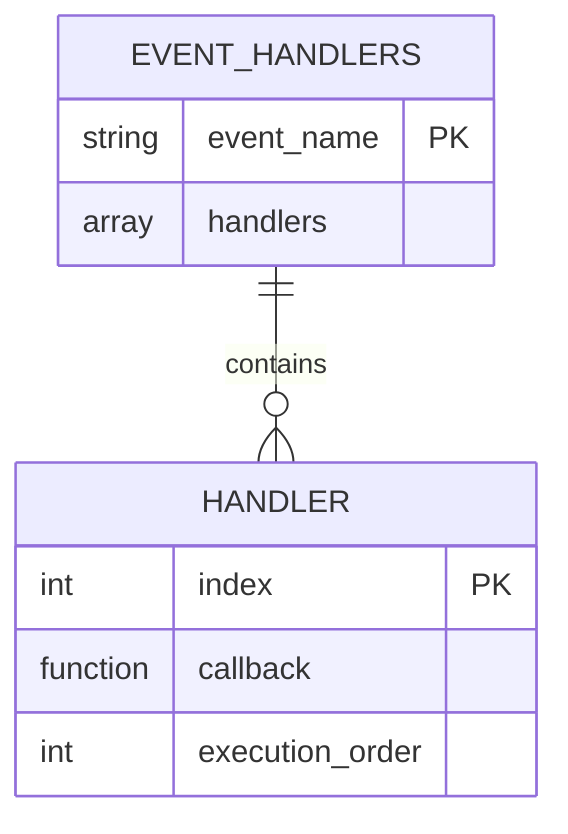
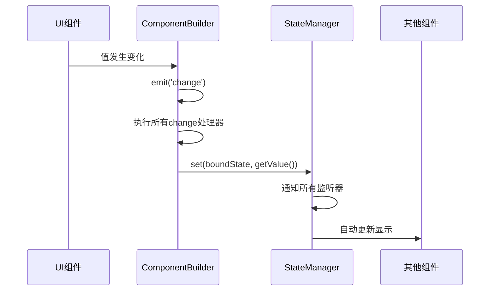

# 事件系统

<cite>
**本文档引用的文件**
- [ComponentBuilder.php](file://src/ComponentBuilder.php)
- [StateManager.php](file://src/State/StateManager.php)
- [ButtonBuilder.php](file://src/Components/ButtonBuilder.php)
- [EntryBuilder.php](file://src/Components/EntryBuilder.php)
- [Html5RendererTest.php](file://tests/Html5RendererTest.php)
- [StateHelperTest.php](file://tests/StateHelperTest.php)
</cite>

## 目录
1. [事件系统概述](#事件系统概述)
2. [on() 方法：事件处理器注册机制](#on-方法事件处理器注册机制)
3. [emit() 方法：事件触发与回调执行](#emit-方法事件触发与回调执行)
4. [事件处理器存储结构](#事件处理器存储结构)
5. [change事件与状态管理联动机制](#change事件与状态管理联动机制)
6. [具体事件处理示例](#具体事件处理示例)
7. [事件传播机制限制](#事件传播机制限制)
8. [事件解绑与内存管理](#事件解绑与内存管理)

## 事件系统概述

libuiBuilder的事件系统为GUI组件提供了灵活的交互能力。该系统基于观察者模式，允许开发者通过`on()`方法注册事件处理器，通过`emit()`方法触发事件并执行相应的回调函数。事件系统与状态管理器（StateManager）深度集成，实现了数据驱动的UI更新机制。

**Section sources**
- [ComponentBuilder.php](file://src/ComponentBuilder.php#L148-L175)

## on() 方法：事件处理器注册机制

`on()`方法用于向组件注册事件处理器。该方法接受两个参数：事件名称和回调函数。当指定事件被触发时，注册的回调函数将被执行。

事件处理器采用数组结构存储，支持为同一事件注册多个处理器。这种设计提供了极大的灵活性，允许在不同上下文中为同一事件添加不同的处理逻辑。

```mermaid
flowchart TD
A["on(event, handler)"] --> B{事件处理器数组<br>eventHandlers[event]是否存在}
B --> |否| C[创建新的处理器数组]
B --> |是| D[直接使用现有数组]
C --> E[将处理器添加到数组]
D --> E
E --> F[返回组件实例<br>支持链式调用]
```

**Diagram sources**
- [ComponentBuilder.php](file://src/ComponentBuilder.php#L151-L158)

**Section sources**
- [ComponentBuilder.php](file://src/ComponentBuilder.php#L151-L158)

## emit() 方法：事件触发与回调执行

`emit()`方法用于触发指定事件并执行所有注册的处理器。该方法首先检查是否存在针对该事件注册的处理器，如果存在，则遍历处理器数组并依次执行每个回调函数。

回调函数执行时，会将组件实例作为第一个参数传递，后续参数可根据事件类型传递额外信息。这种设计使得处理器能够访问组件的完整状态和方法。

```mermaid
flowchart TD
A["emit(event, ...args)"] --> B{是否存在事件处理器<br>eventHandlers[event]}
B --> |否| C[结束]
B --> |是| D[遍历处理器数组]
D --> E[执行处理器<br>handler(this, ...args)]
E --> F{是否为change事件<br>且已绑定状态}
F --> |是| G[更新状态管理器中的值]
F --> |否| H[结束]
G --> H
```

**Diagram sources**
- [ComponentBuilder.php](file://src/ComponentBuilder.php#L163-L175)

**Section sources**
- [ComponentBuilder.php](file://src/ComponentBuilder.php#L163-L175)

## 事件处理器存储结构

事件处理器存储在组件的`eventHandlers`属性中，这是一个二维数组结构。数组的第一维以事件名称为键，第二维存储该事件的所有处理器函数。

这种存储结构支持多处理器机制，允许为同一事件注册多个独立的处理器。处理器按照注册顺序依次执行，确保了事件处理的可预测性。



**Diagram sources**
- [ComponentBuilder.php](file://src/ComponentBuilder.php#L22)

**Section sources**
- [ComponentBuilder.php](file://src/ComponentBuilder.php#L22)

## change事件与状态管理联动机制

当组件值发生改变时，会自动触发`change`事件。如果组件已通过`bind()`方法绑定到状态管理器，`emit()`方法会自动将最新的组件值同步到状态管理器中。

这种联动机制实现了双向数据绑定：状态变化会自动更新UI，UI交互也会自动更新状态。开发者无需手动管理状态同步，大大简化了表单处理等场景的代码复杂度。



**Diagram sources**
- [ComponentBuilder.php](file://src/ComponentBuilder.php#L172-L174)
- [StateManager.php](file://src/State/StateManager.php#L26-L37)

**Section sources**
- [ComponentBuilder.php](file://src/ComponentBuilder.php#L172-L174)
- [StateManager.php](file://src/State/StateManager.php#L26-L37)

## 具体事件处理示例

### 按钮点击事件处理

按钮组件通过`onClick`原生事件触发`click`事件。开发者可以使用`on('click')`方法注册处理器来响应用户点击。

```mermaid
flowchart TD
A[用户点击按钮] --> B[原生onClick事件触发]
B --> C[执行匿名函数]
C --> D[emit('click')]
D --> E[执行所有click处理器]
E --> F[处理器访问组件和状态管理器]
```

**Diagram sources**
- [ButtonBuilder.php](file://src/Components/ButtonBuilder.php#L28-L35)

**Section sources**
- [ButtonBuilder.php](file://src/Components/ButtonBuilder.php#L28-L35)

### 输入框变更事件处理

输入框组件监听原生`onChanged`事件，当用户输入内容时，会自动更新组件值并触发`change`事件。如果输入框已绑定状态，还会自动同步到状态管理器。

```mermaid
flowchart TD
A[用户输入文本] --> B[原生onChanged事件触发]
B --> C[获取新值Entry::text()]
C --> D[更新组件配置]
D --> E[emit('change', newValue)]
E --> F{是否绑定状态}
F --> |是| G[更新状态管理器]
F --> |否| H[结束]
G --> H
```

**Diagram sources**
- [EntryBuilder.php](file://src/Components/EntryBuilder.php#L38-L49)

**Section sources**
- [EntryBuilder.php](file://src/Components/EntryBuilder.php#L38-L49)

## 事件传播机制限制

当前事件系统不支持事件冒泡机制。事件仅在触发的组件内部处理，不会向父组件或祖先组件传播。这种设计简化了事件处理逻辑，避免了复杂的事件传播路径。

如果需要实现跨组件通信，推荐使用状态管理器作为中介，通过状态变化来通知其他组件更新，而不是依赖事件传播。

**Section sources**
- [ComponentBuilder.php](file://src/ComponentBuilder.php#L163-L175)

## 事件解绑与内存管理

目前事件系统未提供直接的事件解绑方法。为避免内存泄漏，建议遵循以下最佳实践：

1. 在组件生命周期结束时，考虑重置事件处理器数组
2. 避免在事件处理器中创建循环引用
3. 对于长期运行的应用，定期清理不再需要的组件及其事件处理器

未来版本可能会引入`off()`方法来显式解绑事件处理器，提供更精细的内存控制能力。

**Section sources**
- [ComponentBuilder.php](file://src/ComponentBuilder.php#L22)
- [StateManager.php](file://src/State/StateManager.php#L12)