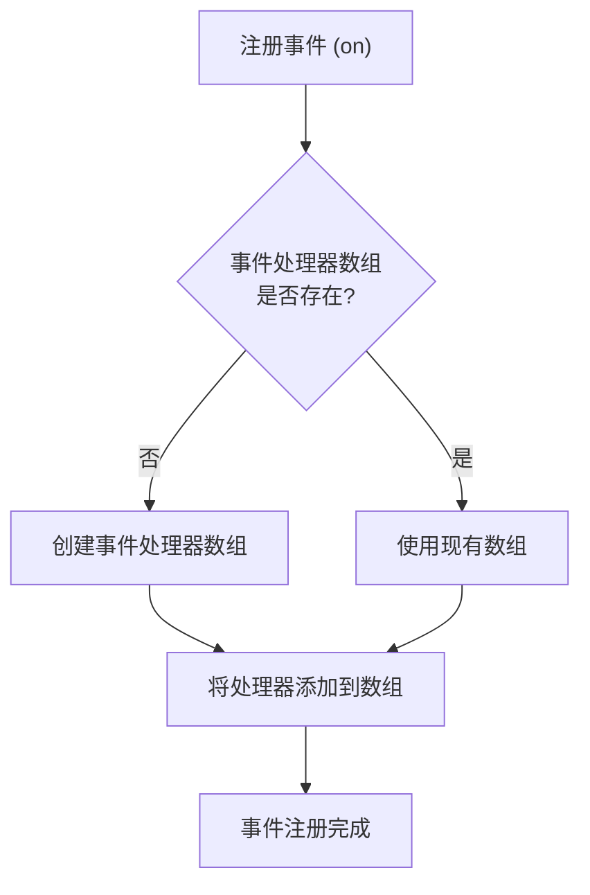
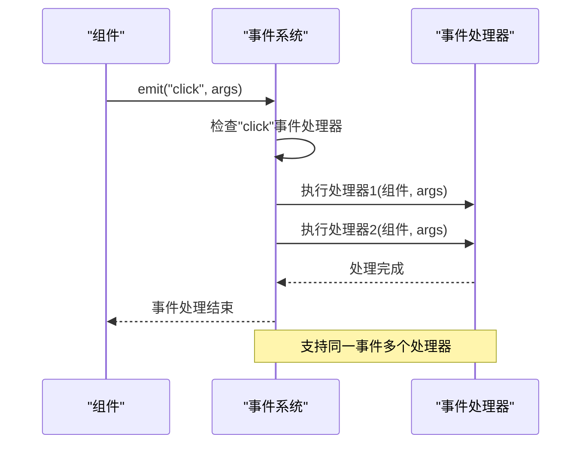
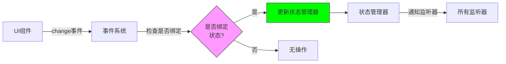
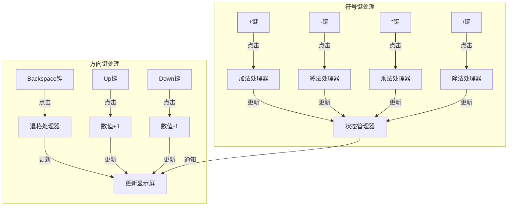

# 事件系统

<cite>
**本文档引用的文件**
- [ComponentBuilder.php](file://src/ComponentBuilder.php)
- [StateManager.php](file://src/State/StateManager.php)
- [ComponentRef.php](file://src/State/ComponentRef.php)
- [ButtonBuilder.php](file://src/Components/ButtonBuilder.php)
- [helper.php](file://src/helper.php)
- [calculator.php](file://example/calculator.php)
- [calculator.ui.html](file://example/views/calculator.ui.html)
- [HtmlRendererBasicTest.php](file://tests/HtmlRendererBasicTest.php)
- [README.md](file://README.md)
</cite>

## 目录
1. [事件系统概述](#事件系统概述)
2. [事件注册机制](#事件注册机制)
3. [事件触发与回调执行](#事件触发与回调执行)
4. [HTML模板中的事件绑定](#html模板中的事件绑定)
5. [事件处理器存储结构](#事件处理器存储结构)
6. [事件传播与状态同步](#事件传播与状态同步)
7. [复杂事件交互示例](#复杂事件交互示例)
8. [事件命名规范与作用域管理](#事件命名规范与作用域管理)
9. [异步处理注意事项](#异步处理注意事项)
10. [常见陷阱与解决方案](#常见陷阱与解决方案)

## 事件系统概述

libuiBuilder的事件系统提供了一套完整的事件处理机制，支持通过Builder API和HTML模板两种方式绑定事件处理器。系统采用观察者模式，实现了组件间的松耦合通信。事件系统与状态管理器深度集成，支持change事件自动更新绑定状态，确保UI与数据的一致性。

**Section sources**
- [README.md](file://README.md#L193-L249)

## 事件注册机制

在Builder API中，通过`on`方法绑定PHP回调函数。每个组件都继承了`ComponentBuilder`的`on`方法，该方法接收事件名称和可调用的回调函数作为参数。事件处理器被存储在组件的`eventHandlers`数组中，以事件名称为键，支持同一事件注册多个处理器。



**Diagram sources**
- [ComponentBuilder.php](file://src/ComponentBuilder.php#L151-L158)

**Section sources**
- [ComponentBuilder.php](file://src/ComponentBuilder.php#L151-L158)

## 事件触发与回调执行

事件通过`emit`方法触发，该方法遍历对应事件的所有处理器并依次执行。回调函数接收组件实例作为第一个参数，后续参数根据事件类型而定。对于HTML模板中的事件，系统会自动将onclick等属性映射到相应的事件处理器。



**Diagram sources**
- [ComponentBuilder.php](file://src/ComponentBuilder.php#L163-L169)

**Section sources**
- [ComponentBuilder.php](file://src/ComponentBuilder.php#L163-L169)

## HTML模板中的事件绑定

在HTML模板中，通过onclick、onchange等属性关联事件处理器。系统解析HTML时会提取这些属性，并将其映射到PHP定义的处理器函数。这种机制允许开发者在不修改PHP代码的情况下调整UI事件绑定。

```mermaid
flowchart TD
HTML["HTML模板"] --> |onclick=\"handleClick\"| Parser["HTML解析器"]
Parser --> |提取事件属性| EventMap["事件映射表"]
EventMap --> |handleClick| Handler["PHP处理器函数"]
Handler --> |执行| Action["执行相应操作"]
subgraph "HTML模板"
HTML
end
subgraph "PHP后端"
Handler
end
```

**Diagram sources**
- [calculator.ui.html](file://example/views/calculator.ui.html#L24-L27)
- [HtmlRendererBasicTest.php](file://tests/HtmlRendererBasicTest.php#L56-L80)

**Section sources**
- [calculator.ui.html](file://example/views/calculator.ui.html#L24-L27)
- [HtmlRendererBasicTest.php](file://tests/HtmlRendererBasicTest.php#L56-L80)

## 事件处理器存储结构

事件处理器以多维数组形式存储，第一层键为事件名称，第二层为处理器索引。这种结构支持同一事件注册多个处理器，并保持处理器的注册顺序。当事件触发时，系统按注册顺序依次执行所有处理器。

```mermaid
erDiagram
EVENT_HANDLERS {
string eventName PK
array handlersArray
}
HANDLER {
int index PK
callable callbackFunction
string eventType FK
}
EVENT_HANDLERS ||--o{ HANDLER : "contains"
class EVENT_HANDLERS "事件处理器容器"
class HANDLER "单个处理器"
```

**Diagram sources**
- [ComponentBuilder.php](file://src/ComponentBuilder.php#L153-L156)

**Section sources**
- [ComponentBuilder.php](file://src/ComponentBuilder.php#L153-L156)

## 事件传播与状态同步

事件系统与状态管理器深度集成，当组件绑定到状态且触发change事件时，会自动更新相应状态值。这种机制实现了双向数据绑定，确保UI变化能及时反映到应用状态中。



**Diagram sources**
- [ComponentBuilder.php](file://src/ComponentBuilder.php#L172-L174)

**Section sources**
- [ComponentBuilder.php](file://src/ComponentBuilder.php#L172-L174)

## 复杂事件交互示例

以计算器的方向键和符号键为例，展示复杂事件交互的实现方式。方向键实现数值增减和退格功能，符号键处理四则运算逻辑，通过状态管理器协调多个组件的状态变化。



**Diagram sources**
- [calculator.php](file://example/calculator.php#L98-L152)
- [calculator.ui.html](file://example/views/calculator.ui.html#L24-L45)

**Section sources**
- [calculator.php](file://example/calculator.php#L98-L152)
- [calculator.ui.html](file://example/views/calculator.ui.html#L24-L45)

## 事件命名规范与作用域管理

事件命名采用小写字母和连字符的组合，如"click"、"value-changed"等。处理器函数名通常以"handle"前缀开头，后接事件描述。系统通过组件ID和事件名称的组合确保事件作用域的唯一性，避免命名冲突。

**Section sources**
- [README.md](file://README.md#L203-L205)
- [calculator.php](file://example/calculator.php#L39-L45)

## 异步处理注意事项

事件处理器应在合理时间内完成执行，避免阻塞UI线程。对于耗时操作，建议使用异步处理或后台任务。所有状态更新都应在事件处理器中同步完成，确保状态一致性。

**Section sources**
- [calculator.php](file://example/calculator.php#L98-L152)

## 常见陷阱与解决方案

常见陷阱包括事件处理器内存泄漏、重复注册和作用域混淆。解决方案包括在适当时候清理处理器、使用唯一标识符和遵循命名规范。对于HTML模板中的事件，需确保处理器函数在PHP中正确定义。

**Section sources**
- [helper.php](file://src/helper.php#L107-L110)
- [StateManager.php](file://src/State/StateManager.php#L50-L56)