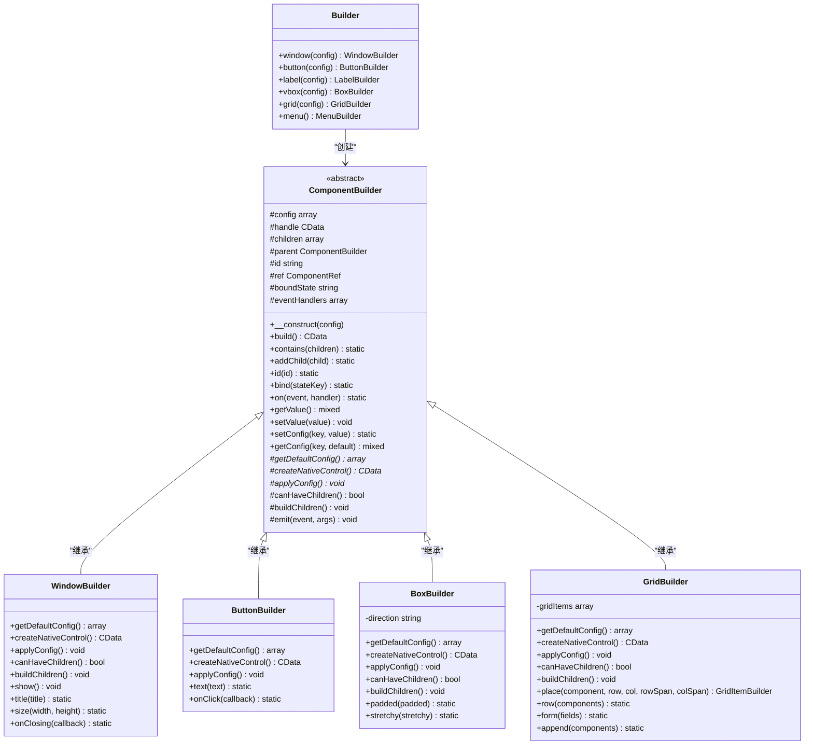
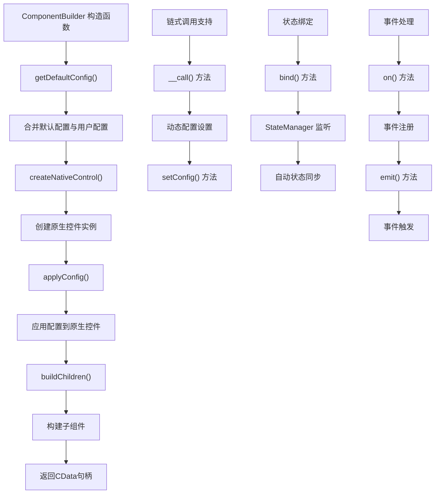
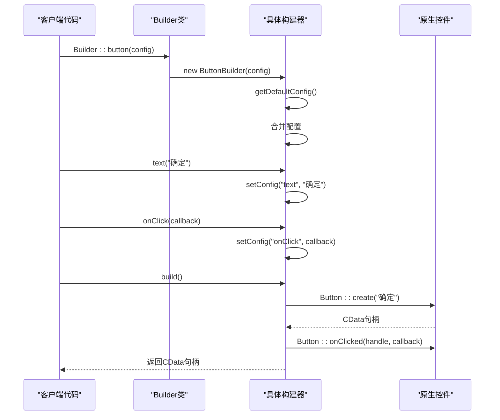
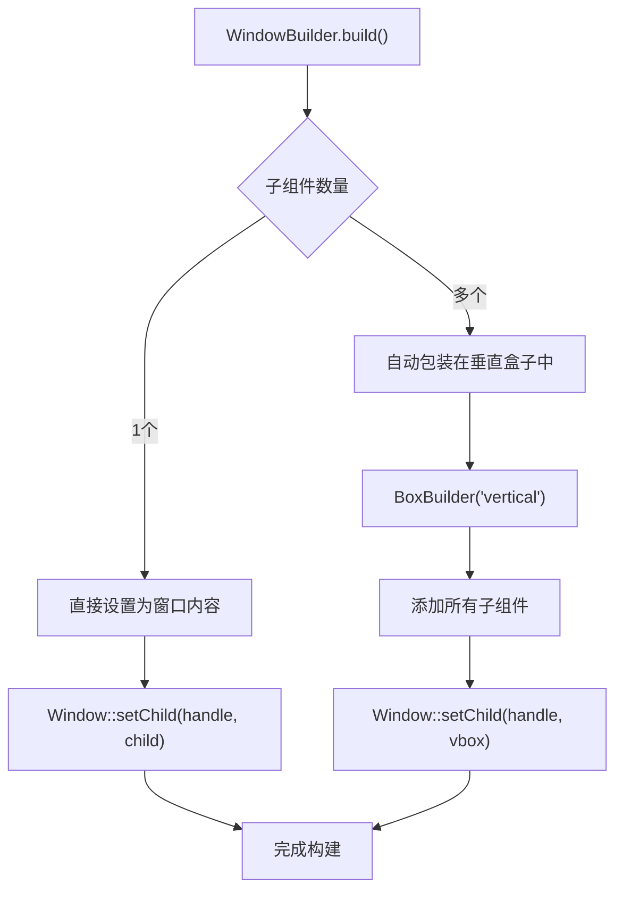
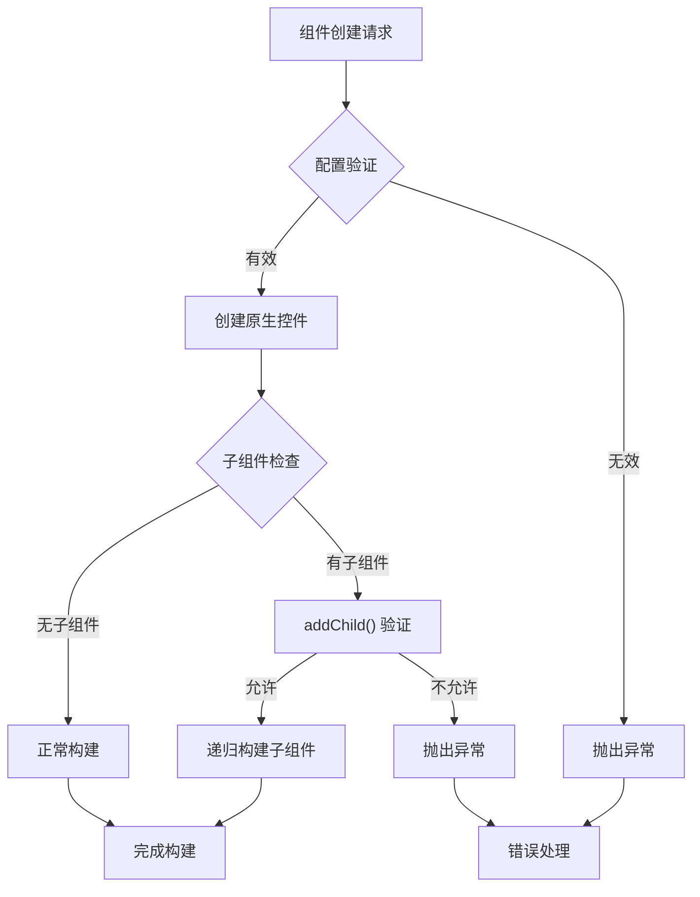

# 构建器模式

<cite>
**本文档中引用的文件**
- [ComponentBuilder.php](file://src/ComponentBuilder.php)
- [Builder.php](file://src/Builder.php)
- [WindowBuilder.php](file://src/Components/WindowBuilder.php)
- [ButtonBuilder.php](file://src/Components/ButtonBuilder.php)
- [BoxBuilder.php](file://src/Components/BoxBuilder.php)
- [GridBuilder.php](file://src/Components/GridBuilder.php)
- [LabelBuilder.php](file://src/Components/LabelBuilder.php)
- [StateManager.php](file://src/State/StateManager.php)
- [simple.php](file://example/simple.php)
- [full.php](file://example/full.php)
</cite>

## 目录
1. [引言](#引言)
2. [构建器模式概述](#构建器模式概述)
3. [ComponentBuilder抽象基类](#componentbuilder抽象基类)
4. [Builder工厂类](#builder工厂类)
5. [具体组件构建器实现](#具体组件构建器实现)
6. [构建器模式的优势](#构建器模式的优势)
7. [自定义组件开发指南](#自定义组件开发指南)
8. [实际应用示例](#实际应用示例)
9. [总结](#总结)

## 引言

libuiBuilder采用构建器模式（Builder Pattern）作为其核心架构设计，通过精心设计的组件层次结构实现了高度可配置、可扩展的UI构建系统。构建器模式在这里不仅提供了优雅的API设计，更重要的是确保了组件的一致性、可靠性和可维护性。

## 构建器模式概述

构建器模式是一种创建型设计模式，它允许你分步骤构造复杂的对象。在libuiBuilder中，这种模式被巧妙地应用于UI组件的创建和配置过程中。



**图表来源**
- [Builder.php](file://src/Builder.php#L27-L153)
- [ComponentBuilder.php](file://src/ComponentBuilder.php#L11-L234)
- [WindowBuilder.php](file://src/Components/WindowBuilder.php#L11-L96)
- [ButtonBuilder.php](file://src/Components/ButtonBuilder.php#L9-L48)
- [BoxBuilder.php](file://src/Components/BoxBuilder.php#L11-L64)
- [GridBuilder.php](file://src/Components/GridBuilder.php#L9-L120)

## ComponentBuilder抽象基类

ComponentBuilder是整个构建器体系的核心抽象基类，它定义了所有UI组件必须遵循的通用接口和行为规范。

### 核心属性和功能

ComponentBuilder包含了以下关键组件：

1. **配置管理系统**：通过`$config`数组管理组件的所有配置参数
2. **生命周期管理**：控制组件的创建、配置和渲染过程
3. **父子关系管理**：维护组件树结构，支持嵌套组件
4. **状态绑定机制**：与状态管理器集成，实现数据双向绑定
5. **事件处理系统**：提供统一的事件注册和触发机制

### 抽象方法设计

ComponentBuilder定义了三个核心抽象方法，要求所有子类必须实现：



**图表来源**
- [ComponentBuilder.php](file://src/ComponentBuilder.php#L25-L231)

### 统一的配置管理

ComponentBuilder提供了统一的配置管理机制，包括：

- **默认配置获取**：每个组件通过`getDefaultConfig()`方法提供默认配置
- **动态配置设置**：通过`setConfig()`和魔术方法`__call()`支持链式调用
- **配置值获取**：通过`getConfig()`方法安全地获取配置值
- **类型安全**：所有配置操作都经过类型检查和验证

**章节来源**
- [ComponentBuilder.php](file://src/ComponentBuilder.php#L25-L234)

## Builder工厂类

Builder类作为整个构建器系统的入口点，提供了静态工厂方法来创建各种具体组件实例。这种设计模式确保了组件创建的一致性和可预测性。

### 工厂方法分类

Builder类按照功能将组件分为以下几类：

1. **窗口组件**：`window()` - 创建主窗口
2. **容器组件**：`vbox()`, `hbox()`, `grid()`, `tab()` - 创建布局容器
3. **控件组件**：`button()`, `label()`, `entry()`, `checkbox()`等 - 创建交互控件
4. **便捷方法**：提供常用控件的快捷创建方式

### 工厂方法实现



**图表来源**
- [Builder.php](file://src/Builder.php#L29-L153)
- [ButtonBuilder.php](file://src/Components/ButtonBuilder.php#L57-L48)

**章节来源**
- [Builder.php](file://src/Builder.php#L27-L153)

## 具体组件构建器实现

### WindowBuilder - 窗口构建器

WindowBuilder是最复杂的构建器之一，负责创建应用程序的主窗口界面。

#### 核心特性

- **容器能力**：支持包含多个子组件
- **自动布局**：根据子组件数量自动选择布局策略
- **事件处理**：提供窗口关闭事件处理
- **显示控制**：封装窗口显示和应用启动流程

#### 实现细节

WindowBuilder通过重写`canHaveChildren()`和`buildChildren()`方法来实现容器功能：



**图表来源**
- [WindowBuilder.php](file://src/Components/WindowBuilder.php#L53-L71)

### ButtonBuilder - 按钮构建器

ButtonBuilder展示了构建器模式的简洁性和一致性。

#### 特性实现

- **默认配置**：提供合理的默认按钮配置
- **事件绑定**：支持点击事件处理
- **链式调用**：通过专门的方法提供语义化的API

### BoxBuilder - 布局面板构建器

BoxBuilder实现了水平和垂直布局容器的功能。

#### 关键特性

- **方向控制**：通过构造函数参数区分水平和垂直布局
- **子组件管理**：支持灵活的子组件添加和排列
- **间距控制**：提供内边距和拉伸属性配置

### GridBuilder - 网格布局构建器

GridBuilder是最复杂的布局构建器，提供了强大的网格布局功能。

#### 高级功能

- **网格项管理**：通过GridItemBuilder管理每个网格单元
- **灵活定位**：支持跨行跨列的复杂布局
- **模板方法**：提供表单布局的快速创建方法

**章节来源**
- [WindowBuilder.php](file://src/Components/WindowBuilder.php#L11-L96)
- [ButtonBuilder.php](file://src/Components/ButtonBuilder.php#L9-L48)
- [BoxBuilder.php](file://src/Components/BoxBuilder.php#L11-L64)
- [GridBuilder.php](file://src/Components/GridBuilder.php#L9-L120)

## 构建器模式的优势

### 链式调用支持

构建器模式最显著的优势之一是支持流畅的链式调用语法：

```php
// 链式调用示例
$button = Builder::button()
    ->text('确定')
    ->onClick(function($btn) {
        // 处理点击事件
    })
    ->disabled(false)
    ->build();
```

这种语法不仅提高了代码的可读性，还减少了中间变量的使用。

### 组件一致性保证

通过ComponentBuilder抽象基类，所有组件都遵循相同的设计原则：

1. **统一的生命周期**：所有组件都经历相同的创建、配置、渲染过程
2. **一致的API设计**：所有组件都提供相似的配置和事件处理接口
3. **标准化的状态管理**：组件间的状态绑定和事件通信机制统一

### 扩展性提升

构建器模式为系统提供了良好的扩展性：

1. **易于添加新组件**：只需继承ComponentBuilder并实现必要的抽象方法
2. **灵活的配置系统**：支持运行时动态修改组件配置
3. **插件化架构**：可以通过继承和组合创建复杂的复合组件

### 错误处理和验证

构建器模式内置了多种错误处理机制：



**图表来源**
- [ComponentBuilder.php](file://src/ComponentBuilder.php#L59-L68)

**章节来源**
- [ComponentBuilder.php](file://src/ComponentBuilder.php#L114-L120)
- [ComponentBuilder.php](file://src/ComponentBuilder.php#L61-L68)

## 自定义组件开发指南

### 开发步骤

创建自定义组件需要遵循以下步骤：

1. **继承ComponentBuilder**：创建新的构建器类并继承ComponentBuilder
2. **实现抽象方法**：实现`getDefaultConfig()`、`createNativeControl()`和`applyConfig()`
3. **添加专用方法**：为组件特性提供专门的链式调用方法
4. **注册到Builder**：在Builder类中添加工厂方法

### 示例：自定义计数器组件

```php
// 自定义计数器组件示例
class CounterBuilder extends ComponentBuilder
{
    protected function getDefaultConfig(): array
    {
        return [
            'value' => 0,
            'min' => 0,
            'max' => 100,
            'step' => 1,
            'onChange' => null,
        ];
    }
    
    protected function createNativeControl(): CData
    {
        // 创建原生计数器控件
        return Counter::create(
            $this->getConfig('value'),
            $this->getConfig('min'),
            $this->getConfig('max')
        );
    }
    
    protected function applyConfig(): void
    {
        // 应用配置到原生控件
        Counter::setStep($this->handle, $this->getConfig('step'));
        
        // 设置变更事件处理
        $onChange = $this->getConfig('onChange');
        if ($onChange) {
            Counter::onChange($this->handle, function($value) use ($onChange) {
                $this->emit('change', $value);
                $onChange($value, $this);
            });
        }
    }
    
    public function increment(): static
    {
        $current = $this->getValue();
        $max = $this->getConfig('max');
        $step = $this->getConfig('step');
        
        $newValue = min($current + $step, $max);
        return $this->setValue($newValue);
    }
    
    public function decrement(): static
    {
        $current = $this->getValue();
        $min = $this->getConfig('min');
        $step = $this->getConfig('step');
        
        $newValue = max($current - $step, $min);
        return $this->setValue($newValue);
    }
    
    public function onChange(callable $callback): static
    {
        return $this->setConfig('onChange', $callback);
    }
}
```

### 集成到Builder系统

```php
// 在Builder类中添加工厂方法
class Builder
{
    // ... 其他方法
    
    public static function counter(array $config = []): CounterBuilder
    {
        return new CounterBuilder($config);
    }
}
```

### 最佳实践

1. **配置验证**：在`getDefaultConfig()`中提供合理的默认值
2. **事件处理**：充分利用`emit()`方法触发事件
3. **状态绑定**：支持与状态管理器的集成
4. **文档注释**：为每个公共方法提供清晰的文档

**章节来源**
- [ComponentBuilder.php](file://src/ComponentBuilder.php#L33-L43)
- [ComponentBuilder.php](file://src/ComponentBuilder.php#L114-L120)

## 实际应用示例

### 简单表单示例

以下是一个完整的表单创建示例，展示了构建器模式在实际项目中的应用：

```php
// 创建一个完整的登录表单
$app = Builder::window()
    ->title('用户登录')
    ->size(400, 300)
    ->contains([
        Builder::grid()->form([
            [
                'label' => Builder::label()->text('用户名:'),
                'control' => Builder::entry()
                    ->id('username')
                    ->placeholder('请输入用户名')
                    ->validation(fn($value) => !empty(trim($value)))
            ],
            [
                'label' => Builder::label()->text('密码:'),
                'control' => Builder::passwordEntry()
                    ->id('password')
                    ->placeholder('请输入密码')
                    ->minLength(6)
            ]
        ])
        ->padded(true)
        ->columnSpacing(10)
        ->rowSpacing(8)
    ]);
```

### 复杂布局示例

```php
// 创建一个复杂的仪表板布局
$dashboard = Builder::window()
    ->title('系统仪表板')
    ->size(1200, 800)
    ->contains([
        Builder::vbox()->contains([
            // 顶部工具栏
            Builder::hbox()->contains([
                Builder::label()->text('系统监控面板'),
                Builder::spacer(),
                Builder::button()
                    ->text('刷新')
                    ->onClick(function($btn) {
                        // 刷新数据
                    })
            ]),
            
            // 主要内容区域
            Builder::grid()->contains([
                // 左侧导航
                Builder::grid()->row([
                    Builder::label()->text('系统状态'),
                    Builder::separator(),
                    Builder::label()->text('CPU使用率: 45%'),
                    Builder::label()->text('内存使用率: 60%'),
                    Builder::label()->text('磁盘使用率: 75%')
                ]),
                
                // 右侧图表区域
                Builder::canvas()
                    ->width(800)
                    ->height(400)
                    ->onDraw(function($canvas, $ctx) {
                        // 绘制图表
                    })
            ])
        ])
    ]);
```

### 状态管理集成

```php
// 使用状态管理器实现组件间的数据共享
$stateManager = StateManager::instance();

$app = Builder::window()
    ->title('实时数据监控')
    ->contains([
        Builder::vbox()->contains([
            // 数据显示区域
            Builder::label()
                ->id('cpuLabel')
                ->bind('cpuUsage')
                ->text('CPU使用率: 0%'),
                
            Builder::label()
                ->id('memoryLabel')
                ->bind('memoryUsage')
                ->text('内存使用率: 0%'),
                
            // 控制区域
            Builder::hbox()->contains([
                Builder::button()
                    ->text('开始监控')
                    ->onClick(function($btn) use ($stateManager) {
                        // 启动监控逻辑
                        $stateManager->set('monitoring', true);
                    }),
                    
                Builder::button()
                    ->text('停止监控')
                    ->onClick(function($btn) use ($stateManager) {
                        // 停止监控逻辑
                        $stateManager->set('monitoring', false);
                    })
            ])
        ])
    ]);
```

**章节来源**
- [simple.php](file://example/simple.php#L11-L142)
- [full.php](file://example/full.php#L12-L180)

## 总结

libuiBuilder的构建器模式实现展现了现代软件架构设计的最佳实践。通过ComponentBuilder抽象基类，系统实现了：

1. **统一的组件模型**：所有UI组件都遵循相同的设计原则和接口规范
2. **灵活的配置系统**：支持运行时动态修改组件配置
3. **强大的扩展能力**：开发者可以轻松创建自定义组件
4. **优雅的API设计**：链式调用语法提高了代码的可读性和开发效率
5. **完善的生命周期管理**：从创建到销毁的全过程都有明确的管理机制

这种设计不仅确保了系统的稳定性和可维护性，还为开发者提供了强大而灵活的工具来构建复杂的桌面应用程序界面。构建器模式的成功应用使得libuiBuilder成为一个既易于使用又功能强大的UI框架。