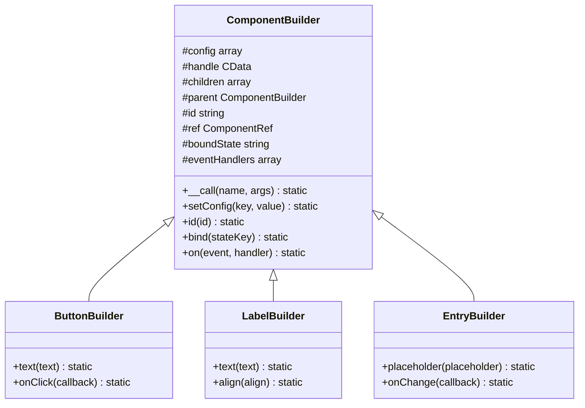
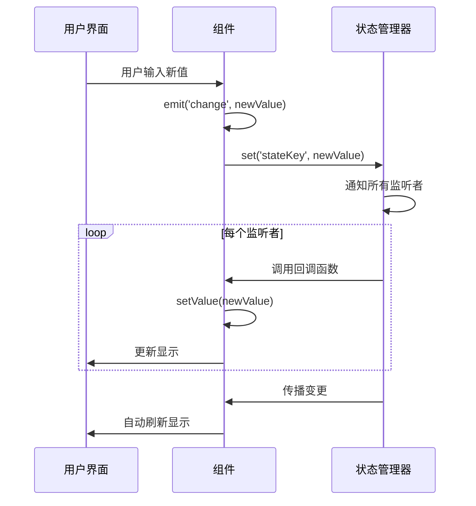
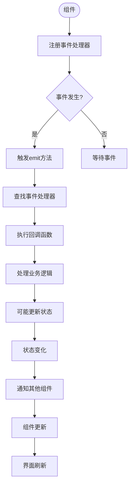
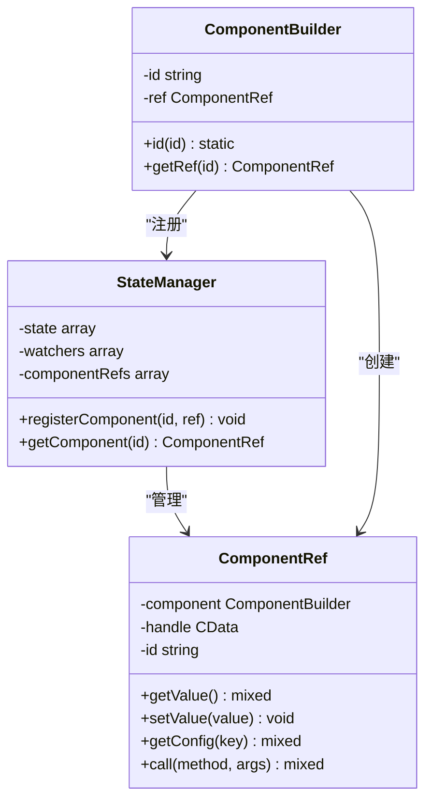

# 核心概念

<cite>
**本文档中引用的文件**
- [ComponentBuilder.php](file://src/ComponentBuilder.php)
- [StateManager.php](file://src/State/StateManager.php)
- [ComponentRef.php](file://src/State/ComponentRef.php)
- [helper.php](file://src/helper.php)
- [README.md](file://README.md)
</cite>

## 目录
1. [Builder模式设计原理](#builder模式设计原理)
2. [HTML模板系统工作机制](#html模板系统工作机制)
3. [状态管理解析](#状态管理解析)
4. [事件系统说明](#事件系统说明)
5. [组件引用系统解释](#组件引用系统解释)

## Builder模式设计原理

libuiBuilder框架的核心是基于构建器（Builder）模式的设计，通过ComponentBuilder基类实现链式调用。该基类定义了所有组件构建器的通用行为和属性，包括配置管理、子组件处理、事件绑定等。其继承体系以ComponentBuilder为根，派生出各种具体组件构建器，如ButtonBuilder、LabelBuilder等。

链式调用的关键在于`__call`魔术方法的实现。当调用一个不存在的方法时，PHP会自动触发`__call`方法，将方法名和参数传递给它。在ComponentBuilder中，`__call`方法检查参数数量，如果只有一个参数，则将其作为配置项的值，方法名作为配置项的键，通过`setConfig`方法存储到内部的`$config`数组中。最后返回`$this`，从而实现链式调用。

**图表来源**
- [ComponentBuilder.php](file://src/ComponentBuilder.php#L114-L120)
- [ButtonBuilder.php](file://src/Components/ButtonBuilder.php#L39-L47)
- [LabelBuilder.php](file://src/Components/LabelBuilder.php#L48-L56)

**章节来源**
- [ComponentBuilder.php](file://src/ComponentBuilder.php#L11-L234)

## HTML模板系统工作机制

HTML模板系统允许开发者使用熟悉的HTML语法来定义GUI界面，然后由HtmlRenderer将其解析为对应的原生GUI组件。系统通过解析HTML标签来创建相应的组件构建器实例，并将标签属性映射为组件的配置项。

```mermaid
flowchart TD
Start([开始解析HTML]) --> ParseTag{"解析标签"}
ParseTag --> IsWindow{"标签是<window>?"}
IsWindow --> |是| CreateWindow["创建WindowBuilder实例"]
IsWindow --> |否| IsGrid{"标签是<grid>?"}
IsGrid --> |是| CreateGrid["创建GridBuilder实例"]
IsGrid --> |否| IsInput{"标签是<input>?"}
IsInput --> |是| CreateEntry["创建EntryBuilder实例"]
IsInput --> |否| IsButton{"标签是<button>?"}
IsButton --> |是| CreateButton["创建ButtonBuilder实例"]
IsButton --> |否| OtherComponent["创建其他组件"]
CreateWindow --> SetAttributes["设置属性"]
CreateGrid --> SetAttributes
CreateEntry --> SetAttributes
CreateButton --> SetAttributes
OtherComponent --> SetAttributes
SetAttributes --> HandleRowCol{"存在row/col属性?"}
HandleRowCol --> |是| ApplyGridPosition["应用网格定位"]
HandleRowCol --> |否| Continue
SetAttributes --> HandleBind{"存在bind属性?"}
HandleBind --> |是| ApplyBinding["应用状态绑定"]
HandleBind --> |否| Continue
SetAttributes --> HandleOnclick{"存在onclick属性?"}
HandleOnclick --> |是| ApplyEventBinding["应用事件绑定"]
HandleOnclick --> |否| Continue
ApplyGridPosition --> Continue
ApplyBinding --> Continue
ApplyEventBinding --> Continue
Continue --> ProcessChildren{"有子元素?"}
ProcessChildren --> |是| ParseChildren["递归解析子元素"]
ProcessChildren --> |否| End([完成解析])
ParseChildren --> End
```

模板中的属性如`row`、`col`用于在网格布局中定位组件，`bind`属性用于将组件与状态管理器中的状态项进行双向绑定。例如，`<input bind="username"/>`会创建一个输入框，并将其值与名为"username"的状态项绑定。当输入框的值改变时，状态管理器中的"username"状态会自动更新；反之，当"username"状态改变时，输入框的显示值也会自动更新。

**图表来源**
- [README.md](file://README.md#L64-L83)
- [HtmlRendererBasicTest.php](file://tests/HtmlRendererBasicTest.php#L19-L108)

**章节来源**
- [README.md](file://README.md#L64-L83)

## 状态管理解析

状态管理由StateManager类实现，采用单例模式确保全局只有一个状态管理实例。它提供了`set`和`get`方法来设置和获取状态值，`watch`方法来监听状态变化，以及`update`方法来批量更新多个状态。

当组件通过`bind`方法绑定到某个状态项时，会在StateManager中注册一个监听器。一旦该状态项的值发生变化，监听器就会被触发，自动调用组件的`setValue`方法来更新其显示。反之，当组件的值发生变化（如用户输入），会触发`emit`方法，如果该组件绑定了状态，则会自动调用StateManager的`set`方法来更新状态值，从而实现双向绑定。

**图表来源**
- [StateManager.php](file://src/State/StateManager.php#L26-L36)
- [ComponentBuilder.php](file://src/ComponentBuilder.php#L141-L143)
- [ComponentBuilder.php](file://src/ComponentBuilder.php#L171-L174)

**章节来源**
- [StateManager.php](file://src/State/StateManager.php#L8-L91)
- [ComponentBuilder.php](file://src/ComponentBuilder.php#L136-L146)

## 事件系统说明

事件系统允许开发者为组件注册事件处理器，并在特定事件发生时触发这些处理器。通过`on`方法可以为组件注册事件处理器，事件类型如`click`、`change`等。当组件发生相应事件时，会调用`emit`方法触发所有注册的处理器。

在HTML模板中，可以通过`onclick`、`onchange`等属性来绑定事件处理器。这些属性的值是事件处理器的名称，需要在PHP代码中提供对应的回调函数。当用户与组件交互时，HtmlRenderer会查找并调用相应的处理器。

**图表来源**
- [ComponentBuilder.php](file://src/ComponentBuilder.php#L149-L158)
- [ButtonBuilder.php](file://src/Components/ButtonBuilder.php#L27-L35)
- [README.md](file://README.md#L200-L225)

**章节来源**
- [ComponentBuilder.php](file://src/ComponentBuilder.php#L149-L158)

## 组件引用系统解释

组件引用系统通过ComponentRef类实现，允许一个组件引用并操作另一个组件。通过`id`方法可以为组件创建引用，该方法会创建一个ComponentRef实例，并将其注册到StateManager中。之后，其他组件可以通过`getRef`方法获取该引用，从而访问和操作目标组件。

这种机制实现了跨组件通信和操作，例如一个按钮可以引用一个输入框，并在点击时读取或修改输入框的值。ComponentRef提供了`getValue`、`setValue`、`getConfig`和`call`等方法，使得引用组件可以像直接操作目标组件一样。

**图表来源**
- [ComponentBuilder.php](file://src/ComponentBuilder.php#L125-L131)
- [ComponentRef.php](file://src/State/ComponentRef.php#L46-L73)
- [StateManager.php](file://src/State/StateManager.php#L71-L82)

**章节来源**
- [ComponentBuilder.php](file://src/ComponentBuilder.php#L125-L131)
- [ComponentRef.php](file://src/State/ComponentRef.php#L1-L74)