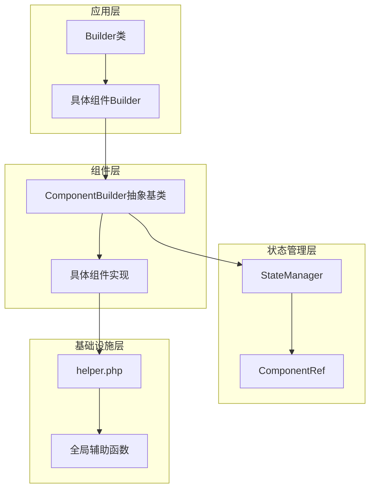
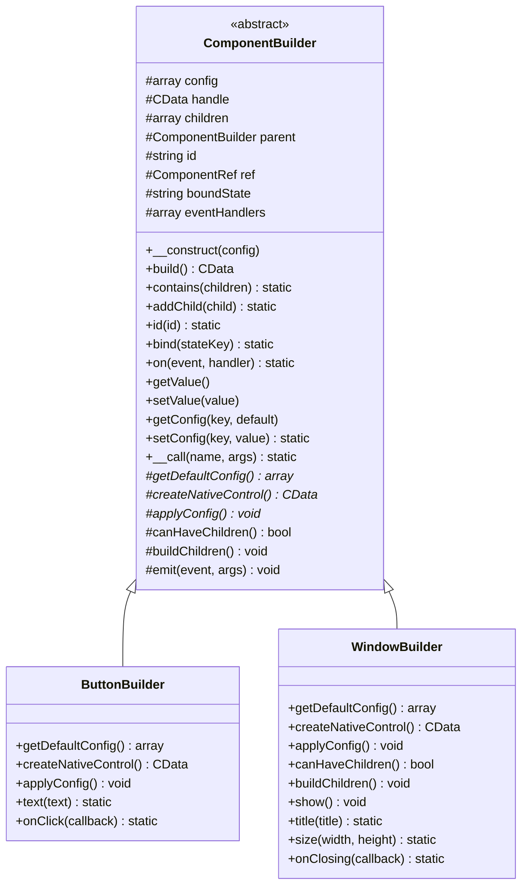
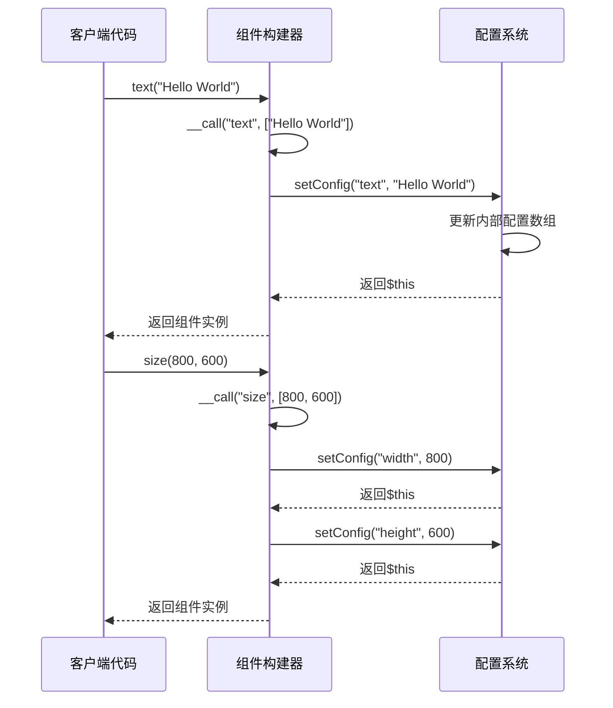
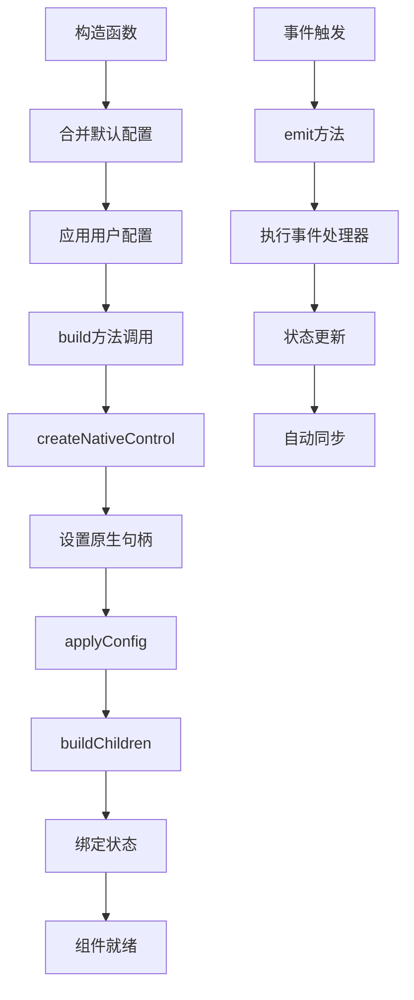
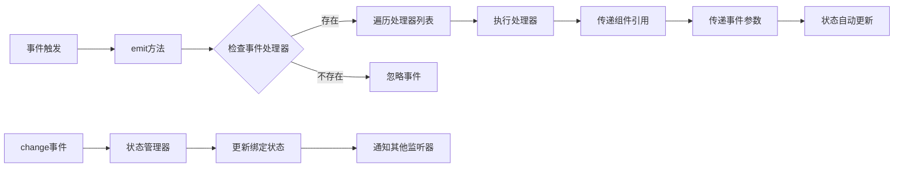
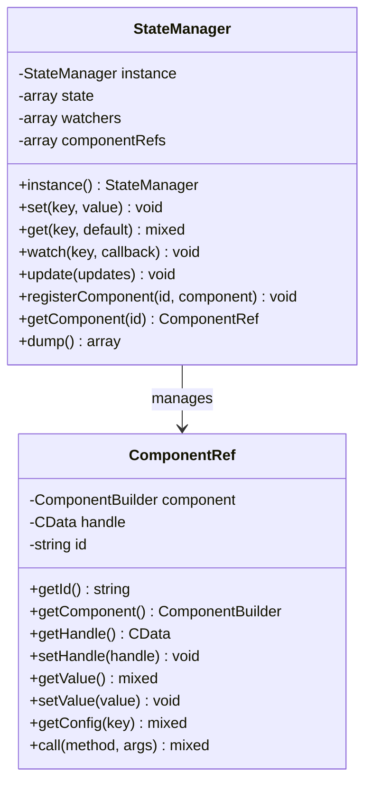
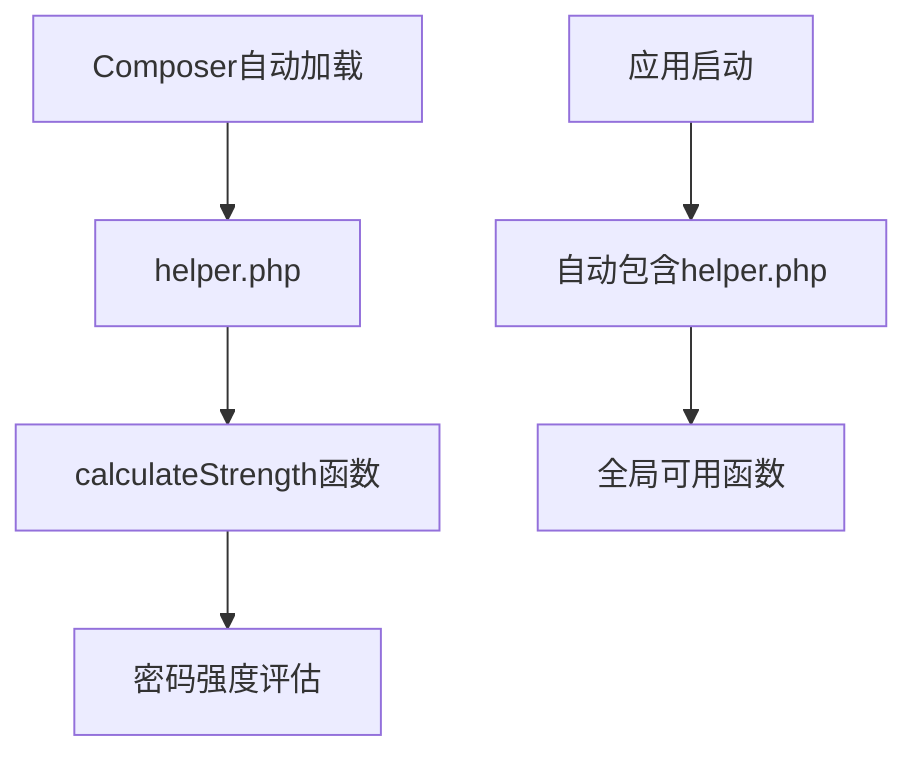
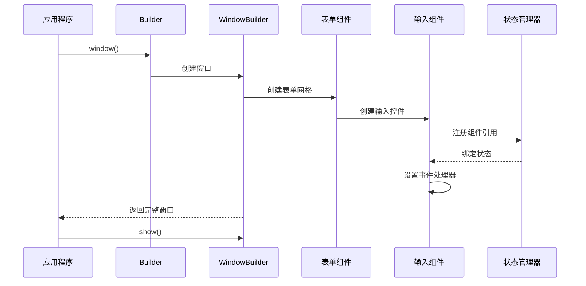

# libuiBuilder核心概念详解

<cite>
**本文档中引用的文件**
- [ComponentBuilder.php](file://src/ComponentBuilder.php)
- [Builder.php](file://src/Builder.php)
- [helper.php](file://src/helper.php)
- [ButtonBuilder.php](file://src/Components/ButtonBuilder.php)
- [WindowBuilder.php](file://src/Components/WindowBuilder.php)
- [StateManager.php](file://src/State/StateManager.php)
- [ComponentRef.php](file://src/State/ComponentRef.php)
- [composer.json](file://composer.json)
- [simple.php](file://example/simple.php)
- [full.php](file://example/full.php)
</cite>

## 目录
1. [项目概述](#项目概述)
2. [核心架构设计](#核心架构设计)
3. [构建器模式实现](#构建器模式实现)
4. [链式调用机制](#链式调用机制)
5. [组件生命周期](#组件生命周期)
6. [事件系统机制](#事件系统机制)
7. [状态管理系统](#状态管理系统)
8. [全局辅助函数](#全局辅助函数)
9. [实际应用示例](#实际应用示例)
10. [总结](#总结)

## 项目概述

libuiBuilder是一个基于PHP的GUI应用程序构建框架，它采用构建器模式（Builder Pattern）来简化libui库的使用。该项目提供了一套统一的API接口，让开发者能够以声明式的方式构建复杂的图形用户界面。

### 主要特性

- **统一的构建器接口**：所有UI组件都继承自`ComponentBuilder`抽象基类
- **流畅的API设计**：通过链式调用提供优雅的编程体验
- **状态管理**：内置的状态管理系统支持组件间的数据绑定
- **事件驱动**：完整的事件系统机制
- **自动加载**：Composer自动加载机制

## 核心架构设计

libuiBuilder采用了清晰的分层架构设计，主要包含以下几个层次：



**图表来源**
- [Builder.php](file://src/Builder.php#L27-L153)
- [ComponentBuilder.php](file://src/ComponentBuilder.php#L11-L234)
- [StateManager.php](file://src/State/StateManager.php#L8-L91)

### 架构特点

1. **抽象基类统一**：所有组件都继承自`ComponentBuilder`，确保一致的接口
2. **工厂模式**：`Builder`类作为工厂，负责创建各种组件实例
3. **依赖注入**：通过构造函数注入配置参数
4. **组合模式**：支持组件嵌套和组合

**章节来源**
- [Builder.php](file://src/Builder.php#L27-L153)
- [ComponentBuilder.php](file://src/ComponentBuilder.php#L11-L234)

## 构建器模式实现

### ComponentBuilder抽象基类

`ComponentBuilder`是整个框架的核心抽象基类，定义了所有UI组件的共同行为和接口：



**图表来源**
- [ComponentBuilder.php](file://src/ComponentBuilder.php#L11-L234)
- [ButtonBuilder.php](file://src/Components/ButtonBuilder.php#L9-L48)
- [WindowBuilder.php](file://src/Components/WindowBuilder.php#L11-L96)

### 关键属性说明

| 属性 | 类型 | 描述 |
|------|------|------|
| `$config` | array | 组件配置参数，包括默认值和用户设置 |
| `$handle` | CData | 原生UI控件的句柄（FFI指针） |
| `$children` | array | 子组件列表（仅容器组件使用） |
| `$parent` | ComponentBuilder | 父组件引用 |
| `$id` | string | 组件唯一标识符 |
| `$ref` | ComponentRef | 组件引用对象 |
| `$boundState` | string | 绑定的状态键名 |
| `$eventHandlers` | array | 事件处理器映射 |

**章节来源**
- [ComponentBuilder.php](file://src/ComponentBuilder.php#L13-L22)

## 链式调用机制

### __call()魔术方法实现

libuiBuilder最显著的特性之一是其流畅的API设计，这通过`__call()`魔术方法实现：



**图表来源**
- [ComponentBuilder.php](file://src/ComponentBuilder.php#L114-L119)

### 实现原理

1. **方法拦截**：`__call()`方法拦截所有未定义的方法调用
2. **参数处理**：检查参数数量，单参数调用直接传递给`setConfig()`
3. **返回$this**：每个方法都返回当前对象实例，支持链式调用
4. **类型安全**：通过静态类型提示确保类型安全

### 使用示例

```php
// 流畅的链式调用
$button = Builder::button()
    ->text('点击我')
    ->onClick(function($btn, $state) {
        // 处理点击事件
    })
    ->size(200, 50)
    ->margin(10);
```

**章节来源**
- [ComponentBuilder.php](file://src/ComponentBuilder.php#L114-L119)

## 组件生命周期

### 生命周期阶段

组件的生命周期包含以下关键阶段：



**图表来源**
- [ComponentBuilder.php](file://src/ComponentBuilder.php#L25-L231)

### 构造阶段

1. **配置初始化**：`__construct()`方法合并默认配置和用户配置
2. **默认配置**：每个组件都有自己的`getDefaultConfig()`方法
3. **配置验证**：确保配置参数的有效性

### 构建阶段

1. **原生控件创建**：`createNativeControl()`方法创建底层UI控件
2. **句柄设置**：将原生句柄存储到`$handle`属性
3. **配置应用**：`applyConfig()`方法将配置应用到原生控件
4. **子组件处理**：`buildChildren()`方法递归构建子组件

### 状态绑定

当组件绑定到状态管理器时：
1. **初始值设置**：从状态管理器获取初始值并应用
2. **监听变化**：注册状态变化监听器
3. **自动更新**：状态变化时自动更新组件值

**章节来源**
- [ComponentBuilder.php](file://src/ComponentBuilder.php#L25-L231)

## 事件系统机制

### 事件系统架构

libuiBuilder实现了完整的事件系统，支持多种事件类型和处理器：



**图表来源**
- [ComponentBuilder.php](file://src/ComponentBuilder.php#L160-L175)

### 事件注册

通过`on()`方法注册事件处理器：

```php
// 注册点击事件处理器
$button->on('click', function($component, $state) {
    // 处理点击事件
});

// 注册变更事件处理器
$input->on('change', function($newValue, $component) {
    // 处理值变更
});
```

### 事件触发

`emit()`方法负责触发事件：

1. **事件名称**：指定要触发的事件类型
2. **参数传递**：向处理器传递必要的参数
3. **状态联动**：对于`change`事件，自动更新绑定的状态

### change事件与状态管理

当组件触发`change`事件时，会自动更新绑定的状态：

```php
// 绑定状态
$component->bind('userName');

// 当组件值改变时，自动更新状态
$component->emit('change', $newValue);
// 等价于：StateManager::instance()->set('userName', $newValue);
```

**章节来源**
- [ComponentBuilder.php](file://src/ComponentBuilder.php#L149-L175)

## 状态管理系统

### StateManager核心功能

状态管理器是libuiBuilder的核心组件，提供全局状态共享和组件间通信能力：



**图表来源**
- [StateManager.php](file://src/State/StateManager.php#L8-L91)
- [ComponentRef.php](file://src/State/ComponentRef.php#L11-L74)

### 状态管理功能

| 功能 | 方法 | 描述 |
|------|------|------|
| 状态设置 | `set(key, value)` | 设置状态值并通知监听器 |
| 状态获取 | `get(key, default)` | 获取状态值，支持默认值 |
| 状态监听 | `watch(key, callback)` | 监听状态变化 |
| 批量更新 | `update(updates)` | 批量更新多个状态 |
| 组件注册 | `registerComponent(id, ref)` | 注册组件引用 |
| 组件查找 | `getComponent(id)` | 通过ID获取组件引用 |

### 组件引用机制

`ComponentRef`类提供了对其他组件的安全访问：

1. **代理访问**：通过引用对象访问组件方法
2. **类型安全**：提供类型提示和验证
3. **延迟初始化**：组件句柄在构建时才设置

**章节来源**
- [StateManager.php](file://src/State/StateManager.php#L26-L91)
- [ComponentRef.php](file://src/State/ComponentRef.php#L11-L74)

## 全局辅助函数

### helper.php的作用

`helper.php`文件提供了全局可用的辅助函数，通过Composer的自动加载机制提供便利功能：



**图表来源**
- [helper.php](file://src/helper.php#L1-L59)
- [composer.json](file://composer.json#L15-L17)

### 密码强度计算函数

`calculateStrength()`函数提供了密码强度评估功能：

#### 评估标准

| 条件 | 分数 | 描述 |
|------|------|------|
| 长度 ≥ 6 | +1 | 基础长度要求 |
| 长度 ≥ 8 | +1 | 更高长度要求 |
| 包含小写字母 | +1 | 字母多样性 |
| 包含大写字母 | +1 | 字母多样性 |
| 包含数字 | +1 | 数字要求 |
| 包含特殊字符 | +1 | 特殊字符要求 |

#### 强度等级

- **弱**：0-2分
- **中**：3-4分  
- **强**：5-6分

### 自动加载机制

通过Composer的`autoload.files`配置，`helper.php`文件会在应用启动时自动包含：

```json
{
    "autoload": {
        "files": ["src/helper.php"]
    }
}
```

**章节来源**
- [helper.php](file://src/helper.php#L1-L59)
- [composer.json](file://composer.json#L15-L17)

## 实际应用示例

### 简单表单示例

参考`simple.php`示例，展示了完整的表单构建流程：



**图表来源**
- [simple.php](file://example/simple.php#L11-L142)

### 复杂控件演示

参考`full.php`示例，展示了各种控件的使用：

1. **输入控件**：单行输入、多行输入、密码输入
2. **选择控件**：复选框、单选框、下拉选择
3. **数值控件**：数字输入框、滑动条
4. **显示控件**：标签、进度条
5. **控制按钮**：提交、重置按钮

### 状态绑定实战

在示例中可以看到状态绑定的实际应用：

```php
// 绑定状态到输入框
$input->bind('userName');

// 在事件处理器中访问其他组件
$agreeCheckbox->onToggle(function($checked, $component) {
    $submitBtn = StateManager::instance()->getComponent('submitBtn');
    $submitBtn->getComponent()->setConfig('disabled', !$checked);
});
```

**章节来源**
- [simple.php](file://example/simple.php#L11-L142)
- [full.php](file://example/full.php#L12-L180)

## 总结

libuiBuilder通过精心设计的架构和模式，为PHP开发者提供了一个强大而易用的GUI构建框架：

### 核心优势

1. **统一的抽象**：所有组件继承自`ComponentBuilder`，确保一致的接口
2. **流畅的API**：通过链式调用和`__call()`方法提供优雅的编程体验
3. **强大的事件系统**：完整的事件机制支持响应式编程
4. **智能的状态管理**：自动化的状态绑定和组件间通信
5. **模块化设计**：清晰的职责分离和可扩展的架构

### 设计亮点

- **构建器模式**：完美封装了UI组件的创建过程
- **链式调用**：提供类似jQuery的流畅API体验
- **事件驱动**：支持响应式和事件驱动的编程范式
- **状态管理**：内置的全局状态管理器
- **自动加载**：Composer集成的自动加载机制

libuiBuilder不仅是一个GUI构建框架，更是现代PHP GUI开发的最佳实践体现，为开发者提供了既强大又易用的工具来构建复杂的桌面应用程序。