# 状态管理

<cite>
**本文档中引用的文件**
- [StateManager.php](file://src/State/StateManager.php)
- [ComponentBuilder.php](file://src/ComponentBuilder.php)
- [ComponentRef.php](file://src/State/ComponentRef.php)
- [calculator.php](file://example/calculator.php)
- [calculator.ui.html](file://example/views/calculator.ui.html)
- [StateManagerBasicTest.php](file://tests/StateManagerBasicTest.php)
- [ComponentRefTest.php](file://tests/ComponentRefTest.php)
- [StateHelperTest.php](file://tests/StateHelperTest.php)
- [helper.php](file://src/helper.php)
- [EntryBuilder.php](file://src/Components/EntryBuilder.php)
- [ButtonBuilder.php](file://src/Components/ButtonBuilder.php)
</cite>

## 目录
1. [简介](#简介)
2. [项目结构](#项目结构)
3. [StateManager单例模式实现](#statemanager单例模式实现)
4. [核心方法详解](#核心方法详解)
5. [watch监听器机制](#watch监听器机制)
6. [组件绑定系统](#组件绑定系统)
7. [计算器示例分析](#计算器示例分析)
8. [高级用法与优化](#高级用法与优化)
9. [性能考量与调试](#性能考量与调试)
10. [总结](#总结)

## 简介

LibuiBuilder的状态管理系统是一个基于单例模式的全局状态共享中心，采用响应式编程范式，实现了数据的双向绑定和自动更新。该系统通过StateManager类提供核心状态管理功能，结合ComponentBuilder的bind方法实现组件与状态的自动关联，为构建响应式用户界面提供了强大的基础设施。

## 项目结构

状态管理系统的架构围绕以下核心组件展开：

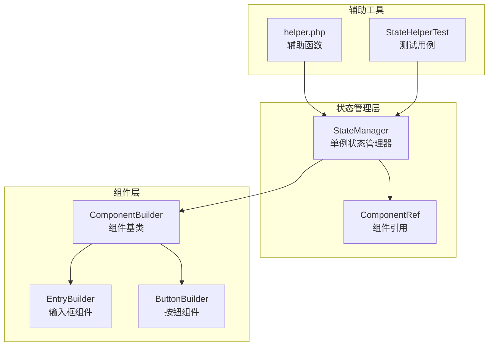

**图表来源**
- [StateManager.php](file://src/State/StateManager.php#L1-L91)
- [ComponentBuilder.php](file://src/ComponentBuilder.php#L1-L234)
- [ComponentRef.php](file://src/State/ComponentRef.php#L1-L74)

**章节来源**
- [StateManager.php](file://src/State/StateManager.php#L1-L91)
- [ComponentBuilder.php](file://src/ComponentBuilder.php#L1-L234)

## StateManager单例模式实现

StateManager采用了经典的单例模式实现，确保整个应用程序中只有一个状态管理器实例存在。

### 单例模式设计

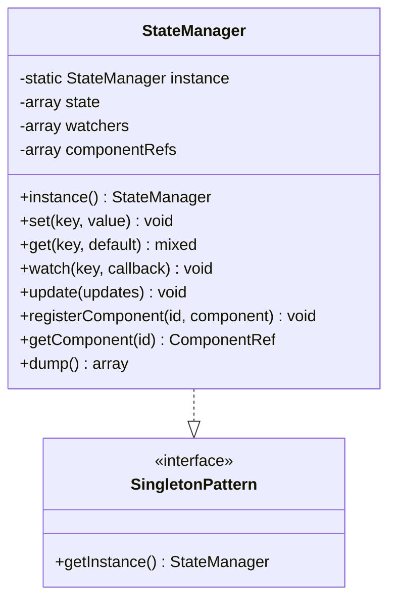

**图表来源**
- [StateManager.php](file://src/State/StateManager.php#L10-L21)

### 实现细节

单例模式的核心实现位于第15-21行，通过静态属性 `$instance` 和 `instance()` 方法确保全局唯一性：

- **延迟初始化**：只有在首次调用 `instance()` 时才创建实例
- **线程安全**：PHP环境下的单例模式天然具备线程安全性
- **内存管理**：实例在整个应用程序生命周期内保持存在

**章节来源**
- [StateManager.php](file://src/State/StateManager.php#L15-L21)

## 核心方法详解

### set方法 - 状态设置机制

set方法负责设置状态值并触发相应的监听器通知：

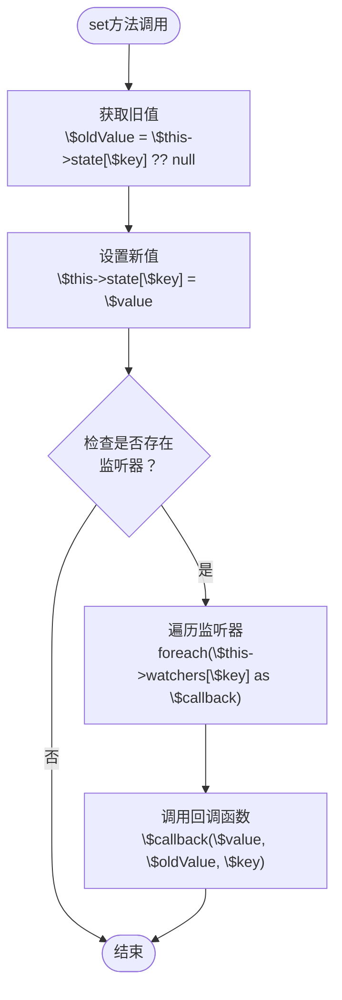

**图表来源**
- [StateManager.php](file://src/State/StateManager.php#L26-L36)

### get方法 - 状态获取机制

get方法提供灵活的状态值获取，支持默认值参数：

- **键值查找**：从 `$state` 数组中查找指定键
- **默认值处理**：当键不存在时返回提供的默认值或null
- **类型安全**：返回值类型与设置时一致

### update方法 - 批量更新优化

update方法实现了批量状态更新，避免多次调用set方法带来的性能开销：

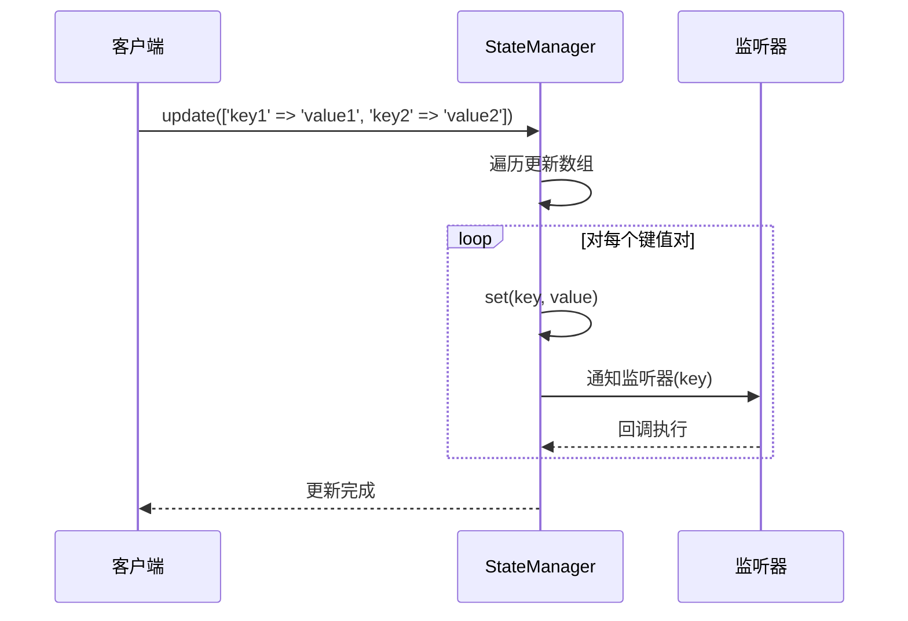

**图表来源**
- [StateManager.php](file://src/State/StateManager.php#L61-L66)

**章节来源**
- [StateManager.php](file://src/State/StateManager.php#L26-L66)

## watch监听器机制

watch方法实现了响应式编程的核心监听机制，当特定状态发生变化时自动触发回调函数。

### 监听器注册流程

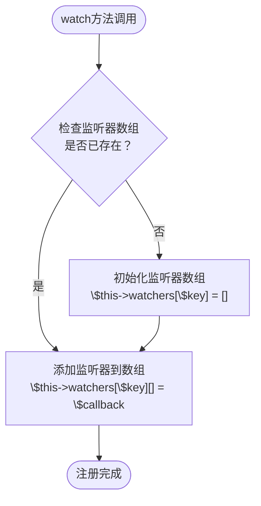

**图表来源**
- [StateManager.php](file://src/State/StateManager.php#L50-L56)

### 监听器通知机制

当状态发生变化时，StateManager会自动遍历对应键的所有监听器并依次调用：

- **回调参数**：新值、旧值、键名
- **执行顺序**：按注册顺序依次执行
- **异常处理**：单个监听器异常不影响其他监听器

### 监听器内存管理

监听器系统具有良好的内存管理特性：
- **弱引用**：监听器函数作为回调存储，不持有状态管理器引用
- **垃圾回收**：当监听器不再被外部引用时可被自动回收
- **清理机制**：可通过重新赋值清空监听器数组

**章节来源**
- [StateManager.php](file://src/State/StateManager.php#L50-L56)
- [StateManagerBasicTest.php](file://tests/StateManagerBasicTest.php#L42-L60)

## 组件绑定系统

ComponentBuilder提供了完整的组件绑定机制，实现了状态与UI组件的自动同步。

### bind方法实现

bind方法建立了组件与状态键之间的关联：

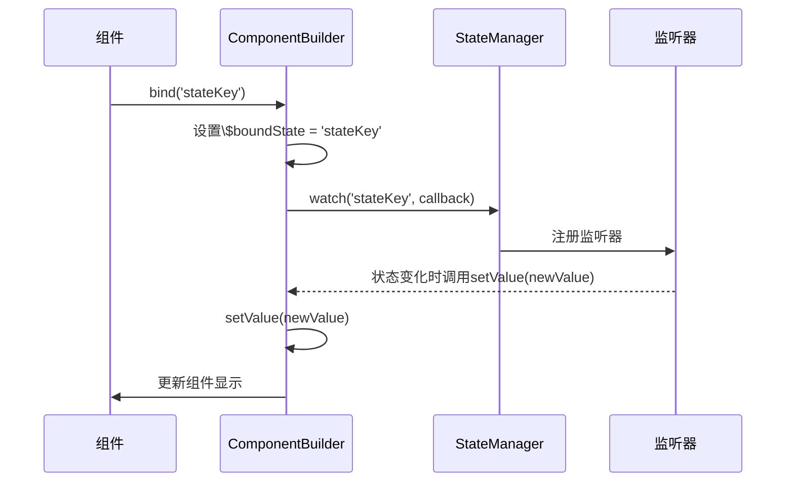

**图表来源**
- [ComponentBuilder.php](file://src/ComponentBuilder.php#L136-L146)

### 自动更新机制

当绑定的状态发生变化时，组件会自动更新其显示内容：

1. **状态监听**：组件注册状态变化监听器
2. **回调触发**：状态变化时调用setValue方法
3. **组件更新**：setValue方法更新组件配置和显示

### 双向数据绑定

系统支持双向数据绑定，不仅状态变化会更新组件，组件值的变化也会同步回状态：

```mermaid
flowchart LR
subgraph "状态→组件"
A[状态变化] --> B[监听器触发]
B --> C[setValue更新组件]
end
subgraph "组件→状态"
D[组件值变化] --> E[emit('change')]
E --> F[自动更新状态]
end
G[双向绑定] -.-> A
G -.-> D
```

**图表来源**
- [ComponentBuilder.php](file://src/ComponentBuilder.php#L171-L174)

### 初始状态设置

组件构建过程中会自动设置初始状态值：

- **状态查询**：从StateManager获取绑定状态的当前值
- **条件判断**：仅当状态值存在时才进行初始设置
- **组件同步**：确保组件显示与状态保持一致

**章节来源**
- [ComponentBuilder.php](file://src/ComponentBuilder.php#L136-L174)
- [ComponentBuilder.php](file://src/ComponentBuilder.php#L222-L228)

## 计算器示例分析

计算器示例展示了状态管理系统在实际应用中的强大功能，特别是响应式UI更新的实现。

### 状态结构设计

计算器使用了四个核心状态变量：

| 状态键 | 类型 | 描述 | 默认值 |
|--------|------|------|--------|
| display | string | 显示屏内容 | '0' |
| previousValue | float/null | 前一个数值 | null |
| operation | string/null | 当前操作符 | null |
| waitingForNewValue | bool | 是否等待新值 | false |

### 组件绑定策略

```mermaid
graph TB
subgraph "显示屏组件"
Display[Entry组件]
Display --> BindDisplay[bind('display')]
end
subgraph "按钮组件"
ClearBtn[清除按钮]
NumberBtn[数字按钮]
OperationBtn[操作按钮]
EqualBtn[等于按钮]
end
subgraph "状态管理"
SM[StateManager]
SM --> Display
SM --> ClearBtn
SM --> NumberBtn
SM --> OperationBtn
SM --> EqualBtn
end
ClearBtn --> UpdateState[批量更新状态]
NumberBtn --> UpdateState
OperationBtn --> UpdateState
EqualBtn --> UpdateState
```

**图表来源**
- [calculator.php](file://example/calculator.php#L37-L46)
- [calculator.php](file://example/calculator.php#L83-L125)

### 事件处理与状态更新

计算器的每个按钮都有对应的事件处理器，这些处理器直接操作StateManager：

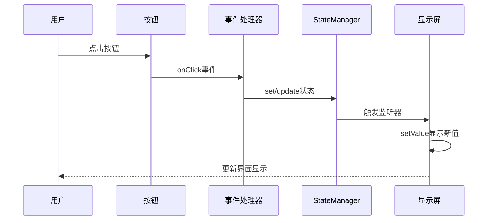

**图表来源**
- [calculator.php](file://example/calculator.php#L98-L104)
- [calculator.php](file://example/calculator.php#L165-L174)

### 响应式UI更新

显示器组件通过bind方法与'display'状态关联，实现了自动响应式更新：

- **状态驱动**：状态变化自动更新显示内容
- **格式化处理**：复杂的数字格式化逻辑由状态监听器处理
- **边界检查**：空值和特殊字符的处理确保界面稳定性

**章节来源**
- [calculator.php](file://example/calculator.php#L1-L238)
- [calculator.ui.html](file://example/views/calculator.ui.html#L1-L54)

## 高级用法与优化

### 批量更新优化

StateManager提供了update方法实现批量状态更新，显著提升性能：

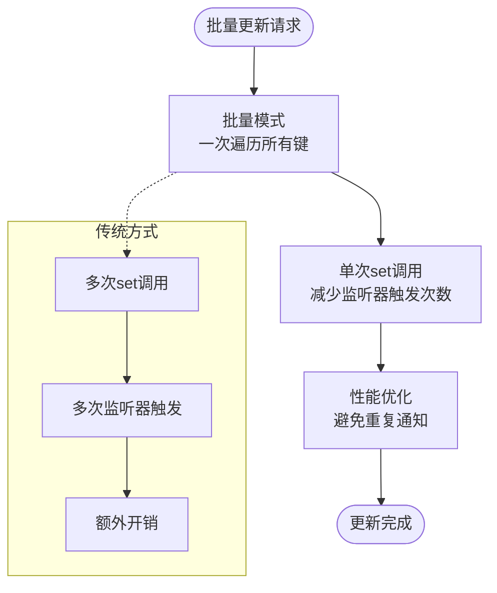

**图表来源**
- [StateManager.php](file://src/State/StateManager.php#L61-L66)

### 监听器内存管理

系统提供了多种监听器管理策略：

- **弱监听器**：监听器函数不持有状态管理器引用
- **动态注册**：运行时根据需要注册监听器
- **清理机制**：可通过重新赋值清空监听器数组

### 初始状态设置最佳实践

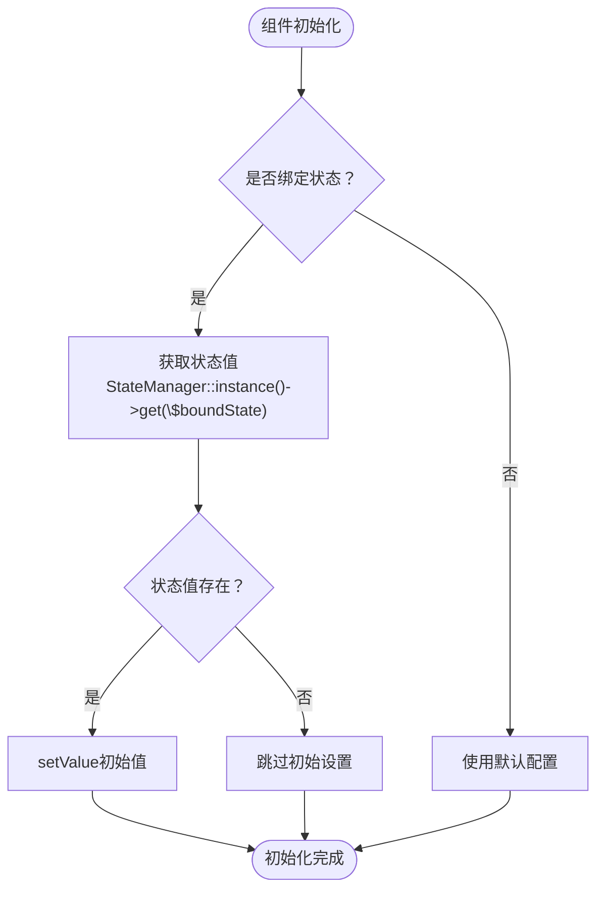

**图表来源**
- [ComponentBuilder.php](file://src/ComponentBuilder.php#L222-L228)

### 状态验证与约束

系统支持状态验证和约束机制：

- **监听器验证**：通过watch注册验证逻辑
- **格式化处理**：状态变化时自动格式化数据
- **边界检查**：防止无效状态值的产生

**章节来源**
- [StateManager.php](file://src/State/StateManager.php#L61-L66)
- [ComponentBuilder.php](file://src/ComponentBuilder.php#L222-L228)

## 性能考量与调试

### 性能优化策略

状态管理系统采用了多种性能优化技术：

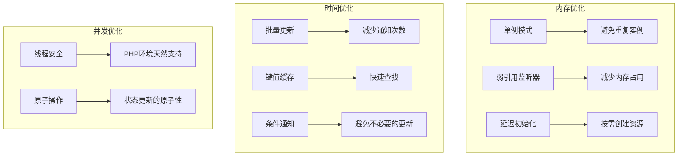

### 调试技巧

系统提供了多种调试和监控功能：

| 功能 | 方法 | 用途 | 示例 |
|------|------|------|------|
| 状态转储 | dump() | 查看所有状态值 | `$state = StateManager::instance()->dump()` |
| 监听器追踪 | watch() | 监听状态变化 | `watch('key', function($new, $old) {...})` |
| 组件引用 | getComponent() | 获取组件实例 | `$component = StateManager::instance()->getComponent('id')` |
| 错误处理 | 异常捕获 | 处理状态操作异常 | try-catch包装状态操作 |

### 常见性能问题与解决方案

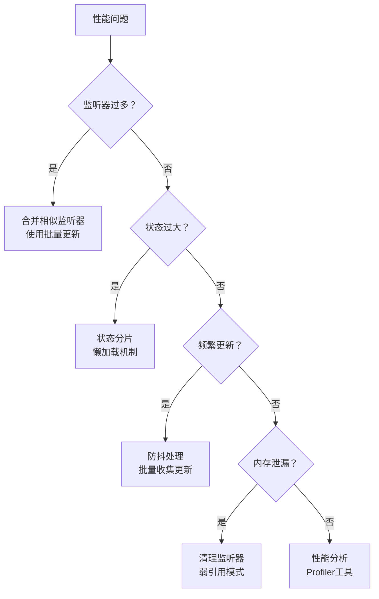

### 调试辅助函数

helper.php提供了便捷的调试函数：

- **state()函数**：简化状态操作
- **watch()函数**：简化监听器注册
- **辅助组件创建**：如input()和select()函数

**章节来源**
- [StateManager.php](file://src/State/StateManager.php#L87-L91)
- [helper.php](file://src/helper.php#L72-L110)
- [StateHelperTest.php](file://tests/StateHelperTest.php#L1-L182)

## 总结

LibuiBuilder的状态管理系统通过StateManager的单例模式实现，提供了完整而高效的状态管理解决方案。系统的核心优势包括：

### 技术特点

1. **单例模式**：确保全局唯一的状态管理器实例
2. **响应式编程**：通过watch监听器实现自动更新
3. **双向绑定**：支持状态到组件和组件到状态的双向同步
4. **批量优化**：update方法提供性能优化的批量更新
5. **组件集成**：与ComponentBuilder无缝集成，简化开发

### 应用价值

- **简化开发**：开发者无需手动管理组件状态同步
- **提高性能**：批量更新和智能通知机制优化性能
- **增强可维护性**：清晰的状态管理和组件绑定关系
- **扩展性强**：支持复杂的业务逻辑和状态验证

### 最佳实践建议

1. **合理设计状态结构**：避免过于复杂的状态层次
2. **及时清理监听器**：避免内存泄漏
3. **使用批量更新**：在需要更新多个状态时优先使用update方法
4. **适当的验证逻辑**：在状态变化时进行必要的验证和格式化

状态管理系统为构建现代响应式用户界面提供了坚实的基础，通过合理的架构设计和优化策略，能够支持从简单表单到复杂交互应用的各种需求。