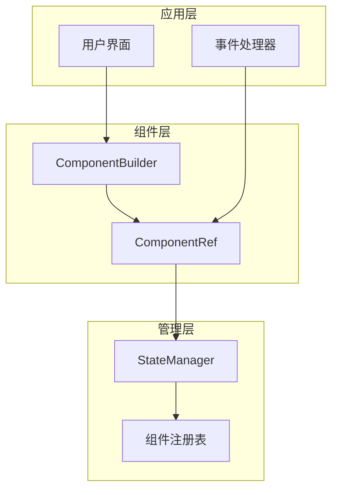
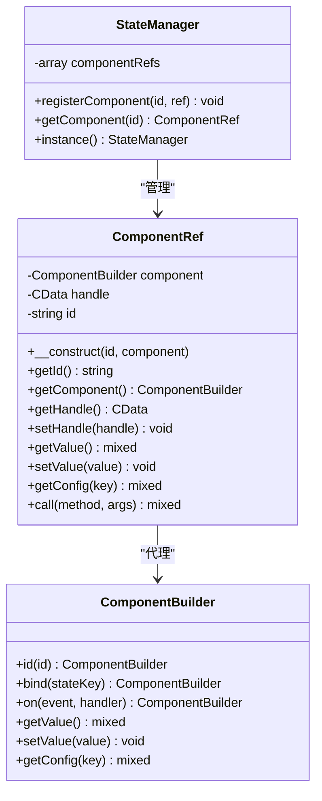
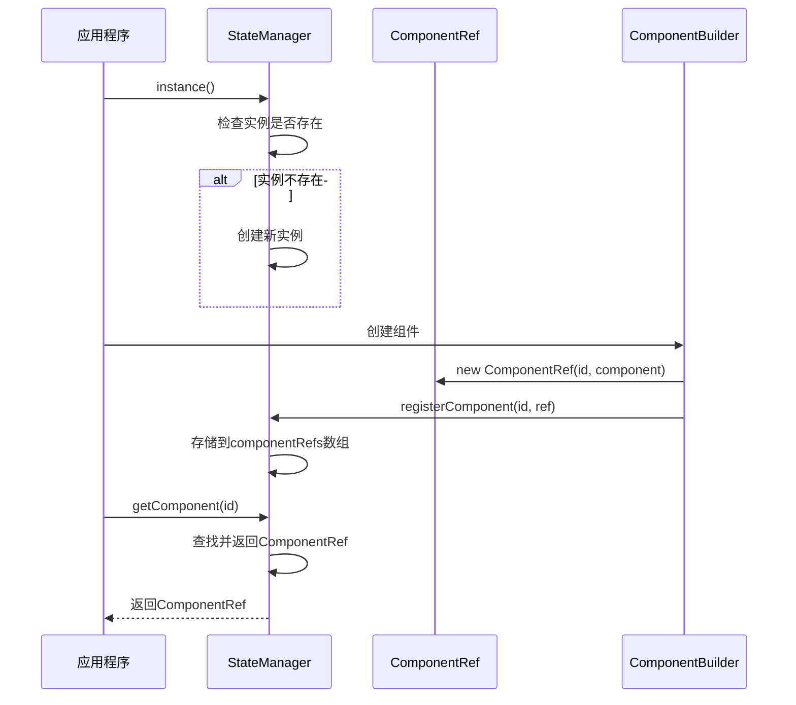
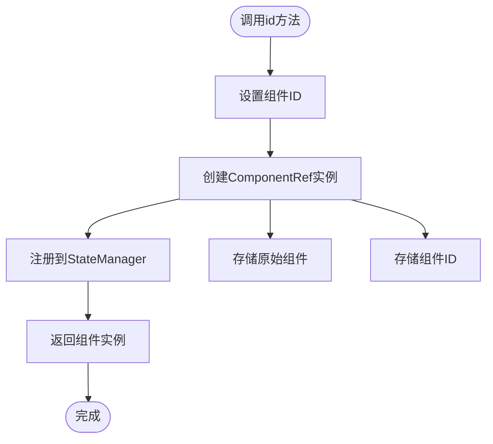
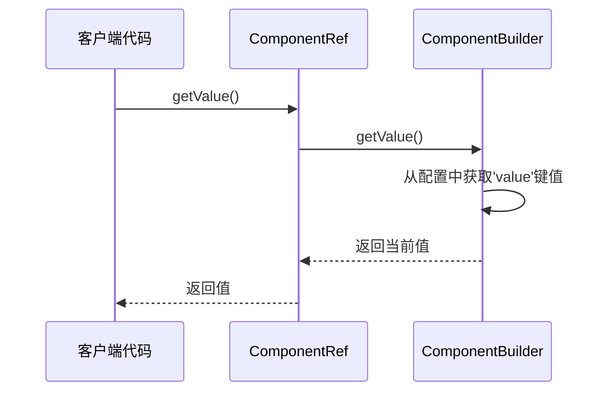
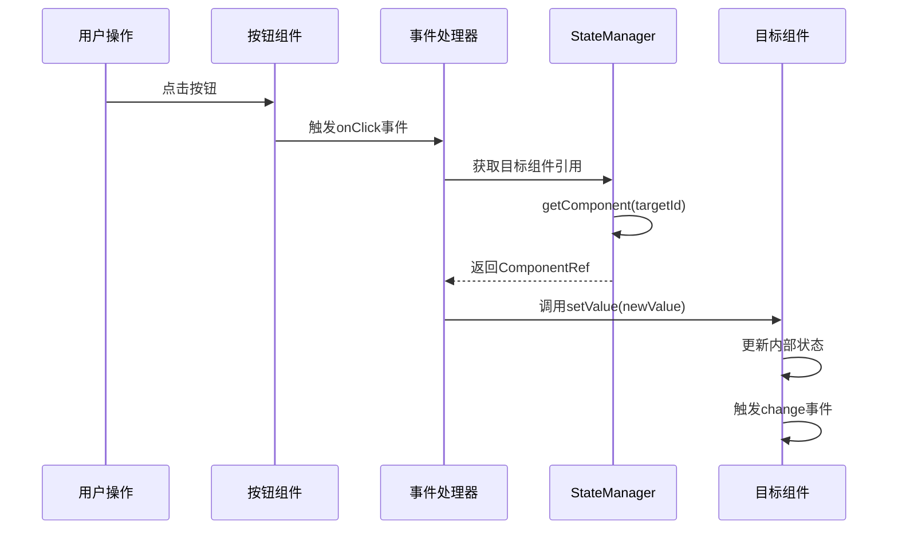
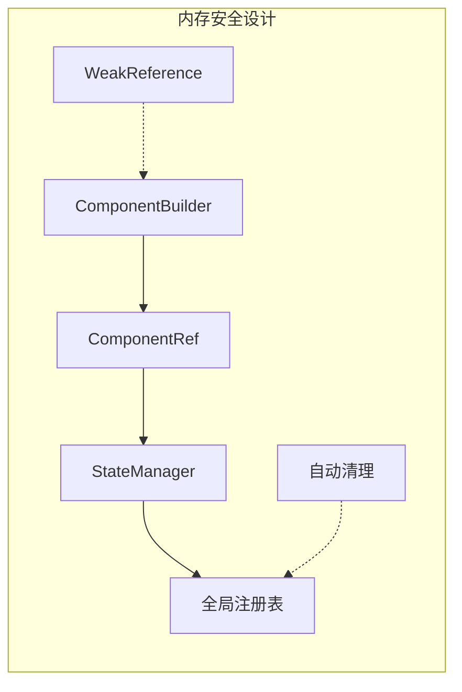
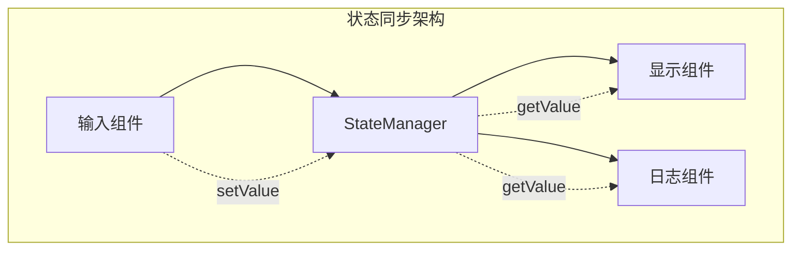
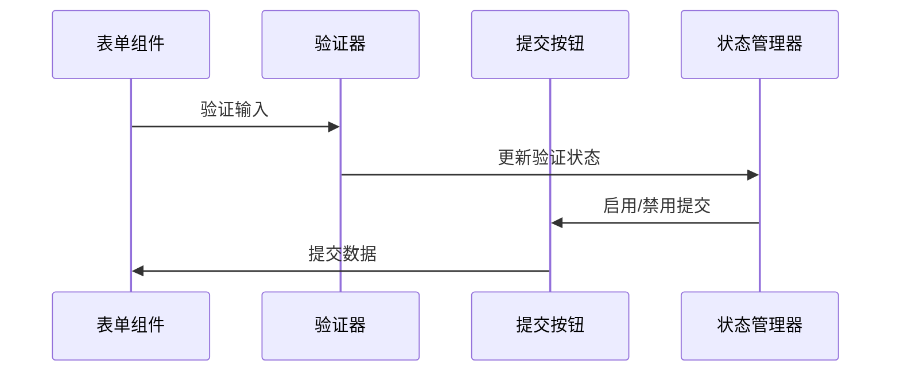
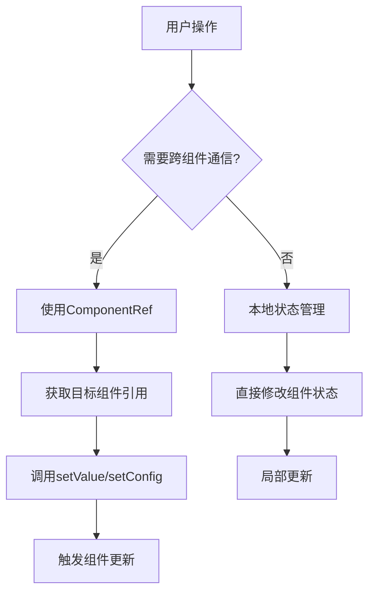

# 组件引用系统设计文档

<cite>
**本文档中引用的文件**
- [ComponentRef.php](file://src/State/ComponentRef.php)
- [StateManager.php](file://src/State/StateManager.php)
- [ComponentBuilder.php](file://src/ComponentBuilder.php)
- [ComponentRefTest.php](file://tests/ComponentRefTest.php)
- [StateManagerBasicTest.php](file://tests/StateManagerBasicTest.php)
- [test_component_ref.php](file://test_component_ref.php)
- [builder_helpers_demo.php](file://example/builder_helpers_demo.php)
- [calculator.php](file://example/calculator.php)
- [ButtonBuilder.php](file://src/Components/ButtonBuilder.php)
- [EntryBuilder.php](file://src/Components/EntryBuilder.php)
</cite>

## 目录
1. [引言](#引言)
2. [系统架构概览](#系统架构概览)
3. [ComponentRef核心设计](#componentref核心设计)
4. [StateManager全局管理](#statemanager全局管理)
5. [组件引用创建机制](#组件引用创建机制)
6. [代理方法详解](#代理方法详解)
7. [事件处理器中的引用使用](#事件处理器中的引用使用)
8. [生命周期管理](#生命周期管理)
9. [内存泄漏防范](#内存泄漏防范)
10. [典型应用场景](#典型应用场景)
11. [最佳实践指南](#最佳实践指南)
12. [总结](#总结)

## 引言

ComponentRef系统是libuiBuilder框架中的核心组件代理机制，它提供了一种优雅的方式来访问和操作其他UI组件的状态和配置。该系统通过StateManager进行全局注册和管理，实现了组件间的解耦通信，为复杂的UI交互提供了强大的基础设施支持。

## 系统架构概览

ComponentRef系统采用分层架构设计，主要包含以下核心组件：

**图表来源**
- [ComponentBuilder.php](file://src/ComponentBuilder.php#L122-L131)
- [ComponentRef.php](file://src/State/ComponentRef.php#L17-L21)
- [StateManager.php](file://src/State/StateManager.php#L71-L82)

## ComponentRef核心设计

ComponentRef类作为组件代理的核心，提供了简洁而强大的接口来访问其他组件的功能。

### 类结构设计

**图表来源**
- [ComponentRef.php](file://src/State/ComponentRef.php#L11-L74)
- [ComponentBuilder.php](file://src/ComponentBuilder.php#L122-L131)
- [StateManager.php](file://src/State/StateManager.php#L8-L91)

### 核心属性说明

| 属性 | 类型 | 描述 | 用途 |
|------|------|------|------|
| `id` | string | 组件唯一标识符 | 用于在StateManager中查找组件引用 |
| `component` | ComponentBuilder | 原始组件实例 | 代理方法的实际执行目标 |
| `handle` | ?CData | 原生控件句柄 | 与底层UI库的直接交互 |

**章节来源**
- [ComponentRef.php](file://src/State/ComponentRef.php#L13-L15)

## StateManager全局管理

StateManager采用单例模式设计，作为整个应用的全局状态管理中心，负责组件引用的注册、查找和生命周期管理。

### 单例模式实现

**图表来源**
- [StateManager.php](file://src/State/StateManager.php#L15-L21)
- [StateManager.php](file://src/State/StateManager.php#L71-L82)

### 注册机制

StateManager通过`registerComponent`方法维护组件引用的全局映射：

**章节来源**
- [StateManager.php](file://src/State/StateManager.php#L71-L74)

### 获取机制

通过`getComponent`方法实现组件引用的全局查找：

**章节来源**
- [StateManager.php](file://src/State/StateManager.php#L78-L82)

## 组件引用创建机制

id()方法是ComponentRef系统的核心入口点，它不仅为组件分配唯一标识符，还自动创建并注册组件引用。

### id()方法实现流程

**图表来源**
- [ComponentBuilder.php](file://src/ComponentBuilder.php#L125-L131)

### 自动注册过程

当开发者调用组件的`id()`方法时，系统会自动执行以下步骤：

1. **ID设置**: 将传入的字符串ID赋值给组件实例
2. **引用创建**: 使用组件实例和ID创建ComponentRef对象
3. **全局注册**: 将ComponentRef注册到StateManager的组件映射表中
4. **链式返回**: 返回组件实例以支持链式调用

**章节来源**
- [ComponentBuilder.php](file://src/ComponentBuilder.php#L125-L131)

## 代理方法详解

ComponentRef类提供了四个核心代理方法，每个方法都针对不同的操作需求进行了优化。

### getValue()方法

getValue()方法提供对组件当前值的读取访问：

**图表来源**
- [ComponentRef.php](file://src/State/ComponentRef.php#L46-L49)

### setValue()方法

setValue()方法允许外部代码修改组件的状态：

**章节来源**
- [ComponentRef.php](file://src/State/ComponentRef.php#L54-L57)

### getConfig()方法

getConfig()方法提供对组件配置的灵活访问：

**章节来源**
- [ComponentRef.php](file://src/State/ComponentRef.php#L62-L65)

### call()方法

call()方法是最灵活的代理方法，允许调用组件的任何公共方法：

**章节来源**
- [ComponentRef.php](file://src/State/ComponentRef.php#L70-L73)

## 事件处理器中的引用使用

ComponentRef系统在事件处理器中发挥着关键作用，使得组件间能够进行解耦的通信和协作。

### 事件处理流程

**图表来源**
- [ButtonBuilder.php](file://src/Components/ButtonBuilder.php#L28-L35)
- [ComponentBuilder.php](file://src/ComponentBuilder.php#L196-L199)

### 实际代码示例

在计算器应用中，我们可以看到ComponentRef在事件处理中的典型应用：

**章节来源**
- [calculator.php](file://example/calculator.php#L98-L105)
- [calculator.php](file://example/calculator.php#L109-L112)

## 生命周期管理

ComponentRef系统具有完整的生命周期管理机制，确保组件引用在整个应用生命周期内的正确性。

### 创建阶段

组件引用的创建遵循严格的顺序：

1. **组件实例化**: 创建原始的ComponentBuilder实例
2. **ID分配**: 调用`id()`方法分配唯一标识符
3. **引用创建**: 自动创建ComponentRef代理对象
4. **注册到StateManager**: 将引用注册到全局管理器

### 运行阶段

在应用运行期间，StateManager持续维护组件引用的有效性：

- **状态同步**: 当组件状态发生变化时，自动通知相关引用
- **事件传播**: 组件事件能够通过引用系统传播到其他组件
- **配置更新**: 组件配置的变化会反映到所有引用

### 销毁阶段

虽然当前实现没有显式的销毁方法，但系统设计考虑了内存管理：

- **弱引用模式**: ComponentRef持有ComponentBuilder的强引用，避免过早回收
- **全局清理**: StateManager的实例在整个应用生命周期内保持存在

**章节来源**
- [ComponentBuilder.php](file://src/ComponentBuilder.php#L125-L131)
- [StateManager.php](file://src/State/StateManager.php#L71-L82)

## 内存泄漏防范

ComponentRef系统采用了多种策略来防范潜在的内存泄漏问题。

### 引用关系管理

### 防范措施

1. **明确的引用边界**: ComponentRef只代理ComponentBuilder的方法，不持有额外的资源引用
2. **StateManager单例**: 通过单例模式避免重复创建管理器实例
3. **及时的注册**: 在组件创建时立即注册引用，确保可访问性
4. **无循环依赖**: StateManager不持有ComponentRef的强引用，避免循环引用

### 最佳实践建议

- **及时释放**: 虽然系统设计考虑了内存管理，但仍建议在不需要时及时清理组件引用
- **避免过度使用**: 只在必要时使用ComponentRef，避免不必要的代理开销
- **监控内存使用**: 在大型应用中，定期检查StateManager的组件引用数量

## 典型应用场景

ComponentRef系统在各种UI交互场景中都有广泛应用，以下是几个典型的使用案例。

### 状态同步场景

在多组件状态同步的场景中，ComponentRef提供了简洁的解决方案：

### 事件协调场景

在复杂的事件协调场景中，ComponentRef允许组件间进行解耦通信：

### 动态UI更新场景

ComponentRef支持动态UI更新，无需重新渲染整个界面：

**章节来源**
- [calculator.php](file://example/calculator.php#L165-L175)

## 最佳实践指南

基于对ComponentRef系统的深入分析，以下是使用该系统时的最佳实践建议。

### 组件ID命名规范

- **使用描述性名称**: ID应该清晰表达组件的用途，如`username-input`、`submit-button`
- **避免特殊字符**: 使用字母、数字、连字符和下划线
- **保持一致性**: 采用统一的命名约定，如小写字母加连字符

### 事件处理器设计原则

1. **单一职责**: 每个事件处理器应该只处理一种类型的事件
2. **错误处理**: 在事件处理器中添加适当的错误处理逻辑
3. **性能考虑**: 避免在高频事件中执行耗时操作

### 状态管理模式

### 性能优化建议

1. **减少不必要的引用**: 只在确实需要跨组件通信时才使用ComponentRef
2. **批量操作**: 在可能的情况下，使用StateManager的批量更新功能
3. **及时清理**: 虽然系统设计考虑了内存管理，但合理的清理习惯更好

### 调试和测试策略

1. **单元测试**: 为使用ComponentRef的组件编写专门的单元测试
2. **集成测试**: 测试组件间的交互和状态同步
3. **状态监控**: 使用StateManager的dump功能监控状态变化

**章节来源**
- [ComponentRefTest.php](file://tests/ComponentRefTest.php#L50-L156)
- [StateManagerBasicTest.php](file://tests/StateManagerBasicTest.php#L1-L60)

## 总结

ComponentRef系统是libuiBuilder框架中一个精心设计的组件代理机制，它通过StateManager提供全局的组件引用管理，实现了组件间的解耦通信。该系统的核心价值体现在：

1. **统一的访问接口**: 通过ComponentRef提供一致的组件访问方式
2. **全局状态管理**: StateManager确保组件引用的全局可访问性
3. **灵活的代理方法**: 四种代理方法满足不同的操作需求
4. **完善的生命周期**: 从创建到使用的完整生命周期管理
5. **内存安全设计**: 多层次的内存泄漏防范措施

该系统特别适用于需要组件间协作的复杂UI场景，如状态同步、事件协调和动态UI更新等。通过合理使用ComponentRef系统，开发者可以构建更加模块化、可维护的用户界面应用程序。