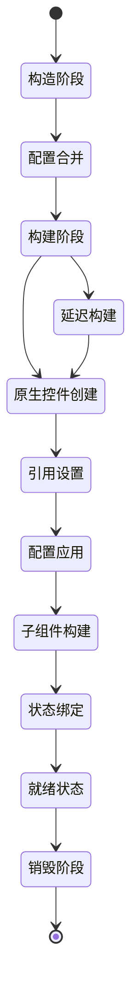
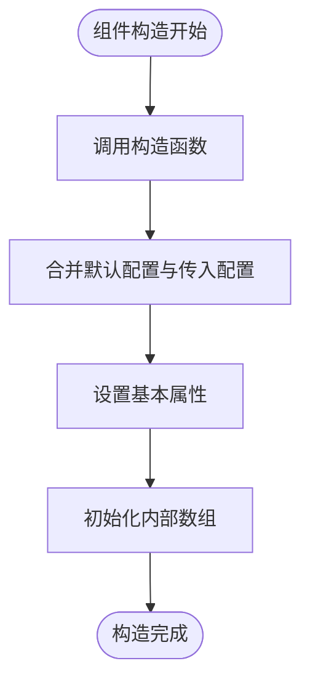
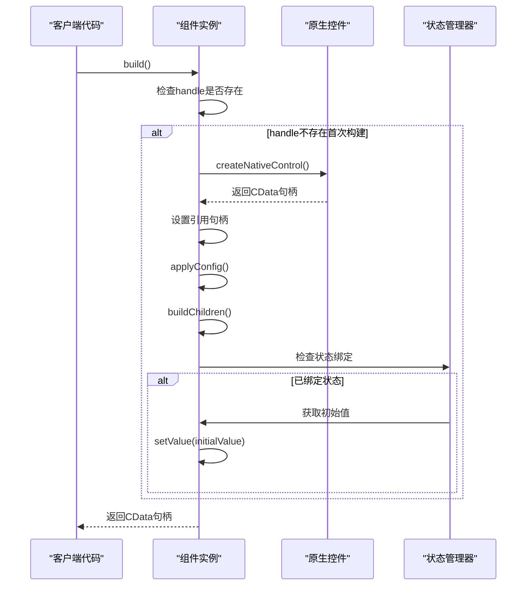
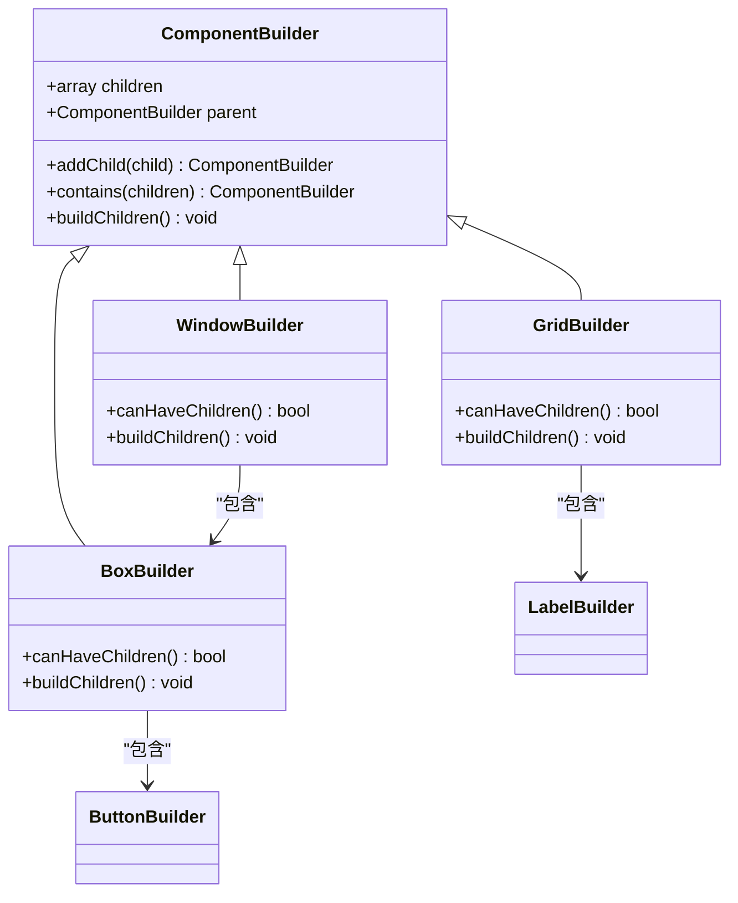
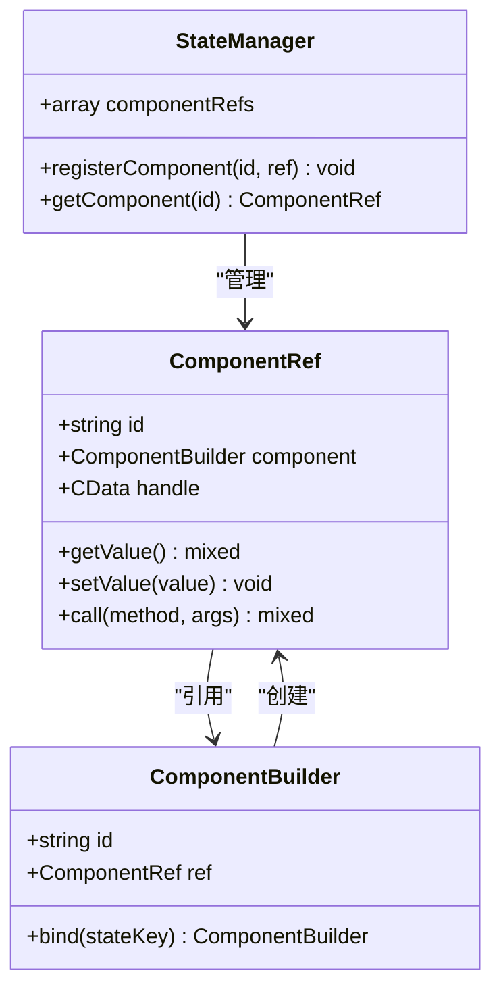
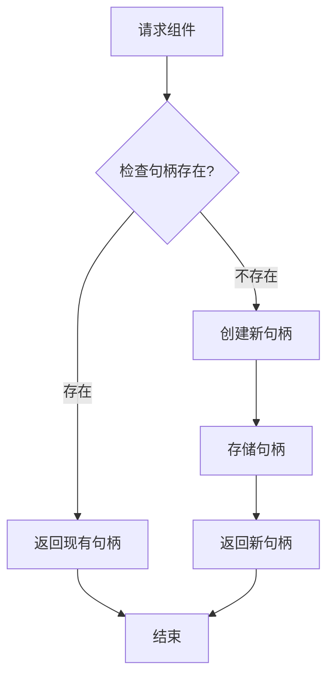
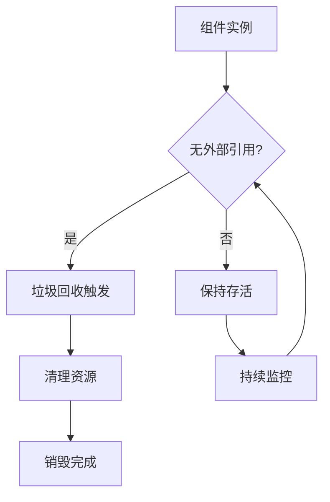
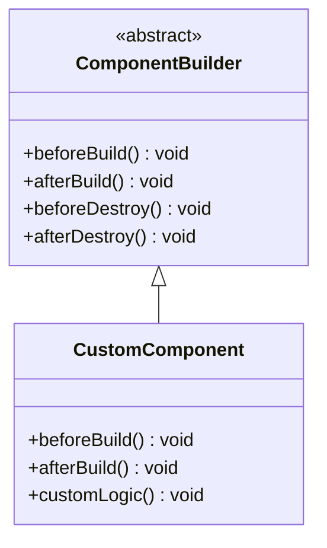

# 组件生命周期

<cite>
**本文档中引用的文件**
- [ComponentBuilder.php](file://src/ComponentBuilder.php)
- [Builder.php](file://src/Builder.php)
- [ButtonBuilder.php](file://src/Components/ButtonBuilder.php)
- [WindowBuilder.php](file://src/Components/WindowBuilder.php)
- [BoxBuilder.php](file://src/Components/BoxBuilder.php)
- [GridBuilder.php](file://src/Components/GridBuilder.php)
- [TableBuilder.php](file://src/Components/TableBuilder.php)
- [StateManager.php](file://src/State/StateManager.php)
- [ComponentRef.php](file://src/State/ComponentRef.php)
- [simple.php](file://example/simple.php)
- [full.php](file://example/full.php)
</cite>

## 目录
1. [简介](#简介)
2. [组件生命周期概述](#组件生命周期概述)
3. [构造阶段](#构造阶段)
4. [构建阶段](#构建阶段)
5. [组件树构建](#组件树构建)
6. [状态管理与绑定](#状态管理与绑定)
7. [延迟构建机制](#延迟构建机制)
8. [组件销毁与资源清理](#组件销毁与资源清理)
9. [生命周期钩子扩展](#生命周期钩子扩展)
10. [最佳实践](#最佳实践)

## 简介

libuiBuilder采用面向对象的设计模式，通过组件构建器（ComponentBuilder）实现了完整的UI组件生命周期管理。每个UI组件都遵循严格的生命周期流程，从构造到销毁的整个过程中都有明确的状态管理和资源控制机制。

## 组件生命周期概述

UI组件的生命周期包含以下主要阶段：



**图表来源**
- [ComponentBuilder.php](file://src/ComponentBuilder.php#L25-L231)

## 构造阶段

### 构造函数执行流程

组件的构造阶段是生命周期的第一个环节，负责初始化基本属性和配置。



**图表来源**
- [ComponentBuilder.php](file://src/ComponentBuilder.php#L25-L28)

#### 关键特性

1. **配置合并机制**：通过 [`getDefaultConfig()`](file://src/ComponentBuilder.php#L33) 方法获取默认配置，并与传入的配置参数进行合并
2. **属性初始化**：初始化组件的基本属性如句柄、子组件数组、父组件引用等
3. **状态准备**：为后续的构建和绑定操作做好准备

**节来源**
- [ComponentBuilder.php](file://src/ComponentBuilder.php#L25-L28)

### 默认配置获取

每个组件都必须实现 [`getDefaultConfig()`](file://src/ComponentBuilder.php#L33) 抽象方法，返回该组件的默认配置数组。这个方法确保了组件具有合理的默认行为。

**节来源**
- [ButtonBuilder.php](file://src/Components/ButtonBuilder.php#L11-L18)
- [WindowBuilder.php](file://src/Components/WindowBuilder.php#L13-L23)
- [BoxBuilder.php](file://src/Components/BoxBuilder.php#L21-L27)

## 构建阶段

### build() 方法执行流程

[`build()`](file://src/ComponentBuilder.php#L209-L231) 方法是组件生命周期的核心，负责创建原生控件并完成所有必要的初始化工作。



**图表来源**
- [ComponentBuilder.php](file://src/ComponentBuilder.php#L209-L231)

#### 构建步骤详解

1. **句柄检查**：检查组件是否已经拥有原生控件句柄
2. **原生控件创建**：调用 [`createNativeControl()`](file://src/ComponentBuilder.php#L38) 创建原生控件
3. **引用设置**：为组件设置原生句柄引用
4. **配置应用**：调用 [`applyConfig()`](file://src/ComponentBuilder.php#L43) 应用配置
5. **子组件构建**：调用 [`buildChildren()`](file://src/ComponentBuilder.php#L81) 构建子组件
6. **状态绑定**：处理状态绑定逻辑

**节来源**
- [ComponentBuilder.php](file://src/ComponentBuilder.php#L209-L231)

### 原生控件创建

[`createNativeControl()`](file://src/ComponentBuilder.php#L38) 是一个抽象方法，由具体的组件类实现。它负责创建对应平台的原生UI控件。

**节来源**
- [ButtonBuilder.php](file://src/Components/ButtonBuilder.php#L20-L22)
- [WindowBuilder.php](file://src/Components/WindowBuilder.php#L26-L33)
- [BoxBuilder.php](file://src/Components/BoxBuilder.php#L29-L34)

### 配置应用

[`applyConfig()`](file://src/ComponentBuilder.php#L43) 方法负责将配置应用到已创建的原生控件上。

**节来源**
- [ButtonBuilder.php](file://src/Components/ButtonBuilder.php#L25-L36)
- [WindowBuilder.php](file://src/Components/WindowBuilder.php#L36-L50)
- [BoxBuilder.php](file://src/Components/BoxBuilder.php#L36-L39)

## 组件树构建

### 父子组件关系建立

组件树的构建遵循层次化的结构，父组件负责管理其子组件。



**图表来源**
- [ComponentBuilder.php](file://src/ComponentBuilder.php#L59-L68)
- [WindowBuilder.php](file://src/Components/WindowBuilder.php#L53-L71)
- [BoxBuilder.php](file://src/Components/BoxBuilder.php#L41-L53)
- [GridBuilder.php](file://src/Components/GridBuilder.php#L32-L55)

#### 子组件添加机制

1. **addChild() 方法**：添加单个子组件
2. **contains() 方法**：批量添加多个子组件
3. **canHaveChildren() 检查**：验证组件是否支持子组件

**节来源**
- [ComponentBuilder.php](file://src/ComponentBuilder.php#L59-L68)
- [ComponentBuilder.php](file://src/ComponentBuilder.php#L73-L76)

### 子组件构建流程

不同类型的容器组件有不同的子组件构建策略：

**节来源**
- [WindowBuilder.php](file://src/Components/WindowBuilder.php#L58-L71)
- [BoxBuilder.php](file://src/Components/BoxBuilder.php#L46-L53)
- [GridBuilder.php](file://src/Components/GridBuilder.php#L37-L55)

## 状态管理与绑定

### 组件引用系统

libuiBuilder通过 [`ComponentRef`](file://src/State/ComponentRef.php) 类实现了组件间的引用机制。



**图表来源**
- [StateManager.php](file://src/State/StateManager.php#L70-L82)
- [ComponentRef.php](file://src/State/ComponentRef.php#L17-L74)
- [ComponentBuilder.php](file://src/ComponentBuilder.php#L125-L130)

### 状态绑定机制

组件可以通过 [`bind()`](file://src/ComponentBuilder.php#L136-L146) 方法绑定到状态管理器，实现双向数据绑定。

**节来源**
- [ComponentBuilder.php](file://src/ComponentBuilder.php#L136-L146)
- [StateManager.php](file://src/State/StateManager.php#L50-L56)

### 事件处理系统

组件支持事件驱动的交互模式，通过 [`on()`](file://src/ComponentBuilder.php#L151-L158) 和 [`emit()`](file://src/ComponentBuilder.php#L163-L169) 方法实现事件的注册和触发。

**节来源**
- [ComponentBuilder.php](file://src/ComponentBuilder.php#L151-L158)
- [ComponentBuilder.php](file://src/ComponentBuilder.php#L163-L169)

## 延迟构建机制

### 延迟构建的优势

libuiBuilder实现了智能的延迟构建机制，只有在真正需要时才创建原生控件，这带来了以下优势：

1. **性能优化**：避免不必要的原生控件创建
2. **内存效率**：减少内存占用
3. **按需加载**：提高应用程序启动速度



**图表来源**
- [ComponentBuilder.php](file://src/ComponentBuilder.php#L211-L231)

### 延迟构建的实现

延迟构建的核心在于 [`build()`](file://src/ComponentBuilder.php#L209-L231) 方法中的句柄检查逻辑。

**节来源**
- [ComponentBuilder.php](file://src/ComponentBuilder.php#L211-L231)

## 组件销毁与资源清理

### 隐式销毁机制

libuiBuilder依赖PHP的垃圾回收机制来管理组件的销毁。当组件不再被引用且没有其他强引用时，PHP会自动回收相关资源。



### 资源清理注意事项

1. **句柄释放**：原生控件句柄会在PHP垃圾回收时自动释放
2. **状态引用**：状态管理器中的组件引用会自动清理
3. **事件监听器**：事件处理器在组件销毁时会被自动移除

**节来源**
- [StateManager.php](file://src/State/StateManager.php#L70-L82)

## 生命周期钩子扩展

### 自定义生命周期钩子

开发者可以通过继承基础组件类来扩展生命周期钩子：



### 推荐的扩展点

1. **beforeBuild()**：在构建前执行自定义初始化逻辑
2. **afterBuild()**：在构建后执行自定义配置逻辑  
3. **beforeDestroy()**：在销毁前执行清理逻辑
4. **afterDestroy()**：在销毁后执行后处理逻辑

### 实现示例

虽然基础框架中没有内置这些钩子，但可以通过以下方式实现：

```php
// 在子类中重写build方法
public function build(): CData
{
    $this->beforeBuild();
    $result = parent::build();
    $this->afterBuild();
    return $result;
}
```

## 最佳实践

### 组件设计原则

1. **单一职责**：每个组件应该只负责一种UI功能
2. **配置驱动**：通过配置而非硬编码来控制组件行为
3. **链式调用**：支持流畅的API设计
4. **状态分离**：清晰分离UI状态和业务状态

### 性能优化建议

1. **合理使用延迟构建**：对于复杂的组件树，延迟构建可以显著提升性能
2. **避免过度嵌套**：减少组件树的深度
3. **及时清理引用**：在不需要时及时解除组件引用
4. **批量操作**：对于大量相似组件，使用批量操作方法

### 调试和维护

1. **组件标识**：使用 [`id()`](file://src/ComponentBuilder.php#L125-L131) 方法为重要组件设置唯一标识
2. **状态监控**：利用状态管理器监控组件状态变化
3. **事件追踪**：合理使用事件系统进行组件间通信
4. **错误处理**：在组件生命周期的关键节点添加错误处理

**节来源**
- [ComponentBuilder.php](file://src/ComponentBuilder.php#L125-L131)
- [StateManager.php](file://src/State/StateManager.php#L50-L56)