# libuiBuilder链式调用实现原理详解

<cite>
**本文档中引用的文件**
- [ComponentBuilder.php](file://src/ComponentBuilder.php)
- [Builder.php](file://src/Builder.php)
- [ButtonBuilder.php](file://src/Components/ButtonBuilder.php)
- [LabelBuilder.php](file://src/Components/LabelBuilder.php)
- [EntryBuilder.php](file://src/Components/EntryBuilder.php)
- [simple.php](file://example/simple.php)
- [full.php](file://example/full.php)
</cite>

## 目录
1. [引言](#引言)
2. [项目结构概览](#项目结构概览)
3. [核心架构分析](#核心架构分析)
4. [__call魔术方法实现](#call魔术方法实现)
5. [setConfig方法机制](#setconfig方法机制)
6. [链式调用工作流程](#链式调用工作流程)
7. [具体使用示例](#具体使用示例)
8. [性能考量与最佳实践](#性能考量与最佳实践)
9. [复杂UI构建优势](#复杂ui构建优势)
10. [总结](#总结)

## 引言

libuiBuilder是一个基于PHP的GUI应用程序构建框架，它采用了优雅的链式调用模式来提供流畅的API体验。通过深入分析ComponentBuilder类中的`__call`魔术方法实现，我们可以理解这种设计模式如何将任意setter方法调用无缝转发到统一的配置管理系统，从而实现类似`text('Hello')->onClick(fn() => ...)->id('btn1')`这样的流畅API。

## 项目结构概览

libuiBuilder采用模块化架构设计，主要包含以下核心组件：

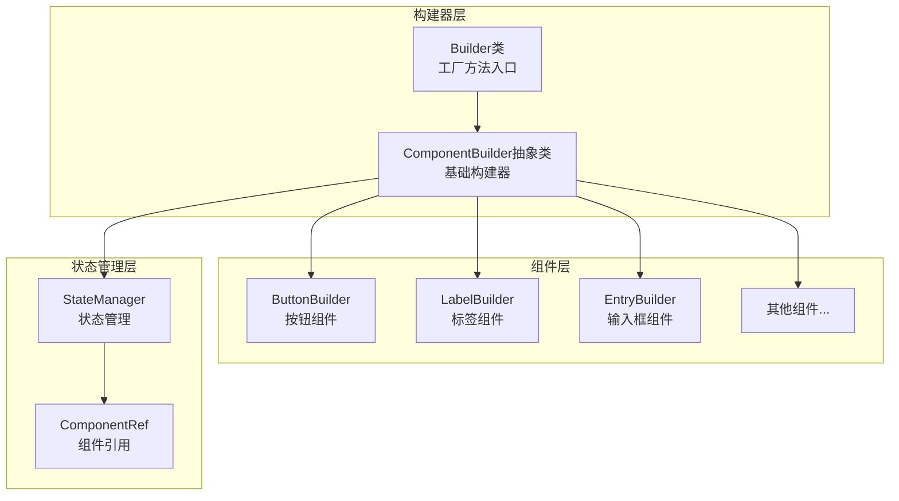

**图表来源**
- [Builder.php](file://src/Builder.php#L27-L153)
- [ComponentBuilder.php](file://src/ComponentBuilder.php#L11-L234)

**章节来源**
- [Builder.php](file://src/Builder.php#L1-L153)
- [ComponentBuilder.php](file://src/ComponentBuilder.php#L1-L234)

## 核心架构分析

### ComponentBuilder抽象类设计

ComponentBuilder作为所有组件构建器的基类，定义了链式调用的核心机制：

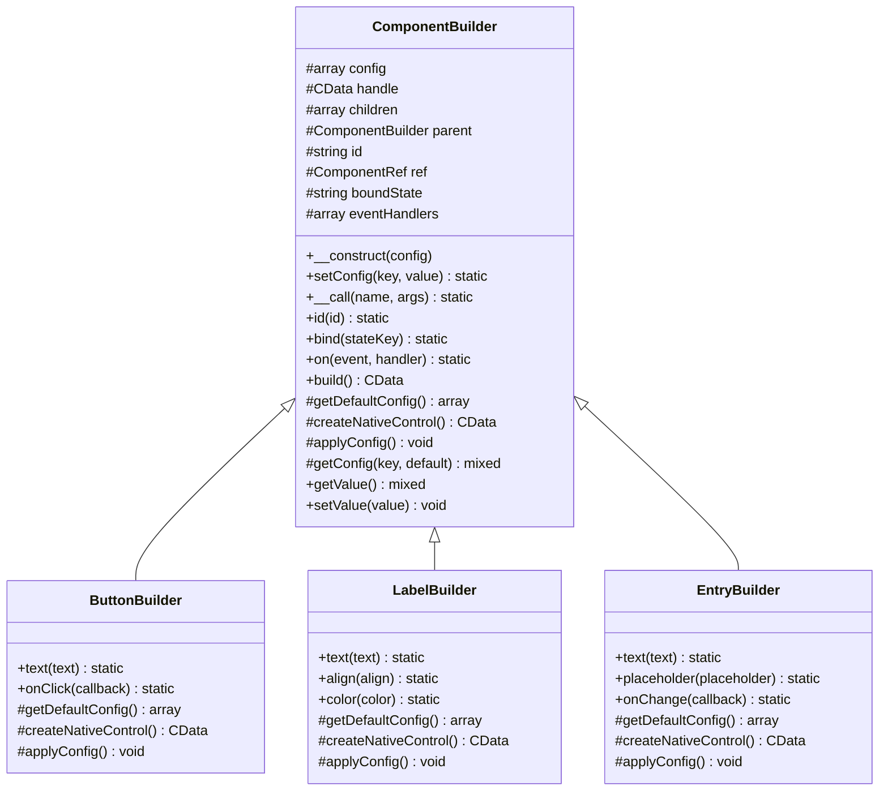

**图表来源**
- [ComponentBuilder.php](file://src/ComponentBuilder.php#L11-L234)
- [ButtonBuilder.php](file://src/Components/ButtonBuilder.php#L9-L48)
- [LabelBuilder.php](file://src/Components/LabelBuilder.php#L9-L62)
- [EntryBuilder.php](file://src/Components/EntryBuilder.php#L9-L80)

**章节来源**
- [ComponentBuilder.php](file://src/ComponentBuilder.php#L11-L234)

## __call魔术方法实现

### 魔术方法的核心机制

ComponentBuilder类中的`__call`方法是链式调用的核心实现，它利用PHP的魔术方法特性实现了动态方法调用的转发机制：

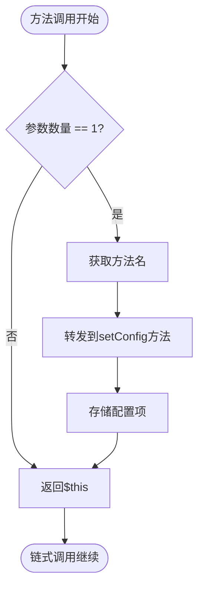

**图表来源**
- [ComponentBuilder.php](file://src/ComponentBuilder.php#L114-L119)

### 实现细节分析

`__call`方法的实现非常简洁但功能强大：

1. **参数验证**：确保只处理单参数的方法调用
2. **动态转发**：将任意方法名和参数转发给`setConfig`方法
3. **返回自身**：保持链式调用的连续性

这种方法的优势在于：
- **灵活性**：支持任意配置项的设置，无需为每个配置项创建单独的方法
- **一致性**：所有配置都通过统一的接口进行管理
- **可扩展性**：新配置项无需修改基类代码

**章节来源**
- [ComponentBuilder.php](file://src/ComponentBuilder.php#L114-L119)

## setConfig方法机制

### 配置存储机制

`setConfig`方法负责将配置项存储到内部的$config数组中，这是整个链式调用系统的核心存储机制：

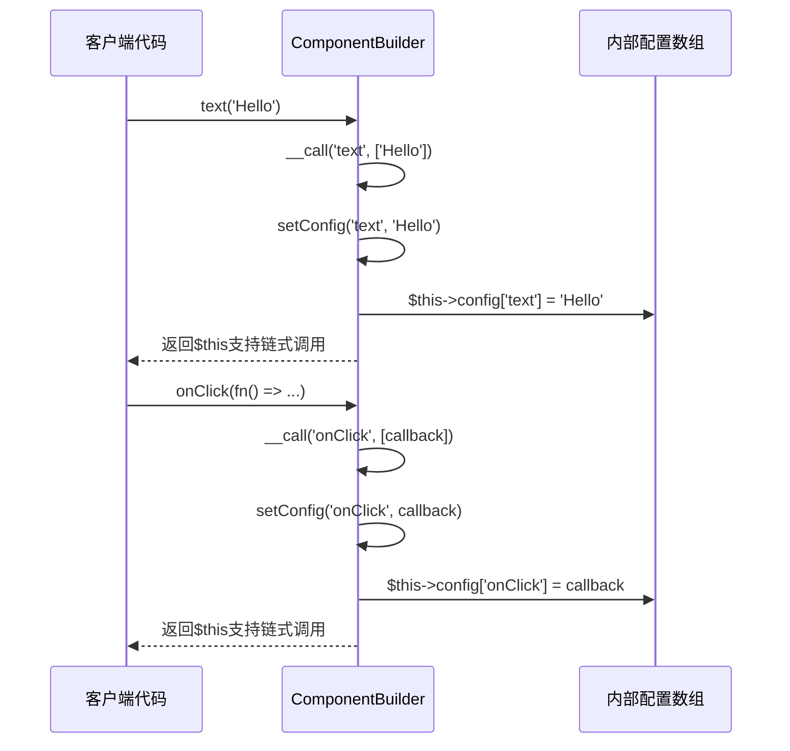

**图表来源**
- [ComponentBuilder.php](file://src/ComponentBuilder.php#L105-L109)

### 配置应用时机

配置项在组件构建过程中的应用遵循以下时序：

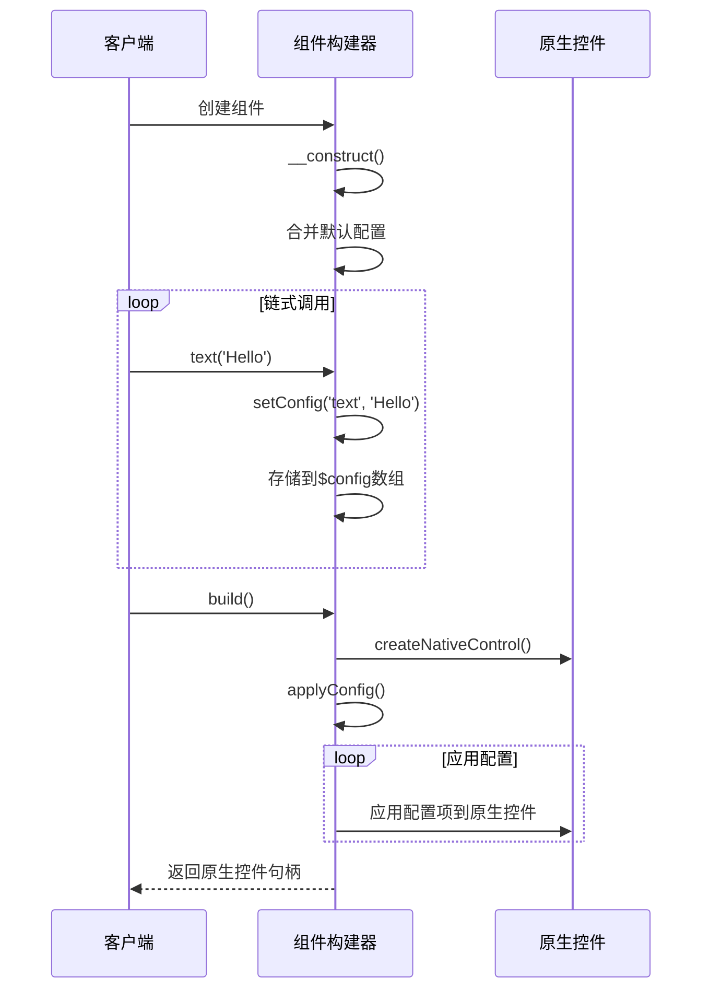

**图表来源**
- [ComponentBuilder.php](file://src/ComponentBuilder.php#L209-L231)

**章节来源**
- [ComponentBuilder.php](file://src/ComponentBuilder.php#L105-L109)
- [ComponentBuilder.php](file://src/ComponentBuilder.php#L209-L231)

## 链式调用工作流程

### 完整的工作流程

从客户端调用到最终配置应用的完整流程展示了链式调用的优雅实现：

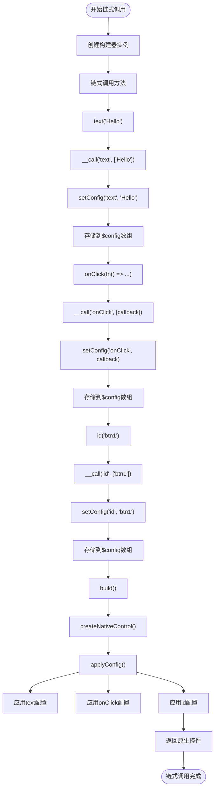

**图表来源**
- [ComponentBuilder.php](file://src/ComponentBuilder.php#L114-L119)
- [ComponentBuilder.php](file://src/ComponentBuilder.php#L105-L109)

### 方法重写与扩展

某些组件提供了专门的方法来增强特定功能，这些方法直接调用`setConfig`而不依赖`__call`：

**章节来源**
- [ComponentBuilder.php](file://src/ComponentBuilder.php#L114-L119)
- [ComponentBuilder.php](file://src/ComponentBuilder.php#L105-L109)

## 具体使用示例

### 基础链式调用示例

以下是libuiBuilder中典型的链式调用使用模式：

#### 按钮组件的链式配置

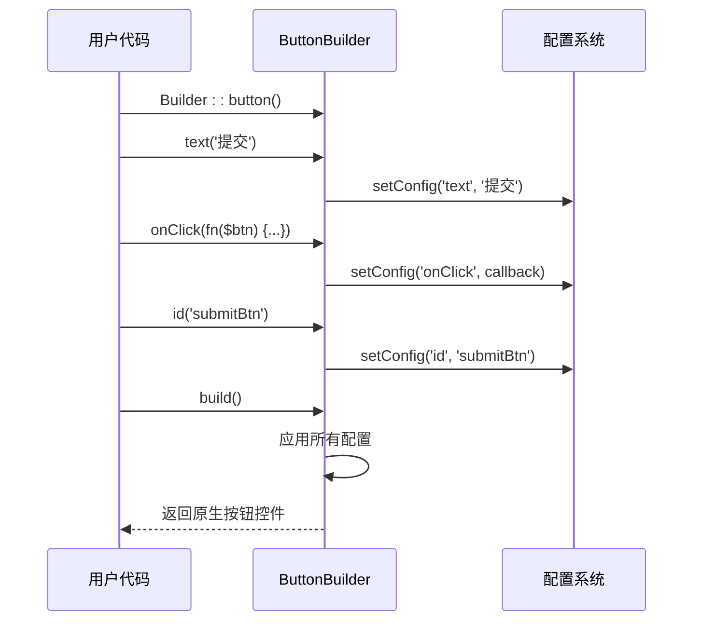

**图表来源**
- [ButtonBuilder.php](file://src/Components/ButtonBuilder.php#L39-L47)
- [simple.php](file://example/simple.php#L99-L102)

#### 输入框组件的复杂链式配置

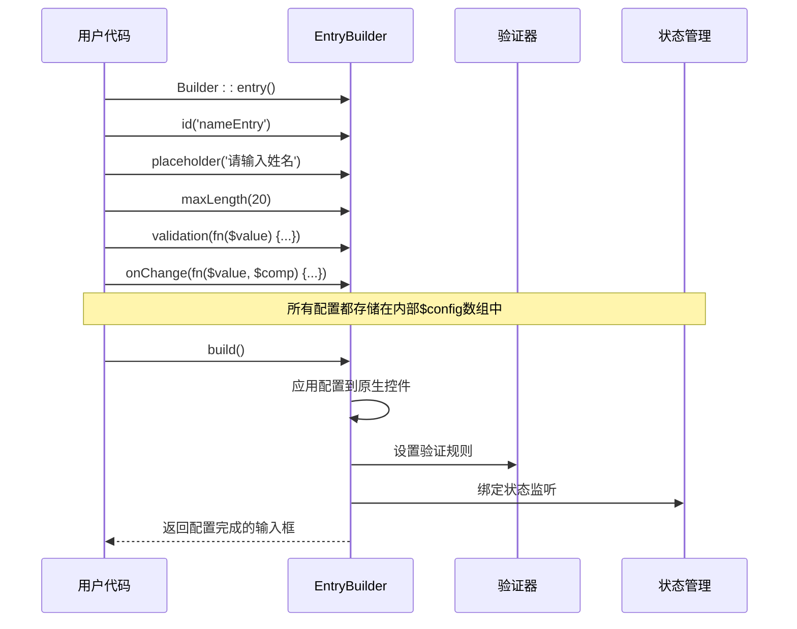

**图表来源**
- [EntryBuilder.php](file://src/Components/EntryBuilder.php#L66-L79)
- [simple.php](file://example/simple.php#L25-L36)

### 状态绑定与事件处理

链式调用不仅限于简单的配置设置，还支持复杂的状态管理和事件处理：

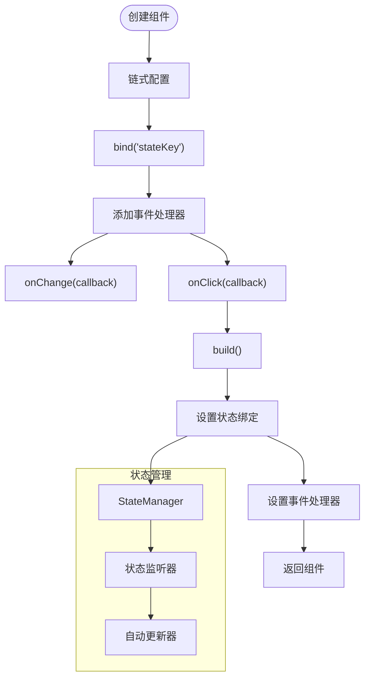

**图表来源**
- [ComponentBuilder.php](file://src/ComponentBuilder.php#L136-L146)
- [ComponentBuilder.php](file://src/ComponentBuilder.php#L149-L158)

**章节来源**
- [ButtonBuilder.php](file://src/Components/ButtonBuilder.php#L39-L47)
- [EntryBuilder.php](file://src/Components/EntryBuilder.php#L66-L79)
- [simple.php](file://example/simple.php#L25-L36)

## 性能考量与最佳实践

### 性能影响分析

链式调用虽然提供了优秀的开发体验，但也存在一些性能考量：

#### 内存使用优化

1. **配置存储**：每次链式调用都会向$config数组添加新的键值对
2. **对象创建**：每个组件构建器都是独立的对象实例
3. **回调存储**：事件处理器会被存储在内存中直到组件销毁

#### 性能优化建议

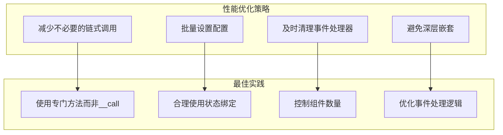

### 最佳实践指南

#### 1. 优先使用专门方法

对于常用的配置项，建议使用专门的方法而不是依赖`__call`：

```php
// 推荐：使用专门方法
$button = Builder::button()
    ->text('提交')
    ->onClick(fn($btn) => ...)
    ->id('submitBtn');

// 不推荐：过度依赖__call
$button = Builder::button()
    ->setConfig('text', '提交')
    ->setConfig('onClick', fn($btn) => ...)
    ->setConfig('id', 'submitBtn');
```

#### 2. 合理组织链式调用顺序

```php
// 推荐：按逻辑分组
$entry = Builder::entry()
    ->id('nameEntry')
    ->placeholder('请输入姓名')
    ->maxLength(20)
    ->validation(fn($value) => !empty(trim($value)));

// 不推荐：杂乱无章
$entry = Builder::entry()
    ->validation(fn($value) => !empty(trim($value)))
    ->placeholder('请输入姓名')
    ->maxLength(20)
    ->id('nameEntry');
```

#### 3. 避免过深的链式调用

```php
// 推荐：适度的链式调用
$button = Builder::button()
    ->text('提交')
    ->onClick(fn($btn) => processForm())
    ->id('submitBtn')
    ->bind('formStatus');

// 不推荐：过深的链式调用
$button = Builder::button()
    ->text('提交')
    ->onClick(fn($btn) => processForm())
    ->id('submitBtn')
    ->bind('formStatus')
    ->on('click', fn($btn) => trackEvent('submit'))
    ->on('mouseover', fn($btn) => showTooltip())
    ->on('mouseout', fn($btn) => hideTooltip());
```

**章节来源**
- [ComponentBuilder.php](file://src/ComponentBuilder.php#L114-L119)
- [ComponentBuilder.php](file://src/ComponentBuilder.php#L105-L109)

## 复杂UI构建优势

### 在复杂界面中的应用

链式调用在构建复杂的用户界面时展现出显著优势：

#### 表单构建的优雅性

```mermaid
graph TB
subgraph "传统方式"
A1[创建窗口] --> A2[创建VBox]
A2 --> A3[创建Label]
A3 --> A4[设置Label属性]
A4 --> A5[创建Entry]
A5 --> A6[设置Entry属性]
A6 --> A7[创建Button]
A7 --> A8[设置Button属性]
end
subgraph "链式调用方式"
B1[Builder::window()] --> B2[->title('表单')]
B2 --> B3[->size(400, 300)]
B3 --> B4[->contains([...])]
B4 --> B5[->vbox()->contains([...])]
end
style B1 fill:#e1f5fe
style B2 fill:#e1f5fe
style B3 fill:#e1f5fe
style B4 fill:#e1f5fe
style B5 fill:#e1f5fe
```

#### 复杂布局的清晰表达

链式调用使得复杂的布局结构更加直观和易于维护：

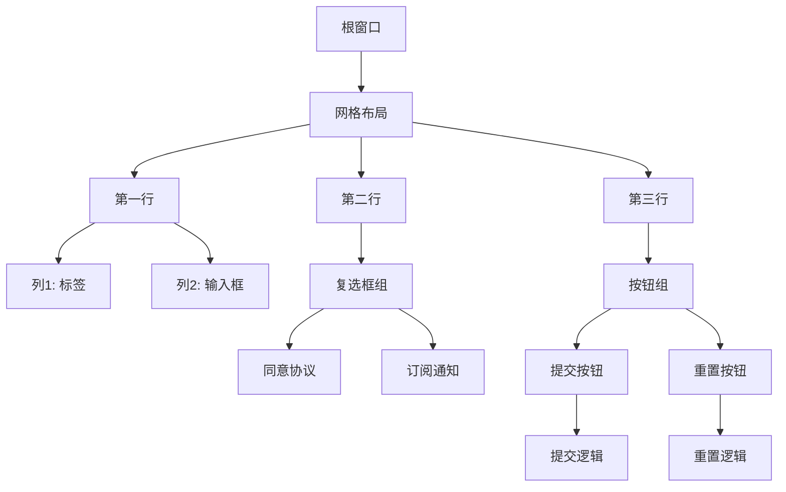

**图表来源**
- [simple.php](file://example/simple.php#L11-L142)
- [full.php](file://example/full.php#L50-L180)

### 状态管理的简化

链式调用与状态管理系统完美结合，大大简化了复杂应用的状态管理：

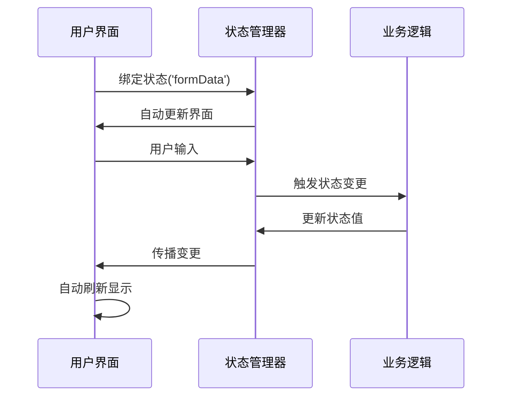

**图表来源**
- [ComponentBuilder.php](file://src/ComponentBuilder.php#L136-L146)
- [ComponentBuilder.php](file://src/ComponentBuilder.php#L171-L174)

**章节来源**
- [simple.php](file://example/simple.php#L11-L142)
- [full.php](file://example/full.php#L50-L180)

## 总结

libuiBuilder的链式调用机制通过`__call`魔术方法巧妙地将任意setter方法调用转发到统一的`setConfig`方法，实现了灵活而一致的API设计。这种设计模式具有以下核心优势：

### 技术优势

1. **统一的配置管理**：所有配置项通过单一接口进行管理，保持了API的一致性
2. **高度的灵活性**：支持任意配置项的动态设置，无需为每个配置项创建专门方法
3. **流畅的开发体验**：提供了类似JavaScript的流畅API，提升了开发效率
4. **良好的可读性**：链式调用使得UI构建代码更加直观和易于理解

### 设计哲学

libuiBuilder的链式调用体现了现代软件设计中的几个重要原则：

- **单一职责原则**：ComponentBuilder专注于构建器的核心功能
- **开闭原则**：通过继承和多态支持新组件类型的扩展
- **接口隔离原则**：通过专门方法和通用方法的结合满足不同需求
- **依赖倒置原则**：高层模块不依赖低层模块的具体实现

### 应用价值

这种链式调用模式特别适用于：
- 快速原型开发
- 复杂UI界面的构建
- 需要频繁配置调整的场景
- 追求代码可读性和开发效率的项目

通过深入理解libuiBuilder的链式调用实现原理，开发者可以更好地利用这一设计模式来构建高质量的GUI应用程序，同时也能从中学习到优秀的面向对象设计思想和API设计原则。