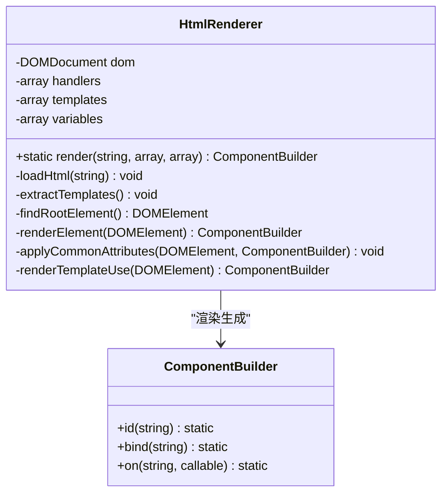
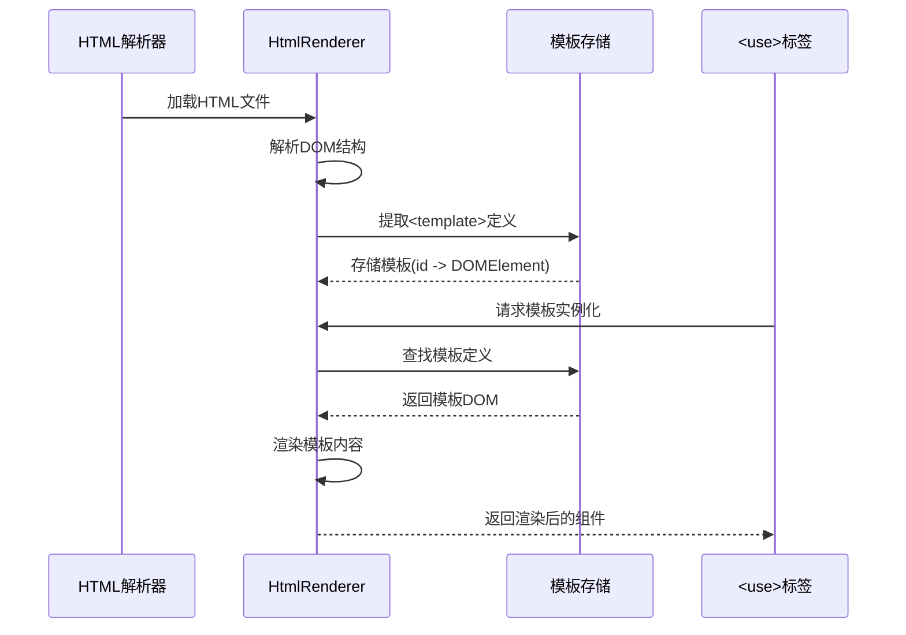
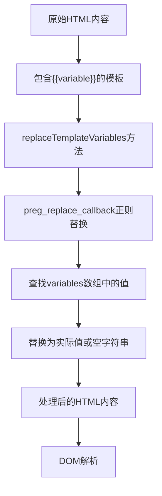
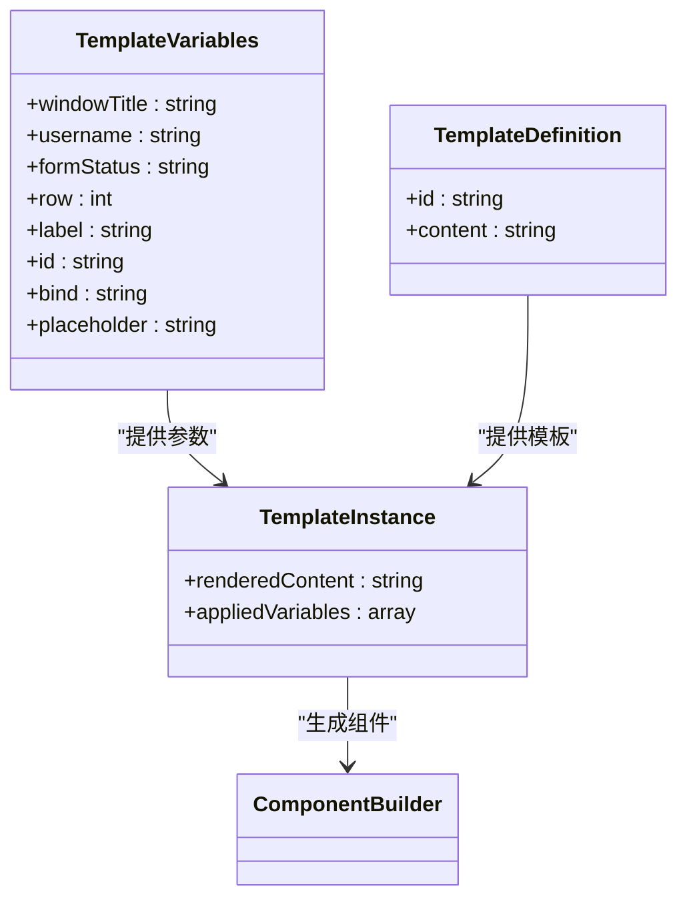
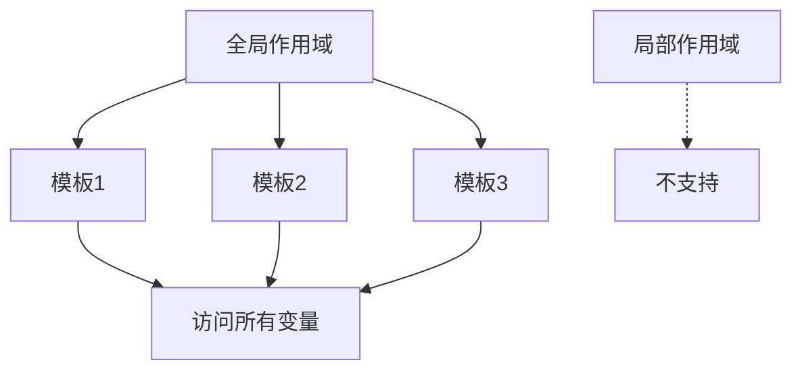
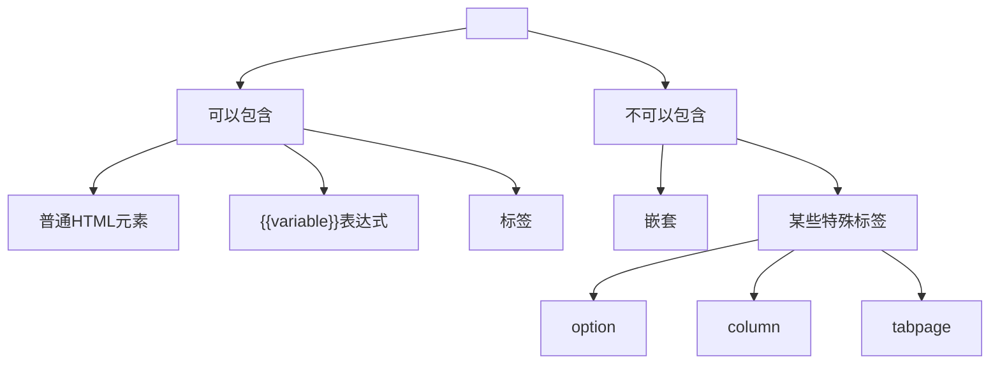
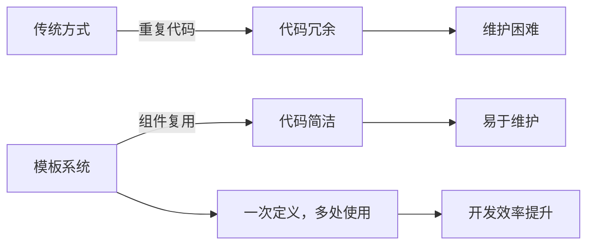
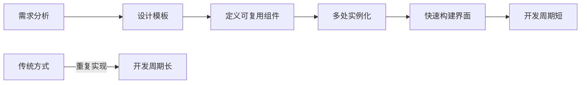

# 模板系统

<cite>
**本文档引用的文件**
- [FormTemplate.php](file://src/Templates/FormTemplate.php)
- [ResponsiveGrid.php](file://src/Templates/ResponsiveGrid.php)
- [HtmlRenderer.php](file://src/HtmlRenderer.php)
- [ComponentBuilder.php](file://src/ComponentBuilder.php)
- [ComponentRef.php](file://src/State/ComponentRef.php)
- [login.ui.html](file://example/views/login.ui.html)
- [calculator.ui.html](file://example/views/calculator.ui.html)
- [README.md](file://README.md)
</cite>

## 目录
1. [简介](#简介)
2. [模板定义与复用机制](#模板定义与复用机制)
3. [核心组件分析](#核心组件分析)
4. [模板参数传递与动态内容](#模板参数传递与动态内容)
5. [完整示例：通用表单字段模板](#完整示例：通用表单字段模板)
6. [作用域与嵌套规则](#作用域与嵌套规则)
7. [模板系统价值](#模板系统价值)
8. [结论](#结论)

## 简介
本项目提供了一套完整的模板系统，用于构建可复用的UI组件。系统通过`<template>`和`<use>`标签实现组件复用，支持动态参数传递和数据绑定，极大地提高了代码的可维护性和开发效率。

## 模板定义与复用机制

模板系统的核心是`<template>`和`<use>`标签的配合使用。`<template>`标签用于定义可复用的UI片段，通过`id`属性标识；`<use>`标签则通过`template`属性引用并实例化已定义的模板。

在HTML模板中，`<template>`标签定义了可复用的UI结构，而`<use>`标签负责实例化这些模板。这种机制类似于面向对象编程中的类和对象的关系，`<template>`相当于类定义，`<use>`则是对象实例化。

```mermaid
flowchart TD
A["<template id=\"form-field\">"] --> B["定义可复用UI片段"]
C["<use template=\"form-field\"/>"] --> D["实例化模板"]
B --> E["存储在HtmlRenderer.templates中"]
D --> F["通过renderTemplateUse方法处理"]
E --> G["模板注册"]
F --> H["模板渲染"]
```

**图示来源**
- [HtmlRenderer.php](file://src/HtmlRenderer.php#L124-L134)
- [HtmlRenderer.php](file://src/HtmlRenderer.php#L641-L659)

**本节来源**
- [HtmlRenderer.php](file://src/HtmlRenderer.php#L124-L134)
- [HtmlRenderer.php](file://src/HtmlRenderer.php#L641-L659)
- [README.md](file://README.md#L230-L241)

## 核心组件分析

### 模板系统核心类

模板系统主要由`HtmlRenderer`类实现，该类负责解析HTML模板、提取模板定义并渲染组件树。



**图示来源**
- [HtmlRenderer.php](file://src/HtmlRenderer.php#L43-L684)
- [ComponentBuilder.php](file://src/ComponentBuilder.php#L11-L234)

### 模板处理流程

模板处理流程包括模板提取、模板引用解析和模板渲染三个主要步骤。



**图示来源**
- [HtmlRenderer.php](file://src/HtmlRenderer.php#L69-L76)
- [HtmlRenderer.php](file://src/HtmlRenderer.php#L166-L169)
- [HtmlRenderer.php](file://src/HtmlRenderer.php#L641-L659)

**本节来源**
- [HtmlRenderer.php](file://src/HtmlRenderer.php#L41-L684)
- [ComponentBuilder.php](file://src/ComponentBuilder.php#L11-L234)

## 模板参数传递与动态内容

模板系统支持通过`{{variable}}`语法进行动态内容替换，允许在模板实例化时传递参数。

### 动态内容替换机制

动态内容替换通过正则表达式实现，在加载HTML内容时进行变量替换。



**图示来源**
- [HtmlRenderer.php](file://src/HtmlRenderer.php#L113-L119)

### 模板参数传递示例

模板参数可以通过全局变量或上下文传递，在模板实例化时进行替换。



**图示来源**
- [HtmlRenderer.php](file://src/HtmlRenderer.php#L60-L64)
- [HtmlRenderer.php](file://src/HtmlRenderer.php#L92-L99)

**本节来源**
- [HtmlRenderer.php](file://src/HtmlRenderer.php#L113-L119)
- [tests/HtmlRendererBasicTest.php](file://tests/HtmlRendererBasicTest.php#L82-L103)
- [tests/HtmlRendererExtendedTest.php](file://tests/HtmlRendererExtendedTest.php#L285-L291)

## 完整示例：通用表单字段模板

以下是一个完整的示例，展示如何定义和使用通用的表单字段模板。

### 模板定义

```html
<!-- 定义表单字段模板 -->
<template id="form-field">
  <label row="{{row}}" col="0" align="end,center">{{label}}:</label>
  <input row="{{row}}" col="1" id="{{id}}" bind="{{bind}}" placeholder="{{placeholder}}" expand="horizontal"/>
</template>

<!-- 定义按钮行模板 -->
<template id="button-row">
  <button row="{{row}}" col="0" onclick="{{cancelHandler}}">{{cancelText}}</button>
  <button row="{{row}}" col="1" onclick="{{submitHandler}}" align="end">{{submitText}}</button>
</template>
```

### 模板使用

```html
<window title="用户注册" size="400,300">
  <grid padded="true">
    <!-- 使用表单字段模板 -->
    <use template="form-field"/>
    <use template="form-field"/>
    
    <!-- 使用按钮行模板 -->
    <use template="button-row"/>
  </grid>
</window>
```

### 参数传递

```php
$variables = [
    'row' => 0,
    'label' => '用户名',
    'id' => 'username',
    'bind' => 'user.username',
    'placeholder' => '请输入用户名',
    'cancelHandler' => 'handleCancel',
    'submitHandler' => 'handleSubmit',
    'cancelText' => '取消',
    'submitText' => '提交'
];

$result = HtmlRenderer::render($filePath, $handlers, $variables);
```

```mermaid
flowchart TD
A["模板定义\n<form-field>"] --> B["模板注册\nHtmlRenderer.templates"]
C["模板使用\n<use template=\"form-field\"/>"] --> D["模板实例化"]
E["参数传递\nvariables数组"] --> D
D --> F["内容替换\n{{variable}} -> value"]
F --> G["组件渲染\n生成实际UI组件"]
G --> H["最终界面"]
```

**图示来源**
- [tests/HtmlRendererExtendedTest.php](file://tests/HtmlRendererExtendedTest.php#L261-L277)
- [HtmlRenderer.php](file://src/HtmlRenderer.php#L113-L119)

**本节来源**
- [tests/HtmlRendererExtendedTest.php](file://tests/HtmlRendererExtendedTest.php#L258-L295)
- [example/views/login.ui.html](file://example/views/login.ui.html)
- [README.md](file://README.md#L230-L241)

## 作用域与嵌套规则

模板系统遵循特定的作用域和嵌套规则，确保模板的正确解析和渲染。

### 作用域规则

模板系统使用全局变量作用域，所有模板共享相同的变量上下文。



### 嵌套规则

模板支持一定程度的嵌套，但有明确的限制。



**图示来源**
- [HtmlRenderer.php](file://src/HtmlRenderer.php#L673-L676)
- [HtmlRenderer.php](file://src/HtmlRenderer.php#L295-L298)

**本节来源**
- [HtmlRenderer.php](file://src/HtmlRenderer.php#L673-L676)
- [HtmlRenderer.php](file://src/HtmlRenderer.php#L295-L298)

## 模板系统价值

模板系统在构建大型、复杂应用时具有重要的价值，主要体现在以下几个方面：

### 代码复用率提升



### 可维护性增强

模板系统通过集中管理UI组件，显著提高了代码的可维护性。

```mermaid
classDiagram
class CodeMaintainability {
+代码复用率 : 高
+修改成本 : 低
+一致性 : 高
+扩展性 : 好
+学习成本 : 低
}
class TraditionalApproach {
+代码复用率 : 低
+修改成本 : 高
+一致性 : 低
+扩展性 : 差
+学习成本 : 高
}
CodeMaintainability -->|优势| TraditionalApproach
```

### 开发效率提升

模板系统通过减少重复工作，显著提升了开发效率。



**图示来源**
- [FormTemplate.php](file://src/Templates/FormTemplate.php)
- [ResponsiveGrid.php](file://src/Templates/ResponsiveGrid.php)

**本节来源**
- [FormTemplate.php](file://src/Templates/FormTemplate.php)
- [ResponsiveGrid.php](file://src/Templates/ResponsiveGrid.php)
- [IFLOW.md](file://IFLOW.md#L201-L202)

## 结论

本项目的模板系统通过`<template>`和`<use>`标签实现了强大的组件复用功能，结合`{{variable}}`语法支持动态内容替换，为构建大型、复杂的应用提供了坚实的基础。系统设计合理，实现优雅，显著提高了代码的复用率和可维护性，是现代UI开发中不可或缺的重要工具。