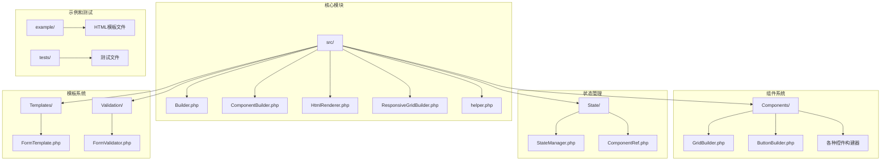
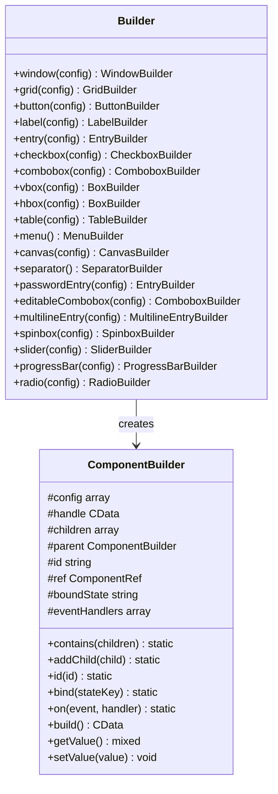
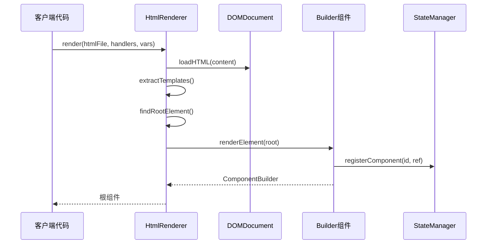
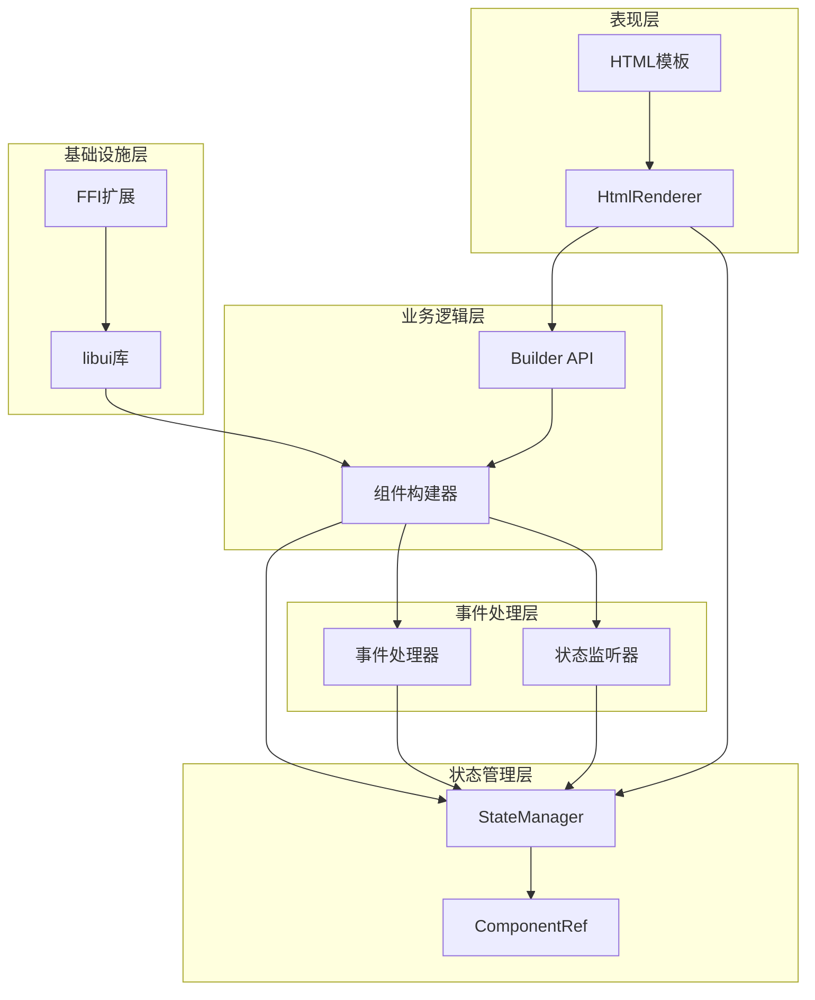
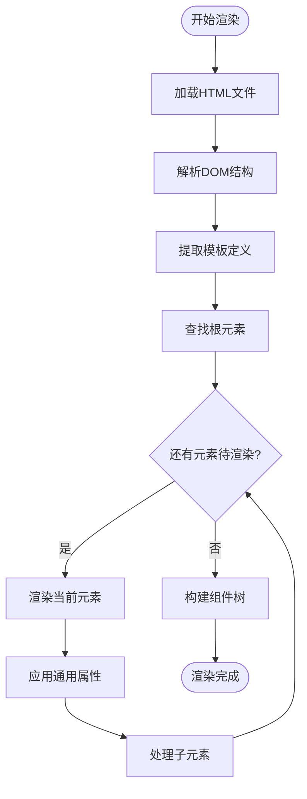
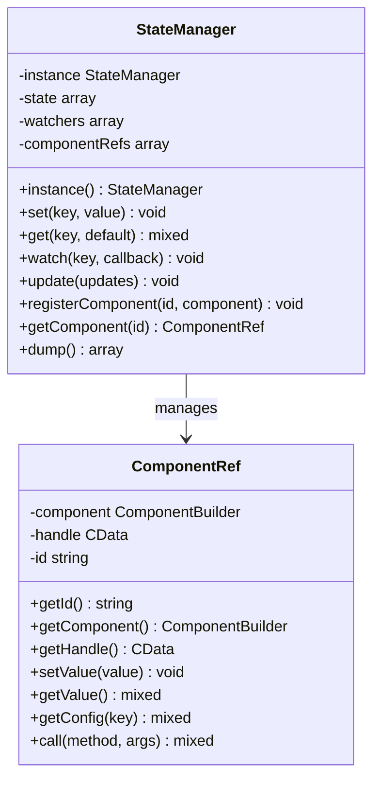
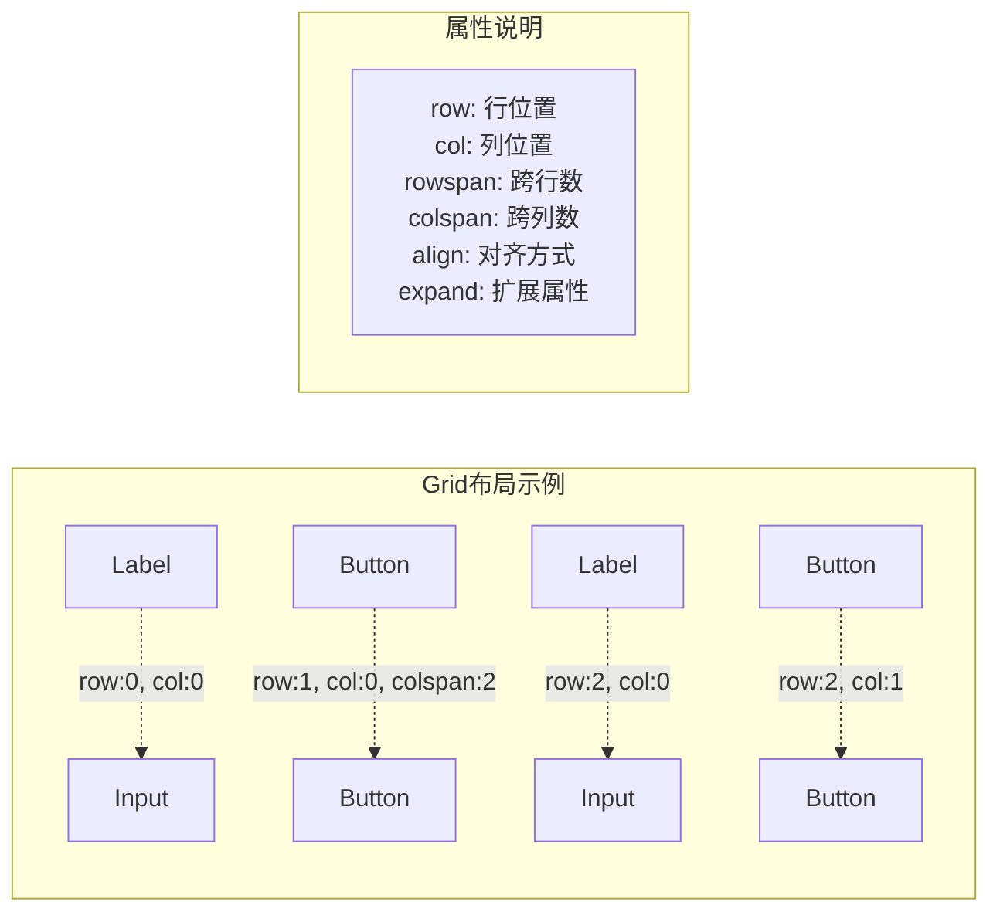
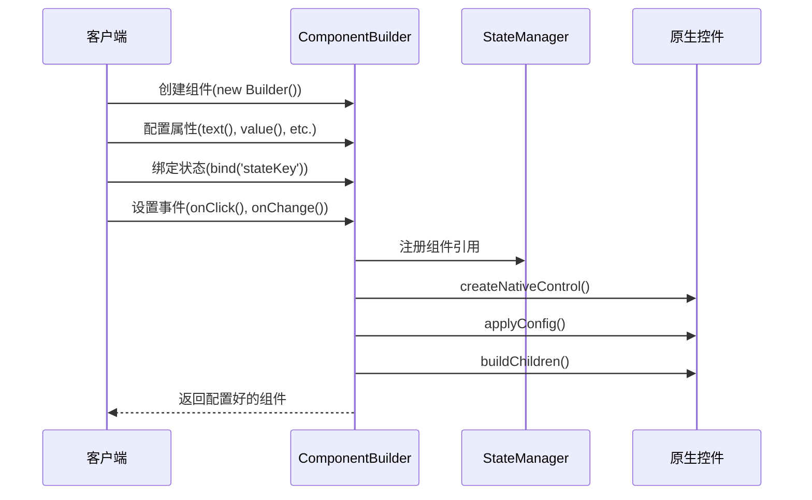
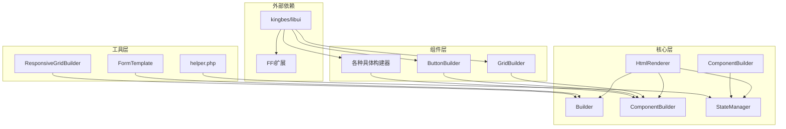

# HTML模板系统

<cite>
**本文档中引用的文件**
- [README.md](file://README.md)
- [composer.json](file://composer.json)
- [src/Builder.php](file://src/Builder.php)
- [src/ComponentBuilder.php](file://src/ComponentBuilder.php)
- [src/HtmlRenderer.php](file://src/HtmlRenderer.php)
- [src/Templates/FormTemplate.php](file://src/Templates/FormTemplate.php)
- [src/ResponsiveGridBuilder.php](file://src/ResponsiveGridBuilder.php)
- [src/helper.php](file://src/helper.php)
- [src/State/StateManager.php](file://src/State/StateManager.php)
- [src/State/ComponentRef.php](file://src/State/ComponentRef.php)
- [src/Components/GridBuilder.php](file://src/Components/GridBuilder.php)
- [src/Components/ButtonBuilder.php](file://src/Components/ButtonBuilder.php)
- [example/views/login.ui.html](file://example/views/login.ui.html)
- [example/htmlLogin.php](file://example/htmlLogin.php)
- [example/views/full.ui.html](file://example/views/full.ui.html)
- [example/full.php](file://example/full.php)
</cite>

## 目录
1. [简介](#简介)
2. [项目结构](#项目结构)
3. [核心组件](#核心组件)
4. [架构概览](#架构概览)
5. [详细组件分析](#详细组件分析)
6. [依赖关系分析](#依赖关系分析)
7. [性能考虑](#性能考虑)
8. [故障排除指南](#故障排除指南)
9. [结论](#结论)

## 简介

HTML模板系统是一个基于PHP的GUI应用程序开发框架，提供了直观、灵活的HTML语法来定义桌面应用程序界面。该系统结合了Builder模式和HTML模板渲染技术，为开发者提供了两种主要的开发方式：Builder API和HTML模板方式。

### 主要特性

- **Builder模式**：流畅的链式调用API
- **HTML模板渲染**：使用熟悉的HTML语法定义界面
- **强大的Grid布局**：精确的二维布局控制
- **状态管理**：响应式数据绑定
- **事件系统**：简洁的事件处理
- **组件复用**：模板系统支持
- **完整测试**：Pest测试覆盖

## 项目结构

**图表来源**
- [src/Builder.php](file://src/Builder.php#L1-L153)
- [src/ComponentBuilder.php](file://src/ComponentBuilder.php#L1-L234)
- [src/HtmlRenderer.php](file://src/HtmlRenderer.php#L1-L684)

**章节来源**
- [README.md](file://README.md#L1-L407)
- [composer.json](file://composer.json#L1-L37)

## 核心组件

### Builder类

Builder类是整个系统的核心入口点，提供了所有组件的静态工厂方法。它采用单一职责原则，专注于组件的创建和配置。

**图表来源**
- [src/Builder.php](file://src/Builder.php#L28-L153)
- [src/ComponentBuilder.php](file://src/ComponentBuilder.php#L11-L234)

### HTML渲染器

HTML渲染器负责将HTML模板文件转换为Builder组件树，是连接HTML语法和GUI组件的关键桥梁。

**图表来源**
- [src/HtmlRenderer.php](file://src/HtmlRenderer.php#L57-L77)
- [src/HtmlRenderer.php](file://src/HtmlRenderer.php#L162-L197)

**章节来源**
- [src/Builder.php](file://src/Builder.php#L1-L153)
- [src/ComponentBuilder.php](file://src/ComponentBuilder.php#L1-L234)
- [src/HtmlRenderer.php](file://src/HtmlRenderer.php#L1-L684)

## 架构概览

HTML模板系统采用了分层架构设计，清晰地分离了不同关注点：

**图表来源**
- [src/HtmlRenderer.php](file://src/HtmlRenderer.php#L41-L684)
- [src/State/StateManager.php](file://src/State/StateManager.php#L8-L91)

## 详细组件分析

### HTML渲染器详细分析

HTML渲染器是系统的核心组件，负责将HTML模板转换为可执行的GUI组件树。

#### 核心功能

1. **HTML解析与处理**
   - 支持UTF-8编码的HTML文件
   - 模板变量替换（`{{variable}}`语法）
   - 错误处理和异常抛出

2. **组件映射**
   - HTML标签到Builder组件的映射
   - 属性转换和配置应用
   - 事件处理器绑定

3. **布局系统**
   - Grid布局的精确控制
   - 嵌套容器的递归处理
   - 响应式布局支持

**图表来源**
- [src/HtmlRenderer.php](file://src/HtmlRenderer.php#L162-L197)
- [src/HtmlRenderer.php](file://src/HtmlRenderer.php#L280-L339)

#### 支持的HTML标签

系统支持丰富的HTML标签来定义界面：

| 标签类别 | 支持的标签 | 描述 |
|---------|-----------|------|
| 容器组件 | `<window>`, `<vbox>`, `<hbox>`, `<grid>`, `<tab>` | 布局容器 |
| 基础控件 | `<label>`, `<input>`, `<button>`, `<checkbox>` | 基本交互控件 |
| 选择控件 | `<combobox>`, `<spinbox>`, `<slider>`, `<progressbar>` | 数值和选择控件 |
| 其他控件 | `<separator>`, `<table>`, `<canvas>`, `<menu>` | 特殊用途控件 |

**章节来源**
- [src/HtmlRenderer.php](file://src/HtmlRenderer.php#L162-L683)

### 状态管理系统

状态管理系统提供了全局的数据共享和响应式更新机制。

#### 核心特性

1. **单例模式**：全局唯一的状态管理器实例
2. **响应式更新**：状态变化时自动通知监听器
3. **组件引用**：通过ID访问和操作其他组件
4. **双向绑定**：UI组件与状态数据的自动同步

**图表来源**
- [src/State/StateManager.php](file://src/State/StateManager.php#L8-L91)
- [src/State/ComponentRef.php](file://src/State/ComponentRef.php#L11-L74)

**章节来源**
- [src/State/StateManager.php](file://src/State/StateManager.php#L1-L91)
- [src/State/ComponentRef.php](file://src/State/ComponentRef.php#L1-L74)

### Grid布局系统

Grid布局系统提供了精确的二维布局控制，支持复杂的界面排列需求。

#### 核心功能

1. **位置控制**：通过`row`和`col`属性精确定位
2. **跨行列**：支持`rowspan`和`colspan`属性
3. **对齐方式**：多种对齐选项（`fill`, `start`, `center`, `end`）
4. **扩展属性**：控制组件如何填充可用空间

**图表来源**
- [src/Components/GridBuilder.php](file://src/Components/GridBuilder.php#L60-L66)
- [src/HtmlRenderer.php](file://src/HtmlRenderer.php#L290-L339)

**章节来源**
- [src/Components/GridBuilder.php](file://src/Components/GridBuilder.php#L1-L150)

### 组件构建器系统

组件构建器系统实现了Builder模式，提供了流畅的链式调用API。

#### 设计模式

1. **Builder模式**：将复杂对象的构建过程封装
2. **Fluent API**：支持链式调用的流畅接口
3. **配置模式**：通过配置数组管理组件属性

**图表来源**
- [src/ComponentBuilder.php](file://src/ComponentBuilder.php#L209-L231)

**章节来源**
- [src/ComponentBuilder.php](file://src/ComponentBuilder.php#L1-L234)

## 依赖关系分析

系统采用了清晰的依赖层次结构，确保了良好的可维护性和扩展性。

**图表来源**
- [composer.json](file://composer.json#L5-L8)
- [src/HtmlRenderer.php](file://src/HtmlRenderer.php#L1-L27)

### 关键依赖关系

1. **HTML渲染器依赖**：Builder API、状态管理、组件构建器
2. **组件构建器依赖**：状态管理器、FFI扩展、原生libui库
3. **状态管理依赖**：组件引用、事件系统

**章节来源**
- [composer.json](file://composer.json#L1-L37)
- [src/HtmlRenderer.php](file://src/HtmlRenderer.php#L1-L27)

## 性能考虑

### 渲染优化

1. **延迟构建**：组件只有在需要时才进行原生控件创建
2. **缓存机制**：状态变更时避免不必要的重新渲染
3. **批量更新**：支持批量状态更新以减少事件触发次数

### 内存管理

1. **资源释放**：及时清理不再使用的组件引用
2. **循环引用检测**：防止组件树中的循环引用导致内存泄漏
3. **FFI资源管理**：正确管理原生资源的生命周期

### 并发处理

1. **事件队列**：异步处理用户事件
2. **状态同步**：确保状态变更的原子性
3. **线程安全**：在多线程环境下的状态管理安全性

## 故障排除指南

### 常见问题及解决方案

#### HTML模板解析问题

**问题**：HTML文件无法正确解析
**解决方案**：
1. 检查文件编码是否为UTF-8
2. 确保HTML语法正确，特别是标签闭合
3. 验证模板文件路径是否正确

#### 组件绑定问题

**问题**：组件无法正确绑定到状态
**解决方案**：
1. 确认状态管理器已正确初始化
2. 检查组件ID是否唯一且正确
3. 验证状态键名是否匹配

#### 事件处理问题

**问题**：事件处理器未被调用
**解决方案**：
1. 确认事件名称拼写正确
2. 检查事件处理器函数签名
3. 验证事件绑定时机

**章节来源**
- [src/HtmlRenderer.php](file://src/HtmlRenderer.php#L82-L108)
- [src/ComponentBuilder.php](file://src/ComponentBuilder.php#L135-L146)

## 结论

HTML模板系统提供了一个强大而灵活的GUI应用程序开发框架。通过结合HTML模板语法和Builder API，开发者可以选择最适合其工作流程的开发方式。

### 主要优势

1. **学习曲线友好**：HTML语法易于理解和使用
2. **开发效率高**：模板复用和组件系统提高了开发速度
3. **维护性强**：清晰的架构和模块化设计便于长期维护
4. **扩展性好**：插件化的组件系统支持功能扩展

### 适用场景

- 桌面应用程序开发
- 快速原型制作
- 复杂表单界面构建
- 数据可视化应用

### 发展方向

1. **性能优化**：进一步提升渲染性能和内存使用效率
2. **功能扩展**：添加更多UI组件和布局选项
3. **开发工具**：提供更好的调试和开发工具支持
4. **社区生态**：建立更完善的第三方组件库

通过持续的改进和社区贡献，HTML模板系统将继续为PHP开发者提供优秀的GUI开发体验。