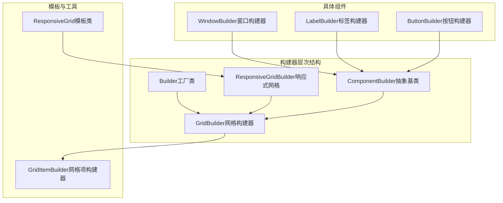
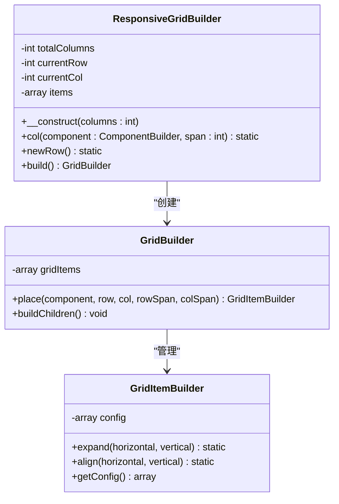
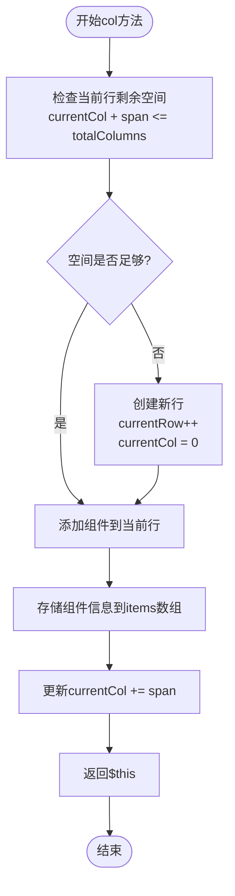
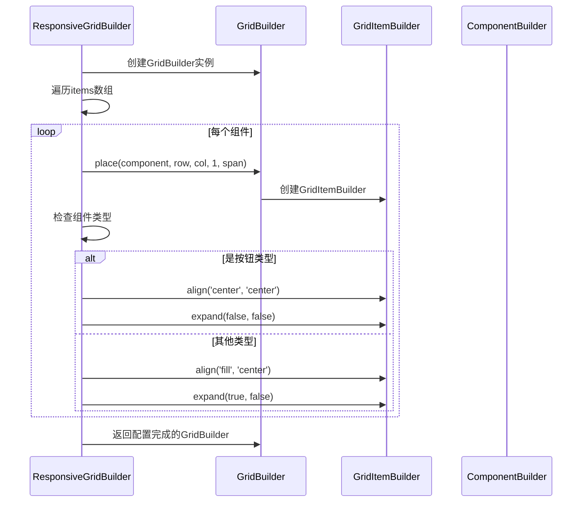
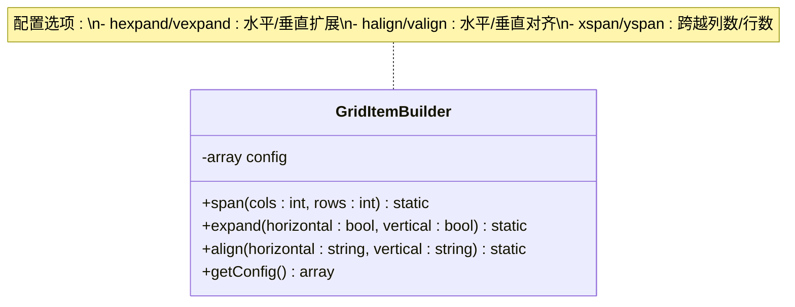
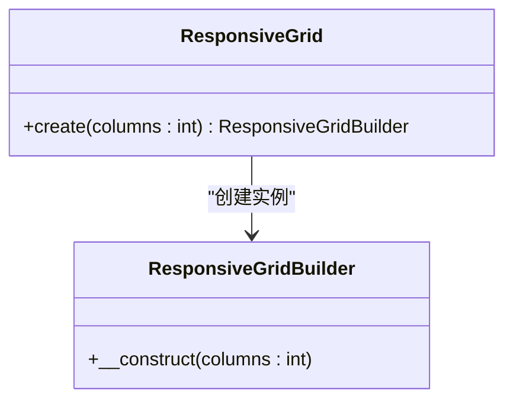

# 响应式网格布局系统深度解析

<cite>
**本文档中引用的文件**
- [ResponsiveGridBuilder.php](file://src/ResponsiveGridBuilder.php)
- [responseGrid.php](file://example/responseGrid.php)
- [GridBuilder.php](file://src/Components/GridBuilder.php)
- [ResponsiveGrid.php](file://src/Templates/ResponsiveGrid.php)
- [Builder.php](file://src/Builder.php)
- [ComponentBuilder.php](file://src/ComponentBuilder.php)
- [GridItemBuilder.php](file://src/Components/GridItemBuilder.php)
- [LabelBuilder.php](file://src/Components/LabelBuilder.php)
- [WindowBuilder.php](file://src/Components/WindowBuilder.php)
</cite>

## 目录
1. [简介](#简介)
2. [项目架构概览](#项目架构概览)
3. [ResponsiveGridBuilder核心设计](#responsivegridbuilder核心设计)
4. [详细组件分析](#详细组件分析)
5. [使用案例与最佳实践](#使用案例与最佳实践)
6. [性能优化与设计模式](#性能优化与设计模式)
7. [故障排除指南](#故障排除指南)
8. [总结](#总结)

## 简介

ResponsiveGridBuilder是一个高级的二维网格布局系统，专为PHP LibUI应用程序设计。它提供了类似CSS Grid的断点适应机制，通过智能的空间管理和自动换行功能，使开发者能够轻松创建复杂的响应式界面布局。

该系统的核心优势在于：
- **智能换行机制**：自动检测当前行剩余空间并处理换行
- **类型化对齐策略**：根据组件类型（按钮vs其他控件）应用不同的对齐和扩展策略
- **高级封装**：作为GridBuilder的高级封装，提升代码可维护性和可读性
- **灵活的列数配置**：支持自定义总列数，默认12列网格系统

## 项目架构概览



**图表来源**
- [Builder.php](file://src/Builder.php#L27-L153)
- [ComponentBuilder.php](file://src/ComponentBuilder.php#L11-L234)
- [GridBuilder.php](file://src/Components/GridBuilder.php#L9-L120)
- [ResponsiveGridBuilder.php](file://src/ResponsiveGridBuilder.php#L7-L82)

**章节来源**
- [Builder.php](file://src/Builder.php#L1-L153)
- [ComponentBuilder.php](file://src/ComponentBuilder.php#L1-L234)
- [GridBuilder.php](file://src/Components/GridBuilder.php#L1-L120)

## ResponsiveGridBuilder核心设计

### 构造函数与初始化

ResponsiveGridBuilder采用简洁而强大的设计理念，其构造函数接受一个可选的列数参数，默认为12列网格系统：



**图表来源**
- [ResponsiveGridBuilder.php](file://src/ResponsiveGridBuilder.php#L7-L82)
- [GridBuilder.php](file://src/Components/GridBuilder.php#L9-L120)
- [GridItemBuilder.php](file://src/Components/GridItemBuilder.php#L8-L60)

### col方法的智能换行算法

col方法是ResponsiveGridBuilder的核心功能，实现了智能的空间检测和自动换行机制：



**图表来源**
- [ResponsiveGridBuilder.php](file://src/ResponsiveGridBuilder.php#L19-L35)

这种智能换行机制确保了：
- **空间利用率最大化**：充分利用每一行的空间
- **自动布局**：开发者无需手动管理换行逻辑
- **灵活性**：支持任意跨度的组件排列

### build方法的高级封装策略

build方法展示了ResponsiveGridBuilder作为高级封装的优势，它不仅创建GridBuilder实例，还为不同类型组件应用智能的对齐策略：



**图表来源**
- [ResponsiveGridBuilder.php](file://src/ResponsiveGridBuilder.php#L45-L69)

**章节来源**
- [ResponsiveGridBuilder.php](file://src/ResponsiveGridBuilder.php#L1-L82)

## 详细组件分析

### GridBuilder基础架构

GridBuilder作为底层网格构建器，提供了完整的网格布局功能：

| 属性 | 类型 | 默认值 | 描述 |
|------|------|--------|------|
| padded | bool | true | 是否启用内边距 |
| columnSpacing | int | 1 | 列间距 |
| rowSpacing | int | 1 | 行间距 |

| 方法 | 参数 | 返回值 | 功能描述 |
|------|------|--------|----------|
| place | ComponentBuilder, int, int, int, int | GridItemBuilder | 在指定位置放置组件 |
| row | array | static | 批量放置同一行的组件 |
| form | array | static | 快速创建表单布局 |
| append | array | static | 追加到表单底部 |

### GridItemBuilder对齐与扩展策略

GridItemBuilder负责每个网格项的具体配置，实现了精细的布局控制：



**图表来源**
- [GridItemBuilder.php](file://src/Components/GridItemBuilder.php#L8-L60)

### 组件类型识别与策略应用

build方法中的组件类型识别逻辑体现了系统的智能化：

| 组件类型 | 对齐策略 | 扩展策略 | 设计考虑 |
|----------|----------|----------|----------|
| 按钮组件 | center, center | false, false | 防止按钮被拉伸变形，保持原始尺寸 |
| 标签组件 | fill, center | true, false | 充分利用可用空间，保持垂直居中 |
| 输入框组件 | fill, center | true, false | 支持水平扩展以适应内容变化 |
| 其他控件 | fill, center | true, false | 通用策略，最大化空间利用 |

**章节来源**
- [GridBuilder.php](file://src/Components/GridBuilder.php#L1-L120)
- [GridItemBuilder.php](file://src/Components/GridItemBuilder.php#L1-L60)

## 使用案例与最佳实践

### 基础使用模式

基于example/responseGrid.php的使用案例，我们可以看到典型的响应式网格布局模式：

#### 全宽标题布局
```php
// 全宽标题 - 占据12列
->col(Builder::label()->text('标题'), 12)
```

#### 左右分栏布局
```php
// 左侧半宽 - 6列
->col(Builder::label()->text('左侧'), 6)
// 右侧半宽 - 6列  
->col(Builder::label()->text('右侧'), 6)
```

#### 四等分按钮组
```php
// 四个1/4宽度的按钮
->col(Builder::button()->text('1/4'), 3)
->col(Builder::button()->text('1/4'), 3)
->col(Builder::button()->text('1/4'), 3)
->col(Builder::button()->text('1/4'), 3)
```

### 高级布局模式

#### 强制换行使用
```php
$responsiveLayout = ResponsiveGrid::create(12)
    ->col(Builder::label()->text('第一行'), 6)
    ->col(Builder::label()->text('第二行'), 6)
    ->newRow()  // 强制换行
    ->col(Builder::button()->text('第三行按钮'), 12);
```

#### 混合布局组合
```php
$responsiveLayout = ResponsiveGrid::create(12)
    ->col(Builder::label()->text('全宽标题'), 12)
    ->newRow()
    ->col(Builder::label()->text('左侧内容'), 8)  // 8/12
    ->col(Builder::button()->text('操作按钮'), 4); // 4/12
```

### 性能优化建议

1. **合理规划列数**：根据实际需求选择合适的总列数，避免过度细分
2. **批量操作**：对于大量相似组件，考虑使用row()方法进行批量处理
3. **组件复用**：对于重复使用的组件模板，提前创建并复用
4. **内存管理**：及时释放不需要的组件引用，特别是在循环中创建大量组件时

**章节来源**
- [responseGrid.php](file://example/responseGrid.php#L1-L25)
- [ResponsiveGrid.php](file://src/Templates/ResponsiveGrid.php#L1-L14)

## 性能优化与设计模式

### 设计模式应用

ResponsiveGridBuilder采用了多种经典的设计模式：

#### 工厂模式


**图表来源**
- [ResponsiveGrid.php](file://src/Templates/ResponsiveGrid.php#L8-L13)

#### 流式接口模式
所有主要方法都返回`static`类型，支持链式调用，提高了代码的可读性和编写效率。

#### 策略模式
build方法中根据不同组件类型应用不同的对齐和扩展策略，体现了策略模式的应用。

### 内存管理优化

| 优化策略 | 实现方式 | 效果 |
|----------|----------|------|
| 延迟初始化 | 组件在build()时才创建原生句柄 | 减少不必要的资源分配 |
| 引用管理 | 使用ComponentRef跟踪组件引用 | 防止内存泄漏 |
| 配置缓存 | 缓存组件配置信息 | 减少重复计算开销 |

### 扩展性设计

系统设计具有良好的扩展性：
- **插件化组件**：新的组件类型只需继承ComponentBuilder即可无缝集成
- **配置驱动**：通过配置数组支持灵活的定制
- **事件系统**：内置事件处理机制支持交互式布局

## 故障排除指南

### 常见问题与解决方案

#### 问题1：组件显示异常或布局错乱
**症状**：组件出现在错误的位置或大小不符合预期
**原因**：span参数超出总列数限制
**解决方案**：检查所有col调用的span参数，确保不超过totalColumns

#### 问题2：按钮被拉伸变形
**症状**：按钮看起来被拉长或压缩
**原因**：build方法未正确识别按钮类型
**解决方案**：确认组件类名包含"Button"字符串，或者手动设置对齐策略

#### 问题3：内存使用过高
**症状**：程序运行一段时间后内存持续增长
**原因**：组件引用未正确释放
**解决方案**：检查是否有循环引用，及时清理不需要的组件引用

### 调试技巧

1. **启用调试模式**：在开发环境中启用详细的日志输出
2. **组件追踪**：使用id()方法为关键组件设置标识符
3. **布局验证**：在build()后立即验证生成的GridBuilder配置

**章节来源**
- [ComponentBuilder.php](file://src/ComponentBuilder.php#L1-L234)

## 总结

ResponsiveGridBuilder作为一个高级的二维网格布局系统，成功地将CSS Grid的设计理念引入PHP LibUI生态系统。它通过以下特性实现了复杂布局的简化：

### 核心优势

1. **智能空间管理**：自动检测和处理行空间不足的情况
2. **类型化策略**：根据组件类型自动应用最优的对齐和扩展策略
3. **流畅的API设计**：支持链式调用，提高开发效率
4. **高度可扩展**：良好的架构设计支持未来的功能扩展

### 适用场景

- **仪表板界面**：需要灵活布局的监控面板
- **表单系统**：复杂的多步骤表单页面
- **数据展示**：需要分栏展示的列表或表格
- **响应式设计**：需要适配不同屏幕尺寸的界面

### 发展方向

随着PHP LibUI生态系统的不断发展，ResponsiveGridBuilder可以进一步增强的功能包括：
- **断点支持**：实现类似CSS媒体查询的断点适配
- **动画支持**：添加布局变化的过渡动画
- **拖拽重排**：支持用户自定义布局顺序
- **主题系统**：提供统一的视觉风格控制

通过深入理解ResponsiveGridBuilder的设计原理和实现细节，开发者可以更好地利用这一强大工具，创建出既美观又实用的桌面应用程序界面。