# 模板系统

<cite>
**本文档中引用的文件**
- [FormTemplate.php](file://src/Templates/FormTemplate.php)
- [ResponsiveGrid.php](file://src/Templates/ResponsiveGrid.php)
- [ResponsiveGridBuilder.php](file://src/ResponsiveGridBuilder.php)
- [GridBuilder.php](file://src/Components/GridBuilder.php)
- [GridItemBuilder.php](file://src/Components/GridItemBuilder.php)
- [responseGrid.php](file://example/responseGrid.php)
- [Builder.php](file://src/Builder.php)
- [ComponentBuilder.php](file://src/ComponentBuilder.php)
</cite>

## 目录
1. [简介](#简介)
2. [项目结构](#项目结构)
3. [核心组件](#核心组件)
4. [架构概览](#架构概览)
5. [详细组件分析](#详细组件分析)
6. [依赖关系分析](#依赖关系分析)
7. [性能考虑](#性能考虑)
8. [故障排除指南](#故障排除指南)
9. [结论](#结论)

## 简介

libuiBuilder提供了一套强大的模板系统，专门用于简化GUI应用程序的布局设计。该系统包含两个主要的模板类：FormTemplate用于快速创建表单界面，以及ResponsiveGridBuilder用于实现响应式网格布局。这些模板基于GridBuilder进行封装和扩展，提供了更高层次的抽象，显著提升了开发效率。

## 项目结构

libuiBuilder的模板系统采用模块化设计，主要文件组织如下：

**图表来源**
- [FormTemplate.php](file://src/Templates/FormTemplate.php#L1-L46)
- [ResponsiveGrid.php](file://src/Templates/ResponsiveGrid.php#L1-L14)
- [ResponsiveGridBuilder.php](file://src/ResponsiveGridBuilder.php#L1-L82)
- [GridBuilder.php](file://src/Components/GridBuilder.php#L1-L120)

**章节来源**
- [FormTemplate.php](file://src/Templates/FormTemplate.php#L1-L46)
- [ResponsiveGrid.php](file://src/Templates/ResponsiveGrid.php#L1-L14)
- [ResponsiveGridBuilder.php](file://src/ResponsiveGridBuilder.php#L1-L82)

## 核心组件

### FormTemplate类

FormTemplate是专门用于创建表单界面的模板类，它通过声明式的字段结构自动生成网格布局的表单界面。

#### 主要特性：
- **声明式字段定义**：支持label-control配对的字段结构
- **自动布局生成**：自动生成垂直排列的表单布局
- **多种控件类型**：支持文本输入、复选框、下拉框等多种控件
- **类型安全**：内置字段类型验证机制

#### 支持的字段类型：
- `text`：文本输入框
- `checkbox`：复选框
- `combobox`：下拉选择框

### ResponsiveGridBuilder类

ResponsiveGridBuilder实现了响应式网格布局系统，能够根据不同的窗口尺寸自动调整布局。

#### 核心功能：
- **栅格系统**：支持12列栅格布局
- **智能换行**：自动处理列溢出和换行
- **灵活的列跨度**：支持不同宽度的列组合
- **自动对齐**：为不同类型控件设置合适的对齐方式

**章节来源**
- [FormTemplate.php](file://src/Templates/FormTemplate.php#L11-L46)
- [ResponsiveGridBuilder.php](file://src/ResponsiveGridBuilder.php#L7-L82)

## 架构概览

libuiBuilder模板系统采用分层架构设计，从底层的组件构建器到高层的模板类，形成了清晰的抽象层次：

**图表来源**
- [ComponentBuilder.php](file://src/ComponentBuilder.php#L11-L234)
- [GridBuilder.php](file://src/Components/GridBuilder.php#L9-L120)
- [GridItemBuilder.php](file://src/Components/GridItemBuilder.php#L8-L60)
- [FormTemplate.php](file://src/Templates/FormTemplate.php#L9-L46)
- [ResponsiveGridBuilder.php](file://src/ResponsiveGridBuilder.php#L7-L82)

## 详细组件分析

### FormTemplate详细分析

FormTemplate类提供了简洁的表单创建接口，通过声明式的字段定义自动生成表单布局。

#### 实现原理

**图表来源**
- [FormTemplate.php](file://src/Templates/FormTemplate.php#L11-L38)

#### 使用模式

FormTemplate采用静态工厂模式，通过简单的数组配置即可生成复杂的表单布局。每个字段定义包含以下结构：
- `label`：显示在表单中的标签文本
- `type`：控件类型（text、checkbox、combobox等）
- `placeholder`：占位符文本（适用于文本输入框）
- `text`：控件显示文本（适用于复选框）
- `items`：选项列表（适用于下拉框）

**章节来源**
- [FormTemplate.php](file://src/Templates/FormTemplate.php#L11-L38)

### ResponsiveGridBuilder详细分析

ResponsiveGridBuilder实现了智能的响应式网格布局系统，能够根据可用空间自动调整组件布局。

#### 布局算法

**图表来源**
- [ResponsiveGridBuilder.php](file://src/ResponsiveGridBuilder.php#L19-L67)

#### 对齐策略

ResponsiveGridBuilder针对不同类型的组件采用了智能的对齐策略：

| 组件类型 | 对齐方式 | 扩展属性 | 设计目的 |
|---------|---------|---------|---------|
| 按钮组件 | 居中对齐 | 不扩展 | 避免按钮被拉伸变形 |
| 标签组件 | 填充对齐 | 水平扩展 | 充分利用可用空间 |
| 输入框 | 填充对齐 | 水平扩展 | 保持一致的视觉宽度 |
| 下拉框 | 填充对齐 | 水平扩展 | 提供最佳的交互体验 |

**章节来源**
- [ResponsiveGridBuilder.php](file://src/ResponsiveGridBuilder.php#L19-L67)

### GridBuilder扩展功能

GridBuilder作为基础网格组件，提供了丰富的布局扩展功能：

#### 表单专用方法

**图表来源**
- [GridBuilder.php](file://src/Components/GridBuilder.php#L79-L119)

**章节来源**
- [GridBuilder.php](file://src/Components/GridBuilder.php#L79-L119)

## 依赖关系分析

模板系统的依赖关系体现了清晰的分层架构：

```mermaid
graph TD
subgraph "应用层"
Example[example/responseGrid.php]
end
subgraph "模板层"
FormTemplate[Templates/FormTemplate]
ResponsiveGrid[Templates/ResponsiveGrid]
end
subgraph "构建器层"
ResponsiveGridBuilder[ResponsiveGridBuilder]
GridBuilder[Components/GridBuilder]
end
subgraph "基础层"
Builder[Builder]
ComponentBuilder[ComponentBuilder]
end
Example --> ResponsiveGrid
ResponsiveGrid --> ResponsiveGridBuilder
FormTemplate --> GridBuilder
ResponsiveGridBuilder --> GridBuilder
GridBuilder --> ComponentBuilder
Builder --> GridBuilder
```

**图表来源**
- [responseGrid.php](file://example/responseGrid.php#L1-L25)
- [ResponsiveGrid.php](file://src/Templates/ResponsiveGrid.php#L1-L14)
- [ResponsiveGridBuilder.php](file://src/ResponsiveGridBuilder.php#L1-L82)
- [Builder.php](file://src/Builder.php#L1-L153)

### 关键依赖点

1. **Builder类**：提供统一的组件创建入口
2. **ComponentBuilder基类**：所有组件的基础抽象
3. **GridBuilder**：网格布局的核心实现
4. **GridItemBuilder**：网格项的配置管理

**章节来源**
- [responseGrid.php](file://example/responseGrid.php#L1-L25)
- [Builder.php](file://src/Builder.php#L1-L153)

## 性能考虑

### 内存优化策略

1. **延迟构建**：组件采用延迟构建模式，只有在需要时才创建原生控件
2. **对象池化**：GridItemBuilder采用值对象设计，避免不必要的对象创建
3. **配置缓存**：组件配置在构建过程中一次性应用，减少重复操作

### 渲染性能

1. **批量操作**：GridBuilder支持批量添加网格项，减少原生控件调用次数
2. **智能布局**：ResponsiveGridBuilder避免不必要的重新布局计算
3. **最小化重绘**：通过合理的对齐和扩展设置，减少UI重绘频率

## 故障排除指南

### 常见问题及解决方案

#### FormTemplate问题

**问题**：未知字段类型异常
- **原因**：传递了不支持的字段类型
- **解决**：检查字段定义中的type字段，确保使用支持的类型

**问题**：表单布局错乱
- **原因**：字段配置不完整或类型不匹配
- **解决**：验证字段数组结构，确保每个字段都有正确的配置

#### ResponsiveGridBuilder问题

**问题**：响应式布局失效
- **原因**：总列数设置不当或列跨度超出范围
- **解决**：检查构造函数参数和col方法的span值

**问题**：组件对齐异常
- **原因**：组件类型检测逻辑问题
- **解决**：检查组件类名是否符合预期模式

**章节来源**
- [FormTemplate.php](file://src/Templates/FormTemplate.php#L35-L37)
- [ResponsiveGridBuilder.php](file://src/ResponsiveGridBuilder.php#L22-L25)

## 结论

libuiBuilder的模板系统通过FormTemplate和ResponsiveGridBuilder提供了强大而灵活的布局解决方案。FormTemplate简化了表单创建过程，通过声明式的字段定义大幅减少了重复代码；ResponsiveGridBuilder则实现了智能的响应式布局，能够适应不同的窗口尺寸。

这两个模板类都基于GridBuilder进行封装，体现了良好的设计原则：单一职责、开闭原则和依赖倒置。它们不仅提高了开发效率，还保证了代码的可维护性和可扩展性。

对于开发者而言，掌握这些模板系统的使用方法，可以显著提升GUI应用程序的开发速度和质量。同时，理解其背后的实现原理，有助于在复杂场景下进行定制化开发。