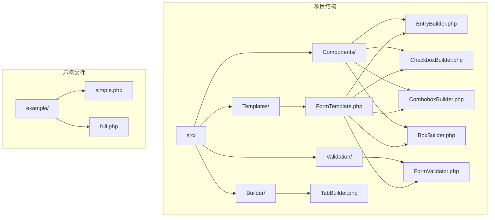
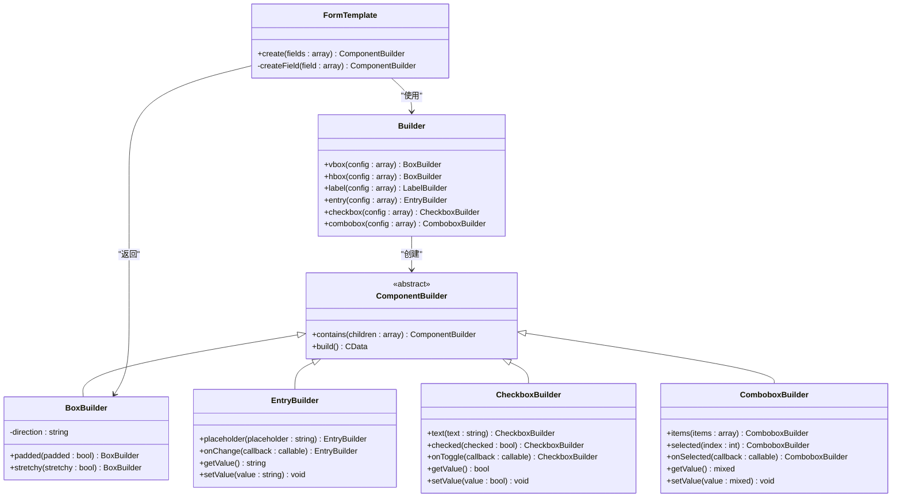
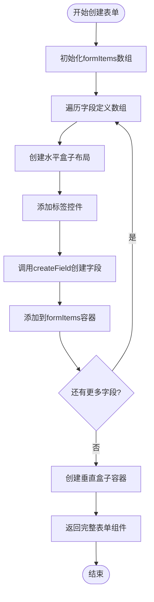
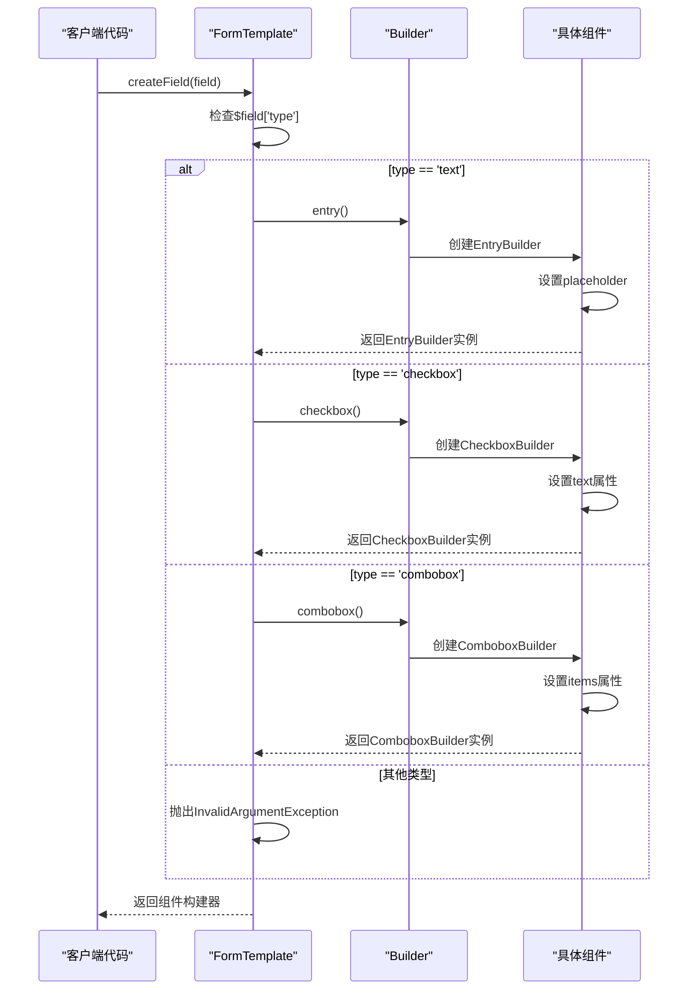
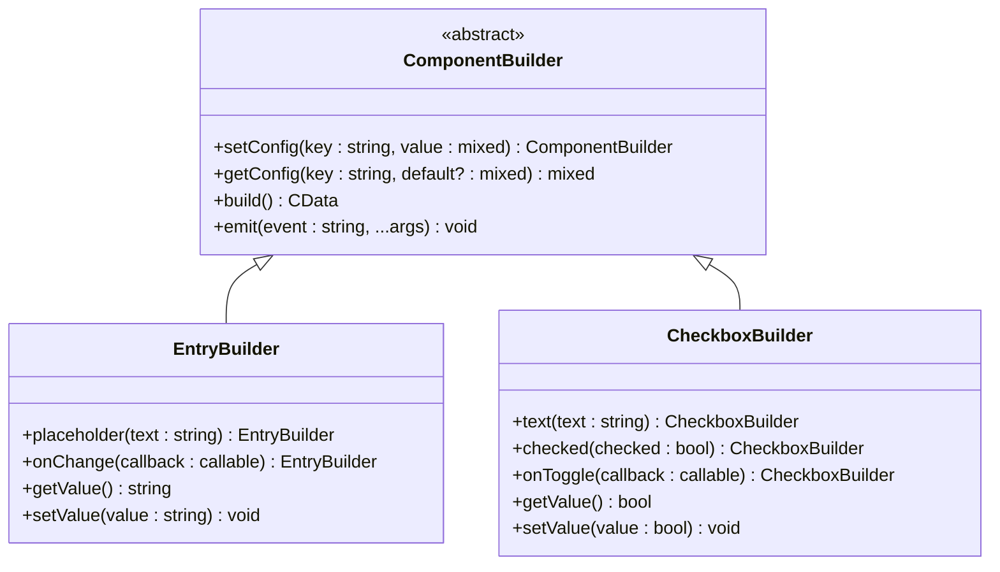
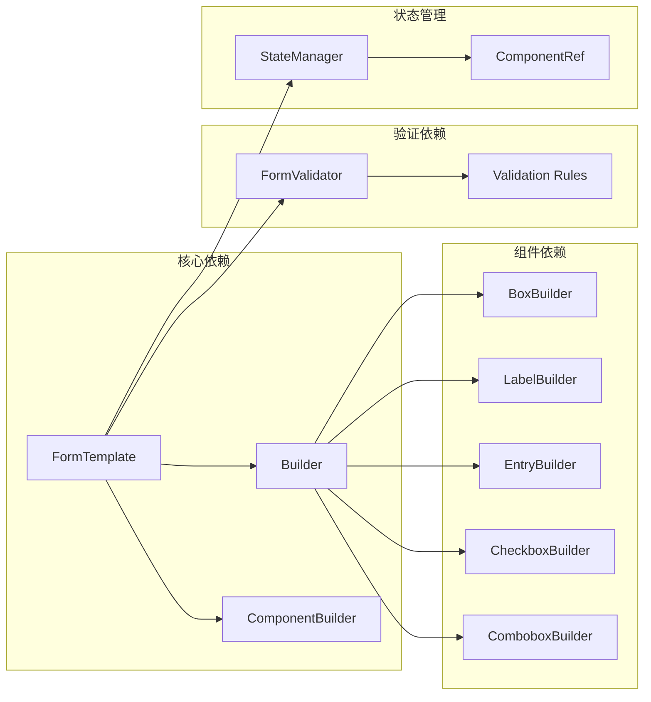

# 表单模板

<cite>
**本文档中引用的文件**
- [FormTemplate.php](file://src/Templates/FormTemplate.php)
- [FormValidator.php](file://src/Validation/FormValidator.php)
- [Builder.php](file://src/Builder.php)
- [EntryBuilder.php](file://src/Components/EntryBuilder.php)
- [CheckboxBuilder.php](file://src/Components/CheckboxBuilder.php)
- [ComboboxBuilder.php](file://src/Components/ComboboxBuilder.php)
- [BoxBuilder.php](file://src/Components/BoxBuilder.php)
- [full.php](file://example/full.php)
- [simple.php](file://example/simple.php)
</cite>

## 目录
1. [简介](#简介)
2. [项目结构](#项目结构)
3. [核心组件](#核心组件)
4. [架构概览](#架构概览)
5. [详细组件分析](#详细组件分析)
6. [依赖关系分析](#依赖关系分析)
7. [性能考虑](#性能考虑)
8. [故障排除指南](#故障排除指南)
9. [结论](#结论)

## 简介

FormTemplate类是libuiBuilder框架中的一个核心模板类，专门用于快速构建结构化表单界面。它通过静态create方法接收字段定义数组，自动生成包含标签和对应输入控件的表单布局，大大简化了表单开发流程。该类采用Builder模式和链式调用设计，支持多种字段类型的动态创建，并与Validation模块无缝集成，为开发者提供了完整的表单解决方案。

## 项目结构

libuiBuilder项目采用模块化架构，FormTemplate作为模板层的核心组件，位于`src/Templates`目录下，与其他组件协同工作：

**图表来源**
- [FormTemplate.php](file://src/Templates/FormTemplate.php#L1-L46)
- [Builder.php](file://src/Builder.php#L1-L153)

**章节来源**
- [FormTemplate.php](file://src/Templates/FormTemplate.php#L1-L46)
- [Builder.php](file://src/Builder.php#L1-L153)

## 核心组件

FormTemplate类的核心功能围绕两个主要方法展开：

### create方法
静态工厂方法，接收字段定义数组并返回完整的表单组件树。该方法负责：
- 遍历字段定义数组
- 为每个字段创建水平盒子布局
- 将标签和对应控件组合在一起
- 返回垂直盒子容器包含所有表单项

### createField私有方法  
根据字段类型动态创建相应的UI组件：
- `text`类型：创建带占位符的输入框
- `checkbox`类型：创建带文本的复选框
- `combobox`类型：创建带选项列表的下拉框
- 不支持的类型：抛出InvalidArgumentException异常

**章节来源**
- [FormTemplate.php](file://src/Templates/FormTemplate.php#L11-L38)

## 架构概览

FormTemplate采用Builder模式和组合模式，通过静态工厂方法创建复杂的表单结构：

**图表来源**
- [FormTemplate.php](file://src/Templates/FormTemplate.php#L11-L38)
- [Builder.php](file://src/Builder.php#L27-L152)
- [BoxBuilder.php](file://src/Components/BoxBuilder.php#L11-L64)

## 详细组件分析

### FormTemplate.create方法实现

create方法展示了FormTemplate的核心设计理念：

**图表来源**
- [FormTemplate.php](file://src/Templates/FormTemplate.php#L11-L24)

### createField方法的字段类型处理

createField方法根据字段类型动态创建对应的UI组件：

**图表来源**
- [FormTemplate.php](file://src/Templates/FormTemplate.php#L26-L38)

### 字段定义结构分析

FormTemplate支持的字段定义结构包括以下关键属性：

| 属性名 | 类型 | 必需 | 描述 | 示例 |
|--------|------|------|------|------|
| `label` | string | 是 | 字段标签文本 | `'用户名'` |
| `type` | string | 是 | 字段类型标识 | `'text'`, `'checkbox'`, `'combobox'` |
| `placeholder` | string | 否 | 输入框占位符文本 | `'请输入用户名'` |
| `text` | string | 否 | 复选框显示文本 | `'下次自动登录'` |
| `items` | array | 否 | 下拉框选项列表 | `['选项1', '选项2']` |

### 组件构建器链式调用机制

每个组件构建器都实现了链式调用接口，允许连续设置多个属性：

**图表来源**
- [EntryBuilder.php](file://src/Components/EntryBuilder.php#L66-L79)
- [CheckboxBuilder.php](file://src/Components/CheckboxBuilder.php#L71-L96)

**章节来源**
- [FormTemplate.php](file://src/Templates/FormTemplate.php#L11-L38)
- [EntryBuilder.php](file://src/Components/EntryBuilder.php#L1-L80)
- [CheckboxBuilder.php](file://src/Components/CheckboxBuilder.php#L1-L97)

## 依赖关系分析

FormTemplate与整个libuiBuilder生态系统紧密集成：

**图表来源**
- [FormTemplate.php](file://src/Templates/FormTemplate.php#L5-L8)
- [Builder.php](file://src/Builder.php#L1-L153)

### Builder模式的应用

Builder类作为工厂方法的统一入口，提供了静态方法来创建各种UI组件：

- **窗口组件**：`window()` - 创建主窗口
- **容器组件**：`vbox()`, `hbox()`, `grid()` - 创建布局容器
- **控件组件**：`button()`, `label()`, `entry()`, `checkbox()`, `combobox()` - 创建交互控件
- **便捷方法**：`passwordEntry()`, `editableCombobox()` - 提供常用变体

**章节来源**
- [FormTemplate.php](file://src/Templates/FormTemplate.php#L5-L8)
- [Builder.php](file://src/Builder.php#L27-L152)

## 性能考虑

FormTemplate在设计时充分考虑了性能优化：

### 内存管理
- 使用静态方法避免实例化开销
- 组件构建器采用延迟初始化策略
- 及时释放不需要的CData资源

### 渲染优化
- 批量创建子组件，减少系统调用
- 利用libui原生布局引擎进行高效渲染
- 支持组件复用和状态保持

### 内存使用优化
- 字段定义数组按需解析
- 组件树结构扁平化设计
- 避免不必要的对象创建

## 故障排除指南

### 常见问题及解决方案

#### 字段类型错误
**问题**：使用不支持的字段类型
**解决方案**：检查字段定义中的`type`属性，确保使用支持的类型

#### 组件构建失败
**问题**：组件无法正确创建
**解决方案**：验证Builder类的导入和实例化过程

#### 验证规则冲突
**问题**：FormValidator规则配置错误
**解决方案**：检查规则定义语法和参数格式

### 调试技巧

1. **字段定义验证**：打印字段数组结构确认格式正确
2. **组件树检查**：使用StateManager查看组件层次结构
3. **事件监听**：添加onChange回调函数跟踪状态变化
4. **错误捕获**：使用try-catch块捕获异常信息

**章节来源**
- [FormTemplate.php](file://src/Templates/FormTemplate.php#L35-L37)
- [FormValidator.php](file://src/Validation/FormValidator.php#L14-L28)

## 结论

FormTemplate类是libuiBuilder框架中一个精心设计的模板组件，它通过简洁的API和强大的功能组合，为开发者提供了快速构建表单界面的解决方案。其核心优势包括：

### 设计优势
- **简洁的API**：通过字段定义数组即可生成复杂表单
- **类型安全**：严格的字段类型检查防止运行时错误
- **扩展性强**：易于添加新的字段类型和验证规则
- **性能优化**：基于原生libui库的高效渲染

### 应用价值
- **开发效率**：大幅减少表单代码编写时间
- **维护性**：清晰的结构便于后续维护和扩展
- **一致性**：统一的表单样式和行为规范
- **集成性**：与Validation模块完美配合

### 发展方向
- 支持更多字段类型（如日期选择器、文件上传等）
- 增强响应式布局支持
- 提供更丰富的验证规则
- 支持国际化和本地化

FormTemplate不仅是一个实用的工具类，更是libuiBuilder框架设计理念的体现，展现了现代GUI框架中模板模式和Builder模式的最佳实践。