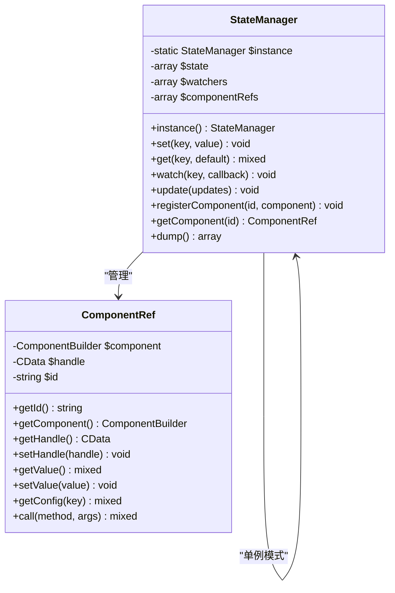
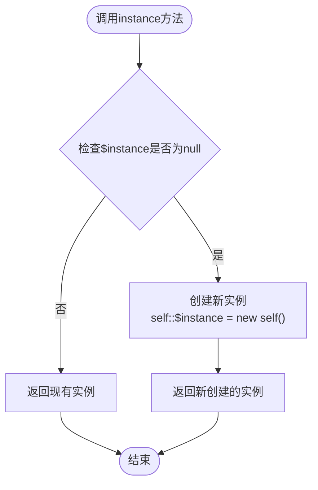
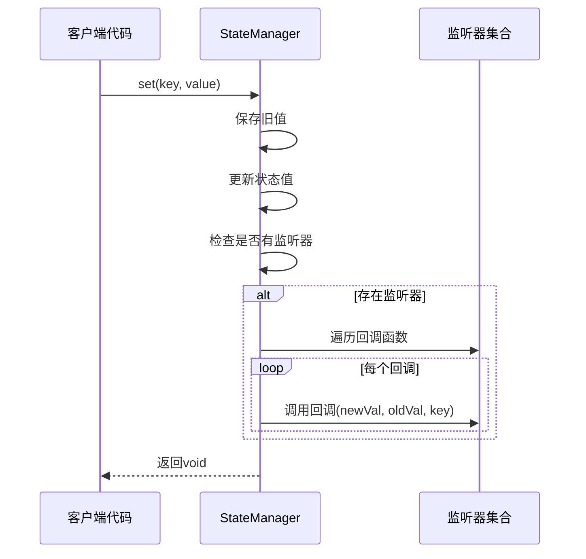
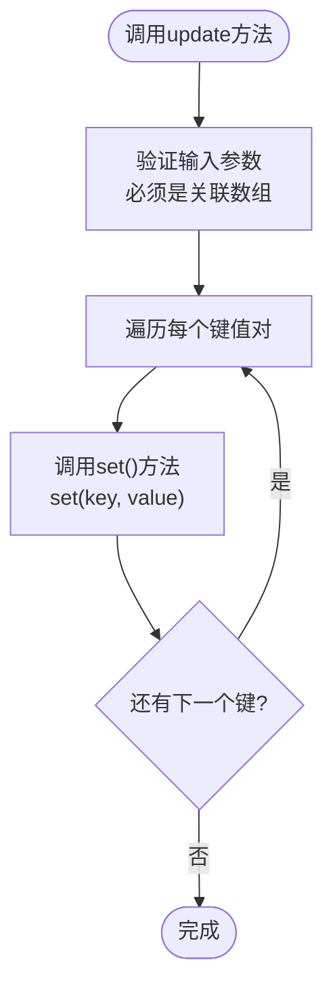
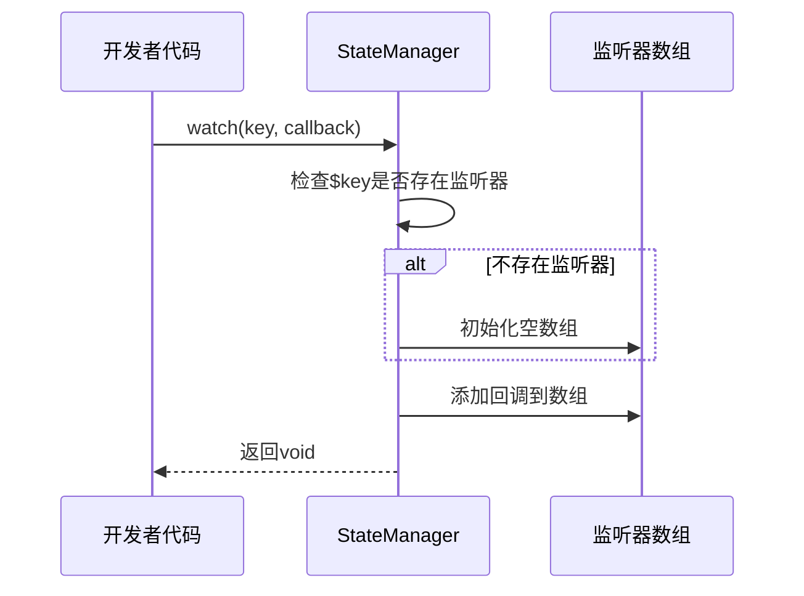
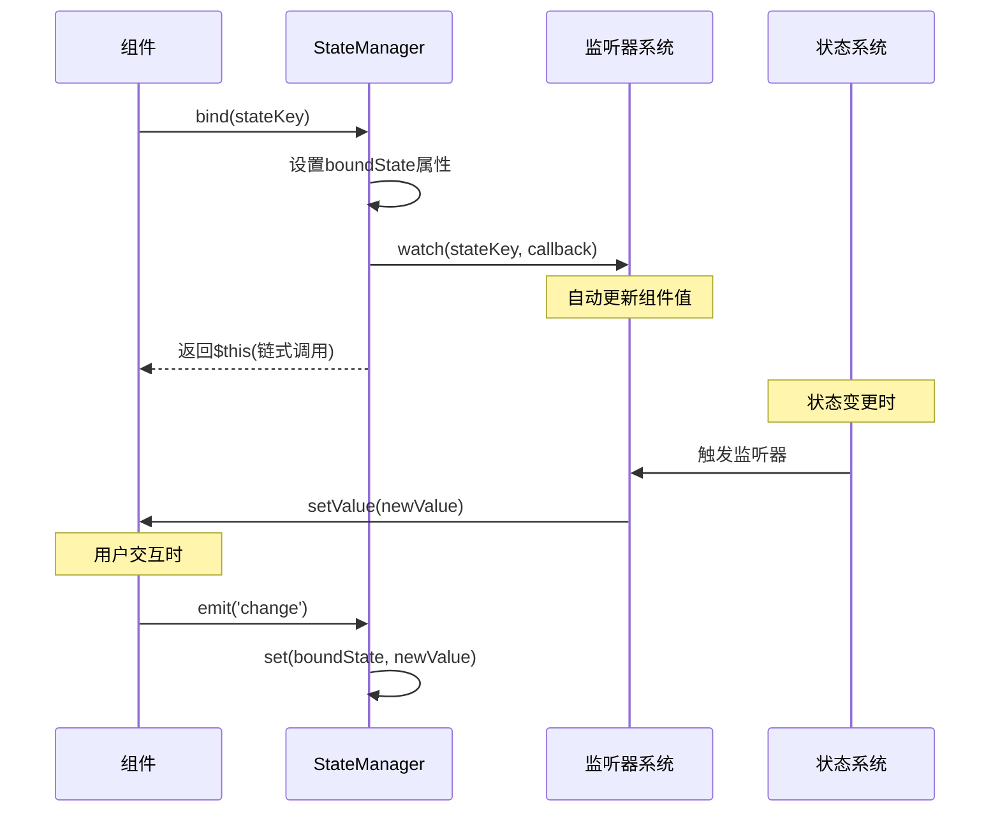
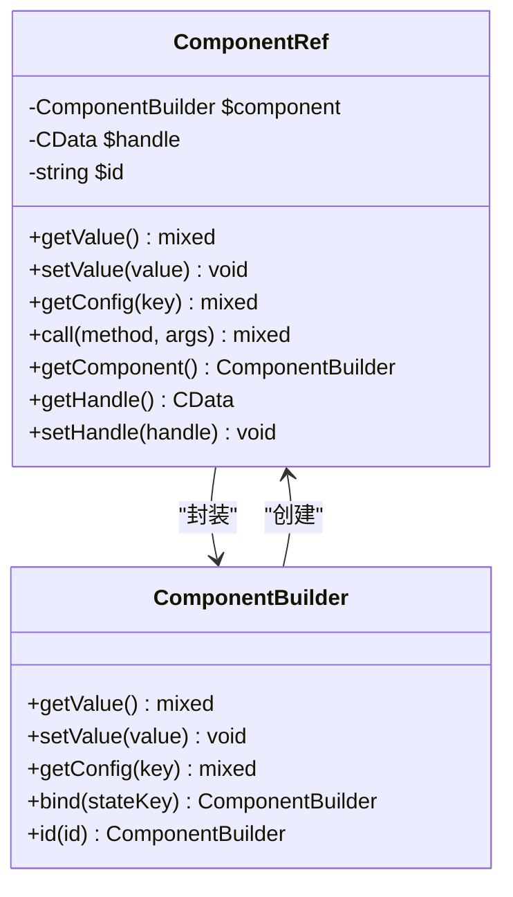

# 状态管理系统深度技术文档

<cite>
**本文档中引用的文件**
- [StateManager.php](file://src/State/StateManager.php)
- [ComponentRef.php](file://src/State/ComponentRef.php)
- [helper.php](file://src/helper.php)
- [ComponentBuilder.php](file://src/ComponentBuilder.php)
- [EntryBuilder.php](file://src/Components/EntryBuilder.php)
- [StateManagerBasicTest.php](file://tests/StateManagerBasicTest.php)
- [StateHelperTest.php](file://tests/StateHelperTest.php)
</cite>

## 目录
1. [简介](#简介)
2. [系统架构概览](#系统架构概览)
3. [StateManager核心类详解](#statemanager核心类详解)
4. [状态管理器单例实现](#状态管理器单例实现)
5. [状态操作方法](#状态操作方法)
6. [监听机制实现](#监听机制实现)
7. [组件绑定系统](#组件绑定系统)
8. [辅助函数系统](#辅助函数系统)
9. [性能优化与最佳实践](#性能优化与最佳实践)
10. [实际应用案例](#实际应用案例)
11. [总结](#总结)

## 简介

libuiBuilder状态管理系统是一个基于PHP的响应式状态管理解决方案，专为构建桌面应用程序界面而设计。该系统采用单例模式管理全局状态，提供了完整的状态监听、组件绑定和双向数据同步功能，实现了类似现代前端框架的响应式编程体验。

系统的核心设计理念是通过集中化的状态管理器来协调各个UI组件之间的数据流动，确保状态变更能够自动反映到相关组件，同时组件的用户交互也能及时更新底层状态。

## 系统架构概览

状态管理系统采用分层架构设计，包含以下核心组件：

```mermaid
graph TB
subgraph "状态管理层"
SM[StateManager<br/>状态管理器]
CR[ComponentRef<br/>组件引用]
end
subgraph "辅助函数层"
HF[helper.php<br/>辅助函数]
SF[state()函数]
WF[watch()函数]
end
subgraph "组件层"
CB[ComponentBuilder<br/>组件基类]
EB[EntryBuilder<br/>输入框组件]
BB[ButtonBuilder<br/>按钮组件]
end
subgraph "事件系统"
WE[Watch Events<br/>监听事件]
CE[Change Events<br/>变更事件]
end
SM --> CR
HF --> SM
SF --> SM
WF --> SM
CB --> SM
EB --> CB
BB --> CB
CB --> WE
CB --> CE
WE --> CB
CE --> SM
```

**图表来源**
- [StateManager.php](file://src/State/StateManager.php#L1-L91)
- [ComponentRef.php](file://src/State/ComponentRef.php#L1-L74)
- [helper.php](file://src/helper.php#L63-L110)

## StateManager核心类详解

StateManager是整个状态管理系统的核心类，负责维护全局状态、管理监听器和协调组件间的通信。

### 类结构设计



**图表来源**
- [StateManager.php](file://src/State/StateManager.php#L8-L91)
- [ComponentRef.php](file://src/State/ComponentRef.php#L11-L74)

### 内部状态存储结构

StateManager使用三个核心数组来维护系统状态：

| 属性 | 类型 | 描述 | 用途 |
|------|------|------|------|
| `$state` | `array` | 主状态存储 | 存储所有键值对形式的状态数据 |
| `$watchers` | `array` | 监听器映射 | 按状态键组织的回调函数集合 |
| `$componentRefs` | `array` | 组件引用映射 | 组件ID到ComponentRef对象的映射 |

**章节来源**
- [StateManager.php](file://src/State/StateManager.php#L10-L13)

## 状态管理器单例实现

StateManager采用经典的单例模式实现，确保在整个应用程序生命周期中只有一个状态管理器实例存在。

### instance()方法实现机制



**图表来源**
- [StateManager.php](file://src/State/StateManager.php#L15-L21)

### 单例模式的优势

1. **内存效率**: 避免重复创建状态管理器实例
2. **状态一致性**: 确保所有组件访问的是同一份状态数据
3. **简化接口**: 提供统一的访问入口
4. **线程安全**: 在PHP环境中天然线程安全

**章节来源**
- [StateManager.php](file://src/State/StateManager.php#L15-L21)
- [StateManagerBasicTest.php](file://tests/StateManagerBasicTest.php#L13-L19)

## 状态操作方法

### set()方法 - 状态设置

set()方法负责设置指定键的状态值，并在必要时触发相关的监听器回调。



**图表来源**
- [StateManager.php](file://src/State/StateManager.php#L26-L36)

### get()方法 - 状态获取

get()方法提供安全的状态访问机制，支持默认值参数。

| 参数 | 类型 | 描述 | 默认值 |
|------|------|------|--------|
| `$key` | `string` | 状态键名 | 必需 |
| `$default` | `mixed` | 默认值 | `null` |

**章节来源**
- [StateManager.php](file://src/State/StateManager.php#L42-L45)

### update()方法 - 批量更新

update()方法允许一次性设置多个状态值，提高批量操作的效率。



**图表来源**
- [StateManager.php](file://src/State/StateManager.php#L61-L66)

**章节来源**
- [StateManager.php](file://src/State/StateManager.php#L26-L66)
- [StateManagerBasicTest.php](file://tests/StateManagerBasicTest.php#L21-L40)

## 监听机制实现

watch()方法是状态管理系统的核心特性之一，它允许开发者注册回调函数来监听特定状态的变化。

### 监听器注册流程



**图表来源**
- [StateManager.php](file://src/State/StateManager.php#L50-L56)

### 监听器回调签名

监听器回调函数接收三个参数：
- `$newValue`: 新的状态值
- `$oldValue`: 旧的状态值  
- `$key`: 发生变化的状态键

### 多监听器支持

系统支持为同一个状态键注册多个监听器，所有注册的回调都会被依次调用。

**章节来源**
- [StateManager.php](file://src/State/StateManager.php#L50-L56)
- [StateManagerBasicTest.php](file://tests/StateManagerBasicTest.php#L42-L60)
- [StateHelperTest.php](file://tests/StateHelperTest.php#L79-L128)

## 组件绑定系统

组件绑定系统实现了状态与UI组件之间的双向数据同步，这是响应式编程的核心功能。

### bind()方法实现机制



**图表来源**
- [ComponentBuilder.php](file://src/ComponentBuilder.php#L136-L146)

### 双向数据绑定原理

1. **从状态到组件**: 当状态发生变化时，自动更新绑定的组件值
2. **从组件到状态**: 当组件值发生变化时，自动更新对应的状态

### 组件引用系统

ComponentRef类提供了对其他组件的访问能力：



**图表来源**
- [ComponentRef.php](file://src/State/ComponentRef.php#L11-L74)
- [ComponentBuilder.php](file://src/ComponentBuilder.php#L122-L234)

**章节来源**
- [ComponentBuilder.php](file://src/ComponentBuilder.php#L136-L174)
- [ComponentRef.php](file://src/State/ComponentRef.php#L1-L74)

## 辅助函数系统

系统提供了两个主要的辅助函数来简化状态管理操作。

### state()函数

state()函数是一个多功能的状态管理辅助函数：

| 使用方式 | 功能 | 示例 |
|----------|------|------|
| `state()` | 获取StateManager实例 | `$manager = state();` |
| `state($key)` | 获取状态值 | `$value = state('username');` |
| `state($key, $value)` | 设置状态值 | `state('username', 'John');` |
| `state($array)` | 批量设置状态 | `state(['a' => 1, 'b' => 2]);` |

### watch()函数

watch()函数简化了状态监听器的注册过程：

```php
// 基本用法
watch('username', function($new, $old) {
    echo "用户名从 {$old} 变为 {$new}";
});

// 多个监听器
watch('count', function($new, $old) {
    // 第一个监听器
});

watch('count', function($new, $old) {
    // 第二个监听器
});
```

**章节来源**
- [helper.php](file://src/helper.php#L63-L110)
- [StateHelperTest.php](file://tests/StateHelperTest.php#L14-L76)

## 性能优化与最佳实践

### 性能考虑因素

1. **监听器数量控制**: 过多的监听器会影响性能，建议按需注册
2. **状态粒度设计**: 合理划分状态粒度，避免过细或过粗
3. **批量操作优化**: 使用update()方法进行批量状态更新
4. **内存管理**: 及时清理不再需要的监听器

### 最佳实践指南

#### 状态设计原则
- **单一数据源**: 每个状态应该有唯一的修改路径
- **不可变性**: 尽量避免直接修改状态对象，使用替换策略
- **扁平化结构**: 避免过深的嵌套状态结构

#### 监听器管理
```php
// 推荐：按需注册监听器
if ($needsValidation) {
    watch('email', $validationCallback);
}

// 不推荐：注册过多不必要的监听器
foreach ($allFields as $field) {
    watch($field, $genericCallback); // 可能导致性能问题
}
```

#### 组件绑定策略
- 为频繁变化的状态注册监听器
- 为只读状态避免不必要的绑定
- 使用适当的组件ID命名规范

### 常见性能陷阱

1. **过度监听**: 为每个可能的状态变化都注册监听器
2. **循环依赖**: 状态A改变触发B改变，B又触发A改变
3. **内存泄漏**: 注册监听器后忘记清理

## 实际应用案例

### 响应式计数器示例

```php
// 设置初始状态
state('count', 0);

// 监听状态变化并更新显示
watch('count', function($new) {
    echo "当前计数: $new";
});

// 更新状态触发自动更新
state('count', 1);  // 输出: 当前计数: 1
state('count', 2);  // 输出: 当前计数: 2
```

### 表单验证系统

```php
// 设置表单状态
state('formData', [
    'email' => '',
    'password' => ''
]);

// 验证逻辑
watch('formData.email', function($newEmail) {
    if (!filter_var($newEmail, FILTER_VALIDATE_EMAIL)) {
        state('formErrors.email', '邮箱格式不正确');
    } else {
        state('formErrors.email', null);
    }
});

// 组件绑定示例
$input = Builder::entry()
    ->id('email')
    ->bind('formData.email');
```

### 组件间通信

```php
// 组件A更新状态
$compA = Builder::entry()
    ->id('inputA')
    ->bind('sharedValue');

// 组件B监听相同状态
watch('sharedValue', function($newValue) {
    // 更新组件B的显示
    $compB->setValue("共享值: $newValue");
});
```

**章节来源**
- [StateHelperTest.php](file://tests/StateHelperTest.php#L131-L182)

## 总结

libuiBuilder状态管理系统提供了一个完整而高效的响应式状态管理解决方案。通过StateManager的单例实现、watch()方法的监听机制、以及组件绑定系统，开发者可以轻松构建具有实时响应能力的桌面应用程序界面。

### 系统优势

1. **简洁的API设计**: 通过辅助函数提供易用的编程接口
2. **强大的双向绑定**: 实现状态与UI组件的自动同步
3. **灵活的监听机制**: 支持复杂的业务逻辑触发
4. **良好的扩展性**: 易于集成新的组件和功能

### 技术特色

- **单例模式**: 确保状态管理的一致性和效率
- **事件驱动**: 基于观察者模式的状态变更通知
- **组件抽象**: 通过ComponentRef提供组件间通信能力
- **响应式编程**: 支持声明式的状态变更处理

该状态管理系统为PHP桌面应用程序开发提供了一个现代化的解决方案，使得复杂的UI状态管理变得简单而高效。