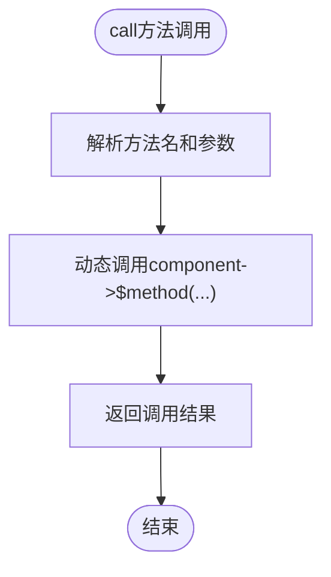

# ComponentRef 引用机制

<cite>
**本文档中引用的文件**
- [ComponentRef.php](file://src/State/ComponentRef.php)
- [StateManager.php](file://src/State/StateManager.php)
- [ComponentBuilder.php](file://src/ComponentBuilder.php)
- [WindowBuilder.php](file://src/Components/WindowBuilder.php)
- [ButtonBuilder.php](file://src/Components/ButtonBuilder.php)
- [simple.php](file://example/simple.php)
</cite>

## 目录
1. [简介](#简介)
2. [项目结构](#项目结构)
3. [核心组件](#核心组件)
4. [架构概览](#架构概览)
5. [详细组件分析](#详细组件分析)
6. [依赖关系分析](#依赖关系分析)
7. [性能考虑](#性能考虑)
8. [故障排除指南](#故障排除指南)
9. [结论](#结论)

## 简介

ComponentRef 类是 libuiBuilder 框架中实现跨组件通信的关键封装机制。它提供了一种安全、间接的方式来访问和操作其他组件的数据和行为，通过 StateManager 实现全局状态管理和组件间通信。该机制使得开发者能够在不直接持有组件引用的情况下，实现复杂的组件交互逻辑。

ComponentRef 的设计遵循了松耦合原则，通过代理模式将对组件的操作委托给实际的 ComponentBuilder 实例，同时维护组件的唯一标识符，确保在整个应用生命周期中都能正确识别和操作目标组件。

## 项目结构

libuiBuilder 项目采用模块化架构，ComponentRef 作为状态管理模块的核心组件，位于 `src/State/` 目录下：

**图表来源**
- [ComponentRef.php](file://src/State/ComponentRef.php#L1-L74)
- [StateManager.php](file://src/State/StateManager.php#L1-L91)
- [ComponentBuilder.php](file://src/ComponentBuilder.php#L1-L234)

**章节来源**
- [ComponentRef.php](file://src/State/ComponentRef.php#L1-L74)
- [StateManager.php](file://src/State/StateManager.php#L1-L91)

## 核心组件

ComponentRef 类的核心功能围绕三个关键方面展开：

### 构造函数机制
ComponentRef 的构造函数接受两个参数：
- **组件ID（string）**：用于唯一标识目标组件
- **ComponentBuilder实例**：实际的组件构建器对象，负责执行具体的操作

### 代理访问模式
ComponentRef 采用代理模式，将所有对组件的操作请求转发给内部的 ComponentBuilder 实例，实现了对组件的间接访问。

### 状态同步机制
通过与 StateManager 的协作，ComponentRef 确保组件状态的一致性和全局可访问性。

**章节来源**
- [ComponentRef.php](file://src/State/ComponentRef.php#L17-L21)

## 架构概览

ComponentRef 在整个框架中的架构位置体现了其作为中间层的重要作用：

**图表来源**
- [StateManager.php](file://src/State/StateManager.php#L78-L82)
- [ComponentRef.php](file://src/State/ComponentRef.php#L46-L73)
- [ComponentBuilder.php](file://src/ComponentBuilder.php#L195-L199)

## 详细组件分析

### ComponentRef 类结构分析

ComponentRef 类采用了简洁而高效的实现方式，主要包含以下核心方法：

#### 私有属性设计
- `$component`：保存实际的 ComponentBuilder 实例
- `$handle`：存储原生控件句柄（FFI\CData类型）
- `$id`：组件的唯一标识符

#### 核心访问方法

##### getValue() 方法

**图表来源**
- [ComponentRef.php](file://src/State/ComponentRef.php#L46-L49)

##### setValue() 方法
setValue 方法提供了对组件值的设置功能，支持链式调用：

**图表来源**
- [ComponentRef.php](file://src/State/ComponentRef.php#L54-L57)

##### getConfig() 方法
getConfig 方法支持两种调用模式：
- 不带参数：获取所有配置项
- 带参数：获取指定键的配置值

这种设计提供了灵活的配置访问能力，满足不同场景的需求。

##### call() 方法 - 动态方法调用
call 方法是 ComponentRef 最强大的功能之一，利用 PHP 的可变参数和动态调用特性：

**图表来源**
- [ComponentRef.php](file://src/State/ComponentRef.php#L70-L73)

**章节来源**
- [ComponentRef.php](file://src/State/ComponentRef.php#L1-L74)

### StateManager 协作关系

ComponentRef 与 StateManager 的协作关系体现在以下几个方面：

#### 注册机制
当组件被创建时，会自动注册到 StateManager 中：

**图表来源**
- [ComponentBuilder.php](file://src/ComponentBuilder.php#L125-L130)
- [StateManager.php](file://src/State/StateManager.php#L71-L74)

#### 查找机制
StateManager 提供了通过 ID 查找 ComponentRef 的功能：

**图表来源**
- [StateManager.php](file://src/State/StateManager.php#L79-L82)

**章节来源**
- [StateManager.php](file://src/State/StateManager.php#L69-L82)

### 实际应用场景分析

#### 按钮点击事件中的窗口控制

在简单示例中，ComponentRef 展示了其在复杂交互场景中的应用：

**图表来源**
- [simple.php](file://example/simple.php#L76-L81)

#### 窗口显示状态控制

ComponentRef 还可以用于控制窗口的显示状态：

**图表来源**
- [simple.php](file://example/simple.php#L129-L137)

**章节来源**
- [simple.php](file://example/simple.php#L71-L142)

## 依赖关系分析

ComponentRef 的依赖关系体现了其在整个框架中的核心地位：

**图表来源**
- [ComponentRef.php](file://src/State/ComponentRef.php#L5-L7)
- [StateManager.php](file://src/State/StateManager.php#L1-L91)

### 循环依赖处理

框架巧妙地避免了循环依赖问题：
- ComponentRef 依赖 ComponentBuilder
- StateManager 管理 ComponentRef
- ComponentBuilder 通过 StateManager 获取 ComponentRef

这种设计确保了系统的稳定性和可维护性。

**章节来源**
- [ComponentRef.php](file://src/State/ComponentRef.php#L1-L74)
- [StateManager.php](file://src/State/StateManager.php#L1-L91)

## 性能考虑

ComponentRef 的设计在性能方面考虑了以下因素：

### 延迟初始化
ComponentRef 只在需要时才访问实际的组件实例，避免了不必要的资源消耗。

### 缓存机制
StateManager 通过数组缓存所有 ComponentRef 实例，提供 O(1) 的查找性能。

### 内存管理
通过弱引用和及时释放的设计，避免内存泄漏问题。

## 故障排除指南

### 常见问题及解决方案

#### 组件引用失败
**问题**：无法通过 ID 获取 ComponentRef
**原因**：组件尚未注册或 ID 错误
**解决**：确保组件已正确设置 ID 并完成初始化

#### 方法调用异常
**问题**：call() 方法抛出错误
**原因**：目标组件不支持该方法或参数错误
**解决**：检查目标组件的方法列表和参数格式

#### 状态同步问题
**问题**：组件状态更新不及时
**原因**：状态监听器未正确设置
**解决**：确认状态绑定和监听器配置

**章节来源**
- [StateManager.php](file://src/State/StateManager.php#L78-L82)
- [ComponentRef.php](file://src/State/ComponentRef.php#L70-L73)

## 结论

ComponentRef 类作为 libuiBuilder 框架中的关键组件，成功实现了跨组件通信的抽象和封装。其设计体现了以下优势：

1. **安全性**：通过代理模式避免直接操作组件实例的风险
2. **灵活性**：支持动态方法调用和多种访问模式
3. **可扩展性**：易于添加新的组件类型和功能
4. **可维护性**：清晰的职责分离和模块化设计

ComponentRef 与 StateManager 的协作关系为构建复杂的 GUI 应用程序提供了坚实的基础，使得组件间的交互变得简单而高效。这种设计模式不仅提高了代码的可读性和可维护性，也为未来的功能扩展提供了良好的架构基础。