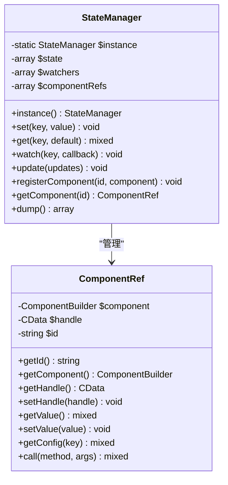
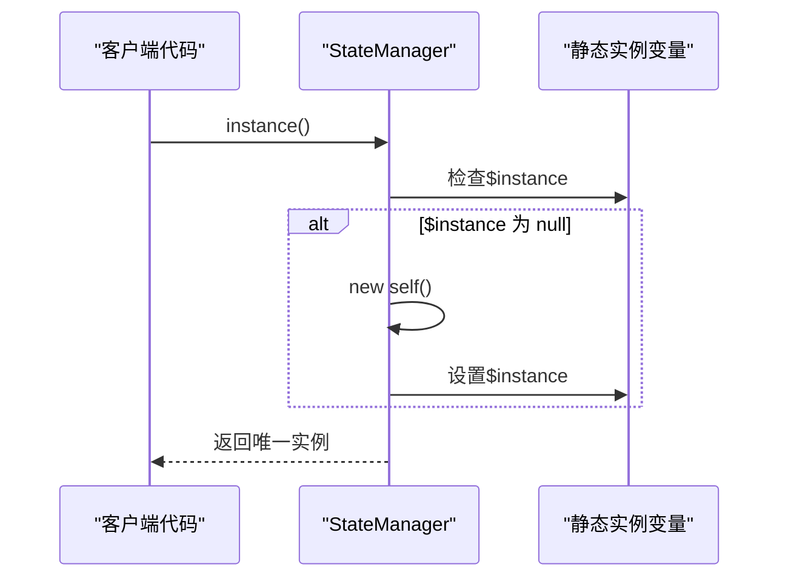
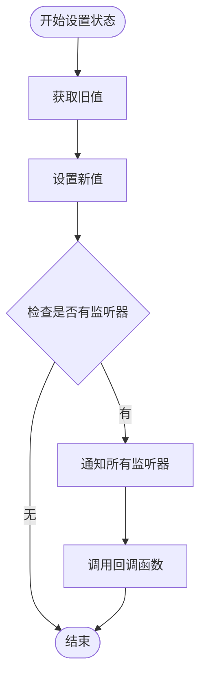
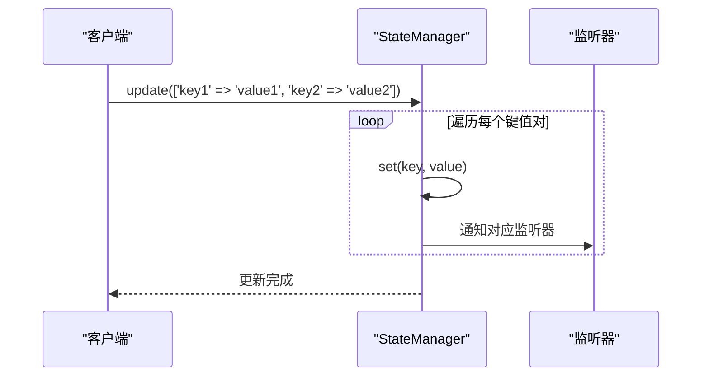
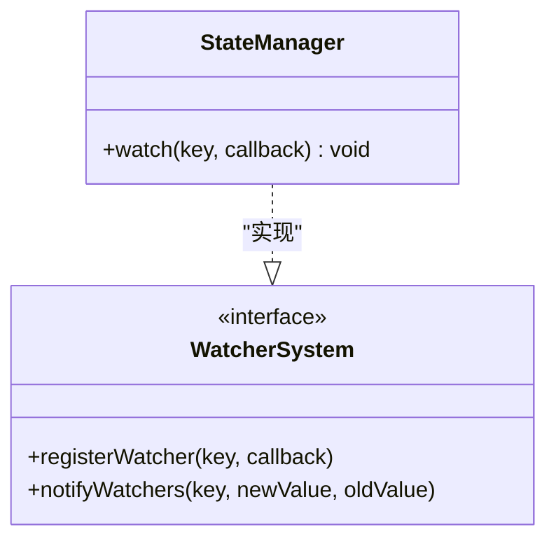
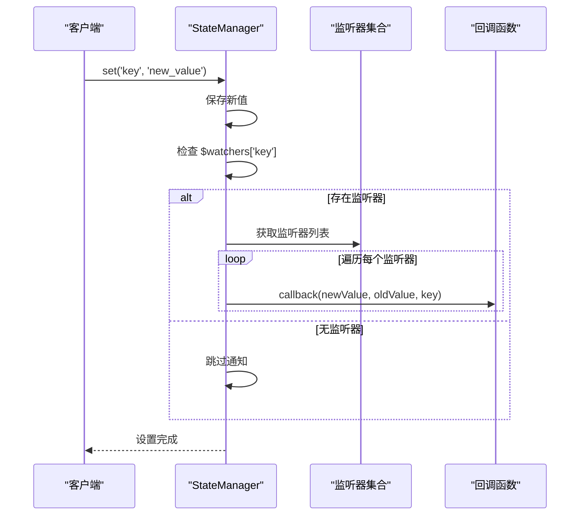
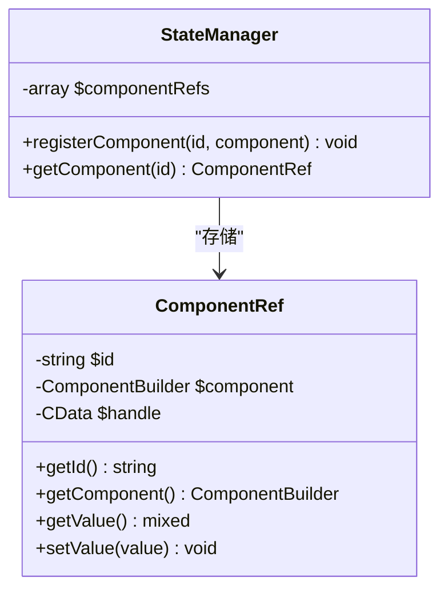
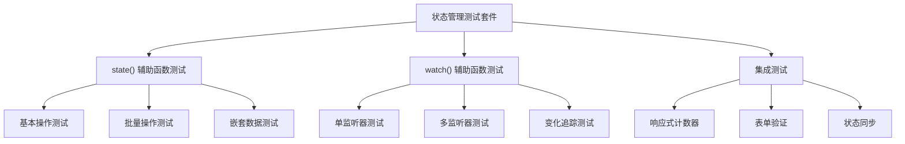
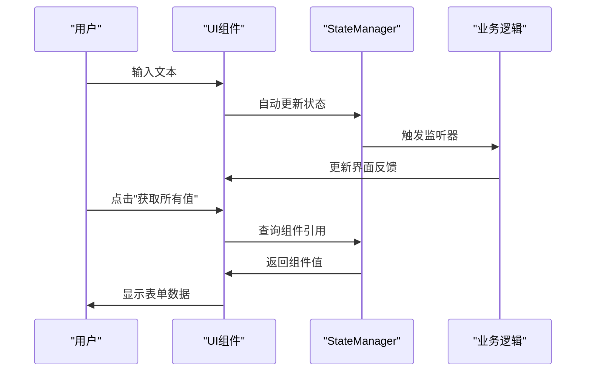
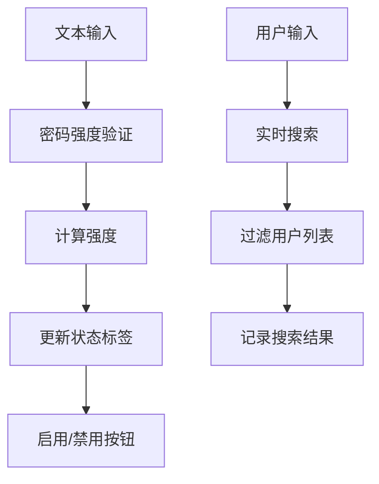

# StateManager 使用指南

<cite>
**本文档中引用的文件**
- [StateManager.php](file://src/State/StateManager.php)
- [ComponentRef.php](file://src/State/ComponentRef.php)
- [full.php](file://example/full.php)
- [eventAndState.php](file://example/eventAndState.php)
- [StateHelperTest.php](file://tests/StateHelperTest.php)
- [helper.php](file://src/helper.php)
</cite>

## 目录
1. [简介](#简介)
2. [StateManager 类设计](#statemanager-类设计)
3. [单例模式实现](#单例模式实现)
4. [核心状态管理方法](#核心状态管理方法)
5. [观察者模式实现](#观察者模式实现)
6. [组件引用管理](#组件引用管理)
7. [实用工具函数](#实用工具函数)
8. [实际应用案例](#实际应用案例)
9. [最佳实践](#最佳实践)
10. [总结](#总结)

## 简介

StateManager 是 libuiBuilder 框架中的核心状态管理组件，采用单例模式设计，为整个应用程序提供全局状态共享和组件间通信能力。它实现了观察者模式，支持状态的实时监听和响应式更新，是构建复杂 UI 应用程序状态同步的关键基础设施。

## StateManager 类设计

StateManager 类采用了简洁而高效的设计架构，包含四个主要私有属性：



**图表来源**
- [StateManager.php](file://src/State/StateManager.php#L8-L91)
- [ComponentRef.php](file://src/State/ComponentRef.php#L11-L74)

**章节来源**
- [StateManager.php](file://src/State/StateManager.php#L8-L91)

## 单例模式实现

StateManager 采用经典的单例模式确保全局唯一实例：

### 私有构造函数设计

类的构造函数被声明为私有，防止外部直接实例化：

```php
private function __construct()
{
    // 私有构造函数，防止外部实例化
}
```

### instance() 静态方法

通过静态方法 `instance()` 确保全局只有一个 StateManager 实例：



**图表来源**
- [StateManager.php](file://src/State/StateManager.php#L15-L21)

这种设计确保：
- **全局唯一性**：整个应用程序中只有一个 StateManager 实例
- **延迟初始化**：只有在首次调用 instance() 时才创建实例
- **线程安全**：PHP 中的单例模式天然具备线程安全性

**章节来源**
- [StateManager.php](file://src/State/StateManager.php#L10-L21)

## 核心状态管理方法

### set() 方法 - 状态设置

`set()` 方法负责设置状态值并触发相应的监听器：



**图表来源**
- [StateManager.php](file://src/State/StateManager.php#L26-L36)

set() 方法的核心特性：
- **原子操作**：设置新值和通知监听器是原子性的
- **历史记录**：向监听器传递旧值和新值，支持状态变更追踪
- **性能优化**：只在存在监听器时才进行通知操作

### get() 方法 - 状态获取

`get()` 方法提供安全的状态访问机制：

```php
public function get(string $key, $default = null)
{
    return $this->state[$key] ?? $default;
}
```

特点：
- **默认值支持**：当状态键不存在时返回指定的默认值
- **类型安全**：保持原始数据类型的完整性
- **快速访问**：O(1) 时间复杂度的哈希表查找

### update() 方法 - 批量更新

`update()` 方法允许一次性更新多个状态项：



**图表来源**
- [StateManager.php](file://src/State/StateManager.php#L61-L66)

**章节来源**
- [StateManager.php](file://src/StateManager.php#L26-L45)
- [StateManager.php](file://src/State/StateManager.php#L61-L66)

## 观察者模式实现

StateManager 的观察者模式实现是其核心功能之一，支持状态变化的实时监听和响应。

### watch() 方法设计

`watch()` 方法注册状态变化监听器：



**图表来源**
- [StateManager.php](file://src/StateManager.php#L50-L56)

### 监听器注册机制

监听器系统采用基于键的分组存储：

```php
private array $watchers = [];

// 监听器存储结构示例：
// [
//     'username' => [callback1, callback2],
//     'theme' => [callback3],
//     'language' => [callback4, callback5, callback6]
// ]
```

### 状态变化通知流程



**图表来源**
- [StateManager.php](file://src/State/StateManager.php#L26-L36)

### 多监听器支持

同一个状态键可以注册多个监听器，每个监听器都会被独立调用：

```php
// 注册多个监听器
$stateManager->watch('username', function($new, $old) {
    // 监听器1逻辑
});

$stateManager->watch('username', function($new, $old) {
    // 监听器2逻辑
});

// 当状态变化时，两个监听器都会被调用
```

**章节来源**
- [StateManager.php](file://src/State/StateManager.php#L50-L56)

## 组件引用管理

StateManager 不仅管理状态，还维护组件引用的映射关系，支持通过ID快速查找和操作UI组件。

### registerComponent() 方法

该方法将组件ID与ComponentRef对象关联：



**图表来源**
- [StateManager.php](file://src/State/StateManager.php#L71-L82)
- [ComponentRef.php](file://src/ComponentRef.php#L11-L74)

### getComponent() 方法

提供通过ID查找组件引用的功能：

```php
public function getComponent(string $id): ?ComponentRef
{
    return $this->componentRefs[$id] ?? null;
}
```

### ComponentRef 功能详解

ComponentRef 类提供了丰富的组件操作接口：

| 方法 | 功能描述 | 使用场景 |
|------|----------|----------|
| `getId()` | 获取组件ID | 组件标识和调试 |
| `getComponent()` | 获取底层组件对象 | 直接访问组件方法 |
| `getValue()` | 获取组件当前值 | 表单数据读取 |
| `setValue($value)` | 设置组件值 | 表单数据写入 |
| `getConfig($key)` | 获取组件配置 | 动态配置调整 |
| `call($method, ...$args)` | 调用组件方法 | 特殊功能调用 |

### 组件引用的实际应用

在 full.php 示例中展示了组件引用的典型用法：

```php
// 获取组件值
$singleLineValue = $stateManager->getComponent('singleLineInput')?->getValue() ?? 'N/A';

// 设置组件值
$stateManager->getComponent('checkbox1')?->setValue(false);

// 调用组件方法
$stateManager->getComponent('table')?->refresh();
```

**章节来源**
- [StateManager.php](file://src/StateManager.php#L71-L82)
- [ComponentRef.php](file://src/ComponentRef.php#L23-L74)

## 实用工具函数

为了简化状态管理操作，框架提供了两个便捷的全局函数：

### state() 函数

state() 函数是 StateManager 的快捷访问入口：

```php
// 获取 StateManager 实例
$manager = state();

// 设置状态
state('username', 'John');

// 获取状态
$username = state('username');

// 批量设置状态
state([
    'name' => 'Alice',
    'email' => 'alice@example.com',
    'role' => 'admin'
]);
```

### watch() 函数

watch() 函数简化了状态监听器的注册：

```php
// 监听状态变化
watch('username', function($new, $old) {
    echo "用户名从 '{$old}' 变为 '{$new}'";
});

// 监听多次变化
watch('count', function($new, $old) {
    echo "计数器从 {$old} 变为 {$new}";
});
```

### 测试中的辅助函数

在 StateHelperTest.php 中展示了这些函数的完整测试覆盖：



**图表来源**
- [StateHelperTest.php](file://tests/StateHelperTest.php#L15-L183)

**章节来源**
- [StateHelperTest.php](file://tests/StateHelperTest.php#L15-L183)

## 实际应用案例

### full.php 完整示例

full.php 展示了 StateManager 在复杂表单场景中的应用：

#### 表单数据管理



**图表来源**
- [full.php](file://example/full.php#L122-L176)

#### 组件状态同步

在 full.php 中，StateManager 协调了多种UI组件的状态同步：

- **输入组件**：单行输入、多行输入、密码输入
- **选择组件**：复选框、单选框、下拉选择
- **数值组件**：数字输入框、滑动条
- **控制按钮**：获取值、重置表单

### eventAndState.php 高级应用

eventAndState.php 展示了更复杂的交互场景：

#### 实时验证和反馈



**图表来源**
- [eventAndState.php](file://example/eventAndState.php#L35-L66)
- [eventAndState.php](file://example/eventAndState.php#L121-L137)

#### 用户管理系统

eventAndState.php 实现了一个完整的用户管理系统：

- **登录认证**：用户名密码验证，状态切换
- **用户列表**：动态加载、搜索过滤
- **用户编辑**：选中行同步、数据更新
- **用户删除**：状态同步、列表刷新

#### 状态监听的应用

```php
// 监听登录状态变化
$state->watch('isLoggedIn', function($isLoggedIn) {
    if ($isLoggedIn) {
        echo "用户已登录，显示管理界面\n";
    } else {
        echo "用户已登出\n";
    }
});

// 监听用户列表变化
$state->watch('userList', function($newUsers) {
    echo "用户列表已更新，共 " . count($newUsers) . " 个用户\n";
});
```

**章节来源**
- [full.php](file://example/full.php#L12-L179)
- [eventAndState.php](file://example/eventAndState.php#L12-L234)

## 最佳实践

### 状态命名规范

建议采用清晰的状态命名约定：

```php
// 推荐：语义明确的状态名称
state('userProfile.name', '张三');
state('form.validationErrors.email', '邮箱格式不正确');

// 避免：模糊的状态名称
state('data1', 'value');
state('info', ['key' => 'value']);
```

### 监听器设计原则

1. **单一职责**：每个监听器只处理一种状态变化
2. **幂等性**：监听器应该能够安全地重复执行
3. **性能考虑**：避免在监听器中执行耗时操作
4. **错误处理**：监听器内部应该有适当的错误处理

### 组件引用管理

```php
// 推荐：及时清理不需要的组件引用
$stateManager->getComponent('oldComponent')?->cleanup();

// 避免：长时间持有大量组件引用
// 可能导致内存泄漏
```

### 批量更新策略

对于需要同时更新多个状态的场景：

```php
// 推荐：使用 update() 方法
$stateManager->update([
    'firstName' => $firstName,
    'lastName' => $lastName,
    'email' => $email
]);

// 避免：逐个设置状态
$stateManager->set('firstName', $firstName);
$stateManager->set('lastName', $lastName);
$stateManager->set('email', $email); // 可能触发多次通知
```

### 调试和监控

```php
// 使用 dump() 方法进行状态调试
$allState = $stateManager->dump();
print_r($allState);

// 监听关键状态变化
$stateManager->watch('criticalState', function($value) {
    error_log("关键状态变化: " . json_encode($value));
});
```

## 总结

StateManager 类作为 libuiBuilder 框架的核心状态管理组件，通过以下关键特性为开发者提供了强大的状态管理能力：

### 核心优势

1. **单例模式保证**：确保全局唯一实例，避免状态混乱
2. **观察者模式支持**：实现响应式状态变化通知
3. **组件引用管理**：提供高效的UI组件访问机制
4. **便捷的工具函数**：简化常用状态操作
5. **类型安全设计**：保持数据类型的完整性

### 应用场景

- **表单数据管理**：统一管理表单字段状态
- **UI状态同步**：协调多个组件的状态一致性
- **实时验证**：基于状态变化的即时反馈
- **用户交互**：响应用户操作的状态更新
- **复杂业务逻辑**：支持多步骤、多状态的业务流程

### 技术价值

StateManager 不仅是一个状态管理工具，更是构建现代UI应用程序架构的重要基石。它通过合理的抽象和设计，为开发者提供了一个既强大又易用的状态管理解决方案，大大简化了复杂UI应用的开发难度。

通过深入理解和合理运用StateManager，开发者可以构建出更加响应迅速、用户体验优秀的桌面应用程序。