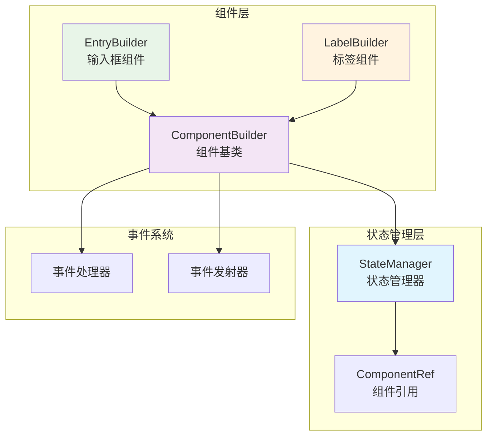
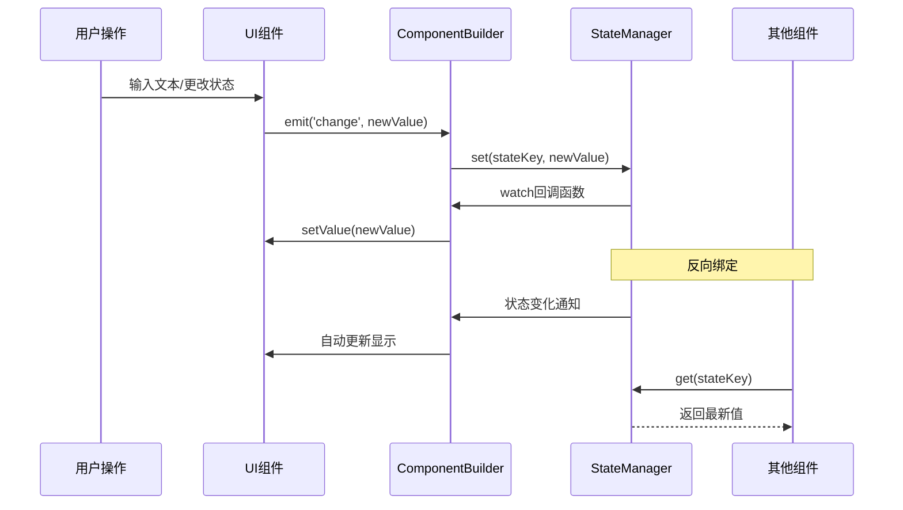
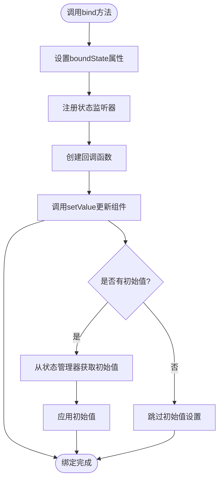
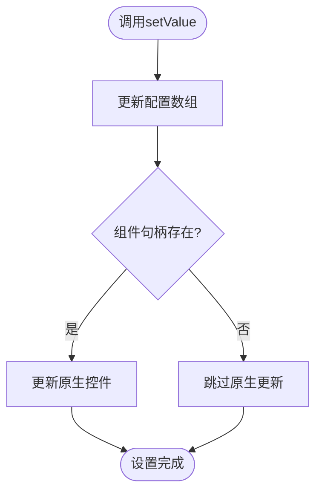
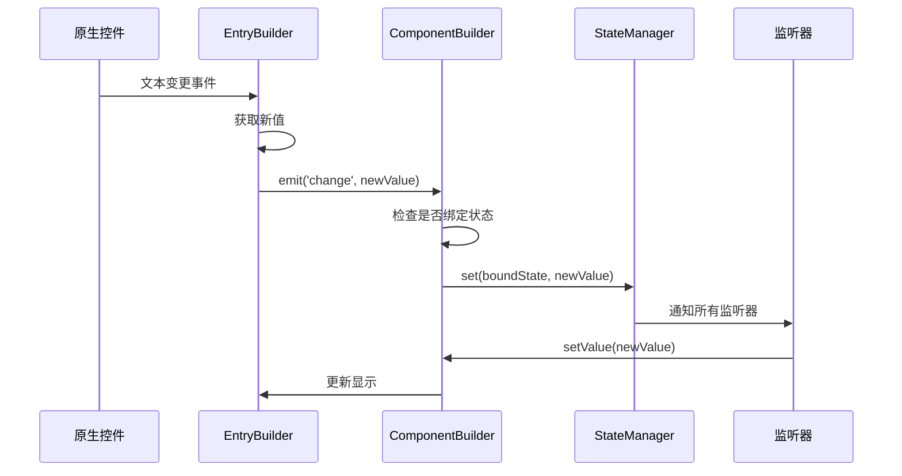
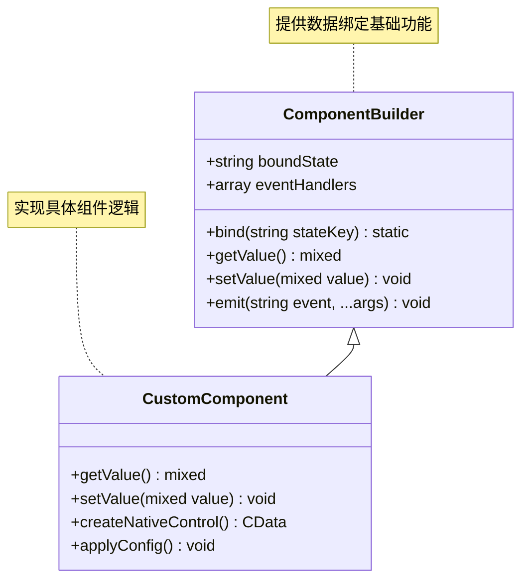
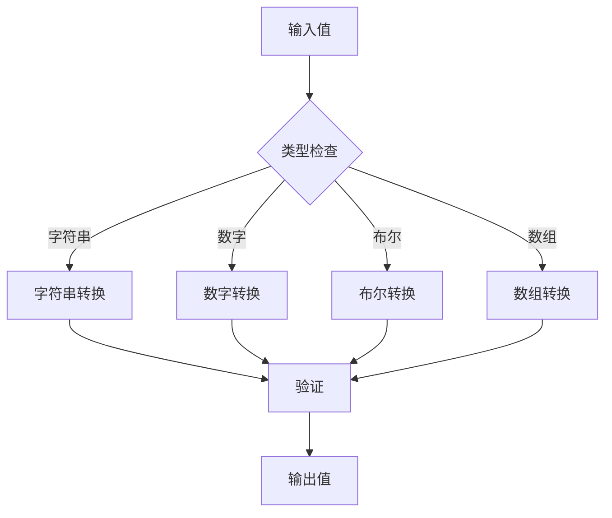

# libuiBuilder数据绑定实践指南

<cite>
**本文档中引用的文件**
- [simple.php](file://example/simple.php)
- [eventAndState.php](file://example/eventAndState.php)
- [StateManager.php](file://src/State/StateManager.php)
- [ComponentBuilder.php](file://src/ComponentBuilder.php)
- [EntryBuilder.php](file://src/Components/EntryBuilder.php)
- [LabelBuilder.php](file://src/Components/LabelBuilder.php)
- [ComponentRef.php](file://src/State/ComponentRef.php)
- [Builder.php](file://src/Builder.php)
- [helper.php](file://src/helper.php)
</cite>

## 目录
1. [简介](#简介)
2. [核心架构概览](#核心架构概览)
3. [双向数据绑定机制](#双向数据绑定机制)
4. [bind()方法详解](#bind方法详解)
5. [组件值获取与设置](#组件值获取与设置)
6. [事件驱动的数据更新](#事件驱动的数据更新)
7. [实际应用案例](#实际应用案例)
8. [自定义组件开发](#自定义组件开发)
9. [性能优化建议](#性能优化建议)
10. [常见问题与调试](#常见问题与调试)
11. [总结](#总结)

## 简介

libuiBuilder是一个基于PHP的GUI应用程序框架，提供了强大的双向数据绑定机制，使得UI组件能够与状态管理系统之间建立紧密的连接。这种设计模式极大地简化了复杂应用程序的开发，特别是在需要实时更新UI状态的应用场景中。

数据绑定的核心思想是将UI组件的状态与应用程序的状态管理器进行关联，当用户操作UI组件时，状态会自动更新；同时，当状态发生变化时，相关的UI组件也会自动刷新显示。

## 核心架构概览

libuiBuilder的数据绑定架构由以下几个核心组件构成：



**图表来源**
- [StateManager.php](file://src/State/StateManager.php#L8-L91)
- [ComponentBuilder.php](file://src/ComponentBuilder.php#L11-L234)

**章节来源**
- [StateManager.php](file://src/State/StateManager.php#L1-L91)
- [ComponentBuilder.php](file://src/ComponentBuilder.php#L1-L234)

## 双向数据绑定机制

libuiBuilder的双向数据绑定机制基于观察者模式和事件驱动架构，实现了以下核心特性：

### 绑定流程图



**图表来源**
- [ComponentBuilder.php](file://src/ComponentBuilder.php#L140-L174)
- [StateManager.php](file://src/State/StateManager.php#L26-L36)

### 绑定机制特点

1. **自动同步**: 当状态发生变化时，所有绑定的组件会自动更新
2. **事件驱动**: 用户操作触发事件，事件再触发状态更新
3. **类型安全**: 支持不同类型的数据绑定和自动类型转换
4. **性能优化**: 只有在必要时才更新受影响的组件

**章节来源**
- [ComponentBuilder.php](file://src/ComponentBuilder.php#L135-L174)
- [StateManager.php](file://src/State/StateManager.php#L26-L56)

## bind()方法详解

`bind()`方法是实现双向数据绑定的核心方法，它建立了UI组件与状态管理器之间的连接。

### bind()方法实现原理



**图表来源**
- [ComponentBuilder.php](file://src/ComponentBuilder.php#L135-L146)

### bind()方法的关键步骤

1. **设置绑定状态**: 将传入的状态键名存储在`boundState`属性中
2. **注册监听器**: 使用`StateManager::watch()`方法注册状态变化监听器
3. **自动更新**: 监听器回调函数自动调用`setValue()`更新组件
4. **初始值同步**: 在组件构建时应用状态管理器中的初始值

**章节来源**
- [ComponentBuilder.php](file://src/ComponentBuilder.php#L135-L146)
- [ComponentBuilder.php](file://src/ComponentBuilder.php#L222-L228)

## 组件值获取与设置

每个UI组件都需要实现`getValue()`和`setValue()`方法来支持数据绑定。

### getValue()方法实现

不同组件的`getValue()`方法实现方式：

| 组件类型 | getValue()实现方式 | 返回值类型 |
|---------|-------------------|-----------|
| EntryBuilder | 读取输入框文本内容 | string |
| LabelBuilder | 读取标签文本内容 | string |
| CheckboxBuilder | 获取复选框选中状态 | bool |
| ComboboxBuilder | 获取选中项的值 | mixed |
| SpinboxBuilder | 获取数值输入框的值 | int/float |

### setValue()方法实现



**图表来源**
- [EntryBuilder.php](file://src/Components/EntryBuilder.php#L58-L64)
- [LabelBuilder.php](file://src/Components/LabelBuilder.php#L39-L45)

**章节来源**
- [EntryBuilder.php](file://src/Components/EntryBuilder.php#L53-L64)
- [LabelBuilder.php](file://src/Components/LabelBuilder.php#L34-L45)
- [ComponentBuilder.php](file://src/ComponentBuilder.php#L178-L191)

## 事件驱动的数据更新

libuiBuilder采用事件驱动的方式处理用户交互和状态更新。

### 事件处理流程



**图表来源**
- [EntryBuilder.php](file://src/Components/EntryBuilder.php#L39-L49)
- [ComponentBuilder.php](file://src/ComponentBuilder.php#L171-L174)

### onChange回调机制

除了自动的状态更新，组件还支持自定义的`onChange`回调函数：

1. **事件触发**: 用户操作触发`change`事件
2. **回调执行**: 执行用户定义的`onChange`回调
3. **状态更新**: 自动更新绑定的状态
4. **后续处理**: 回调函数可以执行额外的业务逻辑

**章节来源**
- [EntryBuilder.php](file://src/Components/EntryBuilder.php#L39-L49)
- [ComponentBuilder.php](file://src/ComponentBuilder.php#L171-L174)

## 实际应用案例

### simple.php示例分析

simple.php展示了姓名输入框与欢迎标签的实时联动效果：

```mermaid
graph LR
subgraph "表单区域"
NameEntry[姓名输入框]
GenderCombo[性别选择框]
HobbyCombo[爱好选择框]
end
subgraph "反馈区域"
WelcomeLabel[欢迎标签]
StrengthLabel[密码强度标签]
end
subgraph "状态管理"
StateMgr[StateManager]
end
NameEntry -.->|bind('name')| StateMgr
StateMgr -.->|watch('name')| WelcomeLabel
StateMgr -.->|watch('password')| StrengthLabel
style NameEntry fill:#e3f2fd
style WelcomeLabel fill:#f1f8e9
style StateMgr fill:#fff3e0
```

**图表来源**
- [simple.php](file://example/simple.php#L25-L35)
- [simple.php](file://example/simple.php#L90-L95)

### eventAndState.php高级应用

eventAndState.php展示了更复杂的数据绑定场景：

1. **登录表单绑定**: 用户名和密码字段与状态绑定
2. **实时验证**: 密码强度实时计算和显示
3. **组件间通信**: 不同组件通过状态管理器进行数据共享
4. **表格数据绑定**: 用户列表的动态更新

**章节来源**
- [simple.php](file://example/simple.php#L1-L142)
- [eventAndState.php](file://example/eventAndState.php#L1-L234)

## 自定义组件开发

要为自定义组件添加数据绑定支持，需要实现以下关键方法：

### 基础组件结构



**图表来源**
- [ComponentBuilder.php](file://src/ComponentBuilder.php#L11-L234)

### 实现要点

1. **继承ComponentBuilder**: 所有可绑定的组件都必须继承ComponentBuilder类
2. **实现getValue()**: 返回组件的当前值
3. **实现setValue()**: 设置组件的值并更新显示
4. **注册事件处理器**: 在适当的时候触发`change`事件
5. **处理初始值**: 在组件构建时应用状态管理器中的初始值

**章节来源**
- [ComponentBuilder.php](file://src/ComponentBuilder.php#L178-L191)
- [EntryBuilder.php](file://src/Components/EntryBuilder.php#L53-L64)

## 性能优化建议

### 避免过度监听

1. **按需绑定**: 只为真正需要同步的组件设置绑定
2. **批量更新**: 使用`StateManager::update()`方法进行批量状态更新
3. **条件监听**: 在监听器中添加条件判断，避免不必要的更新

### 内存管理

1. **及时清理**: 组件销毁时移除相关的事件监听器
2. **弱引用**: 对于大型数据结构，考虑使用弱引用避免内存泄漏
3. **懒加载**: 对于复杂的计算，采用懒加载策略

### 类型转换优化



**图表来源**
- [StateManager.php](file://src/State/StateManager.php#L26-L36)

## 常见问题与调试

### 绑定键名错误

**问题描述**: 组件无法正确绑定到状态，或者状态更新不反映到UI

**解决方案**:
1. 检查`bind()`方法中的状态键名是否正确
2. 确认状态管理器中是否存在对应的键
3. 验证组件ID是否唯一且正确设置

### 未正确注册组件ID

**问题描述**: 通过`StateManager::getComponent()`无法获取组件引用

**解决方案**:
1. 确保组件调用了`id()`方法设置唯一标识符
2. 检查组件是否已经完成构建（handle不为null）
3. 验证组件是否正确注册到状态管理器

### 循环依赖问题

**问题描述**: 组件间的绑定导致无限循环更新

**解决方案**:
1. 使用防抖机制限制更新频率
2. 在回调函数中添加退出条件
3. 重构逻辑避免直接的双向依赖

### 调试策略

1. **状态监控**: 使用`StateManager::dump()`查看当前状态
2. **事件追踪**: 在关键位置添加日志输出
3. **组件状态检查**: 验证组件的handle和boundState属性
4. **绑定关系验证**: 确认监听器正确注册和移除

**章节来源**
- [StateManager.php](file://src/State/StateManager.php#L87-L91)
- [ComponentBuilder.php](file://src/ComponentBuilder.php#L125-L131)

## 总结

libuiBuilder的数据绑定机制提供了一套完整而灵活的解决方案，通过以下核心特性实现了高效的UI状态管理：

1. **简洁的API设计**: `bind()`方法提供了直观的绑定接口
2. **自动化的状态同步**: 减少了手动更新UI的工作量
3. **事件驱动的架构**: 确保了系统的响应性和可扩展性
4. **类型安全的实现**: 支持多种数据类型的绑定和转换
5. **良好的性能表现**: 通过智能的更新策略避免不必要的重绘

掌握这些概念和技巧，开发者可以构建出响应迅速、维护性好的GUI应用程序。在实际开发中，建议根据具体需求选择合适的绑定策略，并注意性能优化和错误处理，以确保应用程序的稳定性和用户体验。