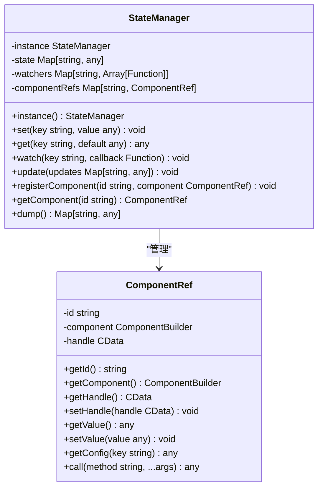
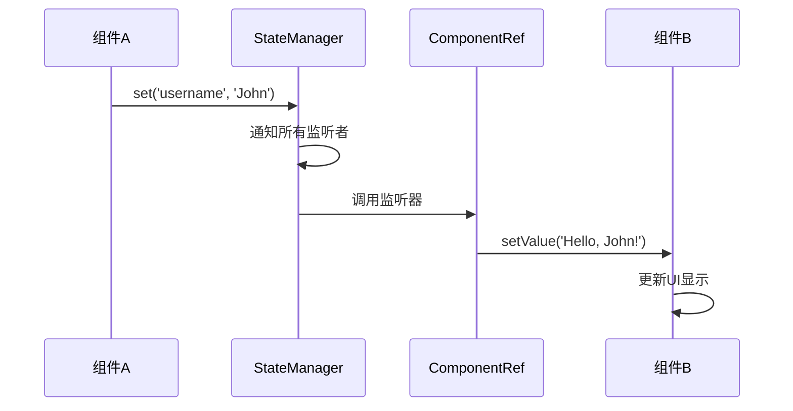
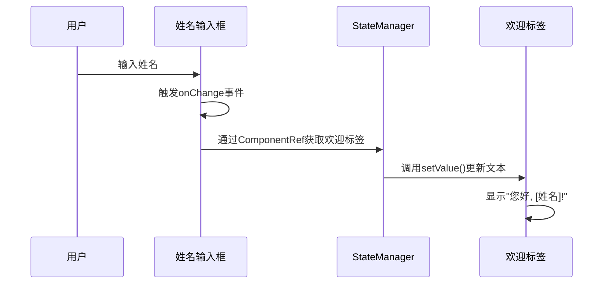
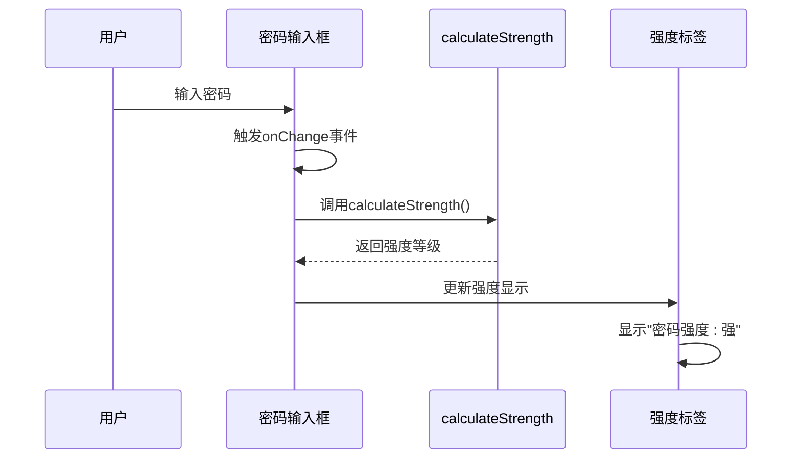
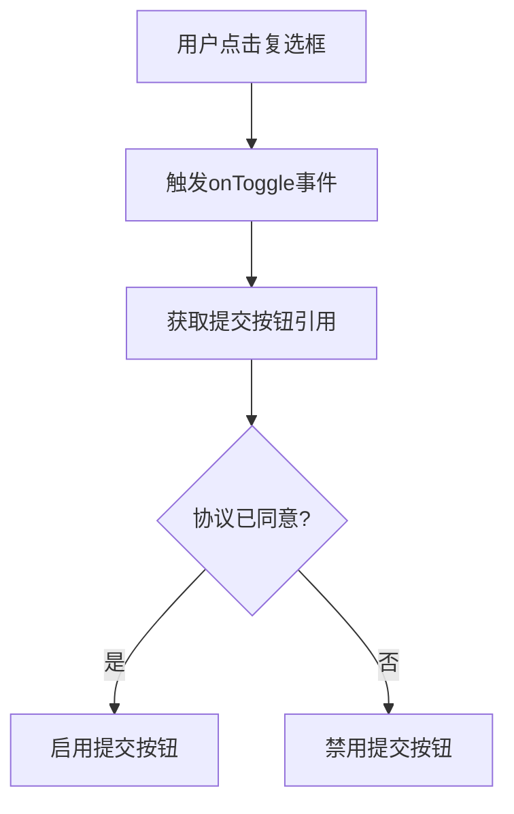
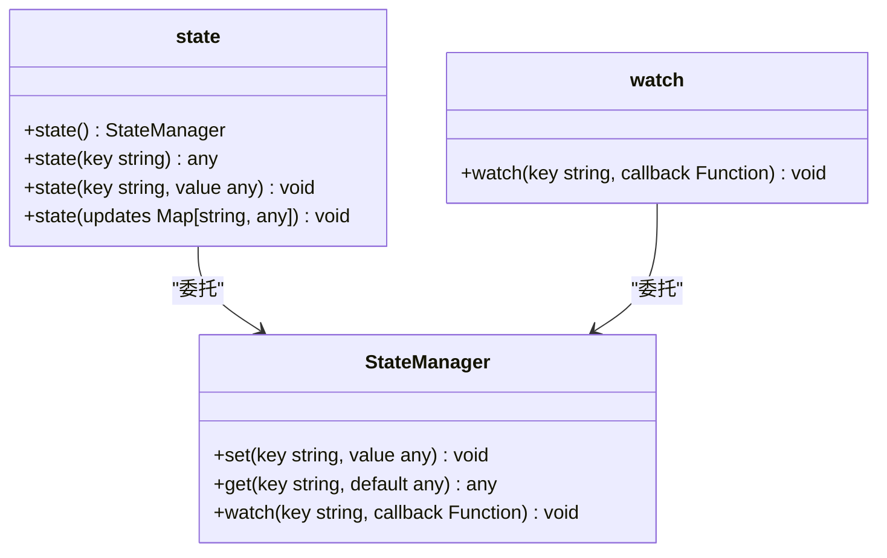

# 状态管理

<cite>
**本文档中引用的文件**   
- [StateManager.php](file://src/State/StateManager.php)
- [ComponentRef.php](file://src/State/ComponentRef.php)
- [ComponentBuilder.php](file://src/ComponentBuilder.php)
- [simple.php](file://example/simple.php)
- [StateHelperTest.php](file://tests/StateHelperTest.php)
- [helper.php](file://src/helper.php)
</cite>

## 目录
1. [状态管理机制概述](#状态管理机制概述)
2. [StateManager单例类设计](#statemanager单例类设计)
3. [ComponentRef组件引用机制](#componentref组件引用机制)
4. [双向数据绑定实现](#双向数据绑定实现)
5. [实际应用示例](#实际应用示例)
6. [状态管理辅助函数](#状态管理辅助函数)

## 状态管理机制概述

libuiBuilder的状态管理机制是实现组件间通信和数据驱动UI的核心。该机制基于全局状态管理器和组件引用系统，提供了一套完整的响应式编程模型。通过`StateManager`单例类管理全局共享状态，结合`ComponentRef`类实现组件间的引用和调用，开发者可以轻松构建复杂的交互式用户界面。

状态管理机制的核心特点包括：
- **全局状态共享**：通过`StateManager`实例在不同组件间共享数据
- **响应式监听**：使用`watch()`方法监听状态变化并自动更新UI
- **组件间通信**：通过`ComponentRef`实现跨组件方法调用和数据访问
- **双向数据绑定**：`bind()`和`watch()`协同工作实现自动同步

该机制使得UI组件能够以声明式的方式响应数据变化，大大简化了复杂应用的开发难度。

**Section sources**
- [StateManager.php](file://src/State/StateManager.php#L1-L91)
- [ComponentRef.php](file://src/State/ComponentRef.php#L1-L74)

## StateManager单例类设计

`StateManager`类采用单例模式设计，确保在整个应用程序中只有一个状态管理实例，从而实现全局状态的统一管理。该类提供了状态管理的核心功能，包括状态的设置、获取、监听和组件注册。



**Diagram sources**
- [StateManager.php](file://src/State/StateManager.php#L8-L91)
- [ComponentRef.php](file://src/State/ComponentRef.php#L11-L74)

### 核心功能实现

`StateManager`类通过几个关键方法实现状态管理：

1. **set()方法**：设置指定键的状态值，并通知所有监听该键的回调函数。当状态更新时，会遍历`watchers`数组中对应键的所有监听器并执行。

2. **get()方法**：获取指定键的状态值，支持提供默认值参数，当键不存在时返回默认值。

3. **watch()方法**：注册状态监听器，当指定键的状态发生变化时，执行提供的回调函数。支持为同一键注册多个监听器。

4. **registerComponent()方法**：注册组件引用，将组件ID与`ComponentRef`实例关联，便于后续通过ID查找和操作组件。

**Section sources**
- [StateManager.php](file://src/State/StateManager.php#L8-L91)

## ComponentRef组件引用机制

`ComponentRef`类是组件间通信的关键桥梁，它封装了对UI组件的引用，提供了安全的访问接口。通过`ComponentRef`，开发者可以在不直接暴露组件内部实现的情况下，实现跨组件的数据访问和方法调用。



**Diagram sources**
- [ComponentRef.php](file://src/State/ComponentRef.php#L11-L74)
- [StateManager.php](file://src/State/StateManager.php#L6-L91)

### 主要功能

`ComponentRef`类提供了以下核心功能：

1. **getValue()**：获取组件的当前值，通过委托给底层`ComponentBuilder`实现。

2. **setValue()**：设置组件的值，实现UI的动态更新。

3. **getConfig()**：获取组件的配置信息，支持获取特定配置项或全部配置。

4. **call()**：调用组件的任意方法，提供灵活的扩展能力。

在组件构建过程中，当调用`id()`方法时，会自动创建`ComponentRef`实例并注册到`StateManager`中，实现组件的可引用性。

**Section sources**
- [ComponentRef.php](file://src/State/ComponentRef.php#L11-L74)
- [ComponentBuilder.php](file://src/ComponentBuilder.php#L125-L130)

## 双向数据绑定实现

libuiBuilder通过`bind()`和`watch()`方法的协同工作实现了双向数据绑定机制，这是数据驱动UI的核心。该机制确保了UI组件与应用状态之间的自动同步，无需手动编写大量的更新逻辑。

```mermaid
flowchart TD
A[组件值变化] --> B[emit('change')事件]
B --> C[StateManager检测到change事件]
C --> D[调用set()更新状态]
D --> E[状态更新触发watch()监听器]
E --> F[自动更新所有绑定组件]
F --> G[UI刷新]
H[状态直接更新] --> I[触发watch()监听器]
I --> J[更新绑定组件]
J --> K[UI刷新]
```

**Diagram sources**
- [ComponentBuilder.php](file://src/ComponentBuilder.php#L136-L175)
- [StateManager.php](file://src/State/StateManager.php#L26-L37)

### 工作原理

双向数据绑定的工作流程如下：

1. **组件到状态的绑定**：当组件调用`bind()`方法时，会自动注册一个状态监听器，监听指定状态键的变化。

2. **状态到组件的同步**：监听器在状态变化时调用`setValue()`方法更新组件显示。

3. **反向同步**：组件通过`emit('change')`事件通知状态管理器其值已改变，触发状态更新。

4. **事件驱动**：`ComponentBuilder`的`emit()`方法在检测到`change`事件且组件已绑定状态时，自动调用`StateManager::set()`更新全局状态。

这种机制实现了真正的双向同步，无论状态是通过组件交互还是程序逻辑改变，都能确保所有相关UI元素保持一致。

**Section sources**
- [ComponentBuilder.php](file://src/ComponentBuilder.php#L136-L175)
- [StateManager.php](file://src/State/StateManager.php#L26-L37)

## 实际应用示例

### 表单输入联动

在`simple.php`示例中，展示了如何使用状态管理机制实现表单输入的实时联动。当用户在姓名输入框中输入内容时，欢迎标签会自动更新显示个性化问候语。



**Diagram sources**
- [simple.php](file://example/simple.php#L25-L36)

### 密码强度实时反馈

另一个典型应用是密码强度的实时反馈功能。当用户在密码输入框中输入内容时，系统会实时计算密码强度并在标签中显示结果。



**Diagram sources**
- [simple.php](file://example/simple.php#L40-L49)
- [helper.php](file://src/helper.php#L4-L59)

### 组件状态控制

状态管理还可用于控制其他组件的状态，如根据用户协议复选框的选择状态来启用或禁用提交按钮。



**Diagram sources**
- [simple.php](file://example/simple.php#L73-L82)

**Section sources**
- [simple.php](file://example/simple.php#L25-L82)

## 状态管理辅助函数

除了核心的`StateManager`类，libuiBuilder还提供了一些辅助函数来简化状态管理操作。这些函数在测试代码中得到了充分体现，展示了其易用性和灵活性。

### state()辅助函数

`state()`函数提供了更简洁的API来访问状态管理器：

- 无参数调用时返回`StateManager`实例
- 单个参数时获取指定键的状态值
- 两个参数时设置状态值
- 数组参数时批量更新状态

### watch()辅助函数

`watch()`函数简化了状态监听器的注册过程，使代码更加直观和易读。



**Diagram sources**
- [StateHelperTest.php](file://tests/StateHelperTest.php#L3-L183)

**Section sources**
- [StateHelperTest.php](file://tests/StateHelperTest.php#L3-L183)