# libuiBuilder跨组件通信机制详解

<cite>
**本文档中引用的文件**
- [StateManager.php](file://src/State/StateManager.php)
- [ComponentRef.php](file://src/State/ComponentRef.php)
- [ComponentBuilder.php](file://src/ComponentBuilder.php)
- [WindowBuilder.php](file://src/Components/WindowBuilder.php)
- [ButtonBuilder.php](file://src/Components/ButtonBuilder.php)
- [EntryBuilder.php](file://src/Components/EntryBuilder.php)
- [MenuItemBuilder.php](file://src/Components/MenuItemBuilder.php)
- [MenuBuilder.php](file://src/Components/MenuBuilder.php)
- [full.php](file://example/full.php)
- [eventAndState.php](file://example/eventAndState.php)
</cite>

## 目录
1. [概述](#概述)
2. [状态管理器架构](#状态管理器架构)
3. [组件引用机制](#组件引用机制)
4. [状态共享通信方式](#状态共享通信方式)
5. [组件引用通信方式](#组件引用通信方式)
6. [实际应用场景分析](#实际应用场景分析)
7. [内存管理与性能考虑](#内存管理与性能考虑)
8. [最佳实践指南](#最佳实践指南)
9. [总结](#总结)

## 概述

libuiBuilder提供了一套完整的跨组件通信机制，主要通过两种核心方式实现：**状态管理器（StateManager）**和**组件引用（ComponentRef）**。这两种机制各有特点，适用于不同的通信场景，为开发者提供了灵活而强大的组件间协作能力。

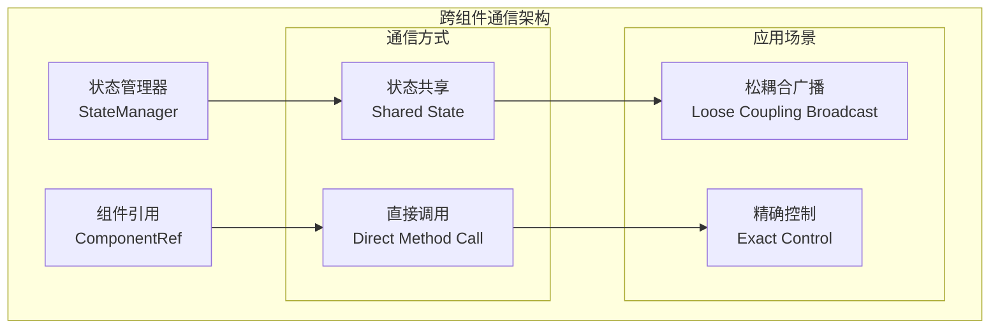

## 状态管理器架构

### 核心设计原理

状态管理器采用单例模式设计，作为全局数据共享中心，提供集中式的状态存储和监听机制。

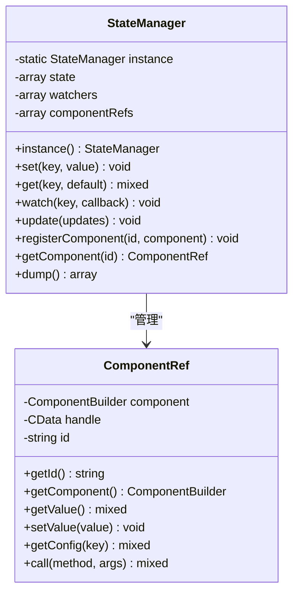

**图表来源**
- [StateManager.php](file://src/State/StateManager.php#L8-L91)
- [ComponentRef.php](file://src/State/ComponentRef.php#L11-L74)

### 状态管理器的核心功能

1. **状态存储与检索**：提供键值对形式的状态存储
2. **状态监听机制**：支持状态变化的实时监听
3. **批量更新**：支持一次性更新多个状态项
4. **组件引用注册**：自动管理组件间的引用关系

**章节来源**
- [StateManager.php](file://src/State/StateManager.php#L23-L91)

## 组件引用机制

### 引用对象设计

ComponentRef类提供了对其他组件的间接访问能力，通过封装组件实例提供安全的接口。

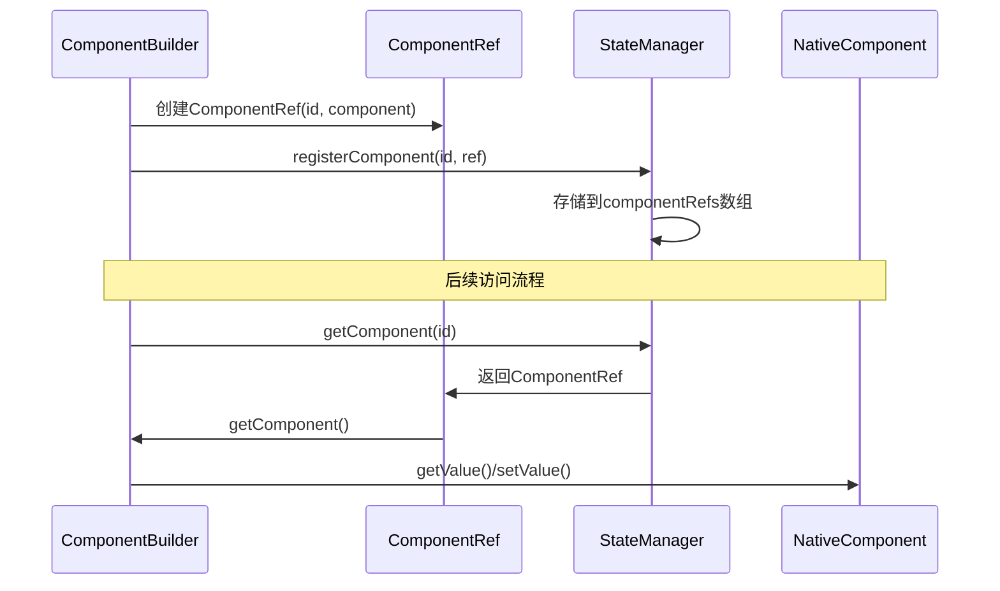

**图表来源**
- [ComponentBuilder.php](file://src/ComponentBuilder.php#L124-L130)
- [StateManager.php](file://src/State/StateManager.php#L71-L82)

### 引用方法的功能特性

1. **值操作**：`getValue()`和`setValue()`方法提供组件值的读取和设置
2. **配置访问**：`getConfig()`方法允许访问组件配置
3. **方法调用**：`call()`方法支持调用组件的任意公共方法
4. **句柄管理**：维护与原生控件的连接

**章节来源**
- [ComponentRef.php](file://src/ComponentRef.php#L43-L74)

## 状态共享通信方式

### 工作原理

状态共享通过StateManager的set()和watch()方法实现，形成发布-订阅模式的通信链路。

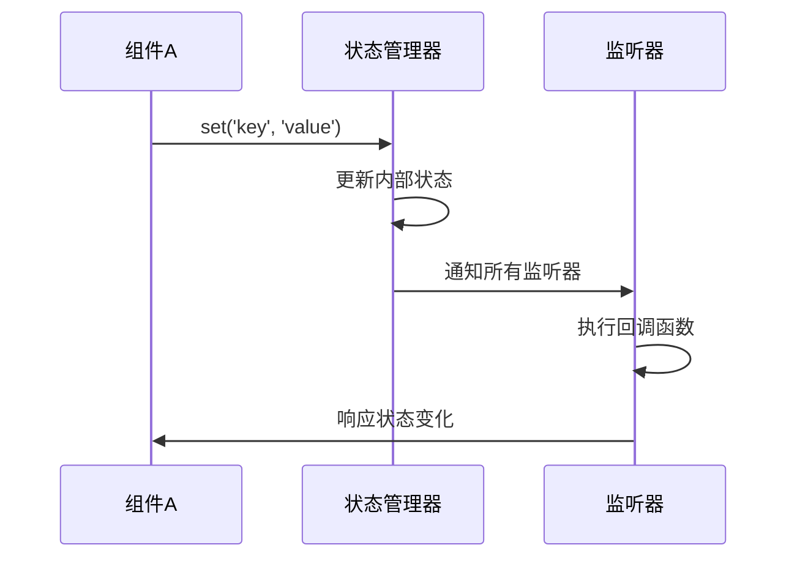

**图表来源**
- [StateManager.php](file://src/State/StateManager.php#L26-L36)

### 实现细节

1. **状态设置**：`set()`方法更新状态并触发监听器
2. **状态监听**：`watch()`方法注册回调函数
3. **批量更新**：`update()`方法支持原子性状态更新

### 适用场景

- **松耦合通信**：组件间无需直接依赖，通过状态中心进行通信
- **广播式通知**：一个组件的状态变化可以被多个监听者接收
- **数据同步**：确保多个组件的数据一致性

**章节来源**
- [StateManager.php](file://src/State/StateManager.php#L26-L66)

## 组件引用通信方式

### 引用获取机制

组件引用通过id标识符实现，支持直接的方法调用和属性访问。

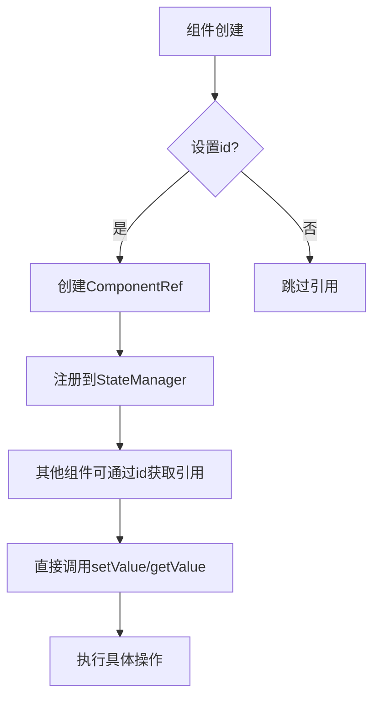

**图表来源**
- [ComponentBuilder.php](file://src/ComponentBuilder.php#L124-L130)

### 方法调用流程

1. **引用获取**：通过`StateManager::instance()->getComponent(id)`获取组件引用
2. **方法调用**：使用`call()`方法调用组件方法
3. **属性操作**：使用`getValue()`和`setValue()`操作组件属性

### 优势特点

- **精确控制**：直接操作特定组件，避免广播效应
- **方法级访问**：不仅限于值操作，可调用组件的所有公共方法
- **即时响应**：无中间环节，通信效率高

**章节来源**
- [ComponentBuilder.php](file://src/ComponentBuilder.php#L194-L207)

## 实际应用场景分析

### full.php示例分析

在完整的功能演示中，展示了两种通信方式的实际应用：

#### 状态共享应用：表单数据收集

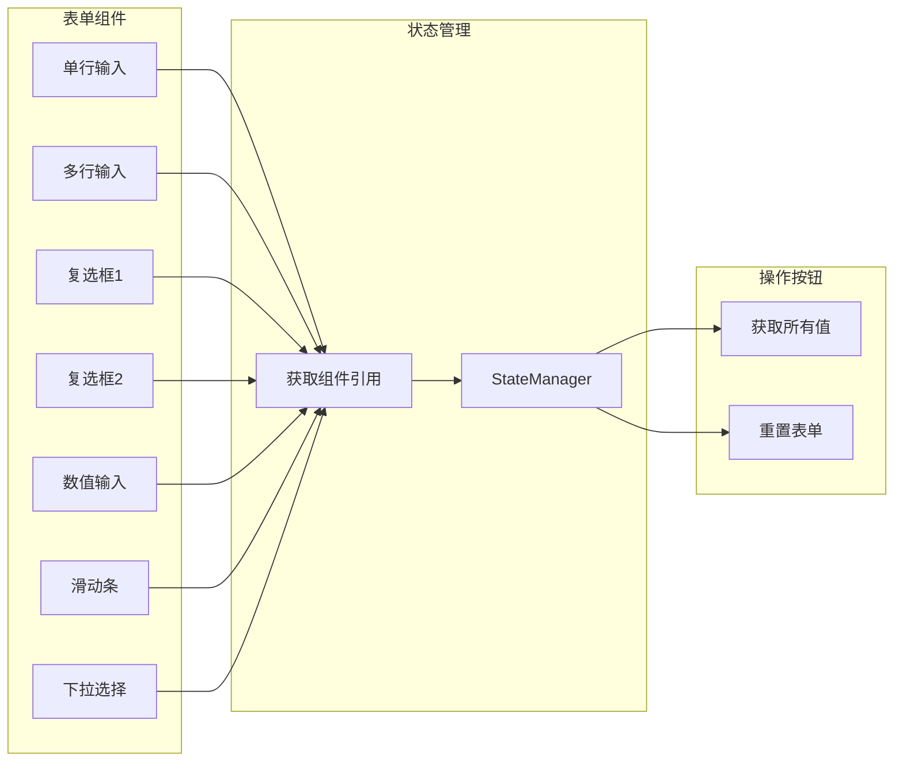

**图表来源**
- [full.php](file://example/full.php#L125-L176)

#### 组件引用应用：表单重置

表单重置按钮直接通过组件引用来设置各个输入控件的值，体现了精确控制的优势。

**章节来源**
- [full.php](file://example/full.php#L125-L176)

### eventAndState.php示例分析

#### 登录状态切换

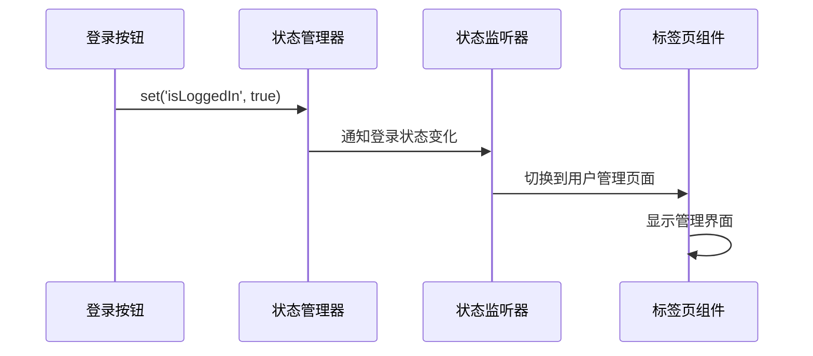

**图表来源**
- [eventAndState.php](file://example/eventAndState.php#L83-L90)

#### 实时搜索功能

搜索输入框通过组件引用获取用户列表状态，实现实时过滤功能。

**章节来源**
- [eventAndState.php](file://example/eventAndState.php#L121-L137)

## 内存管理与性能考虑

### 内存泄漏风险

#### 循环引用问题

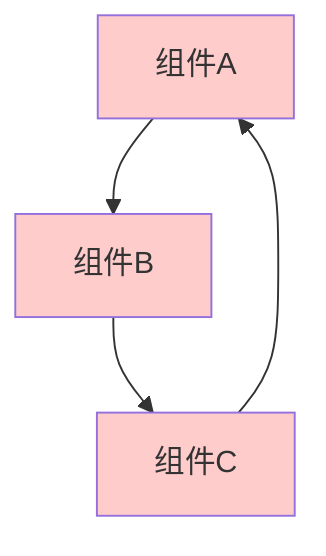

**潜在风险点**：
1. **组件引用链**：多个组件相互持有对方引用
2. **状态监听器**：监听器持有组件引用
3. **事件处理器**：事件处理器捕获外部变量

### 避免策略

#### 弱引用模式

虽然PHP没有原生的弱引用支持，但可以通过以下方式规避：

1. **及时清理监听器**：不再需要时移除状态监听器
2. **作用域限制**：在适当的作用域内创建引用
3. **手动解绑**：主动断开不必要的引用关系

#### 最佳实践

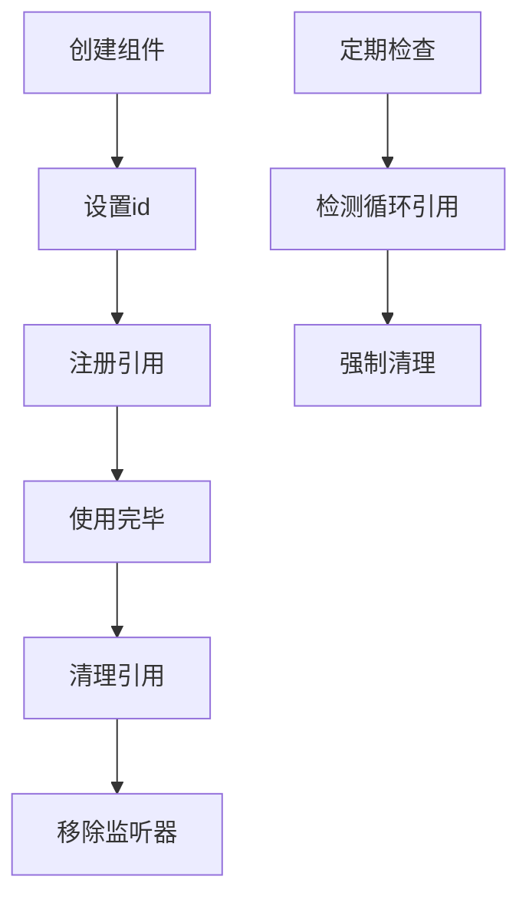

### 性能优化建议

1. **批量状态更新**：使用`update()`方法进行批量操作
2. **延迟初始化**：按需创建组件引用
3. **监听器去重**：避免重复注册相同的监听器

**章节来源**
- [StateManager.php](file://src/State/StateManager.php#L58-L66)

## 最佳实践指南

### 选择通信方式的决策树

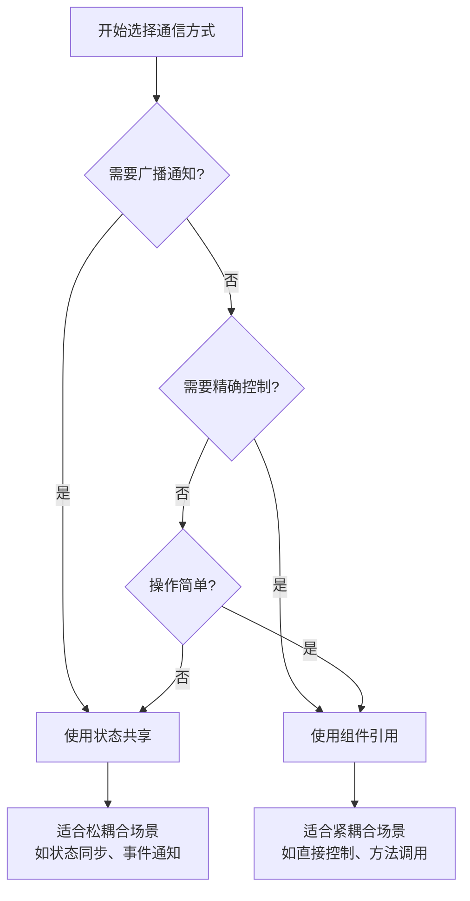

### 开发规范

#### 状态命名约定

1. **语义化命名**：使用描述性的状态键名
2. **层次化组织**：使用点号分隔的层次结构
3. **类型前缀**：为不同类型的状态添加前缀

#### 组件引用管理

1. **唯一标识**：确保每个组件的id唯一
2. **生命周期管理**：在组件销毁时清理引用
3. **异常处理**：处理不存在的组件引用

### 错误处理策略

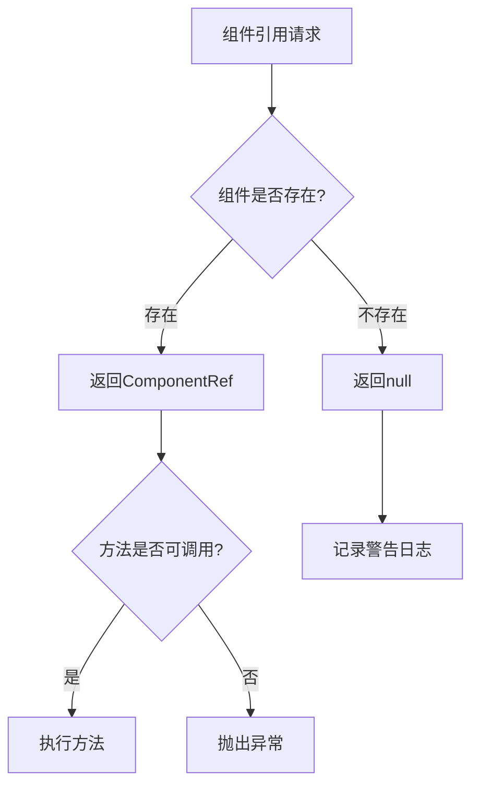

## 总结

libuiBuilder的跨组件通信机制提供了两种互补的方式：

### 状态共享的优势

- **松耦合设计**：组件间无需直接依赖
- **广播通信**：一个状态变化影响多个监听者
- **数据一致性**：确保相关组件状态同步

### 组件引用的优势

- **精确控制**：直接操作特定组件
- **方法级访问**：支持组件的所有公共方法
- **高效通信**：无中间环节，响应迅速

### 综合应用建议

1. **混合使用**：根据具体需求选择合适的通信方式
2. **架构设计**：在应用架构层面合理规划通信策略
3. **性能监控**：关注通信频率和性能影响
4. **文档维护**：清晰记录组件间的通信关系

通过合理运用这两种通信机制，开发者可以构建出既灵活又高效的GUI应用程序，充分发挥libuiBuilder框架的潜力。