# libuiBuilder完整控件示例深度解析

<cite>
**本文档引用的文件**
- [full.php](file://example/full.php)
- [htmlFull.php](file://example/htmlFull.php)
- [full.ui.html](file://example/views/full.ui.html)
- [ComponentBuilder.php](file://src/ComponentBuilder.php)
- [WindowBuilder.php](file://src/Components/WindowBuilder.php)
- [ButtonBuilder.php](file://src/Components/ButtonBuilder.php)
- [GridBuilder.php](file://src/Components/GridBuilder.php)
- [BoxBuilder.php](file://src/Components/BoxBuilder.php)
- [TabBuilder.php](file://src/Builder/TabBuilder.php)
- [ResponsiveGridBuilder.php](file://src/ResponsiveGridBuilder.php)
- [helper.php](file://src/helper.php)
</cite>

## 目录
1. [项目概述](#项目概述)
2. [核心架构分析](#核心架构分析)
3. [Builder API模式详解](#builder-api模式详解)
4. [HTML模板系统分析](#html模板系统分析)
5. [完整控件示例深度解析](#完整控件示例深度解析)
6. [组件配置与参数详解](#组件配置与参数详解)
7. [布局管理策略](#布局管理策略)
8. [事件处理机制](#事件处理机制)
9. [两种开发模式对比](#两种开发模式对比)
10. [运行指南与最佳实践](#运行指南与最佳实践)
11. [总结](#总结)

## 项目概述

libuiBuilder是一个基于PHP的GUI应用程序框架，提供了两种主要的界面构建方式：传统的Builder API和基于HTML模板的声明式界面设计。本文档重点分析了两个核心示例文件：`full.php`展示了完整的Builder API使用方式，而`htmlFull.php`和对应的HTML模板则演示了声明式界面设计的优势。

## 核心架构分析

### 组件继承体系

libuiBuilder采用面向对象的设计模式，所有UI组件都继承自`ComponentBuilder`抽象基类：

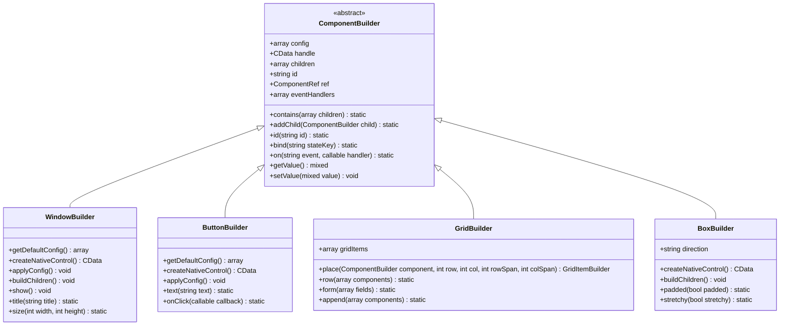

**图表来源**
- [ComponentBuilder.php](file://src/ComponentBuilder.php#L11-L234)
- [WindowBuilder.php](file://src/Components/WindowBuilder.php#L11-L96)
- [ButtonBuilder.php](file://src/Components/ButtonBuilder.php#L9-L48)
- [GridBuilder.php](file://src/Components/GridBuilder.php#L9-L150)

### 状态管理系统

框架内置了强大的状态管理机制，通过`StateManager`类实现组件间的数据绑定和状态同步：

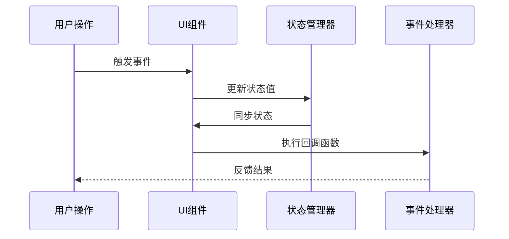

**节来源**
- [ComponentBuilder.php](file://src/ComponentBuilder.php#L135-L174)

## Builder API模式详解

### 窗口构建流程

Builder API采用链式调用的方式构建复杂的UI结构。以`full.php`为例，窗口构建过程如下：

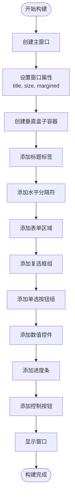

**图表来源**
- [full.php](file://example/full.php#L14-L178)

### 组件链式配置

每个组件都支持流畅的链式配置方法，例如：

```php
// 按钮配置示例
Builder::button()
    ->text('获取所有值')
    ->onClick(function($button) use ($stateManager) {
        // 事件处理逻辑
    })
```

**节来源**
- [ButtonBuilder.php](file://src/Components/ButtonBuilder.php#L39-L47)

## HTML模板系统分析

### 模板语法结构

HTML模板系统使用XML-like语法，通过`<ui>`根元素定义界面结构：

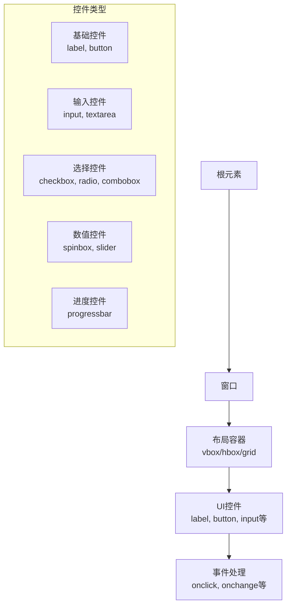

**图表来源**
- [full.ui.html](file://example/views/full.ui.html#L17-L125)

### 模板渲染流程

HTML模板通过`HtmlRenderer`类进行解析和渲染：

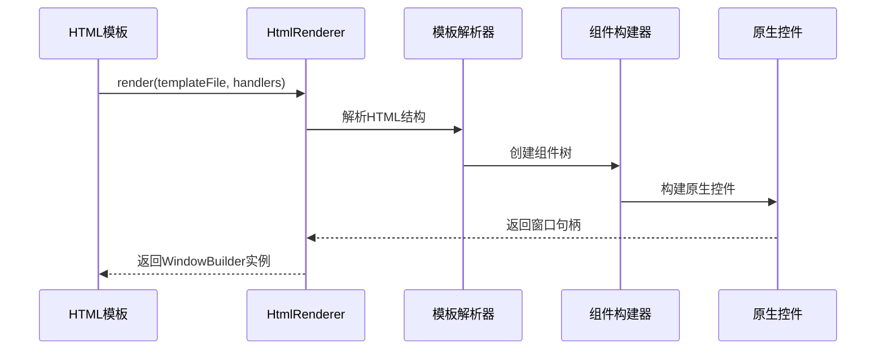

**图表来源**
- [htmlFull.php](file://example/htmlFull.php#L74-L75)

## 完整控件示例深度解析

### 基础控件布局

`full.php`展示了完整的控件布局结构，采用层次化的容器组织：

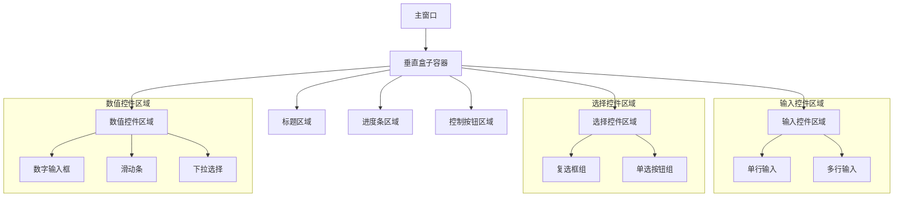

**图表来源**
- [full.php](file://example/full.php#L19-L177)

### 表单布局策略

框架提供了多种表单布局策略，包括网格布局和响应式布局：

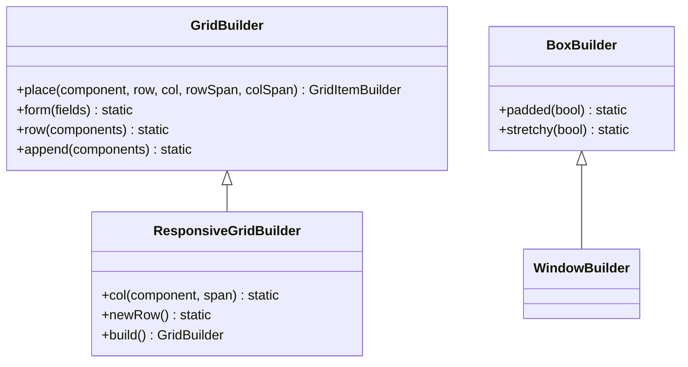

**图表来源**
- [GridBuilder.php](file://src/Components/GridBuilder.php#L59-L149)
- [ResponsiveGridBuilder.php](file://src/ResponsiveGridBuilder.php#L7-L81)

**节来源**
- [full.php](file://example/full.php#L26-L112)

## 组件配置与参数详解

### 常用组件配置表

| 组件类型 | 主要配置参数 | 默认值 | 说明 |
|---------|-------------|--------|------|
| Window | title, width, height, margined | "LibUI Application", 640, 480, true | 窗口基本属性 |
| Button | text, onClick | "Button", null | 按钮文本和点击事件 |
| Entry | placeholder, readonly, multiline | "", false, false | 输入框属性 |
| Checkbox | text, checked, onToggled | "", false, null | 复选框属性 |
| Radio | items, selected, onSelected | [], 0, null | 单选按钮组属性 |
| Slider | min, max, value, onChange | 0, 100, 0, null | 滑动条范围和值 |
| Spinbox | min, max, value | 0, 100, 0 | 数字输入框范围 |
| Combobox | items, selected | [], 0 | 下拉列表项 |
| ProgressBar | value | 0 | 进度条值 |

### 事件处理配置

组件支持丰富的事件处理机制：

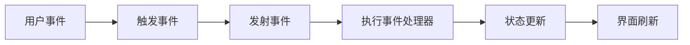

**图表来源**
- [ComponentBuilder.php](file://src/ComponentBuilder.php#L162-L169)

**节来源**
- [full.php](file://example/full.php#L126-L175)

## 布局管理策略

### 容器组件层次结构

框架提供了多种容器组件来组织UI布局：

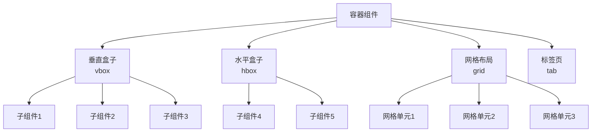

**图表来源**
- [BoxBuilder.php](file://src/Components/BoxBuilder.php#L11-L64)
- [GridBuilder.php](file://src/Components/GridBuilder.php#L9-L150)

### 响应式布局实现

`ResponsiveGridBuilder`提供了灵活的响应式布局能力：

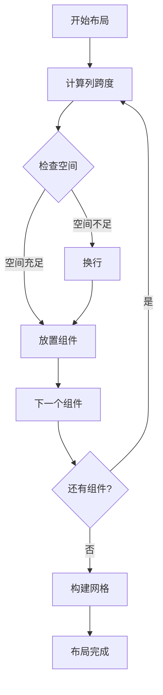

**图表来源**
- [ResponsiveGridBuilder.php](file://src/ResponsiveGridBuilder.php#L19-L35)

**节来源**
- [ResponsiveGridBuilder.php](file://src/ResponsiveGridBuilder.php#L45-L70)

## 事件处理机制

### 事件绑定流程

框架的事件处理采用观察者模式，支持组件间的松耦合通信：

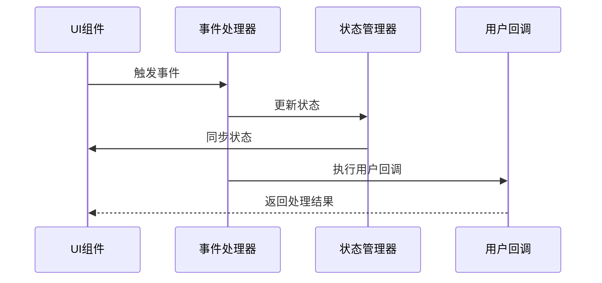

**图表来源**
- [ComponentBuilder.php](file://src/ComponentBuilder.php#L150-L174)

### 状态绑定机制

组件可以通过`bind()`方法与状态管理器绑定，实现双向数据绑定：

```php
// 组件绑定到状态
Builder::entry()
    ->id('username')
    ->bind('user.name');

// 状态变化时自动更新组件
StateManager::instance()->set('user.name', 'John Doe');
```

**节来源**
- [ComponentBuilder.php](file://src/ComponentBuilder.php#L135-L146)

## 两种开发模式对比

### Builder API vs HTML模板

| 特性 | Builder API | HTML模板 |
|------|-------------|----------|
| 开发效率 | 中等 | 高 |
| 可读性 | 较高 | 很高 |
| 类型安全 | 强 | 弱 |
| 动态性 | 高 | 中等 |
| 调试难度 | 中等 | 低 |
| 性能开销 | 低 | 中等 |
| 学习曲线 | 平缓 | 平缓 |

### 代码等效性分析

以下是比较两个版本的关键差异：

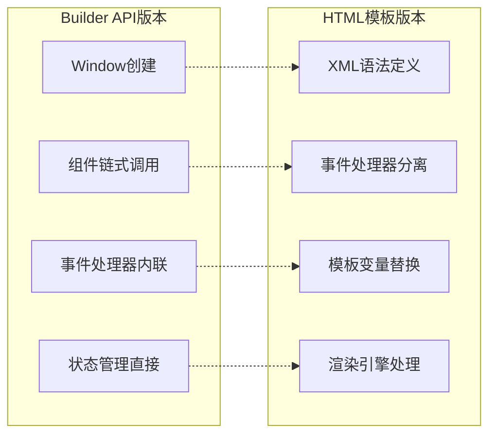

**图表来源**
- [full.php](file://example/full.php#L14-L178)
- [htmlFull.php](file://example/htmlFull.php#L14-L75)
- [full.ui.html](file://example/views/full.ui.html#L17-L125)

**节来源**
- [full.php](file://example/full.php#L1-L180)
- [htmlFull.php](file://example/htmlFull.php#L1-L76)
- [full.ui.html](file://example/views/full.ui.html#L1-L126)

## 运行指南与最佳实践

### 环境准备

1. 确保已安装PHP环境
2. 安装libui扩展
3. 配置Composer依赖

### 运行命令

```bash
# 运行Builder API版本
php example/full.php

# 运行HTML模板版本
php example/htmlFull.php
```

### 最佳实践建议

1. **组件命名规范**：使用有意义的ID标识组件
2. **事件处理分离**：将业务逻辑与UI逻辑分离
3. **状态管理**：合理使用状态绑定机制
4. **布局设计**：优先使用容器组件组织界面
5. **性能优化**：避免频繁的状态更新

### 调试技巧

1. 使用`StateManager::instance()->dump()`查看状态
2. 利用事件处理器的日志输出
3. 通过组件的`getValue()`方法验证数据

## 总结

libuiBuilder提供了一套完整的GUI开发解决方案，通过Builder API和HTML模板两种方式满足不同的开发需求。Builder API适合需要高度定制和程序化控制的场景，而HTML模板则更适合快速原型开发和维护。

两种方式在功能上完全等效，但在开发体验、可维护性和团队协作方面各有优势。开发者可以根据项目特点和团队技能选择合适的方式，或者在同一个项目中混合使用两种方式。

框架的模块化设计使得扩展新的组件变得简单，而完善的事件处理和状态管理机制确保了复杂应用的可维护性。通过深入理解这些核心概念，开发者能够构建出功能丰富、用户体验优秀的桌面应用程序。