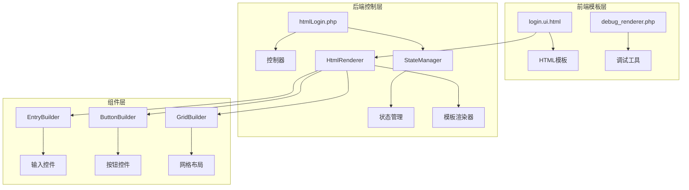
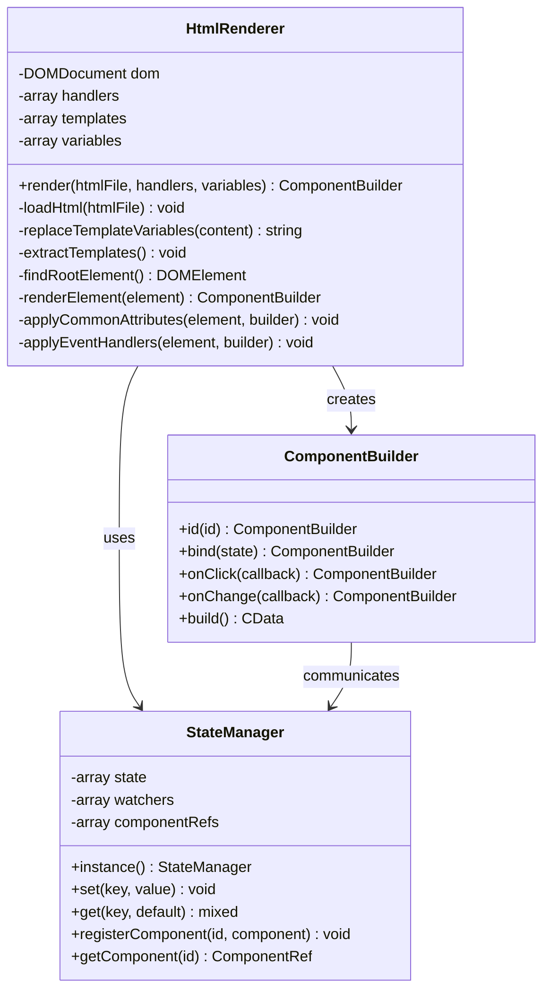
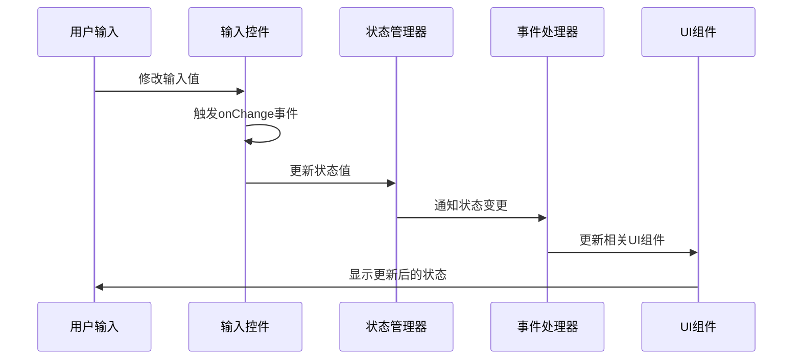
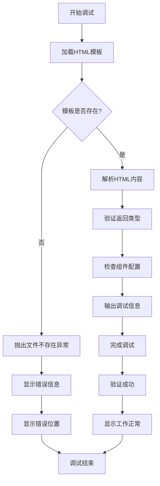
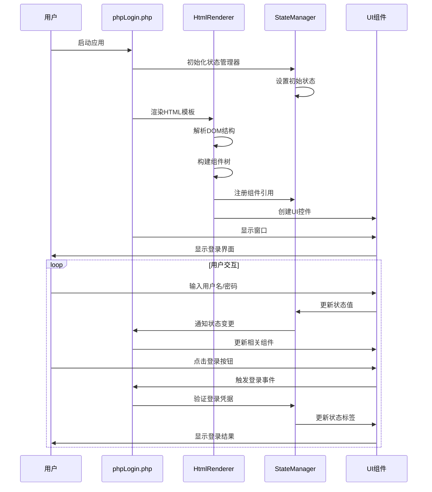
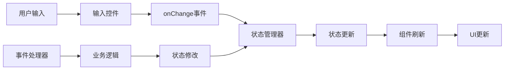
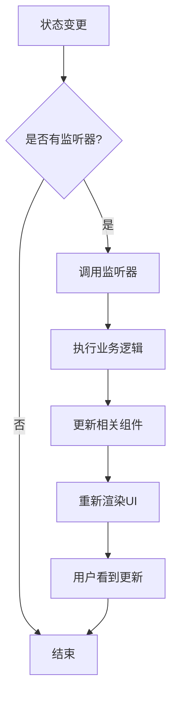

# 登录表单示例

<cite>
**本文档中引用的文件**
- [login.ui.html](file://example/views/login.ui.html)
- [htmlLogin.php](file://example/htmlLogin.php)
- [debug_renderer.php](file://example/debug_renderer.php)
- [HtmlRenderer.php](file://src/HtmlRenderer.php)
- [StateManager.php](file://src/State/StateManager.php)
- [ComponentRef.php](file://src/State/ComponentRef.php)
- [EntryBuilder.php](file://src/Components/EntryBuilder.php)
- [ButtonBuilder.php](file://src/Components/ButtonBuilder.php)
- [GridBuilder.php](file://src/Components/GridBuilder.php)
- [FormTemplate.php](file://src/Templates/FormTemplate.php)
</cite>

## 目录
1. [简介](#简介)
2. [项目结构概览](#项目结构概览)
3. [HTML模板分析](#html模板分析)
4. [PHP控制器分析](#php控制器分析)
5. [模板渲染机制](#模板渲染机制)
6. [数据绑定与事件处理](#数据绑定与事件处理)
7. [调试工具使用](#调试工具使用)
8. [完整运行流程](#完整运行流程)
9. [最佳实践与优化建议](#最佳实践与优化建议)
10. [总结](#总结)

## 简介

本文档详细分析了基于PHP UI构建器的登录表单示例，展示了如何在HTML模板模式下构建一个典型的登录界面。该示例包含了完整的表单控件声明、数据绑定机制、事件处理流程以及调试工具的使用方法。

通过分析`login.ui.html`模板文件和`htmlLogin.php`控制器，我们将深入了解HTML模板模式下的表单开发方法、数据流管理和组件交互机制。

## 项目结构概览

该项目采用模块化的架构设计，主要包含以下核心组件：



**图表来源**
- [login.ui.html](file://example/views/login.ui.html#L1-L49)
- [htmlLogin.php](file://example/htmlLogin.php#L1-L96)
- [HtmlRenderer.php](file://src/HtmlRenderer.php#L1-L684)

**章节来源**
- [login.ui.html](file://example/views/login.ui.html#L1-L49)
- [htmlLogin.php](file://example/htmlLogin.php#L1-L96)

## HTML模板分析

### 模板结构概述

`login.ui.html`文件定义了一个完整的登录表单界面，采用了基于网格布局的响应式设计。模板文件遵循自定义的UI标记语言规范，提供了丰富的组件声明和布局控制能力。

### 核心组件声明

#### 窗口容器
```html
<window title="登录窗口" size="400,300" centered="true" margined="true">
```
- **标题设置**: `title="登录窗口"` - 定义窗口标题
- **尺寸控制**: `size="400,300"` - 设置窗口宽度400px，高度300px
- **居中显示**: `centered="true"` - 窗口在屏幕中央显示
- **边距设置**: `margined="true"` - 添加窗口边距

#### 网格布局系统
```html
<grid padded="true">
```
网格布局提供了灵活的二维排列能力：
- `padded="true"` - 启用内边距，改善视觉效果
- 支持行列定位、跨行跨列、对齐方式等高级布局特性

### 表单控件详解

#### 用户名输入框
```html
<input 
  id="usernameInput"
  row="0" 
  col="1" 
  bind="username"
  placeholder="请输入用户名"
  expand="horizontal"
  onchange="handleUsernameChange"
/>
```

**控件特性分析**:
- **ID标识**: `id="usernameInput"` - 唯一标识组件，用于事件绑定和状态管理
- **网格定位**: `row="0" col="1"` - 位于第0行第1列
- **数据绑定**: `bind="username"` - 与状态管理器中的`username`字段双向绑定
- **占位符**: `placeholder="请输入用户名"` - 输入提示信息
- **扩展属性**: `expand="horizontal"` - 水平方向扩展以填充可用空间
- **事件处理**: `onchange="handleUsernameChange"` - 输入变化时触发事件

#### 密码输入框
```html
<input 
  id="passwordInput"
  row="1" 
  col="1" 
  type="password"
  bind="password"
  placeholder="请输入密码"
  expand="horizontal"
  onchange="handlePasswordChange"
/>
```

**安全特性**:
- `type="password"` - 密码输入模式，字符会被隐藏
- 类似于用户名输入框的配置，但具有更强的安全性考虑

#### 按钮组
```html
<hbox row="2" col="0" colspan="2" align="center">
  <button id="loginBtn" onclick="handleLogin">登录</button>
  <button onclick="handleReset">清空</button>
</hbox>
```

**布局特点**:
- `hbox` - 水平盒子布局，按钮水平排列
- `row="2" col="0" colspan="2"` - 占据第2行，跨越两列
- `align="center"` - 内容居中对齐
- 两个按钮分别处理登录和清空功能

#### 状态标签
```html
<label 
  id="statusLabel" 
  row="3" 
  col="0" 
  colspan="2" 
  align="center"
>请输入登录信息</label>
```

**功能作用**:
- 显示操作状态和反馈信息
- 占据最后一行，跨越两列，提供完整的状态展示区域

**章节来源**
- [login.ui.html](file://example/views/login.ui.html#L1-L49)

## PHP控制器分析

### 初始化与状态管理

`htmlLogin.php`文件作为控制器，负责初始化应用状态、定义事件处理器和执行模板渲染。

#### 状态初始化
```php
$state = StateManager::instance();
$state->set('username', '');
$state->set('password', '');
```

**状态管理机制**:
- 使用单例模式的`StateManager`管理全局状态
- 初始化用户名和密码为空字符串
- 支持状态监听和变更通知机制

#### 事件处理器定义

##### 用户名变化处理器
```php
'handleUsernameChange' => function($value, $component) {
    echo "用户名输入: {$value}\n";
    
    $loginBtn = StateManager::instance()->getComponent('loginBtn');
    $passwordInput = StateManager::instance()->getComponent('passwordInput');
    
    $canLogin = !empty($value) && !empty($passwordInput?->getValue());
    echo "可以登录: " . ($canLogin ? '是' : '否') . "\n";
}
```

**处理逻辑分析**:
- 接收输入值和组件引用
- 输出调试信息
- 动态检查登录条件
- 控制登录按钮的可用状态

##### 密码强度检测
```php
'handlePasswordChange' => function($value, $component) {
    $strength = '弱';
    if (strlen($value) > 8) {
        $strength = '中';
    }
    if (strlen($value) > 12 && preg_match('/[A-Z]/', $value) && preg_match('/[0-9]/', $value)) {
        $strength = '强';
    }
    
    $statusLabel = StateManager::instance()->getComponent('statusLabel');
    if ($statusLabel) {
        $statusLabel->setValue("密码强度: {$strength}");
    }
}
```

**密码验证规则**:
- 基础强度：长度大于8字符
- 中等强度：长度大于12字符且包含大写字母和数字
- 强度评估实时反馈给用户

##### 登录验证逻辑
```php
'handleLogin' => function($button, $stateManager) {
    $username = $stateManager->get('username');
    $password = $stateManager->get('password');
    
    if (empty($username) || empty($password)) {
        echo "用户名和密码不能为空\n";
        return;
    }
    
    if ($username === 'admin' && $password === 'admin') {
        echo "登录成功！\n";
        $statusLabel = StateManager::instance()->getComponent('statusLabel');
        if ($statusLabel) {
            $statusLabel->setValue("登录成功！");
        }
    } else {
        echo "用户名或密码错误\n";
        $statusLabel = StateManager::instance()->getComponent('statusLabel');
        if ($statusLabel) {
            $statusLabel->setValue("登录失败：用户名或密码错误");
        }
    }
}
```

**安全验证流程**:
- 参数验证：确保用户名和密码不为空
- 凭证匹配：模拟管理员账户验证
- 结果反馈：根据验证结果更新状态标签

##### 表单重置功能
```php
'handleReset' => function($button, $stateManager) {
    $stateManager->update([
        'username' => '',
        'password' => ''
    ]);
    
    StateManager::instance()->getComponent('usernameInput')?->setValue('');
    StateManager::instance()->getComponent('passwordInput')?->setValue('');
    
    $statusLabel = StateManager::instance()->getComponent('statusLabel');
    if ($statusLabel) {
        $statusLabel->setValue("请输入登录信息");
    }
    
    echo "表单已清空\n";
}
```

**重置机制**:
- 批量更新状态值
- 直接操作组件实例
- 重置状态标签显示

### 模板渲染与应用启动

```php
$app = HtmlRenderer::render(__DIR__ . '/views/login.ui.html', $handlers);
$app->show();
```

**渲染流程**:
1. 加载HTML模板文件
2. 应用事件处理器映射
3. 构建组件树
4. 显示应用程序窗口

**章节来源**
- [htmlLogin.php](file://example/htmlLogin.php#L1-L96)

## 模板渲染机制

### HtmlRenderer核心架构

`HtmlRenderer`类是整个模板系统的核心，负责将HTML模板转换为可执行的UI组件树。



**图表来源**
- [HtmlRenderer.php](file://src/HtmlRenderer.php#L41-L684)
- [StateManager.php](file://src/State/StateManager.php#L8-L91)

### 渲染流程详解

#### 1. HTML文件加载与预处理
```php
private function loadHtml(string $htmlFile): void
{
    if (!file_exists($htmlFile)) {
        throw new Exception("HTML template file not found: {$htmlFile}");
    }
    
    $this->dom = new DOMDocument();
    $this->dom->preserveWhiteSpace = false;
    
    $content = file_get_contents($htmlFile);
    $content = $this->replaceTemplateVariables($content);
    $content = '<?xml encoding="UTF-8">' . $content;
    
    libxml_use_internal_errors(true);
    $this->dom->loadHTML($content, LIBXML_HTML_NOIMPLIED | LIBXML_HTML_NODEFDTD);
    libxml_clear_errors();
}
```

**处理步骤**:
- 文件存在性检查
- DOM文档初始化
- 模板变量替换
- UTF-8编码处理
- HTML解析（忽略警告）

#### 2. 模板变量替换机制
```php
private function replaceTemplateVariables(string $content): string
{
    return preg_replace_callback('/\{\{(\w+)\}\}/', function($matches) {
        $varName = $matches[1];
        return $this->variables[$varName] ?? '';
    }, $content);
}
```

**变量替换规则**:
- 模式：`{{variableName}}`
- 支持嵌套变量
- 未定义变量替换为空字符串

#### 3. 组件映射与构建
```php
private function renderElement(DOMElement $element): ComponentBuilder
{
    $tagName = strtolower($element->tagName);
    
    $builder = match($tagName) {
        'window' => $this->renderWindow($element),
        'grid' => $this->renderGrid($element),
        'hbox' => $this->renderHBox($element),
        'vbox' => $this->renderVBox($element),
        'label' => $this->renderLabel($element),
        'input' => $this->renderInput($element),
        'button' => $this->renderButton($element),
        // ... 其他组件类型
    };
    
    $this->applyCommonAttributes($element, $builder);
    return $builder;
}
```

**映射策略**:
- 标签名称到组件类的映射
- 通用属性应用
- 递归子元素处理

**章节来源**
- [HtmlRenderer.php](file://src/HtmlRenderer.php#L57-L684)

## 数据绑定与事件处理

### 双向数据绑定机制

系统实现了完整的双向数据绑定，确保UI状态与应用状态同步。



**图表来源**
- [EntryBuilder.php](file://src/Components/EntryBuilder.php#L38-L50)
- [StateManager.php](file://src/State/StateManager.php#L26-L36)

### 状态管理器架构

#### 核心功能
```php
class StateManager
{
    private array $state = [];
    private array $watchers = [];
    private array $componentRefs = [];
    
    public function set(string $key, $value): void
    {
        $oldValue = $this->state[$key] ?? null;
        $this->state[$key] = $value;
        
        if (isset($this->watchers[$key])) {
            foreach ($this->watchers[$key] as $callback) {
                $callback($value, $oldValue, $key);
            }
        }
    }
    
    public function get(string $key, $default = null)
    {
        return $this->state[$key] ?? $default;
    }
}
```

**状态管理特性**:
- 响应式更新：状态变更自动通知监听器
- 类型安全：支持任意类型的值存储
- 性能优化：批量更新机制

#### 组件引用管理
```php
public function registerComponent(string $id, ComponentRef $component): void
{
    $this->componentRefs[$id] = $component;
}

public function getComponent(string $id): ?ComponentRef
{
    return $this->componentRefs[$id] ?? null;
}
```

**组件通信机制**:
- 通过ID唯一标识组件
- 提供组件间直接通信能力
- 支持动态组件查找和操作

### 事件处理系统

#### 事件绑定流程
```php
private function applyEventHandlers(DOMElement $element, ComponentBuilder $builder): void
{
    $eventMap = [
        'onclick' => 'onClick',
        'onchange' => 'onChange',
        'onselected' => 'onSelected',
        'ontoggled' => 'onToggled',
    ];
    
    foreach ($eventMap as $htmlEvent => $builderMethod) {
        if ($handlerName = $element->getAttribute($htmlEvent)) {
            if (isset($this->handlers[$handlerName])) {
                $builder->$builderMethod($this->handlers[$handlerName]);
            }
        }
    }
}
```

**事件类型支持**:
- `onclick`: 点击事件
- `onchange`: 值变化事件  
- `onselected`: 选择事件
- `ontoggled`: 切换事件

#### 事件处理器签名
```php
// 点击事件处理器
function(ButtonBuilder $button, StateManager $stateManager): void

// 变化事件处理器  
function(mixed $value, ComponentBuilder $component): void

// 选择事件处理器
function(int $selectedIndex, ComponentBuilder $component): void
```

**章节来源**
- [StateManager.php](file://src/State/StateManager.php#L8-L91)
- [HtmlRenderer.php](file://src/HtmlRenderer.php#L218-L238)

## 调试工具使用

### debug_renderer.php功能分析

`debug_renderer.php`提供了完整的模板渲染调试功能，帮助开发者诊断和解决渲染问题。

#### 调试流程设计


**图表来源**
- [debug_renderer.php](file://example/debug_renderer.php#L1-L50)

#### 关键调试功能

##### 1. 模板解析验证
```php
echo "1. 正在解析 HTML 模板...\n";
$app = HtmlRenderer::render(__DIR__ . '/views/login.ui.html', $handlers);
echo "   ✓ HTML 模板解析成功！\n";
```

**验证要点**:
- 文件存在性检查
- HTML语法验证
- 模板完整性检查

##### 2. 返回类型验证
```php
if ($app instanceof \Kingbes\Libui\View\Components\WindowBuilder) {
    echo "   ✓ 返回正确的 WindowBuilder 实例\n";
} else {
    echo "   ✗ 返回类型错误: " . get_class($app) . "\n";
}
```

**类型检查**:
- 确认返回的是正确的组件类型
- 验证组件树构建成功
- 检查继承关系正确性

##### 3. 配置信息检查
```php
$reflection = new ReflectionClass($app);
$configProperty = $reflection->getProperty('config');
$configProperty->setAccessible(true);
$config = $configProperty->getValue($app);

foreach ($config as $key => $value) {
    echo "     $key: " . (is_scalar($value) ? $value : gettype($value)) . "\n";
}
```

**配置验证**:
- 检查组件配置属性
- 验证配置值的类型和范围
- 确认配置项的完整性

#### 异常处理机制
```php
try {
    // 调试代码
} catch (Exception $e) {
    echo "   ✗ 发生错误: " . $e->getMessage() . "\n";
    echo "   错误位置: " . $e->getFile() . ":" . $e->getLine() . "\n";
}
```

**错误处理特性**:
- 详细的错误信息输出
- 错误位置精确定位
- 支持多种异常类型

**章节来源**
- [debug_renderer.php](file://example/debug_renderer.php#L1-L50)

## 完整运行流程

### 应用启动流程



**图表来源**
- [htmlLogin.php](file://example/htmlLogin.php#L93-L96)
- [HtmlRenderer.php](file://src/HtmlRenderer.php#L57-L77)

### 关键代码片段解读

#### 模板渲染入口
```php
$app = HtmlRenderer::render(__DIR__ . '/views/login.ui.html', $handlers);
$app->show();
```

**执行步骤**:
1. `HtmlRenderer::render()` - 调用静态方法进行模板渲染
2. `$handlers`参数传递事件处理器映射
3. 返回构建好的组件树
4. `show()`方法显示应用程序窗口

#### 状态初始化
```php
$state = StateManager::instance();
$state->set('username', '');
$state->set('password', '');
```

**初始化策略**:
- 使用单例模式确保状态管理器唯一性
- 设置初始状态值为空字符串
- 支持后续动态更新

#### 事件处理器注册
```php
$handlers = [
    'handleUsernameChange' => function($value, $component) {
        // 用户名变化处理逻辑
    },
    'handlePasswordChange' => function($value, $component) {
        // 密码强度检测逻辑
    },
    'handleLogin' => function($button, $stateManager) {
        // 登录验证逻辑
    },
    'handleReset' => function($button, $stateManager) {
        // 表单重置逻辑
    }
];
```

**处理器特点**:
- 每个处理器对应特定的业务逻辑
- 支持参数传递和组件引用
- 遵循统一的回调签名

### 数据流管理

#### 输入到状态的数据流


**数据流特性**:
- 单向数据流：状态驱动UI
- 响应式更新：状态变更自动触发UI更新
- 事件驱动：用户交互触发状态变更

#### 状态到UI的更新流


**更新机制**:
- 状态变更自动触发监听器
- 支持复杂的业务逻辑处理
- 确保UI与状态的一致性

**章节来源**
- [htmlLogin.php](file://example/htmlLogin.php#L93-L96)
- [StateManager.php](file://src/State/StateManager.php#L26-L36)

## 最佳实践与优化建议

### 模板设计最佳实践

#### 1. 组件命名规范
```html
<!-- 推荐：语义化ID -->
<input id="usernameInput" bind="username" onchange="handleUsernameChange">
<input id="passwordInput" bind="password" onchange="handlePasswordChange">

<!-- 避免：无意义的ID -->
<input id="input1" bind="username" onchange="handleChange">
```

**命名原则**:
- 使用描述性的ID
- 保持一致性
- 避免数字后缀

#### 2. 事件处理分离
```html
<!-- 推荐：清晰的事件绑定 -->
<button id="loginBtn" onclick="handleLogin">登录</button>
<button onclick="handleReset">清空</button>

<!-- 避免：复杂的内联逻辑 -->
<button onclick="javascript:if(!validate())return; submitForm()">登录</button>
```

**分离原则**:
- HTML只负责结构和事件绑定
- JavaScript负责业务逻辑
- 便于维护和测试

#### 3. 布局设计原则
```html
<!-- 推荐：语义化布局 -->
<grid padded="true">
    <label row="0" col="0">用户名:</label>
    <input row="0" col="1" bind="username">
    <label row="1" col="0">密码:</label>
    <input row="1" col="1" type="password" bind="password">
</grid>

<!-- 避免：混乱的布局 -->
<div><div>用户名:</div><div><input></div></div>
```

**布局优势**:
- 易于理解和维护
- 支持响应式设计
- 符合Web标准

### 性能优化建议

#### 1. 状态更新优化
```php
// 推荐：批量更新
$stateManager->update([
    'username' => $newUsername,
    'password' => $newPassword
]);

// 避免：多次单独更新
$stateManager->set('username', $newUsername);
$stateManager->set('password', $newPassword);
```

**优化效果**:
- 减少状态变更通知次数
- 提高批量操作性能
- 降低内存开销

#### 2. 事件处理器优化
```php
// 推荐：使用闭包捕获必要变量
'handleLogin' => function($button, $stateManager) {
    $username = $stateManager->get('username');
    $password = $stateManager->get('password');
    
    // 处理登录逻辑
}
```

**优化策略**:
- 避免重复的状态查询
- 减少不必要的对象创建
- 提高事件处理效率

#### 3. 组件引用缓存
```php
// 推荐：缓存频繁使用的组件引用
$loginBtn = StateManager::instance()->getComponent('loginBtn');
$passwordInput = StateManager::instance()->getComponent('passwordInput');

// 在事件处理中直接使用缓存的引用
$canLogin = !empty($username) && !empty($passwordInput?->getValue());
```

**缓存优势**:
- 减少组件查找开销
- 提高事件处理速度
- 降低内存分配频率

### 安全性考虑

#### 1. 输入验证
```php
'handleLogin' => function($button, $stateManager) {
    $username = trim($stateManager->get('username'));
    $password = trim($stateManager->get('password'));
    
    if (empty($username) || empty($password)) {
        // 显示错误信息，不继续处理
        return;
    }
    
    // 进一步的安全检查...
}
```

**验证要点**:
- 输入清理和验证
- 防止空值攻击
- 提供友好的错误提示

#### 2. 敏感信息保护
```php
// 推荐：避免在日志中记录敏感信息
echo "用户名输入: {$value}\n"; // 避免
// 改为
echo "用户名已更改\n";
```

**保护措施**:
- 不在日志中记录密码
- 使用脱敏的日志信息
- 遵循安全编码规范

### 可维护性建议

#### 1. 模块化设计
```php
// 推荐：将复杂逻辑拆分为独立函数
function validateLoginForm($username, $password): bool {
    if (empty($username) || empty($password)) {
        return false;
    }
    
    if (strlen($password) < 6) {
        return false;
    }
    
    return true;
}

'handleLogin' => function($button, $stateManager) {
    $username = $stateManager->get('username');
    $password = $stateManager->get('password');
    
    if (!validateLoginForm($username, $password)) {
        // 显示验证错误
        return;
    }
    
    // 执行登录逻辑
}
```

**模块化优势**:
- 提高代码可读性
- 便于单元测试
- 支持代码复用

#### 2. 错误处理
```php
'handleLogin' => function($button, $stateManager) {
    try {
        // 主要业务逻辑
        $username = $stateManager->get('username');
        $password = $stateManager->get('password');
        
        // 登录验证...
        
    } catch (Exception $e) {
        // 统一错误处理
        $statusLabel = StateManager::instance()->getComponent('statusLabel');
        if ($statusLabel) {
            $statusLabel->setValue("系统错误：" . $e->getMessage());
        }
    }
}
```

**错误处理原则**:
- 捕获和处理异常
- 提供有意义的错误信息
- 保持应用程序稳定性

## 总结

本文档深入分析了基于PHP UI构建器的登录表单示例，涵盖了从HTML模板设计到PHP控制器实现的完整开发流程。通过详细的技术分析，我们了解了：

### 核心技术要点

1. **HTML模板模式**：通过自定义的UI标记语言，实现了声明式的界面构建方式
2. **双向数据绑定**：建立了UI状态与应用状态之间的实时同步机制
3. **事件驱动架构**：采用响应式编程模型，实现了松耦合的组件交互
4. **状态管理模式**：提供了全局状态管理和服务组件通信能力

### 开发优势

- **快速原型开发**：HTML模板简化了界面设计过程
- **数据流清晰**：单向数据流确保了应用状态的一致性
- **组件复用性强**：模块化设计支持组件的重复使用
- **易于调试**：完善的调试工具支持开发过程中的问题排查

### 应用价值

该登录表单示例展示了现代Web应用开发的最佳实践，为开发者提供了：
- 完整的表单开发解决方案
- 可扩展的架构设计思路
- 实用的调试和优化技巧
- 符合现代开发标准的代码实践

通过掌握这些技术和方法，开发者能够构建出高质量、高性能的Web应用程序界面，为用户提供优秀的交互体验。