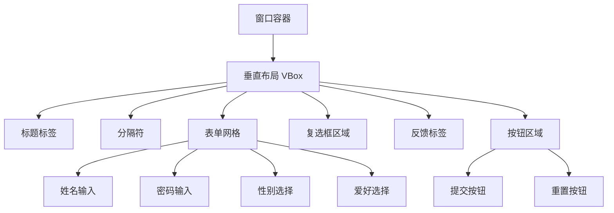
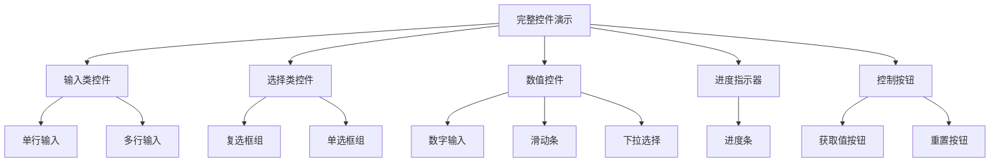
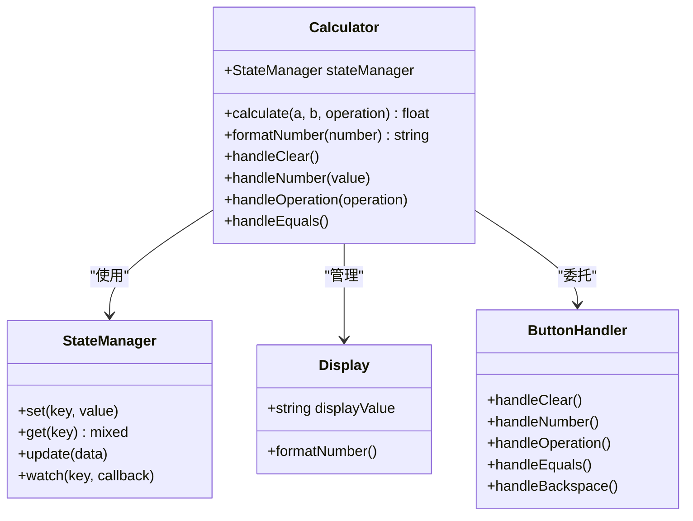
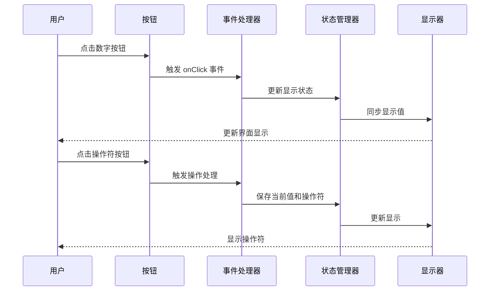
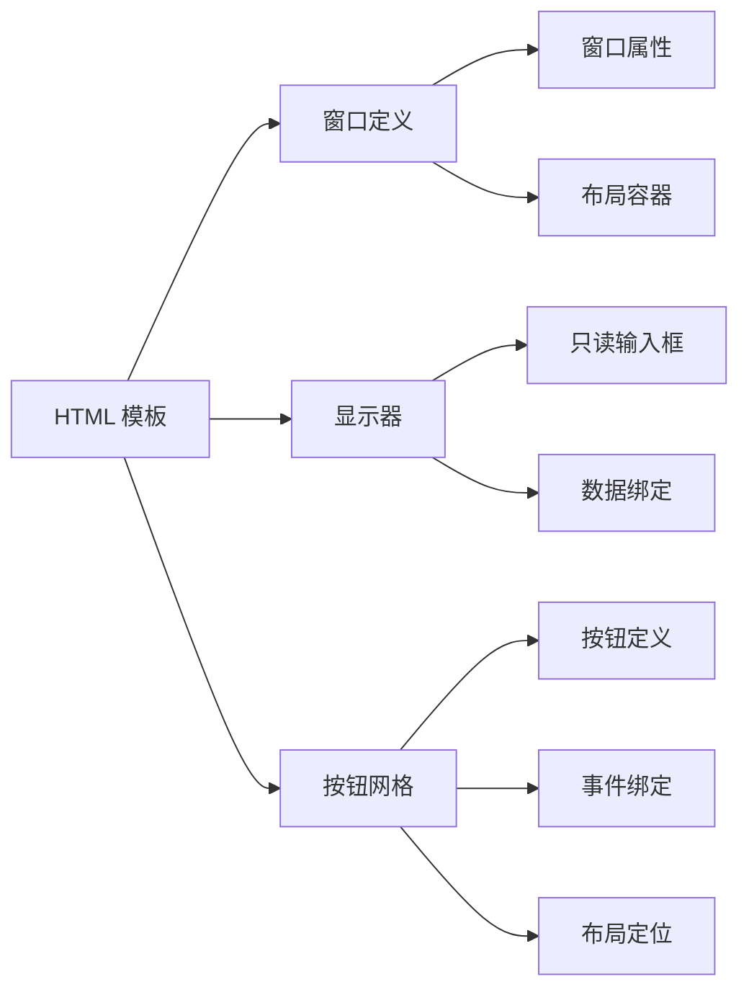
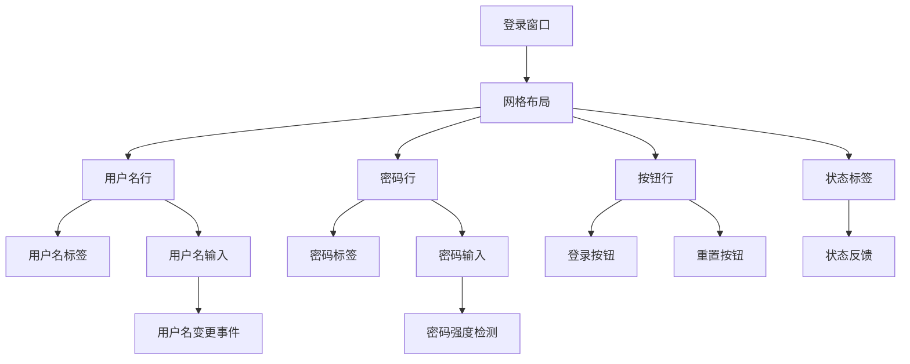
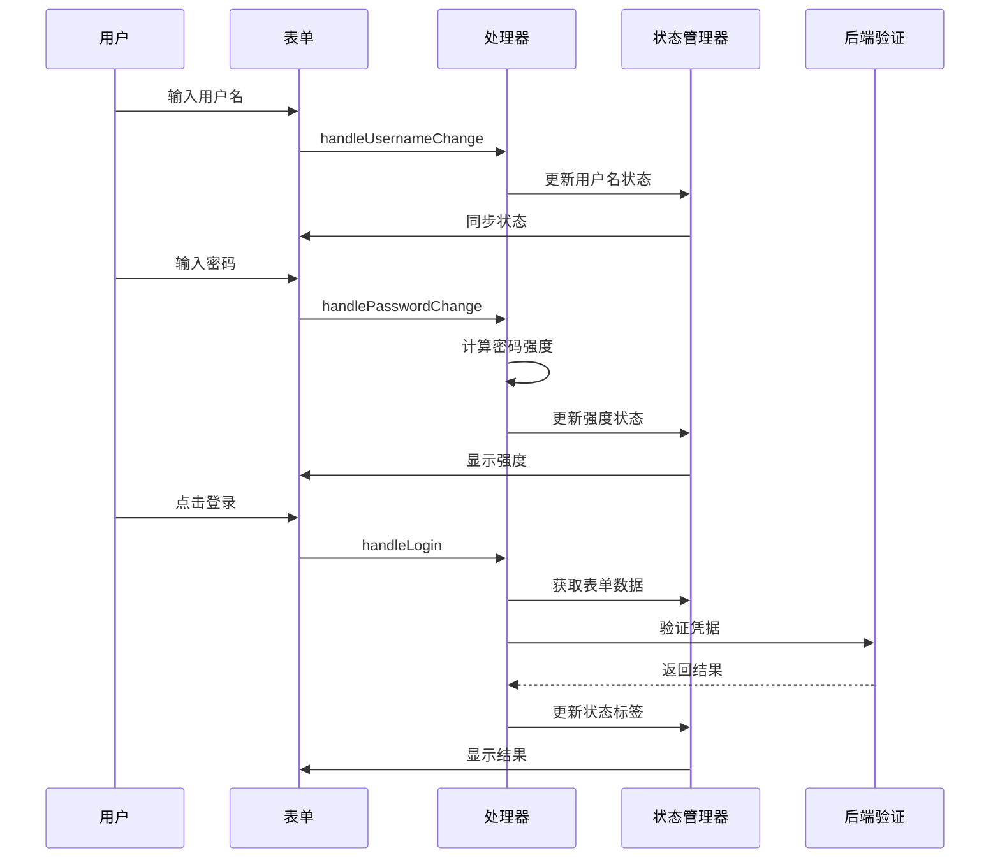

# 示例应用

<cite>
**本文档中引用的文件**
- [simple.php](file://example/simple.php)
- [full.php](file://example/full.php)
- [calculator.php](file://example/calculator.php)
- [calculator_html.php](file://example/calculator_html.php)
- [htmlLogin.php](file://example/htmlLogin.php)
- [builder_helpers_demo.php](file://example/builder_helpers_demo.php)
- [helper_shortcuts_demo.php](file://example/helper_shortcuts_demo.php)
- [calculator.ui.html](file://example/views/calculator.ui.html)
- [calculator_simple.ui.html](file://example/views/calculator_simple.ui.html)
- [full.ui.html](file://example/views/full.ui.html)
- [login.ui.html](file://example/views/login.ui.html)
</cite>

## 目录
1. [简介](#简介)
2. [基础示例：simple.php](#基础示例simplephp)
3. [完整控件演示：full.php](#完整控件演示fullphp)
4. [交互式计算器：calculator.php](#交互式计算器calculatorphp)
5. [HTML模板计算器：calculator_html.php](#html模板计算器calculator_htmlphp)
6. [HTML模板登录表单：htmlLogin.php](#html模板登录表单htmlloginphp)
7. [辅助函数演示](#辅助函数演示)
8. [运行指南](#运行指南)
9. [总结](#总结)

## 简介

libuiBuilder 提供了丰富的示例应用，展示了如何使用该库构建各种类型的桌面应用程序。这些示例涵盖了从基础控件使用到复杂交互场景的完整开发流程，为开发者提供了实用的学习资源和参考实现。

## 基础示例：simple.php

simple.php 是最基础的示例应用，展示了 libuiBuilder 的核心功能和最佳实践。

### 应用特点

- **完整的表单控件集合**：包含输入框、密码框、下拉选择、复选框等
- **实时状态管理**：使用 StateManager 进行组件间的数据同步
- **事件驱动架构**：通过回调函数处理用户交互
- **表单验证**：内置输入验证和反馈机制

### 核心功能模块



**图表来源**
- [simple.php](file://example/simple.php#L11-L142)

### 关键特性

1. **动态欢迎消息**：当用户输入姓名时，自动更新欢迎标签
2. **密码强度检测**：实时计算并显示密码强度
3. **表单验证**：确保必填字段不为空
4. **条件控制**：根据用户协议同意状态启用/禁用提交按钮

### 事件处理机制

- **输入监听**：使用 `onChange` 回调处理输入变化
- **提交验证**：在提交前进行完整性检查
- **状态同步**：通过 StateManager 维护组件状态

**章节来源**
- [simple.php](file://example/simple.php#L1-L142)

## 完整控件演示：full.php

full.php 展示了 libuiBuilder 支持的所有控件类型和布局方式，是学习控件使用的最佳参考。

### 控件分类展示



**图表来源**
- [full.php](file://example/full.php#L14-L180)

### 功能特性

1. **全面的控件覆盖**：展示所有可用的 UI 组件
2. **状态获取演示**：演示如何获取所有控件的状态
3. **批量重置功能**：一键重置所有控件到初始状态
4. **实时数据绑定**：组件状态与程序状态同步

### 使用场景

- **控件学习**：了解每个控件的特性和用法
- **布局测试**：验证不同布局组合的效果
- **功能验证**：测试状态管理和事件处理

**章节来源**
- [full.php](file://example/full.php#L1-L180)

## 交互式计算器：calculator.php

calculator.php 展示了如何构建一个功能完整的交互式计算器，重点在于状态管理和复杂事件逻辑处理。

### 计算器架构



**图表来源**
- [calculator.php](file://example/calculator.php#L12-L238)

### 核心算法

计算器实现了标准的逆波兰表达式计算逻辑：

1. **状态管理**：
   - `display`: 当前显示值
   - `previousValue`: 上一个操作数
   - `operation`: 当前操作符
   - `waitingForNewValue`: 是否等待新值

2. **数学运算**：
   - 支持加减乘除四种基本运算
   - 处理除零错误
   - 支持小数点处理

3. **状态转换**：
   - 数字输入 → 更新显示
   - 操作符输入 → 保存当前值并设置操作符
   - 等号输入 → 执行计算并显示结果

### 事件处理流程



**图表来源**
- [calculator.php](file://example/calculator.php#L98-L208)

### 特殊功能

1. **格式化显示**：自动处理科学计数法和小数精度
2. **撤销功能**：支持退格删除操作
3. **清除功能**：支持清除当前输入和全部清除
4. **状态持久化**：通过 StateManager 保持计算状态

**章节来源**
- [calculator.php](file://example/calculator.php#L1-L238)

## HTML模板计算器：calculator_html.php

calculator_html.php 展示了如何使用 HTML 模板和事件处理器构建计算器应用，体现了 libuiBuilder 的灵活性。

### HTML 模板架构



**图表来源**
- [calculator.ui.html](file://example/views/calculator.ui.html#L1-L54)

### 事件处理器映射

HTML 模板中的每个按钮都对应一个 PHP 事件处理器：

| HTML 按钮 | PHP 处理器 | 功能描述 |
|-----------|------------|----------|
| `handleClear` | 清除所有状态 | 重置计算器到初始状态 |
| `handleClearEntry` | 清除当前输入 | 仅清除当前显示值 |
| `handleBackspace` | 删除最后一位 | 支持退格操作 |
| `handleNumber` | 数字输入处理 | 处理0-9数字按键 |
| `handleDecimal` | 小数点处理 | 添加小数点 |
| `handleOperation` | 操作符处理 | 处理+、-、×、÷ |
| `handleEquals` | 等号处理 | 执行计算并显示结果 |

### 数据绑定机制

HTML 模板使用 `bind` 属性将 DOM 元素与状态管理器关联：

```html
<input id="display" bind="display" text="0" />
```

这种绑定方式允许：
- 自动同步状态变化到界面
- 通过 JavaScript 直接修改状态
- 实现响应式的用户界面

### 与纯 PHP 版本的差异

1. **分离关注点**：HTML 负责结构，PHP 负责逻辑
2. **更好的可维护性**：模板易于修改和扩展
3. **更灵活的布局**：HTML 提供更丰富的布局选项
4. **更好的团队协作**：前端和后端开发可以并行工作

**章节来源**
- [calculator_html.php](file://example/calculator_html.php#L1-L142)
- [calculator.ui.html](file://example/views/calculator.ui.html#L1-L54)

## HTML模板登录表单：htmlLogin.php

htmlLogin.php 展示了如何使用 HTML 模板构建表单应用，重点在于数据绑定和事件处理。

### 登录表单架构



**图表来源**
- [login.ui.html](file://example/views/login.ui.html#L1-L49)

### 事件处理流程



**图表来源**
- [htmlLogin.php](file://example/htmlLogin.php#L17-L96)

### 数据绑定特性

1. **双向绑定**：HTML 元素与状态管理器自动同步
2. **实时验证**：输入时即时验证和反馈
3. **状态共享**：组件间通过状态管理器通信
4. **事件解耦**：HTML 事件与业务逻辑分离

### 安全考虑

- **密码保护**：使用密码输入框隐藏敏感信息
- **输入验证**：客户端验证防止无效输入
- **状态隔离**：敏感数据通过状态管理器安全存储

**章节来源**
- [htmlLogin.php](file://example/htmlLogin.php#L1-L96)
- [login.ui.html](file://example/views/login.ui.html#L1-L49)

## 辅助函数演示

libuiBuilder 提供了两种辅助函数系统，大大简化了代码编写。

### Builder 辅助函数

builder_helpers_demo.php 展示了新的链式调用方式：

#### 主要特性

1. **链式调用**：流畅的代码风格
2. **方法命名**：直观的方法名称
3. **类型安全**：编译时类型检查
4. **IDE 支持**：完整的智能提示

#### 使用示例

```php
// 传统方式
$button = Builder::button()
    ->text('点击我')
    ->id('myButton')
    ->onClick(function() {
        echo "按钮被点击!";
    });

// 新方式
$button = Builder::create()
    ->newButton()
    ->config('text', '点击我')
    ->withId('myButton')
    ->addEvent('click', function() {
        echo "按钮被点击!";
    })
    ->get();
```

### 快捷函数系统

helper_shortcuts_demo.php 展示了全局快捷函数：

#### 语法简化

| 传统方式 | 快捷方式 | 代码行数节省 |
|----------|----------|--------------|
| `Builder::window()` | `window()` | 55% |
| `Builder::entry()` | `input()` | 55% |
| `Builder::button()` | `button()` | 55% |
| `Builder::grid()` | `grid()` | 55% |

#### 实际应用效果

```php
// 传统方式
$window = Builder::window(['title' => '登录'])
    ->size(400, 300)
    ->contains([
        Builder::vbox()->contains([
            Builder::grid()->form([
                [
                    'label' => Builder::label()->text('用户名:'),
                    'control' => Builder::entry()
                        ->id('username')
                        ->bind('username')
                        ->placeholder('请输入用户名')
                ],
                [
                    'label' => Builder::label()->text('密码:'),
                    'control' => Builder::passwordEntry()
                        ->id('password')
                        ->bind('password')
                        ->placeholder('请输入密码')
                ]
            ])
        ])
    ]);

// 快捷方式
$window = window(['title' => '登录'])
    ->size(400, 300)
    ->contains([
        vbox()->contains([
            grid()->form([
                input('用户名', 'username', placeholder: '请输入用户名'),
                input('密码', 'password', type: 'password', placeholder: '请输入密码')
            ])
        ])
    ]);
```

**章节来源**
- [builder_helpers_demo.php](file://example/builder_helpers_demo.php#L1-L140)
- [helper_shortcuts_demo.php](file://example/helper_shortcuts_demo.php#L1-L152)

## 运行指南

### 环境要求

- PHP 8.0 或更高版本
- libui 扩展
- Composer 包管理器

### 运行步骤

1. **安装依赖**：
   ```bash
   composer install
   ```

2. **运行示例**：
   ```bash
   php example/simple.php          # 基础示例
   php example/full.php           # 完整控件演示
   php example/calculator.php     # 交互式计算器
   php example/calculator_html.php # HTML模板计算器
   php example/htmlLogin.php      # HTML模板登录表单
   ```

### 调试技巧

1. **状态监控**：使用 `StateManager::instance()->dump()` 查看状态
2. **事件调试**：在事件处理器中添加 `var_dump()` 输出
3. **布局调试**：临时添加边框或背景色查看布局效果

## 总结

libuiBuilder 的示例应用展现了现代桌面应用开发的最佳实践：

### 学习路径建议

1. **初学者**：从 simple.php 开始，理解基础概念
2. **进阶者**：研究 full.php，掌握所有控件使用
3. **高级用户**：分析 calculator.php 和 calculator_html.php，学习复杂状态管理
4. **专业开发**：参考 htmlLogin.php 和辅助函数，提升开发效率

### 设计原则

1. **模块化**：每个示例专注于特定功能领域
2. **渐进式**：从简单到复杂，便于学习
3. **实用性**：每个示例都有明确的应用场景
4. **可扩展性**：代码结构支持功能扩展

### 最佳实践

- 使用状态管理器统一管理应用状态
- 采用事件驱动架构处理用户交互
- 实现数据绑定提高开发效率
- 保持代码清晰和可维护性

通过深入学习这些示例，开发者可以快速掌握 libuiBuilder 的核心功能，并能够构建出功能丰富、用户体验良好的桌面应用程序。