# 简单示例

<cite>
**本文档中引用的文件**
- [simple.php](file://example/simple.php)
- [WindowBuilder.php](file://src/Components/WindowBuilder.php)
- [ButtonBuilder.php](file://src/Components/ButtonBuilder.php)
- [LabelBuilder.php](file://src/Components/LabelBuilder.php)
- [BoxBuilder.php](file://src/Components/BoxBuilder.php)
- [GridBuilder.php](file://src/Components/GridBuilder.php)
- [EntryBuilder.php](file://src/Components/EntryBuilder.php)
- [CheckboxBuilder.php](file://src/Components/CheckboxBuilder.php)
- [ComboboxBuilder.php](file://src/Components/ComboboxBuilder.php)
- [ComponentBuilder.php](file://src/Components/ComponentBuilder.php)
- [helper.php](file://src/helper.php)
</cite>

## 目录
1. [简介](#简介)
2. [项目结构概览](#项目结构概览)
3. [核心组件分析](#核心组件分析)
4. [架构概览](#架构概览)
5. [详细组件分析](#详细组件分析)
6. [链式调用语法详解](#链式调用语法详解)
7. [事件绑定机制](#事件绑定机制)
8. [UI布局结构](#ui布局结构)
9. [运行步骤说明](#运行步骤说明)
10. [程序入口点分析](#程序入口点分析)
11. [最佳实践建议](#最佳实践建议)
12. [总结](#总结)

## 简介

simple.php是libuiBuilder框架的第一个实践示例，展示了如何使用Builder API创建一个包含基础控件的简单窗口应用程序。这个示例包含了按钮、标签、输入框、复选框、组合框等多种UI控件，演示了链式调用语法、事件绑定机制和基本的UI布局结构。

通过这个示例，开发者可以学习到：
- libuiBuilder的基本使用模式
- Builder API的链式调用语法
- 组件的事件处理机制
- 不同布局容器的使用方法
- 状态管理和组件间通信

## 项目结构概览

libuiBuilder项目采用模块化的架构设计，主要分为以下几个部分：

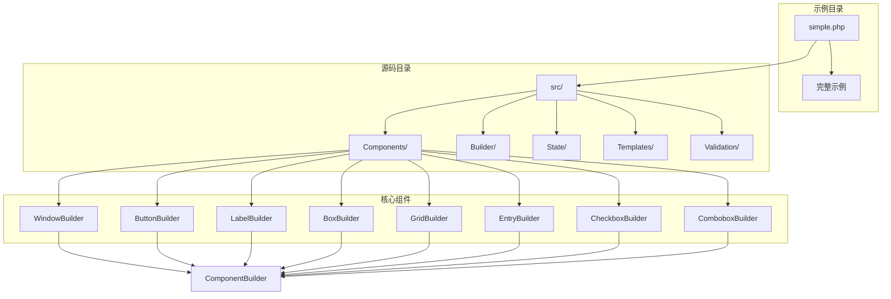

**图表来源**
- [simple.php](file://example/simple.php#L1-L142)
- [ComponentBuilder.php](file://src/Components/ComponentBuilder.php#L1-L234)

**章节来源**
- [simple.php](file://example/simple.php#L1-L142)

## 核心组件分析

libuiBuilder的核心架构基于ComponentBuilder抽象类，所有具体的UI组件都继承自这个基类。这种设计提供了统一的接口和功能，包括：

### 组件生命周期管理
- **配置管理**：通过`getDefaultConfig()`方法定义默认配置
- **原生控件创建**：通过`createNativeControl()`方法创建底层UI控件
- **配置应用**：通过`applyConfig()`方法将配置应用到原生控件
- **子组件构建**：通过`buildChildren()`方法处理嵌套组件

### 事件系统
- **事件触发**：通过`emit()`方法触发组件事件
- **事件监听**：通过`on()`方法添加事件处理器
- **状态绑定**：自动同步组件状态与状态管理器

### 状态管理
- **组件引用**：通过`id()`方法注册组件引用
- **状态绑定**：通过`bind()`方法绑定到状态管理器
- **值管理**：通过`getValue()`和`setValue()`方法管理组件值

**章节来源**
- [ComponentBuilder.php](file://src/Components/ComponentBuilder.php#L1-L234)

## 架构概览

simple.php示例展示了典型的libuiBuilder应用程序架构：

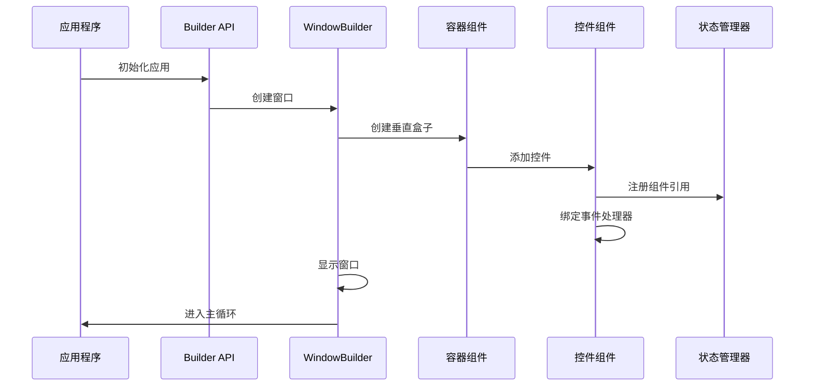

**图表来源**
- [simple.php](file://example/simple.php#L9-L142)
- [WindowBuilder.php](file://src/Components/WindowBuilder.php#L73-L78)

## 详细组件分析

### 窗口组件 (WindowBuilder)

WindowBuilder是应用程序的根组件，负责创建和管理主窗口：

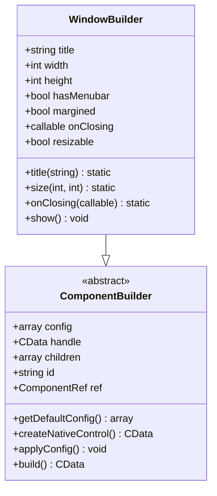

**图表来源**
- [WindowBuilder.php](file://src/Components/WindowBuilder.php#L11-L96)
- [ComponentBuilder.php](file://src/Components/ComponentBuilder.php#L11-L234)

#### 主要特性：
- **链式配置**：支持`.title()`、`.size()`、`.onClosing()`等链式方法
- **自动布局**：根据子组件数量自动决定布局方式
- **事件处理**：支持窗口关闭事件的自定义处理
- **显示控制**：提供`.show()`方法启动应用程序

### 按钮组件 (ButtonBuilder)

ButtonBuilder实现了交互式按钮功能：

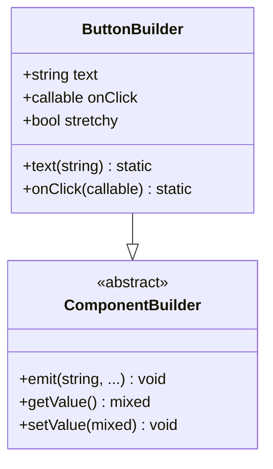

**图表来源**
- [ButtonBuilder.php](file://src/Components/ButtonBuilder.php#L9-L48)
- [ComponentBuilder.php](file://src/Components/ComponentBuilder.php#L11-L234)

#### 事件处理机制：
- **点击事件**：通过`Button::onClicked()`绑定原生点击事件
- **回调执行**：在事件触发时调用用户定义的回调函数
- **状态传递**：向回调函数传递组件引用和状态管理器

### 标签组件 (LabelBuilder)

LabelBuilder用于显示静态文本内容：

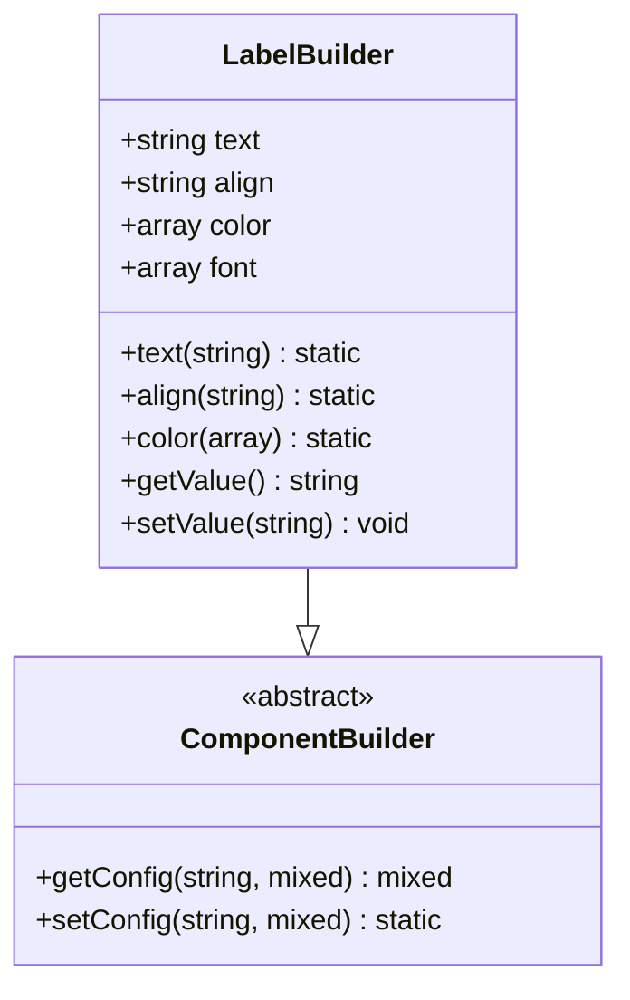

**图表来源**
- [LabelBuilder.php](file://src/Components/LabelBuilder.php#L9-L62)
- [ComponentBuilder.php](file://src/Components/ComponentBuilder.php#L11-L234)

#### 动态文本更新：
- **实时更新**：通过`setValue()`方法动态修改标签文本
- **状态同步**：支持与状态管理器的双向绑定
- **样式配置**：支持文本对齐、颜色和字体设置

### 输入框组件 (EntryBuilder)

EntryBuilder提供了文本输入功能：

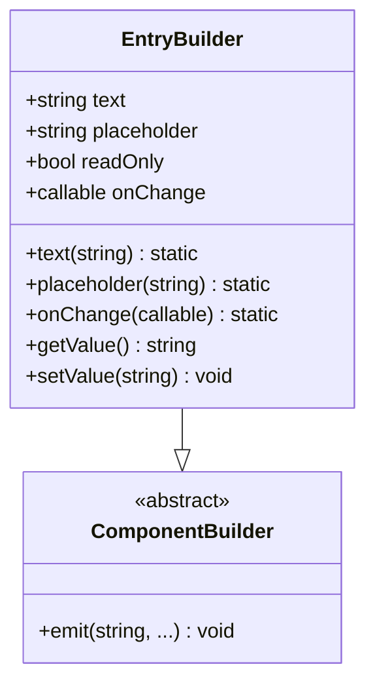

**图表来源**
- [EntryBuilder.php](file://src/Components/EntryBuilder.php#L9-L80)
- [ComponentBuilder.php](file://src/Components/ComponentBuilder.php#L11-L234)

#### 输入验证机制：
- **实时监听**：通过`Entry::onChanged()`监听输入变化
- **验证回调**：支持自定义输入验证逻辑
- **状态更新**：自动更新组件状态和绑定的数据

### 复选框组件 (CheckboxBuilder)

CheckboxBuilder实现了布尔值选择功能：

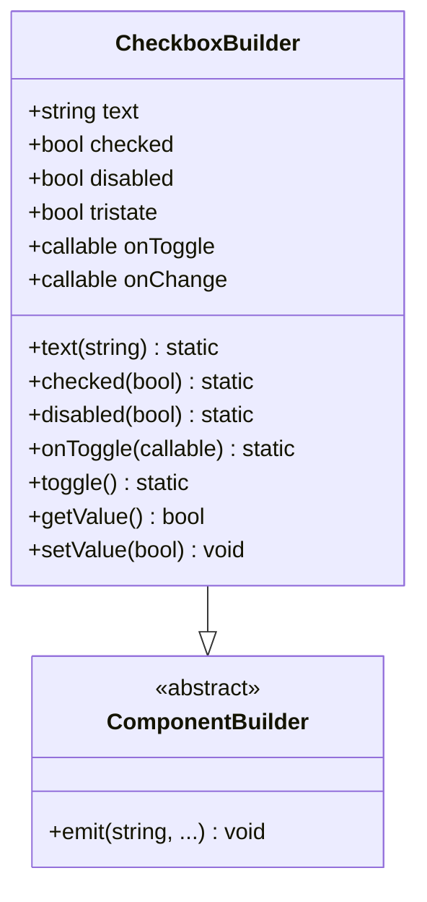

**图表来源**
- [CheckboxBuilder.php](file://src/Components/CheckboxBuilder.php#L9-L97)
- [ComponentBuilder.php](file://src/Components/ComponentBuilder.php#L11-L234)

#### 状态管理：
- **三态支持**：支持`true`、`false`和`null`三种状态
- **切换操作**：提供`toggle()`方法进行状态切换
- **事件通知**：支持`onToggle`和`onChange`事件回调

### 组合框组件 (ComboboxBuilder)

ComboboxBuilder提供了选择列表功能：

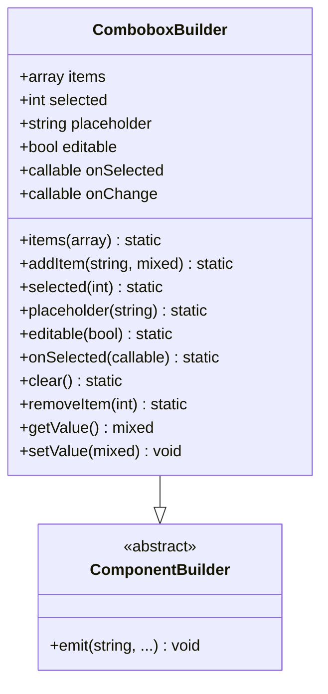

**图表来源**
- [ComboboxBuilder.php](file://src/Components/ComboboxBuilder.php#L10-L258)
- [ComponentBuilder.php](file://src/Components/ComponentBuilder.php#L11-L234)

#### 编辑功能：
- **可编辑组合框**：支持用户输入自定义值
- **选项管理**：提供添加、删除和清空选项的功能
- **选择跟踪**：自动跟踪当前选中的选项

**章节来源**
- [WindowBuilder.php](file://src/Components/WindowBuilder.php#L1-L96)
- [ButtonBuilder.php](file://src/Components/ButtonBuilder.php#L1-L48)
- [LabelBuilder.php](file://src/Components/LabelBuilder.php#L1-L62)
- [EntryBuilder.php](file://src/Components/EntryBuilder.php#L1-L80)
- [CheckboxBuilder.php](file://src/Components/CheckboxBuilder.php#L1-L97)
- [ComboboxBuilder.php](file://src/Components/ComboboxBuilder.php#L1-L258)

## 链式调用语法详解

libuiBuilder采用流畅接口（Fluent Interface）设计，所有组件都支持链式调用语法。这种设计使得代码更加简洁和易读。

### 基本语法模式

```mermaid
flowchart TD
A[Builder::component()] --> B[链式方法调用]
B --> C[配置属性]
B --> D[绑定事件]
B --> E[设置ID]
B --> F[添加子组件]
C --> G[.property(value)]
D --> H[.onEvent(callback)]
E --> I[.id('identifier')]
F --> J[.contains([...])]
```

**图表来源**
- [simple.php](file://example/simple.php#L11-L140)

### 具体应用示例

#### 窗口创建
```php
Builder::window()
    ->title('完整的基础控件示例')
    ->size(700, 500)
    ->contains([...])
```

#### 按钮配置
```php
Builder::button()
    ->text('提交')
    ->id('submitBtn')
    ->onClick(function($button) { /* 回调逻辑 */ })
```

#### 输入框验证
```php
Builder::entry()
    ->id('nameEntry')
    ->placeholder('请输入您的姓名')
    ->maxLength(20)
    ->validation(fn($value) => !empty(trim($value)))
    ->onChange(function($value, $component) { /* 实时反馈 */ })
```

### 方法重载机制

ComponentBuilder类实现了魔术方法`__call()`，允许动态调用配置方法：

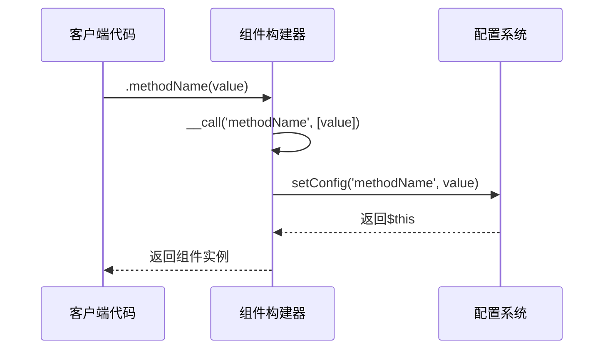

**图表来源**
- [ComponentBuilder.php](file://src/Components/ComponentBuilder.php#L114-L119)

**章节来源**
- [simple.php](file://example/simple.php#L11-L140)
- [ComponentBuilder.php](file://src/Components/ComponentBuilder.php#L114-L119)

## 事件绑定机制

libuiBuilder提供了强大的事件绑定机制，支持多种类型的事件处理。

### 事件类型分类

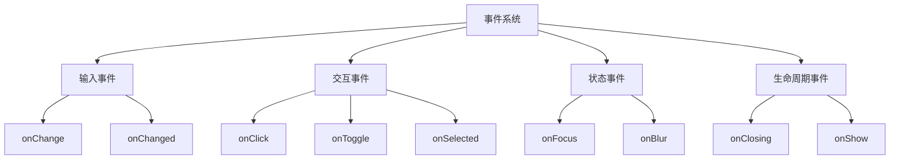

### 事件处理流程

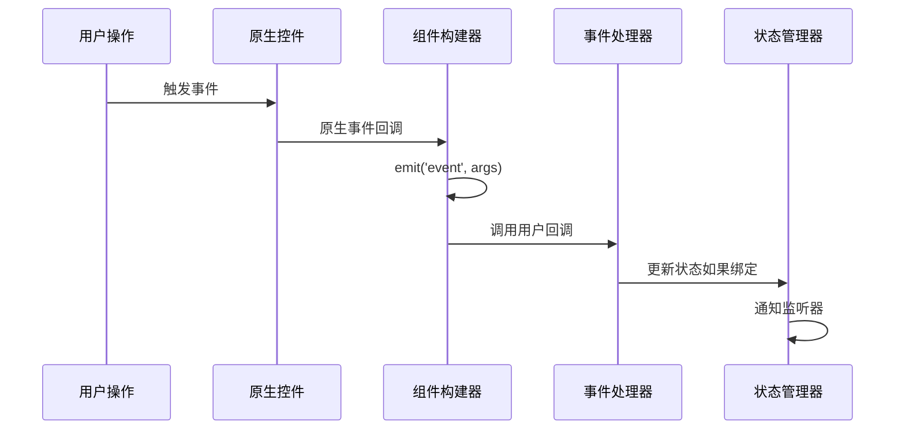

**图表来源**
- [ButtonBuilder.php](file://src/Components/ButtonBuilder.php#L27-L35)
- [EntryBuilder.php](file://src/Components/EntryBuilder.php#L38-L49)
- [CheckboxBuilder.php](file://src/Components/CheckboxBuilder.php#L38-L53)

### 具体事件应用

#### 按钮点击事件
```php
Builder::button()
    ->text('提交')
    ->onClick(function($button) {
        // 收集表单数据
        $name = StateManager::instance()->getComponent('nameEntry')?->getValue();
        // 验证和处理逻辑
    })
```

#### 输入框变更事件
```php
Builder::entry()
    ->id('nameEntry')
    ->onChange(function($value, $component) {
        // 实时反馈
        $welcomeLabel = StateManager::instance()->getComponent('welcomeLabel');
        $text = empty($value) ? '请输入姓名' : "您好, {$value}!";
        $welcomeLabel->setValue($text);
    })
```

#### 复选框状态事件
```php
Builder::checkbox()
    ->id('agreeCheckbox')
    ->onToggle(function($checked, $component) {
        $submitBtn = StateManager::instance()->getComponent('submitBtn');
        $submitBtn->getComponent()->setConfig('disabled', !$checked);
    })
```

### 状态管理集成

事件处理与状态管理系统深度集成：

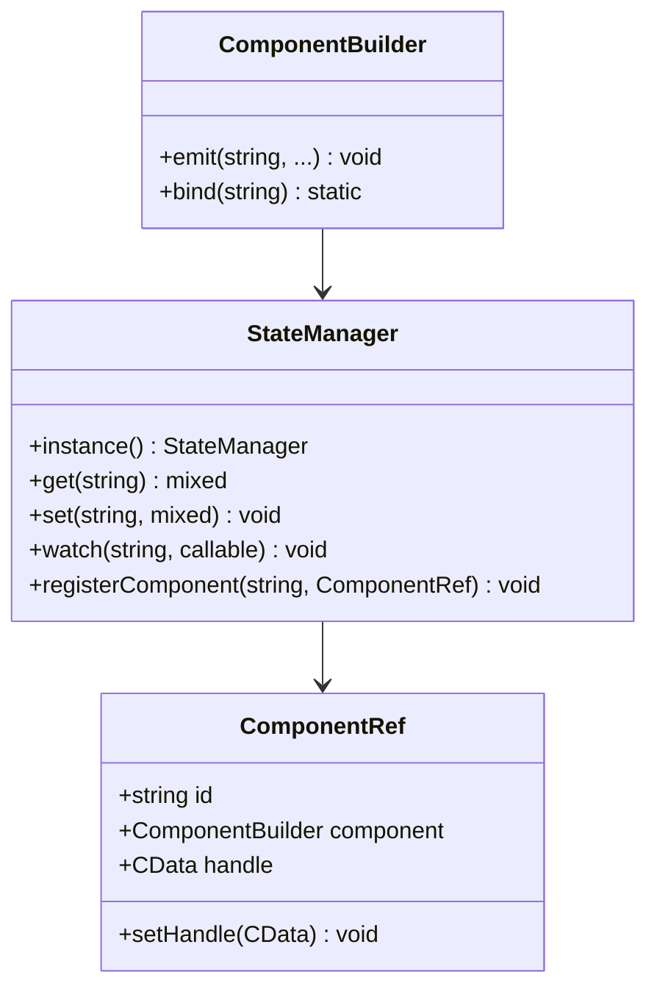

**图表来源**
- [ComponentBuilder.php](file://src/Components/ComponentBuilder.php#L160-L174)

**章节来源**
- [simple.php](file://example/simple.php#L30-L36)
- [simple.php](file://example/simple.php#L44-L49)
- [simple.php](file://example/simple.php#L76-L82)
- [simple.php](file://example/simple.php#L102-L124)

## UI布局结构

libuiBuilder提供了多种布局容器来组织UI组件。

### 布局容器类型

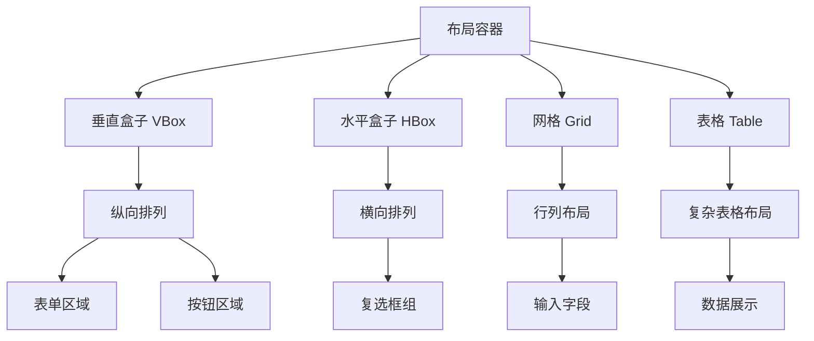

### 布局层次结构

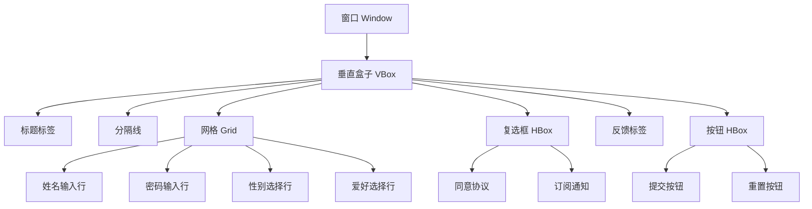

**图表来源**
- [simple.php](file://example/simple.php#L11-L140)

### 具体布局实现

#### 窗口容器
```php
Builder::window()
    ->title('完整的基础控件示例')
    ->size(700, 500)
    ->contains([
        Builder::vbox()->contains([...])
    ])
```

#### 表单网格布局
```php
Builder::grid()->form([
    [
        'label' => Builder::label()->text('姓名:'),
        'control' => Builder::entry()
            ->id('nameEntry')
            ->placeholder('请输入您的姓名')
            ->maxLength(20)
            ->validation(fn($value) => !empty(trim($value)))
            ->onChange(function($value, $component) { /* 实时反馈 */ })
    ],
    // 更多字段...
])
```

#### 复选框水平布局
```php
Builder::hbox()->contains([
    Builder::checkbox()
        ->text('同意用户协议')
        ->id('agreeCheckbox')
        ->onToggle(function($checked, $component) { /* 启用/禁用按钮 */ }),
    Builder::checkbox()
        ->text('订阅邮件通知')
        ->checked(true),
])
```

### 布局容器特性

#### BoxBuilder（盒子容器）
- **方向控制**：支持垂直(`vertical`)和水平(`horizontal`)布局
- **间距管理**：通过`padded()`方法控制内边距
- **弹性布局**：通过`stretchy()`方法控制子组件的拉伸行为

#### GridBuilder（网格容器）
- **行列定位**：通过`place()`方法精确控制组件位置
- **跨行列**：支持组件跨越多行或多列
- **自动布局**：提供`form()`方法快速创建表单布局

**章节来源**
- [simple.php](file://example/simple.php#L15-L140)
- [BoxBuilder.php](file://src/Components/BoxBuilder.php#L1-L64)
- [GridBuilder.php](file://src/Components/GridBuilder.php#L1-L150)

## 运行步骤说明

### 环境准备

1. **安装PHP环境**
   - 确保系统已安装PHP 8.0或更高版本
   - 安装必要的PHP扩展（FFI扩展）

2. **安装libui库**
   - 下载并编译libui库
   - 确保库文件路径正确配置

3. **安装Composer依赖**
   ```bash
   cd /path/to/libuiBuilder
   composer install
   ```

### 运行命令

```bash
cd /path/to/libuiBuilder/example
php simple.php
```

### 预期输出

运行后将显示一个包含以下组件的窗口应用程序：
- 标题为"完整的基础控件示例"的窗口
- 包含姓名、密码、性别、爱好等输入字段的表单
- 用户协议同意复选框
- 提交和重置按钮
- 实时反馈标签

### 调试技巧

1. **查看错误日志**
   - 检查PHP错误报告
   - 查看系统日志文件

2. **组件调试**
   - 使用`StateManager::instance()->dump()`查看组件状态
   - 检查组件ID是否正确注册

3. **事件调试**
   - 在事件回调中添加`echo`语句
   - 使用`var_dump()`输出变量值

## 程序入口点分析

### 应用初始化流程

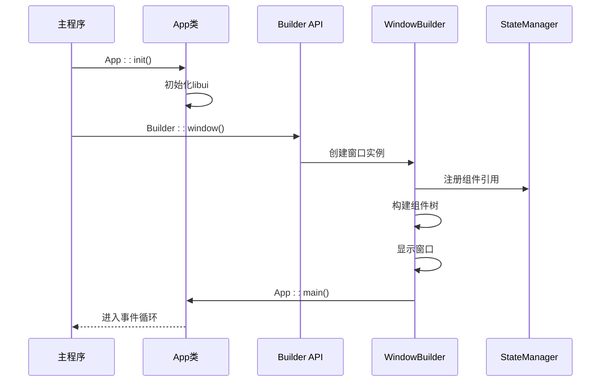

**图表来源**
- [simple.php](file://example/simple.php#L9-L142)

### 关键代码段分析

#### 应用初始化
```php
App::init();  // 初始化libui环境
```

#### 组件树构建
```php
$app = Builder::window()
    ->title('完整的基础控件示例')
    ->size(700, 500)
    ->contains([...]);  // 构建完整的组件树
```

#### 主循环启动
```php
$app->show();  // 显示窗口并启动事件循环
```

### 生命周期管理

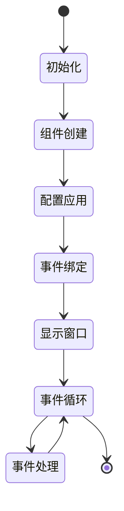

**章节来源**
- [simple.php](file://example/simple.php#L9-L142)
- [WindowBuilder.php](file://src/Components/WindowBuilder.php#L73-L78)

## 最佳实践建议

### 代码组织

1. **模块化设计**
   - 将不同功能的组件分离到独立的函数中
   - 使用辅助函数简化重复代码

2. **命名规范**
   - 组件ID使用有意义的名称
   - 事件处理函数采用描述性命名

3. **错误处理**
   - 为关键操作添加错误检查
   - 提供友好的用户反馈

### 性能优化

1. **延迟加载**
   - 对于复杂的界面，考虑延迟加载非关键组件
   - 使用条件渲染减少不必要的组件创建

2. **内存管理**
   - 及时清理不需要的组件引用
   - 避免循环引用导致的内存泄漏

3. **事件优化**
   - 对频繁触发的事件使用防抖或节流
   - 减少事件处理器中的计算量

### 用户体验

1. **响应式设计**
   - 考虑不同屏幕尺寸的适配
   - 提供适当的默认大小和布局

2. **无障碍支持**
   - 为重要组件提供访问键
   - 确保键盘导航的可用性

3. **视觉反馈**
   - 为用户操作提供即时反馈
   - 使用适当的视觉指示器

### 维护性考虑

1. **文档注释**
   - 为复杂组件添加详细注释
   - 记录重要的业务逻辑

2. **测试策略**
   - 为关键功能编写单元测试
   - 进行用户界面的自动化测试

3. **版本兼容**
   - 注意API变更的影响
   - 保持向后兼容性

## 总结

simple.php示例全面展示了libuiBuilder框架的核心功能和使用模式：

### 核心特性回顾

1. **Builder API设计**：通过链式调用语法简化UI组件创建
2. **事件驱动架构**：支持丰富的事件处理机制
3. **状态管理系统**：提供组件间通信和状态同步
4. **灵活布局系统**：支持多种布局容器和定位方式
5. **类型安全保证**：通过类型提示确保代码质量

### 学习要点

- **理解组件层次结构**：从Window到各种控件的继承关系
- **掌握链式调用语法**：这是libuiBuilder的主要编程风格
- **熟悉事件绑定机制**：理解如何处理用户交互
- **学会状态管理**：掌握组件间通信的最佳实践
- **了解布局原理**：合理组织UI组件的层次结构

### 进阶方向

完成这个示例后，开发者可以：
- 尝试更复杂的布局组合
- 实现自定义组件
- 探索高级事件处理
- 学习性能优化技巧
- 研究与其他框架的集成

这个示例为初学者提供了一个良好的起点，展示了libuiBuilder框架的强大功能和优雅设计。通过深入理解和实践这些概念，开发者能够构建出功能丰富、用户体验优秀的桌面应用程序。