# 计算器示例

<cite>
**本文档中引用的文件**
- [calculator.php](file://example/calculator.php)
- [calculator_html.php](file://example/calculator_html.php)
- [calculator_html_simple.php](file://example/calculator_html_simple.php)
- [calculator.ui.html](file://example/views/calculator.ui.html)
- [README_CALCULATOR.md](file://example/README_CALCULATOR.md)
- [run_calculator.php](file://run_calculator.php)
- [StateManager.php](file://src/State/StateManager.php)
- [ComponentBuilder.php](file://src/ComponentBuilder.php)
</cite>

## 目录
1. [简介](#简介)
2. [项目结构](#项目结构)
3. [核心组件](#核心组件)
4. [架构概览](#架构概览)
5. [详细组件分析](#详细组件分析)
6. [状态管理系统](#状态管理系统)
7. [事件处理机制](#事件处理机制)
8. [两种实现方式对比](#两种实现方式对比)
9. [运行指南](#运行指南)
10. [核心算法解析](#核心算法解析)
11. [性能考虑](#性能考虑)
12. [故障排除指南](#故障排除指南)
13. [总结](#总结)

## 简介

计算器示例是libuiBuilder框架中的一个完整应用演示，展示了如何构建一个具有完整交互逻辑的复杂应用程序。该项目提供了两种不同的实现方式：基于Builder API的纯PHP实现和基于HTML模板的实现，充分体现了libuiBuilder在构建跨平台桌面应用方面的灵活性和强大功能。

该计算器应用支持基本的数学运算（加、减、乘、除）、数字输入、清除功能以及连续运算等特性，是一个学习状态驱动交互式应用设计模式的绝佳案例。

## 项目结构

计算器示例项目采用模块化结构，主要包含以下核心文件：

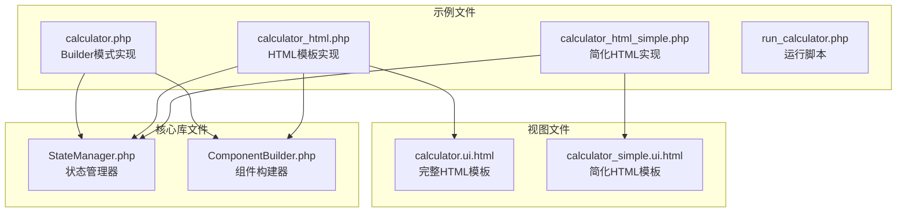

**图表来源**
- [calculator.php](file://example/calculator.php#L1-L238)
- [calculator_html.php](file://example/calculator_html.php#L1-L142)
- [StateManager.php](file://src/State/StateManager.php#L1-L91)

**章节来源**
- [README_CALCULATOR.md](file://example/README_CALCULATOR.md#L1-L199)

## 核心组件

计算器应用的核心组件包括：

### 状态管理器
负责管理计算器的所有状态变量，包括显示值、前一个操作数、当前运算符和等待新输入的状态。

### 组件构建系统
提供两种不同的界面构建方式：
- **Builder API模式**：完全使用PHP代码构建界面
- **HTML模板模式**：使用XML模板描述界面结构

### 事件处理器
处理各种用户交互事件，包括按钮点击、数字输入和运算符操作。

**章节来源**
- [calculator.php](file://example/calculator.php#L12-L17)
- [calculator_html.php](file://example/calculator_html.php#L12-L17)

## 架构概览

计算器应用采用状态驱动的架构模式，通过状态管理器协调各个组件之间的交互：

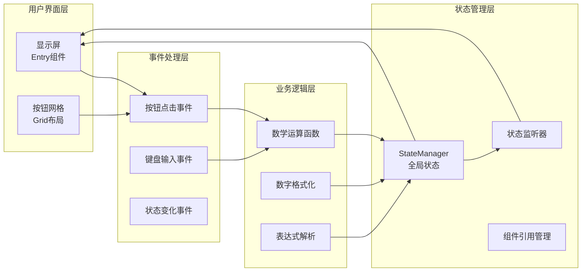

**图表来源**
- [calculator.php](file://example/calculator.php#L37-L238)
- [StateManager.php](file://src/State/StateManager.php#L8-L91)

## 详细组件分析

### Builder API模式实现

Builder API模式通过PHP代码直接构建用户界面，提供了类型安全和更好的IDE支持：

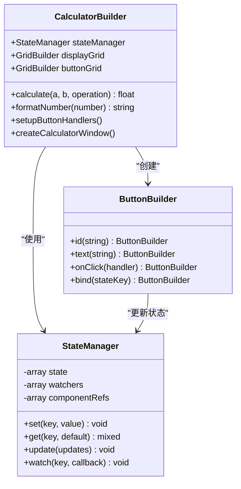

**图表来源**
- [calculator.php](file://example/calculator.php#L37-L238)
- [StateManager.php](file://src/State/StateManager.php#L8-L91)

#### 按钮事件处理机制

每个按钮都配备了专门的事件处理器，实现了复杂的交互逻辑：

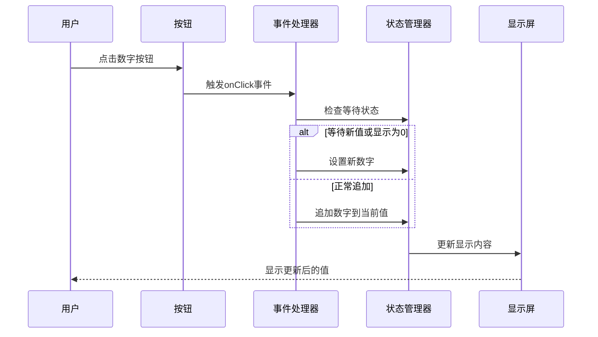

**图表来源**
- [calculator.php](file://example/calculator.php#L165-L175)

**章节来源**
- [calculator.php](file://example/calculator.php#L1-L238)

### HTML模板模式实现

HTML模板模式使用XML语法描述界面结构，通过`data-*`属性传递参数：

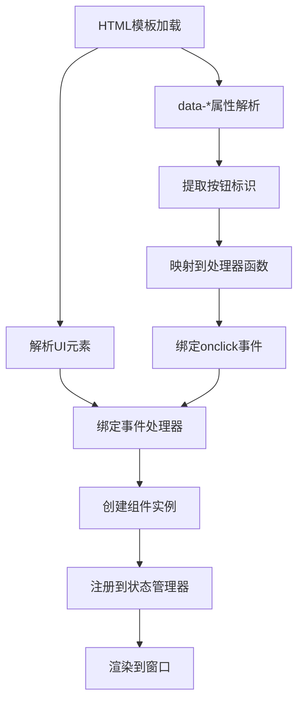

**图表来源**
- [calculator.ui.html](file://example/views/calculator.ui.html#L1-L54)
- [calculator_html.php](file://example/calculator_html.php#L140-L142)

**章节来源**
- [calculator_html.php](file://example/calculator_html.php#L1-L142)
- [calculator.ui.html](file://example/views/calculator.ui.html#L1-L54)

## 状态管理系统

状态管理系统是计算器应用的核心，负责维护所有关键状态变量：

### 核心状态变量

| 状态变量 | 类型 | 初始值 | 用途 |
|---------|------|--------|------|
| `display` | string | `'0'` | 当前显示值 |
| `previousValue` | float/null | `null` | 前一个操作数 |
| `operation` | string/null | `null` | 当前运算符 |
| `waitingForNewValue` | boolean | `false` | 是否等待新输入 |

### 状态管理器架构

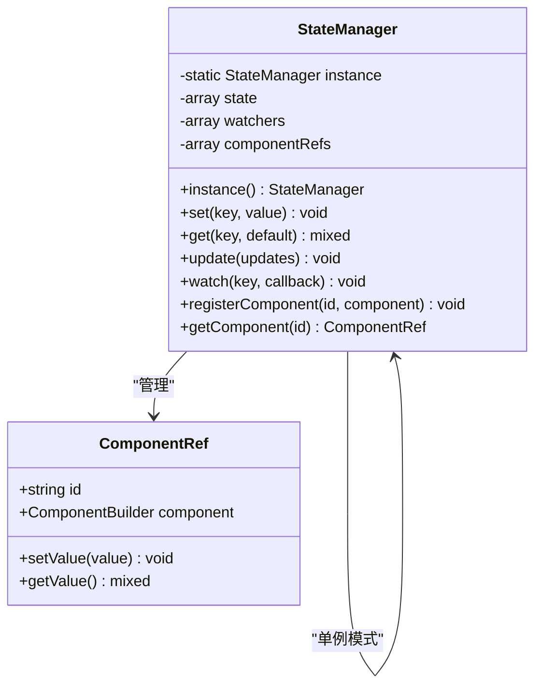

**图表来源**
- [StateManager.php](file://src/State/StateManager.php#L8-L91)

### 状态监听机制

状态管理器提供了强大的监听机制，当状态发生变化时自动通知所有监听器：

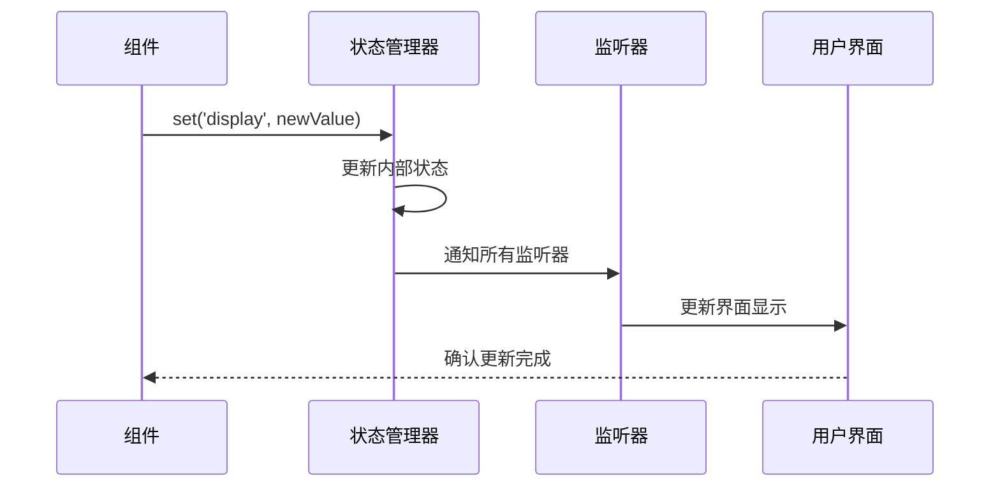

**图表来源**
- [StateManager.php](file://src/State/StateManager.php#L26-L36)

**章节来源**
- [StateManager.php](file://src/State/StateManager.php#L1-L91)

## 事件处理机制

计算器应用实现了复杂的事件处理系统，支持多种类型的事件：

### 事件类型分类

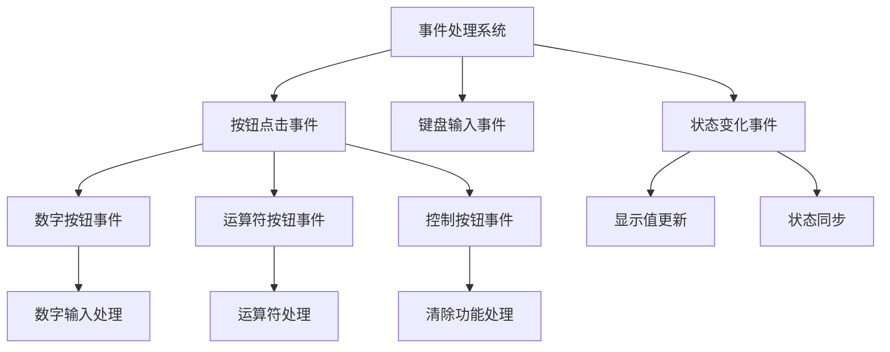

### 事件处理器实现模式

两种实现方式采用了不同的事件处理策略：

#### Builder API模式
- 每个按钮都有独立的`onClick`处理器
- 事件处理器直接嵌入到按钮创建逻辑中
- 提供更强的类型安全和IDE支持

#### HTML模板模式
- 使用统一的事件处理器映射表
- 通过`data-*`属性传递参数
- 更好的界面与逻辑分离

**章节来源**
- [calculator.php](file://example/calculator.php#L96-L209)
- [calculator_html.php](file://example/calculator_html.php#L38-L130)

## 两种实现方式对比

### Builder API模式 vs HTML模板模式

| 特性 | Builder API模式 | HTML模板模式 |
|------|----------------|--------------|
| **界面构建方式** | 纯PHP代码 | XML模板 |
| **类型安全** | 完整类型检查 | 运行时验证 |
| **IDE支持** | 优秀 | 基础支持 |
| **界面设计** | 代码编写 | 可视化设计 |
| **维护性** | 逻辑集中 | 结构清晰 |
| **扩展性** | 灵活但复杂 | 分离度高 |
| **性能** | 直接编译 | 解析开销 |

### 实现差异分析

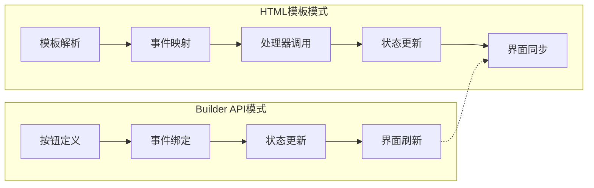

**图表来源**
- [calculator.php](file://example/calculator.php#L83-L212)
- [calculator_html.php](file://example/calculator_html.php#L38-L142)

**章节来源**
- [README_CALCULATOR.md](file://example/README_CALCULATOR.md#L57-L83)

## 运行指南

### 环境要求

- PHP 7.4 或更高版本
- libui扩展
- Composer包管理器

### 运行方式

#### 方法一：使用统一运行脚本（推荐）

```bash
# 运行Builder模式版本
php run_calculator.php builder

# 运行HTML模板版本  
php run_calculator.php html

# 同时尝试两种版本
php run_calculator.php both
```

#### 方法二：直接运行单个文件

```bash
# Builder模式
php example/calculator.php

# HTML模板模式
php example/calculator_html.php
```

### 使用说明

计算器支持以下操作：

- **数字按钮 (0-9)**：输入数字
- **运算符 (+, -, ×, ÷)**：执行数学运算
- **C**：清除所有状态
- **CE**：清除当前输入
- **⌫**：退格删除
- **.**：小数点
- **=**：计算结果

**章节来源**
- [README_CALCULATOR.md](file://example/README_CALCULATOR.md#L31-L55)
- [run_calculator.php](file://run_calculator.php#L1-L63)

## 核心算法解析

### 数学运算算法

计算器的核心运算是通过`calculate`函数实现的：

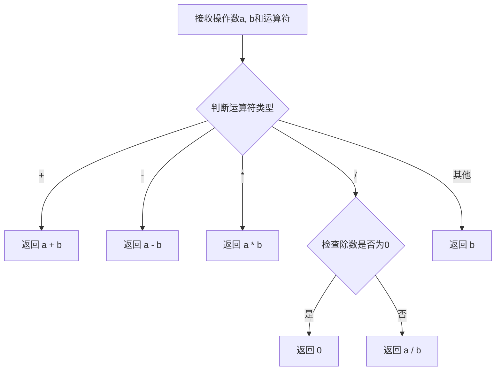

**图表来源**
- [calculator.php](file://example/calculator.php#L19-L26)

### 数字输入处理算法

数字输入处理遵循特定的规则来确保正确的用户体验：

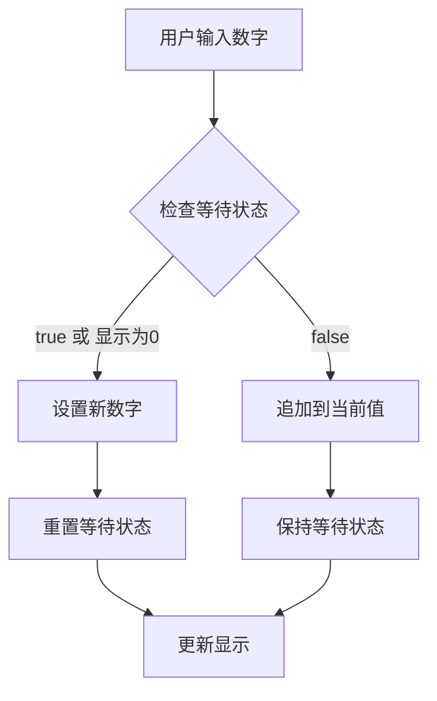

**图表来源**
- [calculator.php](file://example/calculator.php#L165-L175)

### 运算符处理算法

运算符处理实现了连续运算的功能：

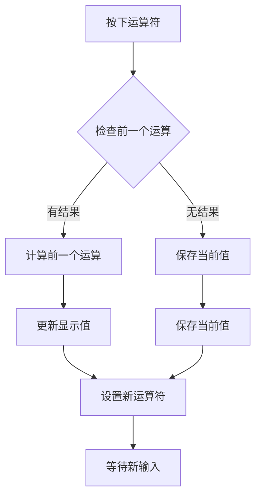

**图表来源**
- [calculator.php](file://example/calculator.php#L131-L151)

**章节来源**
- [calculator.php](file://example/calculator.php#L19-L209)

## 性能考虑

### 状态更新优化

- 使用批量更新减少不必要的界面刷新
- 状态变化监听器采用事件驱动模式
- 组件引用缓存提高查找效率

### 内存管理

- 单例模式确保状态管理器唯一性
- 及时清理不再使用的组件引用
- 避免循环引用导致的内存泄漏

### 用户体验优化

- 实时状态同步确保界面响应性
- 数字格式化避免科学计数法显示
- 错误处理防止程序崩溃

## 故障排除指南

### 常见问题及解决方案

#### 1. 界面不响应
- 检查状态管理器是否正常初始化
- 验证事件处理器是否正确绑定
- 确认组件引用是否注册成功

#### 2. 计算结果错误
- 检查运算符优先级处理
- 验证除零保护逻辑
- 确认数字格式化是否正确

#### 3. 状态不同步
- 检查状态监听器是否正常工作
- 验证组件绑定是否正确
- 确认更新时机是否合适

**章节来源**
- [StateManager.php](file://src/State/StateManager.php#L26-L36)

## 总结

计算器示例展示了libuiBuilder框架的强大功能和灵活性。通过两种不同的实现方式，开发者可以深入理解：

1. **状态驱动架构**：通过StateManager实现统一的状态管理
2. **事件驱动编程**：灵活的事件处理机制支持复杂的用户交互
3. **组件化设计**：可复用的组件构建器提高开发效率
4. **多模式支持**：Builder API和HTML模板满足不同开发需求

这个示例不仅是一个功能完整的计算器应用，更是学习现代桌面应用开发模式的宝贵资源。它展示了如何构建响应式、可维护且用户友好的交互式应用程序，为开发者提供了实用的设计模式和最佳实践参考。