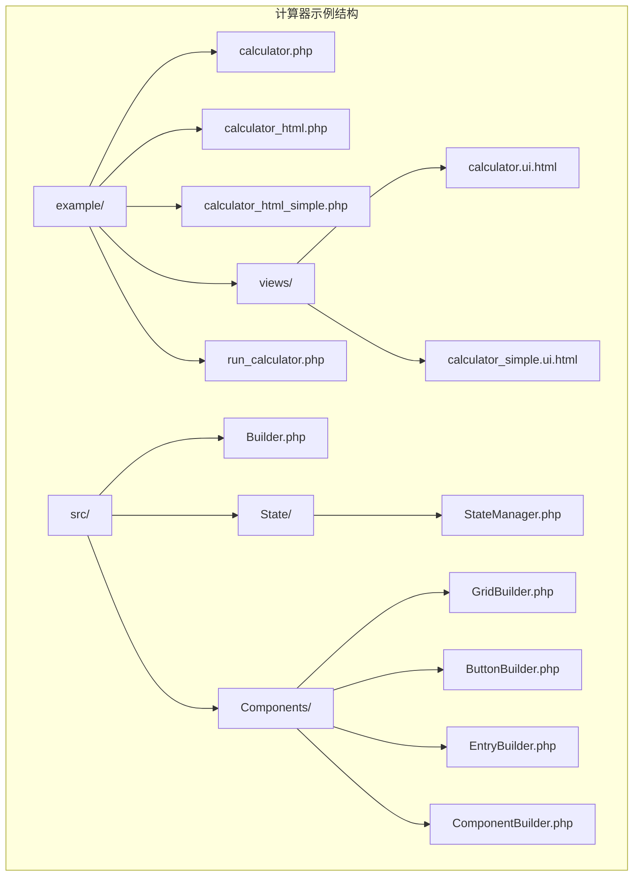
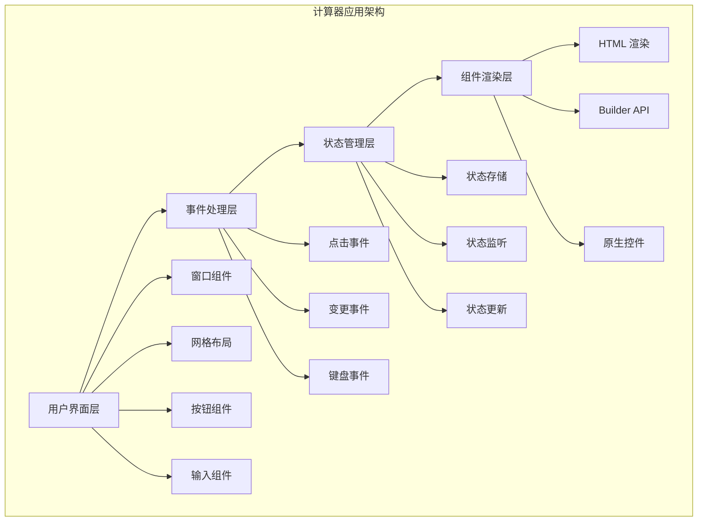
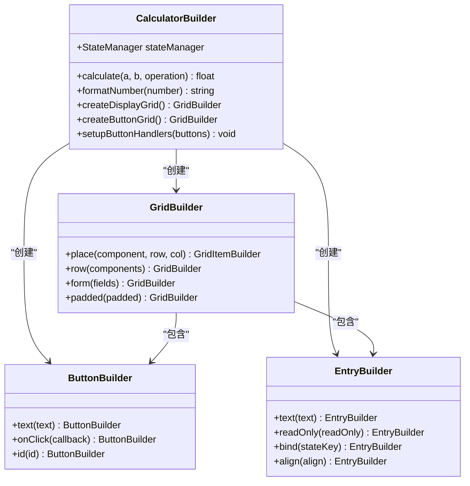
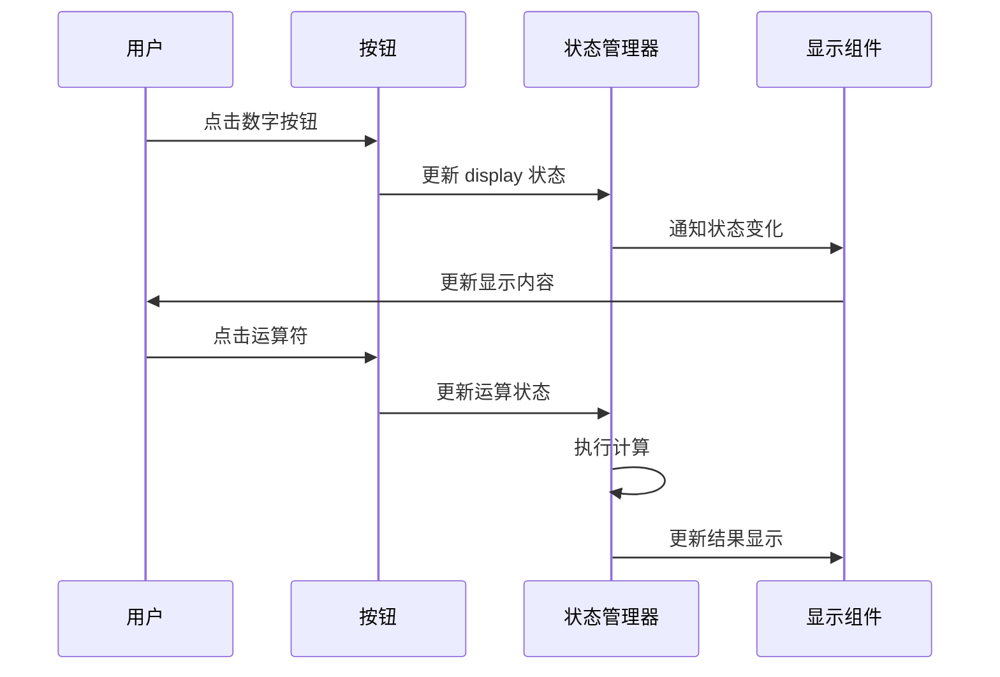
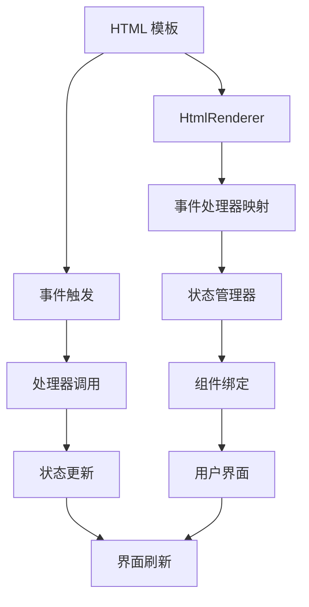
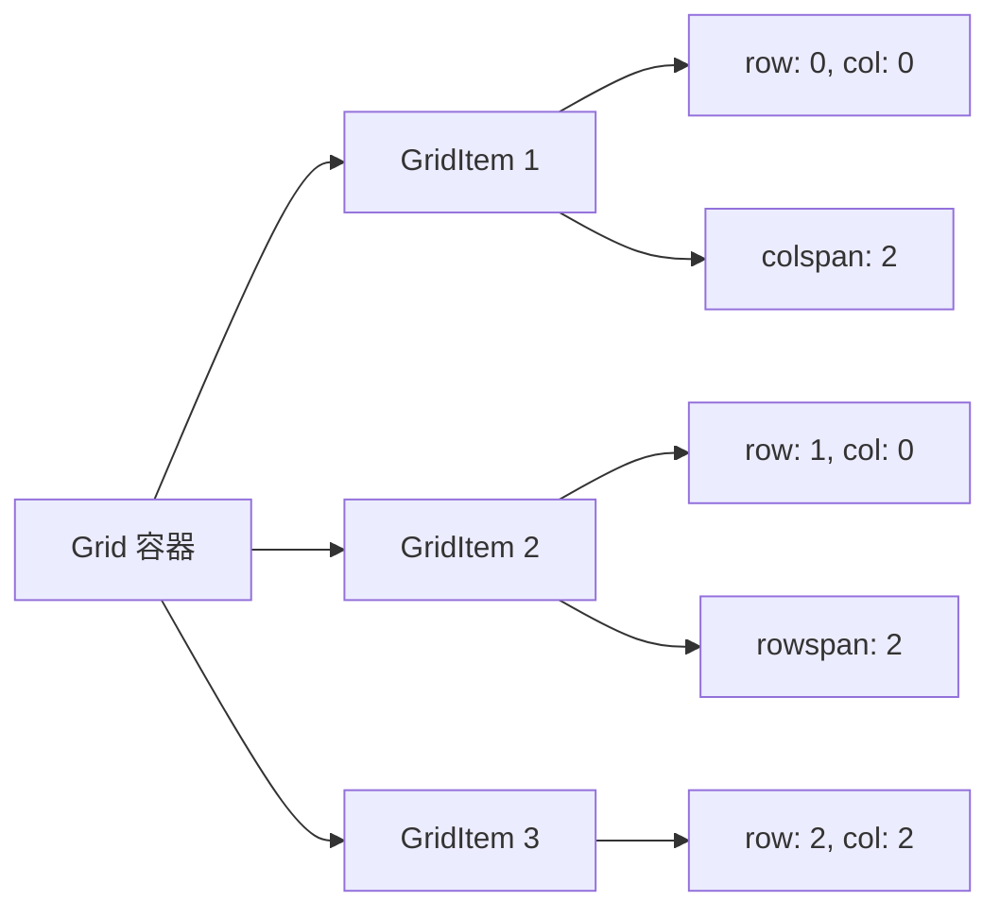
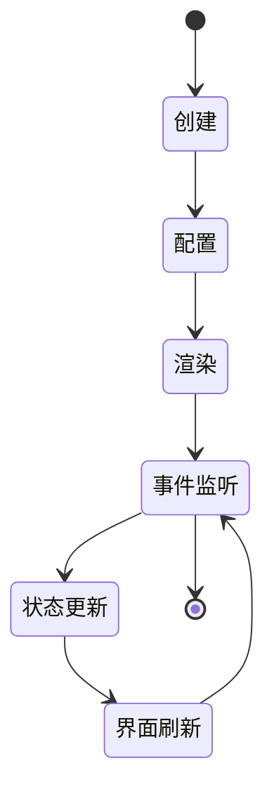
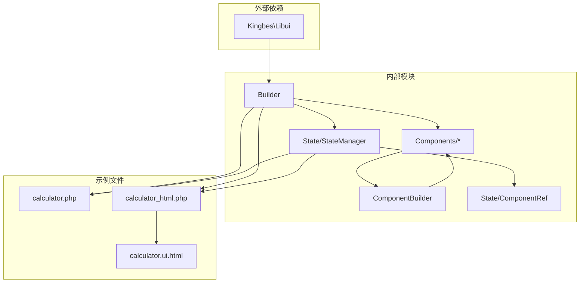

# Calculator Example

<cite>
**本文档中引用的文件**
- [calculator.php](file://example/calculator.php)
- [calculator_html.php](file://example/calculator_html.php)
- [calculator_html_simple.php](file://example/calculator_html_simple.php)
- [calculator.ui.html](file://example/views/calculator.ui.html)
- [calculator_simple.ui.html](file://example/views/calculator_simple.ui.html)
- [run_calculator.php](file://run_calculator.php)
- [Builder.php](file://src/Builder.php)
- [StateManager.php](file://src/State/StateManager.php)
- [GridBuilder.php](file://src/Components/GridBuilder.php)
- [ButtonBuilder.php](file://src/Components/ButtonBuilder.php)
- [EntryBuilder.php](file://src/Components/EntryBuilder.php)
- [ComponentBuilder.php](file://src/ComponentBuilder.php)
- [README.md](file://README.md)
</cite>

## 目录
1. [简介](#简介)
2. [项目结构](#项目结构)
3. [核心组件](#核心组件)
4. [架构概览](#架构概览)
5. [详细组件分析](#详细组件分析)
6. [依赖关系分析](#依赖关系分析)
7. [性能考虑](#性能考虑)
8. [故障排除指南](#故障排除指南)
9. [结论](#结论)

## 简介

libuiBuilder 是一个基于 PHP 的桌面应用程序开发框架，提供了直观且灵活的 GUI 开发体验。计算器示例展示了该框架的两种主要开发方式：Builder API 模式和 HTML 模板渲染模式。这个示例不仅演示了基本的计算器功能，还展示了状态管理、事件处理、布局系统等核心特性。

## 项目结构

计算器示例位于 `example/` 目录下，包含以下关键文件：

**图表来源**
- [calculator.php](file://example/calculator.php#L1-L238)
- [calculator_html.php](file://example/calculator_html.php#L1-L142)
- [Builder.php](file://src/Builder.php#L1-L153)

**章节来源**
- [calculator.php](file://example/calculator.php#L1-L238)
- [calculator_html.php](file://example/calculator_html.php#L1-L142)
- [run_calculator.php](file://run_calculator.php#L1-L63)

## 核心组件

计算器示例展示了 libuiBuilder 框架的核心组件：

### 状态管理系统
状态管理器负责维护应用的全局状态，支持响应式数据绑定和事件监听。

### 布局系统
- **Grid 布局**：精确的二维网格布局系统
- **容器组件**：窗口、盒子、网格等容器
- **控件组件**：按钮、输入框、标签等交互元素

### 事件处理系统
支持多种事件类型，包括点击事件、变更事件等。

**章节来源**
- [StateManager.php](file://src/State/StateManager.php#L1-L91)
- [GridBuilder.php](file://src/Components/GridBuilder.php#L1-L150)
- [ButtonBuilder.php](file://src/Components/ButtonBuilder.php#L1-L48)

## 架构概览

计算器示例采用分层架构设计：

**图表来源**
- [ComponentBuilder.php](file://src/ComponentBuilder.php#L1-L234)
- [Builder.php](file://src/Builder.php#L1-L153)

## 详细组件分析

### Builder API 模式计算器

Builder API 模式通过链式调用的方式构建用户界面：

**图表来源**
- [calculator.php](file://example/calculator.php#L36-L238)
- [GridBuilder.php](file://src/Components/GridBuilder.php#L60-L80)
- [ButtonBuilder.php](file://src/Components/ButtonBuilder.php#L39-L47)
- [EntryBuilder.php](file://src/Components/EntryBuilder.php#L66-L78)

#### 数学运算逻辑

计算器实现了完整的四则运算功能：

| 运算符 | 功能 | 实现方式 |
|--------|------|----------|
| + | 加法 | `calculate($a, $b, '+')` |
| - | 减法 | `calculate($a, $b, '-')` |
| × | 乘法 | `calculate($a, $b, '*')` |
| ÷ | 除法 | `calculate($a, $b, '/')` |

#### 状态管理流程

**图表来源**
- [calculator.php](file://example/calculator.php#L98-L208)
- [StateManager.php](file://src/State/StateManager.php#L26-L36)

**章节来源**
- [calculator.php](file://example/calculator.php#L1-L238)

### HTML 模板模式计算器

HTML 模板模式使用熟悉的 HTML 语法定义界面：

**图表来源**
- [calculator_html.php](file://example/calculator_html.php#L131-L142)
- [calculator.ui.html](file://example/views/calculator.ui.html#L1-L55)

#### 按钮事件处理

HTML 模板中的按钮事件处理：

| 按钮类型 | 事件处理器 | 功能描述 |
|----------|------------|----------|
| 数字按钮 | `handleNumber` | 输入数字字符 |
| 运算符按钮 | `handleOperation` | 设置运算操作 |
| 等于按钮 | `handleEquals` | 执行计算 |
| 清除按钮 | `handleClear` | 重置所有状态 |
| 小数点按钮 | `handleDecimal` | 添加小数点 |

**章节来源**
- [calculator_html.php](file://example/calculator_html.php#L1-L142)
- [calculator.ui.html](file://example/views/calculator.ui.html#L1-L55)

### 核心组件实现

#### Grid 布局系统

Grid 布局系统提供了精确的二维定位能力：

**图表来源**
- [GridBuilder.php](file://src/Components/GridBuilder.php#L60-L66)
- [calculator.ui.html](file://example/views/calculator.ui.html#L21-L49)

#### 组件生命周期

**图表来源**
- [ComponentBuilder.php](file://src/ComponentBuilder.php#L209-L231)
- [ButtonBuilder.php](file://src/Components/ButtonBuilder.php#L28-L36)

**章节来源**
- [GridBuilder.php](file://src/Components/GridBuilder.php#L1-L150)
- [ButtonBuilder.php](file://src/Components/ButtonBuilder.php#L1-L48)
- [EntryBuilder.php](file://src/Components/EntryBuilder.php#L1-L80)

## 依赖关系分析

计算器示例的依赖关系图：

**图表来源**
- [Builder.php](file://src/Builder.php#L5-L23)
- [ComponentBuilder.php](file://src/ComponentBuilder.php#L1-L10)
- [StateManager.php](file://src/State/StateManager.php#L1-L10)

**章节来源**
- [Builder.php](file://src/Builder.php#L1-L153)
- [StateManager.php](file://src/State/StateManager.php#L1-L91)

## 性能考虑

### 状态更新优化
- 使用批量更新减少不必要的重新渲染
- 状态变化监听器避免重复处理
- 组件引用缓存提高访问效率

### 内存管理
- 及时清理事件监听器
- 避免循环引用
- 合理使用组件引用

### 渲染性能
- Grid 布局相比嵌套容器更高效
- 按需更新界面组件
- 事件处理程序的合理组织

## 故障排除指南

### 常见问题及解决方案

#### 1. 界面不显示
**问题**：计算器窗口无法正常显示
**解决方案**：
- 检查 `App::init()` 是否正确调用
- 确认 `Builder::window()->show()` 被调用
- 验证依赖库是否正确安装

#### 2. 按钮无响应
**问题**：点击按钮没有反应
**解决方案**：
- 检查事件处理器是否正确绑定
- 验证状态管理器是否正常工作
- 确认组件 ID 是否唯一且正确

#### 3. 状态不同步
**问题**：界面显示与状态不一致
**解决方案**：
- 检查 `bind()` 方法是否正确使用
- 验证状态监听器是否注册
- 确认状态更新时机是否正确

**章节来源**
- [StateManager.php](file://src/State/StateManager.php#L26-L36)
- [ComponentBuilder.php](file://src/ComponentBuilder.php#L135-L146)

## 结论

libuiBuilder 的计算器示例成功展示了现代桌面应用开发的最佳实践：

### 主要优势
1. **双模式开发**：支持 Builder API 和 HTML 模板两种开发方式
2. **响应式状态管理**：自动化的数据绑定和状态同步
3. **灵活的布局系统**：强大的 Grid 布局满足复杂界面需求
4. **清晰的事件处理**：简洁的事件系统便于维护

### 技术特点
- **组件化架构**：模块化的组件设计便于扩展和维护
- **类型安全**：PHP 类型提示确保代码质量
- **测试友好**：完整的测试覆盖保证代码可靠性

### 应用价值
计算器示例不仅是学习 libuiBuilder 的优秀起点，也为开发者提供了：
- 实际的业务场景参考
- 不同开发模式的对比
- 最佳实践的展示
- 扩展功能的灵感来源

通过这个示例，开发者可以快速掌握 libuiBuilder 的核心概念，并将其应用到更复杂的桌面应用程序开发中。